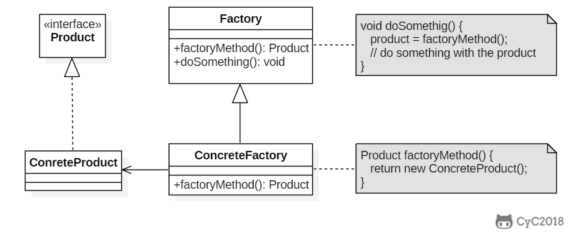
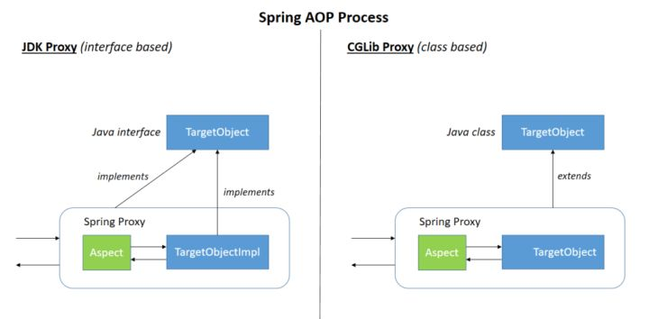
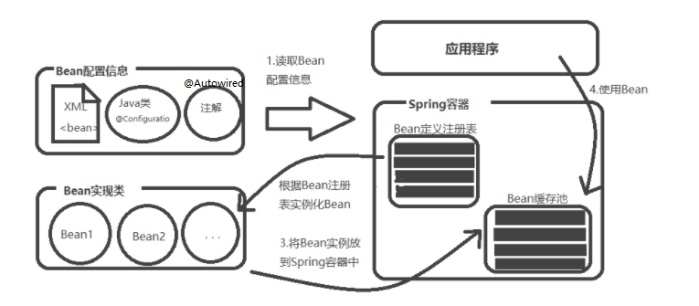

# 项目的一些问题：


## 0、分布式问题：

小的项目--gmall-user项目中所有的controller、service接口、service实现都在一个工程，通过**Spring的ioc**就可以实现互相调用。

随着架构不断增大，服务节点也越来越多，服务之间的调用和依赖关系也越来越复杂，
**需要有一个统一的中心来调度、路由、管理所有的服务**，基于这个中心构建的这个星型架构就是现在目前最主流的**SOA分布式架构**。

**整体以maven为基础，对项目进行分层架构。**


#### 项目中RPC体现在哪？

- Dubbo框架下，@Reference关键字实现分布式的远程服务对象的注入。 

- dubbo的服务订阅有两种方式，第一种是通过xml文件的标签`<dubbo:reference />`，第二种是通过注解`@Reference`。

- @Reference 的行为跟 @Autowired 类似 均实现了自动注入的过程 。

  dubbo也是采用了和@Autowired注入一样的原理，通过继承`InstantiationAwareBeanPostProcessor` 重写postProcessPropertyValues 方法来达到解析@Reference并实现依赖注入。


消费者每引用的一种服务，都会创建一个ReferenceBean， 如果多个地方使用@Reference引用同一个服务，需要看他们的的缓存key是否一样，如果都是一样的，那么就只会创建一个ReferenceBean，如果有些配置不一样，比如版本号不一致，则会创建创建不同的`ReferenceBean`对象，这也是他版本号能够起到的作用把。至此，`@Reference`注解已经解析完毕，并且服务引用的对象也已经创建了。


### **0、什么是SOA？**

SOA 是 Service-Oriented Architecture 的英文缩写，就是**面向服务的架构**。这里的服务可以理解为 **service 层业务服务**。

**将系统拆分为不同的服务单元，通过网络协议服务单元之间进行通信。**

服务单元完成一个特定功能(如：验证、支付、登录等等)，通过服务单元之间的集成组成完整的应用程序。

SOA 架构中由两个重要的角色: **服务提供者（Provider）和服务使用者（Consumer）**


**SOA的优点：**

```
1、更易维护:业务服务提供者和业务服务使用者的松散耦合关系。当需求发生变化的时候，不需要修改提供业务服务的接口，只需要调整业务服务流程或者修改操作即可，整个应用系统也更容易被维护。

2、更高的可用性:该特点是在于服务提供者和服务使用者的松散耦合关系上得以发挥与体现。使用者无须了解提供者的具休实现细节。

3、更好的伸缩性:依靠业务服务设计、开发和部署等所采用的架构模型实现伸缩性。使得服务提供者可以互相彼此独立地进行调整，以满足新的服务需求。
```

**SOA缺点：**

```
1、减低了系统的性能

2、系统之间交互需要使用远程通信，接口开发增加工作量
```


```
1、ZooKeeper是一个分布式的，开放源码的分布式应用程序协调服务，是Google的Chubby一个开源的实现，是Hadoop和Hbase的重要组件。
	它是一个为分布式应用提供一致性服务的软件，提供的功能包括：配置维护、名字服务、分布式同步、组服务等。
	
2、Dubbo是Alibaba开源的分布式服务框架，它最大的特点是按照分层的方式来架构，使用这种方式可以使各个层之间解耦合（或者最大限度地松耦合）。
从服务模型的角度来看，Dubbo采用的是一种非常简单的模型，要么是提供方提供服务，要么是消费方消费服务，所以基于这一点可以抽象出服务提供方（Provider）和服务消费方（Consumer）两个角色。关于注册中心、协议支持、服务监控等内容。
```


### 1、dubbo

 

Dubbo只支持Java语言。

Dubbo 的架构主要包含四个角色，其中 Consumer 是服务消费者，Provider 是服务提供者，Registry 是注册中心，Monitor 是监控系统。具体的交互流程是 Consumer 一端通过注册中心获取到 Provider 节点后，通过 Dubbo 的客户端 SDK 与 Provider 建立连接，并发起调用。Provider 一端通过 Dubbo 的服务端 SDK 接收到 Consumer 的请求，处理后再把结果返回给 Consumer。


 


**调用关系：**

0、服务容器负责启动，加载，运行服务提供者。
1、服务提供者在启动时，向注册中心注册自己提供的服务。
2、服务消费者在启动时，向注册中心订阅自己所需的服务。
3、注册中心返回服务提供者地址列表给消费者，如果有变更，注册中心将基于长连接推送变更数据给消费者。
4、服务消费者，从提供者地址列表中，基于软负载均衡算法，选一台提供者进行调用，如果调用失败，再选另一台调用。
5、服务消费者和提供者，在内存中累计调用次数和调用时间，定时每分钟发送一次统计数据到监控中心。


**Dubbo对分布式事务的处理：**
分布式事务暂不支持。用户可以自己根据实际情况来实现分布式事务，比如：
1）结合RocketMQ消息中间件实现的可靠消息最终一致性
2）TCC补偿性事务解决方案
3）最大努力通知型方案


- [一些面试题](https://www.cnblogs.com/hongdada/p/8572513.html)


**Dubbo 和 Spring Cloud 的区别：**

```
1、Dubbo使用RPC通信，SpringCloud使用RESTful方式；
2、组成不一样：
dubbo的服务注册中心为Zookeerper，服务监控中心为dubbo-monitor,无消息总线，服务跟踪、批量任务等组件；
spring-cloud的服务注册中心为spring-cloud netflix  Enruka，服务监控中心为spring-boot admin,有消息总线，数据流、服务跟踪、批量任务等组件；
```

**Dubbo内置了三种服务容器：Spring Container、Jetty Container、Log4j Container**


### 2、序列化与反序列化：

[我的博客：详解序列化与反序列化](https://blog.csdn.net/wang_chaochen/article/details/117134199)

把Java对象转换为字节序列的过程称为对象的序列化。
把字节序列恢复为对象的过程称为对象的反序列化。


*序列化的最终目的就是为了对象可以跨平台存储及进行网络传输。
进行跨平台存储和网络传输的方式就是IO，IO支持的数据格式是字节数组。
并且我们还需要将字节数组还原回对象的原来模样，因此需要在对象转换成字节数组时就制定一种规则--序列化*


 1. 把对象的字节序列永久地保存到硬盘上，通常存放在一个文件中 --（持久化对象）
    --在某些应用中，需要对某些对象进行序列化，离开内存空间，入住物理硬盘，以便长期保存。
    	--Web服务器中的Session对象，当有10万用户并发访问，可能出现10万个Session对象，内存可能吃不消，于是Web容器就会把一些Session先序列化到硬盘中，需要用的时候，再把保存在硬盘中的对象还原到内存中。
 2. 在网络上传送对象的字节序列 --（网络传输对象）
    --当两个进程在进行远程通信时，进程之间可以发送各种类型的数据。无论是何种类型的数据，都会以二进制序列的形式在网络上进行传输。
    	--发送方需要把这个Java对象转换为字节序列，才能在网络上传送；接收方需要把字节序列再恢复为Java对象。


只有实现了Serializable 和 Externalizable 接口的类的对象才能被序列化。


### 3、RPC

[我的博客：RPC](https://blog.csdn.net/wang_chaochen/article/details/117066207)


分布式的应用可以借助RPC来完成机器之间的调用。

RPC（Remote Procedure Call）是远程过程调用的简称，它是一种通过网络从远程计算机程序上请求服务，而不需要了解底层网络技术的协议。

RPC协议假定某些传输协议的存在，如TCP或UDP，为通信程序之间携带信息数据。
在OSI网络通信模型中，RPC跨越了传输层和应用层。


#### 为什么需要RPC？

主要是在几个进程中（应用分布在不同的机器上），**无法共用内存空间**，
或者在一台机器内**通过本地调用无法完成相关的需求**（如不同系统之间的通信，或者不同组织之间的通信）
或者由于机器的横向扩展，需要在**多台机器组成的集群上**部署应用。

**RPC的实现主要的两种类型：**

 1. 一种以http为主，纯粹的http请求，返回结果，
 2. 一种以TCP/IP为主，类似于实现一个服务代理，屏蔽网络请求，就像纯粹的本地调用一样（当然也可能是基于http协议封装的框架、如spring cloud的Fetch技术）


#### RPC原理及实现：

RPC允许一台计算机调用另一台计算机上的程序得到结果，而代码中不需要做额外的编程，就像在本地调用一样。
RPC采用客户机/服务器模式。请求程序就是一个客户机，而服务提供程序就是一个服务器。


**在RPC框架中主要有三个角色：**

 - Client 客户机：调用远程服务的服务消费方
 - Server 服务器：暴露服务的服务提供方
 - Registry 注册中心：服务注册与发现的注册中心


#### 实现步骤：

**1、建立通信**

首先要解决机器之间的通信问题，在客户端和服务器之间建立TCP连接，远程调用的相关数据都在连接中进行传输交换。

通常这个连接可以是按需连接（需要调用的时候就先建立连接，调用结束后就立马断掉），也可以是长连接（客户端和服务器建立起连接之后保持长期持有，不管此时有无数据包的发送，可以配合心跳检测机制定期检测建立的连接是否存活有效），多个远程过程调用共享同一个连接。

**2、服务寻址**

解决寻址的问题：即A机器上的应用A要调用B机器上的应用B，那么此时对于A来说如何告知底层的RPC框架所要调用的服务具体在哪里呢？

通常情况下我们需要提供B机器（主机名或IP地址）以及特定的端口，然后指定调用的方法或者函数的名称以及入参出参等信息，这样才能完成服务的一个调用。比如基于Web服务协议栈的RPC，就需要提供一个endpoint URI，或者是从UDDI服务上进行查找。如果是RMI调用的话，还需要一个RMI Registry来注册服务的地址。

**3、网络传输**

（1）序列化

当A机器上的应用发起一个RPC调用时，调用方法和其入参等信息需要通过底层的网络协议如TCP传输到B机器，由于网络协议是基于二进制的，所有我们传输的参数数据都需要先进行序列化（Serialize）或者编组（marshal）成二进制的形式才能在网络中进行传输。然后通过寻址操作和网络传输将序列化或者编组之后的二进制数据发送给B机器。

（2）反序列化

当B机器接收到A机器的应用发来的请求之后，又需要对接收到的参数等信息进行反序列化操作（序列化的逆操作），即将二进制信息恢复为内存中的表达方式，然后再找到对应的方法（寻址的一部分）进行本地调用（一般是通过生成代理Proxy去调用, 通常会有JDK动态代理、CGLIB动态代理、Javassist生成字节码技术等），之后得到调用的返回值。

**4、服务调用**

B机器进行本地调用（通过代理Proxy）之后得到了返回值，此时还需要再把返回值发送回A机器，同样也需要经过序列化操作，然后再经过网络传输将二进制数据发送回A机器，而当A机器接收到这些返回值之后，则再次进行反序列化操作，恢复为内存中的表达方式，最后再交给A机器上的应用进行相关处理（一般是业务逻辑处理操作）。


### 4、RPC的调用过程：

**RPC架构组件：**

1、客户端（Client）:服务调用方（服务消费者） 
2、客户端存根（Client Stub）:存放服务端地址信息，将客户端的请求参数数据信息打包成网络消息，再通过网络传输发送给服务端 
3、服务端存根（Server Stub）:接收客户端发送过来的请求消息并进行解包，然后再调用本地服务进行处理 
4、服务端（Server）:服务的真正提供者

同步调用的一次完整的RPC调用流程--如图：


```
1、服务消费者（client客户端）通过本地调用的方式调用服务 
2、客户端存根（client stub）接收到调用请求后负责将方法、参数等信息序列化成能够进行网络传输的消息体 
3、客户端存根（client stub）找到远程的服务地址，并且将消息通过网络发送给服务端 
4、服务端存根（server stub）收到消息后进行解码（反序列化操作） 
5、服务端存根（server stub）根据解码结果调用本地的服务进行相关处理 
6、本地服务执行具体业务逻辑并将处理结果返回给服务端存根（server stub） 
7、服务端存根（server stub）将返回结果重新打包成消息（序列化）并通过网络发送至消费方 
8、客户端存根（client stub）接收到消息，并进行解码（反序列化） 
9、服务消费方得到最终结果
```


## 1、并发查询问题：

为了缓解数据库的压力，使用Redis缓存减轻数据库压力。

```
redis存储结构是：jedis.set("sku:" + skuId + ":info", JSON.toJSONString(pmsSkuInfo));

String OK = jedis.set("sku:" + skuId + ":lock", "token", "nx", "px", 10 * 1000);
```

先查缓存，缓存中没有再去数据库中查。

当前线程使用随机字符串作为分布式锁，不给数据库太大压力。线程获得锁有10秒的过期时间，（这里如果查询到不存在的数据，设置一个过期时间，防止缓存穿透问题）。访问完数据库，释放锁，使用token确认删掉的是自己的锁。如果没能获取到锁进行自旋。

#### **高并发环境下可能遇到的问题：**

1、	如果redis宕机了，或者链接不上，怎么办？

	1、配置主从复制，配置哨兵模式，一旦发现主机宕机，让下一个从机当做主机。
	2、最坏的情况，只能关闭Redis连接，去查询数据库。但数据量大，数据库也会宕机。

2、	如果redis缓存在高峰期到期失效，在这个时刻请求会向雪崩一样，直接访问数据库如何处理？

	设置条件查询判断，判断redis缓存里是否有数据，如果没有，则去往数据库连接。
	加分布式锁，利用redis的单线程+多路IO复用技术，原子性原理，让其它的线程请求等待，
	假若第一个线程进去获取到分布式锁在查询数据的途中宕掉了，不能让其它线程一直等待，
	设置等待一定时间判断是否取回数据，如果没有，递归调用自己的方法让第二个线程继续拿分布式锁查询数据库。
	从数据库拿到数据时，把数据值设置到redis数据库缓存中，设置失效时间，避免占内存，方便使用提高效率。

3、	 如果用户不停地查询一条不存在的数据，缓存没有，数据库也没有，那么会出现什么情况，如何处理？

	如果数据不存在，缓存中没有，数据库也没有，当然如果不设置判断，会一直调用数据库，
	使数据库效率降低，访问量大时甚至会宕机。-----缓存击穿
	
	解决方案：
	从数据库查询，如果数据库没有，则返回值为Null，判断数据库返回的值，
	如果为Null，则自定义把标识的字段存到Redis中，用key,value的方法，jedis.setex(key,"empty")，
	设置失效时间跟具体情况而定，然后调用String json=jedis.get(key),判断是否获取的值"empty".equal(json),如果相等，
	则抛出自定义异常，给用户提示，或者直接return null。
	这样用户再次查询的时候由于先从reids缓存中查询，redis会有对应的Key获取之前设置的value值，
	这样就不会再次调用数据库，影响效率等问题。

4、如果在redis中的锁已经过期了，然后锁过期的请求执行完毕回来删锁，删了别的线程的锁，怎么办？

	设置随机的token锁，删锁之前，get一下key，看下value是不是自己的token。

5、如果碰巧在查询redis锁的时候没过期，在查完要删的一瞬间过期了，又删了别的线程的锁，怎么办？

	可以使用lua脚本在查询到key的同时删除这个key，防止高并发下的意外的发生
	去除了读和写之间的时间间隙，能够保证删除的是自己的锁
		1.lua脚本是作为一个整体执行的.所以中间不会被其他命令插入;
		2.可以把多条命令一次性打包,所以可以有效减少网络开销;
		3.lua脚本可以常驻在redis内存中,所以在使用的时候,可以直接拿来复用.也减少了代码量.


#### **缓存问题：**

 1、缓存雪崩：缓存中的很多key失效，导致数据库负载过重宕机

         * 缓存时采用了相同的过期时间，导致缓存在某一时刻同时失效，导致的db崩溃
         * 解决：设置不同的缓存失效时间
         *

*缓存击穿和缓存穿透：失去了redis的拦截高并发的能力，直接打到数据库上*

2、缓存穿透：利用不存在的key去攻击mysql数据库

         * 是指查询一个一定不存在的数据，由于缓存是不命中，将去查询数据库，但是数据库也无此记录，
         * 并且处于容错考虑，我们没有将这次查询的null写入缓存，这将导致这个不存在的数据每次请求都要到存储层去查询，
         * 失去了缓存的意义。在流量大时，可能DB就挂掉了，要是有人利用不存在的key频繁攻击我们的应用，这就是漏洞。
         *
         * 解决: 空结果进行缓存设置过期时间，但它的过期时间会很短，最长不超过五分钟。

 3、缓存击穿：在正常的访问情况下，如果缓存失效，如果保护mysql，重启缓存的过程

         * 对于一些设置了过期时间的key，如果这些key可能会在某些时间点被超高并发地访问，是一种非常“热点”的数据。
         * 这个时候，需要考虑一个问题：如果这个key在大量请求同时进来前正好失效，那么所有对这个key的数据查询都落到db，我们称为缓存击穿。
         * 是某一个热点key在高并发访问的情况下，突然失效，导致大量的并发打进mysql数据库的情况
         *
         * 解决：使用redis数据库的分布式锁，解决mysql的访问压力问题
         * 
         * 1、redis自带的分布式锁，set px nx
         * -----  String token = UUID.randomUUID().toString();
         * ------ String lock = jedis.set(key, token, "NX", "EX",20);
         * 2、redission框架：带juc的lock锁的redis客户端,是一个redis的juc实现（既有jedis功能又有juc功能）
         *-------- jedis本身无法实现多线程锁的机制
         * ------- synchronized () 只能解决本地的多线程并发问题

## 2、如何防止库存超卖？--数据库锁

如何解决库存超卖现象？

	在高并发的情况下，多个人同时抢购同一库存时，由于数据库的读写操作可以并行执行的原因，会导致修改库存时，库存不足出现超卖现象。
	---redis解决：分布式锁、lua脚本、Redisson
	---mysql解决：用锁将查询库存的操作和写入库存的操作互斥
		(1)悲观锁解决库存问题：
			在select时，将select语句加入一个行锁，与更新库存是语句互斥，可以保证在查询库存时库存不被修改。
		(2)乐观锁解决库存问题：
			在select时，加入一个版本字段，每次更新，同时查询和更新版本字段，如果版本字段发生变化，则SQL语句不会执行成功。
			Select kc,version from sku_info where sku_id = ?----查询两个字段
			Update sku_info set kc = kc - 1, version = version + 1 where sku_id = ? and version = version


MyISAM--查询用---不存在事务---基本已经淘汰
InnoDB数据库引擎--事务型--支持行锁、表锁----三种锁指行锁、表锁、页锁

**表锁**

在偏读型数据库中使用表锁----如MyISAM
--很少用表锁--安全--

Lock table 表名
Unlock tables

写锁和读锁阻塞（读写互斥），读与读共享，写和写阻塞（写写互斥）

**行锁**

------行锁支持事务----没有行锁就没有事务
------没开启事务就是默认提交---开启事务后提交需要手动commit

------行锁可以让读读互斥，可以避免在查询到库存时，库存已经被修改的情况发生
-----update自带行锁---事务

-----在无索引操作时，注意锁的升级(行锁升级表锁)


```sql
--- 如何锁定一行？--加上一个行锁
-----查询加上行锁for update ,避免查询和更新同时发生，导致读到的库存数量发生不可重复读的错误
set autocommit = 0;
select kc from product where productname = '电脑' for update
update product set kc = kc - 1 where productname = '电脑'
commit
```


**间隙锁**

当使用范围条件不是相等条件检索数据时，并请求共享或排他锁时，InnoDB会给符合条件的已有数据记录的索引项加锁。
对于键值在条件范围内但是并不存在的记录叫作“间隙”(GAP)
InnoDB也会对这个间隙加锁--这种锁机制就是间隙锁(Next-Key锁)

可能会锁定一个并不存在的记录。
可能也会导致锁的升级，危害别的数据。---因此查询时尽量不使用范围条件检索

**页锁**

开销和加锁时间介于表锁和行锁之间，会出现死锁；
锁定粒度介于表锁和行锁之间，并发度一般。


**数据库的死锁**
----多线程死锁

形成了一种因果关系，死循环。---彼此占用了对方的解锁的钥匙

## 3、登录：

认证中心
jwt


1 点击登录按钮，在登录页面输入用户名和密码通过用户名和密码验证用户登录是否成功后，生成jwt的token返回给search.gmall.com/index，在拦截器里面将返回的token写入cookie

2 点击结算按钮，拦截器拦截请求
A该用户没有登录，并且结算请求时必须登录的，将用户打回认证中心进行登录
B该用户没有登录，并且结算请求时没有登录也可以访问，放行

3 在被拦截登录后，返回原始请求(携带登录成功后颁发的token)

4 原始请求的拦截器第二次拦截请求，拦截请求后，将返回的token写入cookie


## 4、支付：


	

	1 用户请求谷粒商城进行支付
	2 谷粒商城返回给用户一个跳转支付宝的链接(带着谷粒商城和支付宝合作的appId)
	3 用户的浏览器和支付宝的服务器交互过程中安全问题
		非对称密钥加密(rsa),两个超大质数乘机的因式分解不可逆原理
		通过rsa非对称密钥生成的网络签名，可以用来验证请求发送者的身份

#### **消息队列的应用：**

	------延迟队列
	0 提交订单的延迟检查(支付服务)------检查支付结果
	PAYMENT_CHECK_QUEUE
	
	-----消息队列
	1 支付完成(支付服务)
	PAYMENT_SUCCESS_QUEUE
	
	2 订单已支付(订单服务)
	ORDER_PAY_QUEUE
	
	3 库存锁定(库存系统)
	SKU_DEDUCT_QUEUE
	
	4 订单已出库(订单服务)
	ORDER_SUCCESS_QUEUE


## 5、为什么需要ElasticSearch？

Elasticsearch 是一个分布式的搜索与分析引擎。

- **0、用数据库，也可以实现搜索的功能，为什么还需要搜索引擎呢？**

数据库（理论上来讲，ES 也是数据库，这里的数据库，指的是关系型数据库），首先是**存储**，搜索只是顺便提供的功能，

而搜索引擎，首先是**搜索**，但是不把数据存下来就搜不了，所以只好存一存。

- **1、精确匹配和相关性匹配** 

数据库是基于[精确匹配]

和「精确匹配」相比，「相关性匹配」更贴近人的思维方式。

相关性匹配不是数据库中的模糊查询，「模糊查询」，其实还是「精确匹配」

- **2、搜索和分析，不只是搜索，还有分析**  

躺在磁盘里的数据是没有价值的，而ES则让你存放在里面的数据，拥有了无限的探索力。

> Elasticsearch 真正强大之处在于可以从无规律的数据中找出有意义的信息 —— 从“大数据”到“大信息”。 —— 《Elasticsearch 权威指南》

**关系型数据库，把原本非常形象的对象，拍平了，拍成各个字段，存在数据库，查询时，再重新构造出对象；ES则是文档存储，把对象原原本本地放进去，取出时直接取出。**

Mysql基于B+树索引，来实现快速检索，ES则基于**倒排索引**，对于文档搜索来说，倒排索引在性能和空间上都有更加明显的优势。


## 项目中的ES

### 1、搜索

 

**搜索**：**计算机根据用户输入的关键词进行匹配，从已有的数据库中摘录出相关的记录反馈给用户。**

- 若使用**传统关系型数据库**：
  - 1、对于传统的关系性数据库对于关键词的查询，只能逐字逐行的匹配，性能非常差。
  - 2、匹配方式不合理，比如搜索“小密手机” ，如果用like进行匹配， 根本匹配不到。但是考虑使用者的用户体验的话，除了完全匹配的记录，还应该显示一部分近似匹配的记录，至少应该匹配到“手机”。
    
- 使用**专业全文索引**进行搜索：
  全文搜索引擎目前主流的索引技术就是**倒排索引的方式**。-----**用内容去匹配索引**
  - 传统的保存数据的方式都是：记录→单词
  - 而倒排索引的保存数据的方式是：单词→记录
    		

**搜索引擎匹配搜索：**
	处理分词、构建倒排索引都通过Lucene实现。

	1、基于分词技术构建倒排索引：-----在内容上建立索引，用内容去匹配索引---B+树
		首先每个记录保存数据时，都不会直接存入数据库。
		系统先会对数据进行分词，然后以倒排索引结构保存。
	2、等到用户搜索的时候，会把搜索的关键词也进行分词，会把“红海行动”分词分成：红海和行动两个词。
	
	这样的话，先用红海进行匹配，得到id=1和id=2的记录编号，再用行动匹配可以迅速定位id为1,3的记录。
	那么全文索引通常，还会根据匹配程度进行打分，显然1号记录能匹配的次数更多。
	所以显示的时候以评分进行排序的话，1号记录会排到最前面。而2、3号记录也可以匹配到。


### 2、全文检索工具Elasticsearch

lucene只是一个提供全文搜索功能类库的核心工具包，而真正使用它还需要一个完善的服务框架搭建起来的应用。------lucene是类似于jdk，而搜索引擎软件就是tomcat


**Elasticsearch**是一个基于Apache Lucene(TM)的开源搜索引擎。无论在开源还是专有领域，Lucene可以被认为是迄今为止最先进、性能最好的、功能最全的搜索引擎库。
**特点：**
	1、分布式的实时文件存储，每个字段都被索引并可被搜索
	2、分布式的实时分析搜索引擎--做不规则查询
	3、可以扩展到上百台服务器，处理PB级结构化或非结构化数据
	
Elasticsearch也使用Java开发并使用Lucene作为其核心来实现所有索引和搜索的功能，但是它的目的是通过简单的RESTful API来隐藏Lucene的复杂性，从而让全文搜索变得简单。

**ES能做什么？**
	全文检索（全部字段）、模糊查询（搜索）、数据分析（提供分析语法，例如聚合）

	elasticsearch和solr,----都是基于lucene搭建的，可以独立部署启动的搜索引擎服务软件
		国内百度、京东、新浪都是基于elasticSearch实现的搜索功能。
		国外就更多了 像维基百科、GitHub、Stack Overflow等等也都是基于ES的
		区别：
			1. Solr 利用 Zookeeper 进行分布式管理，而 Elasticsearch 自身带有分布式协调管理功能;
			2. Solr 支持更多格式的数据，而 Elasticsearch 仅支持json文件格式；
			3. Solr 官方提供的功能更多，而 Elasticsearch 本身更注重于核心功能，高级功能多有第三方插件提供；
			4. Solr 在传统的搜索应用中表现好于 Elasticsearch，但在处理实时搜索应用时效率明显低于 Elasticsearch--附近的人

将ES **配置**在虚拟机上：
	--比较烦人，要切换root和其它用户。修改默认线程数、最大文件数、最大内存数
	
	修改四个地方：
		elasticSearch.yml es的启动host地址
		jvm.options配置es的虚拟机内存
		limits.conf配置linux的线程内存和文件
		sysctl.conf配置系统允许的软件运行内存

**ES基本概念：**

 


	1、cluster	整个elasticsearch 默认就是集群状态，整个集群是一份完整、互备的数据。
	2、node	集群中的一个节点，一般只一个进程就是一个node
	3、shard	分片，即使是一个节点中的数据也会通过hash算法，分成多个片存放，默认是5片。
	4、Index(库)	相当于rdbms的database, 对于用户来说是一个逻辑数据库，虽然物理上会被分多个shard存放，也可能存放在多个node中。
	5、Type(表)	类似于rdbms的table，但是与其说像table，其实更像面向对象中的class , 同一Json的格式的数据集合。
	6、Document(一条数据)	类似于rdbms的 row、面向对象里的object
	7、Field(字段)	相当于字段、属性

通过(9200端口)http协议进行交互：http://192.168.199.129:9200/_cat/indices?v
开发工具 Kibana（5601端口）：配置host、es.url，---nohup ./kibana &

**ES简单的增删改查**
PUT、DELETE、POST、GET


**中文分词**

elasticsearch本身自带的中文分词，就是单纯把中文一个字一个字的分开，根本没有词汇的概念。
安装中文分词器ik。
	ik(中英文分词器)有两个：
		1 ik_smart（简易分词--最少切分）我、是、中国人
		2 ik_max_word（尽最大可能分词--最细粒度划分）我、是、中国人、中国、人

**相关性算分**

	指文档与查询语句间的相关度，通过倒排索引可以获取与查询语句相匹配的文档列表
	
	如何将最符合用户查询需求的文档放到前列呢？
		本质问题是一个排序的问题，排序的依据是相关性算分，确定倒排索引哪个文档排在前面
	
	影响相关度算分的参数：
		1、TF(Term Frequency)：词频，即单词在文档中出现的次数，词频越高，相关度越高
		2、Document Frequency(DF)：文档词频，即单词出现的文档数
		3、IDF(Inverse Document Frequency)：逆向文档词频，与文档词频相反，即1/DF。
			即单词出现的文档数越少，相关度越高（如果一个单词在文档集出现越少，算为越重要单词）
		4、Field-length Norm：文档越短，相关度越高

TF/IDE模型、BM25模型

**ElasticSearch集群**
克隆一个虚拟机做集群。--修改配置文件elasticserach.yml

1、简介

	一个节点(node)就是一个Elasticsearch实例，
	而一个集群(cluster)由一个或多个节点组成，它们具有相同的cluster.name，它们协同工作，分享数据和负载。
	当加入新的节点或者删除一个节点时，集群就会感知到并平衡数据（同步）。
	
	几个基本概念：
		1、节点：一个节点就是一个es的服务器，
			es集群中，主节点负责集群的管理和任务的分发，一般不负责文档的增删改查
		2、片：分片是es的实际物理存储单元(一个lucene的实例)
		3、索引：索引是es的逻辑单元，一个索引一般建立在多个不同机器的分片上
		4、复制片：每个机器的分片一般在其他机器上会有两到三个复制片(目的是提高数据的容错率)
		5、容错：一旦集群中的某些机器发生故障，那么剩余的机器会在主机点的管理下，重新分配资源(分片)
		6、分片的路由：写操作(新建、删除)只在主分片上进行，然后将结果同步给复制分片
			Sync 主分片同步给复制成功后，才返回结果给客户端
			Async 主分片在操作成功后，在同步复制分片的同时返回成功结果给客户端
			读操作(查询)可以在主分片或者复制分片上进行


2、节点

	1、集群中一个节点会被选举为主节点(master)
	2、主节点临时管理集群级别的一些变更，例如新建或删除索引、增加或移除节点等。
	3、主节点不参与文档级别的变更或搜索，这意味着在流量增长的时候，该主节点不会成为集群的瓶颈。
	4、任何节点都可以成为主节点。
	5、用户，我们能够与集群中的任何节点通信，包括主节点。
	6、每一个节点都知道文档存在于哪个节点上，它们可以转发请求到相应的节点上。
	7、我们访问的节点负责收集各节点返回的数据，最后一起返回给客户端。这一切都由Elasticsearch处理。

3、集群健康

	集群健康有三种状态：green、yellow或red。
	green	所有主要分片和复制分片都可用
	yellow	所有主要分片可用，但不是所有复制分片都可用
	red	不是所有的主要分片都可用

4、集群分片

	索引只是一个用来指向一个或多个分片(shards)的“逻辑命名空间(logical namespace)”.
	
	分片(shard)是一个最小级别“工作单元(worker unit)”,它只是保存了索引中所有数据的一部分，是一个Lucene实例，并且它本身就是一个完整的搜索引擎。
	文档存储在分片中，并且在分片中被索引，但应用程序不会直接与分片通信，而是直接与索引通信。
	
	1、主分片
	索引中的每个文档属于一个单独的主分片，所以主分片的数量决定了索引最多能存储多少数据。
		理论上主分片能存储的数据大小是没有限制的，限制取决于你实际的使用情况。
		分片的最大容量完全取决于你的使用状况：硬件存储的大小、文档的大小和复杂度、如何索引和查询你的文档，以及你期望的响应时间。
	2、副分片
	复制分片只是主分片的一个副本，它可以防止硬件故障导致的数据丢失，
	同时可以提供读请求，比如搜索或者从别的shard取回文档。
	
	当索引创建完成的时候，主分片的数量就固定了，但是复制分片的数量可以随时调整。

### 3、搜索模块

**1、整合es到项目**

以Rest Api为主的missing client，最典型的就是jest。 
Jest客户端可以直接使用dsl语句拼成的字符串，直接传给服务端，然后返回json字符串再解析。

在search-service中引入jest和jna的pom依赖。
在parent中将版本号纳入管理。
spring-boot-starter-data-elasticsearch不用管理版本号，版本跟随springboot。

配置文件中配置jest：spring.elasticsearch.jest.uris=http://192.168.199.129:9200

**2、得到商品列表**

	1、通过首页的3级分类进入，按照分类id查询对应的属性和属性值列表。
	2、直接通过搜索栏输入文字进入，根据sku的查询结果涉及的属性值，再去查询数据库显示属性文字列表。

### 实现步骤：
**1、数据结构的准备**

通过ES的mapping定义商品的数据结构：

	ES的mapping定义-----基于整个库
	MySQL数据结构字段定义------基于整个表

数据结构：

		1 商品名称(展示/查询)
		2 商品价格(展示/查询)
		3 商品图片(展示)
		4 平台属性和属性值的列表(查询)
		5 商品描述(展示/查询)
		6 热度值(查询)
		7 三级分类id(查询)
		8 商品id
		9 主键

参数结构：

	关键字(商品名称(展示/查询) 5 商品描述(展示/查询) 2 商品价格(展示/查询))
	平台属性和属性值的列表(查询)
	三级分类id(查询)

 

代码实现：


```json
PUT gmall
{
 "mappings": {
   "PmsSkuInfo":{//表名
     "properties": {//属性
       "id":{
        "type": "keyword",
        "index": true
      },
      "skuName":{
        "type": "text",
        "analyzer": "ik_max_word"
      },
      "skuDesc":{
        "type": "text"
        , "analyzer": "ik_smart"
      },
      "catalog3Id":{
        "type": "keyword"
      },
      "price":{
        "type": "double"
      },
      "skuDefaultImg":{
        "type": "keyword",
        "index": false
      },
      "hotScore":{
        "type": "double"
      },
      "productId":{
        "type": "keyword"
      },
      "skuAttrValueList":{
        "properties": {
          "attrId":{
            "type":"keyword"
          },
          "valueId":{
            "type":"keyword"
          }
        }
      }
     } 
   }
 } 
}

```

**2、初始化项目**

**搜索页面平台属性列表**

平台属性列表是**从搜索结果中抽取**出来的，不是根据三级分类id查询的所有平台属性的集合

- 1、**es中使用aggs聚合函数抽取平台属性**---aggs与query平级
  对skuAttrValueList中的valueId进行聚合
  

```java
TermsBuilder groupby_attr = AggregationBuilders.terms("groupby_attr").field("skuAttrValueList.valueId");
searchSourceBuilder.aggregation(groupby_attr);
```

- **2、使用java代码抽取平台属性**
  - A 根据skuId去mysql中查询平台属性值的id集合(不推荐)
  - B 直接用java集合进行处理---用set集合将不重复的属性值id抽取出来


## 补充问题：

#### 前后端的跨域问题：

```
1、前端127.0.0.1:8888、后端127.0.0.1:8082
2、前端和后端因为来自不同的网域，所以在http的安全协议策略下，不信任

解决方案: 在springmvc的控制层也就是项目gmall-manage-web的 Controller类 中加入 @CrossOrigin 跨域访问的注解.
```

#### **1、后台管理，发布商品sku时，使用消息队列同步缓存**

	manage-service中SkuServiceImpl----发出商品的缓存同步消息
	发布一个SKU，缓存中有这个Item----在SkuService中已经有了查询数据库和同步缓存的代码、分布式锁
	------发出商品的搜索引擎的同步消息

#### **2、搜索商品时，热度值字段 HotScore**

	可以将热度值字段，单独地存储在redis中
	在redis中专门设置一个热度值字段，对应es中的热度值，在es检索结果之后，根据商品id取出热度值，进行排序
	redis没更新固定次数，同步一次es，用redis作为一个缓冲区，来稀释对es的大量写的操作

#### **3、购物车模块时**

	如果用户登录，合并cookie中和db中的购物车数据，然后同步redis
	在用户登录时，发出一个用户登录的消息（话题模式topic），让cartService消费，做购物车的合并和同步缓存
	cartService无法清除cookie中的数据--->业务上进行解决：
	在访问购物车列表时，如果当前用户已经登录，则删除cookie中多余的购物车数据

#### **4、提交订单时**

	调用库存服务的库存查询接口，做库存的校验，查询除去锁定库存的剩余商品数量。

#### **5、库存削减的队列**

	由订单服务消费，订单服务修改订单状态为准备出库

#### **6、秒杀**

```
1、使用**redis**进行实现--开启商品的监控----使用redis的watch来保证秒杀的成功--multi-watch---随机运气机制

2、使用**Redisson**进行实现---getSemaphore-----tryAcquire();---先到先得机制
```

#### **7、限流**

```
限流，限制服务器的流量，单位时间内的吞吐数，处理请求的数量。**


**漏桶算法：**设置一个桶的容量，即最大承载值，如果大于这个容量直接false，时间间隔乘速率。

**令牌桶算法**：以一个恒定的速度往桶里放入令牌，而如果请求需要被处理，则需要先从桶里获取一个令牌，当桶里没有令牌可取时，则拒绝服务。
```


## 架构风格：

[技术架构演变、RPC](https://juejin.cn/post/6862646095513419783)


 


- 基于 SOA 的架构思想将重复公用的功能抽取为组件，以服务的形式给各系统提供服务。
- 各项目（系统）与服务之间采用 WebService、RPC 等方式进行通信。
- 使用 ESB 企业服务总线作为项目与服务之间通信的桥梁。


 

- 将系统服务层完全独立出来，并将服务层抽取为一个一个的微服务。
- 微服务中每一个服务都对应唯一的业务能力，遵循单一原则。
- 微服务之间采用 RESTful 等轻量协议传输。


## 通信方式：

### TCP/UDP

　　都是传输协议，主要区别是 TCP 协议连接需要 3 次握手，断开需要四次挥手，是通过流来传输的，就是确定连接后，一直发送信息，传完后断开。UDP 不需要进行连接，直接把信息封装成多个报文，直接发送。所以 UDP 的速度更快，但是不保证数据的完整性。

> 一句话总结：最古老且最有效，永不过时，学习成本高。所有通信方式归根结底都是 TCP/UDP。


### WebService

　　WebService（SOA，SOAP，WSDL，UDDI，XML）技术， 能使得运行在不同机器上的不同应用无须借助附加的、专门的第三方软件或硬件， 就可相互交换数据或集成。依据 WebService 规范实施的应用之间， 无论它们所使用的语言、 平台或内部协议是什么， 都可以相互交换数据。

　　WebService 就是一种跨编程语言和跨操作系统平台的远程调用技术。WebService 交互的过程就是遵循 SOAP 协议通过 XML 封装数据，然后由 Http 协议来传输数据。

> 一句话总结：基于 HTTP + XML 的标准化 Web API。

　　

### RESTful

　　Representational State Transfer，表现层状态转移。互联网通信协议 HTTP 协议，是一个无状态协议。这意味着，所有的状态都保存在服务器端。因此，如果客户端想要操作服务器，必须通过某种手段，让服务器端发生"状态转化"（State Transfer）。而这种转化是建立在表现层之上的，所以就是"表现层状态转移"。

　　客户端用到的手段，只能是 HTTP 协议。具体来说，就是 HTTP 协议里面，四个表示操作方式的动词：GET、POST、PUT、DELETE。它们分别对应四种基本操作：GET 用来获取资源，POST 用来新建资源（也可以用于更新资源），PUT 用来更新资源，DELETE 用来删除资源。

- 无状态协议 HTTP，具备先天优势，扩展能力很强。例如需要安全加密时，有现成的成熟方案 HTTPS 可用。
- JSON 报文序列化，轻量简单，人与机器均可读，学习成本低，搜索引擎友好。
- 语言无关，各大热门语言都提供成熟的 Restful API 框架。

> 一句话总结：基于 HTTP + JSON 的标准化 Web API。

　　

### RMI

　　Remote Method Invocation，远程方法调用。Java 中实现的分布式通信协议，它大大增强了 Java 开发分布式应用的能力。通过 RMI 技术，某一个本地的 JVM 可以调用存在于另外一个 JVM 中的对象方法，就好像它仅仅是在调用本地 JVM 中某个对象方法一样。

> 一句话总结：基于 Java 语言的分布式通信协议。

　　

### JMS

　　Java Message Service，Java 消息服务应用程序接口，是一个 Java 平台中关于面向消息中间件的 API，用于在两个应用程序之间，或分布式系统中发送消息，进行异步通信。绝大多数 MQ 都对 JMS 提供支持，如 RabbitMQ、ActiveMQ、Kafka、RocketMQ 以及 Redis 等。

> 一句话总结：JavaEE 消息框架标准。

　　

### RPC

　　Remont Proceduce Call，远程过程调用。它是一种通过网络从远程计算机程序上请求服务，而不需要了解底层网络技术的思想。RPC 只是一个概念，它不是一个协议也不是一个框架。

　　RPC 的具体实现可以使用 RMI 或 RESTful 等，但一般不用，因为 RMI 不能跨语言，RESTful 效率太低。

　　RPC 多用于服务器集群内部通信，因此常使用更加高效、短小精悍的传输模式以提高效率。RPC 框架有很多：Apache Thrift、Apache Dubbo、Google Grpc 等。

> 一句话总结：解决分布式系统中，服务之间的调用问题。远程调用时，要能够像本地调用一样方便，让调用者感知不到远程调用的逻辑。

　　

## Ps：大Value多Value拆分方案：

**1、单个简单的key存储的value很大**

   i： 该对象需要每次都整存整取

可以尝试**将对象分拆成几个key-value**， 使用**multiGet**获取值，这样分拆的意义在于分拆单次操作的压力，

**将操作压力平摊到多个redis实例中**，降低对单个redis的IO影响；   

  

2、该对象每次只需要存取部分数据

可以像第一种做法一样，分拆成几个key-value，  也可以将这个**存储在一个hash中**，**每个field代表一个具体的属性**，

使用hget,hmget来获取部分的value，使用hset，hmset来更新部分属性   

 

**2、hash， set，zset，list 中存储过多的元素**

类似于场景一种的第一个做法，可以将这些元素分拆。

以hash为例，原先的正常存取流程是  hget(hashKey, field) ; hset(hashKey, field, value)

现在，固定一个桶的数量，比如 10000， 每次存取的时候，**先在本地计算field的hash值，对10000取模**， 确定了该field落在哪个key上。


 *set, zset, list 也可以类似上述做法*

*但有些不适合的场景，比如，要保证 lpop 的数据的确是最早push到list中去的，这个就需要一些附加的属性，或者是在 key的拼接上做一些工作（比如list按照时间来分拆）。*


**3、一个集群存储了上亿的key**

key的个数过多会带来更多的内存空间占用：

   *i：key本身的占用（每个key 都会有一个Category前缀）*

   *ii：集群模式中，服务端需要建立一些slot2key的映射关系，这其中的指针占用在key多的情况下也是浪费巨大空间*

这两个方面在key个数上亿的时候消耗内存十分明显（Redis 3.2及以前版本均存在这个问题，4.0有优化）；

 

所以减少key的个数可以减少内存消耗，可以参考的方案是**转Hash结构存储**，即原先是直接使用Redis String 的结构存储，现在**将多个key存储在一个Hash结构中**，具体场景参考如下：

1、key 本身就有很强的相关性，比如多个key 代表一个对象，每个key是对象的一个属性，这种可直接按照特定对象的特征来设置一个新Key——Hash结构， 原先的key则作为这个新Hash 的field。

​    *举例说明：* 

​    *原先存储的三个key ，*  

​    *user.zhangsan-id = 123;  user.zhangsan-age = 18; user.zhangsan-country = china;*   

​    *这三个key本身就具有很强的相关特性，转成Hash存储就像这样*

​    *key = user.zhangsan*

​    *field:id = 123; field:age = 18; field:country = china;*

​    *即redis中存储的是一个key ：user.zhangsan， 他有三个 field， 每个field + key 就对应原先的一个key。*

   

2、 key 本身没有相关性，预估一下总量，采取和上述第二种场景类似的方案，预分一个固定的桶数量

   *比如现在预估key 的总数为 2亿，按照一个hash存储 100个field来算，需要 2亿 / 100 = 200W 个桶 (200W 个key占用的空间很少，2亿可能有将近 20G )*

   *原先比如有三个key  ：  user.123456789  , user.987654321， user.678912345*

   *现在按照200W 固定桶分就是先计算出桶的序号  hash(123456789)  % 200W ， 这里最好保证这个 hash算法的值是个正数，否则需要调整下模除的规则；*

   *这样算出三个key 的桶分别是   1 ， 2， 2。  所以存储的时候调用API  hset(key, field, value)，读取的时候使用 hget （key， field）*  

​    *key1 : hset （  user.1,  123456789 ,  value ）       hget（ user.1,  123456789）*

​    *key2:  hset  (  user.2,  987654321,  value )        hget（user.2,  987654321）*

​    *key3:  hset （  user.2,  678912345,  value)         hget（user.2,  678912345）*

   

​    *注意两个地方：1，hash 取模对负数的处理； 2，预分桶的时候， 一个hash 中存储的值最好不要超过 512 ，100 左右较为合适*


**4、大Bitmap或布隆过滤器（Bloom ）拆分**

使用bitmap或布隆过滤器的场景，往往是数据量极大的情况，在这种情况下，Bitmap和布隆过滤器使用空间也比较大，比如用于公司userid匹配的布隆过滤器，就需要512MB的大小，这对redis来说是绝对的大value了。


​      *这种场景下，我们就需要对其进行拆分，拆分为足够小的Bitmap，比如将512MB的大Bitmap拆分为1024个512KB的Bitmap。不过拆分的时候需要注意，要将每个key落在一个Bitmap上。有些业务只是把Bitmap 拆开， 但还是当做一个整体的bitmap看， 所以一个 key 还是落在多个 Bitmap 上，这样就有可能导致一个key请求需要查询多个节点、多个Bitmap。如下图，被请求的值被hash到多个Bitmap上，也就是redis的多个key上，这些key还有可能在不同节点上，这样拆分显然**大大降低了查询的效率**。*


因此我们所要做的是把所有拆分后的Bitmap当作独立的bitmap，然后**通过hash将不同的key分配给不同的bitmap上，而不是把所有的小Bitmap当作一个整体**。这样做后每次请求都只要取redis中一个key即可。


*Bitmap变小了，会不会增加布隆过滤器的误判率？*

实际上是不会的，布隆过滤器的误判率是哈希函数个数k，集合元素个数n，以及Bitmap大小m所决定的，其约等于


因此如果我们在第一步，也就是在分配key给不同Bitmap时，能够尽可能均匀的拆分，那么n／m的值几乎是一样的，误判率也就不会改变。

*同时，客户端也提供便利的api （>=2.3.4版本），  setBits/ getBits 用于一次操作同一个key的多个bit值 。*


# --------------------------------------------------------------------------———————————————————————————————  

# 设计模式


## 什么是设计模式？

**设计模式（Design pattern）** 是解决软件开发某些特定问题而提出的一些解决方案也可以理解成解决问题的一些思路。通过设计模式可以帮助我们增强代码的可重用性、可扩充性、 可维护性、灵活性好。我们使用设计模式最终的目的是实现代码的 **高内聚** 和 **低耦合**。

什么是**高内聚和低耦合**？
举例一个现实生活中的例子，例如一个公司，一般都是各个部门各司其职，互不干涉。各个部门需要沟通时通过专门的负责人进行对接。在软件里面也是一样的 **一个功能模块只是关注一个功能，一个模块最好只实现一个功能**。这个是所谓的**内聚**，模块与模块之间、系统与系统之间的交互，是不可避免的， 但是我们要**尽量减少由于交互引起的单个模块无法独立使用或者无法移植的情况发生**， **尽可能多的单独提供接口用于对外操作**， 这个就是所谓的**低耦合**


### 设计模式分类：

```
1、创建型模式：
	1、单例模式
	2、工厂模式：简单工厂、工厂方法、抽象工厂
	3、生成器模式
	4、原型模式
2、行为型模式：
	1、责任链模式
	2、命令模式
	3、解释器模式
	4、迭代器模式
	5、中介者模式
	6、备忘录模式
	7、观察者模式
	8、状态模式
	9、策略模式
	10、模板方法
	11、访问者模式
	12、空对象
3、结构型模式
	1、适配器模式
	2、桥接模式
	3、组合模式
	4、装饰模式
	5、外观模式
	6、享元模式
	7、代理模式
```


### 设计模式的6大原则:

```
1、开闭原则（Open Close Principle）
对软件实体的改动，最好用扩展而非修改的方式。如果要修改代码，尽量用继承或组合的方式来扩展类的功能，而不是直接修改类的代码。

2、里氏代换原则（Liskov Substitution Principle）
尽量把父类设计为抽象类或者接口，让子类继承父类或实现父接口，子类可以扩展父类的功能，但不能改变父类原有的功能。
	1. 老爸能干的事情，儿子都能干。
	2. 但是儿子能干的事情老爸不一定能干。

里氏代换原则是开闭原则的具体实现手段之一。

3、单一职责原则（Single Responsibility Principle）
一个类只承担一个职责，千万不要让一个类干的事情太多。

4、接口隔离原则（Interface Segregation Principle）
接口最小化。接口中的方法应该尽量少。和单一职责原则类似

	单一职责针对的是类，
	接口隔离针对的是接口
5、依赖倒转原则（Dependence Inversion Principle）
要依赖抽象，不要依赖具体类。这个和针对接口编程， 而不是面向实现编程很像。但是它更强调抽象。这个原则是不能让高层组件依赖底层组件，而且高层组件和低层组件都应该依赖抽象。摘抄自 【Head First 设计模式】

	面向接口编程 而不是面向实现编程，
	这里的接口不一定就是我们程序中的接口也可以是抽象类。

1、Animal dog1 = new Dog();//面向接口
2、Dog dog2 = new Dog();//面向实现

6、迪米特法则，又称最少知道原则（Demeter Principle）
	类向外公开的方法应该尽可能的少，
	依赖的对象尽可能的少（只依赖应该依赖的对象）。

```


## 一、创建型模式：

### 1、单例模式

**确保一个类只有一个实例，并提供该实例的全局访问点。**

使用一个私有构造函数、一个私有静态变量及一个公有静态函数实现。
私有构造函数保证了不能通过构造函数创建对象实例，只能通过公有静态函数返回唯一的私有静态变量。

#### 1、懒汉式(线程不安全)

```java
public class Singleton {
    private static Singleton uniqueInstance;

    private Singleton() {
    }

    public static Singleton getUniqueInstance() {
        if (uniqueInstance == null) {
            uniqueInstance = new Singleton();
        }
        return uniqueInstance;
    }
}
```

注意到，私有静态变量uniqueInstance被**延迟实例化**，如果没有用到该类，就不会实例化uniqueInstance，节约资源。

多线程下不安全，如果多个线程能同时进入判断语句，且此时uniqueInstance为null，这样的话就会有多个线程执行实例化语句，导致**实例化多次uniqueInstance**。

#### 2、饿汉式(线程安全)

```java
public class Singleton {
    private static Singleton uniqueInstance = new Singleton();

    private Singleton() {
    }

    public static Singleton getUniqueInstance() {
        return uniqueInstance;
    }
}
```

懒汉式线程不安全的原因是由于uniqueInstance被实例化多次，因此**直接实例化uniqueInstance**就不会有线程不安全的问题。

直接实例化的方式丢失了延迟实例化带来的节约资源的好处。

#### 3、懒汉式(线程安全)

```java
public class Singleton {
    private static Singleton uniqueInstance;

    private Singleton() {
    }

	public static synchronized Singleton getUniqueInstance() {
    	if (uniqueInstance == null) {
        	uniqueInstance = new Singleton();
    	}
    	return uniqueInstance;
	}
}
```

**只对 getUniqueInstance() 方法加锁**，那么一个时间点只能有一个线程能进入该方法，避免实例化多次uniqueInstance。

但是一个线程进入该方法后，其它试图进入该方法的线程必须等待，存在过长阻塞时间。

#### 4、双重校验锁实现DCL(线程安全)

```java
public class Singleton {
	//uniqueInstance使用volatile关键字修饰--禁止指令重排
    private volatile static Singleton uniqueInstance;
    
    private Singleton() {
    }

    public static Singleton getUniqueInstance() {
    //双重校验锁先判断 uniqueInstance 是否已经被实例化，如果没有被实例化，那么才对实例化语句进行加锁。
        if (uniqueInstance == null) {
            synchronized (Singleton.class) {
            	//再校验一次，判断是否被实例化
                if (uniqueInstance == null) {
                    uniqueInstance = new Singleton();
                }
            }
        }
        return uniqueInstance;
    }
}
```

**1、为什么进行双重校验？**

首先判断uniqueInstance是否被实例化，如果没被实例化才对实例化语句加锁。
但是如果只有一次判断的话，两个线程都会去执行实例化语句，虽然加了锁，但是只是执行先后的问题，还是会进行两次实例化。
因此需要双重校验：
	1、第一个if语句用来避免uniqueInstance已经被实例化的情况，避免非必要加锁。
	2、第二个if语句进行加锁，只能有一个线程进入，不会出现uniqueInstance==null时两个线程同时实例化的情况。

**2、使用volatile关键字修饰uniqueInstance**

实例化对象：uniqueInstance = new Singleton();      ---分三步执行：
	1、为uniqueInstance 分配内存空间 
	2、初始化uniqueInstance  
	3、将uniqueInstance 指向分配的内存空间
JVM具有指令重排的特性，执行顺序可能发生变化。
	--2还没执行先执行了3，另一个线程执行时对象非空，出现**DCL失效问题**。
volatile关键字禁止指令重排，因此可以在多线程环境下正常运行。

#### 5、静态内部类实现

```java
public class Singleton {
    private Singleton() {
    }

    private static class SingletonHolder {
        private static final Singleton INSTANCE = new Singleton();
    }

    public static Singleton getUniqueInstance() {
        return SingletonHolder.INSTANCE;
    }
}
```

当Singleton 类被加载时，静态内部类 SingletonHolder 没有被加载进内存。
只有当调用getUniqueInstance()方法触发SingletonHolder.INSTANCE时SingletonHolder 才会被加载，此时再初始化INSTANCE实例，并且JVM能确保只实例化一次。

延迟初始化+线程安全，但是存在传参的问题，因为静态内部类创建单例，外部无法传递参数进去。

#### 6、枚举实现

```java
public enum Singleton {
    INSTANCE;
    private String objName;
    public String getObjName() {
        return objName;
    }
    public void setObjName(String objName) {
        this.objName = objName;
    }

    public static void main(String[] args) {

        // 单例测试
        Singleton firstSingleton = Singleton.INSTANCE;
        firstSingleton.setObjName("firstName");
        System.out.println(firstSingleton.getObjName());//firstName
        Singleton secondSingleton = Singleton.INSTANCE;
        secondSingleton.setObjName("secondName");
        System.out.println(firstSingleton.getObjName());//secondName
        System.out.println(secondSingleton.getObjName());//secondName

        // 反射获取实例测试
        try {
            Singleton[] enumConstants = Singleton.class.getEnumConstants();
            for (Singleton enumConstant : enumConstants) {
                System.out.println(enumConstant.getObjName());//secondName
            }
        } catch (Exception e) {
            e.printStackTrace();
        }
    }
}
```

枚举在Java中与普通类一样，能拥有字段和方法，枚举实例创建是线程安全的。
在任何情况下都是一个单例Singleton.INSTANCE。

可以防止反射攻击。枚举是由JVM保证只会实例化一次。
该实现在多次序列化和序列化之后，不会得到多个实例。

### 2、工厂模式

**优点：**

```
1、可以使代码结构清晰，有效地封装变化。在编程中，产品类的实例化有时候是比较复杂和多变的，通过工厂模式，将产品的实例化封装起来，使得调用者根本无需关心产品的实例化过程，只需依赖工厂即可得到自己想要的产品。

2、对调用者屏蔽具体的产品类。如果使用工厂模式，调用者只关心产品的接口就可以了，至于具体的实现，调用者根本无需关心。即使变更了具体的实现，对调用者来说没有任何影响。

3、降低耦合度。产品类的实例化通常来说是很复杂的，它需要依赖很多的类，而这些类对于调用者来说根本无需知道，如果使用了工厂方法，我们需要做的仅仅是实例化好产品类，然后交给调用者使用。对调用者来说，产品所依赖的类都是透明的。
```

#### 1、简单工厂

**在创建一个对象时不向客户暴露内部细节，并提供一个创建对象的通用接口。**


简单工厂**把实例化的操作单独放到一个类中**，这个类就成为**简单工厂类**，让简单工厂类来**决定应该用哪个具体子类来实例化**。

这样做能把客户类和具体子类的实现解耦，**客户类不再需要知道有哪些子类以及应当实例化哪个子类**。客户类往往有多个，如果不使用简单工厂，那么所有的客户类都要知道所有子类的细节。而且一旦子类发生改变，例如增加子类，那么所有的客户类都要进行修改。

```java
public interface Product {
}

public class ConcreteProduct implements Product {
}

public class ConcreteProduct1 implements Product {
}

public class ConcreteProduct2 implements Product {
}

//SimpleFactory 是简单工厂实现，它被所有需要进行实例化的客户类调用
public class SimpleFactory {
    public Product createProduct(int type) {
        if (type == 1) {
            return new ConcreteProduct1();
        } else if (type == 2) {
            return new ConcreteProduct2();
        }
        return new ConcreteProduct();
    }
}


public class Client {
    public static void main(String[] args) {
        SimpleFactory simpleFactory = new SimpleFactory();
        Product product = simpleFactory.createProduct(1);
        // do something with the product
    }
}
```


#### 2、工厂方法

**定义了一个创建对象的接口，但由子类决定要实例化哪个类。工厂方法把实例化操作推迟到子类。**





在**简单工厂**中，创建对象的是**另一个类**，而在**工厂方法**中，是由**子类**来创建对象。

图中，Factory 有一个 doSomething() 方法，这个方法需要用到一个产品对象，这个产品对象由 factoryMethod() 方法创建。该方法是抽象的，需要由子类去实现。

```java
public abstract class Factory {
    abstract public Product factoryMethod();
    public void doSomething() {
        Product product = factoryMethod();
        // do something with the product
    }
}
public class ConcreteFactory extends Factory {
    public Product factoryMethod() {
        return new ConcreteProduct();
    }
}
public class ConcreteFactory1 extends Factory {
    public Product factoryMethod() {
        return new ConcreteProduct1();
    }
}
public class ConcreteFactory2 extends Factory {
    public Product factoryMethod() {
        return new ConcreteProduct2();
    }
}
```


#### 3、抽象工厂

**提供一个接口，创建相关的对象家族。**


抽象工厂模式创建的是对象家族，也就是**很多对象**而不是一个对象，并且这些对象是**相关**的，也就是说**必须一起创建出来**。而**工厂方法模式只是用于创建一个对象**，这和抽象工厂模式有很大不同。

**抽象工厂模式用到了工厂方法模式来创建单一对象**，AbstractFactory 中的 createProductA() 和 createProductB() 方法都是**让子类来实现**，这两个方法单独来看就是在创建一个对象，这符合工厂方法模式的定义。

至于创建对象的家族这一概念是在 Client 体现，**Client 要通过 AbstractFactory 同时调用两个方法来创建出两个对象**，在这里这两个对象就有很大的相关性，Client 需要**同时创建出这两个对象**。

从高层次来看，抽象工厂使用了组合，即 **Cilent 组合了 AbstractFactory，而工厂方法模式使用了继承**。


```java
public class AbstractProductA {
}
public class AbstractProductB {
}
public class ProductA1 extends AbstractProductA {
}
public class ProductA2 extends AbstractProductA {
}
public class ProductB1 extends AbstractProductB {
}
public class ProductB2 extends AbstractProductB {
}
public abstract class AbstractFactory {
    abstract AbstractProductA createProductA();
    abstract AbstractProductB createProductB();
}
public class ConcreteFactory1 extends AbstractFactory {
    AbstractProductA createProductA() {
        return new ProductA1();
    }

    AbstractProductB createProductB() {
        return new ProductB1();
    }
}
public class ConcreteFactory2 extends AbstractFactory {
    AbstractProductA createProductA() {
        return new ProductA2();
    }

    AbstractProductB createProductB() {
        return new ProductB2();
    }
}

public class Client {
    public static void main(String[] args) {
        AbstractFactory abstractFactory = new ConcreteFactory1();
        AbstractProductA productA = abstractFactory.createProductA();
        AbstractProductB productB = abstractFactory.createProductB();
        // do something with productA and productB
    }
}
```


### 3、建造者模式 Builder

**用于封装一个对象的构造过程，并允许按步骤构造。**


**StringBuilder实现——JDK源码**

```java
public class AbstractStringBuilder {
    protected char[] value;
    protected int count;

    public AbstractStringBuilder(int capacity) {
        count = 0;
        value = new char[capacity];
    }

    public AbstractStringBuilder append(char c) {
        ensureCapacityInternal(count + 1);
        value[count++] = c;
        return this;
    }

    private void ensureCapacityInternal(int minimumCapacity) {
        // overflow-conscious code
        if (minimumCapacity - value.length > 0)
            expandCapacity(minimumCapacity);
    }

    void expandCapacity(int minimumCapacity) {
        int newCapacity = value.length * 2 + 2;
        if (newCapacity - minimumCapacity < 0)
            newCapacity = minimumCapacity;
        if (newCapacity < 0) {
            if (minimumCapacity < 0) // overflow
                throw new OutOfMemoryError();
            newCapacity = Integer.MAX_VALUE;
        }
        value = Arrays.copyOf(value, newCapacity);
    }
}
```

```java
public class StringBuilder extends AbstractStringBuilder {
    public StringBuilder() {
        super(16);
    }

    @Override
    public String toString() {
        // Create a copy, don't share the array
        return new String(value, 0, count);
    }
}
```

```java
public class Client {
    public static void main(String[] args) {
        StringBuilder sb = new StringBuilder();
        final int count = 26;
        for (int i = 0; i < count; i++) {
            sb.append((char) ('a' + i));
        }
        System.out.println(sb.toString());
    }
}
```


## 二、行为型模式：

### 1、模板方法

**定义算法框架**，并将一些步骤的实现延迟到子类。

通过模板方法，**子类可以重新定义算法的某些步骤，而不用改变算法的结构。**


```java
public abstract class CaffeineBeverage {
    final void prepareRecipe() {
        boilWater();
        brew();
        pourInCup();
        addCondiments();
    }

    abstract void brew();

    abstract void addCondiments();

    void boilWater() {
        System.out.println("boilWater");
    }

    void pourInCup() {
        System.out.println("pourInCup");
    }
}
```

```java
public class Coffee extends CaffeineBeverage {
    @Override
    void brew() {
        System.out.println("Coffee.brew");
    }

    @Override
    void addCondiments() {
        System.out.println("Coffee.addCondiments");
    }
}
```

```java
public class Tea extends CaffeineBeverage {
    @Override
    void brew() {
        System.out.println("Tea.brew");
    }

    @Override
    void addCondiments() {
        System.out.println("Tea.addCondiments");
    }
}
```


### 2、观察者模式 Observer

**定义对象之间的一对多依赖，当一个对象状态改变时，它的所有依赖都会收到通知并自动更新状态。**

主题（Subject）是被观察的对象，而其所有依赖者（Observer）称为观察者。


- 主题（Subject）具有注册和移除观察者、并通知所有观察者的功能，主题是通过维护一张观察者列表来实现这些操作的。

- 观察者（Observer）的注册功能需要调用主题的 registerObserver() 方法。

**例子：**

天气数据布告板会在天气信息发生改变时更新其内容，布告板有多个，并且在将来会继续增加。

```java
public interface Subject {
    void registerObserver(Observer o);
    void removeObserver(Observer o);
    void notifyObserver();
}
```

```java
public class WeatherData implements Subject {
    private List<Observer> observers;
    private float temperature;
    private float humidity;
    private float pressure;

    public WeatherData() {
        observers = new ArrayList<>();
    }

    public void setMeasurements(float temperature, float humidity, float pressure) {
        this.temperature = temperature;
        this.humidity = humidity;
        this.pressure = pressure;
        notifyObserver();
    }

    @Override
    public void registerObserver(Observer o) {
        observers.add(o);
    }

    @Override
    public void removeObserver(Observer o) {
        int i = observers.indexOf(o);
        if (i >= 0) {
            observers.remove(i);
        }
    }

    @Override
    public void notifyObserver() {
        for (Observer o : observers) {
            o.update(temperature, humidity, pressure);
        }
    }
}
```

```java
public interface Observer {
    void update(float temp, float humidity, float pressure);
}
```

```java
public class StatisticsDisplay implements Observer {

    public StatisticsDisplay(Subject weatherData) {
        weatherData.registerObserver(this);
    }

    @Override
    public void update(float temp, float humidity, float pressure) {
        System.out.println("StatisticsDisplay.update: " + temp + " " + humidity + " " + pressure);
    }
}
```

```java
public class CurrentConditionsDisplay implements Observer {

    public CurrentConditionsDisplay(Subject weatherData) {
        weatherData.registerObserver(this);
    }

    @Override
    public void update(float temp, float humidity, float pressure) {
        System.out.println("CurrentConditionsDisplay.update: " + temp + " " + humidity + " " + pressure);
    }
}
```

## 三、结构型模式：

### 1、代理模式

**用于控制其它对象的访问。**


代理有以下四类：

- 远程代理（Remote Proxy）：控制对远程对象（不同地址空间）的访问，它负责将请求及其参数进行编码，并向不同地址空间中的对象发送已经编码的请求。
- 虚拟代理（Virtual Proxy）：根据需要创建开销很大的对象，它可以缓存实体的附加信息，以便延迟对它的访问，例如在网站加载一个很大图片时，不能马上完成，可以用虚拟代理缓存图片的大小信息，然后生成一张临时图片代替原始图片。
- 保护代理（Protection Proxy）：按权限控制对象的访问，它负责检查调用者是否具有实现一个请求所必须的访问权限。
- 智能代理（Smart Reference）：取代了简单的指针，它在访问对象时执行一些附加操作：记录对象的引用次数；当第一次引用一个对象时，将它装入内存；在访问一个实际对象前，检查是否已经锁定了它，以确保其它对象不能改变它。


以下是一个虚拟代理的实现，模拟了图片延迟加载的情况下使用与图片大小相等的临时内容去替换原始图片，直到图片加载完成才将图片显示出来。

```java
public interface Image {
    void showImage();
}

public class HighResolutionImage implements Image {
    private URL imageURL;
    private long startTime;
    private int height;
    private int width;

    public int getHeight() {
        return height;
    }

    public int getWidth() {
        return width;
    }

    public HighResolutionImage(URL imageURL) {
        this.imageURL = imageURL;
        this.startTime = System.currentTimeMillis();
        this.width = 600;
        this.height = 600;
    }

    public boolean isLoad() {
        // 模拟图片加载，延迟 3s 加载完成
        long endTime = System.currentTimeMillis();
        return endTime - startTime > 3000;
    }

    @Override
    public void showImage() {
        System.out.println("Real Image: " + imageURL);
    }
}

public class ImageProxy implements Image {

    private HighResolutionImage highResolutionImage;

    public ImageProxy(HighResolutionImage highResolutionImage) {
        this.highResolutionImage = highResolutionImage;
    }

    @Override
    public void showImage() {
        while (!highResolutionImage.isLoad()) {
            try {
                System.out.println("Temp Image: " + highResolutionImage.getWidth() + " " + highResolutionImage.getHeight());
                Thread.sleep(100);
            } catch (InterruptedException e) {
                e.printStackTrace();
            }
        }
        highResolutionImage.showImage();
    }
}


public class ImageViewer {

    public static void main(String[] args) throws Exception {
        String image = "http://image.jpg";
        URL url = new URL(image);
        HighResolutionImage highResolutionImage = new HighResolutionImage(url);
        ImageProxy imageProxy = new ImageProxy(highResolutionImage);
        imageProxy.showImage();
    }
}
```

 


### 2、装饰模式(Decorator)

**为对象动态添加功能。**


***装饰者（Decorator）***和***具体组件（ConcreteComponent）***都继承自***组件（Component）***，**具体组件的方法实现不需要依赖于其它对象**，而**装饰者组合了一个组件**，这样它**可以装饰其它装饰者或者具体组件**。

装饰，是指把这个装饰者套在被装饰者之上，从而动态扩展被装饰者的功能。装饰者的方法有一部分是自己的，属于它的功能，然后调用被装饰者的方法实现，从而也保留了被装饰者的功能。

具体组件是装饰层次的最底层，因为只有具体组件的方法实现不需要依赖其他对象。


**例子：**

设计不同种类的饮料，饮料可以添加配料，比如可以添加牛奶，并且支持动态添加新配料。每增加一种配料，该饮料的价格就会增加，要求计算价格。


上图表示在 DarkRoast 饮料上新增新添加 Mocha 配料，之后又添加了 Whip 配料。DarkRoast 被 Mocha 包裹，Mocha 又被 Whip 包裹。它们都继承自相同父类，都有 cost() 方法，外层类的 cost() 方法调用了内层类的 cost() 方法。


```java
/*
	这个例子中，Beverage表示组件Component，DarkRoast、HouseBlend表示具体组件ConcreteComponent，CondimentDecorator表示装饰者Decorator。
*/

// 定义一个接口
public interface Beverage {
    double cost();
}

// DarkRoast实现这个接口，最里面的圈
public class DarkRoast implements Beverage {
    @Override
    public double cost() {
        return 1;
    }
}

// HouseBlend是另一个实现这个接口的类
public class HouseBlend implements Beverage {
    @Override
    public double cost() {
        return 1;
    }
}

// 定义一个抽象类表示加的配料
public abstract class CondimentDecorator implements Beverage {
    protected Beverage beverage;
}

// Milk类继承自这个抽象类
public class Milk extends CondimentDecorator {
    public Milk(Beverage beverage) {
        this.beverage = beverage;
    }

    @Override
    public double cost() {
        return 1 + beverage.cost();
    }
}
// Mocha类继承自这个抽象类
public class Mocha extends CondimentDecorator {
    public Mocha(Beverage beverage) {
        this.beverage = beverage;
    }

    @Override
    public double cost() {
        return 1 + beverage.cost();
    }
}

/*
	beverage表示new的一个HouseBlend实例，然后在这个具体组件上包装--套了一层Milk、Mocha，实现装饰者模式。
*/
public class Client {
    public static void main(String[] args) {
        Beverage beverage = new HouseBlend();
        beverage = new Mocha(beverage);
        beverage = new Milk(beverage);
        System.out.println(beverage.cost());
    }
}

// HouseBlend + Milk + Mocha  结果是3.0
```

**设计原则：**

类应该对扩展开放，对修改关闭：也就是**添加新功能时不需要修改代码**。**饮料可以动态添加新的配料，而不需要去修改饮料的代码**。

不可能把所有的类设计成都满足这一原则，应当把该原则应用于**最有可能发生改变的地方。**


#### Java IO

Java IO使用了装饰者模式来实现。

	InputStream是抽象组件。
	FileInputStream是InputStream的子类，属于具体组件，提供字节流的输入操作。
	FilterInputStream属于抽象装饰者，装饰者用于装饰组件，为组件提供额外的功能。
			---例如BufferedInputStream为FileInputStream提供缓存的功能。


实例化一个具有缓存功能的字节流对象，只需要在FileInputStream对象上套一层BufferedInputStream对象

```java
FileInputStream fileInputStream = new FileInputStream(filePath);
BufferedInputStream bufferedInputStream = new BufferedInputStream(fileInputStream);
```

DataInputStream 装饰者提供了对更多数据类型进行输入的操作，比如 int、double 等基本类型。

### 3、适配器模式 Adapter

**把一个类接口转换成另一个用户需要的接口。**


**例子：**

鸭子（Duck）和火鸡（Turkey）拥有不同的叫声，Duck 的叫声调用 quack() 方法，而 Turkey 调用 gobble() 方法。

要求将 Turkey 的 gobble() 方法适配成 Duck 的 quack() 方法，从而让火鸡冒充鸭子！

```java
public interface Duck {
    void quack();
}
```

```java
public interface Turkey {
    void gobble();
}
```

```java
public class WildTurkey implements Turkey {
    @Override
    public void gobble() {
        System.out.println("gobble!");
    }
}
```

```java
public class TurkeyAdapter implements Duck {
    Turkey turkey;

    public TurkeyAdapter(Turkey turkey) {
        this.turkey = turkey;
    }

    @Override
    public void quack() {
        turkey.gobble();
    }
}
```

```java
public class Client {
    public static void main(String[] args) {
        Turkey turkey = new WildTurkey();
        Duck duck = new TurkeyAdapter(turkey);
        duck.quack();
    }
}
```

# --------------------------------------------------------------------------———————————————————————————————  

# Spring


## 1、什么是Spring框架？

**Spring 是⼀种轻量级开发框架，旨在提⾼开发⼈员的开发效率以及系统的可维护性。** 

Spring框架一般指Spring FrameWork，是很多模块的集合，使用这些模块可以很方便地协助开发。

模块主要包括：核心容器、数据访问/集成、Web、AOP（面向切面编程）、工具、消息和测试模块。比如：核心容器中的Core组件是Spring所有组件的核心，Beans组件和Context组件是实现IOC控制翻转和DI依赖注入的基础，AOP组件用来实现面向切面编程。

**Spring 的 6 个特征:**

- **核心技术** ：依赖注入(DI)，AOP，事件(events)，资源，i18n，验证，数据绑定，类型转换，SpEL。

- **测试** ：模拟对象，TestContext框架，Spring MVC 测试，WebTestClient。

- **数据访问** ：事务，DAO支持，JDBC，ORM，编组XML。

- **Web支持** : Spring MVC和Spring WebFlux Web框架。

- **集成** ：远程处理，JMS，JCA，JMX，电子邮件，任务，调度，缓存。

- **语言** ：Kotlin，Groovy，动态语言。

  

#### **Spring的优良特性：**

- 非侵入式：基于Spring开发的应用中的对象可以不依赖于Spring的API
- 控制反转：IOC——Inversion of Control，指的是将对象的创建权交给 Spring 去创建。使用 Spring 之前，对象的创建都是由我们自己在代码中new创建。而使用 Spring 之后。对象的创建都是给了 Spring 框架。
- 依赖注入：DI——Dependency Injection，是指依赖的对象不需要手动调用 setXX 方法去设置，而是通过配置赋值。
- 面向切面编程：Aspect Oriented Programming——AOP
- 容器：Spring 是一个容器，因为它包含并且管理应用对象的生命周期
- 组件化：Spring 实现了使用简单的组件配置组合成一个复杂的应用。在 Spring 中可以使用XML和Java注解组合这些对象。
- 一站式：在 IOC 和 AOP 的基础上可以整合各种企业应用的开源框架和优秀的第三方类库（实际上 Spring 自身也提供了表现层的 SpringMVC 和持久层的 Spring JDBC）


## 2、一些重要的Spring模块：


 


对应的是 Spring4.x 版本。目前最新的5.x版本中 Web 模块的 Portlet 组件已经被废弃掉，同时增加了用于异步响应式处理的 WebFlux 组件。


- **Spring Core：** 基础,可以说 Spring 其他所有的功能都需要依赖于该类库。主要提供 IoC 依赖注入功能。
- **Spring Aspects** ： 该模块为与AspectJ的集成提供支持。
- **Spring AOP** ：提供了面向切面的编程实现。
- **Spring JDBC** : Java数据库连接。
- **Spring JMS** ：Java消息服务。
- **Spring ORM** : 用于支持Hibernate等ORM工具。
- **Spring Web** : 为创建Web应用程序提供支持。
- **Spring Test** : 提供了对 JUnit 和 TestNG 测试的支持。


## 3、@RestController和@Controller的区别：

**`Controller` 返回一个页面**

单独使用 `@Controller` **不加 `@ResponseBody`的话一般使用在要返回一个视图的情况**，这种情况属于比较传统的Spring MVC 的应用，对应于**前后端不分离的情况。**

 

**`@RestController` 返回JSON 或 XML 形式数据**

但`@RestController`只返回对象，对象数据直接以 JSON 或 XML 形式写入 HTTP 响应(Response)中，这种情况属于 RESTful Web服务，这也是目前日常开发所接触的最常用的情况（前后端分离）。

 

**`@Controller + @ResponseBody` 返回 JSON  或 XML 形式数据**

如果你需要在Spring4之前开发 RESTful Web服务的话，你需要使用`@Controller` 并结合`@ResponseBody`注解，也就是说`@Controller` +`@ResponseBody`= `@RestController`（Spring 4 之后新加的注解）。

> `@ResponseBody` 注解的作用是将 `Controller` 的方法返回的对象通过适当的转换器转换为指定的格式之后，写入到HTTP 响应(Response)对象的 body 中，通常用来返回 JSON 或者 XML 数据，返回 JSON 数据的情况比较多。

 


## 4、IOC

https://www.zhihu.com/question/23277575/answer/169698662

源码：https://javadoop.com/post/spring-ioc

**IoC**（**Inverse of Control:控制反转**）是一种**设计思想**，就是 **将原本在程序中手动创建对象的控制权，交由Spring框架来管理。** IoC 在其他语言中也有应用，并非 Spring 特有。

**控制反转怎么理解呢?** 举个例子："对象a 依赖了对象 b，当对象 a 需要使用 对象 b的时候必须自己去创建。但是当系统引入了 IOC 容器后， 对象a 和对象 b 之前就失去了直接的联系。这个时候，当对象 a 需要使用 对象 b的时候， 我们可以指定 IOC 容器去创建一个对象b注入到对象 a 中"。 对象 a 获得依赖对象 b 的过程,由主动行为变为了被动行为，控制权反转，这就是控制反转名字的由来。

 


### IOC容器

 **IoC 容器是 Spring 用来实现 IoC 的载体， IoC 容器实际上就是个Map（key，value）,Map 中存放的是各种对象。**

将**对象之间的相互依赖关系**交给 **IoC 容器**来管理，并**由 IoC 容器完成对象的注入**。

 

这样可以很大程度上简化应用的开发，把应用从复杂的依赖关系中解放出来。 **IoC 容器就像是一个工厂一样，当我们需要创建一个对象的时候，只需要配置好配置文件/注解即可，完全不用考虑对象是如何被创建出来的。** 在实际项目中一个 Service 类可能有几百甚至上千个类作为它的底层，假如我们需要实例化这个 Service，你可能要每次都要搞清这个 Service 所有底层类的构造函数，这可能会把人逼疯。如果利用 IoC 的话，你只需要配置好，然后在需要的地方引用就行了，这大大增加了项目的可维护性且降低了开发难度。

**Spring提供了两种类型的容器，使用工厂模式通过 `BeanFactory`、`ApplicationContext` 创建 bean 对象。**

- `BeanFactory` ：延迟注入(使用到某个 bean 的时候才会注入),相比于`ApplicationContext` 来说会占用更少的内存，程序启动速度更快。——是一个最简单的容器，主要功能是为DI提供支持。

- `ApplicationContext` ：容器启动的时候，不管你用没用到，一次性创建所有 bean 。`BeanFactory` 仅提供了最基本的依赖注入支持，` ApplicationContext` 扩展了 `BeanFactory` ,除了有`BeanFactory`的功能还有额外更多功能，所以一般开发人员使用` ApplicationContext`会更多。`ApplicationContext` 有三个实现类：

  - `ClassPathXmlApplication`：把上下文文件当成类路径资源。

  - `FileSystemXmlApplication`：从文件系统中的 XML 文件载入上下文定义信息。

  - `XmlWebApplicationContext`：从Web系统中的XML文件载入上下文定义信息。

    

**Spring** 时代我们一般通过 **XML** 文件来配置 Bean，后来开发人员觉得 XML 文件来配置不太好，于是 **SpringBoot 注解配置**就慢慢开始流行起来。

**Spring IoC的初始化过程：**


## 5、DI 

**DI(Dependecy Inject,依赖注入)是实现控制反转的一种设计模式，依赖注入就是将实例变量传入到一个对象中去。**

通过依赖注入的方式管理Bean之间的依赖关系。

```java
// 在类Human中用到一个Father对象，可以说类Human依赖于类Father
public class Human {
    ...
    Father father;
    ...
    public Human() {
        father = new Father();
    }
}
/*
存在问题：
	1、如果现在要改变 father 生成方式，如需要用new Father(String name)初始化 father，需要修改 Human 代码；
	2、如果想测试不同 Father 对象对 Human 的影响很困难，因为 father 的初始化被写死在了 Human 的构造函数中；
	3、如果new Father()过程非常缓慢，单测时我们希望用已经初始化好的 father 对象 Mock 掉这个过程也很困难。  
*/

// 将Father对象作为构造函数的一个参数传入，在调用 Human 的构造方法之前外部就已经初始化好了 Father 对象
public class Human {
    ...
    Father father;
    ...
    public Human(Father father) {
        this.father = father;
    }
}
```

**像这种非自己主动初始化依赖，而通过外部来传入依赖的方式，我们就称为依赖注入。**
依赖注入主要有两个好处：

1. 解耦，将依赖之间解耦。
2. 因为已经解耦，所以方便做单元测试，尤其是 Mock 测试。


**Spring中的依赖注入：**

依赖注入是实现控制反转的一种方式。

```kotlin
class MovieLister...
    private MovieFinder finder;
    public void setFinder(MovieFinder finder) {
        this.finder = finder;
    }

class ColonMovieFinder...
    public void setFilename(String filename) {
        this.filename = filename;
    }
```

上面定义的两个类，都使用了依赖注入的方式，**通过外部传入依赖，而不是自己创建依赖。**那么问题来了，谁把依赖传给他们，也就是说谁负责创建finder，并且把finder传给MovieLister。答案是**Spring的IoC容器。**

要使用IoC容器，首先要进行配置。这里我们使用xml的配置，也可以通过代码注解方式配置。下面是spring.xml的内容

```xml
<beans>
    <bean id="MovieLister" class="spring.MovieLister">
        <property name="finder">
            <ref local="MovieFinder"/>
        </property>
    </bean>
    <bean id="MovieFinder" class="spring.ColonMovieFinder">
        <property name="filename">
            <value>movies1.txt</value>
        </property>
    </bean>
</beans>
```

在Spring中，每个bean代表一个对象的实例，默认是单例模式，即在程序的生命周期内，所有的对象都只有一个实例，进行重复使用。通过配置bean，IoC容器在启动的时候会根据配置生成bean实例。这里只要知道IoC容器会根据配置创建MovieFinder，在运行的时候把MovieFinder赋值给MovieLister的finder属性，完成依赖注入的过程。


### 基于构造函数、基于设值函数的依赖注入

基于构造函数注入和基于设值函数注入中的 Beans.xml 文件的唯一的区别就是在：

- 基于构造函数注入中，我们使用的是〈bean〉标签中的〈constructor-arg〉元素，
- 而在基于设值函数的注入中，我们使用的是〈bean〉标签中的〈property〉元素。

第二个你需要注意的点是，

- 如果你要把一个引用传递给一个对象，那么你需要使用 标签的 **ref** 属性，
- 而如果你要直接传递一个值，那么你应该使用 **value** 属性。

**inner beans** 是在其他 bean 的范围内定义的 bean。

因此<property />或<constructor-arg />元素中的<bean />元素称为内部bean


### 自动装配模式

可以使用`<bean>`元素的 **autowire** 属性为一个 bean 定义指定自动装配模式。

| 模式                                                         | 描述                                                         |
| ------------------------------------------------------------ | ------------------------------------------------------------ |
| no                                                           | 默认的设置，意味着没有自动装配，应该使用显式的bean引用来连线。 |
| [byName](https://www.w3cschool.cn/wkspring/fwdz1mmb.html)    | 由属性名自动装配。Spring 容器看到在 XML 配置文件中 bean 的自动装配的属性设置为 byName。然后尝试匹配，并且将它的属性与在配置文件中被定义为相同名称的 beans 的属性进行连接。 |
| [byType](https://www.w3cschool.cn/wkspring/8dhy1mmd.html)    | 由属性数据类型自动装配。Spring 容器看到在 XML 配置文件中 bean 的自动装配的属性设置为 byType。然后如果它的**类型**匹配配置文件中的一个确切的 bean 名称，它将尝试匹配和连接属性的类型。如果存在不止一个这样的 bean，则一个致命的异常将会被抛出。 |
| [constructor](https://www.w3cschool.cn/wkspring/jtlb1mmf.html) | 类似于 byType，但该类型适用于构造函数参数类型。如果在容器中没有一个构造函数参数类型的 bean，则一个致命错误将会发生。 |


### 基于注解配置依赖注入

- **@Required** 注解应用于 bean 属性的 setter 方法，它表明受影响的 bean 属性在配置时必须放在 XML 配置文件中，否则容器就会抛出一个 BeanInitializationException 异常。      <property name="name"  value="Zara" /> 

- **@Autowired** 注解可以应用到 bean 属性的 setter 方法，非 setter 方法，构造函数和属性。

  **自动注入一个定义好的bean。**是一个用于容器配置的注释。

- **@Qualifier** 注解通过指定确切的将被连线的 bean，配合autowired消除混乱。

  （当创建了多个具有相同类型的bean时，想要用一个属性只为它们其中的一个进行装配）

- **JSR-250** 注释，它包括 @PostConstruct， @PreDestroy 和 @Resource 注释。

  - 可以使用 **@PostConstruct** 注释作为初始化回调函数的一个替代，**@PreDestroy** 注释作为销毁回调函数的一个替代
  - @Resource注解可以用到字段中或者setter方法中。@Resource 注释使用一个 ‘name’ 属性，该属性以一个 bean 名称的形式被注入。你可以说，它遵循 **by-name** 自动连接语义。


Spring 基于Java的配置：

- 带有 **@Configuration** 的注解类表示这个类可以使用 Spring IoC 容器作为 bean 定义的来源。

- **@Bean** 注解告诉 Spring，一个带有 @Bean 的注解方法将返回一个对象，该对象应该被注册为在 Spring 应用程序上下文中bean。

  @Bean 注解支持指定任意的初始化和销毁的回调方法，就像在 bean 元素中 Spring 的 XML 的初始化方法和销毁方法的属性：

- **@Import** 注解允许从另一个配置类中加载 @Bean 定义，可以在另一个 Bean 声明中导入该 Bean 声明。

- **@Scope**指定 Bean 的范围：默认范围是单实例，但是你可以重写带有 @Scope 注解的该方法


## 6、AOP

------

```
*一个程序中跨越多个点的功能被称为 **横切关注点**，这些横切关注点在概念上独立于应用程序的业务逻辑（如日志记录、声明性事务、安全性，和缓存等等）。*

在 OOP 中模块化的关键单元是类，而在 AOP 中模块化的关键单元是方面。
AOP 帮助你将横切关注点从它们所影响的对象中分离出来，然而依赖注入帮助你将你的应用程序对象从彼此中分离出来。
IOC使原来需要我们new的对象，现在由Spring容器帮助创建管理对象；AOP使得扩展功能不需要修改原始代码。
```

------


**AOP(Aspect-Oriented Programming:面向切面编程)**

能够将那些与业务无关，**却为业务模块所共同调用的逻辑或责任（例如事务处理、日志管理、权限控制等）封装起来**，便于**减少系统的重复代码**，**降低模块间的耦合度**，并**有利于未来的可拓展性和可维护性**。

**Spring AOP就是基于动态代理的**，如果要代理的对象，实现了某个接口，那么Spring AOP会使用**JDK Proxy**，去创建代理对象，而对于没有实现接口的对象，就无法使用 JDK Proxy 去进行代理了，这时候Spring AOP会使用**Cglib** ，这时候Spring AOP会使用 **Cglib** 生成一个被代理对象的子类来作为代理，如下图所示：



当然你也可以使用 AspectJ ,Spring AOP 已经集成了AspectJ ，**AspectJ 应该算的上是 Java 生态系统中最完整的 AOP 框架**了。

**使用 AOP 之后我们可以把一些通用功能抽象出来，在需要用到的地方直接使用即可**，这样大大简化了代码量。我们需要增加新功能时也方便，这样也提高了系统扩展性。日志功能、事务管理等等场景都用到了 AOP 。


### 面试题：Spring AOP和AspectJ AOP的区别：

**Spring AOP 属于运行时增强，而 AspectJ 是编译时增强。** Spring AOP 基于代理(Proxying)，而 AspectJ 基于字节码操作(Bytecode Manipulation)。

Spring AOP 已经集成了 AspectJ ，AspectJ 应该算的上是 Java 生态系统中最完整的 AOP 框架了。AspectJ 相比于 Spring AOP 功能更加强大，但是 Spring AOP 相对来说更简单，

如果我们的切面比较少，那么两者性能差异不大。但是，当切面太多的话，最好选择 AspectJ ，它比Spring AOP 快很多。


## 7、Bean

**bean是一个被实例化、组装，并通过Spring IOC容器管理的对象；是构成应用程序的支柱，由容器提供的配置元数据创建。**

 

Spring IoC 容器完全由实际编写的配置元数据的格式解耦。可使用三种方法将配置元数据提供给Spring容器：

基于XML配置文件、基于注解的配置、基于Java的配置


### 1、Bean的作用域：

- **singleton** : 在IOC容器中存在的唯一 bean 实例，Spring 中的 bean 默认都是单例的。
- **prototype** : 每次请求都会创建一个新的 bean 实例；每次调用getBean()相当于执行newXxBean()。
- **request** : 每一次HTTP请求都会产生一个新的bean，该bean仅在当前HTTP request内有效。
- **session** : 每一次HTTP请求都会产生一个新的 bean，该bean仅在当前 HTTP session 内有效。
- **global-session**： 全局session作用域，仅仅在基于portlet的web应用中才有意义，Spring5已经没有了。Portlet是能够生成语义代码(例如：HTML)片段的小型Java Web插件。它们基于portlet容器，可以像servlet一样处理HTTP请求。但是，与 servlet 不同，每个 portlet 都有不同的会话


### 2、单例Bean存在安全问题吗？

的确是存在安全问题的。因为，当**多个线程操作同一个对象的时候**，**对这个对象的成员变量的写操作**会存在线程安全问题。

但是，一般情况下，我们常用的 `Controller`、`Service`、`Dao` 这些 Bean 是无状态的。**无状态的 Bean 不能保存数据，因此是线程安全的。**

**常见的有 2 种解决办法：**

1. 在**类中定义一个 `ThreadLocal` 成员变量**，将需要的可变成员变量保存在 `ThreadLocal` 中（推荐的一种方式）。
2. **改变 Bean 的作用域为 “prototype”**：每次请求都会创建一个新的 bean 实例，自然不会存在线程安全问题。


### 3、@Component和@Bean的区别

1. **作用对象不同**: `@Component` 注解作用于类，而`@Bean`注解作用于方法。
2. `@Component`通常是通过类路径扫描来自动侦测以及自动装配到Spring容器中（我们可以使用 `@ComponentScan` 注解定义要扫描的路径从中找出标识了需要装配的类自动装配到 Spring 的 bean 容器中）。`@Bean` 注解通常是我们在标有该注解的方法中定义产生这个 bean,`@Bean`告诉了Spring这是某个类的示例，当我需要用它的时候还给我。
3. `@Bean` 注解比 `Component` 注解的自定义性更强，而且很多地方我们只能通过 `@Bean` 注解来注册bean。比如当我们引用第三方库中的类需要装配到 `Spring`容器时，则只能通过 `@Bean`来实现。

`@Bean`注解使用示例：

```java
@Configuration
public class AppConfig {
    @Bean
    public TransferService transferService() {
        return new TransferServiceImpl();
    }

}Copy to clipboardErrorCopied
```

上面的代码相当于下面的 xml 配置

```xml
<beans>
    <bean id="transferService" class="com.acme.TransferServiceImpl"/>
</beans>Copy to clipboardErrorCopied
```

下面这个例子是通过 `@Component` 无法实现的。

```java
@Bean
public OneService getService(status) {
    case (status)  {
        when 1: return new serviceImpl1();
        when 2: return new serviceImpl2();
        when 3: return new serviceImpl3();
    }
}
```


### 4、将一个类声明为Spring的Bean的注解：

我们一般使用 `@Autowired` 注解自动装配 bean，要想把类标识成可用于 `@Autowired` 注解自动装配的 bean 的类,采用以下注解可实现：

- `@Component` ：通用的注解，可标注任意类为 `Spring` 组件。如果一个Bean不知道属于哪个层，可以使用`@Component` 注解标注。
- `@Repository` : 对应持久层即 Dao 层，主要用于数据库相关操作。
- `@Service` : 对应服务层，主要涉及一些复杂的逻辑，需要用到 Dao层。
- `@Controller` : 对应 Spring MVC 控制层，主要用于接受用户请求并调用 Service 层返回数据给前端页面。


### 5、Spring中bean的生命周期：

**Bean的定义——Bean的初始化——Bean的使用——Bean的销毁**

1. Bean 容器找到配置文件中 Spring Bean 的定义，利用 Java Reflection API 创建一个Bean的实例。
2. 如果涉及到一些属性值，利用 `set()`方法设置一些属性值。
3. 如果 Bean 实现了 `BeanNameAware` 接口，调用 `setBeanName()`方法，传入Bean的名字；

   如果 Bean 实现了 `BeanClassLoaderAware` 接口，调用 `setBeanClassLoader()`方法，传入 `ClassLoader`对象的实例；

   与上面的类似，如果实现了其他 `*.Aware`接口，就调用相应的方法。
4. 如果有和加载这个 Bean 的 Spring 容器相关的 `BeanPostProcessor` 对象，执行`postProcessBeforeInitialization()` 方法
5. 如果Bean实现了`InitializingBean`接口，执行`afterPropertiesSet()`方法。
6. 如果 Bean 在配置文件中的定义包含 init-method 属性，执行指定的方法。
7. 如果有和加载这个 Bean的 Spring 容器相关的 `BeanPostProcessor` 对象，执行`postProcessAfterInitialization()` 方法
8. 当要销毁 Bean 的时候，如果 Bean 实现了 `DisposableBean` 接口，执行 `destroy()` 方法。
9. 当要销毁 Bean 的时候，如果 Bean 在配置文件中的定义包含 destroy-method 属性，执行指定的方法。

（建议不要使用 InitializingBean 或者 DisposableBean 的回调方法，因为 XML 配置在命名方法上更加灵活。）

**图示：**

 


### 6、Bean 后置处理器

**Bean 后置处理器允许在调用初始化方法前后对 Bean 进行额外的处理。**

`BeanPostProcessor `接口定义回调方法，你可以实现该方法来提供自己的实例化逻辑，依赖解析逻辑等。你也可以在 `Spring` 容器通过插入一个或多个 `BeanPostProcessor` 的实现来完成实例化，配置和初始化一个`bean`之后实现一些自定义逻辑回调方法。

你可以配置多个 `BeanPostProcessor `接口，通过设置 `BeanPostProcessor `实现的` Ordered `接口提供的` order` 属性来控制这些` BeanPostProcessor` 接口的执行顺序。

`BeanPostProcessor` 可以对` bean`（或对象）实例进行操作，这意味着 `Spring IoC` 容器实例化一个 `bean` 实例，然后 `BeanPostProcessor` 接口进行它们的工作。


**注意：**

`ApplicationContext` 会自动检测由 `BeanPostProcessor` 接口的实现定义的 `bean`，注册这些` bean` 为后置处理器，然后通过在容器中创建` bean`，在适当的时候调用它。

**在你自定义的的` BeanPostProcessor` 接口实现类中，要实现以下的两个抽象方法** `BeanPostProcessor.postProcessBeforeInitialization(Object, String)` 和 `BeanPostProcessor.postProcessAfterInitialization(Object, String)` 和，注意命名要准确

否则会出现： `“ The type InitHelloWorld must implement the inherited abstract method BeanPostProcessor.postProcessBeforeInitialization(Object, String) ”`之类的错误


### 7、Bean 定义继承

bean 定义可以包含**很多的配置信息**，包括**构造函数的参数，属性值，容器的具体信息例如初始化方法，静态工厂方法名**，等等。

子 bean 的定义继承父定义的配置数据。子定义可以根据需要重写一些值，或者添加其他值。

Spring Bean 定义的继承与 Java 类的继承无关，但是继承的概念是一样的。你**可以定义一个父 bean 的定义作为模板和其他子 bean 就可以从父 bean 中继承所需的配置。**

当你**使用基于 XML 的配置元数据**时，通过**使用父属性**，**指定父 bean 作为该属性的值来表明子 bean 的定义。**


## 8、Spring框架中的设计模式：

文章：[《面试官:“谈谈Spring中都用到了那些设计模式?”。》](https://mp.weixin.qq.com/s?__biz=Mzg2OTA0Njk0OA==&mid=2247485303&idx=1&sn=9e4626a1e3f001f9b0d84a6fa0cff04a&chksm=cea248bcf9d5c1aaf48b67cc52bac74eb29d6037848d6cf213b0e5466f2d1fda970db700ba41&token=255050878&lang=zh_CN#rd)

- **1、工厂模式** : **Spring使用工厂模式通过 `BeanFactory`、`ApplicationContext` 创建 bean 对象。**

  - `BeanFactory` ：延迟注入(使用到某个 bean 的时候才会注入),相比于`ApplicationContext` 来说会占用更少的内存，程序启动速度更快。
  - `ApplicationContext` ：容器启动的时候，不管你用没用到，一次性创建所有 bean 。`BeanFactory` 仅提供了最基本的依赖注入支持，` ApplicationContext` 扩展了 `BeanFactory` ,除了有`BeanFactory`的功能还有额外更多功能，所以一般开发人员使用` ApplicationContext`会更多。`ApplicationContext` 有三个实现类：
    - `ClassPathXmlApplication`：把上下文文件当成类路径资源。
    - `FileSystemXmlApplication`：从文件系统中的 XML 文件载入上下文定义信息。
    - `XmlWebApplicationContext`：从Web系统中的XML文件载入上下文定义信息。

- **2、代理模式** : **Spring AOP 功能的实现**。

  - AOP面向切面编程能将与业务无关却为业务模块共同调用的逻辑或责任封装起来，减少系统的重复代码，降低模块间耦合度；
  - Spring AOP基于动态代理，如果要代理的对象，实现了某个接口，那么Spring AOP会使用**JDK Proxy**，去创建代理对象，而对于没有实现接口的对象，就无法使用 JDK Proxy 去进行代理了，这时候Spring AOP会使用**Cglib** ，这时候Spring AOP会使用 **Cglib** 生成一个被代理对象的子类来作为代理。

- **3、单例模式** : **Spring 中的 Bean 默认都是单例的**。

  - 在系统中，有些只需要一个的对象，如线程池、缓存、对话框、注册表等；这一类对象只能有一个实例。
  - 好处：1、对于频繁使用的对象，可以省略创建对象花费的时间；2、new的次数减少，对系统内存使用频率降低，减轻GC压力，缩短GC停顿时间。
  - Spring中实现单例的方式：
    - xml : `<bean id="userService" class="top.snailclimb.UserService" scope="singleton"/>`
    - 注解：`@Scope(value = "singleton")`
    - **Spring 通过 `ConcurrentHashMap` 实现单例注册表的特殊方式实现单例模式。**

- **4、模板方法模式** : Spring 中 **`jdbcTemplate`、`hibernateTemplate` 等**以 Template 结尾的对数据库操作的类，它们就使用到了模板模式。Spring没有使用继承的方式实现模板模式，而是使用了Callback模式与模板方法模式配合。

  - 模板方法模式定义一个操作中的算法的骨架，而将一些步骤延迟到子类中。 模板方法使得子类可以不改变一个算法的结构即可重定义该算法的某些特定步骤的实现方式。

- **5、装饰者模式** : Spring 中配置 DataSource 的时候，DataSource 可能是不同的数据库和数据源。项目需要连接多个数据库，而且不同的客户在每次访问中根据需要会去访问不同的数据库。这种模式让我们可以根据客户的需求能够动态切换不同的数据源。

  - 装饰者模式可以动态地给对象添加一些额外的属性或行为。相比于使用继承，装饰者模式更加灵活。
  - Spring 中用到的包装器模式在类名上含有 `Wrapper`或者 `Decorator`。

- **6、适配器模式** :**Spring AOP 的增强或通知(Advice)使用到了适配器模式、spring MVC 中也是用到了适配器模式适配`Controller`。**

  - 适配器模式可以将一个接口转换成一个需要的另一个接口，使不兼容的类可以一起工作。

  - Spring AOP 的增强或通知(Advice)使用到了适配器模式，与之相关的接口是`AdvisorAdapter ` 。Advice 常用的类型有：`BeforeAdvice`（目标方法调用前,前置通知）、`AfterAdvice`（目标方法调用后,后置通知）、`AfterReturningAdvice`(目标方法执行结束后，return之前)等等。每个类型Advice（通知）都有对应的拦截器: `MethodBeforeAdviceInterceptor`、 `AfterReturningAdviceAdapter`、`AfterReturningAdviceInterceptor`。Spring预定义的通知要通过对应的适配器，适配成 `MethodInterceptor`接口(方法拦截器)类型的对象（如：`MethodBeforeAdviceInterceptor` 负责适配 `MethodBeforeAdvice`）

  - 在Spring MVC中，`DispatcherServlet` 根据请求信息调用 `HandlerMapping`，解析请求对应的 `Handler`。解析到对应的 `Handler`（也就是我们平常说的 `Controller` 控制器）后，开始由`HandlerAdapter` 适配器处理。`HandlerAdapter` 作为期望接口，具体的适配器实现类用于对目标类进行适配，`Controller` 作为需要适配的类。

    **为什么要在 Spring MVC 中使用适配器模式？** Spring MVC 中的 `Controller` 种类众多，不同类型的 `Controller` 通过不同的方法来对请求进行处理。如果不利用适配器模式的话，`DispatcherServlet` 直接获取对应类型的 `Controller`，需要自行判断

- **7、观察者模式:** Spring 事件驱动模型就是观察者模式很经典的一个应用。

  - 观察者模式表示一种对象与对象之间具有依赖关系，当一个对象发生改变时，对象所依赖的对象也会做出反应。
  - 事件驱动模式的三种角色：`ApplicationEvent` 充当事件角色；`ApplicationListener` 充当了事件监听者角色； `ApplicationEventPublisher`  充当了事件发布者角色。
  - Spring的事件流程：
    - 1、定义一个事件: 实现一个继承自 `ApplicationEvent`，并且写相应的构造函数；
    - 2、定义一个事件监听者：实现 `ApplicationListener` 接口，重写 `onApplicationEvent()` 方法；
    - 3、使用事件发布者发布消息: 可以通过 `ApplicationEventPublisher  ` 的 `publishEvent()` 方法发布消息。


## 9、Spring 事务

### 1、Spring管理事务的方式：

1. 编程式事务，在代码中硬编码。(不推荐使用)
2. **声明式事务**，在配置文件中配置（推荐使用）

**声明式事务又分为两种：**

1. 基于**XML**的声明式事务
2. 基于**注解**的声明式事务

### 2、Spring事务隔离级别：

**TransactionDefinition 接口中定义了五个表示隔离级别的常量：**

1. **TransactionDefinition.ISOLATION_DEFAULT:** 使用后端数据库默认的隔离级别，Mysql 默认采用的 REPEATABLE_READ隔离级别 Oracle 默认采用的 READ_COMMITTED隔离级别.
2. **TransactionDefinition.ISOLATION_READ_UNCOMMITTED:** 最低的隔离级别，允许读取尚未提交的数据变更，**可能会导致脏读、幻读或不可重复读**
3. **TransactionDefinition.ISOLATION_READ_COMMITTED:** 允许读取并发事务已经提交的数据，**可以阻止脏读，但是幻读或不可重复读仍有可能发生**
4. **TransactionDefinition.ISOLATION_REPEATABLE_READ:** 对同一字段的多次读取结果都是一致的，除非数据是被本身事务自己所修改，**可以阻止脏读和不可重复读，但幻读仍有可能发生。**
5. **TransactionDefinition.ISOLATION_SERIALIZABLE:** 最高的隔离级别，完全服从ACID的隔离级别。所有的事务依次逐个执行，这样事务之间就完全不可能产生干扰，也就是说，**该级别可以防止脏读、不可重复读以及幻读**。但是这将严重影响程序的性能。通常情况下也不会用到该级别。

### 3、Spring事务传播行为：

**支持当前事务的情况：**

- **TransactionDefinition.PROPAGATION_REQUIRED：** 如果当前存在事务，则加入该事务；如果当前没有事务，则创建一个新的事务。
- **TransactionDefinition.PROPAGATION_SUPPORTS：** 如果当前存在事务，则加入该事务；如果当前没有事务，则以非事务的方式继续运行。
- **TransactionDefinition.PROPAGATION_MANDATORY：** 如果当前存在事务，则加入该事务；如果当前没有事务，则抛出异常。（mandatory：强制性）

**不支持当前事务的情况：**

- **TransactionDefinition.PROPAGATION_REQUIRES_NEW：** 创建一个新的事务，如果当前存在事务，则把当前事务挂起。
- **TransactionDefinition.PROPAGATION_NOT_SUPPORTED：** 以非事务方式运行，如果当前存在事务，则把当前事务挂起。
- **TransactionDefinition.PROPAGATION_NEVER：** 以非事务方式运行，如果当前存在事务，则抛出异常。

**其他情况：**

- **TransactionDefinition.PROPAGATION_NESTED：** 如果当前存在事务，则创建一个事务作为当前事务的嵌套事务来运行；如果当前没有事务，则该取值等价于TransactionDefinition.PROPAGATION_REQUIRED。

### 4、@Transactional(rollbackFor = Exception.class)注解了解吗？

我们知道：Exception分为运行时异常RuntimeException和非运行时异常。事务管理对于企业应用来说是至关重要的，即使出现异常情况，它也可以保证数据的一致性。

当`@Transactional`注解作用于类上时，该类的所有 public 方法将都具有该类型的事务属性，同时，我们也可以在方法级别使用该标注来覆盖类级别的定义。如果类或者方法加了这个注解，那么这个类里面的方法抛出异常，就会回滚，数据库里面的数据也会回滚。

在`@Transactional`注解中如果不配置`rollbackFor`属性,那么事务只会在遇到`RuntimeException`的时候才会回滚,加上`rollbackFor=Exception.class`,可以让事务在遇到非运行时异常时也回滚。

关于 `@Transactional ` 注解推荐阅读的文章：

- [透彻的掌握 Spring 中@transactional 的使用](https://www.ibm.com/developerworks/cn/java/j-master-spring-transactional-use/index.html)


# --------------------------------------------------------------------------———————————————————————————————

# Spring MVC

## Spring MVC 简单概述：

**Model1**：早期 Java Web 的开发中，统一把显示层、控制层、数据层的操作全部交给 JSP 或者 JavaBean 来进行处理


- JSP 和 Java Bean 之间严重耦合，Java 代码和 HTML 代码也耦合在了一起
- 要求开发者不仅要掌握 Java ，还要有高超的前端水平
- 前端和后端相互依赖，前端需要等待后端完成，后端也依赖前端完成，才能进行有效的测试
- 代码难以复用


**Model2 时代** ：学过 Servlet 并做过相关 Demo 的朋友应该了解“Java Bean(Model)+ JSP（View,）+Servlet（Controller） ”这种开发模式,这就是早期的 JavaWeb MVC 开发模式。Model:系统涉及的数据，也就是 dao 和 bean。View：展示模型中的数据，只是用来展示。Controller：处理用户请求都发送给 ，返回数据给 JSP 并展示给用户。


Model2 模式下还存在很多问题，Model2的抽象和封装程度还远远不够，使用Model2进行开发时不可避免地会重复造轮子，这就大大降低了程序的可维护性和复用性。于是很多JavaWeb开发相关的 MVC 框架应运而生比如Struts2，但是 Struts2 比较笨重。随着 Spring 轻量级开发框架的流行，Spring 生态圈出现了 Spring MVC 框架， Spring MVC 是当前最优秀的 MVC 框架。相比于 Struts2 ， Spring MVC 使用更加简单和方便，开发效率更高，并且 Spring MVC 运行速度更快。

MVC 是一种设计模式,Spring MVC 是一款很优秀的 MVC 框架。Spring MVC 可以帮助我们进行更简洁的Web层的开发，并且它天生与 Spring 框架集成。Spring MVC 下我们一般把后端项目分为 Service层（处理业务）、Dao层（数据库操作）、Entity层（实体类）、Controller层(控制层，返回数据给前台页面)。

**Spring MVC 的简单原理图如下：**

 

**工作原理如下图所示：** 

上图的一个笔误的小问题：Spring MVC 的入口函数也就是前端控制器 `DispatcherServlet` 的作用是接收请求，响应结果。

**流程说明（重要）：**

1. 客户端（浏览器）发送请求，直接请求到 `DispatcherServlet`。
2. `DispatcherServlet` 根据请求信息调用 `HandlerMapping`，解析请求对应的 `Handler`。
3. 解析到对应的 `Handler`（也就是我们平常说的 `Controller` 控制器）后，开始由 `HandlerAdapter` 适配器处理。
4. `HandlerAdapter` 会根据 `Handler `来调用真正的处理器来处理请求，并处理相应的业务逻辑。
5. 处理器处理完业务后，会返回一个 `ModelAndView` 对象，`Model` 是返回的数据对象，`View` 是个逻辑上的 `View`。
6. `ViewResolver` 会根据逻辑 `View` 查找实际的 `View`。
7. `DispaterServlet` 把返回的 `Model` 传给 `View`（视图渲染）。
8. 把 `View` 返回给请求者（浏览器）


## 1、什么是SpringMVC?

1. SpringMVC是一种基于 Java 的实现MVC设计模型的请求驱动类型的轻量级Web框架，属于Spring框架的一个模块。
2. 它通过一套注解，让一个简单的Java类成为处理请求的控制器，而无须实现任何接口。同时它还支持RESTful编程风格的请求。


## 2、什么是MVC模式？

 

1. MVC的全名是Model View Controller，是模型(model)－视图(view)－控制器(controller)的缩写，是一种软件设计典范。它是用一种业务逻辑、数据与界面显示分离的方法来组织代码，将众多的业务逻辑聚集到一个部件里面，在需要改进和个性化定制界面及用户交互的同时，不需要重新编写业务逻辑，达到减少编码的时间。
2. V即View视图是指用户看到并与之交互的界面。比如由html元素组成的网页界面，或者软件的客户端界面。MVC的好处之一在于它能为应用程序处理很多不同的视图。在视图中其实没有真正的处理发生，它只是作为一种输出数据并允许用户操纵的方式。
3. M即model模型是指模型表示业务规则。在MVC的三个部件中，模型拥有最多的处理任务。被模型返回的数据是中立的，模型与数据格式无关，这样一个模型能为多个视图提供数据，由于应用于模型的代码只需写一次就可以被多个视图重用，所以减少了代码的重复性。
4. C即controller控制器是指控制器接受用户的输入并调用模型和视图去完成用户的需求，控制器本身不输出任何东西和做任何处理。它只是接收请求并决定调用哪个模型构件去处理请求，然后再确定用哪个视图来显示返回的数据。


## 3、SpringMVC的执行流程？


1. 用户点击某个请求路径，发起一个request请求，此请求会被前端控制器处理。
2. 前端控制器请求处理器映射器去查找Handler。可以依据注解或者XML配置去查找。
3. 处理器映射器根据配置找到相应的Handler(可能包含若干个Interceptor拦截器)，返回给前端控制器。
4. 前端控制器请求处理器适配器去执行相应的Handler处理器（常称为Controller）。
5. 处理器适配器执行Handler处理器。
6. Handler处理器执行完毕之后会返回给处理器适配器一个ModelAndView对象（SpringMVC底层对象，包括Model数据模型和View视图信息）。
7. 处理器适配器接收到Handler处理器返回的ModelAndView后，将其返回给前端控制器。
8. 前端控制器接收到ModelAndView后，会请求视图解析器（ViewResolver）对视图进行解析。
9. 视图解析器根据View信息匹配到相应的视图结果，反馈给前端控制器。
10. 前端控制器收到View具体视图后，进行视图渲染，将Model中的模型数据填充到View视图中的request域，生成最终的视图(View)。
11. 前端控制器向用户返回请求结果。


## 4、SpringMVC有哪些优点？

1. SpringMVC本身是与Spring框架结合而成的，它同时**拥有Spring的优点**(例如依赖注入DI和切面编程AOP等)。
2. SpringMVC提供强大的约定大于配置的契约式编程支持，即**提供一种软件设计范式**，减少软件开发人员做决定的次数，开发人员仅需规定应用中不符合约定的部分。
3. 支持**灵活的URL到页面控制器的映射**。
4. 可以**方便地与其他视图技术(JSP、FreeMarker等)进行整合**。由于SpringMVC的模型数据往往是放置在Map数据结构中的，因此其可以很方便地被其他框架引用。
5. 拥有十分简洁的**异常处理机制**。
6. 可以十分灵活地**实现数据验证、格式化和数据绑定机制**，可以使用任意对象进行数据绑定操作。
7. **支持RestFul风格。**


## 5、Spring MVC的主要组件？

1. **前端控制器 DispatcherServlet**：

   其作用是接收用户请求，然后给用户反馈结果。它的作用相当于一个转发器或中央处理器，控制整个流程的执行，对各个组件进行统一调度，以降低组件之间的耦合性，有利于组件之间的拓展。——处理所有的HTTP请求和响应。

2. **处理器映射器 HandlerMapping：**

   其作用是根据请求的URL路径，通过注解或者XML配置，寻找匹配的处理器信息。

3. **处理器适配器 HandlerAdapter：**

   其作用是根据映射器处理器找到的处理器信息，按照特定规则执行相关的处理器（Handler）。

4. **处理器 Handler：**

   其作用是执行相关的请求处理逻辑，并返回相应的数据和视图信息，将其封装至ModelAndView对象中。

5. **视图解析器 ViewResolver：**

   其作用是进行视图的解析操作，通过ModelAndView对象中的View信息将逻辑视图名解析成真正的视图View（如通过一个JSP路径返回一个真正的JSP页面）。

6. **视图 View：**

   View是一个接口，实现类支持不同的View类型（JSP、FreeMarker、Excel等）。

   

## 6、SpringMVC和Struts2的区别有哪些?

最大的区别是Struts2相较于SpringMVC更笨重。

1. SpringMVC的入口是一个Servlet，也就是前端控制器(DispatcherServlet)，而Struts2的入口是一个Filter (StrutsPrepareAndExecuteFilter)。

2. SpringMVC是基于方法开发(一个url对应一个方法)，请求参数传递到方法的形参，可以设计为单例或多例(建议单例)。struts2是基于类开发，请求参数传递到类的成员属性，只能设计为多例。

3. SpringMVC通过参数解析器将request请求内容解析，并给方法形参赋值，将数据和视图封装成ModelAndView对象，最后又将ModelAndView中的模型数据通过reques域传输到页面。Jsp视图解析器默认使用JSTL。Struts2采用值栈存储请求和响应的数据，通过OGNL存取数据。

   

## 7、SpringMVC怎么样设定重定向和请求转发？

我们先说说请求转发与重定向的区别：

### 请求转发与重定向的区别：

1. 请求转发在服务器端完成的；重定向是在客户端完成的。
2. 请求转发的速度快；重定向速度慢。
3. 请求转发的是同一次请求；重定向是两次不同请求。
4. 请求转发不会执行转发后的代码；重定向会执行重定向之后的代码。
5. 请求转发地址栏没有变化；重定向地址栏有变化。
6. 请求转发必须是在同一台服务器下完成；重定向可以在不同的服务器下完成。

### SpringMVC设定请求转发：

在返回值前面加"forward:"。

```java
@RequestParam("/login")
public String redirect(User user){
    if{
        //登录成功...
    }else{
        //登录失败，转发到登录页面
        return "forward:tologin";
    }
}
```

### SpringMVC设定重定向：

在返回值前面加"redirect:"。例如我们在登录的时候，登录失败会重定向到登录页面。

```java
@RequestParam("/login")
public String redirect(User user){
    if{
        //登录成功...
    }else{
        //登录失败，重定向到登录页面
        return "redirect:tologin";
    }
}
```


## 8、当一个方法向AJAX返回特殊对象,譬如Object,List等,需要做什么处理？

1. 在方法上加**`@ResponseBody`注解**，表示该方法的返回值不管是什么类型，都**会返回JSON格式的数据**。

2. 把原来Controller类上的@Controller注解替换为**@RestController注解**。

   @RestController = @Controller + @ResponseBody，表明该Controller类所有的方法都返回JSON格式的数据(没有加@RequestMapping注解的方法除外)。

3. `加入@ResponseBody注解就能返回JSON格式数据的原因是`：**SpringMVC提供的HttpMessageConverter**自动转为JSON ，

   如果使用了**Jackson或者Gson**，不需要额外配置就可以自动返回JSON了，因为**框架帮我们提供**了对应的HttpMessageConverter ;

   - 加入Jackson.jar
   - 在配置文件中配置json的映射
   - 在接受Ajax方法里面可以直接返回Object、List等，但方法前面要加上@ResponseBody注解。

   如果使用了Alibaba的**Fastjson**的话，则需要自己**手动提供**一个相应的 HttpMessageConverter的实例。


## 9、SpringMVC的常用注解：

**注解**本质是一个**继承了Annotation的特殊接口**，其具体实现类是**JDK动态代理生成的代理类**。

我们**通过反射获取注解**时，**返回的也是Java运行时生成的动态代理对象**。

通过代理对象调用自定义注解的方法，会最终调用**AnnotationInvocationHandler的invoke方法**，该方法会**从memberValues这个Map中查询出对应的值，而memberValues的来源是Java常量池。**


**1、@Controller**

`@Controller`用于标记在一个类上，使用它标记的类就是一个SpringMVC Controller对象。处理器适配器将会扫描使用了该注解的类的方法，并检测该方法是否使用了`@RequestMapping`注解。**@Controller 只是定义了一个控制器类，而使用@RequestMapping 注解的方法才是真正处理请求的处理器。**

**2、@RequsestMapping**

@RequestMapping是一个**用来处理请求地址映射的注解，可用于类或方法上**。

- 用于类上，表示类中的所有响应请求的方法都是以该地址作为父路径。返回值会通过视图解析器解析为实际的物理视图，对于 InternalResourceViewResolver 视图解析器，通过 prefix + returnValue + suffix 这样的方式得到实际的物理视图，然后做转发操作。

- 写在方法上：
  - `@RequestMapping("/req")` 表示不区分请求类型。
  - `@RequestMapping(value = "/req",method = RequestMethod.POST)` 表示这是一个POST请求。

```java
<bean class="org.springframework.web.servlet.view.InternalResourceViewResolver">
    <property name="prefix" value="/WEB-INF/jsp/"/>
    <property name="suffix" value=".jsp"/>
</bean>
```

```
@RequsestMapping有如下6个属性:
	1. value：指定请求的实际地址。
	2. method：指定请求的method类型， GET、POST、PUT、DELETE等。
	3. consumes：指定处理请求的提交内容类型（Content-Type），例如application/json, text/html。
	4. produces：指定返回的内容类型，仅当request请求头中的(Accept)类型中包含该指定类型才返回；
	5. params：指定request中必须包含某些参数值是，才让该方法处理。
	6. headers：指定request中必须包含某些指定的header值，才能让该方法处理请求。
```

**3、@ResponseBody**

**@ResponseBody把Java对象转化为json对象**，这种方式用于**Ajax异步请求**，返回的不是一个页面而是**JSON格式的数据**。

**@RequestBody：注解实现接收http请求的json数据，将json转换为java对象。**

**4、@Valid**

标志参数被`Hibernate-Validator校验框架`校验。

**5、@PathVariable**

1. **@PathVariable用于接收uri地址传过来的参数**，Url中可以通过一个或多个{Xxx}占位符映射，通过@PathVariable可以绑定占位符参数到方法参数中，在RestFul接口风格中经常使用。
2. 例如：请求URL：[http://localhost/user/21/](https://links.jianshu.com/go?to=http%3A%2F%2Flocalhost%2Fuser%2F21%2F)张三/query
    (Long类型可以根据需求改变为String或int，SpringMVC会自动做转换)

```java
@RequestMapping("/user/{userId}/{userName}/query")
public User query(@PathVariable("userId") Long userId, @PathVariable("userName") String userName){
}
```

**6、@RequestParam**

@RequestParam用于**将请求参数映射到控制器方法的形参上**，有如下三个属性：

```
1. value：参数名。
2. required：是否必需，默认为true，表示请求参数中必须包含该参数，如果不包含抛出异常。
3. defaultValue：默认参数值，如果设置了该值自动将required设置为false，如果参数中没有包含该参数则使用默认值。
示例：@RequestParam(value = "pageNum", required = false, defaultValue = "1")
```

**7、@ControllerAdvice**

@ControllerAdvice**标识一个类是全局异常处理类**。

```java
@ControllerAdvice
public class ControllerTest {
    //全局异常处理类
}
```

**8、@ExceptionHandler**

@ExceptionHandler**标识一个方法为全局异常处理的方法。**

```java
@ExceptionHandler
public void ExceptionHandler(){
    //全局异常处理逻辑...
}
```


### 补充：前端向Controller传递参数的方式：

-  1、直接把表单的参数写在**Controller相应的方法的形参**中

  ```java 
  public String addUser(String username,String password) {}
  ```

- 2、通过**HttpServletRequest**接收

  ```java
  public String addUser(HttpServletRequest request) {
  ```

- 3、通过一个**bean**来接收

  ```java
  public String addUser(UserModel user) {
  ```

- 4、使用**@ModelAttribute注解**获取POST请求的FORM表单数据

  ```java
  @RequestMapping(value="/addUser",method=RequestMethod.POST)
  public String addUser(@ModelAttribute("user") UserModel user) {
  ```

- 5、用**注解@RequestParam**绑定请求参数到方法入参  

  当请求参数username不存在时会有异常发生,可以通过设置属性required=false解决,

  例如: **@RequestParam(value="username", required=false)**

  ```java
  @RequestMapping(value="/addUser",method=RequestMethod.GET)
  public String addUser(@RequestParam("username") String username,@RequestParam("password") String password) {    
  ```

- 6、用request.getQueryString() 获取spring MVC get请求的参数，只适用get请求

  ```java
  @RequestMapping(value="/addUser",method=RequestMethod.GET)
  public String addUser(HttpServletRequest request) { 
    System.out.println("username is:"+request.getQueryString()); 
  	return "demo/index"; 
  }
  ```


## 10、如何解决POST请求中文乱码问题，GET的又如何处理呢？

JavaWeb乱码问题一般是客户端(浏览器)与服务器端字符集不一致产生的，如果两者字符集一致就不会出现乱码问题。

### 解决post请求乱码：

SpringMVC默认提供一个解决post请求乱码的过滤器，在web.xml中配置即可

```xml
<filter>
    <filter-name>characterEncodingFilter</filter-name>
    <filter-class>org.springframework.web.filter.CharacterEncodingFilter</filter-class>
    <init-param>
        <param-name>encoding</param-name>
        <!-- 设置编码格式 -->
        <param-value>UTF-8</param-value>
    </init-param>
</filter>
<filter-mapping>
    <filter-name>characterEncodingFilter</filter-name>
    <url-pattern>/*</url-pattern>
</filter-mapping>
```

### 解决get请求乱码：

1. 修改tomcat配置文件添加编码与工程编码一致。

   ```xml
   <ConnectorURIEncoding="utf-8" connectionTimeout="20000" port="8080" protocol="HTTP/1.1" redirectPort="8443"/>
   ```

2. 对请求参数进行重新编码，`ISO8859-1`是tomcat默认编码，需要将tomcat编码后的内容按`utf-8`编码。

   ```java
   String userName = new String(request.getParamter("userName").getBytes("ISO8859-1"),"utf-8");
   ```


## 11、Spring MVC的异常处理？

 [项目中出现异常怎么办？是时候了解SpringBoot全局异常处理机制](https://www.jianshu.com/p/d7e5ff51a36c)

对于在日常的开发中，遇到的各种可预知、不可预知的异常，在SpringBoot中可以得到解决，可以通过以下3种方式处理：

- **1、使用@ExceptionHandler注解**
  - 前端发送请求给后端，后端处理时发生异常，可以通过三种方式通知前端：1、返回异常页面，不包含错误信息；2、返回ModelAndView，返回视图和异常信息；3、返回JSON格式数据。
  - 缺点：**不能实现全局异常处理**；进行**异常处理的方法必须与出错的方法在同一个Controller里面**。
- **2、实现HandlerExceptionResolver接口**
  - 可以**实现全局的异常控**制，只要在系统运行中发生异常，它都会捕获到。
  - 实现该接口，**必须重写resolveException方法**，该方法就是异常处理逻辑，**只能返回ModelAndView 对象**。
- **3、使用@ControllerAdvice注解 + @ExceptionHandler注解**
  - 1、当代码加入了 @ControllerAdvice，则不需要必须在同一个controller中了。
  - 2、@controlleradvice+@ExceptionHandler也可以实现全局的异常捕捉。
  - 3、不同的类型异常由不同的异常处理方法进行处理。

**SpringBoot默认不支持捕获404异常**，需要添加下面两行配置才能使捕获404异常生效。

```properties
#出现错误时, 直接抛出异常
spring.mvc.throw-exception-if-no-handler-found=true
#不要为我们工程中的资源文件建立映射
spring.resources.add-mappings=false
```


## 12、SpringMVC的控制器是不是单例模式,有什么问题,怎么解决？

- **Controller是单例模式**，在多线程访问的时候可能产生**线程安全问题**，不要使用同步，会影响程序性能。
- **解决方案是在控制器里面不能编写可变状态量。**
  - 如果需要使用这些可变状态量，可以使用ThreadLocal机制解决，为每个线程单独生成一份副本，独立操作，互不影响。


## 13、如果在拦截请求中，想拦截get方式提交的方法,怎么配置？

1. 可以**在@RequestMapping注解里面加上method=RequestMethod.GET。**

   ```java
   @RequestMapping(value="/toLogin",method = RequestMethod.GET)
   public ModelAndView toLogin(){}
   ```

2. **可以使用@GetMapping注解。**

   ```java
   @GetMapping(value="/toLogin")
   public ModelAndView toLogin(){}
   ```

   

## 14、怎样在控制器方法里面得到request或者session？

**直接在控制器方法的形参中声明request，session，SpringMvc就会自动把它们注入。**

```java
@RequestMapping("/login")
public ModelAndView login(HttpServletRequest request, HttpSession session){}
```


## 15、如果想在拦截的方法里面得到从前台传入的参数,怎么得到？

**直接在控制器方法的形参里面声明这个参数**就可以，但**名字必须和传过来的参数名称一样**，否则参数映射失败。
 下面方法形参中的userId，就会接收从前端传来参数名称为userId的值。

```java
@RequestMapping("/deleteUser")
public void deleteUser(Long userId){
    //删除用户操作...
}
```


## 16、前台传入多个参数,并且这些参数都是一个对象的属性,怎么进行参数绑定？

**直接在控制器方法的形参里面声明这个参数就可以**，**SpringMVC就会自动会请求参数赋值到这个对象的属性中**。
 下面方法形参中的user用来接收从前端传来的多个参数，参数名称需要和User实体类属性名称一致。

```java
@RequestMapping("/saveUser")
public void saveUser(User user){
    //保存用户操作...
}
```

```java
@Data
public class User {
    private Long userId;
    private String username;
    private String password;
    //...
}
```


### Demo项目中前端带参查询：

**Controller：**

```java
		@RequestMapping("getProductInfoByName")
    @ResponseBody
    public List<ProductInfo> getProductInfoByName(@RequestParam("productName") String productName){
        List<ProductInfo> productInfos = demoService.getProductInfoByName(productName);
        return productInfos;
    }
```

**Service:**

```java
		public interface DemoService {
    		List<ProductInfo> getProductInfoByName(String productName);
		}
```

**ServiceImpl:**

```java
		@Override
    public List<ProductInfo> getProductInfoByName(String productName) {
        List<ProductInfo> productInfos = productInfoMapper.selectByProductName(productName);

        return productInfos;
    }
```

**Mapper:**--【命名参数】：明确指定封装参数——@Param注解

```java
public interface ProductInfoMapper extends Mapper<ProductInfo> {
    List<ProductInfo> selectByProductName(@Param("productName") String productName);
}
```

**Mapper.xml:**

```xml
<mapper namespace="com.meituan.finance.mapper.ProductInfoMapper">

    <select id="selectByProductName" resultType="com.meituan.finance.beans.ProductInfo">
        SELECT * FROM `product_info` t WHERE t.`product_name` = #{productName}
    </select>

</mapper>
```


## SpringMVC中的参数绑定

参考链接：[https://blog.csdn.net/eson_15/article/details/51718633](https://blog.csdn.net/eson_15/article/details/51718633)


SpringMVC默认支持的绑定类型有：

- HttpServletReequest对象：通过request对象可以获取参数信息

- HttpservletResponse对象：通过response对象可以处理响应信息

- HTTPSession对象：获取session中存储的对象

- Model/ModelMap：Model是一个接口，ModelMap是一个接口的实现。作用是将模型数据填充到request域。


在参数绑定过程中，如果遇到上面类型就直接进行绑定。也就是说，我们可以在controller的方法的形参中直接定义上面这些类型的参数，springmvc会自动绑定。这里要说明一下的就是Model/ModelMap对象，Model是一个接口，ModelMap是一个接口实现 ，作用是将Model数据填充到request域，跟ModelAndView类似。


TODO：集合类型的绑定等着再看


## 17、SpringMVC中函数的返回值是什么？

 [SpringMVC四种返回值类型总结](https://www.jianshu.com/p/1d6cdc823b9e)

- **1、ModelAndView**

  - 在SpringMVC中，经常返回ModelAndView类型；前后端分离后，后端以返回JSON格式为主。

  - ModelAndView类型可以指定视图名称，也可以绑定数据

    ```java
    @RequestMapping("/userList")
    public ModelAndView getAllUser(ModelAndView mv) {
        List<User> users= userService.getAllUser();
        //添加数据模型到request域中
        mv.addObject("users", users);
        mv.setViewName("userList");//指定视图名
        return mv;
    }
    ```

- **2、void**

  - 1、方法内没有返回值，SpringMVC会默认把该名称当做视图名称解析。存在该视图就返回，不存在就报异常。

    还可以通过加上@ResponseBody注解，返回空的JSON数据。

  - 2、请求转发

  - 3、实现重定向

- **3、String**

  - 1、"userList"——返回String最常见的是返回一个逻辑视图名，这时候一般利用默认的参数Model传递数据。
  - 2、"redirect:tologin"——重定向：登录失败时重定向到登录页面。
  - 3、"forward:tologin"——请求转发：登录失败时请求转发到登录页面。
  - 4、"你真棒！"——真的返回String，相当于JSON格式的数据。

- **4、JSON**

  现在前后端分离的情况下，大部分后端只需要返回JSON数据即可，List 集合、Map集合，实体类等都可以返回，这些数据由 HttpMessageConverter自动转为JSON ，如果使用了Jackson或者Gson，不需要额外配置就可以自动返回JSON了，因为框架帮我们提供了对应的HttpMessageConverter ，如果使用了Alibaba的Fastjson的话，则需要自己手动提供一个相应的 HttpMessageConverter 的实例。

  

## 18、SpringMVC用什么对象从后台向前台传递数据的？

1、使用**Map、Model和ModelMap**的方式，这种方式存储的数据是**在request域中**

```java
@RequestMapping("/getUser")
public String getUser(Map<String,Object> map,Model model,ModelMap modelMap){
    //1.放在map里  
    map.put("name", "xq");
    //2.放在model里，一般是使用这个
    model.addAttribute("habbit", "Play");
    //3.放在modelMap中 
    modelMap.addAttribute("city", "gd");
    modelMap.put("gender", "male");
    return "userDetail";
}
```

2、**使用request的方式**

```java
@RequestMapping("/getUser")
public String getUser(Map<String,Object> map,Model model,ModelMap modelMap,HttpServletRequest request){
    //放在request里  
    request.setAttribute("user", userService.getUser());
    return "userDetail";
}
```

3、**使用ModelAndView**

```java
@RequestMapping("/getUser")  
public ModelAndView getUser(ModelAndView modelAndView) {
    mav.addObject("user", userService.getUser());  
    mav.setViewName("userDetail");  
    return modelAndView;  
}  
```


## 19、SpringMVC中有个类把视图和数据都合并的一起的,叫什么？

**就是ModelAndView。**

1. 使用ModelAndView类存储处理完后的结果数据，以及显示该数据的视图。从名字上看ModelAndView中的Model代表模型，View代表视图，从名字看就很好地解释了该类的作用。Controller处理器调用模型层处理完用户请求后，把结果数据存储在该类的model属性中，把要返回的视图信息存储在该类的view属性中，然后把ModelAndView返回给前端控制器。前端控制器通过调用配置文件中定义的视图解析器，对该对象进行解析，最后把结果数据显示在指定的页面上。
2. 返回指定页面
    ModelAndView构造方法可以指定返回的页面名称。
    也可以通过setViewName()方法跳转到指定的页面 。
3. 返回所需数值
    使用addObject()设置需要返回的值，addObject()有几个不同参数的方法，可以默认和指定返回对象的名字。


## 20、怎么样把ModelMap里面的数据放入session里面？

**在类上添加`@SessionAttributes`注解将指定的Model数据存储到session中。**

### @SessionAttributes

1. 默认情况下Spring MVC将模型中的数据存储到**request域**中。当一个**请求结束后，数据就失效**了。

   **如果要跨页面使用，那么需要使用到session**。而**@SessionAttributes注解就可以使得模型中的数据存储一份到session域中。**

2. @SessionAttributes只能**定义在Class,interface enum上**，作用是将指定的Model中的键值对添加至session中，方便在一个会话中使用。

**@SessionAttributes参数：**

1. names：这是一个字符串数组。里面应写需要存储到session中数据的名称。
2. types：根据指定参数的类型，将模型中对应类型的参数存储到session中。
3. value：其实和上面的names是一样的。

```java
@SessionAttributes(value={"names"},types={Integer.class})
@Controller
public class session{

    @RequestMapping("/session")
    public String session(Model model){
        model.addAttributes("names", Arrays.asList("caoyc","zhh","cjx"));
        model.addAttributes("age", 22);
        return "/session";
    }
}
```

在上面代码中，在类上添加@SessionAttributes注解，并指定将names名称的Model数据存储到session域中，以及将Integer类型的Model数据存储到session域中。


## 21.SpringMVC里面拦截器是怎么写的？

 [SpringMVC拦截器实现原理以及登录拦截器实现(图文讲解)](https://www.jianshu.com/p/ef976c096a08)

可以使用SpringMVC拦截器进行认证和授权操作，应用场景有：**登录认证拦截器（商城）**，字符过滤拦截器，日志操作拦截器等等。

**SpringMVC拦截器的实现**一般有两种方式:

1. 自定义的Interceptor类要**实现了Spring的HandlerInterceptor接口**。
2. **继承实现了HandlerInterceptor接口的类**，比如Spring已经提供的实现了HandlerInterceptor接口的抽象类**HandlerInterceptorAdapter**。


**HandlerInterceptor接口中定义了三个方法**，我们就是通过这三个方法来对用户的请求进行拦截处理的。

1. **preHandle()：** 

   这个方法**在Controller处理请求之前被调用**，SpringMVC中的Interceptor是链式的调用的，在一个应用中或者说是在一个请求中可以同时存在多个Interceptor 。每个Interceptor的调用会依据它的声明顺序依次执行，而且**最先执行的都是Interceptor 中的preHandle方法**，所以可以**在这个方法中进行一些前置初始化操作或者是对当前请求的一个预处理**，也可以**在这个方法中进行一些判断来决定请求是否要继续进行下去**。

   该方法的返回值是布尔值Boolean 类型的，当它返回为false 时，表示请求结束，后续的Interceptor和Controller都不会再执行；当返回值为true时就会继续调用下一个Interceptor的preHandle 方法，如果已经是最后一个Interceptor的时候就会是调用当前请求的Controller方法。

2. **postHandle()：**

   这个方法**在Controller方法处理当前请求之后执行**，**在DispatcherServlet进行视图返回渲染之前被调用**，所以可以**在这个方法中对Controller处理之后的ModelAndView对象进行操作**。——多用于处理返回的视图。

   postHandle方法被调用的方向跟preHandle 是相反的，也就是说先声明的Interceptor的postHandle方法反而会后执行。

3. **afterCompletion()**

   这个方法也是**需要当前对应的Interceptor的preHandle方法的返回值为true时才会执行**。顾名思义，该方法将在**整个请求结束之后**，也就是在**DispatcherServlet渲染了对应的视图之后执行**。——适合进行一些**资源清理、记录日志信息**等处理操作。


**多个拦截器中方法执行规则:**

可以配置多个拦截器，每个拦截器中都有三个方法。下面将总结多个拦截器中的方法执行规律。

1. **preHandle**：**Controller方法处理请求前**执行，根据拦截器定义的顺序，**正向执行**。
2. **postHandle**：Controller**方法处理请求后**执行，根据拦截器定义的顺序，**逆向执行**。需要**所有的preHandle方法都返回true时**才会调用。
3. **afterCompletion**：**View视图渲染后**处理方法：根据拦截器定义的顺序，**逆向执行**。**preHandle返回true**就会调用。


### 我的项目中的拦截器

```java
//标注Spring管理的Bean，使用@Component注解在一个类上，表示将此类标记为Spring容器中的一个Bean。
@Component      
public class AuthInterceptor extends HandlerInterceptorAdapter {//实现spring的拦截器
    public boolean preHandle(HttpServletRequest request, HttpServletResponse response, Object handler) throws Exception {
        // 拦截代码

        // 判断被拦截的请求的访问的方法的注解(是否时需要拦截的)---根据LoginRequired注解进行判断
        HandlerMethod hm = (HandlerMethod) handler;
        LoginRequired methodAnnotation = hm.getMethodAnnotation(LoginRequired.class);//用到反射了这里。通过反射方式由类名获得方法信息

        // 是否拦截 -- 有这个注解就进行拦截,没有这个注解就直接放行
        if (methodAnnotation == null) {//这里表示不需要拦截
            return true;
        }

        /**
         * 新旧Token是否为空可以分成几种情况：
         * 1、老的空、新的空：说明这个用户从未登陆过
         * 2、老的不空、新的空： 说明这个用户之前登陆过
         * 3、老的空、新的不空： 说明这个用户刚刚登陆过，刚从认证中心认证回来--说明cookie里面没有token之前没登录过，但是地址栏里面有个token
         * 4、老的不空、新的不空：说明这个用户过期了-- cookie里面有一个token之前登陆过，但是验证不过，去验证中心，returnUrl里面返回个token
         */

        //这里初始化一个新的空值token解决新旧token是否为空四种情况的问题
        String token = "";
        String oldToken = CookieUtil.getCookieValue(request, "oldToken", true);//旧的token存在cookie中
        if (StringUtils.isNotBlank(oldToken)) {
            token = oldToken;
        }
        String newToken = request.getParameter("token");//新的token
        if (StringUtils.isNotBlank(newToken)) {
            token = newToken;//如果新的跟旧的都有值，说明之前的token过期了，需要使用新的token
        }


        // 调用认证中心进行验证--远程调用--通过它发送http请求调用
        String success = "fail";
        Map<String, String> successMap = new HashMap<>();
        if(StringUtils.isNotBlank(token)){

            String ip = request.getHeader("x-forwarded-for");//获得通过nginx转发的客户端ip
            if(StringUtils.isBlank(ip)){//如果nginx获得ip为空，说明没有nginx代理
                ip = request.getRemoteAddr();//从request中获得ip--如果请求直接来自于客户端
                if(StringUtils.isBlank(ip)){
                    //说明是非法请求，或者nginx负载均衡转发出现问题
                    ip = "127.0.0.1";
                }
            }
//            success  = HttpclientUtil.doGet("http://passport.gmall.com:8086/verify?token=" + token);//判断验证是否通过
            String successJson  = HttpclientUtil.doGet("http://passport.gmall.com:8086/verify?token=" + token +"&currentIp="+ip);

            successMap = JSON.parseObject(successJson, Map.class);

            success = successMap.get("status");
        }

        // 是否必须登录
        boolean loginSuccess = methodAnnotation.loginSuccess();// 获得该请求是否必登录成功

        if (loginSuccess) {//loginSuccess=true   身份验证通过
            // 必须登录成功才能使用
            if (!success.equals("success")) {
                //重定向回passport登录 -- 回到认证中心
                StringBuffer requestURL = request.getRequestURL();//这里是从request中获取返回的url
                response.sendRedirect("http://passport.gmall.com:8086/index?ReturnUrl="+requestURL);
                return false;
            }

            // 需要将token携带的用户信息写入
            request.setAttribute("memberId", successMap.get("memberId"));
            request.setAttribute("nickname", successMap.get("nickname"));

            //验证通过，覆盖cookie中的token---判断有用之后再写入cookie
            if(StringUtils.isNotBlank(token)){
                CookieUtil.setCookie(request,response,"oldToken",token,60*60*2,true);
            }
        } else {// loginSuccess=false   身份验证没有通过--但是通过不了也能使用--购物车模块--虽然进不了下面success分支
            // 没有登录也能用，但是必须验证 --因为会影响分支
            if (success.equals("success")) {
                // 需要将token携带的用户信息写入
                request.setAttribute("memberId", successMap.get("memberId"));
                request.setAttribute("nickname", successMap.get("nickname"));

                //验证通过，覆盖cookie中的token----success的时候才将token写入cookie
                if(StringUtils.isNotBlank(token)){
                    CookieUtil.setCookie(request,response,"oldToken",token,60*60*2,true);
                }
            }
        }
        return true;
    }
}
```

然后在LoginRequired中定义注解：

```java
//这里是通过注解的方式来标识具体的方法是否需要通过拦截器---如果方法中有@LoginRequired注解说明走拦截器
//还可以通过web模块是否扫描拦截器来决定拦截器是否使用     --item-web、search-web不走拦截器

/***
 * 1.@Target ：用于描述注解的使用范围，也就是说使用了@Target去定义一个注解，那么可以决定定义好的注解能用在什么地方
 * 2.@Retention：用于描述注解的生命周期，也就是说这个注解在什么范围内有效，
 *   注解的生命周期和三个阶段有关：源代码阶段、CLASS文件中有效、运行时有效，故其取值也就三个值，分别代表着三个阶段
 *
 */
//元注解
@Target(ElementType.METHOD)//只在方法中使用
@Retention(RetentionPolicy.RUNTIME)//生效范围为运行时有效
public @interface LoginRequired {//@interface
    //加入判断，将方法分成三类，
    boolean loginSuccess() default true;
    //拦截校验判断是否需要通过---loginSuccess为false表示登录失败，该方法也能继续使用；如果为true则代表判定失败，该方法就无法使用
}
```

具体调用：

```java
@RequestMapping("checkCart")
@LoginRequired(loginSuccess = false)
//检查购物车，返回购物车的内嵌页---出一个小的页面， ajax异步+内嵌页---刷新内嵌页
public String checkCart(String isChecked, String skuId, HttpServletRequest request, HttpServletResponse response, HttpSession session, ModelMap modelMap) 
```


#  --------------------------------------------------------------------------———————————————————————————————

# MyBatis


## 0、MyBatis、JDBC、Hibernate、IBatis对比：

**1、JDBC 的缺点：**

- 工作量较大。需要先连接，然后处理JDBC底层事务，处理数据类型。需要操作Connection对象、Statement对象和ResultSet对象去取数据，并准确关闭它们。
- 要对JDBC的编程可能产生的异常进行捕捉处理并正确关闭资源。

在工程中很少使用JDBC编程，通常使用对象关系映射（Object Relational Mapping，ORM），将数据库对象和POJO相互映射。

**2、Hibernate 的缺点：**

- 全表映射不便，比如更新时需要发送所有的字段。
- 无法根据不同的条件组装不同的SQL。
- 对多表关联和复杂SQL查询支持较差，需要自己写SQL，返回后需要手动将数据组装为POJO。
- 不能有效支持存储过程。
- 虽然有HQL，但是性能较差。大型网站优化SQL的需求，Hibernate做不到。

**3、 MyBatis 的特点：**

- 使用xml维护SQL，对需要优化SQL效率的地方提供方便，同时也分离了代码和SQL。
- 动态拼接SQL，灵活度大。

**缺点：**

- 是半自动化ORM映射工具，SQL、POJO、映射规则都要自己手写
- 编写的SQL依赖于数据库，（比如MySQL和Oracle在字符串连接上就不一样），所以数据库移植性能差。


4、**Mybatis 是 IBatis 的进化版**，相比较 IBatis, Mybatis 提供更加丰富的功能。

- 提供接口绑定，其中包括注解、XML 两种方式绑定 SQL;
- 动态 SQL 由原来的节点配置变成了 OGNL 表达式；
- 一对一、一对多的场景下，引进了 `association`, 可以在 `<resultMap />` 里面配置。


## Mybatis 的组件：

- **SqlSessionFactoryBuilder(构造器)**：它会**根据配置信息或者代码来生成 SqISessionFactory(工厂接口)**，采用的是分步构建的 **Builder 建造者模式**。

   ——MyBatis提供xml、Java代码两种模式创建SqlSessionFactory，一般使用xml配置文件创建工厂接口。

- **SqlSessionFactory (工厂接口)**：依靠它来**生成 SqlSession(会话)**，使用的是**工厂模式**。

  ——SqlSessionFactory是一个接口，存在两个实现类：SqlSessionManager和DefaultSqlSessionFactory。

- **SqlSession (会话)**：是一个既可以**发送 SQL 执行并返回结果**，也**可以获取 Mapper 的接口**。在现有的技术中， 一般我们会让其在业务逻辑代码中“消失”，而使用的是 MyBatis 提供的 SQLMapper 接口编程技术，它能提高代码的可读性和可维护性。  

  ——SqlSession 接口有两个实现类，DefaultSqlSession 和 SqlSessionManager。 DefaultSqlSession 是单线程使用的，而 SqlSessionManager 在多线程 环境下使用。 SqlSession 的作用类似于一个 JDBC 中的 Connection 对象，代表着一个连接资源的启用，开启会话。作用有 3 个：

  1. 获取 Mapper 接口（直接通过命名信息去执行SQL返回结果Mapper）
  2. 发送 SQL 给数据库
  3. 控制数据库事务。 

- **SQL Mapper(映射器)**： MyBatis 新设计存在的组件，它由**一个 Java 接口和对应的 XML 文件（或注解）构成**，需要给出对应的 SQL 和映射规则。它负责发送SQL去执行， 并返回结果。

  映射器的主要作用是将SQL查询到的结果映射为一个POJO，或者将POJO的数据插入到数据库中，并定义一些关于缓存等的重要内容。

  1. 描述映射规则。

  2. 提供 SQL 语旬， 并可以配置 SQL 参数类型、返回类型、缓存刷新等信息。

  3. 配置缓存。

  4. 提供动态 SQL。

     映射器的主要作用就是将 SQL 查询到的结果映射为一个POJO，或者将POJO的数据插入到数据库中，并定义一些关于缓存等的重要内容。 


## **MyBatis的工作流程？**

1）**读取 MyBatis 配置文件**：mybatis-config.xml 为 MyBatis 的全局配置文件，配置了 MyBatis 的运行环境等信息，例如数据库连接信息。

2）**加载映射文件**。映射文件即 SQL 映射文件，该文件中配置了操作数据库的 SQL 语句，需要在 MyBatis 配置文件 mybatis-config.xml 中加载。mybatis-config.xml 文件可以加载多个映射文件，每个文件对应数据库中的一张表。

3）**构造会话工厂**：通过 MyBatis 的环境等配置信息构建会话工厂 SqlSessionFactory。

4）**创建会话对象**：由会话工厂创建 SqlSession 对象，该对象中包含了执行 SQL 语句的所有方法。

5）**Executor 执行**器：MyBatis 底层定义了一个 Executor 接口来操作数据库，它将根据 SqlSession 传递的参数动态地生成需要执行的 SQL 语句，同时负责查询缓存的维护。

6）**MappedStatement 对象**：在 Executor 接口的执行方法中有一个 MappedStatement 类型的参数，该参数是对映射信息的封装，用于存储要映射的 SQL 语句的 id、参数等信息。

7）**输入参数映射**：输入参数类型可以是 Map、List 等集合类型，也可以是基本数据类型和 POJO 类型。输入参数映射过程类似于 JDBC 对 preparedStatement 对象设置参数的过程。

8）**输出结果映射**：输出结果类型可以是 Map、 List 等集合类型，也可以是基本数据类型和 POJO 类型。输出结果映射过程类似于 JDBC 对结果集的解析过程。


**MyBatis编程的一般步骤：**

1. 创建 SqlSessionFactory 对象。
2. 通过 SqlSessionFactory 获取 SqlSession 对象。
3. 通过 SqlSession 获得 Mapper 代理对象。
4. 通过 Mapper 代理对象，执行数据库操作。
5. 执行成功，则使用 SqlSession 提交事务。
6. 执行失败，则使用 SqlSession 回滚事务。
7. 最终，关闭 `session` 会话。


## **MyBatis的功能架构是怎样的？**

可以把Mybatis的功能架构分为三层：

- **API接口层**：提供给外部使用的接口API，开发人员通过这些本地API来操纵数据库。接口层一接收到调用请求就会调用数据处理层来完成具体的数据处理。

- **数据处理层**：负责具体的SQL查找、SQL解析、SQL执行和执行结果映射处理等。它主要的目的是根据调用的请求完成一次数据库操作。

- **基础支撑层**：负责最基础的功能支撑，包括连接管理、事务管理、配置加载和缓存处理，这些都是共用的东西，将他们抽取出来作为最基础的组件。为上层的数据处理层提供最基础的支撑。


## **MyBatis 缓存机制**

**缓存机制用来减轻数据库压力，提高数据库性能。**

源码：[MyBatis源码解析](https://www.exception.site/java-interview/talk-about-cache-mechanism-of-mybatis)

### 1、一级缓存


一级缓存为 **`sqlsesson` 缓存**，缓存的数据**只在 SqlSession 内有效**, 可以看作是一个没有容量限定的HashMap。在操作数据库的时候需要**先创建 SqlSession 会话对象**，在对象中有一个 HashMap 用于存储缓存数据，此 HashMap 是**当前会话对象私有**的，别的 SqlSession 会话对象无法访问。

BaseExecutor成员变量之一的**PerpetualCache**，是对Cache接口最基本的实现， 其实现非常简单，**内部持有HashMap**，对一级缓存的操作实则是对HashMap的操作。


**1、一级缓存的生命周期：**

- MyBatis一级缓存的生命周期和SqlSession一致; 

- MyBatis的一级缓存最大范围是SqlSession内部，有多个SqlSession或者分布式的环境下，数据库写操作会引起脏数据; 


**2、一级缓存何时失效：**

- a. MyBatis在开启一个数据库会话时，会创建一个新的SqlSession对象，SqlSession对象中会有一个新的Executor对象，Executor对象中持有一个新的PerpetualCache对象；当会话结束时，SqlSession对象及其内部的Executor对象还有PerpetualCache对象也一并释放掉。

- b. 如果SqlSession调用了close()方法，会释放掉一级缓存PerpetualCache对象，一级缓存将不可用；

- c. 如果SqlSession调用了clearCache()，会清空PerpetualCache对象中的数据，但是该对象仍可使用；

- d.SqlSession中执行了任何一个update操作update()、delete()、insert() ，都会清空PerpetualCache对象的数据


**3、具体流程：**

- 第一次执行 **select 完**毕会将查到的数据**写入 SqlSession 内的 HashMap** 中缓存起来

- a.对于某个查询，根据statementId,params,rowBounds来构建一个key值，根据这个key值去缓存Cache中取出对应的key值存储的缓存结果；

- b. 判断从Cache中根据特定的key值取的数据数据是否为空，即是否命中；

- c. 如果命中，则直接将缓存结果返回；

- d. 如果没命中：去数据库中查询数据，得到查询结果；将key和查询到的结果分别作为key,value对存储到Cache中；将查询结果返回.


**4、注意：**

- 1、如果 **SqlSession** 执行了 **DML 操作**（insert、update、delete），并 **commit** 了，那么 mybatis 就会**清空当前 SqlSession 缓存**中的所有缓存数据，这样可以**保证缓存中的存的数据永远和数据库中一致**，避免出现差异。

- 2、当一个 **SqlSession 结束**后那么他里面的**一级缓存也就不存在**了， mybatis **默认是开启一级缓存，不需要配置**

- 3、 mybatis 的缓存是基于 **[namespace:sql语句:参数]** 来进行缓存的，意思就是， SqlSession 的 HashMap 存储缓存数据时，是使用 **[namespace:sql:参数] 作为 key** ，**查询返回的语句作为 value** 保存的。


**5、源码**

**SqlSession**： 对外提供了用户和数据库之间交互需要的所有方法，隐藏了底层的细节。默认实现类是`DefaultSqlSession`。

**Executor**： `SqlSession`向用户提供操作数据库的方法，但和数据库操作有关的职责都会委托给Executor。


**Cache**： MyBatis中的Cache接口，提供了和缓存相关的最基本的操作.——装饰者模式


**6、总结**

1. MyBatis一级缓存的生命周期和SqlSession一致。
2. MyBatis一级缓存内部设计简单，只是一个没有容量限定的HashMap，在缓存的功能性上有所欠缺。
3. MyBatis的一级缓存最大范围是SqlSession内部，有多个SqlSession或者分布式的环境下，数据库写操作会引起脏数据，建议设定缓存级别为Statement。


### 2、二级缓存


二级缓存是**` mapper` 级别的缓存**，也就是**同一个 namespace 的 mapper.xml** ，当**多个 SqlSession 使用同一个 Mapper 操作数据库时**，得到的数据会缓存在**同一个二级缓存区域。**

二级缓存默认是没有开启的。需要在 setting 全局参数中配置开启二级缓存，开启二级缓存步骤：

```
1、`conf.xml` 配置全局变量开启二级缓存
	<settings>
    <setting name="cacheEnabled" value="true"/>默认是false：关闭二级缓存
	<settings>

2、在` userMapper.xml `中配置
	<cache eviction="LRU" flushInterval="60000" size="512" readOnly="true"/>当前mapper下所有语句开启二级缓存
这里配置了一个 LRU 缓存，并每隔60秒刷新，最大存储512个对象，而返回的对象是只读的


补充：若想禁用当前`select`语句的二级缓存，添加 `useCache="false"`修改如下：
	<select id="getCountByName" parameterType="java.util.Map" resultType="INTEGER" statementType="CALLABLE" useCache="false">
```


**具体流程：**

- 1.当一个` sqlseesion `执行了一次` select` 后，在**关闭此` session` 的时候**，会将查询结果**缓存到二级缓存。**

- 2.当另一个` sqlsession `执行` select` 时，**首先会在他自己的一级缓存中找**，**如果没找到**，就**去二级缓存中找**，**找到了就返回**，就不用去数据库了，从而减少了数据库压力提高了性能。

**注意:**

- 1、如果 `SqlSession` 执行了 DML 操作`（insert、update、delete）`，并 `commit` 了，那么 `mybatis` 就会清空当前` mapper` 缓存中的所有缓存数据，这样可以保证缓存中的存的数据永远和数据库中一致，避免出现差异

- 2、` mybatis` 的缓存是基于` [namespace:sql语句:参数] `来进行缓存的，意思就是，`SqlSession` 的 `HashMap` 存储缓存数据时，是使用 `[namespace:sql:参数] `作为 `key` ，查询返回的语句作为 `value` 保存的。


**总结：**

1. MyBatis的二级缓存相对于一级缓存来说，实现了`SqlSession`之间缓存数据的共享，同时粒度更加的细，能够到`namespace`级别，通过Cache接口实现类不同的组合，对Cache的可控性也更强。
2. MyBatis在多表查询时，极大可能会出现脏数据，有设计上的缺陷，安全使用二级缓存的条件比较苛刻。
3. 在分布式环境下，由于默认的MyBatis Cache实现都是基于本地的，分布式环境下必然会出现读取到脏数据，需要使用集中式缓存将MyBatis的Cache接口实现，有一定的开发成本，直接使用Redis、Memcached等分布式缓存可能成本更低，安全性也更高。


## MyBatis模糊查询的方式：

- 方式1：$ 这种方式，简单，但是无法防止SQL注入，所以不推荐使用

    LIKE '%${name}%'

- 方式2：#

    LIKE "%"#{name}"%"

- 方式3：字符串拼接

  AND name LIKE CONCAT(CONCAT('%',#{name},'%'))

- 方式4：bind标签

    <bind name="pattern2" value="'%' + _parameter.address + '%'" />

- 方式5：java代码里写

  param.setUsername("%CD%"); 在 java 代码中传参的时候直接写上

   <if test="username!=null"> AND username LIKE #{username}</if>

  然后 mapper 里面直接写 #{} 就可以了

  

## 1、#{} 和 ${} 的区别是什么？

1. `#{}`是 **sql 的参数占位符**，MyBatis 会将 sql 中的`#{}`**替换为 ? 号**，在 sql 执行前会使用 **PreparedStatement 的参数设置方法**，**按序**给 sql 的 ? 号占位符**设置参数值**，比如 ps.setInt(0, parameterValue)，`#{item.name}` 的取值方式为使用反射从参数对象中获取 item 对象的 name 属性值，相当于 `param.getItem().getName()`。

   **#{}** 是预编译处理，**将传入的数据都当成一个字符串**，会对自动传入的数据**加一个双引号**----用于赋值

2. `${}`美刀符是 **Properties 文件中的变量占位符**，它**可以用于标签属性值和 sql 内部**，**属于静态文本替换**，比如${driver}会被静态替换为`com.mysql.jdbc.Driver`。

   **${}** 就是**字符串替换**。直接**替换掉占位符**。$方式一般**用于传入数据库对象**，例如**传入表名**.-------拼接字符串

   **使用 ${} 的话会导致 sql 注入。**

```
什么是 SQL 注入呢？

比如 select * from user where id = ${value}
value 应该是一个数值吧。然后如果对方传过来的是 001  and name = tom。这样不就相当于多加了一个条件嘛？把SQL语句直接写进来了。如果是攻击性的语句呢？001；drop table user，直接把表给删了


所以为了防止 SQL 注入，能用 #{} 的不要去用 ${}
如果非要用 ${} 的话，那要注意防止 SQL 注入问题，可以手动判定传入的变量，进行过滤，一般 SQL 注入会输入很长的一条 SQL 语句
```


## 2、XML映射文件中都有哪些标签？

**1、顶级标签**

- `sql` – 可被其他语句引用的可重用语句块。
- `insert` – 映射插入语句
- `update` – 映射更新语句
- `delete` – 映射删除语句
- `select` – 映射查询语句


xxxxMapper.xml

```xml
		<!-- 查 -->
    <select id="getPersonById" resultType="com.ljsh.test.model.Person">
        SELECT
        *
        FROM
        <include refid="table"/>
        WHERE
        id = #{id}
    </select>

    <!-- 增 -->
    <insert id="newp" parameterType="com.ljsh.test.model.Person">
        INSERT INTO
        <include refid="table"/>
        (name,phone)
        VALUES
        (#{name},#{phone})
    </insert>

    <!-- 改 -->
    <update id="update" parameterType="com.ljsh.test.model.Person">
        UPDATE
        <include refid="table"/>
        SET
        <!--<if test="name != null">name = #{name}</if>-->
        name  = #{name},phone = #{phone},status = #{status}
        WHERE
        id = #{id}
    </update>

    <!-- 删 -->
    <delete id="delete" parameterType="com.ljsh.test.model.Person">
        DELETE FROM
        <include refid="table"/>
        WHERE
        id = #{id}
    </delete>
```


其它：

- `<include>`标签引入 sql 片段
- `<selectKey>`为不支持自增的主键生成策略标签。
- `cache` – 给定命名空间的缓存配置。
- `cache-ref` – 其他命名空间缓存配置的引用。
- `resultMap` – 是最复杂也是最强大的元素，用来描述如何从数据库结果集中来加载对象。
- `<parameterMap>`--已被废弃！老式风格的参数映射。更好的办法是使用内联参数，此元素可能在将来被移除。


**2、动态SQL**的9个标签

`trim、where、set、foreach、if、choose、when、otherwise、bind`等


### ResultMap

参考链接：[https://juejin.cn/post/6844903858477481992](https://juejin.cn/post/6844903858477481992)

- 字段映射——ResultType（结果集类型） --> ResultMap（结果的映射关系）
  - 如果数据库中表的字段与`User`类的属性名称一致，我们就可以使用`resultType`来返回。
  - 属性字段名不一致时，把`select`语句中的`resultType`修改为`resultMap=" "`

- 构造方法<constructor>
- 关联<association>
- 集合<collection>


### 通用Mapper：

通用Mapper是一款用于单表增删改查的Mybatis插件，开发人员可以省去编写sql语句和在DAO层编写任何方法，就能轻松实现单表的常用操作。

[使用文档](https://mapperhelper.github.io/docs/2.use/)

**添加依赖：**

```xml
<dependency>
    <groupId>tk.mybatis</groupId>
    <artifactId>mapper-spring-boot-starter</artifactId>
    <version>2.1.5</version>
</dependency>
```

**配置：**

```bash
# 服务端口
server.port=8080
# jdbc
spring.datasource.password=123456
spring.datasource.username=root
spring.datasource.url=jdbc:mysql://localhost:3306/Finance_Test?serverTimezone=UTC&characterEncoding=UTF-8
# mybtais配置
mybatis.mapper-locations=classpath:mapper/*Mapper.xml
mybatis.configuration.map-underscore-to-camel-case=true
# 解决问题：java.lang.RuntimeException: java.lang.reflect.InvocationTargetException
mapper.identity=MYSQL
#修改日志级别------debug: 有的没的都打印
logging.level.root=info
```

**启动类添加注解：**

```java
@SpringBootApplication
@MapperScan(basePackages = "com.meituan.finance.mapper")
public class FinanceTestApplication {
    public static void main(String[] args) {
        SpringApplication.run(FinanceTestApplication.class, args);
    }
}
```


**常用注解：**

- 1、@Table：建立实体类和数据库表之间的对应关系

  **默认通用mapper是开启驼峰命名的**，但有时，实体类名和表名并不只是驼峰转下划线的形式，所以要使用这个注解的name属性来指定：@Table(name = "xxx_xxx")

- 2、@Column：建立实体类字段和数据库表字段之间的对应关系

- 3、@Id：需要在实体类的主键上添加这个注解来告诉通用mapper这个字段是主键。

- 4、@GeneratedValue：——主键生成策略。作用是让通用 Mapper 在执行 insert 操作之后将数据库自动生成的主键值回写到实体类对象中。 通常和`@Id`注解一起使用。

  ```java
  @Id
  @GeneratedValue(strategy = GenerationType.IDENTITY)
  private Integer empId;
  ```

- 5、@KeySql注解：主键策略注解，用于配置如何生成主键。

  这是通用 Mapper 的自定义注解，改注解的目的就是替换 `@GeneratedValue` 注解。

- 6、@Transient注解：用于标记不与数据库表字段对应的实体类字段 。


**几个方法：**

- 1、insertSelective：新增除了主键的非空值
- 2、批量插入：继承接口`InsertListMapper`
- 3、使用`tk.mybatis.mapper.additional.idlist.IdListMapper`就可以实现批量查询和删除。


## 3、Dao接口：

**1、通常一个xml映射文件会对应写一个Dao接口，Dao接口的工作原理是什么？**

Dao接口，也就是Mapper接口。

接口的**全限名**，就是映射文件中的namespace的值；接口的**方法名**，就是映射文件中Mapper的Statement的id值；接口方法内的**参数**，就是传递给sql的参数。

Mapper接口是**没有实现类**的，当调用接口方法时，**接口全限名+方法名拼接字符串作为key值**，可唯一定位一个MapperStatement。在Mybatis中，每一个 <select>、<insert>、<update>、<delete>标签，都会被**解析为一个MapperStatement对象。**

*举例来说：cn.mybatis.mappers.StudentDao.findStudentById，可以唯一找到namespace为 com.mybatis.mappers.StudentDao下面 id 为 findStudentById 的 MapperStatement。*

**Mapper 接口的工作原理是JDK动态代理，Mybatis运行时会使用JDK动态代理为Mapper接口生成代理对象proxy，代理对象会拦截接口方法，转而执行MapperStatement所代表的sql，然后将sql执行结果返回。**


**2、Dao接口里的方法，参数不同时，方法能重载吗？**

~~Mapper接口里的方法，是不能重载的，因为是使用 全限名+方法名 的保存和寻找策略。~~

Dao 接口里的方法可以重载，但是Mybatis的XML里面的ID不允许重复。

**Mybatis 的 Dao 接口可以有多个重载方法，但是多个接口对应的映射必须只有一个，否则启动会报错。**


### 接口绑定的两种方式：

1、使用**注解**，在接口的方法上面添加@Select、@Update等注解，里面写上对应的SQL语句进行SQL语句的绑定。

2、通过**映射文件xml**方式进行绑定，指定xml映射文件中的namespace对应的接口的全路径名

 **当SQL语句比较简单的时候，使用注解绑定就可以了，当SQL语句比较复杂的话，使用xml方式绑定，一般用xml方式绑定比较多**


## 4、MyBatis分页

#### 1、**MyBatis实现分页功能：**

1. **原始方法，使用 limit**，需要自己处理分页逻辑：

   对于 mysql 数据库可以使用 limit ，对于  oracle 数据库可以使用 rownum 。

2. **拦截StatementHandler**，其实质还是在最后生成limit语句

3. **使用PageHelper插件**，这是目前比较常见的方法。


#### 2、MyBatis的四种分页方式：

- **数组分页**：在Service代码中进行处理。查询出全部数据，然后在list中截取需要的部分。

- **sql分页**：在xml文件中SQL语句中使用limit。

- **拦截器分页**：创建拦截器，拦截器MyBatis接口方法id以ByPage结束的语句。--处理数据量大的情况。

- **RowBounds分页：**在mybatis接口加入RowBounds参数，适于处理小数据量的情况。

  

#### 3、MyBatis是如何进行分页的？

​		MyBatis 内部使用 **RowBounds 对象**进行分页，它是针对 **ResultSet 结果集**执行的**内存分页**，而**非物理分页**，可以**在 sql 内直接书写带有物理分页的参数来完成物理分页功能，也可以使用分页插件来完成物理分页。**


#### 4、分页插件的原理是什么？

- **分页插件**的基本原理是使用 MyBatis 提供的插件接口，实现自定义插件，**在插件的拦截方法内拦截待执行的 sql，然后重写 sql**，根据 dialect 方言，添加对应的物理分页语句和物理分页参数。

- 举例：`select _ from student`，拦截 sql 后重写为：`select t._ from （select \* from student）t limit 0，10`


## 5、MyBatis插件的运行原理：

​		MyBatis 仅可以编写针对 `ParameterHandler`、 `ResultSetHandler`、`StatementHandler`、`Executor` 这 4 种接口的插件，MyBatis 使用 JDK 的动态代理，为需要拦截的接口生成代理对象以实现接口方法拦截功能，每当执行这 4 种接口对象的方法时，就会进入拦截方法，具体就是 `InvocationHandler` 的 `invoke()`方法，当然，只会拦截那些你指定需要拦截的方法。


**如何编写一个插件？**

​		实现 MyBatis 的 Interceptor 接口并复写` intercept()`方法，然后在给插件编写注解，指定要拦截哪一个接口的哪些方法即可，记住，别忘了在配置文件中配置你编写的插件。


## 6、MyBatis执行批量插入，能返回数据库主键列表吗？——foreach

——使用foreach实现迭代插入

foreach元素的属性主要有 item，index，collection，open，separator，close。

- item表示集合中每一个元素进行迭代时的别名

- index指 定一个名字，用于表示在迭代过程中，每次迭代到的位置

- open表示该语句以什么开始

- separator表示在每次进行迭代之间以什么符号作为分隔符

- close表示以什么结束

- collection属性，必须指定的，主要有3种情况：

  1.如果传入的是单参数且参数类型是一个List的时候，collection属性值为list
  2.如果传入的是单参数且参数类型是一个array数组的时候，collection的属性值为array
  3.如果传入的参数是多个的时候，我们就需要把它们封装成一个Map了，当然单参数也可以封装成map

例如：在mapper.xml中插入内容：

```xml
	<insert id="insertBatch" parameterType="User">
		insert into user(id,username,passwd,age,birthday,salary,user_describe,id_number)
		values
		<foreach collection="list" item="user" index="index" separator=",">
			(null,#{user.username},#{user.passwd},#{user.age},#{user.birthday},#{user.salary},#{user.user_describe},#{user.id_number})
		</foreach>
	</insert>
```


### MyBatis获取自增主键的方式：

```xml
MySQL 数据库：

// 方式一： 使用 useGeneratedKeys + keyProperty 属性，这种在项目中比较常用
<insert id="insert" parameterType="User" useGeneratedKeys="true" keyProperty="id">
    INSERT INTO user(name, password)
    VALUE (#{name}, #{password})
</insert>
    
// 方式二： 使用 `<selectKey />` 标签
<insert id="insert" parameterType="User" useGeneratedKeys="true" keyProperty="id">
    <selectKey keyProperty="id" resultType="long" order="AFTER">
        SELECT LAST_INSERT_ID()
    </selectKey>
        
    INSERT INTO user(name, password)
    VALUE (#{name}, #{password})
</insert>
```


## 7、MyBatis动态sql：

- MyBatis 动态 sql 可以让我们**在 Xml 映射文件内**，**以标签的形式编写动态 sql**，完成**逻辑判断**和**动态拼接 sql** 的功能。

- **动态SQL**的9个标签：`trim、where、set、foreach、if、choose、when、otherwise、bind`等
- **执行原理：**使用OGNL从sql参数对象中计算表达式的值，根据表达式的值动态拼接sql，以此完成动态sql的功能。


## 8、MyBatis怎么将sql执行结果封装为目标对象并返回？

- 第一种是**使用`<resultMap>`标签**，**逐一定义列名和对象属性名之间的映射关系**。
- 第二种是**使用 sql 列的别名功能**，**将列别名书写为对象属性名**，比如 T_NAME AS NAME，对象属性名一般是 name，小写，但是列名不区分大小写，MyBatis 会忽略列名大小写，智能找到与之对应对象属性名，你甚至可以写成 T_NAME AS NaMe，MyBatis 一样可以正常工作。

有了列名与属性名的映射关系后，**MyBatis 通过反射创建对象**，同时**使用反射给对象的属性逐一赋值并返回**，那些找不到映射关系的属性，是无法完成赋值的。


## 9、MyBatis能执行一对一、一对多的关联查询吗？有哪些实现方式及之间的区别是什么？

MyBatis 不仅可以执行一对一、一对多的关联查询，还可以执行多对一，多对多的关联查询，多对一查询，其实就是一对一查询，只需要把 `selectOne()`修改为 `selectList()`即可；多对多查询，其实就是一对多查询，只需要把 `selectOne()`修改为 `selectList()`即可。

**关联对象查询**，有两种实现方式：

- 一种是单独发送一个 sql 去查询关联对象，赋给主对象，然后返回主对象。
- 另一种是使用嵌套查询，嵌套查询的含义为使用 join 查询，一部分列是 A 对象的属性值，另外一部分列是关联对象 B 的属性值，好处是只发一个 sql 查询，就可以把主对象和其关联对象查出来。

那么问题来了，join 查询出来 100 条记录，如何确定主对象是 5 个，而不是 100 个？其去重复的原理是**`<resultMap>`标签内的`<id>`子标签，指定了唯一确定一条记录的 id 列，MyBatis 根据列值来完成 100 条记录的去重复功能**，`<id>`可以有多个，代表了联合主键的语意。

同样主对象的关联对象，也是根据这个原理去重复的，尽管一般情况下，**只有主对象会有重复记录，关联对象一般不会重复。**

*举例：下面 join 查询出来 6 条记录，一、二列是 Teacher 对象列，第三列为 Student 对象列，MyBatis 去重复处理后，结果为 1 个老师 6 个学生，而不是 6 个老师 6 个学生。*

*t_id t_name s_id*

*| 1 | teacher | 38 | | 1 | teacher | 39 | | 1 | teacher | 40 | | 1 | teacher | 41 | | 1 | teacher | 42 | | 1 | teacher | 43 |*


## 10、MyBatis延迟加载的实现原理？

MyBatis 仅**支持 association 关联对象和 collection 关联集合对象的延迟加载**，**association 指的就是一对一**，**collection 指的就是一对多查询**。在 MyBatis **配置文件**中，可以配置是否启用延迟加载 **`lazyLoadingEnabled=true|false。`**

它的原理是，使用` CGLIB` 创建目标对象的代理对象，当调用目标方法时，进入拦截器方法，比如调用 `a.getB().getName()`，拦截器 `invoke()`方法发现 `a.getB()`是 null 值，那么就会单独发送事先保存好的查询关联 B 对象的 sql，把 B 查询上来，然后调用 a.setB(b)，于是 a 的对象 b 属性就有值了，接着完成 `a.getB().getName()`方法的调用。这就是延迟加载的基本原理。


## 11、MyBatis的xml映射文件中，不同的xml映射文件，id是否可以重复？

不同的 Xml 映射文件，**如果配置了 namespace，那么 id 可以重复**；**如果没有配置 namespace，那么 id 不能重复**；毕竟 namespace 不是必须的，只是最佳实践而已。

原因就是 **namespace+id 是作为 `Map<String, MappedStatement>`的 key 使用**的，如果没有 namespace，就剩下 id，那么，id 重复会导致数据互相覆盖。有了 namespace，自然 id 就可以重复，namespace 不同，namespace+id 自然也就不同。


## 12、**当实体Bean类中的属性名和表中的字段名不一样 ，怎么办？**

- 第1种： 通过在查询的sql语句中定义字段名的别名，让字段名的别名和实体类的属性名一致。

- 第2种： 通过resultMap标签来映射字段名和实体类属性名的自定义映射规则。

- 第3种： 在MyBatis的全局配置文件中开启驼峰命名规则。

*可以直接用方便的MyBatis-Generator插件来直接生成表对应的Bean类*

## 13、MyBatis的Executor执行器之间的区别是什么？

MyBatis 有三种基本的 Executor 执行器，**`SimpleExecutor`、`ReuseExecutor`、`BatchExecutor`。**

- **`SimpleExecutor`：**每执行一次 update 或 select，就开启一个 Statement 对象，用完立刻关闭 Statement 对象。

- **`ReuseExecutor`：**执行 update 或 select，以 sql 作为 key 查找 Statement 对象，存在就使用，不存在就创建，用完后，不关闭 Statement 对象，而是放置于 Map<String, Statement>内，供下一次使用。简言之，就是重复使用 Statement 对象。

- **`BatchExecutor`：**执行 update（没有 select，JDBC 批处理不支持 select），将所有 sql 都添加到**批处理**中（addBatch()），等待统一执行（executeBatch()），它缓存了多个 Statement 对象，每个 Statement 对象都是 addBatch()完毕后，等待逐一执行 executeBatch() 批处理。与 JDBC 批处理相同。

作用范围：Executor 的这些特点，都严格限制在 SqlSession 生命周期范围内。


**如何指定使用哪一种Executor执行器？**

-  在MyBatis 配置文件中，可以指定默认的 ExecutorType 执行器类型，也可以手动给 `DefaultSqlSessionFactory` 的创建 SqlSession 的方法传递 ExecutorType 类型参数。


## 14、MyBatis是否可以映射Enum枚举类？

MyBatis 可以映射枚举类，不单可以映射枚举类，MyBatis 可以映射任何对象到表的一列上。

映射方式为自定义一个 `TypeHandler`，实现 `TypeHandler` 的 `setParameter()`和 `getResult()`接口方法。

`TypeHandler` 有两个作用，一是完成从 javaType 至 jdbcType 的转换，二是完成 jdbcType 至 javaType 的转换，体现为 `setParameter()`和 `getResult()`两个方法，分别代表设置 sql 问号占位符参数和获取列查询结果。


## 15、MyBatis映射文件中，标签引用后的标签引用位置？

虽然 MyBatis 解析 Xml 映射文件是**按照顺序解析的**，但是，被引用的 B 标签依然**可以定义在任何地方**，MyBatis 都可以正确识别。

原理是，MyBatis 解析 A 标签，发现 A 标签引用了 B 标签，但是 B 标签尚未解析到，尚不存在，此时，MyBatis 会将 A 标签标记为未解析状态，然后继续解析余下的标签，包含 B 标签，待所有标签解析完毕，MyBatis 会重新解析那些被标记为未解析的标签，此时再解析 A 标签时，B 标签已经存在，A 标签也就可以正常解析完成了。


## 16、MyBatis的xml映射文件和内部数据结构之间的映射关系：

MyBatis 将所有 **Xml 配置信息**都封装到 All-In-One 重量级对象 **Configuration 内部**。

在 Xml 映射文件中，

- **`<parameterMap>`标签**会被解析为 **`ParameterMap` 对象**，其**每个子元素**会被解析为 **ParameterMapping 对 象**。

- **`<resultMap>`标签**会被解析为 **`ResultMap` 对象**，其**每个子元素**会被解析为 **`ResultMapping` 对象**。

- **`<select>、<insert>、<update>、<delete>`标签**均会被解析为 **`MappedStatement` 对象**，**标签内的 sql** 会被解析为 **BoundSql 对象。**


## 17、为什么说 MyBatis 是半自动 ORM 映射工具？它与全自动的区别在哪里？

**ORM**：**对象关系映射**（**Object Relational Mapping**），是一种程序设计技术，用于实现面向对象编程语言里**不同类型系统的数据之间的转换**。


**mybatis属于半ORM，因为sql语句需要自己写。**

与其他比较标准的 ORM 框架（比如 Hibernate ）不同， mybatis 并没有将 Java库关联起来，而是将Java方法与sql语句关联起来，mybatis 允许用户充分利用数据库的各种功能，例如存储、视图、各种复杂的查询以及某些数据库的专有特性。

自己写sql语句的好处是，**可以根据自己的需求，写出最优的 sql 语**句。灵活性高。但是，由于是自己写 sql 语句，导致平台可移植性不高。MySQL语句和Oracle语句不同。


# --------------------------------------------------------------------------———————————————————————————————

# SpringBoot


## SpringBoot Controller从前端取参数的方式：

```
第一类：请求路径参数
1、@PathVariable
获取路径参数。即url/{id}这种形式。

2、@RequestParam
获取查询参数。即url?name=这种形式

第二类：Body参数
1、@RequestBody
2、无注解

第三类：请求头参数以及Cookie
1、@RequestHeader
2、@CookieValue
```

```java
@GetMapping("/demo3")
public void demo3(@RequestHeader(name = "myHeader") String myHeader,
        @CookieValue(name = "myCookie") String myCookie) {
    System.out.println("myHeader=" + myHeader);
    System.out.println("myCookie=" + myCookie);
}

@GetMapping("/demo3")
public void demo3(HttpServletRequest request) {
    System.out.println(request.getHeader("myHeader"));
    for (Cookie cookie : request.getCookies()) {
        if ("myCookie".equals(cookie.getName())) {
            System.out.println(cookie.getValue());
        }
    }
}
```

-  1、直接把表单的参数写在**Controller相应的方法的形参**中

  ```java 
  public String addUser(String username,String password) {}
  ```

- 2、通过**HttpServletRequest**接收

  ```java
  public String addUser(HttpServletRequest request) {
  ```

- 3、通过一个**bean**来接收

  ```java
  public String addUser(UserModel user) {
  ```

- 4、通过**@PathVariable**获取路径中的参数，适用于GET请求

  ```java
  @RequestMapping(value="/addUser4/{username}/{password}",method=RequestMethod.GET)
  public String addUser4(@PathVariable String username,@PathVariable String password) {
    
  http://localhost:8080/tools/addUser4/username=zhangsan/password=123
  ```

- 5、使用**@ModelAttribute注解**获取POST请求的FORM表单数据

  ```java
  @RequestMapping(value="/addUser",method=RequestMethod.POST)
  public String addUser(@ModelAttribute("user") UserModel user) {
  ```

- 6、用**注解@RequestParam**绑定请求参数到方法入参  ——一般使用@RequestParam注解来接收HTTP请求参数

  当请求参数username不存在时会有异常发生,可以通过设置属性required=false解决,

  例如: **@RequestParam(value="username", required=false)**

  ```java
  @RequestMapping(value="/addUser",method=RequestMethod.GET)
  public String addUser(@RequestParam("username") String username,@RequestParam("password") String password) {    
  ```

- 7、用**注解@RequestBody**绑定请求参数到方法入参 ， 用于POST请求

  ```java
  @RequestMapping(value="/addUser7",method=RequestMethod.POST)
  public String addUser7(@RequestBody DemoUser user) {
  ```

- 8、用request.getQueryString() 获取spring MVC get请求的参数，只适用get请求

  ```java
  @RequestMapping(value="/addUser",method=RequestMethod.GET)
  public String addUser(HttpServletRequest request) { 
    System.out.println("username is:"+request.getQueryString()); 
  	return "demo/index"; 
  }
  ```


## 0、Spring家族

- Spring是一个轻量级的控制反转(IoC)和面向切面(AOP)的容器框架。Spring使你能够编写更干净、更可管理、并且更易于测试的代码。

- Spring MVC是Spring的一个模块，一个web框架。通过Dispatcher Servlet, ModelAndView 和 View Resolver，开发web应用变得很容易。主要针对的是网站应用程序或者服务开发——URL路由、Session、模板引擎、静态Web资源等等。

- Spring配置复杂，繁琐，所以推出了Spring boot，约定优于配置，简化了spring的配置流程。

- Spring Cloud构建于Spring Boot之上，是一个关注全局的服务治理框架。


**Spring和SpringMVC：**

Spring是一个一站式的轻量级的java开发框架，核心是控制反转（IOC）和面向切面（AOP），针对于开发的WEB层(springMVC)、业务层(Ioc)、持久层(jdbcTemplate)等都提供了多种配置解决方案；

SpringMVC是Spring基础之上的一个MVC框架，主要处理web开发的路径映射和视图渲染，属于Spring框架中WEB层开发的一部分；

**SpringMVC和SpringBoot：**

SpringMVC属于一个企业WEB开发的MVC框架，涵盖面包括前端视图开发、文件配置、后台接口逻辑开发等，XML、config等配置相对比较繁琐复杂；

SpringBoot框架相对于SpringMVC框架来说，更专注于开发微服务后台接口，不开发前端视图；

**SpringBoot和SpringCloud：**

SpringBoot使用了默认大于配置的理念，集成了快速开发的Spring多个插件，同时自动过滤不需要配置的多余的插件，简化了项目的开发配置流程，一定程度上取消xml配置，是一套快速配置开发的脚手架，能快速开发单个微服务；

SpringCloud大部分的功能插件都是基于SpringBoot去实现的，SpringCloud关注于全局的微服务整合和管理，将多个SpringBoot单体微服务进行整合以及管理；SpringCloud依赖于SpringBoot开发，而SpringBoot可以独立开发；


**总结下来：**

- Spring框架是核心，提供了基础功能IOC、AOP等，衍生出其他产品包含高级功能；
- Spring MVC 是基于Spring的一个 MVC 框架 ；
- Spring Boot 是为简化Spring配置的快速开发整合包，专注于微服务方面的接口开发，解耦前端；
- Spring Cloud是构建在Spring Boot之上的服务治理框架，更关注全局微服务的整合和管理，相当于管理多个SpringBoot框架单体微服务。


## 1、SpringBoot简要介绍

Spring Boot是Spring开源组织下的子项目，是Spring组件一站式解决方案，主要是简化了使用Spring的难度，简省了繁重的配置，提供了各种启动器，开发者能快速上手。


**SpringBoot的优点：**

- 独立运行

  SpringBoot 内嵌了各种servlet容器，Tomcat、Jetty等，现在不再需要打成war包部署到容器中，Spring Boot只要打成一个可执行的jar包就能独立运行，所有的依赖包都在一个jar包内。

- 简化配置

  spring-boot-starter-web启动器自动依赖其他组件，简少了maven的配置。

- 自动配置

  Spring Boot能根据当前类路径下的类、jar包来自动配置bean，如添加一个spring-boot-starter-web启动器就能拥有web的功能，无需其他配置。

- 无代码生成和XML配置

  Spring Boot配置过程中无代码生成，也无需XML配置文件就能完成所有配置工作，这一切都是借助于条件注解完成的，这也是Spring4.x的核心功能之一。

- 应用监控

  Spring Boot提供一系列端点可以监控服务及应用，做健康检测。


## 2、SpringBoot的配置文件

**核心配置文件：**

- **application配置文件**，主要用于SpringBoot 项目的自动化配置。

- **bootstrap 配置文件**由父ApplicationContext加载，比application优先加载；并且bootstrap里的属性不能被覆盖。

  应用场景：

  - 使用 Spring Cloud Config 配置中心时，这时需要在 bootstrap 配置文件中添加连接到配置中心的配置属性来加载外部配置中心的配置信息；
  - 一些固定的不能被覆盖的属性；
  - 一些加密/解密的场景；


**配置文件的格式：**

- .properties 格式文件：

  ```
  app.user.name = javastack
  ```

- .yml 格式文件：——不支持 `@PropertySource` 注解导入配置

  ```
  app:
    user:
      name: javastack
  ```

  

## 3、SpringBoot的核心注解@SpringBootApplication

启动类上面的注解是**`@SpringBootApplication`**,也是SpringBoot的核心注解，主要包含以下三个注解：

- **@SpringBootConfiguration**：组合了 @Configuration 注解，实现**配置文件**的功能。允许在上下文中注册额外的 bean 或导入其他配置类。

- @**EnableAutoConfiguration**：打开**自动配置**的功能，也可以关闭某个自动配置的选项，

  如关闭数据源自动配置功能： @SpringBootApplication(exclude = { DataSourceAutoConfiguration.class })。

- **@ComponentScan**：Spring组件扫描。 扫描被`@Component` (`@Service`,`@Controller`)注解的 bean，注解默认会扫描启动类所在的包下所有的类 ，可以自定义不扫描某些 bean。


## 4、开启SpringBoot项目——SpringBoot依赖

**1. 继承spring-boot-starter-parent项目**

```xml
<parent>    
  <groupId>org.springframework.boot</groupId>    
  <artifactId>spring-boot-starter-parent</artifactId>    
  <version>1.5.6.RELEASE</version>
</parent>
```

**2. 导入spring-boot-dependencies项目依赖**

```xml
    <dependency>            
      <groupId>org.springframework.boot</groupId>            
      <artifactId>spring-boot-dependencies</artifactId>            
      <version>1.5.6.RELEASE</version>            
      <type>pom</type>            
      <scope>import</scope>        
    </dependency>
```


## 5、运行SpringBoot的方式：

- 1）打包用命令或者放到容器中运行

- 2）用 Maven/ Gradle 插件运行

- 3）直接执行 main 方法运行


## 6、SpringBoot自动装配

注解 @EnableAutoConfiguration, @Configuration, @ConditionalOnClass 就是自动配置的核心，首先它得是一个配置文件，其次根据类路径下是否有这个类去自动配置。


在Spring Framework中已经实现了自动装配功能，SpringBoot在基础上通过SPI的方式进行优化。

> SpringBoot 定义了一套接口规范，这套规范规定：SpringBoot 在启动时会扫描外部引用 jar 包中的`META-INF/spring.factories`文件，将文件中配置的类型信息加载到 Spring 容器（此处涉及到 JVM 类加载机制与 Spring 的容器知识），并执行类中定义的各种操作。对于外部 jar 来说，只需要按照 SpringBoot 定义的标准，就能将自己的功能装置进 SpringBoot。

没有 Spring Boot 的情况下，如果我们需要引入第三方依赖，需要手动配置，非常麻烦。但是，Spring Boot 中，我们直接引入一个 starter 即可。比如你想要在项目中使用 redis 的话，直接在项目中引入对应的 starter 即可。

```xml
<dependency>
    <groupId>org.springframework.boot</groupId>
    <artifactId>spring-boot-starter-data-redis</artifactId>
</dependency>
```

引入 starter 之后，我们通过少量注解和一些简单的配置就能使用第三方组件提供的功能了。

在我看来，自动装配可以简单理解为：**通过注解或者一些简单的配置就能在 Spring Boot 的帮助下实现某块功能。**


Spring Boot 通过`@EnableAutoConfiguration`开启自动装配，通过 SpringFactoriesLoader 最终加载`META-INF/spring.factories`中的自动配置类实现自动装配，自动配置类其实就是通过`@Conditional`按需加载的配置类，想要其生效必须引入`spring-boot-starter-xxx`包实现起步依赖。


主要是Spring Boot的启动类上的核心注解SpringBootApplication注解主配置类，有了这个主配置类启动时就会为SpringBoot开启一个@EnableAutoConfiguration注解自动配置功能。

有了这个EnableAutoConfiguration的话就会：

1. 从配置文件META_INF/Spring.factories加载可能用到的自动配置类
2. 去重，并将exclude和excludeName属性携带的类排除
3. 过滤，将满足条件（@Conditional）的自动配置类返回


## **7、如何理解 Spring Boot 中的 Starters？**

Starters可以理解为启动器，它包含了一系列可以集成到应用里面的依赖包，你可以一站式集成 Spring 及其他技术，而不需要到处找示例代码和依赖包。如你想使用 Spring JPA 访问数据库，只要加入 spring-boot-starter-data-jpa 启动器依赖就能使用了。

Starters包含了许多项目中需要用到的依赖，它们能快速持续的运行，都是一系列得到支持的管理传递性依赖。

**Starters命名：**

Spring Boot官方的启动器都是以spring-boot-starter-命名的，代表了一个特定的应用类型。

第三方的启动器不能以spring-boot开头命名，它们都被Spring Boot官方保留。一般一个第三方的应该这样命名，像mybatis的mybatis-spring-boot-starter。


## 8、Runner启动器——在启动时运行特定代码

如果你想在Spring Boot启动的时候运行一些特定的代码，你可以实现接口 `ApplicationRunner`或者 `CommandLineRunner`，这两个接口实现方式一样，它们都只提供了一个run方法。

- **CommandLineRunner**：启动获取命令行参数。

- **ApplicationRunner**：启动获取应用启动的时候参数。

```java
// 使用情况1
import org.springframework.boot.*
import org.springframework.stereotype.*
  
@Component
public class MyBean implements CommandLineRunner {    
  public void run(String... args) {        
    // Do something...    
  }
}

// 情况2
@Bean
public CommandLineRunner init() {    
  return (String... strings) -> {    
  };
}
```

如果启动的时候有多个ApplicationRunner和CommandLineRunner，想控制它们的启动顺序，可以实现 `org.springframework.core.Ordered`接口或者使用 `org.springframework.core.annotation.Order`注解。


## 9、读取配置的方式

- **@Value注解读取方式**

```java
@Component
public class InfoConfig1{
  @Value("${info.address}")   
  private String address;
    
	@Value("${info.company}")
	private String company;
}
```

- **@ConfigurationProperties注解读取方式**

```java
@Component
@ConfigurationProperties(prefix = "info")
public class InfoConfig2{
    
	private String address;   
	private String company;
}
```

- **@PropertySource+@Value注解读取方式**

  

- **@PropertySource+@ConfigurationProperties注解读取方式**

  

- **Environment读取方式**

  


## 10、日志框架

Spring Boot 支持 Java Util Logging, Log4j2, Lockback 作为日志框架，

如果你使用 Starters 启动器，Spring Boot 将使用 Logback 作为默认日志框架

## 11、**实现热部署的方式：**

- Spring Loaded
- Spring-boot-devtools


## 12、配置属性加载顺序：

1、开发者工具 `Devtools` 全局配置参数；

2、单元测试上的 `@TestPropertySource` 注解指定的参数；

3、单元测试上的 `@SpringBootTest` 注解指定的参数；

4、命令行指定的参数，如 `java -jar springboot.jar --name="Java技术栈"`；

5、命令行中的 `SPRING_APPLICATION_JSONJSON` 指定参数, 如 `java -Dspring.application.json='{"name":"Java技术栈"}' -jar springboot.jar`

6、`ServletConfig` 初始化参数；

7、`ServletContext` 初始化参数；

8、JNDI参数（如 `java:comp/env/spring.application.json`）；

9、Java系统参数（来源：`System.getProperties()`）；

10、操作系统环境变量参数；

11、`RandomValuePropertySource` 随机数，仅匹配：`ramdom.*`；

12、JAR包外面的配置文件参数（`application-{profile}.properties（YAML）`）

13、JAR包里面的配置文件参数（`application-{profile}.properties（YAML）`）

14、JAR包外面的配置文件参数（`application.properties（YAML）`）

15、JAR包里面的配置文件参数（`application.properties（YAML）`）

16、`@Configuration`配置文件上 `@PropertySource` 注解加载的参数；

17、默认参数（通过 `SpringApplication.setDefaultProperties` 指定）；


## 13、**Spring Boot 2.X 有什么新特性？与 1.X 有什么区别？**

- 配置变更
- JDK 版本升级
- 第三方类库升级
- 响应式 Spring 编程支持
- HTTP/2 支持
- 配置属性绑定
- 更多改进与加强...


### SpringBoot事物的使用

- SpringBoot的事物很简单，首先使用注解EnableTransactionManagement开启事物之后，然后在Service方法上添加注解Transactional便可。

### Async异步调用方法

- 在SpringBoot中使用异步调用是很简单的，只需要在方法上使用@Async注解即可实现方法的异步调用。 注意：需要在启动类加入@EnableAsync使异步调用@Async注解生效。

### 什么是 JavaConfig？

- Spring JavaConfig 是 Spring 社区的产品，Spring 3.0引入了他，它提供了配置 Spring IOC 容器的纯Java 方法。因此它有助于避免使用 XML 配置。使用 JavaConfig 的优点在于：
  - 面向对象的配置。由于配置被定义为 JavaConfig 中的类，因此用户可以充分利用 Java 中的面向对象功能。一个配置类可以继承另一个，重写它的@Bean 方法等。
  - 减少或消除 XML 配置。基于依赖注入原则的外化配置的好处已被证明。但是，许多开发人员不希望在 XML 和 Java 之间来回切换。JavaConfig 为开发人员提供了一种纯 Java 方法来配置与 XML 配置概念相似的 Spring 容器。从技术角度来讲，只使用 JavaConfig 配置类来配置容器是可行的，但实际上很多人认为将JavaConfig 与 XML 混合匹配是理想的。
  - 类型安全和重构友好。JavaConfig 提供了一种类型安全的方法来配置 Spring容器。由于 Java 5.0 对泛型的支持，现在可以按类型而不是按名称检索 bean，不需要任何强制转换或基于字符串的查找。
- 常用的Java config：
  - @Configuration：在类上打上写下此注解，表示这个类是配置类
  - @ComponentScan：在配置类上添加 @ComponentScan 注解。该注解默认会扫描该类所在的包下所有的配置类，相当于之前的 <context:component-scan >。
  - @Bean：bean的注入：相当于以前的< bean id="objectMapper" class="org.codehaus.jackson.map.ObjectMapper" />
  - @EnableWebMvc：相当于xml的<mvc:annotation-driven >
  - @ImportResource： 相当于xml的 < import resource="applicationContext-cache.xml">

### 

### 什么是 YAML？

- YAML 是一种人类可读的数据序列化语言。它通常用于配置文件。与属性文件相比，如果我们想要在配置文件中添加复杂的属性，YAML 文件就更加结构化，而且更少混淆。可以看出 YAML 具有分层配置数据。

### YAML 配置的优势在哪里 ?

- YAML 现在可以算是非常流行的一种配置文件格式了，无论是前端还是后端，都可以见到 YAML 配置。那么 YAML 配置和传统的 properties 配置相比到底有哪些优势呢？
  - 配置有序，在一些特殊的场景下，配置有序很关键
  - 简洁明了，他还支持数组，数组中的元素可以是基本数据类型也可以是对象
  - 相比 properties 配置文件，YAML 还有一个缺点，就是不支持 @PropertySource 注解导入自定义的 YAML 配置。

### SpringBoot微服务中如何实现 session 共享 ?

- 在微服务中，一个完整的项目被拆分成多个不相同的独立的服务，各个服务独立部署在不同的服务器上，各自的 session 被从物理空间上隔离开了，但是经常，我们需要在不同微服务之间共享 session ，常见的方案就是 Spring Session + Redis 来实现 session 共享。将所有微服务的 session 统一保存在 Redis 上，当各个微服务对 session 有相关的读写操作时，都去操作 Redis 上的 session 。这样就实现了 session 共享，Spring Session 基于 Spring 中的代理过滤器实现，使得 session 的同步操作对开发人员而言是透明的，非常简便。

### 如何使用Spring Boot实现分页和排序？


使用Spring Boot实现分页非常简单。使用Spring Data-JPA可以实现将可分页的org.springframework.data.domain.Pageable传递给存储库方法。


### Spring Boot中的监视器是什么？


Spring boot actuator是spring启动框架中的重要功能之一。Spring boot监视器可帮助您访问生产环境中正在运行的应用程序的当前状态。有几个指标必须在生产环境中进行检查和监控。即使一些外部应用程序可能正在使用这些服务来向相关人员触发警报消息。监视器模块公开了一组可直接作为HTTP URL访问的REST端点来检查状态。


### 如何使用Spring Boot实现异常处理？


Spring提供了一种使用ControllerAdvice处理异常的非常有用的方法。 我们通过实现一个ControlerAdvice类，来处理控制器类抛出的所有异常。


### 实现Spring Boot应用程序的安全性

——使用 spring-boot-starter-security依赖项，并且必须添加安全配置。配置类必须扩展WebSecurityConfigurerAdapter覆盖其方法。


### 集成Spring Boot和ActiveMQ

——使用spring-boot-starter-activemq 依赖关系。 