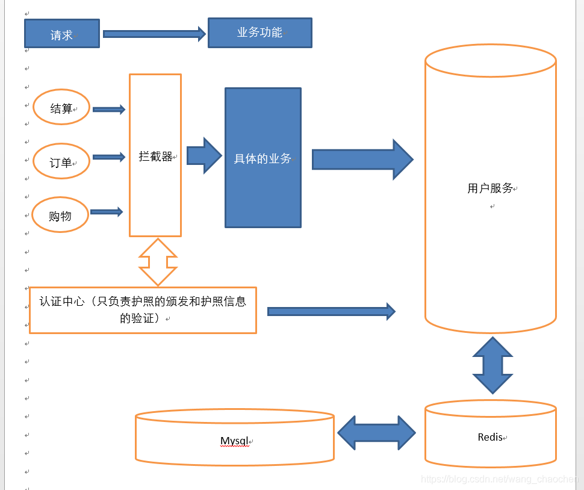

# 项目的一些问题：


## 0、分布式问题：

小的项目--gmall-user项目中所有的controller、service接口、service实现都在一个工程，通过**Spring的ioc**就可以实现互相调用。

随着架构不断增大，服务节点也越来越多，服务之间的调用和依赖关系也越来越复杂，
**需要有一个统一的中心来调度、路由、管理所有的服务**，基于这个中心构建的这个星型架构就是现在目前最主流的**SOA分布式架构**。

**整体以maven为基础，对项目进行分层架构。**


#### 项目中RPC体现在哪？

Dubbo框架下，@Reference关键字实现分布式的远程服务对象的注入。


dubbo的服务订阅有两种方式，第一种是通过xml文件的标签`<dubbo:reference />`，第二种是通过注解`@Reference`。


@Reference 的行为跟 @Autowired 类似 均实现了自动注入的过程 。

dubbo也是采用了和@Autowired注入一样的原理，通过继承`InstantiationAwareBeanPostProcessor` 重写postProcessPropertyValues 方法来达到解析@Reference并实现依赖注入。


消费者每引用的一种服务，都会创建一个ReferenceBean， 如果多个地方使用@Reference引用同一个服务，需要看他们的的缓存key是否一样，如果都是一样的，那么就只会创建一个ReferenceBean，如果有些配置不一样，比如版本号不一致，则会创建创建不同的`ReferenceBean`对象，这也是他版本号能够起到的作用把。至此，`@Reference`注解已经解析完毕，并且服务引用的对象也已经创建了。


### **0、什么是SOA？**

SOA 是 Service-Oriented Architecture 的英文缩写，就是**面向服务的架构**。这里的服务可以理解为 **service 层业务服务**。

**将系统拆分为不同的服务单元，通过网络协议服务单元之间进行通信。**

服务单元完成一个特定功能(如：验证、支付、登录等等)，通过服务单元之间的集成组成完整的应用程序。

SOA 架构中由两个重要的角色: **服务提供者（Provider）和服务使用者（Consumer）**


**SOA的优点：**

```
1、更易维护:业务服务提供者和业务服务使用者的松散耦合关系。当需求发生变化的时候，不需要修改提供业务服务的接口，只需要调整业务服务流程或者修改操作即可，整个应用系统也更容易被维护。

2、更高的可用性:该特点是在于服务提供者和服务使用者的松散耦合关系上得以发挥与体现。使用者无须了解提供者的具休实现细节。

3、更好的伸缩性:依靠业务服务设计、开发和部署等所采用的架构模型实现伸缩性。使得服务提供者可以互相彼此独立地进行调整，以满足新的服务需求。
```

**SOA缺点：**

```
减低了系统的性能

系统之间交互需要使用远程通信，接口开发增加工作量
```


```
1、ZooKeeper是一个分布式的，开放源码的分布式应用程序协调服务，是Google的Chubby一个开源的实现，是Hadoop和Hbase的重要组件。
	它是一个为分布式应用提供一致性服务的软件，提供的功能包括：配置维护、名字服务、分布式同步、组服务等。
2、Dubbo是Alibaba开源的分布式服务框架，它最大的特点是按照分层的方式来架构，使用这种方式可以使各个层之间解耦合（或者最大限度地松耦合）。
从服务模型的角度来看，Dubbo采用的是一种非常简单的模型，要么是提供方提供服务，要么是消费方消费服务，所以基于这一点可以抽象出服务提供方（Provider）和服务消费方（Consumer）两个角色。关于注册中心、协议支持、服务监控等内容。
```


### 1、dubbo


Dubbo只支持Java语言。

Dubbo 的架构主要包含四个角色，其中 Consumer 是服务消费者，Provider 是服务提供者，Registry 是注册中心，Monitor 是监控系统。具体的交互流程是 Consumer 一端通过注册中心获取到 Provider 节点后，通过 Dubbo 的客户端 SDK 与 Provider 建立连接，并发起调用。Provider 一端通过 Dubbo 的服务端 SDK 接收到 Consumer 的请求，处理后再把结果返回给 Consumer。


**调用关系：**

0、服务容器负责启动，加载，运行服务提供者。
1、服务提供者在启动时，向注册中心注册自己提供的服务。
2、服务消费者在启动时，向注册中心订阅自己所需的服务。
3、注册中心返回服务提供者地址列表给消费者，如果有变更，注册中心将基于长连接推送变更数据给消费者。
4、服务消费者，从提供者地址列表中，基于软负载均衡算法，选一台提供者进行调用，如果调用失败，再选另一台调用。
5、服务消费者和提供者，在内存中累计调用次数和调用时间，定时每分钟发送一次统计数据到监控中心。


**Dubbo对分布式事务的处理：**
分布式事务暂不支持。用户可以自己根据实际情况来实现分布式事务，比如：
1）结合RocketMQ消息中间件实现的可靠消息最终一致性
2）TCC补偿性事务解决方案
3）最大努力通知型方案


- [一些面试题](https://www.cnblogs.com/hongdada/p/8572513.html)


### 2、序列化与反序列化：

[我的博客：详解序列化与反序列化](https://blog.csdn.net/wang_chaochen/article/details/117134199)

把Java对象转换为字节序列的过程称为对象的序列化。
把字节序列恢复为对象的过程称为对象的反序列化。


*序列化的最终目的就是为了对象可以跨平台存储及进行网络传输。
进行跨平台存储和网络传输的方式就是IO，IO支持的数据格式是字节数组。
并且我们还需要将字节数组还原回对象的原来模样，因此需要在对象转换成字节数组时就制定一种规则--序列化*


 1. 把对象的字节序列永久地保存到硬盘上，通常存放在一个文件中 --（持久化对象）
    --在某些应用中，需要对某些对象进行序列化，离开内存空间，入住物理硬盘，以便长期保存。
    	--Web服务器中的Session对象，当有10万用户并发访问，可能出现10万个Session对象，内存可能吃不消，于是Web容器就会把一些Session先序列化到硬盘中，需要用的时候，再把保存在硬盘中的对象还原到内存中。
 2. 在网络上传送对象的字节序列 --（网络传输对象）
    --当两个进程在进行远程通信时，进程之间可以发送各种类型的数据。无论是何种类型的数据，都会以二进制序列的形式在网络上进行传输。
    	--发送方需要把这个Java对象转换为字节序列，才能在网络上传送；接收方需要把字节序列再恢复为Java对象。


只有实现了Serializable 和 Externalizable 接口的类的对象才能被序列化。


### 3、RPC

[我的博客：RPC](https://blog.csdn.net/wang_chaochen/article/details/117066207)


分布式的应用可以借助RPC来完成机器之间的调用。

RPC（Remote Procedure Call）是远程过程调用的简称，它是一种通过网络从远程计算机程序上请求服务，而不需要了解底层网络技术的协议。

RPC协议假定某些传输协议的存在，如TCP或UDP，为通信程序之间携带信息数据。
在OSI网络通信模型中，RPC跨越了传输层和应用层。


#### 为什么需要RPC？

主要是在几个进程中（应用分布在不同的机器上），**无法共用内存空间**，
或者在一台机器内**通过本地调用无法完成相关的需求**（如不同系统之间的通信，或者不同组织之间的通信）
或者由于机器的横向扩展，需要在**多台机器组成的集群上**部署应用。

**RPC的实现主要的两种类型：**

 1. 一种以http为主，纯粹的http请求，返回结果，
 2. 一种以TCP/IP为主，类似于实现一个服务代理，屏蔽网络请求，就像纯粹的本地调用一样（当然也可能是基于http协议封装的框架、如spring cloud的Fetch技术）


#### RPC原理及实现：

RPC允许一台计算机调用另一台计算机上的程序得到结果，而代码中不需要做额外的编程，就像在本地调用一样。
RPC采用客户机/服务器模式。请求程序就是一个客户机，而服务提供程序就是一个服务器。


**在RPC框架中主要有三个角色：**

 - Client 客户机：调用远程服务的服务消费方
 - Server 服务器：暴露服务的服务提供方
 - Registry 注册中心：服务注册与发现的注册中心


#### 实现步骤：

**1、建立通信**

首先要解决机器之间的通信问题，在客户端和服务器之间建立TCP连接，远程调用的相关数据都在连接中进行传输交换。

通常这个连接可以是按需连接（需要调用的时候就先建立连接，调用结束后就立马断掉），也可以是长连接（客户端和服务器建立起连接之后保持长期持有，不管此时有无数据包的发送，可以配合心跳检测机制定期检测建立的连接是否存活有效），多个远程过程调用共享同一个连接。

**2、服务寻址**

解决寻址的问题：即A机器上的应用A要调用B机器上的应用B，那么此时对于A来说如何告知底层的RPC框架所要调用的服务具体在哪里呢？

通常情况下我们需要提供B机器（主机名或IP地址）以及特定的端口，然后指定调用的方法或者函数的名称以及入参出参等信息，这样才能完成服务的一个调用。比如基于Web服务协议栈的RPC，就需要提供一个endpoint URI，或者是从UDDI服务上进行查找。如果是RMI调用的话，还需要一个RMI Registry来注册服务的地址。

**3、网络传输**

（1）序列化

当A机器上的应用发起一个RPC调用时，调用方法和其入参等信息需要通过底层的网络协议如TCP传输到B机器，由于网络协议是基于二进制的，所有我们传输的参数数据都需要先进行序列化（Serialize）或者编组（marshal）成二进制的形式才能在网络中进行传输。然后通过寻址操作和网络传输将序列化或者编组之后的二进制数据发送给B机器。

（2）反序列化

当B机器接收到A机器的应用发来的请求之后，又需要对接收到的参数等信息进行反序列化操作（序列化的逆操作），即将二进制信息恢复为内存中的表达方式，然后再找到对应的方法（寻址的一部分）进行本地调用（一般是通过生成代理Proxy去调用, 通常会有JDK动态代理、CGLIB动态代理、Javassist生成字节码技术等），之后得到调用的返回值。

**4、服务调用**

B机器进行本地调用（通过代理Proxy）之后得到了返回值，此时还需要再把返回值发送回A机器，同样也需要经过序列化操作，然后再经过网络传输将二进制数据发送回A机器，而当A机器接收到这些返回值之后，则再次进行反序列化操作，恢复为内存中的表达方式，最后再交给A机器上的应用进行相关处理（一般是业务逻辑处理操作）。


### 4、RPC的调用过程：

**RPC架构组件：**

1、客户端（Client）:服务调用方（服务消费者） 
2、客户端存根（Client Stub）:存放服务端地址信息，将客户端的请求参数数据信息打包成网络消息，再通过网络传输发送给服务端 
3、服务端存根（Server Stub）:接收客户端发送过来的请求消息并进行解包，然后再调用本地服务进行处理 
4、服务端（Server）:服务的真正提供者

同步调用的一次完整的RPC调用流程--如图：


```
1、服务消费者（client客户端）通过本地调用的方式调用服务 
2、客户端存根（client stub）接收到调用请求后负责将方法、参数等信息序列化成能够进行网络传输的消息体 
3、客户端存根（client stub）找到远程的服务地址，并且将消息通过网络发送给服务端 
4、服务端存根（server stub）收到消息后进行解码（反序列化操作） 
5、服务端存根（server stub）根据解码结果调用本地的服务进行相关处理 
6、本地服务执行具体业务逻辑并将处理结果返回给服务端存根（server stub） 
7、服务端存根（server stub）将返回结果重新打包成消息（序列化）并通过网络发送至消费方 
8、客户端存根（client stub）接收到消息，并进行解码（反序列化） 
9、服务消费方得到最终结果
```


## 1、并发查询问题：

为了缓解数据库的压力，使用Redis缓存减轻数据库压力。

```
redis存储结构是：jedis.set("sku:" + skuId + ":info", JSON.toJSONString(pmsSkuInfo));

String OK = jedis.set("sku:" + skuId + ":lock", "token", "nx", "px", 10 * 1000);
```

先查缓存，缓存中没有再去数据库中查。

当前线程使用随机字符串作为分布式锁，不给数据库太大压力。线程获得锁有10秒的过期时间，（这里如果查询到不存在的数据，设置一个过期时间，防止缓存穿透问题）。访问完数据库，释放锁，使用token确认删掉的是自己的锁。如果没能获取到锁进行自旋。

#### **高并发环境下可能遇到的问题：**

1、	如果redis宕机了，或者链接不上，怎么办？

	1、配置主从复制，配置哨兵模式，一旦发现主机宕机，让下一个从机当做主机。
	2、最坏的情况，只能关闭Redis连接，去查询数据库。但数据量大，数据库也会宕机。

2、	如果redis缓存在高峰期到期失效，在这个时刻请求会向雪崩一样，直接访问数据库如何处理？

	设置条件查询判断，判断redis缓存里是否有数据，如果没有，则去往数据库连接。
	加分布式锁，利用redis的单线程+多路IO复用技术，原子性原理，让其它的线程请求等待，
	假若第一个线程进去获取到分布式锁在查询数据的途中宕掉了，不能让其它线程一直等待，
	设置等待一定时间判断是否取回数据，如果没有，递归调用自己的方法让第二个线程继续拿分布式锁查询数据库。
	从数据库拿到数据时，把数据值设置到redis数据库缓存中，设置失效时间，避免占内存，方便使用提高效率。

3、	 如果用户不停地查询一条不存在的数据，缓存没有，数据库也没有，那么会出现什么情况，如何处理？

	如果数据不存在，缓存中没有，数据库也没有，当然如果不设置判断，会一直调用数据库，
	使数据库效率降低，访问量大时甚至会宕机。-----缓存击穿
	
	解决方案：
	从数据库查询，如果数据库没有，则返回值为Null，判断数据库返回的值，
	如果为Null，则自定义把标识的字段存到Redis中，用key,value的方法，jedis.setex(key,"empty")，
	设置失效时间跟具体情况而定，然后调用String json=jedis.get(key),判断是否获取的值"empty".equal(json),如果相等，
	则抛出自定义异常，给用户提示，或者直接return null。
	这样用户再次查询的时候由于先从reids缓存中查询，redis会有对应的Key获取之前设置的value值，
	这样就不会再次调用数据库，影响效率等问题。

4、如果在redis中的锁已经过期了，然后锁过期的请求执行完毕回来删锁，删了别的线程的锁，怎么办？

	设置随机的token锁，删锁之前，get一下key，看下value是不是自己的token。

5、如果碰巧在查询redis锁的时候没过期，在查完要删的一瞬间过期了，又删了别的线程的锁，怎么办？

	可以使用lua脚本在查询到key的同时删除这个key，防止高并发下的意外的发生
	去除了读和写之间的时间间隙，能够保证删除的是自己的锁
		1.lua脚本是作为一个整体执行的.所以中间不会被其他命令插入;
		2.可以把多条命令一次性打包,所以可以有效减少网络开销;
		3.lua脚本可以常驻在redis内存中,所以在使用的时候,可以直接拿来复用.也减少了代码量.


#### **缓存问题：**

 1、缓存雪崩：缓存中的很多key失效，导致数据库负载过重宕机

         * 缓存时采用了相同的过期时间，导致缓存在某一时刻同时失效，导致的db崩溃
         * 解决：设置不同的缓存失效时间
         *

*缓存击穿和缓存穿透：失去了redis的拦截高并发的能力，直接打到数据库上*

2、缓存穿透：利用不存在的key去攻击mysql数据库

         * 是指查询一个一定不存在的数据，由于缓存是不命中，将去查询数据库，但是数据库也无此记录，
         * 并且处于容错考虑，我们没有将这次查询的null写入缓存，这将导致这个不存在的数据每次请求都要到存储层去查询，
         * 失去了缓存的意义。在流量大时，可能DB就挂掉了，要是有人利用不存在的key频繁攻击我们的应用，这就是漏洞。
         *
         * 解决: 空结果进行缓存设置过期时间，但它的过期时间会很短，最长不超过五分钟。

 3、缓存击穿：在正常的访问情况下，如果缓存失效，如果保护mysql，重启缓存的过程

         * 对于一些设置了过期时间的key，如果这些key可能会在某些时间点被超高并发地访问，是一种非常“热点”的数据。
         * 这个时候，需要考虑一个问题：如果这个key在大量请求同时进来前正好失效，那么所有对这个key的数据查询都落到db，我们称为缓存击穿。
         * 是某一个热点key在高并发访问的情况下，突然失效，导致大量的并发打进mysql数据库的情况
         *
         * 解决：使用redis数据库的分布式锁，解决mysql的访问压力问题
         * 
         * 1、redis自带的分布式锁，set px nx
         * -----  String token = UUID.randomUUID().toString();
         * ------ String lock = jedis.set(key, token, "NX", "EX",20);
         * 2、redission框架：带juc的lock锁的redis客户端,是一个redis的juc实现（既有jedis功能又有juc功能）
         *-------- jedis本身无法实现多线程锁的机制
         * ------- synchronized () 只能解决本地的多线程并发问题

## 2、如何防止库存超卖？--数据库锁

如何解决库存超卖现象？

	在高并发的情况下，多个人同时抢购同一库存时，由于数据库的读写操作可以并行执行的原因，会导致修改库存时，库存不足出现超卖现象。
	---redis解决：分布式锁、lua脚本、Redisson
	---mysql解决：用锁将查询库存的操作和写入库存的操作互斥
		(1)悲观锁解决库存问题：
			在select时，将select语句加入一个行锁，与更新库存是语句互斥，可以保证在查询库存时库存不被修改。
		(2)乐观锁解决库存问题：
			在select时，加入一个版本字段，每次更新，同时查询和更新版本字段，如果版本字段发生变化，则SQL语句不会执行成功。
			Select kc,version from sku_info where sku_id = ?----查询两个字段
			Update sku_info set kc = kc - 1, version = version + 1 where sku_id = ? and version = version


MyISAM--查询用---不存在事务---基本已经淘汰
InnoDB数据库引擎--事务型--支持行锁、表锁----三种锁指行锁、表锁、页锁

**表锁**

在偏读型数据库中使用表锁----如MyISAM
--很少用表锁--安全--

Lock table 表名
Unlock tables

写锁和读锁阻塞（读写互斥），读与读共享，写和写阻塞（写写互斥）

**行锁**

------行锁支持事务----没有行锁就没有事务
------没开启事务就是默认提交---开启事务后提交需要手动commit

------行锁可以让读读互斥，可以避免在查询到库存时，库存已经被修改的情况发生
-----update自带行锁---事务

-----在无索引操作时，注意锁的升级(行锁升级表锁)


```sql
--- 如何锁定一行？--加上一个行锁
-----查询加上行锁for update ,避免查询和更新同时发生，导致读到的库存数量发生不可重复读的错误
set autocommit = 0;
select kc from product where productname = '电脑' for update
update product set kc = kc - 1 where productname = '电脑'
commit
```


**间隙锁**

当使用范围条件不是相等条件检索数据时，并请求共享或排他锁时，InnoDB会给符合条件的已有数据记录的索引项加锁。
对于键值在条件范围内但是并不存在的记录叫作“间隙”(GAP)
InnoDB也会对这个间隙加锁--这种锁机制就是间隙锁(Next-Key锁)

可能会锁定一个并不存在的记录。
可能也会导致锁的升级，危害别的数据。---因此查询时尽量不使用范围条件检索

**页锁**

开销和加锁时间介于表锁和行锁之间，会出现死锁；
锁定粒度介于表锁和行锁之间，并发度一般。


**数据库的死锁**
----多线程死锁

形成了一种因果关系，死循环。---彼此占用了对方的解锁的钥匙

## 3、登录：

认证中心
jwt


1 点击登录按钮，在登录页面输入用户名和密码通过用户名和密码验证用户登录是否成功后，生成jwt的token返回给search.gmall.com/index，在拦截器里面将返回的token写入cookie

2 点击结算按钮，拦截器拦截请求
A该用户没有登录，并且结算请求时必须登录的，将用户打回认证中心进行登录
B该用户没有登录，并且结算请求时没有登录也可以访问，放行

3 在被拦截登录后，返回原始请求(携带登录成功后颁发的token)

4 原始请求的拦截器第二次拦截请求，拦截请求后，将返回的token写入cookie




## 4、支付：


	

	1 用户请求谷粒商城进行支付
	2 谷粒商城返回给用户一个跳转支付宝的链接(带着谷粒商城和支付宝合作的appId)
	3 用户的浏览器和支付宝的服务器交互过程中安全问题
		非对称密钥加密(rsa),两个超大质数乘机的因式分解不可逆原理
		通过rsa非对称密钥生成的网络签名，可以用来验证请求发送者的身份

#### **消息队列的应用：**

	------延迟队列
	0 提交订单的延迟检查(支付服务)------检查支付结果
	PAYMENT_CHECK_QUEUE
	
	-----消息队列
	1 支付完成(支付服务)
	PAYMENT_SUCCESS_QUEUE
	
	2 订单已支付(订单服务)
	ORDER_PAY_QUEUE
	
	3 库存锁定(库存系统)
	SKU_DEDUCT_QUEUE
	
	4 订单已出库(订单服务)
	ORDER_SUCCESS_QUEUE


## 补充问题：

#### 前后端的跨域问题：

```
1、前端127.0.0.1:8888、后端127.0.0.1:8082
2、前端和后端因为来自不同的网域，所以在http的安全协议策略下，不信任

解决方案: 在springmvc的控制层也就是项目gmall-manage-web的 Controller类 中加入 @CrossOrigin 跨域访问的注解.
```

#### **1、后台管理，发布商品sku时，使用消息队列同步缓存**

	manage-service中SkuServiceImpl----发出商品的缓存同步消息
	发布一个SKU，缓存中有这个Item----在SkuService中已经有了查询数据库和同步缓存的代码、分布式锁
	------发出商品的搜索引擎的同步消息

#### **2、搜索商品时，热度值字段 HotScore**

	可以将热度值字段，单独地存储在redis中
	在redis中专门设置一个热度值字段，对应es中的热度值，在es检索结果之后，根据商品id取出热度值，进行排序
	redis没更新固定次数，同步一次es，用redis作为一个缓冲区，来稀释对es的大量写的操作

#### **3、购物车模块时**

	如果用户登录，合并cookie中和db中的购物车数据，然后同步redis
	在用户登录时，发出一个用户登录的消息（话题模式topic），让cartService消费，做购物车的合并和同步缓存
	cartService无法清除cookie中的数据--->业务上进行解决：
	在访问购物车列表时，如果当前用户已经登录，则删除cookie中多余的购物车数据

#### **4、提交订单时**

	调用库存服务的库存查询接口，做库存的校验，查询除去锁定库存的剩余商品数量。

#### **5、库存削减的队列**

	由订单服务消费，订单服务修改订单状态为准备出库

#### **6、秒杀**

```
1、使用**redis**进行实现--开启商品的监控----使用redis的watch来保证秒杀的成功--multi-watch---随机运气机制

2、使用**Redisson**进行实现---getSemaphore-----tryAcquire();---先到先得机制
```

#### **7、限流**

```
限流，限制服务器的流量，单位时间内的吞吐数，处理请求的数量。**


**漏桶算法：**设置一个桶的容量，即最大承载值，如果大于这个容量直接false，时间间隔乘速率。

**令牌桶算法**：以一个恒定的速度往桶里放入令牌，而如果请求需要被处理，则需要先从桶里获取一个令牌，当桶里没有令牌可取时，则拒绝服务。
```


## 架构风格：

[技术架构演变、RPC](https://juejin.cn/post/6862646095513419783)


- 基于 SOA 的架构思想将重复公用的功能抽取为组件，以服务的形式给各系统提供服务。
- 各项目（系统）与服务之间采用 WebService、RPC 等方式进行通信。
- 使用 ESB 企业服务总线作为项目与服务之间通信的桥梁。


- 将系统服务层完全独立出来，并将服务层抽取为一个一个的微服务。
- 微服务中每一个服务都对应唯一的业务能力，遵循单一原则。
- 微服务之间采用 RESTful 等轻量协议传输。


## 通信方式：

### TCP/UDP

　　都是传输协议，主要区别是 TCP 协议连接需要 3 次握手，断开需要四次挥手，是通过流来传输的，就是确定连接后，一直发送信息，传完后断开。UDP 不需要进行连接，直接把信息封装成多个报文，直接发送。所以 UDP 的速度更快，但是不保证数据的完整性。

> 一句话总结：最古老且最有效，永不过时，学习成本高。所有通信方式归根结底都是 TCP/UDP。


### WebService

　　WebService（SOA，SOAP，WSDL，UDDI，XML）技术， 能使得运行在不同机器上的不同应用无须借助附加的、专门的第三方软件或硬件， 就可相互交换数据或集成。依据 WebService 规范实施的应用之间， 无论它们所使用的语言、 平台或内部协议是什么， 都可以相互交换数据。

　　WebService 就是一种跨编程语言和跨操作系统平台的远程调用技术。WebService 交互的过程就是遵循 SOAP 协议通过 XML 封装数据，然后由 Http 协议来传输数据。

> 一句话总结：基于 HTTP + XML 的标准化 Web API。

　　

### RESTful

　　Representational State Transfer，表现层状态转移。互联网通信协议 HTTP 协议，是一个无状态协议。这意味着，所有的状态都保存在服务器端。因此，如果客户端想要操作服务器，必须通过某种手段，让服务器端发生"状态转化"（State Transfer）。而这种转化是建立在表现层之上的，所以就是"表现层状态转移"。

　　客户端用到的手段，只能是 HTTP 协议。具体来说，就是 HTTP 协议里面，四个表示操作方式的动词：GET、POST、PUT、DELETE。它们分别对应四种基本操作：GET 用来获取资源，POST 用来新建资源（也可以用于更新资源），PUT 用来更新资源，DELETE 用来删除资源。

- 无状态协议 HTTP，具备先天优势，扩展能力很强。例如需要安全加密时，有现成的成熟方案 HTTPS 可用。
- JSON 报文序列化，轻量简单，人与机器均可读，学习成本低，搜索引擎友好。
- 语言无关，各大热门语言都提供成熟的 Restful API 框架。

> 一句话总结：基于 HTTP + JSON 的标准化 Web API。

　　

### RMI

　　Remote Method Invocation，远程方法调用。Java 中实现的分布式通信协议，它大大增强了 Java 开发分布式应用的能力。通过 RMI 技术，某一个本地的 JVM 可以调用存在于另外一个 JVM 中的对象方法，就好像它仅仅是在调用本地 JVM 中某个对象方法一样。

> 一句话总结：基于 Java 语言的分布式通信协议。

　　

### JMS

　　Java Message Service，Java 消息服务应用程序接口，是一个 Java 平台中关于面向消息中间件的 API，用于在两个应用程序之间，或分布式系统中发送消息，进行异步通信。绝大多数 MQ 都对 JMS 提供支持，如 RabbitMQ、ActiveMQ、Kafka、RocketMQ 以及 Redis 等。

> 一句话总结：JavaEE 消息框架标准。

　　

### RPC

　　Remont Proceduce Call，远程过程调用。它是一种通过网络从远程计算机程序上请求服务，而不需要了解底层网络技术的思想。RPC 只是一个概念，它不是一个协议也不是一个框架。

　　RPC 的具体实现可以使用 RMI 或 RESTful 等，但一般不用，因为 RMI 不能跨语言，RESTful 效率太低。

　　RPC 多用于服务器集群内部通信，因此常使用更加高效、短小精悍的传输模式以提高效率。RPC 框架有很多：Apache Thrift、Apache Dubbo、Google Grpc 等。

> 一句话总结：解决分布式系统中，服务之间的调用问题。远程调用时，要能够像本地调用一样方便，让调用者感知不到远程调用的逻辑。

　　

## Ps：大Value多Value拆分方案：

**1、单个简单的key存储的value很大**

   i： 该对象需要每次都整存整取

可以尝试**将对象分拆成几个key-value**， 使用**multiGet**获取值，这样分拆的意义在于分拆单次操作的压力，

**将操作压力平摊到多个redis实例中**，降低对单个redis的IO影响；   

  

2、该对象每次只需要存取部分数据

可以像第一种做法一样，分拆成几个key-value，  也可以将这个**存储在一个hash中**，**每个field代表一个具体的属性**，

使用hget,hmget来获取部分的value，使用hset，hmset来更新部分属性   

 

**2、hash， set，zset，list 中存储过多的元素**

类似于场景一种的第一个做法，可以将这些元素分拆。

以hash为例，原先的正常存取流程是  hget(hashKey, field) ; hset(hashKey, field, value)

现在，固定一个桶的数量，比如 10000， 每次存取的时候，**先在本地计算field的hash值，对10000取模**， 确定了该field落在哪个key上。


 *set, zset, list 也可以类似上述做法*

*但有些不适合的场景，比如，要保证 lpop 的数据的确是最早push到list中去的，这个就需要一些附加的属性，或者是在 key的拼接上做一些工作（比如list按照时间来分拆）。*


**3、一个集群存储了上亿的key**

key的个数过多会带来更多的内存空间占用：

   *i：key本身的占用（每个key 都会有一个Category前缀）*

   *ii：集群模式中，服务端需要建立一些slot2key的映射关系，这其中的指针占用在key多的情况下也是浪费巨大空间*

这两个方面在key个数上亿的时候消耗内存十分明显（Redis 3.2及以前版本均存在这个问题，4.0有优化）；

 

所以减少key的个数可以减少内存消耗，可以参考的方案是**转Hash结构存储**，即原先是直接使用Redis String 的结构存储，现在**将多个key存储在一个Hash结构中**，具体场景参考如下：

1、key 本身就有很强的相关性，比如多个key 代表一个对象，每个key是对象的一个属性，这种可直接按照特定对象的特征来设置一个新Key——Hash结构， 原先的key则作为这个新Hash 的field。

​    *举例说明：* 

​    *原先存储的三个key ，*  

​    *user.zhangsan-id = 123;  user.zhangsan-age = 18; user.zhangsan-country = china;*   

​    *这三个key本身就具有很强的相关特性，转成Hash存储就像这样*

​    *key = user.zhangsan*

​    *field:id = 123; field:age = 18; field:country = china;*

​    *即redis中存储的是一个key ：user.zhangsan， 他有三个 field， 每个field + key 就对应原先的一个key。*

   

2、 key 本身没有相关性，预估一下总量，采取和上述第二种场景类似的方案，预分一个固定的桶数量

   *比如现在预估key 的总数为 2亿，按照一个hash存储 100个field来算，需要 2亿 / 100 = 200W 个桶 (200W 个key占用的空间很少，2亿可能有将近 20G )*

   *原先比如有三个key  ：  user.123456789  , user.987654321， user.678912345*

   *现在按照200W 固定桶分就是先计算出桶的序号  hash(123456789)  % 200W ， 这里最好保证这个 hash算法的值是个正数，否则需要调整下模除的规则；*

   *这样算出三个key 的桶分别是   1 ， 2， 2。  所以存储的时候调用API  hset(key, field, value)，读取的时候使用 hget （key， field）*  

​    *key1 : hset （  user.1,  123456789 ,  value ）       hget（ user.1,  123456789）*

​    *key2:  hset  (  user.2,  987654321,  value )        hget（user.2,  987654321）*

​    *key3:  hset （  user.2,  678912345,  value)         hget（user.2,  678912345）*

   

​    *注意两个地方：1，hash 取模对负数的处理； 2，预分桶的时候， 一个hash 中存储的值最好不要超过 512 ，100 左右较为合适*


**4、大Bitmap或布隆过滤器（Bloom ）拆分**

使用bitmap或布隆过滤器的场景，往往是数据量极大的情况，在这种情况下，Bitmap和布隆过滤器使用空间也比较大，比如用于公司userid匹配的布隆过滤器，就需要512MB的大小，这对redis来说是绝对的大value了。


​      *这种场景下，我们就需要对其进行拆分，拆分为足够小的Bitmap，比如将512MB的大Bitmap拆分为1024个512KB的Bitmap。不过拆分的时候需要注意，要将每个key落在一个Bitmap上。有些业务只是把Bitmap 拆开， 但还是当做一个整体的bitmap看， 所以一个 key 还是落在多个 Bitmap 上，这样就有可能导致一个key请求需要查询多个节点、多个Bitmap。如下图，被请求的值被hash到多个Bitmap上，也就是redis的多个key上，这些key还有可能在不同节点上，这样拆分显然**大大降低了查询的效率**。*


因此我们所要做的是把所有拆分后的Bitmap当作独立的bitmap，然后**通过hash将不同的key分配给不同的bitmap上，而不是把所有的小Bitmap当作一个整体**。这样做后每次请求都只要取redis中一个key即可。


*Bitmap变小了，会不会增加布隆过滤器的误判率？*

实际上是不会的，布隆过滤器的误判率是哈希函数个数k，集合元素个数n，以及Bitmap大小m所决定的，其约等于


因此如果我们在第一步，也就是在分配key给不同Bitmap时，能够尽可能均匀的拆分，那么n／m的值几乎是一样的，误判率也就不会改变。

*同时，客户端也提供便利的api （>=2.3.4版本），  setBits/ getBits 用于一次操作同一个key的多个bit值 。*


# --------------------------------------------------------------------------———————————————————————————————  

# 设计模式


## 什么是设计模式？

**设计模式（Design pattern）** 是解决软件开发某些特定问题而提出的一些解决方案也可以理解成解决问题的一些思路。通过设计模式可以帮助我们增强代码的可重用性、可扩充性、 可维护性、灵活性好。我们使用设计模式最终的目的是实现代码的 **高内聚** 和 **低耦合**。

什么是**高内聚和低耦合**？
举例一个现实生活中的例子，例如一个公司，一般都是各个部门各司其职，互不干涉。各个部门需要沟通时通过专门的负责人进行对接。在软件里面也是一样的 **一个功能模块只是关注一个功能，一个模块最好只实现一个功能**。这个是所谓的**内聚**，模块与模块之间、系统与系统之间的交互，是不可避免的， 但是我们要**尽量减少由于交互引起的单个模块无法独立使用或者无法移植的情况发生**， **尽可能多的单独提供接口用于对外操作**， 这个就是所谓的**低耦合**


## 设计模式分类：

```
1、创建型模式：
	1、单例模式
	2、工厂模式：简单工厂、工厂方法、抽象工厂
	3、生成器模式
	4、原型模式
2、行为型模式：
	1、责任链模式
	2、命令模式
	3、解释器模式
	4、迭代器模式
	5、中介者模式
	6、备忘录模式
	7、观察者模式
	8、状态模式
	9、策略模式
	10、模板方法
	11、访问者模式
	12、空对象
3、结构型模式
	1、适配器模式
	2、桥接模式
	3、组合模式
	4、装饰模式
	5、外观模式
	6、享元模式
	7、代理模式
```


## 设计模式的6大原则:

```
1、开闭原则（Open Close Principle）
对软件实体的改动，最好用扩展而非修改的方式。如果要修改代码，尽量用继承或组合的方式来扩展类的功能，而不是直接修改类的代码。

2、里氏代换原则（Liskov Substitution Principle）
尽量把父类设计为抽象类或者接口，让子类继承父类或实现父接口，子类可以扩展父类的功能，但不能改变父类原有的功能。
	1. 老爸能干的事情，儿子都能干。
	2. 但是儿子能干的事情老爸不一定能干。

里氏代换原则是开闭原则的具体实现手段之一。

3、单一职责原则（Single Responsibility Principle）
一个类只承担一个职责，千万不要让一个类干的事情太多。

4、接口隔离原则（Interface Segregation Principle）
接口最小化。接口中的方法应该尽量少。和单一职责原则类似

	单一职责针对的是类，
	接口隔离针对的是接口
5、依赖倒转原则（Dependence Inversion Principle）
要依赖抽象，不要依赖具体类。这个和针对接口编程， 而不是面向实现编程很像。但是它更强调抽象。这个原则是不能让高层组件依赖底层组件，而且高层组件和低层组件都应该依赖抽象。摘抄自 【Head First 设计模式】

	面向接口编程 而不是面向实现编程，
	这里的接口不一定就是我们程序中的接口也可以是抽象类。

1、Animal dog1 = new Dog();//面向接口
2、Dog dog2 = new Dog();//面向实现

6、迪米特法则，又称最少知道原则（Demeter Principle）
	类向外公开的方法应该尽可能的少，
	依赖的对象尽可能的少（只依赖应该依赖的对象）。

```


## 1、单例模式

确保一个类只有一个实例，并提供该实例的全局访问点。

使用一个私有构造函数、一个私有静态变量及一个公有静态函数实现。
私有构造函数保证了不能通过构造函数创建对象实例，只能通过公有静态函数返回唯一的私有静态变量。

### 1、懒汉式(线程不安全)

```java
public class Singleton {
    private static Singleton uniqueInstance;

    private Singleton() {
    }

    public static Singleton getUniqueInstance() {
        if (uniqueInstance == null) {
            uniqueInstance = new Singleton();
        }
        return uniqueInstance;
    }
}
```

注意到，私有静态变量uniqueInstance被**延迟实例化**，如果没有用到该类，就不会实例化uniqueInstance，节约资源。

多线程下不安全，如果多个线程能同时进入判断语句，且此时uniqueInstance为null，这样的话就会有多个线程执行实例化语句，导致**实例化多次uniqueInstance**。

### 2、饿汉式(线程安全)

```java
public class Singleton {
    private static Singleton uniqueInstance = new Singleton();

    private Singleton() {
    }

    public static Singleton getUniqueInstance() {
        return uniqueInstance;
    }
}
```

懒汉式线程不安全的原因是由于uniqueInstance被实例化多次，因此**直接实例化uniqueInstance**就不会有线程不安全的问题。

直接实例化的方式丢失了延迟实例化带来的节约资源的好处。

### 3、懒汉式(线程安全)

```java
public class Singleton {
    private static Singleton uniqueInstance;

    private Singleton() {
    }

	public static synchronized Singleton getUniqueInstance() {
    	if (uniqueInstance == null) {
        	uniqueInstance = new Singleton();
    	}
    	return uniqueInstance;
	}
}
```

**只对 getUniqueInstance() 方法加锁**，那么一个时间点只能有一个线程能进入该方法，避免实例化多次uniqueInstance。

但是一个线程进入该方法后，其它试图进入该方法的线程必须等待，存在过长阻塞时间。

### 4、双重校验锁实现DCL(线程安全)

```java
public class Singleton {
	//uniqueInstance使用volatile关键字修饰--禁止指令重排
    private volatile static Singleton uniqueInstance;
    
    private Singleton() {
    }

    public static Singleton getUniqueInstance() {
    //双重校验锁先判断 uniqueInstance 是否已经被实例化，如果没有被实例化，那么才对实例化语句进行加锁。
        if (uniqueInstance == null) {
            synchronized (Singleton.class) {
            	//再校验一次，判断是否被实例化
                if (uniqueInstance == null) {
                    uniqueInstance = new Singleton();
                }
            }
        }
        return uniqueInstance;
    }
}
```

**1、为什么进行双重校验？**

首先判断uniqueInstance是否被实例化，如果没被实例化才对实例化语句加锁。
但是如果只有一次判断的话，两个线程都会去执行实例化语句，虽然加了锁，但是只是执行先后的问题，还是会进行两次实例化。
因此需要双重校验：
	1、第一个if语句用来避免uniqueInstance已经被实例化的情况，避免非必要加锁。
	2、第二个if语句进行加锁，只能有一个线程进入，不会出现uniqueInstance==null时两个线程同时实例化的情况。

**2、使用volatile关键字修饰uniqueInstance**

实例化对象：uniqueInstance = new Singleton();      ---分三步执行：
	1、为uniqueInstance 分配内存空间 
	2、初始化uniqueInstance  
	3、将uniqueInstance 指向分配的内存空间
JVM具有指令重排的特性，执行顺序可能发生变化。
	--2还没执行先执行了3，另一个线程执行时对象非空，出现**DCL失效问题**。
volatile关键字禁止指令重排，因此可以在多线程环境下正常运行。

### 5、静态内部类实现

```java
public class Singleton {
    private Singleton() {
    }

    private static class SingletonHolder {
        private static final Singleton INSTANCE = new Singleton();
    }

    public static Singleton getUniqueInstance() {
        return SingletonHolder.INSTANCE;
    }
}
```

当Singleton 类被加载时，静态内部类 SingletonHolder 没有被加载进内存。
只有当调用getUniqueInstance()方法触发SingletonHolder.INSTANCE时SingletonHolder 才会被加载，此时再初始化INSTANCE实例，并且JVM能确保只实例化一次。

延迟初始化+线程安全，但是存在传参的问题，因为静态内部类创建单例，外部无法传递参数进去。

### 6、枚举实现

```java
public enum Singleton {
    INSTANCE;
    private String objName;
    public String getObjName() {
        return objName;
    }
    public void setObjName(String objName) {
        this.objName = objName;
    }

    public static void main(String[] args) {

        // 单例测试
        Singleton firstSingleton = Singleton.INSTANCE;
        firstSingleton.setObjName("firstName");
        System.out.println(firstSingleton.getObjName());//firstName
        Singleton secondSingleton = Singleton.INSTANCE;
        secondSingleton.setObjName("secondName");
        System.out.println(firstSingleton.getObjName());//secondName
        System.out.println(secondSingleton.getObjName());//secondName

        // 反射获取实例测试
        try {
            Singleton[] enumConstants = Singleton.class.getEnumConstants();
            for (Singleton enumConstant : enumConstants) {
                System.out.println(enumConstant.getObjName());//secondName
            }
        } catch (Exception e) {
            e.printStackTrace();
        }
    }
}
```

枚举在Java中与普通类一样，能拥有字段和方法，枚举实例创建是线程安全的。
在任何情况下都是一个单例Singleton.INSTANCE。

可以防止反射攻击。枚举是由JVM保证只会实例化一次。
该实现在多次序列化和序列化之后，不会得到多个实例。

## 2、工厂模式

**优点：**

```
1、可以使代码结构清晰，有效地封装变化。在编程中，产品类的实例化有时候是比较复杂和多变的，通过工厂模式，将产品的实例化封装起来，使得调用者根本无需关心产品的实例化过程，只需依赖工厂即可得到自己想要的产品。

2、对调用者屏蔽具体的产品类。如果使用工厂模式，调用者只关心产品的接口就可以了，至于具体的实现，调用者根本无需关心。即使变更了具体的实现，对调用者来说没有任何影响。

3、降低耦合度。产品类的实例化通常来说是很复杂的，它需要依赖很多的类，而这些类对于调用者来说根本无需知道，如果使用了工厂方法，我们需要做的仅仅是实例化好产品类，然后交给调用者使用。对调用者来说，产品所依赖的类都是透明的。
```

### 1、简单工厂

**在创建一个对象时不向客户暴露内部细节，并提供一个创建对象的通用接口。**


简单工厂**把实例化的操作单独放到一个类中**，这个类就成为**简单工厂类**，让简单工厂类来**决定应该用哪个具体子类来实例化**。

这样做能把客户类和具体子类的实现解耦，**客户类不再需要知道有哪些子类以及应当实例化哪个子类**。客户类往往有多个，如果不使用简单工厂，那么所有的客户类都要知道所有子类的细节。而且一旦子类发生改变，例如增加子类，那么所有的客户类都要进行修改。

```java
public interface Product {
}

public class ConcreteProduct implements Product {
}

public class ConcreteProduct1 implements Product {
}

public class ConcreteProduct2 implements Product {
}

//SimpleFactory 是简单工厂实现，它被所有需要进行实例化的客户类调用
public class SimpleFactory {
    public Product createProduct(int type) {
        if (type == 1) {
            return new ConcreteProduct1();
        } else if (type == 2) {
            return new ConcreteProduct2();
        }
        return new ConcreteProduct();
    }
}


public class Client {
    public static void main(String[] args) {
        SimpleFactory simpleFactory = new SimpleFactory();
        Product product = simpleFactory.createProduct(1);
        // do something with the product
    }
}
```


### 2、工厂方法

**定义了一个创建对象的接口，但由子类决定要实例化哪个类。工厂方法把实例化操作推迟到子类。**


在**简单工厂**中，创建对象的是**另一个类**，而在**工厂方法**中，是由**子类**来创建对象。

图中，Factory 有一个 doSomething() 方法，这个方法需要用到一个产品对象，这个产品对象由 factoryMethod() 方法创建。该方法是抽象的，需要由子类去实现。

```java
public abstract class Factory {
    abstract public Product factoryMethod();
    public void doSomething() {
        Product product = factoryMethod();
        // do something with the product
    }
}
public class ConcreteFactory extends Factory {
    public Product factoryMethod() {
        return new ConcreteProduct();
    }
}
public class ConcreteFactory1 extends Factory {
    public Product factoryMethod() {
        return new ConcreteProduct1();
    }
}
public class ConcreteFactory2 extends Factory {
    public Product factoryMethod() {
        return new ConcreteProduct2();
    }
}
```


### 3、抽象工厂

**提供一个接口，创建相关的对象家族。**


抽象工厂模式创建的是对象家族，也就是**很多对象**而不是一个对象，并且这些对象是**相关**的，也就是说**必须一起创建出来**。而**工厂方法模式只是用于创建一个对象**，这和抽象工厂模式有很大不同。

**抽象工厂模式用到了工厂方法模式来创建单一对象**，AbstractFactory 中的 createProductA() 和 createProductB() 方法都是**让子类来实现**，这两个方法单独来看就是在创建一个对象，这符合工厂方法模式的定义。

至于创建对象的家族这一概念是在 Client 体现，**Client 要通过 AbstractFactory 同时调用两个方法来创建出两个对象**，在这里这两个对象就有很大的相关性，Client 需要**同时创建出这两个对象**。

从高层次来看，抽象工厂使用了组合，即 **Cilent 组合了 AbstractFactory，而工厂方法模式使用了继承**。


```java
public class AbstractProductA {
}
public class AbstractProductB {
}
public class ProductA1 extends AbstractProductA {
}
public class ProductA2 extends AbstractProductA {
}
public class ProductB1 extends AbstractProductB {
}
public class ProductB2 extends AbstractProductB {
}
public abstract class AbstractFactory {
    abstract AbstractProductA createProductA();
    abstract AbstractProductB createProductB();
}
public class ConcreteFactory1 extends AbstractFactory {
    AbstractProductA createProductA() {
        return new ProductA1();
    }

    AbstractProductB createProductB() {
        return new ProductB1();
    }
}
public class ConcreteFactory2 extends AbstractFactory {
    AbstractProductA createProductA() {
        return new ProductA2();
    }

    AbstractProductB createProductB() {
        return new ProductB2();
    }
}

public class Client {
    public static void main(String[] args) {
        AbstractFactory abstractFactory = new ConcreteFactory1();
        AbstractProductA productA = abstractFactory.createProductA();
        AbstractProductB productB = abstractFactory.createProductB();
        // do something with productA and productB
    }
}
```


## 代理模式

**用于控制其它对象的访问。**


代理有以下四类：

- 远程代理（Remote Proxy）：控制对远程对象（不同地址空间）的访问，它负责将请求及其参数进行编码，并向不同地址空间中的对象发送已经编码的请求。
- 虚拟代理（Virtual Proxy）：根据需要创建开销很大的对象，它可以缓存实体的附加信息，以便延迟对它的访问，例如在网站加载一个很大图片时，不能马上完成，可以用虚拟代理缓存图片的大小信息，然后生成一张临时图片代替原始图片。
- 保护代理（Protection Proxy）：按权限控制对象的访问，它负责检查调用者是否具有实现一个请求所必须的访问权限。
- 智能代理（Smart Reference）：取代了简单的指针，它在访问对象时执行一些附加操作：记录对象的引用次数；当第一次引用一个对象时，将它装入内存；在访问一个实际对象前，检查是否已经锁定了它，以确保其它对象不能改变它。


以下是一个虚拟代理的实现，模拟了图片延迟加载的情况下使用与图片大小相等的临时内容去替换原始图片，直到图片加载完成才将图片显示出来。

```java
public interface Image {
    void showImage();
}

public class HighResolutionImage implements Image {
    private URL imageURL;
    private long startTime;
    private int height;
    private int width;

    public int getHeight() {
        return height;
    }

    public int getWidth() {
        return width;
    }

    public HighResolutionImage(URL imageURL) {
        this.imageURL = imageURL;
        this.startTime = System.currentTimeMillis();
        this.width = 600;
        this.height = 600;
    }

    public boolean isLoad() {
        // 模拟图片加载，延迟 3s 加载完成
        long endTime = System.currentTimeMillis();
        return endTime - startTime > 3000;
    }

    @Override
    public void showImage() {
        System.out.println("Real Image: " + imageURL);
    }
}

public class ImageProxy implements Image {

    private HighResolutionImage highResolutionImage;

    public ImageProxy(HighResolutionImage highResolutionImage) {
        this.highResolutionImage = highResolutionImage;
    }

    @Override
    public void showImage() {
        while (!highResolutionImage.isLoad()) {
            try {
                System.out.println("Temp Image: " + highResolutionImage.getWidth() + " " + highResolutionImage.getHeight());
                Thread.sleep(100);
            } catch (InterruptedException e) {
                e.printStackTrace();
            }
        }
        highResolutionImage.showImage();
    }
}


public class ImageViewer {

    public static void main(String[] args) throws Exception {
        String image = "http://image.jpg";
        URL url = new URL(image);
        HighResolutionImage highResolutionImage = new HighResolutionImage(url);
        ImageProxy imageProxy = new ImageProxy(highResolutionImage);
        imageProxy.showImage();
    }
}
```

 

# --------------------------------------------------------------------------———————————————————————————————  

# Spring


## 1、什么是Spring框架？

**Spring 是⼀种轻量级开发框架，旨在提⾼开发⼈员的开发效率以及系统的可维护性。** 

Spring框架一般指Spring FrameWork，是很多模块的集合，使用这些模块可以很方便地协助开发。

模块主要包括：核心容器、数据访问/集成、Web、AOP（面向切面编程）、工具、消息和测试模块。比如：核心容器中的Core组件是Spring所有组件的核心，Beans组件和Context组件是实现IOC控制翻转和DI依赖注入的基础，AOP组件用来实现面向切面编程。

**Spring 的 6 个特征:**

- **核心技术** ：依赖注入(DI)，AOP，事件(events)，资源，i18n，验证，数据绑定，类型转换，SpEL。
- **测试** ：模拟对象，TestContext框架，Spring MVC 测试，WebTestClient。
- **数据访问** ：事务，DAO支持，JDBC，ORM，编组XML。
- **Web支持** : Spring MVC和Spring WebFlux Web框架。
- **集成** ：远程处理，JMS，JCA，JMX，电子邮件，任务，调度，缓存。
- **语言** ：Kotlin，Groovy，动态语言。


## 2、一些重要的Spring模块：


对应的是 Spring4.x 版本。目前最新的5.x版本中 Web 模块的 Portlet 组件已经被废弃掉，同时增加了用于异步响应式处理的 WebFlux 组件。


- **Spring Core：** 基础,可以说 Spring 其他所有的功能都需要依赖于该类库。主要提供 IoC 依赖注入功能。
- **Spring Aspects** ： 该模块为与AspectJ的集成提供支持。
- **Spring AOP** ：提供了面向切面的编程实现。
- **Spring JDBC** : Java数据库连接。
- **Spring JMS** ：Java消息服务。
- **Spring ORM** : 用于支持Hibernate等ORM工具。
- **Spring Web** : 为创建Web应用程序提供支持。
- **Spring Test** : 提供了对 JUnit 和 TestNG 测试的支持。


## 3、@RestController和@Controller的区别：

**`Controller` 返回一个页面**

单独使用 `@Controller` 不加 `@ResponseBody`的话一般使用在要返回一个视图的情况，这种情况属于比较传统的Spring MVC 的应用，对应于前后端不分离的情况。


**`@RestController` 返回JSON 或 XML 形式数据**

但`@RestController`只返回对象，对象数据直接以 JSON 或 XML 形式写入 HTTP 响应(Response)中，这种情况属于 RESTful Web服务，这也是目前日常开发所接触的最常用的情况（前后端分离）。


**`@Controller +@ResponseBody` 返回 JSON  或 XML 形式数据**

如果你需要在Spring4之前开发 RESTful Web服务的话，你需要使用`@Controller` 并结合`@ResponseBody`注解，也就是说`@Controller` +`@ResponseBody`= `@RestController`（Spring 4 之后新加的注解）。

> `@ResponseBody` 注解的作用是将 `Controller` 的方法返回的对象通过适当的转换器转换为指定的格式之后，写入到HTTP 响应(Response)对象的 body 中，通常用来返回 JSON 或者 XML 数据，返回 JSON 数据的情况比较多。


## 4、IOC控制翻转

https://www.zhihu.com/question/23277575/answer/169698662

源码：https://javadoop.com/post/spring-ioc

IoC（Inverse of Control:控制反转）是一种**设计思想**，就是 **将原本在程序中手动创建对象的控制权，交由Spring框架来管理。** IoC 在其他语言中也有应用，并非 Spring 特有。 **IoC 容器是 Spring 用来实现 IoC 的载体， IoC 容器实际上就是个Map（key，value）,Map 中存放的是各种对象。**

将**对象之间的相互依赖关系**交给 **IoC 容器**来管理，并**由 IoC 容器完成对象的注入**。

这样可以很大程度上简化应用的开发，把应用从复杂的依赖关系中解放出来。 **IoC 容器就像是一个工厂一样，当我们需要创建一个对象的时候，只需要配置好配置文件/注解即可，完全不用考虑对象是如何被创建出来的。** 在实际项目中一个 Service 类可能有几百甚至上千个类作为它的底层，假如我们需要实例化这个 Service，你可能要每次都要搞清这个 Service 所有底层类的构造函数，这可能会把人逼疯。如果利用 IoC 的话，你只需要配置好，然后在需要的地方引用就行了，这大大增加了项目的可维护性且降低了开发难度。

Spring 时代我们一般通过 XML 文件来配置 Bean，后来开发人员觉得 XML 文件来配置不太好，于是 SpringBoot 注解配置就慢慢开始流行起来。

**Spring IoC的初始化过程：**


## 5、AOP面向切面编程


AOP(Aspect-Oriented Programming:面向切面编程)

能够将那些与业务无关，**却为业务模块所共同调用的逻辑或责任（例如事务处理、日志管理、权限控制等）封装起来**，便于**减少系统的重复代码**，**降低模块间的耦合度**，并**有利于未来的可拓展性和可维护性**。

**Spring AOP就是基于动态代理的**，如果要代理的对象，实现了某个接口，那么Spring AOP会使用**JDK Proxy**，去创建代理对象，而对于没有实现接口的对象，就无法使用 JDK Proxy 去进行代理了，这时候Spring AOP会使用**Cglib** ，这时候Spring AOP会使用 **Cglib** 生成一个被代理对象的子类来作为代理，如下图所示：


当然你也可以使用 AspectJ ,Spring AOP 已经集成了AspectJ ，AspectJ 应该算的上是 Java 生态系统中最完整的 AOP 框架了。

使用 AOP 之后我们可以把一些通用功能抽象出来，在需要用到的地方直接使用即可，这样大大简化了代码量。我们需要增加新功能时也方便，这样也提高了系统扩展性。日志功能、事务管理等等场景都用到了 AOP 。


#### Spring AOP和AspectJ AOP的区别：


**Spring AOP 属于运行时增强，而 AspectJ 是编译时增强。** Spring AOP 基于代理(Proxying)，而 AspectJ 基于字节码操作(Bytecode Manipulation)。

Spring AOP 已经集成了 AspectJ ，AspectJ 应该算的上是 Java 生态系统中最完整的 AOP 框架了。AspectJ 相比于 Spring AOP 功能更加强大，但是 Spring AOP 相对来说更简单，

如果我们的切面比较少，那么两者性能差异不大。但是，当切面太多的话，最好选择 AspectJ ，它比Spring AOP 快很多。


## 6、Bean

### 1、Bean的作用域：

- singleton : 唯一 bean 实例，Spring 中的 bean 默认都是单例的。
- prototype : 每次请求都会创建一个新的 bean 实例。
- request : 每一次HTTP请求都会产生一个新的bean，该bean仅在当前HTTP request内有效。
- session : 每一次HTTP请求都会产生一个新的 bean，该bean仅在当前 HTTP session 内有效。
- global-session： 全局session作用域，仅仅在基于portlet的web应用中才有意义，Spring5已经没有了。Portlet是能够生成语义代码(例如：HTML)片段的小型Java Web插件。它们基于portlet容器，可以像servlet一样处理HTTP请求。但是，与 servlet 不同，每个 portlet 都有不同的会话


### 2、单例Bean存在安全问题吗？


的确是存在安全问题的。因为，当多个线程操作同一个对象的时候，对这个对象的成员变量的写操作会存在线程安全问题。

但是，一般情况下，我们常用的 `Controller`、`Service`、`Dao` 这些 Bean 是无状态的。无状态的 Bean 不能保存数据，因此是线程安全的。

常见的有 2 种解决办法：

1. 在类中定义一个 `ThreadLocal` 成员变量，将需要的可变成员变量保存在 `ThreadLocal` 中（推荐的一种方式）。
2. 改变 Bean 的作用域为 “prototype”：每次请求都会创建一个新的 bean 实例，自然不会存在线程安全问题。


### 3、@Component和@Bean的区别

1. 作用对象不同: `@Component` 注解作用于类，而`@Bean`注解作用于方法。
2. `@Component`通常是通过类路径扫描来自动侦测以及自动装配到Spring容器中（我们可以使用 `@ComponentScan` 注解定义要扫描的路径从中找出标识了需要装配的类自动装配到 Spring 的 bean 容器中）。`@Bean` 注解通常是我们在标有该注解的方法中定义产生这个 bean,`@Bean`告诉了Spring这是某个类的示例，当我需要用它的时候还给我。
3. `@Bean` 注解比 `Component` 注解的自定义性更强，而且很多地方我们只能通过 `@Bean` 注解来注册bean。比如当我们引用第三方库中的类需要装配到 `Spring`容器时，则只能通过 `@Bean`来实现。

`@Bean`注解使用示例：

```java
@Configuration
public class AppConfig {
    @Bean
    public TransferService transferService() {
        return new TransferServiceImpl();
    }

}Copy to clipboardErrorCopied
```

上面的代码相当于下面的 xml 配置

```xml
<beans>
    <bean id="transferService" class="com.acme.TransferServiceImpl"/>
</beans>Copy to clipboardErrorCopied
```

下面这个例子是通过 `@Component` 无法实现的。

```java
@Bean
public OneService getService(status) {
    case (status)  {
        when 1:
                return new serviceImpl1();
        when 2:
                return new serviceImpl2();
        when 3:
                return new serviceImpl3();
    }
}
```


### 4、将一个类声明为Spring的Bean的注解：

我们一般使用 `@Autowired` 注解自动装配 bean，要想把类标识成可用于 `@Autowired` 注解自动装配的 bean 的类,采用以下注解可实现：

- `@Component` ：通用的注解，可标注任意类为 `Spring` 组件。如果一个Bean不知道属于哪个层，可以使用`@Component` 注解标注。
- `@Repository` : 对应持久层即 Dao 层，主要用于数据库相关操作。
- `@Service` : 对应服务层，主要涉及一些复杂的逻辑，需要用到 Dao层。
- `@Controller` : 对应 Spring MVC 控制层，主要用于接受用户请求并调用 Service 层返回数据给前端页面。


### 5、Spring中bean的生命周期：

https://www.cnblogs.com/zrtqsk/p/3735273.html


- Bean 容器找到配置文件中 Spring Bean 的定义。
- Bean 容器利用 Java Reflection API 创建一个Bean的实例。
- 如果涉及到一些属性值 利用 `set()`方法设置一些属性值。
- 如果 Bean 实现了 `BeanNameAware` 接口，调用 `setBeanName()`方法，传入Bean的名字。
- 如果 Bean 实现了 `BeanClassLoaderAware` 接口，调用 `setBeanClassLoader()`方法，传入 `ClassLoader`对象的实例。
- 与上面的类似，如果实现了其他 `*.Aware`接口，就调用相应的方法。
- 如果有和加载这个 Bean 的 Spring 容器相关的 `BeanPostProcessor` 对象，执行`postProcessBeforeInitialization()` 方法
- 如果Bean实现了`InitializingBean`接口，执行`afterPropertiesSet()`方法。
- 如果 Bean 在配置文件中的定义包含 init-method 属性，执行指定的方法。
- 如果有和加载这个 Bean的 Spring 容器相关的 `BeanPostProcessor` 对象，执行`postProcessAfterInitialization()` 方法
- 当要销毁 Bean 的时候，如果 Bean 实现了 `DisposableBean` 接口，执行 `destroy()` 方法。
- 当要销毁 Bean 的时候，如果 Bean 在配置文件中的定义包含 destroy-method 属性，执行指定的方法。

图示：


与之比较类似的中文版本:


## 7、Spring MVC

- **Model2 时代** ：学过 Servlet 并做过相关 Demo 的朋友应该了解“Java Bean(Model)+ JSP（View,）+Servlet（Controller） ”这种开发模式,这就是早期的 JavaWeb MVC 开发模式。Model:系统涉及的数据，也就是 dao 和 bean。View：展示模型中的数据，只是用来展示。Controller：处理用户请求都发送给 ，返回数据给 JSP 并展示给用户。

Model2 模式下还存在很多问题，Model2的抽象和封装程度还远远不够，使用Model2进行开发时不可避免地会重复造轮子，这就大大降低了程序的可维护性和复用性。于是很多JavaWeb开发相关的 MVC 框架应运而生比如Struts2，但是 Struts2 比较笨重。随着 Spring 轻量级开发框架的流行，Spring 生态圈出现了 Spring MVC 框架， Spring MVC 是当前最优秀的 MVC 框架。相比于 Struts2 ， Spring MVC 使用更加简单和方便，开发效率更高，并且 Spring MVC 运行速度更快。

MVC 是一种设计模式,Spring MVC 是一款很优秀的 MVC 框架。Spring MVC 可以帮助我们进行更简洁的Web层的开发，并且它天生与 Spring 框架集成。Spring MVC 下我们一般把后端项目分为 Service层（处理业务）、Dao层（数据库操作）、Entity层（实体类）、Controller层(控制层，返回数据给前台页面)。

**Spring MVC 的简单原理图如下：**


**工作原理如下图所示：** 

上图的一个笔误的小问题：Spring MVC 的入口函数也就是前端控制器 `DispatcherServlet` 的作用是接收请求，响应结果。

**流程说明（重要）：**

1. 客户端（浏览器）发送请求，直接请求到 `DispatcherServlet`。
2. `DispatcherServlet` 根据请求信息调用 `HandlerMapping`，解析请求对应的 `Handler`。
3. 解析到对应的 `Handler`（也就是我们平常说的 `Controller` 控制器）后，开始由 `HandlerAdapter` 适配器处理。
4. `HandlerAdapter` 会根据 `Handler `来调用真正的处理器来处理请求，并处理相应的业务逻辑。
5. 处理器处理完业务后，会返回一个 `ModelAndView` 对象，`Model` 是返回的数据对象，`View` 是个逻辑上的 `View`。
6. `ViewResolver` 会根据逻辑 `View` 查找实际的 `View`。
7. `DispaterServlet` 把返回的 `Model` 传给 `View`（视图渲染）。
8. 把 `View` 返回给请求者（浏览器）


## 8、Spring框架中的设计模式：

文章：[《面试官:“谈谈Spring中都用到了那些设计模式?”。》](https://mp.weixin.qq.com/s?__biz=Mzg2OTA0Njk0OA==&mid=2247485303&idx=1&sn=9e4626a1e3f001f9b0d84a6fa0cff04a&chksm=cea248bcf9d5c1aaf48b67cc52bac74eb29d6037848d6cf213b0e5466f2d1fda970db700ba41&token=255050878&lang=zh_CN#rd)


- **工厂设计模式** : Spring使用工厂模式通过 `BeanFactory`、`ApplicationContext` 创建 bean 对象。
- **代理设计模式** : Spring AOP 功能的实现。
- **单例设计模式** : Spring 中的 Bean 默认都是单例的。
- **模板方法模式** : Spring 中 `jdbcTemplate`、`hibernateTemplate` 等以 Template 结尾的对数据库操作的类，它们就使用到了模板模式。
- **包装器设计模式** : 我们的项目需要连接多个数据库，而且不同的客户在每次访问中根据需要会去访问不同的数据库。这种模式让我们可以根据客户的需求能够动态切换不同的数据源。
- **观察者模式:** Spring 事件驱动模型就是观察者模式很经典的一个应用。
- **适配器模式** :Spring AOP 的增强或通知(Advice)使用到了适配器模式、spring MVC 中也是用到了适配器模式适配`Controller`。


## 9、Spring 事务

### 1、Spring管理事务的方式：

1. 编程式事务，在代码中硬编码。(不推荐使用)
2. 声明式事务，在配置文件中配置（推荐使用）

**声明式事务又分为两种：**

1. 基于XML的声明式事务
2. 基于注解的声明式事务

### 2、Spring事务隔离级别：

**TransactionDefinition 接口中定义了五个表示隔离级别的常量：**

- **TransactionDefinition.ISOLATION_DEFAULT:** 使用后端数据库默认的隔离级别，Mysql 默认采用的 REPEATABLE_READ隔离级别 Oracle 默认采用的 READ_COMMITTED隔离级别.
- **TransactionDefinition.ISOLATION_READ_UNCOMMITTED:** 最低的隔离级别，允许读取尚未提交的数据变更，**可能会导致脏读、幻读或不可重复读**
- **TransactionDefinition.ISOLATION_READ_COMMITTED:** 允许读取并发事务已经提交的数据，**可以阻止脏读，但是幻读或不可重复读仍有可能发生**
- **TransactionDefinition.ISOLATION_REPEATABLE_READ:** 对同一字段的多次读取结果都是一致的，除非数据是被本身事务自己所修改，**可以阻止脏读和不可重复读，但幻读仍有可能发生。**
- **TransactionDefinition.ISOLATION_SERIALIZABLE:** 最高的隔离级别，完全服从ACID的隔离级别。所有的事务依次逐个执行，这样事务之间就完全不可能产生干扰，也就是说，**该级别可以防止脏读、不可重复读以及幻读**。但是这将严重影响程序的性能。通常情况下也不会用到该级别。

### 3、Spring事务传播行为：

**支持当前事务的情况：**

- **TransactionDefinition.PROPAGATION_REQUIRED：** 如果当前存在事务，则加入该事务；如果当前没有事务，则创建一个新的事务。
- **TransactionDefinition.PROPAGATION_SUPPORTS：** 如果当前存在事务，则加入该事务；如果当前没有事务，则以非事务的方式继续运行。
- **TransactionDefinition.PROPAGATION_MANDATORY：** 如果当前存在事务，则加入该事务；如果当前没有事务，则抛出异常。（mandatory：强制性）

**不支持当前事务的情况：**

- **TransactionDefinition.PROPAGATION_REQUIRES_NEW：** 创建一个新的事务，如果当前存在事务，则把当前事务挂起。
- **TransactionDefinition.PROPAGATION_NOT_SUPPORTED：** 以非事务方式运行，如果当前存在事务，则把当前事务挂起。
- **TransactionDefinition.PROPAGATION_NEVER：** 以非事务方式运行，如果当前存在事务，则抛出异常。

**其他情况：**

- **TransactionDefinition.PROPAGATION_NESTED：** 如果当前存在事务，则创建一个事务作为当前事务的嵌套事务来运行；如果当前没有事务，则该取值等价于TransactionDefinition.PROPAGATION_REQUIRED。

### 4、@Transactional(rollbackFor = Exception.class)注解了解吗？

我们知道：Exception分为运行时异常RuntimeException和非运行时异常。事务管理对于企业应用来说是至关重要的，即使出现异常情况，它也可以保证数据的一致性。

当`@Transactional`注解作用于类上时，该类的所有 public 方法将都具有该类型的事务属性，同时，我们也可以在方法级别使用该标注来覆盖类级别的定义。如果类或者方法加了这个注解，那么这个类里面的方法抛出异常，就会回滚，数据库里面的数据也会回滚。

在`@Transactional`注解中如果不配置`rollbackFor`属性,那么事务只会在遇到`RuntimeException`的时候才会回滚,加上`rollbackFor=Exception.class`,可以让事务在遇到非运行时异常时也回滚。

关于 `@Transactional ` 注解推荐阅读的文章：

- [透彻的掌握 Spring 中@transactional 的使用](https://www.ibm.com/developerworks/cn/java/j-master-spring-transactional-use/index.html)


#  --------------------------------------------------------------------------———————————————————————————————

# MyBatis


## 1、#{} 和 ${} 的区别是什么？

1. `#{}`是 **sql 的参数占位符**，MyBatis 会将 sql 中的`#{}`**替换为 ? 号**，在 sql 执行前会使用 **PreparedStatement 的参数设置方法**，**按序**给 sql 的 ? 号占位符**设置参数值**，比如 ps.setInt(0, parameterValue)，`#{item.name}` 的取值方式为使用反射从参数对象中获取 item 对象的 name 属性值，相当于 `param.getItem().getName()`。

   **#{}** 是预编译处理，**将传入的数据都当成一个字符串**，会对自动传入的数据**加一个双引号**----用于赋值

2. `${}`美刀符是 **Properties 文件中的变量占位符**，它**可以用于标签属性值和 sql 内部**，**属于静态文本替换**，比如${driver}会被静态替换为`com.mysql.jdbc.Driver`。

   **${}** 就是**字符串替换**。直接**替换掉占位符**。$方式一般**用于传入数据库对象**，例如**传入表名**.-------拼接字符串

   **使用 ${} 的话会导致 sql 注入。**

```
什么是 SQL 注入呢？

比如 select * from user where id = ${value}
value 应该是一个数值吧。然后如果对方传过来的是 001  and name = tom。这样不就相当于多加了一个条件嘛？把SQL语句直接写进来了。如果是攻击性的语句呢？001；drop table user，直接把表给删了


所以为了防止 SQL 注入，能用 #{} 的不要去用 ${}
如果非要用 ${} 的话，那要注意防止 SQL 注入问题，可以手动判定传入的变量，进行过滤，一般 SQL 注入会输入很长的一条 SQL 语句
```


## 2、XML映射文件中都有哪些标签？

**1、顶级标签**

- `sql` – 可被其他语句引用的可重用语句块。

- `insert` – 映射插入语句
- `update` – 映射更新语句
- `delete` – 映射删除语句
- `select` – 映射查询语句

其它：

- `<include>`标签引入 sql 片段

- `<selectKey>`为不支持自增的主键生成策略标签。

- `cache` – 给定命名空间的缓存配置。
- `cache-ref` – 其他命名空间缓存配置的引用。
- `resultMap` – 是最复杂也是最强大的元素，用来描述如何从数据库结果集中来加载对象。
- `<parameterMap>`--已被废弃！老式风格的参数映射。更好的办法是使用内联参数，此元素可能在将来被移除。

**2、动态SQL**的9个标签

`trim、where、set、foreach、if、choose、when、otherwise、bind`等


## 3、Dao接口：

**通常一个xml映射文件会对应写一个Dao接口，Dao接口的工作原理是什么？**

**Dao接口里的方法，参数不同时，方法能重载吗？**


## 4、MyBatis怎么进行分页？分页插件的原理是什么？


## 5、MyBatis插件的运行原理：


## 6、MyBatis执行批量插入，能返回数据库主键列表吗？


## 7、MyBatis动态sql的执行原理：


## 8、MyBatis怎么将sql执行结果封装为目标对象并返回？


## 9、MyBatis能执行一对一、一对多的关联查询吗？有哪些实现方式及之间的区别是什么？


## 10、MyBatis延迟加载的实现原理？


## 11、MyBatis的xml映射文件中，不同的xml映射文件，id是否可以重复？


## 12、MyBatis中如何执行批处理？


## 13、MyBatis的Executor执行器之间的区别是什么？


**如何指定使用哪一种Executor执行器？**


## 14、MyBatis是否可以映射Enum枚举类？


## 15、MyBatis映射文件中，标签引用后的标签引用位置？


## 16、MyBatis的xml映射文件和内部数据结构之间的映射关系：


## 17、为什么说 MyBatis 是半自动 ORM 映射工具？它与全自动的区别在哪里？


**ORM**：**对象关系映射**（**Object Relational Mapping**），是一种程序设计技术，用于实现面向对象编程语言里**不同类型系统的数据之间的转换**。


**mybatis属于半ORM，因为sql语句需要自己写。**


与其他比较标准的 ORM 框架（比如 Hibernate ）不同， mybatis 并没有将 Java库关联起来，而是将Java方法与sql语句关联起来，mybatis 允许用户充分利用数据库的各种功能，例如存储、视图、各种复杂的查询以及某些数据库的专有特性。


自己写sql语句的好处是，可以根据自己的需求，写出最优的 sql 语句。灵活性高。但是，由于是自己写 sql 语句，导致平台可移植性不高。MySQL语句和Oracle语句不同。