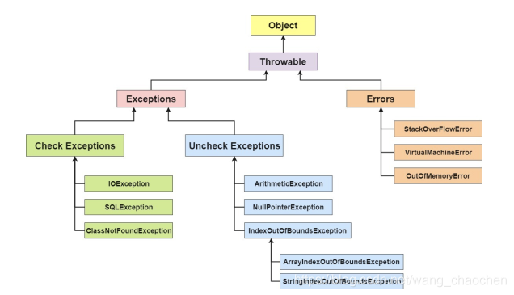
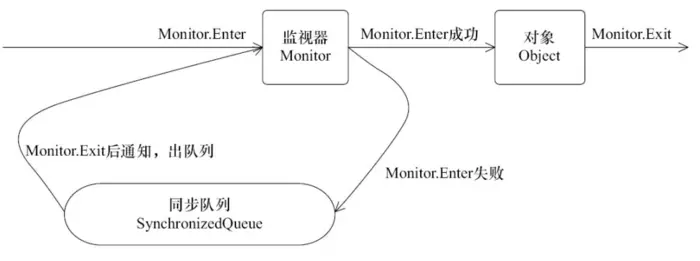
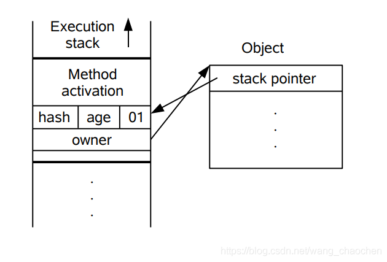
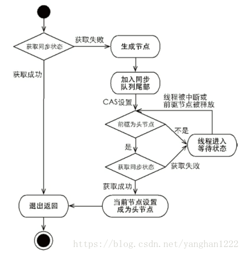
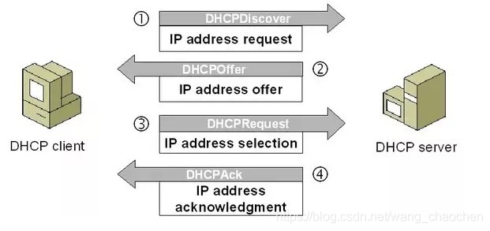
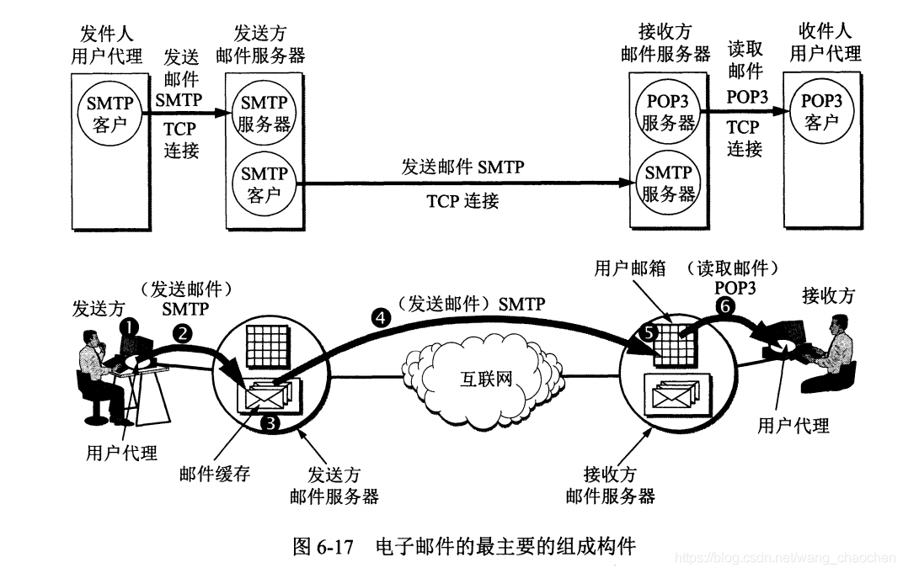

# Java 基础

*记录一部分基础的笔记*

## 排序算法：


## Linux命令了解哪些

- jobs

  查看**当前控制台的后台进程**，想要停止后台进程，使用jobs命令查看其进程号（比如为num），然后kill %num即可

- ps 查看后台进程

- top 查看**所有进程和资源使用情况**，类似Windows中的任务管理器

  停止进程：界面是交互式的，在窗口输入k 之后输入PID，会提示输入停止进程模式 有SIGTERM和 SIGKILL 如果留空不输入，就是SIGTERM（优雅停止）

- free：查看**当前系统的总内存大小**以及使用内存的情况；

- if config：查ip地址，MAC地址

- netstat：查看端口


## 八大基本数据类型

Java基本数据类型有8种：

| 基本类型           | 大小            | 最小值 | 最大值   | 默认值 |
| ------------------ | --------------- | ------ | -------- | ------ |
| byte （位）        | 8 bits = 1字节  | -2^7   | 2^7 - 1  | 0      |
| short （短整数）   | 16 bits = 2字节 | -2^15  | 2^15 - 1 | 0      |
| int （整数）       | 32 bits = 4字节 | -2^31  | 2^31 - 1 | 0      |
| long （长整数）    | 64 bits = 8字节 | -2^63  | 2^63 - 1 | 0      |
| float （单精度）   | 32 bits = 4字节 | -2^31  | 2^31 - 1 | 0.0    |
| double （双精度）  | 64 bits = 8字节 | -2^63  | 2^63 - 1 | 0.0    |
| char （字符）      | 16 bits = 2字节 | 0      | 2^16 - 1 | 空     |
| boolean （布尔值） | 1 bit           | true   | false    | false  |

**最高位是符号位**

**名词解析：**

bit : 位，计算机存储数据的最小单元，二进制数中的一个位数。
byte : 字节，计算机存储数据的基本单位，一个字节由8位二进制数组成。通常一个汉字占两个字节。


## 面试题: Java语言的特点：

1. 纯**面向对象**的语言。
2. **平台无关性**，一次编译，到处运行。
3. Java提供了丰富的**内置的类库**。 比如，Java语言提供了对**多线程**的支持，提供了对**网络通信**的支持，最重要的是提供了**垃圾回收**器，让开发人员能够从内存管理中解脱出来。 
4. Java语言提供了**Web应用开发**的支持。 
5. **程序严谨整洁**。Java语言去掉了C++中难以理解的，容易混淆的特性，例如头文件、指针、结构、单元、运算符重载、虚拟基础类、多重继承等。 
6. Java语言具有良好的**安全性和鲁棒性**。Java语言经常被用在网络环境中，为了增强安全性，Java语言提供了防止恶意代码攻击的安全机制（数组边界检查和byte code校验等）。Java的强类型机制，垃圾回收器， 异常处理和安全检查机制使其具有很好的健壮性。


## 面试题1：面向对象和面向过程的区别：

**面向过程**：面向过程的性能比面向对象高。因为类调用时需要实例化，开销较大，比较消耗资源，所以当性能是最重要的考量因素时（如单片机、嵌入式开发、Linux/Unix等一般采用面向过程开发。

**面向对象**：面向对象易维护、易复用、易扩展。因为面向对象有封装、继承、多态三大特性，可以设计出低耦合的系统，使系统更加灵活、更加易于维护。但是性能低于面向过程。


 ## 面试题2：面向对象编程三大特性：

**OOP(Object Oriented Programming)**  

### **1、封装：**

封装把⼀个对象的属性私有化，同时提供⼀些可以被外界访问的属性的⽅法  

在java中提供了4中修饰符，来实现封装。分别是default,public,private和protected。 

| 作用域    | 当前类 | 同包   | 子类   | 其他   |
| --------- | ------ | ------ | ------ | ------ |
| private   | 支持   | 不支持 | 不支持 | 不支持 |
| default   | 支持   | 支持   | 不支持 | 不支持 |
| protected | 支持   | 支持   | 支持   | 不支持 |
| public    | 支持   | 支持   | 支持   | 支持   |

public：在写公共方法会使用到。

private：在类中有些私有的方法会用到但是比较少，一般是在变量私有，使用get，set方法时，会配合public一起使用。

default：在不写修饰符的情况下，默认为default修饰符。另外有个特殊的点，就是接口的方法不写修饰符，默认是public。而不是default

protected：保护，更多的是用于框架层啦，就是子类的引用支持，像封装了struts。在controller层就必须继承某一个类一样。

### **2、继承：**

继承是使⽤已存在的类的定义作为基础建立新类的技术，新类的定义可以增加新的数据或新的功能，也可以用父类的功能，但**不能选择性地继承父类**。通过使用继承可以更方便地复用之前的代码。

```
关于继承如下 3 点请记住：
	1. 子类拥有⽗类对象所有的属性和方法（包括私有属性和私有方法），但是⽗类中的私有属性和方法子类无法访问，只是拥有。
	2. 子类可以对父类进行扩展，拥有自己的属性和方法。
	3. 子类可以以自己的方式实现父类的方法。
```

### **3、多态：**

​	多态就是指**程序中定义的引用变量所指向的具体类型和通过该引用变量发出的方法调用在编程时并不确定，而是在程序运行期间才确定**，即**一个引⽤变量到底会指向哪个类的实例对象**，该引用变量发出的方法调用到底是哪个类中实现的方法，必须在由**程序运行期间**才能决定。
​	在 Java 中有两种形式可以实现多态：继承（多个子类对同一方法进行重写）和接口（实现接口并覆盖接口中同一方法）。  

- 1、方法的多态性（同样的方法有不同的实现）
  - 方法的重载：同一个方法可以根据传入参数类型或个数的不同实现不同功能；
  - 方法的覆写：同一个方法可能根据实现子类的不同有不同的实现
- 2、对象的多态性（父类与子类实例间的转换处理）
  - 对象向上转型：父类 父类实例 = 子类实例    --->自动完成转换
  - 对象向下转型：子类 子类实例 = （子类）父类实例   ---> 强制完成转换


## 1、缓存池

- new Integer(123) 每次都会新建一个对象；
- Integer.valueOf(123) 会使用缓存池中的对象，多次调用会取得同一个对象的引用。 

## 2、String 

**String声明为final 不可被继承，Integer包装类等也不能被继承**
String源码：Java8内部使用char数组存储数据，Java9之后使用byte数组存储，coder表示编码类型

**String源码中value数组被声明为final，value数组在初始化之后不能引用其他数组。**
**String内部没有改变value数组的方法，可保证String不可变。**

## 3、final关键字

	final关键字：
	1、使用final定义的类不能有子类--不能被继承
	2、使用final定义的方法不能被子类覆写，但是可以被重载
		--private 方法隐式地被指定为 final，如果在子类中定义的方法和父类中的一个 private 方法签名相同--不是重写是新定义
	3、对于一个final变量，如果是基本数据类型的变量，则其数值一旦在初始化之后便不能更改；
	     如果是引用类型的变量，则在对其初始化之后便不能再让其指向另一个对象。被引用的对象本身可以修改

## 4、String不可变的好处

	1、可以缓存哈希值--用作HashMap的key，不可变是hash值也不可变，只需进行一次计算。--加快字符串处理速度
	2、便于实现字符串池（String pool）--在堆中开辟一块存储空间String Pool，如果String对象已被创建，从池中取得引用
	3、保证安全性---用作参数，参数不可变。网络连接中
	4、多线程安全---不可变对象不能被写，保证线程安全。

## 5、StringBuffer 和 StringBuilder

StringBuffer 和 StringBuilder **可变**
**StringBuilder 不是线程安全的，速度快**
**StringBuffer 是线程安全的，内部使用 synchronized 进行同步**


- 为什么StringBuilder快？ 

String在java中是**不可变长**的,一旦初始化就不能修改长度,简单的字符串拼接**其实是创建新的String对象**，再把拼接后的内容赋值给新的对象,在频繁修改的情况下会频繁创建对象,而StringBuilder则不会，从头到尾只有一个实例对象。

StringBuilder在append时**放到一个value的char数组中,**字符串是固定长度的,**而数组是可以扩容的,这样就不需要不停创建对象了。**


## 6、 intern()

String 的 intern() 方法在运行过程将字符串添加到 String Pool 中。

```java
String s1 = new String("aaa");
String s2 = new String("aaa");
System.out.println(s1 == s2);           // false
String s3 = s1.intern();
String s4 = s2.intern();
System.out.println(s3 == s4);           // true

String s5 = "bbb";
String s6 = "bbb";
System.out.println(s5 == s6);  // true
```

## 7、new String("abc")

	使用这种方式一共会创建两个字符串对象（前提是 String Pool 中还没有 "abc" 字符串对象）：
	1、"abc" 属于字符串字面量，因此编译时期会在 String Pool 中创建一个字符串对象，指向这个 "abc" 字符串字面量；
	2、而使用 new 的方式会在堆中创建一个字符串对象。

 javap -verbose 进行反编译

```java
// ...
Constant pool:
// ...
   #2 = Class              #18            // java/lang/String
   #3 = String             #19            // abc
// ...
  #18 = Utf8               java/lang/String
  #19 = Utf8               abc
// ...

  public static void main(java.lang.String[]);
    descriptor: ([Ljava/lang/String;)V
    flags: ACC_PUBLIC, ACC_STATIC
    Code:
      stack=3, locals=2, args_size=1
         0: new           #2                  // class java/lang/String
         3: dup
         4: ldc           #3                  // String abc
         6: invokespecial #4                  // Method java/lang/String."<init>":(Ljava/lang/String;)V
         9: astore_1
// ...
```

	在 Constant Pool 中，#19 存储这字符串字面量 "abc"，#3 是 String Pool 的字符串对象，它指向 #19 这个字符串字面量。
	在 main 方法中，0: 行使用 new #2 在堆中创建一个字符串对象，并且使用 ldc #3 将 String Pool 中的字符串对象作为String 构造函数的参数。


## 8、引用传递和值传递

```
Java 的参数是以值传递的形式传入方法中，而不是引用传递。

值传递是传递实参副本，函数修改不会影响实参；引用传递是传递实参地址，函数修改会影响实参。
然而在 Java 中，没有引用的概念，Java 中只要定义变量就会开辟一个存储单元。因此，对 Java 语言来说只有值传递，没有引用传递是正确的。 
```

- **值传递：**指在调用函数时将实际参数复制一份传递到函数中，这样在函数中如果对参数进行修改，将不会影响到实际参数。
- **引用传递**：是指在调用函数时将实际参数的地址直接传递到函数中(的形参)，那么在函数中对参数所进行的修改，将影响到实际参数。
  引用传递：形参为指向实参地址的指针，当对形参的指向操作时，就相当于对实参本身进行的操作。  


## 9、字面量

Java直接量/字面量---是指在程序中通过源代码直接给出的值

	能指定直接量的通常只有三种类型：基本类型、字符串类型和 null 类型。具体如下 8 种类型：
	1）int 类型的直接量---整型数值，可分为二进制( 0B 或 0b)、十进制、八进制(以 0 开头)和十六进制( 0x 或 0X ) 4 种，
	2）long 类型的直接量---在整型数值后添加 l 或 L 后就变成了 long 类型的直接量。例如 3L、0x12L（对应十进制的 18L）。
	3）float 类型的直接量---在一个浮点数后添加 f 或 F 就变成了 float 类型的直接量，这个浮点数可以是标准小数形式，也可以是科学计数法形式。
	4）double 类型的直接量---直接给出一个标准小数形式或者科学计数法形式的浮点数就是 double 类型的直接量。例如 5.34、3.14E5。
	5）boolean 类型的直接量---只有 true 和 false。
	6）char 类型的直接量---有三种形式，分别是用单引号括起来的字符、转义字符和 Unicode 值表示的字符。例如‘a’，‘\n’和‘\u0061’。
	7）String 类型的直接量----一个用双引号括起来的字符序列就是 String 类型的直接量。
	8）null 类型的直接量 --- 即 null。--可以赋给任何引用类型的变量，用以表示这个引用类型变量中保存的地址为空，即还未指向任何有效对象。

**10、Java 不能隐式执行向下转型，因为这会使得精度降低。**

**11、从 Java 7 开始，可以在 switch 条件判断语句中使用 String 对象， 不支持 long、float、double**

## 12、static关键字

	1、静态变量
		静态变量：类变量，属于这个类，类所有实例共享静态变量，可直接通过类名访问。在内存中只存在一份
		实例变量：每创建一个实例就会产生一个实例变量，与该实例共存亡。
	2、静态方法
		静态方法在类加载的时候就存在了，它不依赖于任何实例。所以静态方法必须有实现，也就是说它不能是抽象方法。
		只能访问所属类的静态字段和静态方法，方法中不能有 this 和 super 关键字，因此这两个关键字与具体对象关联。
	3、静态语句块
		在类初始化时运行一次。
	4、静态内部类
		非静态内部类依赖于外部类的实例，也就是说需要先创建外部类实例，才能用这个实例去创建非静态内部类。
		而静态内部类不需要，可以直接创建静态内部类。
		静态内部类不能访问外部类的非静态的变量和方法。
	5、静态导包
		在使用静态变量和方法时不用再指明 ClassName，从而简化代码，但可读性大大降低。

## 13、初始化顺序

	1、按代码中的顺序初始化静态变量和静态语句块
	2、实例变量和普通语句块
	3、构造函数的初始化
	
	存在继承的情况下，初始化顺序：
		1、父类（静态变量、静态语句块）
		2、子类（静态变量、静态语句块）
		3、父类（实例变量、普通语句块）
		4、父类（构造函数）
		5、子类（实例变量、普通语句块）
		6、子类（构造函数）

## 14、equals和==

	等价关系：满足自反性、对称性、传递性、一致性、与null比较false
	
	0、==是运算符，equals是方法，在底层是一样的，部分类对其进行了重写
	1、对于基本类型，== 判断两个值是否相等，基本类型没有 equals() 方法。
	2、对于引用类型，== 判断两个变量是否引用同一个对象，而 equals() 判断引用的对象是否等价。
	
	equals源码实现：
		检查是否为同一个对象的引用，如果是直接返回 true；
		检查是否是同一个类型，如果不是，直接返回 false；----自己查看源码是使用instanceof判断是否同一类型
		将 Object 对象进行转型；
		判断每个关键域是否相等 == 。---自己查看源码是对value数组进行逐一对比
	
	1、String 中的 equals ⽅法是被重写过的，因为 object 的 equals ⽅法是比较对象的内存地址，⽽ String 的 equals ⽅法⽐较的是对象的值。
	2、当创建 String 类型的对象时，虚拟机会在常量池中查找有没有已经存在的值和要创建的值相同的对象，如果有就把它赋给当前引⽤。如果没有就在常量池中重新创建⼀个 String 对象


## Object有哪些方法？

Object是所有类的父类，任何类都默认继承自Object，它的方法有：

（1）getClass，获取运行时的类型，返回一个Class对象

（2）equals方法，**判断对象引用的地址是否相等，所以默认与==一样，一般子类都要重写。**

（3）hashCode方法，返回对象的hash值，一般子类重写了equals就要重写hashcode，保证相同对象有相同hash值。

（4）toString方法，打印对象的信息

（5）clone方法，实现对象的浅拷贝，需实现克隆的接口。

（6）wait() 和 notify()方法，是多线程中的方法，等待唤醒


## 15、equals()和 hashcode()

	两个对象相等，hashcode一定相等
	两个对象不等，hashcode不一定不等
	hashcode相等，两个对象不一定相等
	hashcode不等，两个对象一定不等

等价的两个对象哈希值一定相同，但是哈希值相同的两个对象不一定等价。
这是因为计算哈希值的方法具有随机性，两个值不同的对象可能计算出相同的哈希值。
**在覆盖 equals() 方法时应当总是覆盖 hashCode() 方法，保证等价的两个对象哈希值也相等。**

理想的哈希函数应当具有均匀性，即不相等的对象应当均匀分布到所有可能的哈希值上
哈希函数将所有域的值考虑进来，每个域当成R进制某一位，组成一个R进制的整数。

	R 一般取 31，因为它是一个奇素数，
	如果是偶数的话，当出现乘法溢出，信息就会丢失，因为与 2 相乘相当于向左移一位，最左边的位丢失。
	并且一个数与 31 相乘可以转换成移位和减法：31*x == (x<<5)-x，编译器会自动进行这个优化。

```java
@Override
public int hashCode() {
    int result = 17;
    result = 31 * result + x;
    result = 31 * result + y;
    result = 31 * result + z;
    return result;
}
```


## 16、toString（）

	toString()默认返回 ToStringExample@4554617c 这种形式，
	其中 @ 后面的数值为散列码的无符号十六进制表示。

## 17、clone()--深拷贝、浅拷贝

clone() 是 Object 的 protected 方法，它不是 public，一个类不显式去重写 clone()，其它类就不能直接去调用该类实例的 clone() 方法。

clone() 方法并不是 Cloneable 接口的方法。但是要调用clone() 方法必须要实现Clonable接口。
public class CloneExample implements Cloneable {....}

拷贝：

	浅拷贝：拷贝对象和原始对象的引用类型引用同一个对象
	深拷贝：拷贝对象和原始对象的引用类型引用不同对象-----新建一个新的对象
	----最好不要去使用 clone()，可以使用拷贝构造函数或者拷贝工厂来拷贝一个对象。

```java
	//浅拷贝
 	@Override
    protected ShallowCloneExample clone() throws CloneNotSupportedException {
        return (ShallowCloneExample) super.clone();
    }
	
	//深拷贝
    @Override
    protected DeepCloneExample clone() throws CloneNotSupportedException {
        DeepCloneExample result = (DeepCloneExample) super.clone();
        result.arr = new int[arr.length];
        for (int i = 0; i < arr.length; i++) {
            result.arr[i] = arr[i];
        }
        return result;
    }
```

## 18、访问权限

如果子类的方法重写了父类的方法，那么子类中该方法的访问级别不允许低于父类的访问级别。
字段决不能是公有的，可以使用公有的 getter 和 setter 方法来替换公有字段，这样的话就可以控制对字段的修改行为。

## 19、抽象类和接口

<u>**抽象类**：</u><abstract关键字>

- 抽象类不能被实例化，只能被继承。构造方法不能用于实例化，抽象类不能用来创建对象，是为了继承而存在的。

- 一个子类继承自一个抽象类，则子类必须实现父类抽象方法，否则子类也必须定义为抽象类

- 包含抽象方法的一定是抽象类，但是抽象类不一定含有抽象方法

- 抽象方法是一种特殊的方法：只有声明，没有具体的实现。

- 抽象方法必须为public和protected（如果为private，就不能被继承），缺省为public。

  抽象方法被abstract修饰，不能被private、static、synchronized、native等修饰，必须以分号结尾，不带大括号。

<u>**接口：**</u><interface关键字>

- 接口默认是public abstract的，java8之前可以看成一个完全抽象的类，内部全是抽象方法

- 接口支持多重继承，一个接口可以extends多个接口，解决了Java中类的单继承问题

- 一个类可以实现多个接口

- 接口可以包含变量、方法；变量被隐式指定为public static final,方法被隐式指定为public abstract（JDK1.8之前）

- 接口的成员（字段 + 方法）默认都是 public 的，并且不允许定义为 private 或者 protected。

  1、从 Java 8 开始，接口也可以拥有非抽象的方法实现，但必须用default修饰；定义了default的方法可以不被实现子类所实现，但只能被实现子类的对象调用；如果子类实现了多个接口，并且这些接口包含一样的默认方法，则子类必须重写默认方法

  2、JDK1.8 允许使用static关键字修饰并提供实现，称为接口静态方法。只能通过（接口名.静态方法名）进行调用。

  3、从 Java 9 开始，允许将方法定义为 private，这样就能定义某些复用的代码又不会把方法暴露出去。

**<u>抽象类和接口比较：</u>**

**相同点：**

1、都不能被实例化

2、接口的实现类或抽象类的子类都只有实现了接口或抽象类中的方法后才能实例化

**不同点：**

1、实现接口implements，继承抽象类extends；一个类可以实现多个接口，但是不能继承多个抽象类。使用接口可以间接实现多重继承。

2、接口只有定义，不能有方法的实现，同时接口中成员方法都是public static的，Java8 中可以定义dedault方法体；而抽象类可以有定义与实现，方法可在抽象类中实现。

3、接口的成员变量默认为public static final，必须赋初值，不能被修改；抽象类中成员变量默认为default，可以在子类中被重新定义，也可以被重新赋值。

4、接口的成员只能是 public 的，而抽象类的成员可以有多种访问权限。

5、从设计层面来说，抽象是对类的抽象，是⼀种模板设计，而接口是对行为的抽象，是一种行为的规范。接口强调特定功能的实现，而抽象类强调所属关系。

<u>**使用场景：**</u>

使用接口：
	1、需要让不相关的类都实现一个方法，例如不相关的类都可以实现 Comparable 接口中的 compareTo() 方法；
	2、需要使用多重继承。
	
使用抽象类：
	1、需要在几个相关的类中共享代码。
	2、需要能控制继承来的成员的访问权限，而不是都为 public。
	3、需要继承非静态和非常量字段。

## 20、覆写、重载

**覆写（Override）**：存在于继承体系中，指子类实现了一个与父类在方法声明上完全相同的一个方法。

限制：--使用 @Override 注解，可以让编译器帮忙检查是否满足上面的三个限制条件。

	1、子类方法的访问权限public必须大于等于父类方法protected；
	2、子类方法的返回类型ArrayList<Integer>必须是父类方法返回类型或为其子类型 List<Integer>。
	3、子类方法抛出的异常类型 Exception必须是父类抛出异常类型或为其子类型 Throwable。

方法调用的优先级为：

	this.func(this)--------本类中是否有对应的方法
	super.func(this)------父类中有没有对应方法
	this.func(super)------对参数向上转型，超参
	super.func(super)----查找父类中有没有这个超参

**重载（Overload）：**

	存在于同一个类中，指一个方法与已经存在的方法名称上相同，但是参数类型、个数、顺序至少有一个不同。
	应该注意的是，返回值不同，其它都相同不算是重载。

## 21、JRE & JDK

**JRE: **
Java Runtime Environment, Java运行环境，为Java的运行提供所需环境。
是一个JVM程序，主要包括了JVM的标准实现和一些Java基本类库。

**JDK：**
Java Development Kit，Java开发工具包，提供了Java的开发及运行环境。
JDK是Java开发的核心，集成了JRE和一些其它的工具，比如编译Java源码的编译器javac等。

## 22、Java和C++的区别

	1、Java 是纯粹的面向对象语言，所有的对象都继承自 java.lang.Object，C++ 为了兼容 C 即支持面向对象也支持面向过程。
	2、Java 通过虚拟机从而实现跨平台特性，但是 C++ 依赖于特定的平台。
	3、Java 没有指针，它的引用可以理解为安全指针，而 C++ 具有和 C 一样的指针。
	4、Java 支持自动垃圾回收，而 C++ 需要手动回收。
	5、Java 不支持多重继承，只能通过实现多个接口来达到相同目的，而 C++ 支持多重继承。
	6、Java 不支持操作符重载，虽然可以对两个 String 对象执行加法运算，但是这是语言内置支持的操作，不属于操作符重载，而 C++ 可以。
	7、Java 的 goto 是保留字，但是不可用，C++ 可以使用 goto。

## Java和C++的区别：

1. **都是面向对象**的语⾔，都⽀持封装、继承和多态
2. **Java 不提供指针来直接访问内存**，程序内存更加安全
3. Java 的**类是单继承**的， C++ ⽀持多重继承；虽然 Java 的类不可以多继承，但是接⼝可以多继承。
4. Java 有**自动内存管理机制**，不需要程序员⼿动释放⽆⽤内存
5. 在 C 语⾔中，**字符串或字符数组最后都会有⼀个额外的字符‘\0’来表示结束**。但是， Java 语⾔中没有结束符这⼀概念。   


## 23、Java 8 新特性：

	1、Lambda 表达式 − Lambda 允许把函数作为一个方法的参数（函数作为参数传递到方法中）。
	2、方法引用 − 方法引用提供了非常有用的语法，可以直接引用已有Java类或对象（实例）的方法或构造器。
			与lambda联合使用，方法引用可以使语言的构造更紧凑简洁，减少冗余代码。
	3、默认方法 − 默认方法就是一个在接口里面有了一个实现的方法。
	4、新工具 − 新的编译工具，如：Nashorn引擎 jjs、 类依赖分析器jdeps。
	5、Stream API −新添加的Stream API（java.util.stream） 把真正的函数式编程风格引入到Java中。
	6、Date Time API − 加强对日期与时间的处理。
	7、Optional 类 − Optional 类已经成为 Java 8 类库的一部分，用来解决空指针异常。
	8、Nashorn, JavaScript 引擎 − Java 8提供了一个新的Nashorn javascript引擎，它允许我们在JVM上运行特定的javascript应用。


## 24、反射

	每个类都有一个 Class 对象，包含了与类有关的信息。
	当编译一个新类时，会产生一个同名的 .class 文件，该文件内容保存着 Class 对象。
	
	类加载相当于 Class 对象的加载，类在第一次使用时才动态加载到 JVM 中。也可以使用 Class.forName("com.mysql.jdbc.Driver") 这种方式来控制类的加载，该方法会返回一个 Class 对象。
	
	反射可以提供运行时的类信息，并且这个类可以在运行时才加载进来，甚至在编译时期该类的 .class 不存在也可以加载进来。


Class 和 java.lang.reflect 一起对反射提供了支持，java.lang.reflect 类库主要包含了以下三个类：

	Field ：可以使用 get() 和 set() 方法读取和修改 Field 对象关联的字段；
	Method ：可以使用 invoke() 方法调用与 Method 对象关联的方法；
	Constructor ：可以用 Constructor 的 newInstance() 创建新的对象。

反射的优点：

	1、可扩展性 ：应用程序可以利用全限定名创建可扩展对象的实例，来使用来自外部的用户自定义类。
	2、类浏览器和可视化开发环境 ：一个类浏览器需要可以枚举类的成员。可视化开发环境（如 IDE）可以从利用反射中可用的类型信息中受益，以帮助程序员编写正确的代码。
	3、调试器和测试工具 ： 调试器需要能够检查一个类里的私有成员。测试工具可以利用反射来自动地调用类里定义的可被发现的 API 定义，以确保一组测试中有较高的代码覆盖率。

反射的缺点：

	尽管反射非常强大，但也不能滥用。如果一个功能可以不用反射完成，那么最好就不用。在我们使用反射技术时，下面几条内容应该牢记于心。
	
	1、性能开销 ：反射涉及了动态类型的解析，所以 JVM 无法对这些代码进行优化。因此，反射操作的效率要比那些非反射操作低得多。我们应该避免在经常被执行的代码或对性能要求很高的程序中使用反射。
	2、安全限制 ：使用反射技术要求程序必须在一个没有安全限制的环境中运行。如果一个程序必须在有安全限制的环境中运行，如 Applet，那么这就是个问题了。
	3、内部暴露 ：由于反射允许代码执行一些在正常情况下不被允许的操作（比如访问私有的属性和方法），所以使用反射可能会导致意料之外的副作用，这可能导致代码功能失调并破坏可移植性。反射代码破坏了抽象性，因此当平台发生改变的时候，代码的行为就有可能也随着变化。

## 25、注解 Annotation

Java 注解是附加在代码中的一些元信息，用于一些工具在编译、运行时进行解析和使用，起到说明、配置的功能。注解不会也不能影响代码的实际逻辑，仅仅起到辅助性的作用。包含在 java.lang.annotation 包中。


## 26、异常




**编译器并不会检查 Unchecked Exception**，RuntimeException 是 Exception 的子类，Error 是 Throwable的子类, 而 RuntimeException 和 Error 都是 Unchecked Exception 类。


	1.所有的异常都是从Throwable继承而来的，是所有异常的共同祖先。
	
	2.Throwable有两个子类，Error和Exception。 
	  其中Error是错误，对于所有的编译时期的错误以及系统错误都是通过Error抛出的。
	  这些错误表示故障发生于虚拟机自身、或者发生在虚拟机试图执行应用时，如Java虚拟机运行错误（Virtual MachineError）、类定义错误（NoClassDefFoundError）等。 
	
	3.Exception，是另外一个非常重要的异常子类。它规定的异常是程序本身可以处理的异常。异常和错误的区别是，异常是可以被处理的，而错误是没法处理的。  
	
	4.Checked Exception--受检异常
	除了RuntimeException及其子类以外，都是checked exception。
	是编码时非常常用的，发生主要是由于一些特殊情况没有考虑到，所有checked exception都是需要在代码中处理的。
	它们的发生是可以预测的，是正常的一种情况，可以合理的处理。
	该异常要么被catch子句捕获要么通过throws子句继续抛出。
	比如IOException，或者一些自定义的异常。---项目中线程自旋--Thread.sleep(3000);--必须要处理异常，否则不能通过编译
	比如如果网络连接失败会抛出 IOException，但是我们的程序应该能够提前预料到这些可能发生的异常，并对其进行处理，这样程序在运行过程中才不会崩掉，这也是编译器强制开发者对 Checked Exception 进行处理的原因。
	
	5.Unchecked Exception--非受检异常
	RuntimeException及其子类都是unchecked exception。--没有要求客户端调用时必须处理这种类型的异常。
	比如NPE空指针异常，除数为0的算数异常ArithmeticException等等，这种异常是**运行时发生**，无法预先捕捉处理的。
	Error也是unchecked exception，也是无法预先处理的。


​	1、Unchecked Exception 的发生有一些是由于开发者代码逻辑错误造成的，比如：NullPointerException 这种异常可以通过检查一个引用是否为 null 来进行避免。
​	
​	2、有一些 Unchecked Exception 出现并不是因为开发者程序的问题，这些 Exception 是 java.lang.Error 的子类。
​	就像 OutOfMemoryError 可能发生在任意一个示例对象创建时，但我们不可能在每个对象实例创建时都使用 catch 块去捕获异常。因此，我们也就不可能预料这些异常的发生，编译器在编译时也无法检测到这些异常。


	1. 通过try...catch语句块来处理：
	Catch 语句包含要捕获异常类型的声明。当保护代码块中发生一个异常时，try 后面的 catch 块就会被检查。
	如果发生的异常包含在 catch 块中，异常会被传递到该 catch 块，这和传递一个参数到方法是一样。
	
	2. 另外，也可以在具体位置不处理，直接抛出，通过throws/throw到上层再进行处理。 
	具体的，如果一个方法没有捕获到一个受检异常，那么该方法必须使用 throws 关键字来声明。
	throws 关键字放在方法签名的尾部。
	也可以使用 throw 关键字抛出一个异常，无论它是新实例化的还是刚捕获到的。 

```
try
{
   // 程序代码
}catch(ExceptionName e1)
{
   //Catch 块
}
调用该方法时，读取文件时若发生异常，代码会进入 catch 代码块，之后进入 finally 代码块；若读取文件时未发生异常，则会跳过 catch 代码块直接进入 finally 代码块。所以无论代码中是否发生异常，fianlly 中的代码都会执行。

注意：--finally中的return会覆盖前面的return
	不要在finally块中使用return。
	--try块中的return语句执行成功后，并不马上返回，而是继续执行finally块中的语句，如果finally块中存在return语句，则在此直接返回，丢弃掉try块中的返回点。
```


#### 异常常见面试题：

```
1、Error 和 Exception 区别是什么？
Error 类型的错误通常为虚拟机相关错误，如系统崩溃，内存不足，堆栈溢出等，编译器不会对这类错误进行检测，JAVA 应用程序也不应对这类错误进行捕获，一旦这类错误发生，通常应用程序会被终止，仅靠应用程序本身无法恢复；
Exception 类的错误是可以在应用程序中进行捕获并处理的，通常遇到这种错误，应对其进行处理，使应用程序可以继续正常运行。

2、运行时异常Runtime和一般异常区别是什么？


3、NoClassDefFoundError 和 ClassNotFoundException 区别是什么？
NoClassDefFoundError 是一个 Error 类型的异常，是由 JVM 引起的，不应该尝试捕获这个异常。引起该异常的原因是 JVM 或 ClassLoader 尝试加载某类时在内存中找不到该类的定义，该动作发生在运行期间，即编译时该类存在，但是在运行时却找不到了，可能是变异后被删除了等原因导致；
ClassNotFoundException 是一个受查异常，需要显式地使用 try-catch 对其进行捕获和处理，或在方法签名中用 throws 关键字进行声明。当使用 Class.forName, ClassLoader.loadClass 或 ClassLoader.findSystemClass 动态加载类到内存的时候，通过传入的类路径参数没有找到该类，就会抛出该异常；另一种抛出该异常的可能原因是某个类已经由一个类加载器加载至内存中，另一个加载器又尝试去加载它。

4、JVM 是如何处理异常的？
在一个方法中如果发生异常，这个方法会创建一个异常对象，并转交给 JVM，该异常对象包含异常名称，异常描述以及异常发生时应用程序的状态。创建异常对象并转交给 JVM 的过程称为抛出异常。可能有一系列的方法调用，最终才进入抛出异常的方法，这一系列方法调用的有序列表叫做调用栈。
JVM 会顺着调用栈去查找看是否有可以处理异常的代码，如果有，则调用异常处理代码。当 JVM 发现可以处理异常的代码时，会把发生的异常传递给它。如果 JVM 没有找到可以处理该异常的代码块，JVM 就会将该异常转交给默认的异常处理器（默认处理器为 JVM 的一部分），默认异常处理器打印出异常信息并终止应用程序。

5、throw 和 throws 的区别是什么？
throw 关键字用来抛出方法或代码块中的异常，受查异常和非受查异常都可以被抛出。
throws 关键字用在方法签名处，用来标识该方法可能抛出的异常列表。一个方法用 throws 标识了可能抛出的异常列表，调用该方法的方法中必须包含可处理异常的代码，否则也要在方法签名中用 throws 关键字声明相应的异常。

6、常见的 RuntimeException 有哪些？
	1、ClassCastException(类转换异常)
	2、IndexOutOfBoundsException(数组越界)
	3、NullPointerException(空指针)
	4、ArrayStoreException(数据存储异常，操作数组时类型不一致)
	5、还有IO操作的BufferOverflowException异常
```


## 27、泛型

#### 1、什么是泛型？为什么要使用泛型？

**泛型，即“参数化类型”。**

一提到参数，最熟悉的就是定义方法时有形参，然后调用此方法时传递实参。

那么参数化类型怎么理解呢？顾名思义，就是**将类型由原来的具体的类型参数化**，类似于方法中的变量参数，此时类型也定义成参数形式（可以称之为类型形参），然后在使用/调用时传入具体的类型（类型实参）。

泛型的本质是为了参数化类型（**在不创建新的类型的情况下，通过泛型指定的不同类型来控制形参具体限制的类型**）。也就是说在泛型使用过程中，操作的数据类型被指定为一个参数，这种参数类型可以用在类、接口和方法中，分别被称为泛型类、泛型接口、泛型方法。

在集合中存储对象并在使用前进行类型转换是不方便的。泛型防止了那种情况的发生。它提供了编译期的类型安全，确保你只能把正确类型的对象放入集合中，避免了在运行时出现ClassCastException。

#### 2、 Java的泛型是如何工作的 ? 什么是类型擦除 ?

泛型是通过**类型擦除**来实现的，编译器在编译时擦除了所有类型相关的信息，所以在运行时不存在任何类型相关的信息。

例如List<String>在运行时仅用一个List来表示。这样做的目的，是确保能和Java 5之前的版本开发二进制类库进行兼容。你无法在运行时访问到类型参数，因为**编译器已经把泛型类型转换成了原始类型**。


Java的泛型是伪泛型。在编译期间，所有的泛型信息都会被擦除掉。正确理解泛型概念的首要前提是理解**类型擦除（type erasure）**。 编译器会将泛型的类型参数都擦除成它的限定类型，如果没有则擦除为object类型之后在获取的时候再强制类型转换为对应的类型。 在运行期间并没有泛型的任何信息，因此也没有优化。 

[10道泛型面试题](https://cloud.tencent.com/developer/article/1033693)
[泛型详解](https://www.cnblogs.com/Blue-Keroro/p/8875898.html)


## 28、Volatile关键字

为了解决线程并发的问题，在语言内部引入了 **同步块** 和 **volatile 关键字**机制。

- **synchronized同步块：**
  在多线程访问的时候，关键字synchronized可以保证同一时刻只能有一个线程执行某方法或某代码块。

- **volatile关键字：**
  - 多线程编程中，不希望对拷贝的副本进行操作，希望直接进行**原始变量**的操作(节约复制变量副本与同步的时间)，就可以在变量声明时使用volatile关键字。
  - 使用volatile定义的变量在进行操作时直接进行**原始变量内容的处理**。
  - 被volatile修饰的变量能够保证每个线程能够获取**该变量的最新值**，从而避免出现**数据脏读**的现象。


### volatile关键字作用：

	Java内存模型有三大特性：
		1、可见性：指线程间的可见性，一个线程修改的状态对另一个线程是可见的。
		2、原子性：指具有不可分割性。---Java中synchronized和锁中的操作是保证原子性的。
			非原子操作都会存在线程安全问题，需要我们使用同步技术（sychronized）来让它变成一个原子操作。
			JUC中AtomicInteger、AtomicLong、AtomicReference
		3、有序性：Java语言提供了volatile和synchronized两个关键字保证线程之间操作的有序性。
			volatile是本身禁止指令重排序，synchronized是--一个变量在同一个时刻只允许一个线程对其进行lock操作。

**1、保证变量的内存可见性**

使用**CPU总线嗅探机制**告知其它线程该变量副本已失效，需要重新从主内存中获取。
相比 synchronized 而言，volatile 可以看作是一个**轻量级锁**，所以使用 volatile 的成本更低，因为它不会引起线程上下文的切换和调度。但 volatile 无法像 synchronized 一样保证操作的原子性。

**2、不保证原子性**

原子性是指在一次操作或者多次操作中，要么所有的操作全部都得到了执行并且不会受到任何因素的干扰而中断，要么所有的操作都不执行。

在多线程环境下，volatile 关键字**可以保证共享数据的可见性**，但是**并不能保证对数据操作的原子性**。也就是说，多线程环境下，使用 volatile 修饰的变量是**线程不安全**的。

对任意单个使用 **volatile 修饰的变量的读 / 写**是具有原子性。

**3、禁止指令重排序**

为了提高性能，编译器和处理器通常会对指令进行重排序。重排序的顺序：

	1、编译器优化重排序。编译器在不改变单线程程序语义的前提下，可以重新安排语句的执行顺序。
	2、指令级并行重排序。现代处理器采用了指令级并行技术来将多条指令重叠执行。如果不存在数据依赖性，处理器可以改变语句对应机器指令的执行顺序。
	3、内存系统重排序。由于处理器使用缓存和读 / 写缓冲区，这使得加载和存储操作看上去可能是在乱序执行。


为了实现volatile内存可见性，JMM会限制特定类型的编译器和处理器重排序。
Java 编译器在生成字节码时，会**在指令序列中插入内存屏障指令**来禁止特定类型的处理器重排序。
**内存屏障**是一组处理器指令，指令重排序时不能把后面的指令重排序到内存屏障之前的位置。
它的作用是禁止指令重排序和解决内存可见性的问题。


**Java内存模型- JMM 的可见性问题：**

JMM 定义了线程和主内存之间的抽象关系：线程之间的共享变量存储在主内存中，每个线程都有一个私有的本地内存，本地内存中存储了该线程以读/写**共享变量的副本**。

每个线程有自己的工作内存，保存共享变量的副本。
线程对变量的读写操作都是对自己的工作内存中操作，不能直接读写主内存中变量。
不同线程之间也不能直接访问对方工作内存中的变量，线程间变量的值传递需要通过主内存中转完成。


因此多线程下共享变量的可见性存在问题---解决：**使用synchronized加锁**、**使用volatile关键字**
1、**加锁**：进入synchronized同步代码块后，线程获得锁，会清空本地内存，然后从主内存中拷贝共享变量的最新值到本地内存作为副本。之后将修改后的副本值刷新到主内存，最后线程释放锁。
2、**使用volatile关键字**：使用volatile修饰共享变量，在线程操作变量副本并写会主内存后，通过**CPU总线嗅探机制**告知其它线程该变量副本已失效，需要重新从主内存中获取。

**总线嗅探机制：--实现缓存一致性**

	计算机中为了提高处理速度，CPU不直接与内存进行通信，而是在CPU与内存之间加入许多寄存器、多级缓存，解决CPU运算速度和内存读取速度不一致的问题。
	由于 CPU 与内存之间加入了缓存，在进行数据操作时，先将数据从内存拷贝到缓存中，CPU 直接操作的是缓存中的数据。但在多处理器下，将可能导致各自的缓存数据不一致（这也是可见性问题的由来），为了保证各个处理器的缓存是一致的，就会实现缓存一致性协议，而嗅探是实现缓存一致性的常见机制。
	
	缓存一致性问题不是由多CPU造成，而是多缓存导致的。

嗅探机制工作原理：

	每个处理器通过监听在总线上传播的数据来检查自己的缓存值是不是过期了，如果处理器发现自己缓存行对应的内存地址修改，就会从将当前处理器的缓存行设置无效状态，当处理器对这个数据进行修改操作时，会重新从主内存中把数据读到CPU缓存中。


# --------------------------------------------------------------------------——————————————————————————————— 


# Java容器


## 1、概述

 
**Collection：存储对象的集合**

	

	1、Set
		1、TreeSet：基于红黑树实现，支持有序性操作。查找效率不如HashSet。查找的时间复杂度为O(logN)
		2、HashSet：基于哈希表HashMap实现，支持快速查找但不有序。失去了元素插入顺序信息。查找的时间复杂度为O(1)
		3、LinkedHashSet：内部使用双向链表维护元素的插入顺序，有HashSet的查找效率。
		
	2、List
		1、ArrayList：基于动态数组实现，支持随机访问。
		2、Vector：类似ArrayList，但是线程安全。性能不如ArrayList，考虑线程并发访问的情况下使用。
		3、LinkedList：基于双向链表实现，只能顺序访问，但是可以快速插入和删除元素。可以实现栈、队列、双向队列。
		
	3、Queue
		1、LinkedList：可以用来实现双向队列
		2、PriorityQueue：基于堆结构实现，可以用来实现优先队列


**Map存储键值对的映射表（两个对象）**


	1、TreeMap:基于红黑树实现。
	2、HashMap：基于哈希表实现。
	3、LinkedHashMap：使用双向链表维护元素的插入顺序或者最近最少使用顺序（LRU）
	4、HashTable：类似HashMap，线程安全的，同一时刻多个线程同时写入 HashTable 不会导致数据不一致。
		--像Vector中stack是遗留类，不应使用它。
		--使用 ConcurrentHashMap 来支持线程安全，效率会更高，因为 ConcurrentHashMap 引入了分段锁。--要单独看


## 2、迭代器模式

一般来说，类集框架中对集合的输出提供了四种方式：Iterator、ListIterator、Enumeration、foreach
分别是迭代输出、双向迭代输出、枚举输出及foreach输出
	

### Iterator：


Collection 继承了 Iterable 接口，其中的 iterator() 方法能够产生一个 Iterator 对象，通过这个对象就可以迭代遍历 Collection 中的元素。

从 JDK 1.5 之后可以使用 foreach 方法来遍历实现了 Iterable 接口的聚合对象。

Collection接口中有toArray()方法可以将集合保存的数据转为对象数组返回。

迭代器遍历方式， 适用于连续内存存储方式，比如数组、 ArrayList（其实 ArrayList底层实现也是数组形式）。 缺点是只能从头开始遍历， 优点是可以边遍历边删除。


**1、概念：**

迭代器模式提供一种方法顺序访问一个集合对象中各个元素，而又不需暴露该对象的内部表示，属于行为模式的一种


**2、使用场景**

- 访问一个集合对象的内容而无须暴露它的内部表示
- 需要为集合对象提供多种遍历方式
- 为遍历不同的集合结构提供一个统一的接口(支持多态迭代化)


**3、优点：**

iterator将遍历一个序列的操作与此序列底层结构香分离. 隐藏了容器底层的结构.
迭代器是一个对象,它的工作是遍历并选择序列中的对象,而客户端程序员不必知道或关心该序列底层的结构.而且创建它的代价小.

- 它支持以不同的方式遍历一个集合对象
- 迭代器简化了集合类
- 在同一个集合上可以有多个遍历
- 在迭代器模式中，增加新的集合类和迭代器类都很方便，无须修改原有代码

**4、缺点：**

由于迭代器模式将存储数据和遍历数据的职责分离，增加新的集合类需要对应增加新的迭代器类，类的个数成对增加，这在一定程度上增加了系统的复杂性


 **ps：为什么用iterator删除元素不抛异常，而用for删除会抛异常呢？**

 这主要是因为arraylist每次遍历的时候会去判断该集合是否被修改过，调用的方法是checkForComodification()。 如果被修改过ConcurrentModificationException异常。

 如何判断是否修改呢，主要是通过维护2个变量来实现，modCount记录了修改次数，expectedModCount记录期望修改次数。 通过iterator.remove()进行的删除操作，会同时修改modCount、ConcurrentModificationException; 而通过list.remove(object/index)，则只会修改modCount。 这也是fast-fail机制。


## 3、适配器模式

java.util.Arrays#asList() 可以把数组类型转换为 List 类型。

```java
@SafeVarargs
public static <T> List<T> asList(T... a)
```

参数为泛型的变长参数，不能使用基本类型数组作为参数，只能使用相应的包装类型数组。--Integer

```java
#1
Integer[] arr = {1, 2, 3};
List list = Arrays.asList(arr);

#2
List list = Arrays.asList(1, 2, 3);
```


# 源码

## 1、ArrayList

### 1、概述

```java
public class ArrayList<E> extends AbstractList<E>
        implements List<E>, RandomAccess, Cloneable, java.io.Serializable{

	private static final long serialVersionUID = 8683452581122892189L;
    private static final int DEFAULT_CAPACITY = 10;
    private static final Object[] EMPTY_ELEMENTDATA = {};
    private static final Object[] DEFAULTCAPACITY_EMPTY_ELEMENTDATA = {};
    transient Object[] elementData; // non-private to simplify nested class access--游离态，默认不序列化
    private int size;
}
```

ArrayList基于数组实现，支持快速随机访问。RandomAccess接口标识该类支持快速随机访问。
数组默认大小为10

### 2、扩容

```java
public boolean add(E e) {
    ensureCapacityInternal(size + 1);  // Increments modCount!!
    elementData[size++] = e;
    return true;
}

private void ensureCapacityInternal(int minCapacity) {
    if (elementData == DEFAULTCAPACITY_EMPTY_ELEMENTDATA) {
        minCapacity = Math.max(DEFAULT_CAPACITY, minCapacity);
    }
    ensureExplicitCapacity(minCapacity);
}

private void ensureExplicitCapacity(int minCapacity) {
    modCount++;
    // overflow-conscious code
    if (minCapacity - elementData.length > 0)
        grow(minCapacity);
}

private void grow(int minCapacity) {
    // overflow-conscious code
    int oldCapacity = elementData.length;
    int newCapacity = oldCapacity + (oldCapacity >> 1);
    if (newCapacity - minCapacity < 0)
        newCapacity = minCapacity;
    if (newCapacity - MAX_ARRAY_SIZE > 0)
        newCapacity = hugeCapacity(minCapacity);
    // minCapacity is usually close to size, so this is a win:
    elementData = Arrays.copyOf(elementData, newCapacity);
}


/**
其中modCount定义在抽象类AbstractList中，定义为游离态的变量。---标记修改次数
该字段被Iterator以及ListIterator的实现类所使用，如果该值被意外更改，Iterator或者ListIterator 将抛出ConcurrentModificationException异常，
这是jdk在面对迭代遍历的时候为了避免不确定性而采取的快速失败原则。
*/
 protected transient int modCount = 0;

```

代码的逻辑是：如果需要往数组里面add元素，通过ensureCapacityInternal()方法来保证容量足够,如果容量不够，就调用grow方法进行扩容。newCapacity = oldCapacity + (oldCapacity >> 1);新容量为旧容量约1.5倍。

    elementData = Arrays.copyOf(elementData, newCapacity);

扩容操作需要调用 Arrays.copyOf() 把原数组整个复制到新数组中，这个操作代价很高，因此最好在创建 ArrayList 对象时就指定大概的容量大小，减少扩容操作的次数。

### 3、删除元素

```java
public E remove(int index) {
    rangeCheck(index);
    modCount++;
    E oldValue = elementData(index);
    int numMoved = size - index - 1;
    if (numMoved > 0)
        System.arraycopy(elementData, index+1, elementData, index, numMoved);
    elementData[--size] = null; // clear to let GC do its work
    return oldValue;
}
```

        System.arraycopy(elementData, index+1, elementData, index, numMoved);

通过arraycopy方法将idx+1后面的元素都复制到idx位置上，时间复杂度为O(N)，删除元素代价高。

### 4、序列化

ArrayList 基于数组实现，并且具有动态扩容特性，因此保存元素的数组不一定都会被使用，那么就没必要全部进行序列化。

保存元素的数组 elementData 使用 transient 修饰，该关键字声明数组默认不会被序列化。

```java
	transient Object[] elementData; // non-private to simplify nested class access
```

ArrayList 实现了 writeObject() 和 readObject() 来控制只序列化**数组中有元素填充那部分内容**。

序列化时需要使用 ObjectOutputStream 的transient writeObject() 将对象转换为字节流并输出。而 writeObject() 方法在传入的对象存在 writeObject() 的时候会去反射调用该对象的 writeObject() 来实现序列化。

反序列化使用的是 ObjectInputStream 的 readObject() 方法，原理类似。

### 5、 Fail-Fast

```java
/**
其中modCount定义在抽象类AbstractList中，定义为游离态的变量。---标记修改次数
该字段被Iterator以及ListIterator的实现类所使用，如果该值被意外更改，Iterator或者ListIterator 将抛出ConcurrentModificationException异常，
这是jdk在面对迭代遍历的时候为了避免不确定性而采取的快速失败原则。
*/
 protected transient int modCount = 0;
```

modCount 用来记录 ArrayList 结构发生变化的次数。结构发生变化是指添加或者删除至少一个元素的所有操作，或者是调整内部数组的大小，仅仅只是设置元素的值不算结构发生变化。

在进行序列化或者迭代等操作时，需要比较操作前后 modCount 是否改变，如果改变了需要抛出 ConcurrentModificationException。


## 2、Vector

### 1、同步

实现与 ArrayList 类似，但是使用了 synchronized 进行同步，线程安全。

```java
public synchronized boolean add(E e) {
    modCount++;
    ensureCapacityHelper(elementCount + 1);
    elementData[elementCount++] = e;
    return true;
}

public synchronized E get(int index) {
    if (index >= elementCount)
        throw new ArrayIndexOutOfBoundsException(index);

    return elementData(index);
}
```

### 2、扩容

Vector的构造函数：
与ArrayList不同，传入了capacityIncrement参数

```java
public Vector(int initialCapacity, int capacityIncrement) {
    super();
    if (initialCapacity < 0)
        throw new IllegalArgumentException("Illegal Capacity: "+initialCapacity);
    this.elementData = new Object[initialCapacity];
    this.capacityIncrement = capacityIncrement;
}
```


其他函数类似ArrayList，grow方法是扩容时使容量 capacity 增长 capacityIncrement。
如果这个参数的值小于等于 0，扩容时每次都令 capacity 为原来的两倍。

调用没有 capacityIncrement 的构造函数时，capacityIncrement 值被设置为 0，
也就是说默认情况下 Vector 每次扩容时容量都会翻倍。

```java
private void grow(int minCapacity) {
    // overflow-conscious code
    int oldCapacity = elementData.length;
    int newCapacity = oldCapacity + ((capacityIncrement > 0) ?
                                     capacityIncrement : oldCapacity);
    if (newCapacity - minCapacity < 0)
        newCapacity = minCapacity;
    if (newCapacity - MAX_ARRAY_SIZE > 0)
        newCapacity = hugeCapacity(minCapacity);
    elementData = Arrays.copyOf(elementData, newCapacity);
}
public Vector(int initialCapacity) {
    this(initialCapacity, 0);
}

public Vector() {
    this(10);
}

```

### 3、Vector与ArrayList作比较

1、Vector 是同步的，因此开销就比 ArrayList 要大，访问速度更慢。最好使用 ArrayList 而不是 Vector，因为同步操作完全可以由程序员自己来控制；

2、Vector 每次扩容请求其大小的 2 倍（也可以通过构造函数设置增长的容量），而 ArrayList 是 1.5 倍。

3、Vector替代

```java
//1、可以使用 Collections.synchronizedList(); 得到一个线程安全的 ArrayList。
List<String> list = new ArrayList<>();
List<String> synList = Collections.synchronizedList(list);

//2、也可以使用 concurrent 并发包下的 CopyOnWriteArrayList 类。
List<String> list = new CopyOnWriteArrayList<>();

```


## 3、CopyOnWriteArrayList

在并发编程开发包java.util.concurrent，JUC中。--线程安全基于读写分离

### 1、读写分离

	1、每次执行写操作add都是在一个复制的数组上进行，读操作get则是在原始数组中进行，读写分离，互不影响
	2、每次写操作add需要加锁，这里是重入锁ReentrantLock ，防止并发写入时导致写入数据丢失。
	3、写操作结束后，通过setArray方法将原始数组指向新的复制数组。

```java
public boolean add(E e) {
    final ReentrantLock lock = this.lock;
    lock.lock();
    try {
        Object[] elements = getArray();
        int len = elements.length;
        Object[] newElements = Arrays.copyOf(elements, len + 1);
        newElements[len] = e;
        setArray(newElements);
        return true;
    } finally {
        lock.unlock();
    }
}

final void setArray(Object[] a) {
    array = a;
}
@SuppressWarnings("unchecked")
private E get(Object[] a, int index) {
    return (E) a[index];
}
```

### 2、适用场景

写操作的同时允许读操作，大大提高了读操作的性能，适合读多写少的应用场景。
缺陷：
	1、内存占用高：在写操作时需要复制一个新的数组，使得内存占用为原来的两倍左右；
	2、数据不一致：读操作不能读取实时性的数据，因为部分写操作的数据还未同步到读数组中。
因此，不适合内存敏感及对实时性要求高的场景。

## 4、LinkedList

### 1、概述

```java
public class LinkedList<E> extends AbstractSequentialList<E>
    implements List<E>, Deque<E>, Cloneable, java.io.Serializable
{
    transient int size = 0;
    
    transient Node<E> first;
    transient Node<E> last;
    
}

   private static class Node<E> {
        E item;
        Node<E> next;
        Node<E> prev;

        Node(Node<E> prev, E element, Node<E> next) {
            this.item = element;
            this.next = next;
            this.prev = prev;
        }
    }

```


LinkedList基于双向链表Deque实现，使用Node--存放每个节点的prev和next节点--存储链表节点信息。
每个LinkedList存储first和last指针。

为追求效率LinkedList没有实现同步(synchronized)，如果需要多个线程并发访问，可以先采用Collections.synchronizedList()方法对其进行包装。

### 2、LinkedList与ArrayList比较：

- ArrayList基于动态数组实现，LinkedList基于双向链表实现。

- 数组支持随机访问，但是插入删除的代价高，需要移动大量元素。
- 链表不支持随机访问，但是插入删除操作只需要改变指针。 


## 5、HashMap


HashSet 和 HashMap在Java中有相同的实现，HashSet基于HashMap进行实现，进行包装。HashSet里面有一个HashMap（适配器模式）。

HashMap实现了Map接口，即允许放入key为null的元素，也允许插入value为null的元素；除该类**未实现同步**外，其余跟Hashtable大致相同；跟TreeMap不同，**HashMap不保证元素顺序，根据需要HashMap可能会对元素重新哈希，元素的顺序也会被重新打散，因此不同时间迭代同一个HashMap的顺序可能会不同。**

根据对冲突的处理方式不同，哈希表有两种实现方式，

- 一种是**开放地址方式**(Open addressing)，

- 另一种是**冲突链表方式**(Separate chaining with linked lists)。

  

Java HashMap采用的是冲突链表方式。


## JDK1.7：


### 1、存储结构

内部包含了一个Entry类型的数组，用于存储键值对。
Entry是一个链表结构。包含四个字段：next、key、value、hashcode。

***table数组中每个位置被当成一个桶，每个桶存放一个链表。***

HashMap使用拉链法解决冲突，**同一个链表中存放哈希值和散列桶取模运算结果相同的Entry**。

**存储结构为数组+链表形式**

**在JDK 1.8中，数组大小>=64 && 链表长度>8时就会树化为红黑树；红黑树节点数<=6会转为链表**


从上图容易看出，如果选择合适的哈希函数，put()和get()方法可以在常数时间内完成。但在对HashMap进行迭代时，需要遍历整个table以及后面跟的冲突链表。因此对于迭代比较频繁的场景，不宜将HashMap的初始大小设的过大。 

有两个参数可以影响HashMap的性能: **初始容量(inital capacity)和负载系数(load factor)**。
初始容量指定了初始table的大小，负载系数用来指定自动扩容的临界值。当entry的数量超过capacity*load_factor时，容器将自动扩容并重新哈希。对于插入元素较多的场景，将初始容量设大可以减少重新哈希的次数。


将对象放入到HashMap或HashSet中时，有两个方法需要特别关心: hashCode()和equals()。

**hashCode()方法决定了对象会被放到哪个bucket里，当多个对象的哈希值冲突时，equals()方法决定了这些对象是否是“同一个对象”。**

如果要将自定义的对象放入到HashMap或HashSet中，需要*@Override*  hashCode()和equals()方法。


### 2、拉链法工作原理


举例：new一个HashMap结构，往中添加三个键值对。

	新建一个 HashMap，默认大小为 16；
	插入 <K1,V1> 键值对，先计算 K1 的 hashCode 为 115，使用除留余数法得到所在的桶下标 115%16=3。
	插入 <K2,V2> 键值对，先计算 K2 的 hashCode 为 118，使用除留余数法得到所在的桶下标 118%16=6。
	插入 <K3,V3> 键值对，先计算 K3 的 hashCode 为 118，使用除留余数法得到所在的桶下标 118%16=6，插在 <K2,V2> 前面。
	
	----其中链表的插入，是以头插法方式进行的。 <K3,V3> 不是插在 <K2,V2> 后面，而是插入在链表头部。


完成查找操作：

	1、计算键值对所在的桶
	2、在链表上顺序查找，时间复杂度和链表的长度成正比。

### 3、put操作

**HashMap允许插入Key为null的键值对**。但是无法调用null的hashcode方法，因此无法确定键值对的桶下标，只能强制指定一个桶下标进行存放。

**HashMap使用第0个桶存放键为null的键值对。**

同时，确定桶下标之后。使用**链表的头插法**，也就是新的键值对插在链表的头部，而不是链表的尾部。


### 4、确定桶下标

确定一个键值对所在的桶下标。---通过**位运算完成取模**
---使用hash%capacity确定桶下标。如果capacity为2的n次方，则能大大降低计算桶下标的复杂度。

hash(k)&(table.length-1) 等价于 hash(k)%table.length，
原因是HashMap要求table.length必须是2的指数，因此table.length-1就是二进制低位全是1，
跟hash(k)相与会将哈希值的高位全抹掉，剩下的就是余数了。


### 5、扩容

设 HashMap 的 **table 长度为 M**，需要存储的**键值对数量为 N**，如果哈希函数满足均匀性的要求，那么每条链表的长度大约为 N/M，因此查找的复杂度为 O(N/M)。

为了让查找的成本降低，应该使 N/M 尽可能小，因此需要保证 **M 尽可能大**，也就是说 **table 要尽可能大**。
**HashMap 采用动态扩容来根据当前的 N 值来调整 M 值，使得空间效率和时间效率都能得到保证。**

和扩容相关的参数主要有：**capacity、size、threshold 和 load_factor。**
	

- capacity：代表table的容量大小，默认为16。必须为2的n次方
- size：代表键值对的数量。
- threshold：代表size的临界值，当s键值对数量大于等于临界值就必须进行扩容。
- loadFactor：负载因子，table能够使用的比例，默认值为0.75。threshold = (int)(capacity* loadFactor)。


**添加元素：**

```java
void addEntry(int hash, K key, V value, int bucketIndex) {
    Entry<K,V> e = table[bucketIndex];
    table[bucketIndex] = new Entry<>(hash, key, value, e);
    if (size++ >= threshold)
        resize(2 * table.length);
}
```

需要扩容时，使用**resize方法令capacity变为原来的两倍**。
**jdk1.7** HashMap在进行**resize扩容**时使用的也是链表**头插法**
扩容后，链表中键值对的顺序**与原来的链表是反过来的**


 

***扩容操作同样需要把 oldTable 的所有键值对重新插入 newTable 中，因此这一步是很费时的。***

```java
 int i = indexFor(e.hash, newCapacity);
```

扩容时，**需要重新计算桶下标**，从而把键值对放到对应的桶上。
**HashMap 使用 hash%capacity 来确定桶下标。**

HashMap capacity 为 2 的 n 次方这一特点能够极大降低重新计算桶下标操作的复杂度。

	假设原数组长度 capacity 为 16，扩容之后 new capacity 为 32：
		capacity     : 00010000
		new capacity : 00100000
	对于一个 Key，它的哈希值 hash 在第 5 位：
		为 0，那么 hash%00010000 = hash%00100000，桶位置和原来一致；
		为 1，hash%00010000 = hash%00100000 + 16，桶位置是原位置 + 16。

##### 多线程下扩容可能出现的问题：

[jdk1.7下扩容出现死循环及1.8的改进](https://blog.csdn.net/qq_26222859/article/details/46124265)


**jdk1.7 多线程扩容出现死循环：**

	假如有2个线程：线程1和线程2，
	线程1在执行扩容时如上图所示，在newTable[7]处依次插入了a、b、c三个节点，
	这时切换到线程2执行扩容插入节点操作。若线程2此时只进行到了插入b节点的操作，
		Entry<K,V> next = e.next;
		int i = indexFor(e.hash, newCapacity);
		e.next = newTable[i];
		newTable[i] = e;    <——  假设线程2刚执行完这行代码，当前节点e是b节点
		e = next;


	

	若在单线程下，线程2接着应该插入c节点，但是因为线程1的缘故，b的下一个节点不是c节点，反而是a节点
		Entry<K,V> next = e.next;
		int i = indexFor(e.hash, newCapacity);
		e.next = newTable[i];   <——  线程2执行这行代码，当前节点是a， newTable[i] 指向节点b，
											那就是把a的next指向了节点b，这样a和b就相互引用了，形成了一个环；
		newTable[i] = e;    <—— 线程2执行这行代码， newTable[i] 指向节点a
		e = next;

 

**jdk1.8中进行的改进：**

扩容时采用链表**尾插法**，因此不会出现上图的扩容死循环问题。

---但是面试题中，jdk1.8中并发出现数据丢失问题，同样也会出现循环链表死循环问题：
	---jdk1.8是在链表转换树或者对树进行操作的时候会出现线程安全的问题。


### 6、计算数组容量capacity

HashMap 构造函数允许用户传入的容量不是 2 的 n 次方，因为它可以**自动地将传入的容量转换为 2 的 n 次方**。

--利用原理：**mask+1 是大于原始数字的最小的 2 的 n 次方**。

```java
// JDK 1.8
static final int tableSizeFor(int cap) {
    int n = cap - 1;
    n |= n >>> 1;
    n |= n >>> 2;
    n |= n >>> 4;
    n |= n >>> 8;
    n |= n >>> 16;
    return (n < 0) ? 1 : (n >= MAXIMUM_CAPACITY) ? MAXIMUM_CAPACITY : n + 1;
}
```


## JDK1.8：

当 Hash 冲突严重时，在桶上形成的链表会变的越来越长，这样在查询时的效率就会越来越低；时间复杂度为 O(N)。

因此从JDK1.8开始，一个桶存储的链表长度大于8时会将链表转换为红黑树。---O(N)->O(logN)

	JDK1.8中：
		1、TREEIFY_THRESHOLD 用于判断是否需要将链表转换为红黑树的阈值。
		2、HashEntry 修改为 Node，存放的仍为 key value hashcode next 等数据。

**存储结构为数组+链表+红黑树**

**在JDK 1.8中，数组大小>=64 && 链表长度>8时就会树化为红黑树；红黑树节点数<=6会转为链表**

### 1、put方法

// 1、首先计算出key的hash值，   (key == null) ? 0 : (h = key.hashCode()) ^ (h >>> 16); 
// 2、判断当前桶是否为空，如果桶是空的执行resize操作 //----在resize方法中会判断是否进行初始化
// 3、根据(n - 1) & hash 计算数组下标，定位到具体桶，判断对应下标有没有存放数据
// 4、判断tab[i]是否为树节点；如果是红黑树，写入红黑树，否则写入链表
// 5、如果链表长度大于8，调用treeifyBin函数，需要把链表转换为红黑树。 treeifyBin(tab, hash); --判断数组长度是否大于64，决定是树化还是扩容
// 6、所有元素处理完成后，判断元素个数size是否超过阈值threshold(12) ，超过则扩容。 
	---resize() 扩容操作进行元素拆分（不需要重复计算hash），树节点个数小于6个转为链表


```java
final V putVal(int hash, K key, V value, boolean onlyIfAbsent, boolean evict) {
        Node<K,V>[] tab; Node<K,V> p; int n, i;
        if ((tab = table) == null || (n = tab.length) == 0)
            n = (tab = resize()).length;

        if ((p = tab[i = (n - 1) & hash]) == null)
            tab[i] = newNode(hash, key, value, null);
        else {//有hash冲突
            Node<K,V> e; K k;
            //比较当前桶中key、key的hash与写入是否相等，相等赋值给e
            if (p.hash == hash && ((k = p.key) == key || (key != null && key.equals(k))))
                e = p;            
            else if (p instanceof TreeNode)
                e = ((TreeNode<K,V>)p).putTreeVal(this, tab, hash, key, value);
            else {
                for (int binCount = 0; ; ++binCount) {//如果是个链表，就封装一个新节点，写入链表
                    if ((e = p.next) == null) {
                        p.next = newNode(hash, key, value, null);//尾插法，1.7是头插法                    
                        if (binCount >= TREEIFY_THRESHOLD - 1) 
                            treeifyBin(tab, hash);
                        break;
                    }
                    //在遍历过程中找到key相同(即key值相等、hashcode也相等)时直接退出遍历
                    if (e.hash == hash && ((k = e.key) == key || (key != null && key.equals(k))))
                        break;
                    p = e;
                }
            }
            if (e != null) { // 如果e不为空，说明存在相同的key，将值覆盖
                V oldValue = e.value;
                if (!onlyIfAbsent || oldValue == null)
                    e.value = value;
                afterNodeAccess(e);
                return oldValue;
            }
        }
        ++modCount;
   
        if (++size > threshold)//判断是否进行扩容
            resize();
        afterNodeInsertion(evict);
        return null;
    }

```

---**这里将旧值return**
**---HashSet的add实现：**

```java
    public boolean add(E e) {
        return map.put(e, PRESENT)==null;
    }
```

**树化：**treeifyBin

**将链表转换为红黑树之前，会进行判断，如果当前数组的长度小于64，那么会选择先进行数组扩容，而不是直接转成红黑树。**

```java
 final void treeifyBin(Node<K,V>[] tab, int hash) {
        int n, index; Node<K,V> e;
        if (tab == null || (n = tab.length) < MIN_TREEIFY_CAPACITY)
            resize();
        else if ((e = tab[index = (n - 1) & hash]) != null) {
            TreeNode<K,V> hd = null, tl = null;
            do {
                TreeNode<K,V> p = replacementTreeNode(e, null);
                if (tl == null)
                    hd = p;
                else {
                    p.prev = tl;
                    tl.next = p;
                }
                tl = p;
            } while ((e = e.next) != null);
            if ((tab[index] = hd) != null)
                hd.treeify(tab);
        }
    }
```

### 2、get方法

- 1、根据key 计算哈希值。如果table == null || length == 0 直接返回null
- 2、计算数组下标(n - 1) & hash
- 3、判断是否为treeNode， 进行红黑树或者链表查找

```java
    public V get(Object key) {
    //首先将 key hash 之后取得所定位的桶。如果桶为空则直接返回 null 。
        Node<K,V> e;
        return (e = getNode(hash(key), key)) == null ? null : e.value;
    }

    final Node<K,V> getNode(int hash, Object key) {
        Node<K,V>[] tab; Node<K,V> first, e; int n; K k;
        if ((tab = table) != null && (n = tab.length) > 0 &&
            (first = tab[(n - 1) & hash]) != null) {
            //判断桶的第一个位置(有可能是链表、红黑树)的 key 是否为查询的 key，是就直接返回 value。
            if (first.hash == hash && // always check first node
                ((k = first.key) == key || (key != null && key.equals(k))))
                return first;
            if ((e = first.next) != null) {
            //判断它的下一个是红黑树还是链表。
                if (first instanceof TreeNode)//红黑树就按照树的查找方式返回值。
                    return ((TreeNode<K,V>)first).getTreeNode(hash, key);
                do {//不然就按照链表的方式遍历匹配返回值。
                    if (e.hash == hash &&((k = e.key) == key || (key != null && key.equals(k))))
                        return e;
                } while ((e = e.next) != null);
            }
        }
        return null;
    }
```

### 3、hash() 函数

hash函数是先拿到 key 的hashcode，是一个32位的int值，然后让hashcode的高16位
和低16位进行异或操作。  

```java
	static final int hash(Object key) {
        int h;
        return (key == null) ? 0 : (h = key.hashCode()) ^ (h >>> 16);
    }
```

1. 一定要尽可能降低 hash 碰撞，越分散越好；
2. 算法一定要尽可能高效，因为这是高频操作, 因此采用位运算；  


### 4、resize() 函数

当HashMap中元素个数size >  threshold 12时，进行resize()

1. 扩容时计算出新的newCap = oldCap << 1、newThr = newCap * loadFactor，这是两个单词的缩写，一个是Capacity ，另一个是阀Threshold
2. newCap用于创新的数组桶 new Node[newCap];
3. 随着扩容后，原来那些因为哈希碰撞，存放成链表和红黑树的元素，都需要进行拆分存放到新的位置中。  

```java
// jdk 1.8 不需要rehash，
if ((e.hash & oldCap) == 0) {
    if (loTail == null)
        loHead = e;
    else
        loTail.next = e;
    loTail = e;
}
else {
    if (hiTail == null)
        hiHead = e;
    else
        hiTail.next = e;
    hiTail = e;
}							
```


​	JDK 1.7里需要重新计算hash获得扩容后的位置

​	JDK 1.8 中不需要重新计算哈希值，也可以判断新的位置

​	判断**hash & oldCap的值**，等于0则在原位置不变；等于1则变到原位置加数组长度oldCap


## 面试题：fail-fast和fail-safe的区别是什么？

**1、fail-fast快速失败机制**

并发修改：一个或多个线程正遍历一个集合，另一个线程修改了这个集合的内容。

**在使用迭代器遍历一个集合对象时，如果遍历过程中对集合对象的内容进行了修改(增删改)，则会抛出Concurrent Modification Exception异常。**

原理：
迭代器在遍历时直接访问集合中的内容，使用**modCount变量**计算集合变化的次数。
迭代器每次next()遍历下一个元素之前，都会检测modCount对象是否为expectedmodCount值，是的话就返回遍历；否则抛出异常，终止遍历。--单线程环境下remove方法会使这两个值相等，不抛异常。

注意异常的抛出条件是检测到 modCount != expectedmodCount这个条件。
如果集合发生变化时修改modCount值刚好又设置为了expectedmodCount值，则异常不会抛出。因此，不能依赖于这个异常是否抛出而进行并发操作的编程，这个异常**只建议用于检测并发修改的bug**。

java.util包下的集合类都是fail-fast的，不能在多线程下发生并发修改(不能在迭代过程中被修改)。

**2、fail-safe安全失败机制**

采用安全失败机制的集合容器，在遍历时不是直接在集合内容上访问的，而是**先复制原有集合内容，在拷贝的集合上进行遍历**。

原理：
迭代时是对原集合的拷贝进行遍历，在遍历过程中对原集合做的修改不能被迭代器检测到，不会触发Concurrent Modification Exception异常。

缺点：
虽然基于拷贝进行遍历，避免了Concurrent Modification Exception异常，但迭代器无法访问修改后的内容
迭代器遍历的是开始遍历的那一刻的集合的拷贝，遍历期间原集合发生的修改迭代器是不知道的。
（1）需要**复制集合**，产生大量的无效对象，开销大
（2）**无法保证读取的数据是目前原始数据结构中的数据**。

**java.util.concurrent包下的容器都是安全失败**，可以在多线程下并发使用，并发修改。

**3、二者区别**

1、fail-fast迭代器会抛出ConcurrentModification Exception异常，fail-safe迭代器不会。
2、fail-safe迭代器会克隆对象，fail-fast不会。
3、fail-safe迭代器有存储开销。
4、fail-fast迭代器：HashMap、Vector、ArrayList、HashSet
	fail-safe迭代器：CopyOnWriteArrayList、ConcurrentHashMap


## 6、ConcurrentHashMap

无论是 1.7 还是 1.8 其实都能看出 JDK 没有对它做任何的同步操作，所以并发会出问题，甚至出现死循环导致系统不可用。

### 1、存储结构


由Segment数组、HashEntry组成，数组加链表的形式同HashMap。

```java
public class ConcurrentHashMap<K,V> extends AbstractMap<K,V>
    implements ConcurrentMap<K,V>, Serializable {

	//Segment 数组，存放数据时首先需要定位到具体的 Segment 中。
	final Segment<K,V>[] segments;
	transient Set<K> keySet;
	transient Set<Map.Entry<K,V>> entrySet;
}
```


ConcurrentHashMap的实现与HashMap类似，主要差别是ConcurrentHashMap**采用了分段锁(Segment)**，**每个分段锁维护着几个桶(HashEntry)**，**多个线程可以同时访问不同分段上的桶**，从而使并发度更高（**并发度就是分段锁Segment的个数**)。

Segment分段锁继承自**ReentrantLock重入锁**。
HashEntry中 value、next链表都是**volatile修饰**的，保证了获取时的可见性。

```java
static final class Segment<K,V> extends ReentrantLock implements Serializable {

    private static final long serialVersionUID = 2249069246763182397L;
    static final int MAX_SCAN_RETRIES = Runtime.getRuntime().availableProcessors() > 1 ? 64 : 1;
    transient volatile HashEntry<K,V>[] table;
    transient int count;
    transient int modCount;
    transient int threshold;
    final float loadFactor;
}

static final class HashEntry<K,V> {
    final int hash;
    final K key;
    volatile V value;
    volatile HashEntry<K,V> next;
}
```

默认的并发级别为 16，也就是说默认创建 16 个 Segment。

```java
final Segment<K,V>[] segments;
static final int DEFAULT_CONCURRENCY_LEVEL = 16;
```


**ReentrantLock(重入锁)：**[参考博客](https://www.cnblogs.com/takumicx/p/9338983.html)

	ReentrantLock	提供了一种互斥锁(或者说独占锁)机制，在同一个时间点内只允许有一个线程持有该锁，其他线程将进行等待与重新获取操作。同时是一个可重用锁，可以被单个线程重复获取。
	
	ReentrantLock分为FairSync公平锁和NonfairSync非公平锁，区别体现在获取锁的机制上是否公平。
	ReentrantLock通过一个FIFO的队列来管理所有等待线程-即没有获取到锁的线程。
	
	公平锁和非公平锁：
		通过CLH这个非阻塞的FIFO队列管理所有等待的线程。
		----往里面插入或移除一个节点的时候，在并发条件下不会产生阻塞，而通过自旋锁和CAS保证节点插入与移除的原子性
		--公平锁：只有在当前线程是CLH等待队列的表头时，才获取锁。
		--非公平锁：当前锁处于空闲状态，则直接获取锁，而不管CLH等待队列中的顺序。


**volatile关键字：** [参考博客](https://www.cnblogs.com/wangwudi/p/12303772.html)

	多线程编程中，不希望对拷贝的副本进行操作，希望直接进行原始变量的操作(节约复制变量副本与同步的时间)，
	就可以在变量声明时使用volatile关键字。
	
	使用volatile定义的变量在进行操作时直接进行原始变量内容的处理。
	被volatile修饰的变量能够保证每个线程能够获取该变量的最新值，从而避免出现数据脏读的现象。
	
	volatile与synchronized的区别：
		volatile无法描述同步的处理，只是一种直接内存的处理，避免了副本的操作，synchronized是实现同步操作的关键字。
		volatile主要在属性上使用，synchronized则是在代码块与方法上使用。


### 2、size操作

每个Segment分段锁维护了一个count变量统计该Segment中的键值对的个数。

```java
transient int count;
```

执行size操作时，需要遍历所有的Segment，然后把count累计起来。
ConcurrentHashMap执行size操作时**先尝试不加锁**，**若连续两次不加锁操作得到的结果一致，可以认为这个结果正确**。
RETRIES_BEFORE_LOCK用于定义尝试次数，值为2，retries初始值为-1，因此尝试次数为3.
因此**如果尝试的次数超过3次，就需要对每个Segment加锁**。

```java
static final int RETRIES_BEFORE_LOCK = 2;//尝试次数值定义为2

public int size() {
    final Segment<K,V>[] segments = this.segments;
    int size;
    boolean overflow; //如果大小溢出32位则为true
    long sum;         //修改次数的和
    long last = 0L;   //之前的和
    int retries = -1; //第一次迭代不需要retry，初始值为-1
    try {
        for (;;) {
            // 超过尝试次数，则对每个 Segment 加锁
            if (retries++ == RETRIES_BEFORE_LOCK) {
                for (int j = 0; j < segments.length; ++j)
                    ensureSegment(j).lock(); // force creation
            }
            sum = 0L;
            size = 0;
            overflow = false;
            for (int j = 0; j < segments.length; ++j) {
                Segment<K,V> seg = segmentAt(segments, j);
                if (seg != null) {
                    sum += seg.modCount;
                    int c = seg.count;
                    if (c < 0 || (size += c) < 0)
                        overflow = true;
                }
            }
            // 连续两次得到的结果一致，则认为这个结果是正确的
            if (sum == last)
                break;
            last = sum;
        }
    } finally {
        if (retries > RETRIES_BEFORE_LOCK) {
            for (int j = 0; j < segments.length; ++j)
                segmentAt(segments, j).unlock();
        }
    }
    return overflow ? Integer.MAX_VALUE : size;
}
```

**ConcurrentHashMap采用了分段锁技术，其中Segment继承于ReentrantLock。
put和get操作都需要做同步处理，支持并发级别CurrencyLevel(Segment数量，默认为16)的线程并发。
每当一个线程占用锁访问一个Segment时，不会影响别的Segment。**


### 3、put方法--JDK1.7

```java
 1    public V put(K key, V value) {
 2        Segment<K,V> s;
 3        if (value == null)
 4            throw new NullPointerException();
 5        int hash = hash(key);
 6        int j = (hash >>> segmentShift) & segmentMask;
 7        if ((s = (Segment<K,V>)UNSAFE.getObject          // nonvolatile; recheck
 8             (segments, (j << SSHIFT) + SBASE)) == null) //  in ensureSegment
 9            s = ensureSegment(j);
10        return s.put(key, hash, value, false);
11    }
```

首先通过key定位到Segment，在对应的Segment中进行put。

----HashEntry中**volatile关键字不能保证并发的原子性**
----**scanAndLockForPut()--自旋获取锁--重试的次数达到 MAX_SCAN_RETRIES 则改为阻塞锁获取，保证能获取成功获取锁。**


```java
1        final V put(K key, int hash, V value, boolean onlyIfAbsent) {
			//将当前 Segment 中的 table 通过 key 的 hashcode 定位到 HashEntry。
 2            HashEntry<K,V> node = tryLock() ? null :
 3                scanAndLockForPut(key, hash, value);
 4            V oldValue;
 5            try {
 6                HashEntry<K,V>[] tab = table;
 7                int index = (tab.length - 1) & hash;
 8                HashEntry<K,V> first = entryAt(tab, index);
 //遍历该 HashEntry，如果不为空则判断传入的 key 和当前遍历的 key 是否相等，相等则覆盖旧的 value。
 9                for (HashEntry<K,V> e = first;;) {
10                    if (e != null) {
11                        K k;
12                        if ((k = e.key) == key ||
13                            (e.hash == hash && key.equals(k))) {
14                            oldValue = e.value;
15                            if (!onlyIfAbsent) {
16                                e.value = value;
17                                ++modCount;
18                            }
19                            break;
20                        }
21                        e = e.next;
22                    }
23                    else {//为空则需要新建一个 HashEntry 并加入到 Segment 中，同时会先判断是否需要扩容
24                        if (node != null)
25                            node.setNext(first);
26                        else
27                            node = new HashEntry<K,V>(hash, key, value, first);
28                        int c = count + 1;
29                        if (c > threshold && tab.length < MAXIMUM_CAPACITY)
30                            rehash(node);
31                        else
32                            setEntryAt(tab, index, node);
33                        ++modCount;
34                        count = c;
35                        oldValue = null;
36                        break;
37                    }
38                }
39            } finally {
40                unlock();//解锁
41            }
42            return oldValue;
43        }
```

**get：**

**通过key的hash定位到Segment，再hash定位到具体的元素。**
**HashEntry中的value使用volatile修饰，内存可见，每次获取的值都是最新值。**
**不使用锁，高效。**

### 4、JDK1.8的改动


1、JDK1.7使用分段锁机制实现并发更新操作，核心类为Segment，继承自重入锁ReentrantLock，并发度与Segment数量相等。
2、JDK1.8中使用了CAS操作支持**更高的并发度**，在CAS操作失败时使用synchronized内置锁。
3、JDK1.8也会在链表过长时**转换为红黑树存储**。保证查询效率（O(logn)）

**Segment   ---->> Node 数组 + 链表+红黑树**

**Segment分段锁   ---->> CAS + synchronized锁**
**HashEntry           ---->> Node    ---同样使用volatile修饰value和next**

```java
 static class Node<K,V> implements Map.Entry<K,V> {
        final int hash;
        final K key;
        volatile V val;
        volatile Node<K,V> next;

        Node(int hash, K key, V val, Node<K,V> next) {
            this.hash = hash;
            this.key = key;
            this.val = val;
            this.next = next;
        }
}
```

**CAS：**

	JUC中有CAS和AQS两个核心操作，CAS是JUC.atomic包的基础，AQS是同步锁的实现基础。
	
	CAS(Compare And Swap)是一条CPU并发原语。
	用于判断内存某个位置的值是否为预期值，如果不是则更改为新的值，属于原子性操作。
	主要使用方式：在代码中使用CAS自旋volatile变量的形式实现非阻塞并发。
	
	synchronized是悲观锁，这种线程一旦得到锁，其他需要锁的线程就挂起的情况就是悲观锁。
	CAS操作的就是乐观锁，每次不加锁而是假设没有冲突而去完成某项操作，如果因为冲突失败就重试，直到成功为止。
	
	CAS是乐观锁，是一种冲突重试机制，在并发不是很激烈的情况下，操作性好于synchronized悲观锁机制。
	CAS缺点：
		1、CPU开销较大
			在并发量比较高的情况下，如果许多线程反复尝试更新某一个变量，却又一直更新不成功，循环往复，会给CPU带来很大的压力。
	
		2、不能保证代码块的原子性
			CAS机制所保证的只是一个变量的原子性操作，而不能保证整个代码块的原子性。比如需要保证3个变量共同进行原子性的更新，就不得不使用Synchronized了。


### 5、put方法--JDK1.8


```java
    final V putVal(K key, V value, boolean onlyIfAbsent) {
        if (key == null || value == null) throw new NullPointerException();//如果键值对有空空指针异常
        int hash = spread(key.hashCode());//根据key计算hashcode
        int binCount = 0;
        for (Node<K,V>[] tab = table;;) {//遍历table
            Node<K,V> f; int n, i, fh;
            if (tab == null || (n = tab.length) == 0)//判断是否需要进行初始化
                tab = initTable();
            else if ((f = tabAt(tab, i = (n - 1) & hash)) == null) {
            //f为当前key定位到的Node，如果为空表示当前位置可以写入数据
            //利用CAS尝试写入数据，失败则自旋 保证成功
                if (casTabAt(tab, i, null, new Node<K,V>(hash, key, value, null)))
                    break;                   // no lock when adding to empty bin
            }
            else if ((fh = f.hash) == MOVED)//如果当前位置的 hashcode == MOVED == -1,则需要进行扩容
                tab = helpTransfer(tab, f);
            else {
                V oldVal = null;
                synchronized (f) {//如果都不满足，则利用 synchronized 锁写入数据。
                    if (tabAt(tab, i) == f) {
                        if (fh >= 0) {
                            binCount = 1;
                            for (Node<K,V> e = f;; ++binCount) {
                                K ek;
                                if (e.hash == hash &&
                                    ((ek = e.key) == key ||
                                     (ek != null && key.equals(ek)))) {
                                    oldVal = e.val;
                                    if (!onlyIfAbsent)
                                        e.val = value;
                                    break;
                                }
                                Node<K,V> pred = e;
                                if ((e = e.next) == null) {
                                    pred.next = new Node<K,V>(hash, key,
                                                              value, null);
                                    break;
                                }
                            }
                        }
                        else if (f instanceof TreeBin) {
                            Node<K,V> p;
                            binCount = 2;
                            if ((p = ((TreeBin<K,V>)f).putTreeVal(hash, key,
                                                           value)) != null) {
                                oldVal = p.val;
                                if (!onlyIfAbsent)
                                    p.val = value;
                            }
                        }
                    }
                }
                if (binCount != 0) {
                    if (binCount >= TREEIFY_THRESHOLD)//如果数量大于TREEIFY_THRESHOLD则转换为红黑树。
                        treeifyBin(tab, i);
                    if (oldVal != null)
                        return oldVal;
                    break;
                }
            }
        }
        addCount(1L, binCount);
        return null;
    }

```

**CAS：**

```java
    static final <K,V> boolean casTabAt(Node<K,V>[] tab, int i, Node<K,V> c, Node<K,V> v) {
        return U.compareAndSwapObject(tab, ((long)i << ASHIFT) + ABASE, c, v);
    }
//unsafe类中
    public final native boolean compareAndSwapObject(Object var1, long var2, Object var4, Object var5);

```

**面试题：**[ConcurrentHashMap几个问题](https://www.jianshu.com/p/78989cd553b4)

	1、谈谈你理解的 HashMap，讲讲其中的 get put 过程。
	2、1.8 做了什么优化？
	3、是线程安全的嘛？
	4、不安全会导致哪些问题？
	5、如何解决？有没有线程安全的并发容器？
	6、ConcurrentHashMap 是如何实现的？ 1.7、1.8 实现有何不同？为什么这么做？


## 7、LinkedHashMap

### 1、存储结构

继承自HashMap，具有同HashMap一样的快速查找特性。

```java
public class LinkedHashMap<K,V> extends HashMap<K,V> implements Map<K,V>{

	//内部维护了一个双向链表，用来维护插入顺序或者LRU顺序。
	transient LinkedHashMap.Entry<K,V> head;
	transient LinkedHashMap.Entry<K,V> tail;
	
	//accessOrder决定了顺序，默认为false，此时维护插入顺序。
	final boolean accessOrder;
	
	//用于维护顺序的函数
	void afterNodeAccess(Node<K,V> p) { }
	void afterNodeInsertion(boolean evict) { }
}
```

### 2、afterNodeAccess()方法

当一个节点被访问时，如果accessOrder为true，则会将这个节点移到链表尾部。
也就是说指定为 LRU 顺序之后，在**每次访问一个节点时，会将这个节点移到链表尾部**，
**保证链表尾部是最近访问的节点**，那么**链表首部就是最近最久未使用的节点**。

**头 ----> 尾  ==  最近最久未使用  ----> 最近访问**

```java
void afterNodeAccess(Node<K,V> e) { // move node to last
    LinkedHashMap.Entry<K,V> last;
    if (accessOrder && (last = tail) != e) {
        LinkedHashMap.Entry<K,V> p =
            (LinkedHashMap.Entry<K,V>)e, b = p.before, a = p.after;
        p.after = null;
        if (b == null)
            head = a;
        else
            b.after = a;
        if (a != null)
            a.before = b;
        else
            last = b;
        if (last == null)
            head = p;
        else {
            p.before = last;
            last.after = p;
        }
        tail = p;
        ++modCount;
    }
}
```

### 3、afterNodeInsertion()方法

在 put 等操作之后执行，当 removeEldestEntry() 方法返回 true 时会移除最晚的节点，也就是链表首部节点 first。

evict 只有在构建 Map 的时候才为 false，在这里为 true。

```java
void afterNodeInsertion(boolean evict) { // possibly remove eldest
    LinkedHashMap.Entry<K,V> first;
    if (evict && (first = head) != null && removeEldestEntry(first)) {
        K key = first.key;
        removeNode(hash(key), key, null, false, true);
    }
}
```

removeEldestEntry() 默认为 false，如果需要让它为 true，需要继承 LinkedHashMap 并且覆盖这个方法的实现，这在实现 LRU 的缓存中特别有用，通过移除最近最久未使用的节点，从而保证缓存空间足够，并且缓存的数据都是热点数据。

```java
protected boolean removeEldestEntry(Map.Entry<K,V> eldest) {
    return false;
}
```

### 4、LRU缓存

使用 LinkedHashMap 实现的一个 LRU 缓存：

	1、设定最大缓存空间 MAX_ENTRIES 为 3；
	2、使用 LinkedHashMap 的构造函数将 accessOrder 设置为 true，开启 LRU 顺序；
	3、覆盖 removeEldestEntry() 方法实现，在节点多于 MAX_ENTRIES 就会将最近最久未使用的数据移除。

```java
class LRUCache<K, V> extends LinkedHashMap<K, V> {
    private static final int MAX_ENTRIES = 3;

    protected boolean removeEldestEntry(Map.Entry eldest) {
        return size() > MAX_ENTRIES;
    }

    LRUCache() {
        super(MAX_ENTRIES, 0.75f, true);
    }
}
```


## 8、WeakHashMap

### 1、存储结构

WeakHashMap 的 Entry 继承自 WeakReference，**被 WeakReference 关联的对象在下一次垃圾回收时会被回收**。

WeakHashMap **主要用来实现缓存**，通过使用 WeakHashMap 来引用缓存对象，由 JVM 对这部分缓存进行回收。

```java
private static class Entry<K,V> extends WeakReference<Object> implements Map.Entry<K,V>
```

### 2、ConcurrentCache

Tomcat 中的 ConcurrentCache 使用了 WeakHashMap 来实现缓存功能。

ConcurrentCache 采取的是分代缓存：

	1、经常使用的对象放入 eden 中，eden 使用 ConcurrentHashMap 实现，不用担心会被回收（伊甸园）；
	2、不常用的对象放入 longterm，longterm 使用 WeakHashMap 实现，这些老对象会被垃圾收集器回收。
	3、当调用 get() 方法时，会先从 eden 区获取，如果没有找到的话再到 longterm 获取，当从 longterm 获取到就把对象放入 eden 中，从而保证经常被访问的节点不容易被回收。
	4、当调用 put() 方法时，如果 eden 的大小超过了 size，那么就将 eden 中的所有对象都放入 longterm 中，利用虚拟机回收掉一部分不经常使用的对象。

```java
public final class ConcurrentCache<K, V> {
    private final int size;
    private final Map<K, V> eden;
    private final Map<K, V> longterm;

    public ConcurrentCache(int size) {
        this.size = size;
        this.eden = new ConcurrentHashMap<>(size);
        this.longterm = new WeakHashMap<>(size);
    }

    public V get(K k) {
        V v = this.eden.get(k);
        if (v == null) {
            v = this.longterm.get(k);
            if (v != null)
                this.eden.put(k, v);
        }
        return v;
    }

    public void put(K k, V v) {
        if (this.eden.size() >= size) {
            this.longterm.putAll(this.eden);
            this.eden.clear();
        }
        this.eden.put(k, v);
    }
}
```


## 面试题：HashMap 和 Hashtable 的区别？

**1、线程安全：** HashMap 是非线程安全的， HashTable 是线程安全的。因为 HashTable 内部的⽅法基本都经过 synchronized 修饰。
**2、效率** HashMap的效率高于HashTable。
**3、Null的键值** HashMap 可以存储 null 的 key 和 value，但 null 作为键只能有⼀个， null 作为值可以有多个； HashTable 不允许有 null 键和 null 值，否则会抛出NullPointerException 。
**4、初始容量大小和每次扩充容量大小的不同 ：** 
① 创建时如果不指定容量初始值， Hashtable默认的初始大小为 11，之后每次扩充，容量变为原来的 2n+1。 HashMap 默认的初始化大小为 16。之后每次扩充，容量变为原来的 2 倍。
② 创建时如果给定了容量初始值，那么Hashtable 会直接使⽤你给定的大小，⽽ HashMap 会将其扩充为 最接近2 的幂次方大小（HashMap 中的 tableSizeFor() ⽅法保证）。也就是说 HashMap 总是使⽤ 2 的幂作为哈希表的大小。
---2的幂次方是因为出现哈希冲突时，查找数组下标：hash%length==hash&(length-1)，位运算效率高。
**5、底层数据结构：** JDK1.8后的HashMap解决哈希冲突引入了红黑树。


**对比Hashtable：**

	1、HashTable使用synchronized进行同步。
	2、HashMap可以插入键为null的Entry。
	3、HashMap的迭代器是fail-fast迭代器。
	4、HashMap不能保证随时间推移Map中的元素次序不会发生变化。


## 面试题：  ConcurrentHashMap 和 Hashtable 的区别？

**1、底层数据结构：** 
JDK1.7 的 ConcurrentHashMap 底层采⽤ **分段的数组+链表** 实现， JDK1.8采⽤的数据结构跟 HashMap1.8 的结构⼀样，**数组+链表/红黑树**。
Hashtable 和JDK1.8 之前的 HashMap 的底层数据结构类似都是采⽤ **数组+链表** 的形式，数组是HashMap 的主体，链表则是主要为了解决哈希冲突⽽存在的；

**2、实现线程安全的方式：**
 ① 在 JDK1.7 的时候， ConcurrentHashMap （**分段锁**）对整个桶数组进⾏了分割分段( Segment )，每⼀把锁只锁容器其中⼀部分数据，多线程访问容器⾥不同数据段的数据，就不会存在锁竞争，提⾼并发访问率。
到了 JDK1.8 的时候已经摒弃了 Segment 的概念，⽽是直接⽤ **Node 数组+链表+红⿊树**的数据结构来实现，并发控制使⽤ **synchronized 和 CAS** 来操作。（JDK1.6 以后 对 synchronized 锁做了很多优化） 整个看起来就像是优化过且线程安全的 HashMap ，虽然在 JDK1.8 中还能看到Segment 的数据结构，但是已经简化了属性，只是为了兼容旧版本；
② Hashtable (同⼀把锁) :使⽤ **synchronized** 来保证线程安全，效率⾮常低下。当⼀个线程访问同步⽅法时，其他线程也访问同步⽅法，可能会进⼊阻塞或轮询状态，如使⽤ put 添加元素，另⼀个线程不能使⽤ put 添加元素，也不能使⽤ get，竞争会越来越激烈效率越低。


# --------------------------------------------------------------------------——————————————————————————————— 

# JVM-Java虚拟机


*好记性不如烂笔头，对Java虚拟机部分做个笔记。--阅读cyc大佬的笔记*

## 一、运行时数据区域/Java内存区域


 ### JDK 1.6

 

- **栈中，存放的是基本数据类型和堆中对象的引用**
- **堆中，存放的则是对象实例和字符串常量池、数组。**

### JDK1.8：

与之前的最大区别是：**元数据区取代了永久代。**
**元数据区不在虚拟机中，而是使用本地内存。**
**方法区是一个JVM规范，永久代与元数据区本质上都是方法区的实现。**

JDK1.8之后，原来永久代的数据被分到堆和元空间中。

- **元空间存储类的元信息、运行时常量池**，类的元信息是“方法名称”，“字段名称”等。这些类型的类，如“Method”，“Field”等在java.lang.reflect包中定义。

- **堆中存放静态变量和常量池等。**

   

   


**面试题：程序计数器、虚拟机栈、本地方法栈为什么是私有的？**

	1、程序计数器私有是为了线程切换后能恢复到正确的执行位置。
	2、虚拟机栈、本地方法栈私有是为了保证线程中的局部变量不被其它线程访问到。


### 1、程序计数器

**是线程私有的。**----主要是**为了线程切换后能恢复到正确的执行位置**。

作用：
	**1、字节码解释器通过改变程序计数器来依次读取指令，从而实现代码的流程控制。**如：顺序执行、选择、循环、异常处理。
	2、在多线程的情况下，程序计数器用于**记录当前线程序执行的位置**，当**线程被切换回来的时候知道该线程上次执行到何处。**

记录正在执行的**虚拟机字节码指令的地址**，如果正在执行的是本地方法则记录的是 **undefined 地址**。

注意：**程序计数器是唯一一个不会出现OOM的内存区域，与线程同生共死。**


**递归或者异常时，程序计数器是怎样的？**

- 比如某个线程递归调用，随着调用层次的加深，可能会出现栈空间不足的情况，这时候如果可以动态扩增，jvm就会申请更多的内存空间来扩充栈，当没有更多的内存空间得以申请的时候，就会发生OutOfMemoryError。 

- 但是，程序计数器仅仅只是一个运行指示器，它所需要存储的内容**仅仅就是下一个需要待执行的命令的地址**，无论代码有多少，最坏情况下死循环也不会让这块内存区域超限，因为程序计算器所维护的就是下一条待执行的命令的地址，所以不存在OutOfMemoryError

### 2、Java虚拟机栈

Java虚拟机栈是**Java方法执行的内存模型**，栈中存放栈帧，每个栈帧对应一个被调用的方法
**从方法调用至执行完成的过程，对应一个栈帧在Java虚拟机栈中入栈和出栈的过程。**

栈是**线程私有的**，就是说线程之间的栈是隔离的；当程序中某个线程开始执行一个方法时就会相应地创建一个栈帧并且入栈，位于栈顶，方法结束后，栈帧出栈。
栈帧用于存储**局部变量表、操作数栈、常量池引用**等信息。
 
栈帧：是用于支持虚拟机进行方法调用和方法执行的数据结构，是虚拟机运行时数据区中的虚拟机栈的栈元素。
每个栈帧中包括：
	1、局部变量表：用来**存储方法中的局部变量**（非静态变量、函数形参)。
		变量为基本数据类型时，直接存储**值**；变量为引用类型时，存储指向**具体对象的引用**。
	2、操作数栈：Java虚拟机的解释执行引擎--基于栈的执行引擎，栈即是操作数栈。
	3、指向运行时常量池的引用：存储程序执行时可能用到常量的引用。
	4、方法返回地址：存储 方法执行完成后的返回地址。


可以通过**-Xss参数**指定每个线程的Java虚拟机栈内存大小，JDK1.4中默认为256K，1.5之后默认为1M。

```java
 java -Xss2M HackTheJava
```

该区域可能抛出以下**异常**：
	1、当线程请求的栈深度超过最大值，会抛出**StackOverflowError**
	2、栈进行动态扩展时如果无法申请到足够内存，会抛出**OutOfMemoryError**


#### OOM & StackOverFlowError:

**StackOverFlowError:**
当启动一个新的线程是虚拟机会为其分配一个新的栈空间，Java栈以帧为单位保证线程运行状态。当线程调用一个方法时JVM会压入一个新的栈帧到这个线程的栈空间中，只要这个方法还没有返回则这个栈帧就会一直存在。所以方法的嵌套调用太多（如递归调用），随着栈帧的增加导致总和大于JVM设置的-Xss值就会抛出StackOverFlowError异常

**OutOfMemoryError:**
堆内存溢出：当需要为对象示例化分配内存空间时，而堆的占用已经达到了设置的最大值（-Xmx），就会抛出OutOfMemoryError异常。

方法区内存溢出：方法区存放Java类信息（如类名、访问修饰符、常量池、字段描述、方法描述），在类加载器记载class文件到内存时JVM会提取累的这些信息到方法区，而此时如果需要存储这些类信息且方法区的内存占用已经达到最大值（-XX:MaxPermSize）则会抛出OutOfMemoryError异常。

[Java中常见OOM的场景及解决方法](https://blog.csdn.net/weixin_42146366/article/details/105126377)


### 3、本地方法栈

本地方法栈类似Java虚拟机栈，也是线程私有的，**Java虚拟机栈为执行Java方法服务，本地方法栈为本地方法服务。**
一般是用其它语言编写的，被编译为基于本机硬件和操作系统的程序，对这些方法需要特别处理。


### 4、堆

- **栈中，存放的是基本数据类型和堆中对象的引用**
- **堆中，存放的则是对象实例和字符串常量池、数组**。

堆用来存储**对象本身和数组**，JVM中只有一个堆，是进程中最大的一块内存，被所有线程共享。
**存放对象实例和字符串常量池、数组。**所有的对象都在这里分配内存，是垃圾收集的主要区域("GC"堆)。

现代的垃圾收集器基本采用**分代收集算法**，针对不同类型的对象采用不同的垃圾回收算法。
将堆分成：**新生代（Young Generation）、老年代（Old Generation）**

堆不需要连续内存，可以**动态增加内存**，增加失败会抛出 OutOfMemoryError 异常。

可以通过 -Xms 和 -Xmx 这两个虚拟机参数来指定一个程序的堆内存大小，第一个参数设置初始值，第二个参数设置最大值。

```java
java -Xms1M -Xmx2M HackTheJava
```

	一般情况下堆的分区：
	
	老年代 ： 三分之二的堆空间
	新生代 ： 三分之一的堆空间
		eden区： 8/10 的新生代空间
		survivor0 : 1/10 的新生代空间
		survivor1 : 1/10 的新生代空间

 

同时堆内存分代进行存储，新生代 + 老年代 + TLAB（每个线程私有的分配缓冲区）

- 新生成的对象**TLAB作为内存分配首选**，一旦对象在TLAB上分配失败就就会通过加锁（堆内存是线程共享）在**年轻代eden区分配内存。**
- **大对象和生命周期长的放在老年代**


### 5、方法区

方法区是一块所有**线程共享**的**内存逻辑区域**，JVM中只有一个方法区，用来存储一些线程可共享内容。
是**线程安全**的，多个线程同时访问方法区中同一个内容时，只能有一个线程装载该数据，其他线程只能等待。

- **方法区可存储的内容有**：类的全路径名、类的直接超类的全限定名、类的访问修饰符、类的类型(类或接口)、类的直接接口全限定名的有序列表、常量池(字段，方法信息，静态变量，类型引用(class))等。

- 用于存放**已被加载的类信息、常量、静态变量、即时编译器编译后的代码**等。

和堆一样**不需要连续的内存**，可以动态扩展，动态扩展失败一样会抛出 OutOfMemoryError 异常。
对这块区域垃圾回收的**主要目标是对常量池的回收和对类的卸载，但是一般难以实现**。

HotSpot 虚拟机把它当成**永久代**来进行垃圾回收。但**很难确定永久代的大小**，因为它受到很多因素影响，并且每次 Full GC 之后永久代的大小都会改变，所以经常会抛出 OutOfMemoryError 异常。


为了更容易管理方法区，从 **JDK 1.8 开始，移除永久代，并把方法区移至元空间**，它位于本地内存中，而不是虚拟机内存中。
**方法区是一个JVM规范，永久代与元空间都是一种实现方式。**
JDK1.8之后，原来永久代的数据被分到堆和元空间中。

- **元空间存储类的元信息、运行时常量池**，**堆中存放静态变量和常量池、字符串常量池等。**

 


### 常量池

 Java中的常量池，实际上分为两种形态：**静态常量池**和**运行时常量池**。

- **静态常量池**，即*.class文件中的常量池，class文件中的常量池不仅仅包含字符串(数字)字面量，还包含类、方法的信息，占用class文件绝大部分空间。

  这种常量池主要用于存放两大类常量：**字面量**(Literal)和**符号引用量**(Symbolic References)，

  - 字面量相当于Java语言层面常量的概念，如文本字符串，声明为final的常量值等，
  - 符号引用则属于编译原理方面的概念，包括了如下三种类型的常量：类和接口的全限定名、字段名称和描述符、方法名称和描述符

- **运行时常量池**，则是jvm虚拟机在完成类装载操作后，将class文件中的常量池载入到内存中，并保存在**方法区**中，我们常说的常量池，就是指方法区中的运行时常量池。

运行时常量池相对于Class文件常量池的另外一个重要特征是**具备动态性**，Java语言并不要求常量一定只有编译期才能产生，也就是并非预置入Class文件中常量池的内容才能进入方法区运行时常量池，运行期间也可能将新的常量放入池中，这种特性被开发人员利用比较多的就是**String类的intern()**方法。

String的intern()方法会查找在常量池中是否存在一份equal相等的字符串,如果有则返回该字符串的引用,如果没有则添加自己的字符串进入常量池。


### JDK1.8：

与之前的最大区别是：**元数据区取代了永久代。**
**元数据区不在虚拟机中，而是使用本地内存。**
**方法区是一个JVM规范，永久代与元数据区本质上都是方法区的实现。**

JDK1.8之后，原来永久代的数据被分到堆和元空间中。**元空间存储类的元信息、运行时常量池**，**堆中存放静态变量和常量池等。**
 


### 面试题：为什么要将永久代替换为元空间？

1、永久代有一个JVM本身设置的固定大小上限，无法进行调整。
	而元空间使用直接内存，受本机可用内存的限制。
2、元空间内存放类的元数据，存放数量不再由永久代的最大大小限制，可以加载更多的类。
3、JRockit中没有永久代这个东西，JDK1.8合并HotSpot和JRockit也不需要这个。

### 6、运行时常量池

是方法区的一部分。
Class文件中的**常量池**(**编译器生成的字面量和符号引用**)会在类加载后被放入这个区域。
除了编译期生成的常量，还允许动态生成，如String类的intern()。


### 7、直接内存

不是虚拟机运行时数据区的一部分，但是也被频繁使用。

JDK1.4中新引入了NIO类，可以使用**Native函数库直接分配堆外内存**，然后通过Java堆里的DirectByteBuffer 对象作为这块内存的引用进行操作。
避免了在堆内存和堆外内存来回拷贝数据。


## 二、垃圾收集

**针对堆和方法区进行。**
**程序计数器、虚拟机栈、本地方法栈**这三个区域属于线程私有，只存在于线程的生命周期内，线程结束即消失。


### 面试题：跨代引用：

跨代引用指新生代中存在对老年代对象的引用，或者老年代中存在对新生代的引用。

存在问题：跨代引用是极少的，为了找到一点点跨代引用，需要遍历整个老年代。

**解决方案：记忆集、卡表**

**记忆集**就是用来记录跨代引用的表，通过引入记忆集避免遍历老年代。以YGC为例说明，要回收年轻代，只需要引用年轻代对象的GC ROOT+记忆集，就可以判断出Young区对象是否存活，不必再遍历老年代。

**卡表：**HotSpot虚拟机中是通过**写屏障**技术来维护卡表的。可以通过写屏障，**一旦发生赋值操作就可以把引用的更新写进卡表**。


### 面试题：如何判断一个常量是废弃常量？

运⾏时常量池主要回收的是废弃的常量。

假如在常量池中存在字符串 "abc"，如果当前**没有任何String对象引⽤该字符串常量的话**，就说明常量 "abc" 就是废弃常量，如果这时发⽣内存回收的话⽽且有必要的话， "abc" 就会被系统清理出常量池。

### 1、判断一个对象是否可被回收

#### 1、引用计数算法

为对象添加一个**引用计数器**，当对象**增加一个引用时计数器加一**，**引用失效时计数器减一**。
**引用计数为0的对象可被回收**。

若出现两个对象**循环引用**的情况，此时引用计数器永不为0，无法回收。
循环引用的存在，**Java虚拟机不使用**引用计数器算法。

#### 2、可达性分析算法

以**GC Roots为起始点**进行搜索，**可达的对象都是存活**的，不可达的对象可被回收。
 
**Java虚拟机使用可达性分析算法判断对象是否可被回收。**

##### **GC Roots**一般包含：

(两栈两方法)

- 1、**虚拟机栈中局部变量表中引用的对象**
- 2、**本地方法栈中 JNI (Java 本地接口)中引用的对象**--程序中native本地方法引用的对象
- 3、**方法区中类静态属性引用的对象**--类中使用的**static**声明的引用类型字段
- 4、**方法区中的常量引用的对象**--在类中使用**final**声明的引用类型字段

**原因：**

**GC管理的主要区域是堆，一般情况下只针对堆进行垃圾回收。**

**方法区、线程私有的Java虚拟机栈及本地方法栈不被 GC 所管理，因而选择这些区域内的对象作为GC roots,被GC roots引用的对象不被GC回收。**


#### 3、方法区的回收

**方法区主要存放永久代对象**，主要是**对常量池的回收和对类的卸载**。
为避免内存溢出，在**大量使用反射和动态代理**的场景都需要虚拟机具备**类的卸载**功能。


#### 面试题：如何判断一个类是无用的类?

类的卸载条件很多，需满足以下三个条件，满足条件**也不一定会**被卸载：
	1、该类**所有实例**都已经被回收，此时堆中不存在该类的任何实例。
	2、加载该类的**ClassLoader**已经被回收。
	3、该类对应的**Class对象没有在任何地方被引用**===无法在任何地方通过反射访问该类方法。


#### 4、finalize()

**用于关闭外部资源。**
但是try-finally等方式可以做得更好，并且finalize()方法运行代价大，不确定性大，无法保证各对象调用顺序，最好不使用。

当一个对象可以被回收时，如果需要执行该对象的finalize方法，那么可能在该方法中让对象**重新被引用，实现自救**。自救只能进行一次，如果回收的对象之前调用了该方法自救，后面回收时不会再调用该方法。


#### 面试题：对象可回收，就一定会被回收吗?

并不是，对象的 finalize 方法给了对象一次垂死挣扎的机会，当对象不可达（可回收）时，当发生GC时，**会先判断对象是否执行了 finalize 方法**，如果**未执行，则会先执行 finalize 方法**，我们可以在此方法里**将当前对象与 GC Roots 关联**，这样执行 finalize 方法之后，**GC 会再次判断对象是否可达**，如果不可达，则会被回收，如果可达，则不回收！

**注意：** **finalize 方法只会被执行一次**，如果第一次执行 finalize 方法此对象变成了可达确实不会回收，但如果对象再次被 GC，则会忽略 finalize 方法，对象会被回收！这一点切记!


#### 析构方法：

析构方法与构造方法相反，当对象脱离其作用域时（例如对象所在的方法已调用完毕），系统自动执行析构方法。析构方法往往用来做清理垃圾碎片的工作，例如在建立对象时用 new 开辟了一片内存空间，应退出前在析构方法中将其释放。

在 **Java的 Object 类中还提供了一个 protected 类型的 finalize() 方法**，因此任何 Java 类都可以覆盖这个方法，finalize() 进行**释放对象所占有的相关资源的操作。**

对象的 finalize() 方法具有如下特点：

- 垃圾回收器是否会执行该方法以及何时执行该方法，都是不确定的。
- finalize() 方法有可能使用对象复活，使对象恢复到可触及状态。
- 垃圾回收器在执行 finalize() 方法时，如果出现异常，垃圾回收器不会报告异常，程序继续正常运行。


### 2、四大引用类型

判断对象是否可被回收与引用有关。

#### 1、强引用

**被强引用关联的对象不会被回收。**

使用**new一个新对象的方式**创建强引用。

```java
Object obj = new Object();
```

#### 2、软引用

被**软引用关联的对象**只有在**内存不够的情况下**才会被回收。

内存不够是指：报OOM错误之前---老年代内存不够

使用**SoftReference类**创建软引用。

```java
Object obj = new Object();
SoftReference<Object> sf = new SoftReference<Object>(obj);
obj = null;  // 使对象只被软引用关联
```

#### 3、弱引用

被弱引用关联的对象**一定会被回收**，只能存活到**下一次垃圾回收发生**之前。

使用**WeakReference类**创建弱引用。

```java
Object obj = new Object();
WeakReference<Object> wf = new WeakReference<>(obj);
obj = null;
```

#### 4、虚引用

又称幽灵引用或幻影引用。
一个对象**是否有虚引用的存在，不会对其生存时间造成影响，也无法通过虚引用得到一个对象。**
设置虚引用的唯一目的是**能在这个对象被回收时收到一个系统通知。**

使用**PhantomReference**来创建虚引用。

```java
Object obj = new Object();
PhantomReference<Object> pf = new PhantomReference<Object>(obj, null);
obj = null;
```

### 3、垃圾收集算法

#### 1、标记-清除

 

在**标记阶段**，程序会检查每个对象是否为活动对象，若是活动对象则程序会在对象头部打上标记。

在**清除阶段**，会进行对象回收并取消标志位。
另外，还会判断回收后的分块与前一个空闲分块是否连续；若连续，会合并这两个分块。
*回收对象就是把对象作为分块，连接到被称为 **“空闲链表”** 的单向链表，之后进行分配时只需遍历这个空闲链表，就可找到分块。*

在分配时，程序会搜索空闲链表寻找空间**大于等于**新对象大小size的块block。
如果它找到的块等于 size，会直接返回这个分块；如果找到的块大于 size，会将块分割成大小为 size 与 (block - size) 的两部分，返回大小为 size 的分块，并把大小为 (block - size) 的块返回给空闲链表。

不足：
1、标记和清除过程**效率都不高**。
2、会**产生大量不连续的内存碎片**，导致无法给大对象分配内存。

#### 2、标记-整理

 

**让所有存活的对象都向一端移动，然后直接清理掉边界以外的内存**。

优点：不会产生内存碎片
缺点：**需要移动大量对象**，处理效率比较低

#### 3、复制

 
将**内存划分为大小相等的两块**，**每次只使用其中一块**，当这一块内存用完了就**将还存活的对象复制到另一块上面**，然后再把使用过的内存空间进行一次清理。

主要不足是：**只使用了内存的一半**

	现在的商业虚拟机都采用这种收集算法回收新生代，但是并不是划分为大小相等的两块，而是一块较大的 Eden 空间和两块较小的 Survivor 空间，每次使用 Eden 和其中一块 Survivor。
	在回收时，将 Eden 和 Survivor 中还存活着的对象全部复制到另一块 Survivor 上，最后清理 Eden 和使用过的那一块 Survivor。
	
	HotSpot 虚拟机的 Eden 和 Survivor 大小比例默认为 8:1，保证了内存的利用率达到 90%。
	如果每次回收有多于 10% 的对象存活，那么一块 Survivor 就不够用了，此时需要依赖于老年代进行空间分配担保，也就是借用老年代的空间存储放不下的对象。
	
	---HotSpot VM是Sun JDK和Open JDK 中所带的虚拟机，也是目前使用范围最广的虚拟机。

**新生代使用复制算法的原因：**

```
1、首先，Eden对外提供堆内存。当 Eden区快要满了，触发垃圾回收机制，把存活对象放入 Survivor A 区，清空 Eden 区；
2、Eden区被清空后，继续对外提供堆内存；
3、当 Eden 区再次被填满，对 Eden区和 Survivor A 区同时进行垃圾回收，把存活对象放入Survivor B区，同时清空 Eden 区和Survivor A 区；
4、当某个 Survivor 区被填满，把多余对象放到Old 区；
5、当 Old 区也被填满时，进行 下一阶段的垃圾回收。
```


#### 4、分代收集

为了提升GC效率，现在的商业虚拟机采用分代收集算法，根据对象存活周期将内存划分为几块，不同块采用适当的收集算法

一般将堆分为新生代和老年代。
**新生代使用：复制算法**--每次收集都有大量对象死去
**老年代使用： 标记-整理算法**--存活对象多

**为什么新生代采用复制算法，老年代采用标整算法？**

	新生代使用复制算法---存活下来的对象是少数，需要复制的对象少
	因为新生代对象的生存时间比较短，80%的都要回收的对象，采用标记-清除算法则内存碎片化比较严重，标记整理算法需要移动大量的对象，处理效率低
	采用复制算法可以灵活高效，便于整理空间。
	
	老年代采用标记整理---存活对象多，不能使用复制算法，占空间
	标记整理算法主要是为了解决标记清除算法存在内存碎片的问题，又解决了复制算法两个Survivor区的问题，
	因为老年代的空间比较大，不可能采用复制算法，特别占用内存空间


### 4、垃圾收集器

 
以上是HotSpot虚拟机中的7个垃圾收集器，连线表示可以配合使用。
因为目前为止还没有完美的收集器出现，更没有万能的收集器，只是针对具体应用最合适的收集器，进行分代收集（新生代老年代)

单线程与多线程：单线程指垃圾收集器只使用一个线程，多线程使用多个线程。
串行与并行：
串行指的是垃圾收集器与用户程序交替执行，执行垃圾收集的时候需要停顿用户程序；
并行指的是垃圾收集器和用户程序同时执行。CMS和G1以并行的方式执行。

#### 1、Serial收集器

 

新生代：复制算法 + 老年代 ： 标记整理算法

Serial收集器以**串行**的方式执行。
是**单线程**的收集器，只会使用一个线程进行垃圾收集工作，会暂**停所有的用户线程**，只有当垃圾回收完成时，才会重新唤醒主线程继续执行。所以不适合服务器环境

优点： 简单高效，单个CPU环境下，没有线程交互的开销，拥有最高的单线程收集效率。

是**Client场景下的默认新生代收集器**，因为在该场景下内存一般来说不会很大。
收集一两百兆垃圾的停顿时间可控制在一百多毫秒以内，只要不是太频繁，这点停顿时间可以接受。

#### 2、Serial Old收集器


是**Serial收集器的老年代版本**，也是给Client场景下的虚拟机使用。

如果用在Server场景下，有两大用途：
1、在 JDK 1.5 以及之前版本（Parallel Old 诞生以前）中与 Parallel Scavenge 收集器搭配使用。
2、作为 CMS 收集器的后备预案，在并发收集发生 Concurrent Mode Failure 时使用。

#### 3、ParNew收集器


ParNew收集器是**Serial收集器的多线程版本**。

是**Server场景下默认的新生代收集器**，除性能原因外，主要是因为除了Serial收集器，只有它**能与CMS收集器配合使用。**

#### 4、Parallel Scavenge收集器

是**多线程**收集器

其他收集器目标是尽可能缩短垃圾收集时用户线程的停顿时间，而Parallel Scavenge收集器的目标是达到一个**可控制的吞吐量**，因此被称为**“吞吐量优先”收集器**。
**吞吐量指CPU用于运行用户程序的时间占总时间的比值。**

停顿时间越短就越适合与用户交互的程序，良好的响应速度能提升用户体验。
高吞吐量可以高效率利用CPU时间，尽快完成程序运算任务，适合在后台运算而不需要太多交互的任务。

缩短停顿时间是以牺牲吞吐量和新生代空间换取的：新生代空间变小，垃圾回收变频繁，导致吞吐量下降

可以通过一个开关参数打开 GC 自适应的调节策略（GC Ergonomics），就不需要手工指定新生代的大小（-Xmn）、Eden 和 Survivor 区的比例、晋升老年代对象年龄等细节参数了。虚拟机会根据当前系统的运行情况收集性能监控信息，动态调整这些参数以提供最合适的停顿时间或者最大的吞吐量。


#### 5、Parallel Old收集器


是**Parallel Scavenge收集器的老年代版本。**

在注重吞吐量及CPU资源敏感的场合，可以优先考虑Parallel Scavenge加Parallel Old收集器

#### 6、CMS收集器

 
CMS(Concurrent Mark Sweep), **并发标记清除**，Mark Sweep 指的是标记 - 清除算法。

四个流程：
	**1、初始标记**：仅仅只是标记一下GC Roots能直接关联到的对象，速度快，需要停顿。
	**2、并发标记**：进行GC Roots Tracing的过程，在整个回收过程中耗时最长，不需要停顿。
	**3、重新标记**：为了修正并发标记期间 *因用户程序继续运作导致标记产生变动* 的那部分对象的标记记录，需要停顿。
	**4、并发清除**：不需要停顿。

整个过程中耗时最长的并发标记和并发清除过程，收集器线程都可以与用户线程一起工作，不需要停顿。

**缺点：**
	1、**吞吐量低**：停顿时间低是以牺牲吞吐量为代价的，导致CPU利用率不够高。
	2、**无法处理浮动垃圾**，可能出现**Concurrent Mode Failure**。
		**浮动垃圾**指**并发清除阶段由于用户线程继续运行而产生的垃圾**，这部分垃圾只能到下一次GC时才能进行回收。
		由于浮动垃圾的存在，因此需要预留出一部分内存，CMS不能像其它收集器那样等老年代快满的时候再回收。
		如果预留的内存不够存放浮动垃圾，就会出现Concurrent Mode Failure，这时虚拟机将临时启用Serial Old替代CMS
	3、标记-清除算法导致的**空间碎片**，往往出现老年代空间剩余，但无法找到足够大连续空间分配当前对象，不得不提前出发一次Full GC。


#### 7、G1收集器

G1(Garbage-First)，**面向服务端应用的垃圾收集器**，在**多CPU和大内存的场景下有很好的性能**。
---旨在未来替换掉CMS收集器


堆被分为新生代和老年代，**其它收集器进行收集的范围都是整个新生代或者老年代，而G1可直接对新生代和老年代一起回收。**

**G1收集器把堆划分成多个大小相等的独立区域(Region)，新生代和老年代不再物理隔离。**
 
引入Region的概念，将原来的一整块内存空间划分成多个小空间，使每个小空间可以单独进行垃圾回收。

使可预测的停顿时间模型成为可能--
--**通过记录每个Region  垃圾回收时间  及   回收所获得的空间  (通过过去回收的经验获得)，并维护一个优先列表，每次根据允许的收集时间，优先回收价值最大的Region。**

每个Region都有一个**Remembered Set**，用于**记录该Region对象的引用对象所在的Region**。
通过Remembered Set，**可达性分析的时候就可以避免全堆扫描**。----有路径压缩的感觉

 

如果不计算维护Remembered Set的操作， G1收集器可以分为以下步骤：
	**1、初始标记**
	**2、并发标记**
	**3、最终标记：**为了修正在并发标记期间因用户程序继续运作而导致标记产生变动的那一部分标记记录，**虚拟机将这段时间对象变化记录在线程的Remembered Set Logs里面**，最终标记阶段需要将Remembered Set Logs的数据合并到Remembered Set中。这阶段需要停顿线程，但是可以并行执行。
	**4、筛选回收：**首先**对每个Region中的回收价值和成本进行排序，根据用户所期望的GC停顿时间来制定回收计划**。
		此阶段也可做到与用户程序一起并发执行，但因为只回收一部分Region，时间是用户可控制的，而且停顿用户线程将大幅度提高收集效率。

G1收集器具备的特点：
	**1、空间整合：**整体来看是基于标记-整理算法实现的收集器，从局部--两个Region之间--上来看是基于复制算法实现的，这意味着运行期间不会产生内存空间碎片。
	**2、可预测的停顿：**能让使用者明确指定在一个长度为M毫秒的时间片段内，消耗在GC上的时间不能超过N毫秒。
	

 **G1的缺点:**

region 大小和大对象很难保证一致，这会导致空间的浪费；特别大的对象是可能占用超过一个 region 的。并且，region 太小不合适，会令你在分配大对象时更难找到连续空间，这是一个长久存在的情况。 


#### CMS收集器和G1收集器的区别

- 1、**使用范围**不一样

  CMS收集器是老年代的收集器，可以配合新生代的Serial和ParNew收集器一起使用
  G1收集器收集范围是老年代和新生代。不需要结合其他收集器使用

- 2、 **STW** （Stop The World）的时间--(Gc事件发生过程中，会产生应用程序的停顿)

  CMS收集器以最小的停顿时间为目标的收集器。

  G1收集器可预测垃圾回收的停顿时间（建立可预测的停顿时间模型）

- 3、 **垃圾碎片**

  CMS收集器是使用“标记-清除”算法进行的垃圾回收，容易产生内存碎片

  G1收集器使用的是“标记-整理”算法，进行了空间整合，降低了内存空间碎片。

- 4、 垃圾回收的**过程**不一样

​      


## 三、内存分配策略与回收策略

### 1、Minor GC和Full GC

- Minor GC： 回收新生代，因为新生代对象存活时间很短，因此Minor GC会频繁执行，执行的速度也一般比较快

- Full GC：回收新生代和老年代，老年代对象存活时间长，因此Full GC很少执行，执行速度会比Minor GC慢很多

ps. >> 有Major GC的说法，看作回收老年代


### 2、内存分配策略

**1、对象优先在Eden分配**
大多数情况下，对象在新生代Eden上分配，当Eden空间不够时，发起Minor GC。

**2、大对象直接进入老年代**
大对象：需要连续内存空间的对象，如很长的字符串或数组。
经常出现大对象会提前触发垃圾收集以获取足够的连续空间分配给大对象。

-XX:PretenureSizeThreshold，大于此值的对象直接在老年代分配，避免在 Eden 和 Survivor 之间的大量内存复制。

**3、长期存活的对象进入老年代**
为对象定义年龄计数器，对象在Eden出生并经过Minor GC依然存活，将其移动到Survivor中，年龄就增加一岁，增加到一定年龄则移动到老年代中。

-XX:MaxTenuringThreshold 用来定义年龄的阈值。

**4、动态对象年龄判定**
虚拟机并不是永远要求对象的年龄必须达到MaxTenuringThreshold才移入老年代，如果**在Survivor中相同年龄所有对象大小的总和大于Survivor空间的一半**，则**年龄大于或等于该年龄**的对象可以直接进入老年代

**5、空间分配担保**	
在发生Minor GC之前，虚拟机先**检查老年代最大可用的连续空间是否大于新生代所有对象总空间**，如果条件成立的话，Minor GC可以确认是安全的。

如果不成立，虚拟机会查看HandlePromotionFailure 的值是否允许担保失败，如果允许那么就会继续检查老年代最大的连续空间是否大于历次晋升到老年代对象的平均大小，如果大于，尝试进行一次Minor GC；如果小于，或HandlePromotionFailure 的值不允许冒险，就需要进行一次Full GC。

### 3、Full GC的触发条件

**Minor GC触发条件：当Eden空间满时，将触发一次Minor GC。**

Full GC的触发条件：

**1、调用System.gc()**
只是建议虚拟机执行Full GC()，但是虚拟机不一定真正去执行。

**2、老年代空间不足**
大对象直接进入老年代、长期存活的对象进入老年代等会导致老年代空间不足。

尽量不要创建过大的对象及数组。
还可以通过-Xmn虚拟机参数调大新生代的大小，让对象尽量在新生代被回收，不进入老年代。
还可以通过 -XX:MaxTenuringThreshold 调大对象进入老年代的年龄，让对象在新生代多存活一段时间。

**3、空间分配担保失败**
使用复制算法的Minor GC需要老年代的内存空间做担保，担保失败会执行一次Full GC。

**4、JDK1.7及以前的版本中永久代空间不足**
在 JDK 1.7 及以前，HotSpot 虚拟机中的方法区是用永久代实现的，永久代中存放的为一些 Class 的信息、常量、静态变量等数据。

当系统中要加载的类、反射的类和调用的方法较多时，永久代可能会被占满，在未配置为采用 CMS GC 的情况下也会执行 Full GC。如果经过 Full GC 仍然回收不了，那么虚拟机会抛出 java.lang.OutOfMemoryError。

为避免以上原因引起的 Full GC，可采用的方法为增大永久代空间或转为使用 CMS GC。

**5、Concurrent Mode Failure**

执行CMS GC的过程中同时有对象要放入老年代，而此时**老年代空间不足**(可能是**GC过程中浮动垃圾过多导致暂时性的空间不足**)，便会报**Concurrent Mode Failure错误，触发Full GC。**


### 如何避免频繁的Full GC？

- 针对老年代空间不足触发的Full GC：

  1、尽量不要创建过大的对象及数组。
  2、还可以通过-Xmn虚拟机参数调大新生代的大小，让对象尽量在新生代被回收，不进入老年代。
  3、还可以通过 -XX:MaxTenuringThreshold 调大对象进入老年代的年龄，让对象在新生代多存活一段时间。

- 针对JDK1.7版本中永久代空间不足：

  1、增大永久代空间

  2、使用 CMS GC。


### JVM调优命令：


**Java三大性能调优参数：**

```shell
java -Xms128m -Xmx128m -Xss256k -jar xxxxx.jar
```

- -Xms：堆的初始值，java堆的大小，-Xmx是其最大值
- -Xmx：堆能达到的最大值
- -Xss：规定了每个线程虚拟机栈（堆栈）的大小，一般256k就足够了，此配置会影响此进程中并发线程数的大小

**JVM常用内存调优命令：**

- jps：主要用来输出JVM中运行的进程状态信息，一般使用jps命令来查看进程的状态信息，包括JVM启动参数等。
- jinfo：主要用来观察进程运行环境参数等信息。
- jstack：主要用来查看某个Java进程内的线程堆栈信息。jstack pid 可以看到当前进程中各个线程的状态信息，包括其持有的锁和等待的锁。
- jmap：用来查看堆内存使用状况。jmap -heap pid可以看到当前进程的堆信息和使用的GC收集器，包括年轻代和老年代的大小分配等
- jstat：进行实时命令行的监控，包括堆信息以及实时GC信息等。可以使用jstat -gcutil pid1000来每隔一秒来查看当前的GC信息。
  


## 面试题：new一个对象的过程？


**1、类加载检查**：首先检查这个指令的参数是否能在常量池中定位到这个类的符号引用，并且检查这符号引用代表的类是否已被加载、解析、验证、初始化，如果没有先执行类加载过程(class.forname())。
**2、分配内存**：类加载检查通过后，虚拟机会为新生对象分配内存。主要有指针碰撞、空闲列表两种方式----由Java堆是否规整决定，Java堆是否规整由垃圾收集器采用的垃圾收集器是否带有压缩整理功能决定。
	（1）**指针碰撞**：
	适用：当虚拟机使用复制算法或标记整理算法实现的垃圾收集器时，内存区域都是规整的。
	原理：用过的内存放在一边，空闲的内存在另一边，中间用一个指针作为分界点，当需要为新对象分配内存时只需把指针向空闲的一边移动一段与对象大小相等的距离。
	垃圾收集器：Serial、ParNew
	（2）**空闲列表**：
	适用：当虚拟机使用标记清除算法实现的垃圾收集器时，内存都是碎片化的
	原理：虚拟机维护一个列表，列表中记录哪些内存块可用，在分配内存的时候，找一块足够大的内存空间给对象实例，更新列表记录。
	垃圾收集器：CMS

内存分配的并发问题：使用以下两种保证**线程安全**：
（1）**CAS+失败重试**：每次不加锁⽽是假设没有冲突⽽去完成某项操作，如果因为冲突失败就重试，直到成功为⽌。 CAS+失败重试 保证更新操作的原子性。
（2）**TLAB**：为每个线程预先在Eden区分配一块内存，JVM在给线程中对象分配内存时，首先在TLAB分配。当放不下时，再采用CAS分配。

**3、初始化零值**：内存分配完成后，虚拟机需要将分配到的内存空间初始化为零值（不包括对象头）。
保证了对象的实例字段在 Java 代码中可以不赋初始值就直接使⽤。
**4、设置对象头信息**：如所属类，元数据信息，哈希码，gc分代年龄，等等。
**5、执行init()方法**：执行实例初始化代码，根据传入的属性值给对象属性赋值。--返回创建出来对象的引用。

 

## 面试题：对象的两种访问定位方式？

Java程序通过栈上的Reference数据来操作堆上的具体对象。
**1、句柄**：Java堆中将会划分出⼀块内存来作为句柄池， reference 中存储的就是对象的句柄地址，⽽句柄中包含了对象实例数据与类型数据各自的具体地址信息；
优势：reference中存储稳定的句柄地址，对象被移动只需要改变句柄中的实例数据指针，reference本身不需要修改。
 

**2、直接指针**：Java 堆对象的布局中就必须考虑如何放置访问类型数据的相关信息，而reference 中存储的直接就是对象的地址。
优势：速度快，节省了一次指针定位的时间开销。
 


## 四、类加载机制

类是在运行期间第一次使用时  动态加载的，而不是一次性加载所有类。因为一次性加载会占用很多内存。

### 1、类的生命周期


Loading  -->  Verification  --> Preparation  --> Resolution  --> Initialiazation  --> Using  --> Unloading 


### 2、类的加载过程

包含加载、验证、准备、解析和初始化5个阶段。

**1、加载**

加载过程完成：**获取该类的二进制字节流、转换存储结构、内存中生成Class对象**

	1、通过类的完全限定名称获取定义该类的二进制字节流。
	2、将该字节流表示的静态存储结构转换为方法区的运行时存储结构。
	3、在内存中生成一个代表该类的Class对象，作为方法区中该类各种数据的访问入口。

二进制字节流可以通过一下方式中获取：

	1、从ZIP包获取，成为jar、ear、war格式的基础。
	2、从网络中获取，最典型的应用是Applet
	3、运行时计算生成，例如动态代理技术，
		在java.lang.reflect.Proxy使用ProxyGenerateProxyClass的代理类的二进制字节流。
	4、由其他文件生成，例如由JSP文件生成对应的Class类。

**2、验证**
确保Class文件的字节流中包含的信息符合当前虚拟机的技术，并不会危害虚拟机自身安全。

**3、准备**

类变量：被static 关键字修饰的变量。
**准备阶段**为**类变量**分配**内存**并设置**初始值**，使用**方法区**的内存。

**实例变量不会在这阶段分配内存，会在对象实例化的时候随对象一起被分配在堆中。**
实例化不是类加载的一个过程，**类加载发生在所有实例化操作之前，类加载只进行一次，实例化可以多次**

```java
//初始值一般为 0 值，例如下面的类变量 value 被初始化为 0 而不是 123。
public static int value = 123;


//如果类变量是常量，那么它将初始化为表达式所定义的值而不是 0。---final
//例如下面的常量 value 被初始化为 123 而不是 0。
public static final int value = 123;
```

**4、解析**

**将常量池的符号引用替换为直接引用的过程。**

解析过程在某些情况下可以在初始化阶段之后再开始，是**为了支持Java的动态绑定**。

	Java的动态绑定和静态绑定-多态
	
	当子类和父类存在同一个方法时，子类重写父类的方法，程序在运行时调用方法，是调用父类方法还是子类方法？
	---确定这种调用何种方法的操作称为绑定，绑定分为静态绑定和动态绑定。
		1、静态绑定
			--静态绑定是在程序执行前就已经被绑定了，程序编译过程中就已经知道这个方法是哪个类中的方法。
			--Java中只有private、static、final修饰的方法及构造方法是静态绑定。
				--private方法不能被继承，不存在调用其子类的对象，只能调用对象自身，因此private方法和定义该方法的类绑在一起
				--static方法，类方法，属于类文件。不依赖对象而存在，调用的时候就知道是哪个类
				--final方法不能被重写，调用的方法是一样的
				总结：如果一个方法不可被继承或者继承后不能被重写，采用的即是静态绑定。
		2、动态绑定
			--编译器在每次调用方法时都要进行搜索，时间开销大。因此虚拟机会预先为每个类创建一个方法表，其中列出了所有方法的签名和实际调用的方法。
			--动态绑定的过程：
				1、虚拟机提取对象的实际类型的方法表
				2、虚拟机搜索方法签名(方法签名包括：方法名、参数的数量和类型)，此时虚拟机已经知道调用哪种方法
				3、虚拟机调用方法

**5、初始化**

初始化阶段才真正开始执行类中定义的Java程序代码。
**初始化阶段是虚拟机执行类构造器<clinit\>()方法的过程。**在准备阶段，类变量已经赋过一次系统要求的初始值，初始化阶段，通过程序制定的主观计划去初始化类变量和其他资源。

**<clinit\>()是由编译器自动收集类中所有类变量的赋值动作和静态语句块中的语句合并产生的，编译器收集的顺序由语句在源文件中出现顺序决定。**
注意：
1、静态语句块只能访问到定义在它之前的类变量，定义在它之后的类变量在语句块中只能赋值不能访问。

```java
public class Test {

    static {
        i = 0;                // 给变量赋值可以正常编译通过
        System.out.print(i);  // 这句编译器会提示“非法向前引用”
    }
    static int i = 1;//i变量定义在静态语句块之后
}
```

2、**虚拟机会保证在子类的<clinit\>()方法执行之前，父类的<clinit\>()方法已经执行完毕。**
 因此在虚拟机中第一个被执行的<clinit\>()方法的类肯定是java.lang.Object。
由于父类的<clinit\>()方法先执行，也就意味着**父类定义的静态语句块的执行要优先于子类**。

```java
static class Parent {
    public static int A = 1;
    static {
        A = 2;
    }
}

static class Sub extends Parent {
//执行完父类的静态语句块再执行这句
    public static int B = A;
}

public static void main(String[] args) {
     System.out.println(Sub.B);  // 2
}
```

3、接口中不可以使用静态语句块，但仍然有类变量初始化的赋值操作，因此接口也会生成<clinit\>()方法。
接口中的属性都是static final类型的常量，在准备阶段就已经初始化。
不同的是：
	执行**接口的<clinit\>()方法**不需要先执行**父接口**的<clinit\>()方法。
	**只有当父接口中定义的变量使用时，父接口才会初始化**。
	另外**接口的实现类**在初始化时也不会执行接口的<clinit\>()方法。

4、虚拟机会保证一个类的<clinit\>()方法在多线程环境下被正确的加锁和同步，如果多个线程同时初始化一个类，则会有一个线程执行这个类的<clinit\>()方法，其他线程都会阻塞等待，直到活动线程执行<clinit\>()方法完毕。如果在一个类的<clinit\>()方法中有耗时的操作，就可能造成多个线程阻塞，实际中这种阻塞很隐蔽。

**init()  和  clinit()  的区别：**

	1、两个方法的执行时机不同
		init() 是对象构造器方法，程序在执行new一个对象调用该对象类的constructor方法时才会执行init()方法
		clinit()是类构造器方法，jvm在执行类的 《 加载-验证-准备-解析-初始化 》中的初始化阶段，jvm会调用 clinit() 方法。
		
	2、两个方法的执行目的不同
		init()是instance实例构造器，对非静态变量进行初始化
		clinit() 是class类构造器，对静态变量、静态代码块进行初始化

### 3、类初始化时机

#### 1、主动引用

虚拟机规范中没有强制约束何时进行加载，但是规范严格规定了有且只有以下五种情况必须对类进行初始化(加载、验证、准备都会随之发生)：

1、遇到**new、getstatic、putstatic、invokestatic**时，若类没有进行过初始化，必须先触发其初始化。
	--使用new关键字实例化对象时
	--读取或者设置一个类的静态字段(被final修饰、已在编译器把结果放入常量池的静态字段除外)时
	--调用一个类的静态方法时
2、使用**java.lang.reflect包**的方法对类进行反射调用时，如果类没有进行初始化，需要先触发其初始化。
3、初始化一个类的时候，如果发现**父类**还没有进行过初始化，则需要先触发其父类的初始化
4、当**虚拟机启动**时，用户需要制定一个要指向的**主类**(包含main()方法的类)，虚拟机会先初始化这个主类
5、JDK1.7中，如果一个 **java.lang.invoke.MethodHandle 实例**最后的解析结果为 **REF_getStatic, REF_putStatic, REF_invokeStatic 的方法句柄**，并且这个方法句柄所对应的类没有进行过初始化，则需要先触发其初始化；


#### 2、被动引用

以上五种称为对一个类进行主动引用。除这五种，所有引用类的方式都不会触发初始化，称为被动引用。

1、**通过子类引用父类的静态字段**，不会导致子类初始化。

```java
System.out.println(SubClass.value);  // value 字段在 SuperClass 中定义
```

2、**通过数组定义来引用类**，不会触发此类的初始化。该过程会对数组类进行初始化，数组类是一个由虚拟机自动生成的、直接继承自Object的子类，其中包含了数组的属性和方法。

```java
SuperClass[] sca = new SuperClass[10];
```

3、**常量**在编译阶段会存入调用类的常量池中，本质上没有直接引用到定义常量的类，**不会触发定义常量的类的初始化**。

```java
System.out.println(ConstClass.HELLOWORLD);
```

### 4、类与类加载器

两个类相等=====需要类本身相等，并且使用同一个类加载器进行加载。
因为每一个类加载器都拥有一个独立的类名称空间。

类的相等：类的Class对象的equals()方法、isAssignableFrom() 方法、isInstance() 方法的返回结果为 true，也包括使用 instanceof 关键字做对象所属关系判定结果为 true。


### 5、类加载器分类

从**Java虚拟机**的角度，分为：
1、**启动类**加载器(Bootstrap ClassLoader)，使用C++实现，是虚拟机自身的一部分。
2、**所有其他类**的加载器，使用Java实现，独立于虚拟机，继承自抽象类java.lang.ClassLoader。

从**Java开发人员**的角度，分为：
1、**启动类加载器（Bootstrap ClassLoader）**
	此类加载器负责将存放在 <JRE_HOME>\lib 目录中的，或者被 -Xbootclasspath 参数所指定的路径中的，
	并且是虚拟机识别的（仅按照文件名识别，如 rt.jar，名字不符合的类库即使放在 lib 目录中也不会被加载）类库加载到虚拟机内存中。
	启动类加载器无法被 Java 程序直接引用，用户在编写自定义类加载器时，如果需要把加载请求委派给启动类加载器，直接使用 null 代替即可。

2、**扩展类加载器（Extension ClassLoader）**
	这个类加载器是由 ExtClassLoader（sun.misc.Launcher$ExtClassLoader）实现的。
	它负责将 <JAVA_HOME>/lib/ext 或者被 java.ext.dir 系统变量所指定路径中的所有类库加载到内存中，开发者可以直接使用扩展类加载器。

3、**应用程序类加载器（Application ClassLoader）**
	这个类加载器是由 AppClassLoader（sun.misc.Launcher$AppClassLoader）实现的。
	由于这个类加载器是 ClassLoader 中的 getSystemClassLoader() 方法的返回值，因此一般称为系统类加载器。
	它负责加载用户类路径（ClassPath）上所指定的类库，开发者可以直接使用这个类加载器，如果应用程序中没有自定义过自己的类加载器，一般情况下这个就是程序中默认的类加载器。


	rt.jar:-----(runtime,rt),是java程序在运行时必不可少的文件。包含jdk的基础类库。也就是Java doc里面的所有类的class文件
	tools.jar:-----主要包含一些工具的类库。系统用来编译一个类的时候用到的，javac的时候。
	dt.jar:----是关于运行环境的类库，主要是swing的包。
	
	----rt.jar在%JAVA_HOME%\jre\lib，dt.jar和tools.jar在%JAVA_HOME%\lib下。
	----path变量的含义就是在任何路径下都可以识别java、javac命令。
	----classpath变量的含义就是告诉JVM要使用或执行的class放在什么路径上，便于JVM加载class文件

### 6、双亲委派模型

类加载器之间的层次关系：

类加载器之间的层次关系，称为**双亲委派模型**(Parents Delegation Model)
**该模型要求除了顶层的启动类加载器外，其他的类加载器都要有自己的父类加载器。**
这里的父子关系一般通过**组合关系实现**，而不是继承。

**1、工作过程**

一个类加载器收到一个类加载的请求，它不会自己去尝试加载这个类，它会调用自己的**loadClass方法**，**把请求向父类加载器委派，每一层次都是如此**，所以最终所有类加载请求都会委派到启动类加载器。**当父类加载器搜索不到相应类时，才会反馈自己无法完成请求，子类加载器才会调用findclass方法去加载。**


**2、好处**

- **保证同一层级的类都由同一类加载器加载**，避免有些类被重复加载。

- 保护程序的安全，防止核心API被随缘篡改。

  当我们自己写java包下的类时，并打包到同样的包下，由于双亲委派模型的原因，这个类不会被加载，因为已经有一个一样的类被加载了，这时会返回异常。

- 使得Java类随着它的类加载器一起具有一种带有优先级的层次关系，从而使得基础类得到统一。

  例如 java.lang.Object 存放在 rt.jar 中，如果编写另外一个 java.lang.Object 并放到 ClassPath 中，程序可以编译通过。由于双亲委派模型的存在，所以在 rt.jar 中的 Object 比在 ClassPath 中的 Object 优先级更高，这是因为 rt.jar 中的 Object 使用的是启动类加载器，而 ClassPath 中的 Object 使用的是应用程序类加载器。rt.jar 中的 Object 优先级更高，那么程序中所有的 Object 都是这个 Object。

**3、实现**

 loadClass() 方法运行过程如下：先检查类是否已经加载过，如果没有则让父类加载器去加载。当父类加载器加载失败时抛出 ClassNotFoundException，此时尝试自己去加载。


### 7、自定义类加载器实现

以下代码中的 **FileSystemClassLoader 是自定义类加载器**，**继承自 java.lang.ClassLoader**，用于加载文件系统上的类。它首**先根据类的全名在文件系统上查找类的字节代码文件（.class 文件），然后读取该文件内容，最后通过 defineClass() 方法来把这些字节代码转换成 java.lang.Class 类的实例**。

java.lang.ClassLoader 的 loadClass() 实现了双亲委派模型的逻辑，自定义类加载器一般不去重写它，但是需要重写 findClass() 方法。

```java
public class FileSystemClassLoader extends ClassLoader {

    private String rootDir;
    
    public FileSystemClassLoader(String rootDir) {
        this.rootDir = rootDir;
    }

    protected Class<?> findClass(String name) throws ClassNotFoundException {
        byte[] classData = getClassData(name);
        if (classData == null) {
            throw new ClassNotFoundException();
        } else {
            return defineClass(name, classData, 0, classData.length);
        }
    }

    private byte[] getClassData(String className) {
        String path = classNameToPath(className);
        try {
            InputStream ins = new FileInputStream(path);
            ByteArrayOutputStream baos = new ByteArrayOutputStream();
            int bufferSize = 4096;
            byte[] buffer = new byte[bufferSize];
            int bytesNumRead;
            while ((bytesNumRead = ins.read(buffer)) != -1) {
                baos.write(buffer, 0, bytesNumRead);
            }
            return baos.toByteArray();
        } catch (IOException e) {
            e.printStackTrace();
        }
        return null;
    }

    private String classNameToPath(String className) {
        return rootDir + File.separatorChar
                + className.replace('.', File.separatorChar) + ".class";
    }
}
```


# --------------------------------------------------------------------------——————————————————————————————— 

# Java并发


### 面试题0：Java中锁有哪些：


### 面试题1：线程、程序、进程的基本概念和之间的关系？

**1、程序**
是含有**指令和数据**的⽂件，被存储在磁盘或其他的数据存储设备中，也就是说程序是**静态**的代码。

**2、进程**
是**程序的⼀次执行** 过程，是系统运⾏程序的基本单位，因此进程是**动态**的。
系统运⾏⼀个程序即是⼀个进程从创建，运⾏到消亡的过程。
简单来说，⼀个进程就是⼀个执⾏中的程序，它在计算机中⼀个指令接着⼀个指令地执⾏着，同时，每个进程还占有某些系统资源如 CPU 时间，内存空间，⽂件，输⼊输出设备的使⽤权等等。换句话说，当程序在执⾏时，将会被操作系统载⼊内存中。

**3、线程**
与进程相似，但线程是⼀个⽐进程更⼩的执⾏单位。**⼀个进程在其执⾏的过程中可以产⽣多个线程**。与进程不同的是**同类的多个线程共享同⼀块内存空间和⼀组系统资源**，所以系统在产⽣⼀个线程，或是在各个线程之间作切换⼯作时，负担要⽐进程⼩得多，也正因为如此，线程也被称为**轻量级进程**。


**4、关系：**
线程是进程划分成的更⼩的运⾏单位。
线程和进程最⼤的不同在于基本上**各进程是独立的**，⽽各线程则不⼀定，因为**同⼀进程中的线程极有可能会相互影响**。
从另⼀⻆度来说，进程属于操作系统的范畴，主要是同⼀段时间内，可以同时执⾏⼀个以上的程序，⽽线程则是在同⼀程序内⼏乎同时执⾏⼀个以上的程序段。

### 进程和线程的区别？

	进程是具有一定独立功能的程序关于某个数据集合上的一次运行活动，进程是系统进行资源分配和调度的一个独立单位。
	线程是进程的一个实体，是CPU调度和分派的基本单位，是比进程更小的能独立运行的基本单位。
	
	1、进程是运行中的程序，线程是进程的内部的一个执行序列
	2、进程是资源分配的单元，线程是执行单元
	3、进程间切换代价大，线程间切换代价小
	4、进程拥有资源多，线程拥有资源少
	5、多个线程共享进程的资源

### 面试题2：并发和并行的区别？

**并发**：同一时间段，多个任务都在执行(但单位时间内不一定同时执行)
**并行**：单位时间内，多个任务同时执行

### 面试题3：为什么要使用多线程？

**1、从计算机底层**：线程可看作轻量级进程，是程序执行的最小单位，线程间的切换调度成本远低于进程。另外，多核CPU时代意味着多个线程可以同时进行，减少了线程上下文切换的开销。
**2、从当代互联网发展趋势**：现在系统需要高并发量，利用好多线程机制可以大大提高并发能力及性能。
**3、单核时代：**多线程主要是为了提高CPU和IO设备的综合利用率。
**4、多核时代：**为了提高CPU的利用率。

### 面试题4：使用多线程可能带来的问题：

```
并发出现问题的根源：并发三要素
1、可见性：CPU缓存引起
	可见性：一个线程对共享变量的修改，另外一个线程能立刻看到。
	---可能出现一个线程修改过这个变量，但是另一个线程没有立即看到修改后的值。
2、原子性：分时复用引起
	原子性：一个操作或多个操作 要么全部执行并且执行的过程不会被任何因素打断，要么都不执行。
	---转账问题，扣账和加帐这两个操作必须具备原子性。
3、有序性：重排序引起
	有序性：程序执行的顺序按照代码的先后顺序执行。
	执行程序时为了提高性能，编译器和处理器通常会对指令做重排序：编译器优化的重排序-->指令级并行的重排序-->内存系统的重排序
	volatile--Java 编译器在生成字节码时，会在指令序列中插入内存屏障指令来禁止特定类型的处理器重排序。
```

**内存泄漏、上下文切换、死锁**

#### 1、**什么是内存泄露**

内存泄露是指：内存泄漏也称作"存储渗漏"，用动态存储分配函数动态开辟的空间，在使用完毕后未释放，结果导致一直占据该内存单元。

直到程序结束。(其实说白了就是**该内存空间使用完毕之后未回收**)即所谓内存泄漏。

#### 2、什么是上下文切换？

多线程编程中⼀般线程的个数都⼤于 CPU 核心的个数，而⼀个 CPU 核心在任意时刻只能被⼀个线程使⽤，为了让这些线程都能得到有效执行， CPU 采取的策略是**为每个线程分配时间片并轮转**的形式。当⼀个线程的时间片用完的时候就会重新处于就绪状态让给其他线程使用，这个过程就属于⼀次**上下文切换**。

当前任务在执行完 CPU 时间片切换到另⼀个任务之前会先保存自己的状态，以便下次再切换回这个任务时，可以再加载这个任务的状态。
**任务从保存到再加载的过程就是⼀次上下文切换。**

上下文切换对系统来说意味着消耗大量的CPU 时间，事实上，可能是操作系统中时间消耗最大的操作。
Linux系统相较于其它系统，上下文切换和模式切换的时间消耗非常少。


#### 3、什么是线程死锁？如何避免死锁？

**线程死锁描述：**
多个线程同时被阻塞，它们中的一个或者全部都在等待某个资源被释放。由于线程被无限期阻塞，因此程序不可能正常的终止。

**产生死锁的四个必要条件：**
1、互斥条件：该资源任意一个时刻只由一个线程占用。
2、请求与保持条件：一个线程因请求资源而阻塞时，对已获得的资源保持不放。
3、不剥夺条件：线程已获得的资源在未使用完之前不能被其它线程强行剥夺，只有使用完毕才释放。
4、循环等待条件：若干线程之间形成一种头尾相接的循环等待资源关系。

**如何避免线程死锁：**
只要破坏产生死锁的四个条件中的一个就可以。
1、破坏互斥条件：不能被破坏，因为使用锁就是想让他们互斥。
2、破坏请求与保持条件：一次性申请所有的资源。
3、破坏不剥夺条件：占用部分资源的线程进一步申请其它资源时，如果申请不到，可以主动释放它本身占有的资源。
4、破坏循环等待条件：按序申请资源进行预防，按照某一顺序申请资源，反序释放资源。


## 一、线程状态转换


一个线程只能处于一种状态，并且这里的线程状态特指Java虚拟机的线程状态，不能反映线程在特定操作系统下的状态。

#### **1、新建（NEW）**

创建后尚未启动。


#### **2、可运行（RUNABLE）**

正在Java虚拟机中运行。

但是在操作系统层面，包含了操作系统线程状态中的Running和Ready；可能处于运行状态，也可能等待资源调度(例如处理器资源)，资源调度完成就进入运行状态。
所以该状态的可运行是指**可以被运行**，具体有没有运行要看低层操作系统的**资源调度**。


#### **3、阻塞（BLOCKED）**

**请求获取monitor lock**从而进入synchronized函数或者代码块，但是其它线程已经占用了该monitor lock，所以处于**阻塞状态**。
要结束该状态进入RUNABLE需要其它线程释放monitor lock。


#### **4、无限期等待（WAITING）**

等待其它线程显式地唤醒。

阻塞和等待的区别在于，**阻塞是被动的，在等待获取monitor lock**。而**等待是主动的，通过调用Object.wait()等方法进入**。


#### **5、限期等待（TIMED_WAITING）**

无需等待其它线程显式地唤醒，在**一定时间之后会被系统自动唤醒**。

 

调用**Thread.sleep()**方法使线程进入**限期等待状态**时，常常用“使一个**线程睡眠**”进行描述。
调用**Object.wait()**方法使线程进入**限期等待或者无限期等待**时，常常用“**挂起**一个线程”进行描述。
**睡眠和挂起用来描述行为，阻塞和等待用来描述状态。**


#### **6、死亡（TERMINATED）**

可以是线程结束任务之后自己结束，或者产生了异常而结束。


## Java异步编程：


Java异步编程的目的是充分利用计算机CPU资源，不让主程序阻塞在某个长时间运行的任务上，从而优化主程序的执行时间。这类耗时的任务可以是 IO操作、远程调用以及高密度计算任务。

如果不使用多线程异步编程，我们的系统就会阻塞在耗时的子任务上，会导致极大延长完成主函数任务的时间。

Java以及提供了丰富的API，来完成多线程异步编程。

- NIO、Future，CompletableFuture、Fork/Join以及parrallelStream。
- google的guava框架提供了ListenableFuture
- Spring的@Async来简化异步编程。 

jdk1.8之前使用的**Future**代表了未来的某个结果，当我们**向线程池中submit任务时的时候会返回该对象。**但它是**阻塞**的异步操作，或者轮询。

jdk1.8之后才有了**CompletableFuture**可以实现异步的操作，**向线程池提交任务后，注册回调函数来实现异步。**


## 二、使用线程

有三种使用线程的方法：1、实现Runnable接口      2、实现Callable接口      3、继承Thread类

实现Runnable和Callable接口的类只能当做**一个可以在线程中运行的任务**，不是真正意义上的线程，因此最后还需要通过Thread来调用。可以理解为**任务是通过线程驱动而执行**的。


### 1、实现Runnable接口

需要**实现接口中的run()方法**。
使用Runnable实例再**创建一个Thread实例**，然后再调用Thread实例的**start()方法来启动**线程。

```java
public class MyRunnable implements Runnable {
    @Override
    public void run() {//实现Runnable接口中的run()方法
        // ...
    }
}
public static void main(String[] args) {
    MyRunnable instance = new MyRunnable();//new一个MyRunnable实例
    Thread thread = new Thread(instance);//使用Runnable实例创建一个Thread实例
    thread.start();
}
```

### 2、实现Callable接口

与Runnable相比，Callable可以有**返回值**，返回值通过**FutureTask进行封**装。

```java
public class MyCallable implements Callable<Integer> {
    public Integer call() {
        return 123;
    }
}
public static void main(String[] args) throws ExecutionException, InterruptedException {
    MyCallable mc = new MyCallable();
    FutureTask<Integer> ft = new FutureTask<>(mc);//将返回值通过FutureTask进行封装
    Thread thread = new Thread(ft);
    thread.start();
    System.out.println(ft.get());
}
```

### 3、继承Thread类

同样也需要**实现run()方法**，因为Thread类也**实现了Runnable接口**。
当调用start()方法启动一个线程时，虚拟机会将该线程放入就绪队列中等待被调度，当一个线程被调度时会执行该线程的run()方法。

```java
public class MyThread extends Thread {
    public void run() {
        // ...
    }
}
public static void main(String[] args) {
    MyThread mt = new MyThread();
    mt.start();
}
```

### 实现接口VS继承Thread

**实现接口会更好**。因为
1、Java不支持多重继承，因此继承了Thread类就**无法继承其它类**，但是可以实现多个接口。
2、类可能只需要要求可执行，继承整个Thread类**开销过大**。


### 面试题：实现Runnable接口和Callable接口的区别？

Runnable接口不会返回结果或者抛出检查异常，但是JDK1.5引入的Callable可以。

⼯具类 Executors 可以实现 Runnable 对象和 Callable 对象之间的相互转换。
（Executors.callable（Runnable task ）或 Executors.callable（Runnable task， Object resule））。

### 面试题：调用start() 方法会执行run()方法，为什么不能直接调用run()方法？

new一个Thread，线程进入初始(NEW)状态。
调用start()方法，会启动一个线程并使线程进入就绪(READY)状态，当分配到时间片后可以开始运行。
start() 方法会执行线程的相应准备工作，然后自动执行run()方法的内容。
**但是直接执行run()方法，会把run()方法当成一个main线程下的普通方法执行，并不会在某个线程中执行它，因此并不是多线程工作。**

**调用start() 方法可启动线程并使线程进入就绪状态，直接执行run()方法不会以多线程的方式执行。**

### 面试题：为什么要使用线程池？如何创建线程池？

池化技术的思想主要是**为了减少每次获取资源的消耗，提高对资源的利⽤率**。
线程池提供了⼀种限制和管理资源（包括执行⼀个任务）。 每个线程池还维护⼀些基本统计信息，例如已完成任务的数量。

**1、降低资源消耗**。通过重复利用已创建的线程降低线程创建和销毁造成的消耗。
**2、提高响应速度**。当任务到达时，可以不需要等待线程创建就能立即执行。
**3、提高线程的可管理性**。线程池可以对线程进行统一的分配、调优和监控。

**创建：**
1、通过构造方法实现：ThreadPoolExecutor
2、通过Executor框架的工具类Executors实现---三种ThreadPoolExecutor


#### **线程池参数：**

- 1、**corePoolSize：线程池核心线程大小**

  - 核心线程会一直存活，及时没有任务需要执行
  - 当线程数小于核心线程数时，即使有线程空闲，线程池也会优先创建新线程处理
  - 设置allowCoreThreadTimeout=true（默认false）时，核心线程会超时关闭
  - 当前线程数等于corePoolSize，说明核心线程数满了，继续提交的任务会被保存在阻塞队列中等待执行

- 2、**maximumPoolSize：线程池最大线程数量**

  - 当线程数>=corePoolSize，且任务队列已满时。线程池会创建新线程来处理任务
  - 当线程数=maxPoolSize，且任务队列已满时，线程池会拒绝处理任务而抛出异常

- 3、**keepAliveTime 空闲线程存活时间**--线程没有任务执行时，线程可存活的时间

  - 当线程空闲时间达到keepAliveTime时，线程会退出，直到线程数量=corePoolSize
  - 如果allowCoreThreadTimeout=true，则会直到线程数量=0

- 4、**timeunit 空闲线程存活时间单位**

- 5、**workQueue 工作队列**：用来保存等待被执行的任务的阻塞队列。

  - （ArrayBlockingQueue、LinkedBlockingQueue、SynchronousQueue、PriorityBlockingQueue）

  - 当核心线程数达到最大时，新任务会放在队列中排队等待执行

- 6、**threadFactory 线程工厂**：设置线程属性（线程名，是否为守护线程等）

- 7、**RejectedExecutionHandler（饱和拒绝策略）**

  - 1、ThreadPoolExecutor.AbortPolicy:
    当线程池中的数量等于最大线程数时抛 java.util.concurrent.RejectedExecutionException 异常，涉及到该异常的任务也不会被执行，线程池默认的拒绝策略就是该策略。
  - 2、ThreadPoolExecutor.DiscardPolicy()：
    当线程池中的数量等于最大线程数时,默默丢弃不能执行的新加任务，不报任何异常。
  - 3、ThreadPoolExecutor.CallerRunsPolicy():
    当线程池中的数量等于最大线程数时，重试添加当前的任务；它会自动重复调用execute()方法。
  - 4、ThreadPoolExecutor.DiscardOldestPolicy():
    当线程池中的数量等于最大线程数时,抛弃线程池中工作队列头部的任务(即等待时间最久的任务)，并执行当前任务。


```
1、判断下当前线程池存活的线程数是否低于corePoolSize，如果低于corePoolSize就创建线程来执行；如果达到corePoolSize就把任务放入到workQueue里等待任务调度执行。
2、当工作队列workQueue存满任务，且存活线程数大于corePoolSize但是低于maximumPoolSize时，也通过创建线程来执行。如果线程数达到maximumPoolSize了，继续提交任务就交由RejectedExecutionHandler来执行拒绝操作。

如果线程池中线程数超过corePoolSize，且线程空闲下来时，超过空闲keepAliveTime就会被销毁。
```


**线程池加入任务的步骤：**

```
1、提交任务首先判断是否是null，如果是null就抛出空指针异常，如果不是执行2。
2、判断线程池中工作的线程数是否小于核心线程池的大小。如果小于执行 3,如果大于执行4
3、创建一个线程来执行提交的任务，如果失败重新获取线程池状态，然后执行4，成功就返回
4、判断线程池的状态是否在运行、尝试把任务加入等待队列，如果线程池已经关闭或者放入等待队列失败，执行6。如果放入队列成功执行5
5、因为成功的入队了，我们需要重新判断线程池的状态，因为在放入队列的过程中线程池的状态可能会发生变化。如果发现线程池的状态不是在运行就将刚才添加的任务从队列中移除，然后执行拒绝策略。如果是在运行状态执行7
6、尝试创建一个线程来执行任务，如果创建线程失败就执行拒绝策略
7、判断当前的工作线程数是不是0，如果不是就返回，如果是就创建一个线程！
```


## 三、基础线程机制

### 1、Executor

Executor **管理多个异步任务的执行**，**无需程序员显式地管理线程的生命周期**。
这里**异步任务**指**多个任务的执行互不干扰，不需要进行同步操作**。

三种ThreadPoolExecutor：

- 1、**CachedThreadPool**：**一个任务创建一个线程。**
- 2、**FixedThreadPool**：**所有任务只能使用固定大小的线程。**
- 3、**SingleThreadExecutor**：**相当于大小为1的FixedThreadPool**

```java
public static void main(String[] args) {
    ExecutorService executorService = Executors.newCachedThreadPool();//一个任务创建一个线程
    for (int i = 0; i < 5; i++) {
        executorService.execute(new MyRunnable());//五个线程互不干扰
    }
    executorService.shutdown();
}
```

execute的工作原理：


### 2、Daemon

守护线程是**程序运行时在后台提供服务的线程**，**不属于**程序中**不可或缺**的部分。
当所有非守护线程结束时，程序也就终止，同时会**杀死所有守护线程**。
**main()属于非守护线程。**
在线程启动之前使用**setDaemon()方法**可以将一个线程**设置为守护线程**。

```java
public static void main(String[] args) {
    Thread thread = new Thread(new MyRunnable());
    thread.setDaemon(true);
}
```

### 3、sleep()

Thread.sleep(millisec)方法会**休眠当前正在执行的线程**，millisec单位为毫秒。

sleep()可能会抛出InterruptedException，因为异常不能跨线程传播回main()中，因此必须在本地进行处理。线程中抛出的其他异常也同样需要在**本地进行处理**。

```java
public void run() {
    try {
        Thread.sleep(3000);//使用try..catch..抛出异常
    } catch (InterruptedException e) {
        e.printStackTrace();
    }
}
```

### 4、yield()

对静态方法Thread.yield()的调用声明了当前线程已经完成了生命周期中最重要的部分，**可以切换给其它线程来执行**。该方法只是对线程调度器的一个**建议**，而且也只是建议具有相同优先级的其他线程可以运行。

```java
public void run() {
    Thread.yield();
}
```

### 面试题：执行execute()方法和submit()方法的区别？

1、**execute()** 方法用于**提交不需要返回值的任务**，所以无法判断任务是否被线程池执行成功与否。
2、**submit()** 方法用于**提交需要返回值的任务**。线程池会**返回一个Future类型的对象**，可以判断任务是否执行成功。


## 四、线程中断

一个线程执行完毕之后会自动结束，如果在运行过程中发生异常也会提前结束。

### 1、InterruptedException

通过调用一个线程的**interrupt()**来中断线程，若线程处于**阻塞、限期等待或无限期等待**，就会抛出**InterruptedException**异常，**提前结束该线程。**

但是**不能中断I/O阻塞和synchronized锁阻塞**。

```java
public class InterruptExample {
    private static class MyThread1 extends Thread {
        @Override
        public void run() {
            try {
                Thread.sleep(2000);
                System.out.println("Thread run");
            } catch (InterruptedException e) {
                e.printStackTrace();
            }
        }
    }
}
public static void main(String[] args) throws InterruptedException {
    Thread thread1 = new MyThread1();
    thread1.start();
    thread1.interrupt();
    System.out.println("Main run");//打印
}
```

main()中启动了一个线程然后中断它，**线程中调用了sleep()方法**--即中断线程时，**线程限期等待**---**会抛出InterruptedException**，**提前结束线程，不会执行后面的语句**(不会打印Thread run)。

结果：

```java
Main run
java.lang.InterruptedException: sleep interrupted
    at java.lang.Thread.sleep(Native Method)
    at InterruptExample.lambda$main$0(InterruptExample.java:5)
    at InterruptExample$$Lambda$1/713338599.run(Unknown Source)
    at java.lang.Thread.run(Thread.java:745)
```

### 2、interrupted()

如果一个线程的run()方法执行一个无限循环，并且没有执行如sleep()等操作让线程抛出InterruptedException异常提前结束线程，那么调用线程的interrupt() 方法就无法使线程提前结束。

但是**调用interrupt()方法会设置线程的中断标记**，此时调用**interrupted()**方法会返回**true。**
因此**可以在循环体中使用interrupted()方法来判断线程是否处于中断状态，从而提前结束线程。**

```java
public class InterruptExample {
    private static class MyThread2 extends Thread {
        @Override
        public void run() {
            while (!interrupted()) {//在循环体中进行是否处于中断状态判断--提前结束线程
                // ..
            }
            System.out.println("Thread end");
        }
    }
}
public static void main(String[] args) throws InterruptedException {
    Thread thread2 = new MyThread2();
    thread2.start();
    thread2.interrupt();//会打印Thread end
}
```

### 3、Executor的中断操作

调用Executor的**shutdown()**方法会**等待线程都执行完毕之后再关闭**。
但如果调用的是**shutdownNow()**方法，相当于调用**每个线程的interrupt()方法**。

```java
public static void main(String[] args) {
    ExecutorService executorService = Executors.newCachedThreadPool();
    //使用Lambda创建线程，相当于创建了一个匿名内部线程
    executorService.execute(() -> {
        try {
            Thread.sleep(2000);
            System.out.println("Thread run");
        } catch (InterruptedException e) {
            e.printStackTrace();
        }
    });
    executorService.shutdownNow();//对这个线程执行interrupt()方法
    System.out.println("Main run");//因此结果是先打印，然后抛出异常
}
```

结果：

```java
Main run
java.lang.InterruptedException: sleep interrupted
    at java.lang.Thread.sleep(Native Method)
    at ExecutorInterruptExample.lambda$main$0(ExecutorInterruptExample.java:9)
    at ExecutorInterruptExample$$Lambda$1/1160460865.run(Unknown Source)
    at java.util.concurrent.ThreadPoolExecutor.runWorker(ThreadPoolExecutor.java:1142)
    at java.util.concurrent.ThreadPoolExecutor$Worker.run(ThreadPoolExecutor.java:617)
    at java.lang.Thread.run(Thread.java:745)
```

**如果只想中断Executor中的一个线程**，可以通过使用**submit()**方法提交一个线程，会**返回一个Future<?>对象**，通过**调用该对象的cancel(true)方法就可以中断线程。**

```java
Future<?> future = executorService.submit(() -> {
    // ..
});
future.cancel(true);
```


## 面试题：线程间的通信方式：

> 线程通信就是当多个线程共同操作共享的资源时，互相告知自己的状态以避免资源争夺。

- 1、**共享内存**：线程之间共享程序的公共状态，线程之间通过读-写内存中的公共状态来隐式通信。

> volatile共享内存

- 2、**消息传递**：线程之间没有公共的状态，线程之间必须通过明确的发送信息来显示的进行通信。

> wait/notify等待通知方式
> join方式

- 3、**管道流**

> 管道输入/输出流的形式


## 五、线程之间的协作

当多个线程需要一起工作去解决某个问题的时候，如果**某些部分必须在其他部分之前完成**，那么就需要对线程进行协调。

### 1、join()

在某一线程中**调用另一个线程的join()方法**，会将当前线程**挂起**，而不是等待，直到**目标线程(调用join的线程)结束。**

```java
public class JoinExample {
    private class A extends Thread {
        @Override
        public void run() {
            System.out.println("A");
        }
    }
    private class B extends Thread {
        private A a;
        B(A a) {
            this.a = a;
        }
        @Override
        public void run() {
            try {
                a.join();
            } catch (InterruptedException e) {
                e.printStackTrace();
            }
            System.out.println("B");
        }
    }
    //虽然b线程先启动，但是b线程中调用了a线程的join()方法，b线程会等待a线程结束才继续执行。
    //因此结果是a线程的输出先于b线程的输出。
    public void test() {
        A a = new A();
        B b = new B(a);
        b.start();
        a.start();
    }
}

public static void main(String[] args) {
    JoinExample example = new JoinExample();
    example.test();
}

//结果：
A
B
```

### 2、wait()、notify()、notifyAll()

调用**wait()** 使线程**等待某个条件满足**，线程在**等待时会被挂起**，
当其它线程的运行使得这个条件满足时，其它线程会调用**notify()或者notifyAll()来唤醒**挂起的线程。--随机唤醒

都属于Object的一部分，而不属于Thread。
**只能在同步方法或者同步控制块中使用**，否则会在运行时抛出IllegalMonitorStateException。

使用**wait()挂起期间**，线程**会释放锁**。
因为如果没有释放锁，那么其它线程就无法进入对象的同步方法或者同步控制块中，那么就无法执行notify方法唤醒挂起的线程，造成死锁。

```java
public class WaitNotifyExample {
    public synchronized void before() {
        System.out.println("before");
        notifyAll();
    }
    public synchronized void after() {
        try {
            wait();
        } catch (InterruptedException e) {
            e.printStackTrace();
        }
        System.out.println("after");
    }
}
public static void main(String[] args) {
    ExecutorService executorService = Executors.newCachedThreadPool();
    WaitNotifyExample example = new WaitNotifyExample();
    executorService.execute(() -> example.after());
    executorService.execute(() -> example.before());
}
//结果：
before
after
```

### 面试题：wait() 和sleep() 的区别和共同点：

```
1、最主要的区别是：sleep() 方法没有释放锁，wait()释放了锁
2、wait()是Object的方法，sleep()是Thread的静态方法。
3、wait()通常被用于线程间的交互/通信，sleep()通常被用于暂停线程的执行。
4、wait()方法被调用后，线程不会自动苏醒，需要notify()或notifyAll()唤醒。
	sleep()方法执行完成后，线程会自动苏醒


二者都可以暂停线程的执行。
```


### 3、await()、signal()、signalAll()

JUC 类库中提供了**Condition类实现线程之间的协调**，可以在**Condition**上调用await()方法使线程等待，其它线程调用signal()或signalAll()方法唤醒等待的线程。

相比wait()，**await()可以指定等待的条件**，更加灵活。


```java
public class AwaitSignalExample {
	//使用Lock获取一个Condition对象
    private Lock lock = new ReentrantLock();
    private Condition condition = lock.newCondition();

    public void before() {
        lock.lock();
        try {
            System.out.println("before");
            condition.signalAll();
        } finally {
            lock.unlock();
        }
    }

    public void after() {
        lock.lock();
        try {
            condition.await();
            System.out.println("after");
        } catch (InterruptedException e) {
            e.printStackTrace();
        } finally {
            lock.unlock();
        }
    }
}
public static void main(String[] args) {
    ExecutorService executorService = Executors.newCachedThreadPool();
    AwaitSignalExample example = new AwaitSignalExample();
    executorService.execute(() -> example.after());
    executorService.execute(() -> example.before());
}
//结果：
before
after
```


## 六、线程互斥同步

Java提供了两种锁机制来**控制多个线程对共享资源的互斥访问**。
**一是JVM实现的synchronized，另一个是JDK实现的ReentrantLock。**


### 1、synchronized

**1、同步一个代码块**

指定加锁对象，**对给定对象/类加锁**。

```java
public void func() {
    synchronized (this) {
        // ...
    }
}
```

**只作用于同一个对象**，**如果调用两个对象上的同步代码块，就不会进行同步**。

```java
public class SynchronizedExample {
    public void func1() {
    	//同步
        synchronized (this) {
            for (int i = 0; i < 10; i++) {
                System.out.print(i + " ");
            }
        }
    }
}
public static void main(String[] args) {
//使用ExecutorService执行两个线程，调用同一个对象的同步代码块，两个线程会进行同步
//一个线程进入同步语句块时，另一个线程必须等待
    SynchronizedExample e1 = new SynchronizedExample();
    ExecutorService executorService = Executors.newCachedThreadPool();
    executorService.execute(() -> e1.func1());
    executorService.execute(() -> e1.func1());
}
//---结果：0 1 2 3 4 5 6 7 8 9 0 1 2 3 4 5 6 7 8 9

public static void main(String[] args) {
	//两个线程调用不同对象的同步代码块，这两个线程不需要同步。两个线程交叉执行。
    SynchronizedExample e1 = new SynchronizedExample();
    SynchronizedExample e2 = new SynchronizedExample();
    ExecutorService executorService = Executors.newCachedThreadPool();
    executorService.execute(() -> e1.func1());
    executorService.execute(() -> e2.func1());
}
//---结果：0 0 1 1 2 2 3 3 4 4 5 5 6 6 7 7 8 8 9 9---结果不一定

```

**2、修饰实例方法**

对**当前对象实例**加锁，进入同步代码前要**获得当前对象实例的锁**。

```java
public synchronized void func () {
    // ...
}
```

和同步代码块一样，作用于同一个对象。

**3、同步一个类**

```java
public void func() {
    synchronized (SynchronizedExample.class) {
        // ...
    }
}
```

**作用于整个类，两个线程调用同一个类的不同对象上的这种同步语句，也会进行同步。**

```java
public class SynchronizedExample {

    public void func2() {
    	//同步
        synchronized (SynchronizedExample.class) {
            for (int i = 0; i < 10; i++) {
                System.out.print(i + " ");
            }
        }
    }
}
public static void main(String[] args) {
    SynchronizedExample e1 = new SynchronizedExample();
    SynchronizedExample e2 = new SynchronizedExample();
    ExecutorService executorService = Executors.newCachedThreadPool();
    executorService.execute(() -> e1.func2());
    executorService.execute(() -> e2.func2());
}
//---结果：0 1 2 3 4 5 6 7 8 9 0 1 2 3 4 5 6 7 8 9
```

**4、修饰静态方法**

**给当前的类加锁**，会**作用于类的所有对象实例**，**进入同步代码前要获得当前class的锁**。

因为静态成员不属于任何一个实例对象，是类成员。
所以，如果A线程调用一个实例对象的非静态synchronized方法，而B线程需要调用该实例对象所属类的静态synchronized方法，是允许的，不会发生互斥现象。

因为访问静态synchronized方法占用的锁是当前类的锁，而访问非静态synchronized方法占用当前实例对象的锁。

```java
public synchronized static void fun() {
    // ...
}
```

作用于整个类。

### 面试题：构造方法能使用synchronized关键字修饰吗？

构造方法不能使用synchronized关键字修饰。
构造⽅法本身就属于线程安全的，不存在同步的构造⽅法⼀说。


### 2、ReentrantLock可重入锁

是java.util.concurrent(JUC)包中的锁。

#### ReentrantLock工作原理：

[ReentrantLock原理](https://blog.csdn.net/fuyuwei2015/article/details/83719444)

主要通过CAS + AQS进行实现

	state 初始化为 0，表示未锁定状态。 
	A 线程 lock()时，会调⽤tryAcquire()独占该锁并将 state+1。
	此后，其他线程再 tryAcquire()时就会失败，直到 A 线程unlock()到 state=0（即释放锁）为⽌，其它线程才有机会获取该锁。
	当然，释放锁之前， A 线程⾃⼰是可以重复获取此锁的（state 会累加），这就是可重⼊的概念。
	但要注意，获取多少次就要释放多么次，这样才能保证 state 是能回到零态的。


```java
public class LockExample {
    private Lock lock = new ReentrantLock();//new一个重入锁
    public void func() {
        lock.lock();//上锁
        try {
            for (int i = 0; i < 10; i++) {
                System.out.print(i + " ");
            }
        } finally {
            lock.unlock(); // 确保释放锁，从而避免发生死锁。
        }
    }
}
public static void main(String[] args) {
    LockExample lockExample = new LockExample();
    ExecutorService executorService = Executors.newCachedThreadPool();
    executorService.execute(() -> lockExample.func());
    executorService.execute(() -> lockExample.func());
}
//---结果：0 1 2 3 4 5 6 7 8 9 0 1 2 3 4 5 6 7 8 9
```

### 面试题：Synchronized和ReentrantLock比较：

**1、锁的实现**：synchronized是JVM实现的，ReentrantLock是JDK实现的。
**2、性能**：新版本java对synchronized 进行了很多优化，例如自旋锁等，与 ReentrantLock 大致相同。
**3、等待可中断**：ReentrantLock可中断，synchronized不行。
	当持有锁的线程长期不释放锁的时候，正在等待的线程可以选择放弃等待，先处理其他事情。
**4、公平锁**：synchronized锁是非公平的，ReentrantLock默认情况下是非公平的，但也可以是公平的。
	公平锁是指多个线程在等待同一个锁时，必须按照申请锁的时间顺序依次获得锁。
**5、锁绑定多个条件**：一个ReentrantLock可以同时绑定多个Condition对象。

**使用选择：**

```
除非需要使用ReentrantLock的高级功能，否则优先使用synchronized。

因为synchronized是JVM实现的一种锁机制，JVM原生地支持它，而ReentrantLock不是所有JDK版本都支持。同时使用synchronized不用担心没有释放锁导致的死锁问题，因为JVM会保证锁的释放。
```


### ReentrantLock实现公平锁：


在`tryAcquire()`的实现中使用了`hasQueuedPredecessors()`保证了线程先进先出FIFO的使用锁，不会产生"饥饿"问题，


```java
// ReentrantLock.FairSync.tryAcquire()
protected final boolean tryAcquire(int acquires) {
    final Thread current = Thread.currentThread();
    int c = getState();
    // 状态变量的值为0，说明暂时还没有线程占有锁
    if (c == 0) {
        // hasQueuedPredecessors()保证了不论是新的线程还是已经排队的线程都顺序使用锁
        if (!hasQueuedPredecessors() &&
            compareAndSetState(0, acquires)) {
            // 当前线程获取了锁，并将本线程设置到exclusiveOwnerThread变量中，
            //供后续自己可重入获取锁作准备
            setExclusiveOwnerThread(current);
            return true;
        }
    }
    
    // 之所以说是重入锁，就是因为在获取锁失败的情况下，还会再次判断是否当前线程已经持有锁了
    else if (current == getExclusiveOwnerThread()) {
        int nextc = c + acquires;
        if (nextc < 0)
            throw new Error("Maximum lock count exceeded");
        // 设置到state中
        // 因为当前线程占有着锁，其它线程只会CAS把state从0更新成1，是不会成功的
        // 所以不存在竞争，自然不需要使用CAS来更新
        setState(nextc);
        return true;
    }
    return false;
}
```

tryAcquire都会检查CLH队列中是否仍有前驱的元素，如果仍然有那么继续等待，通过这种方式来保证先来先服务的原则。


## 七、Synchronized

**对于synchronized的应用：**

```
1、一把锁只能同时被一个线程获取，没有获得锁的线程只能等待； 
2、每个实例都对应有自己的一把锁(this),不同实例之间互不影响；
	例外：锁对象是*.class以及synchronized修饰的是static方法的时候，所有对象公用同一把锁 
3、synchronized修饰的方法，无论方法正常执行完毕还是抛出异常，都会释放锁
```

```
上面互斥同步部分有讲到四种方式：
1、对象锁：
	1、方法锁（默认锁对象为this， 当前实例对象）--修饰普通方法
	2、同步代码块锁（自己指定锁对象）--修饰代码块，手动指定锁对象，可以是this，也可以是自定义的锁
2、类锁：
	1、synchronized修饰静态的方法--修饰静态方法
	2、指定锁对象为Class对象
```


### 1、synchronized关键字的底层原理？

**本质上都是对对象监视器monitor的获取。**

```
Monitor 是基于 C++实现的，由ObjectMonitor实现的。每个对象中都内置了⼀个 ObjectMonitor 对象。
wait/notify 等⽅法也依赖于 monitor 对象，这就是为什么只有在同步的块或者⽅法中才能调⽤ wait/notify 等⽅法。

1、synchronized同步代码块的实现使用 monitorenter 和 monitorexit 指令，分别指向同步代码块开始和结束位置。
2、synchronized修饰方法使用ACC_SYNCHRONIZED标识，该标识表明是一个同步方法。
```


`Monitorenter`和`Monitorexit`指令，会让对象在执行，使其**锁计数器加1或者减1**。
每一个对象在同一时间只与一个monitor(锁)相关联，而**一个monitor在同一时间只能被一个线程获得**。

一个对象在**尝试获得**与这个对象相关联的Monitor锁的所有权的时候，**monitorenter**指令会发生如下3中情况之一：

```
1、monitor计数器为0，意味着目前还没有被获得，那这个线程就会立刻获得然后把锁计数器+1，一旦+1，别的线程再想获取，就需要等待。
2、如果这个monitor已经拿到了这个锁的所有权，又重入了这把锁，那锁计数器就会累加，变成2，并且随着重入的次数，会一直累加。
3、这把锁已经被别的线程获取了，等待锁释放。
```


`monitorexit指令`：释放对于monitor的所有权，释放过程很简单，就是讲monitor的计数器减1，如果减完以后，计数器不是0，则代表刚才是重入进来的，当前线程还继续持有这把锁的所有权，如果计数器变成0，则代表当前线程不再拥有该monitor的所有权，即释放锁。



**任意线程对Object的访问，首先要获得对象监视器Monitor，如果获取失败，该线程就进入同步队列，线程状态变为BLOCKED，当对象监视器占有者释放后，在同步队列中得线程就会有机会重新获取该监视器。**


### 可重入锁：

可重入就是说某个线程已经获得某个锁，可以再次获取锁而不会出现死锁。

**锁的重入性，即在同一锁程中，线程不需要再次获取同一把锁。**

Synchronized先天具有重入性。每个对象拥有一个计数器，当线程获取该对象锁后，计数器就会加一，释放锁后就会将计数器减一。


### 2、锁优化

#### 1、面试题：对synchronized关键字的了解？

```
synchronized关键字解决的是多个线程之间访问资源的同步性，synchronized关键字可以保证被修饰的方法或代码块在任意时刻只能有一个线程执行。

Java早期版本中，synchronized属于重量级锁，效率低。
**--因为监视锁(monitor)依赖底层的操作系统的Mutex Lock实现，挂起或唤醒线程都需要操作系统协作，成本高**

JDK1.6之后，从JVM层面对synchronized锁进行了大量优化：引入自旋锁、适应性自旋锁、锁消除、锁粗化、偏向锁、轻量级锁等技术减少开销。
```


`锁粗化(Lock Coarsening)`：也就是减少不必要的紧连在一起的unlock，lock操作，**将多个连续的锁扩展成一个范围更大的锁。**

`锁消除(Lock Elimination)`：通过**运行时JIT虚拟机即时编译器的逃逸分析**来**消除一些没有在当前同步块以外被其他线程共享的数据的锁保护**，通过逃逸分析也可以在线程本地Stack上进行对象空间的分配(同时还可以减少Heap上的垃圾收集开销)。

`轻量级锁(Lightweight Locking)`：这种锁实现的背后基于这样一种**假设**，即在真实的情况下我们程序中的大部分同步代码一般都处于**无锁竞争状态**(即单线程执行环境)，在无锁竞争的情况下完全可以避免调用操作系统层面的重量级互斥锁，取而代之的是在monitorenter和monitorexit中只需要依靠**一条CAS原子指令**就可以**完成锁的获取及释放**。当存在**锁竞争**的情况下，执行CAS指令失败的线程将调用操作系统互斥锁进入到**阻塞状态**，当锁被释放的时候被唤醒。

`偏向锁(Biased Locking)`：是为了**在无锁竞争的情况下避免在锁获取过程中执行不必要的CAS原子指令**，因为CAS原子指令虽然相对于重量级锁来说开销比较小但还是存在非常可观的本地延迟。

`适应性自旋(Adaptive Spinning)`：当**线程在获取轻量级锁的过程中执行CAS操作失败时**，在进入与monitor相关联的操作系统**重量级锁(mutex semaphore)前**会进入**忙等待**(Spinning)然后**再次尝试**，当**尝试一定的次数后**如果仍然没有成功则调用与该monitor关联的semaphore(即互斥锁)进入到**阻塞状态**。


#### 2、synchronized锁升级的过程

[各种锁](https://www.jianshu.com/p/44f436832757)

**synchronized锁升级：无锁 →偏向锁 → 轻量级锁 → 重量级锁**

前面提到，synchronized关键字就像是汽车的自动档，现在详细讲这个过程。
一脚油门踩下去，synchronized会从无锁升级为偏向锁，再升级为轻量级锁，最后升级为重量级锁，就像自动换挡一样。
那么自旋锁在哪里呢？这里的轻量级锁就是一种自旋锁。

**初次执行**到synchronized代码块的时候，锁对象变成**偏向锁**（**通过CAS修改对象头里的锁标志位**），字面意思是“**偏向于第一个获得它的线程**”的锁。
执行完同步代码块后，线程**并不会主动释放偏向锁**。
当**第二次**到达同步代码块时，线程会判断此时持有锁的线程**是否就是自己**（持有锁的线程ID也在对象头里），如果是则正常往下执行。
由于之前没有释放锁，这里也就不需要重新加锁。如果自始至终使用锁的线程只有一个，很明显偏向锁几乎没有额外开销，性能极高。

一旦有**第二个线程**加入锁竞争，**偏向锁就升级为轻量级锁（自旋锁）**。
这里要明确一下什么是锁竞争：如果多个线程轮流获取一个锁，但是每次获取锁的时候都很顺利，没有发生阻塞，那么就不存在锁竞争。
**只有当某线程尝试获取锁的时候，发现该锁已经被占用，只能等待其释放**，这才发生了**锁竞争**。

在轻量级锁状态下继续锁竞争，没有抢到锁的线程将**自旋**，即**不停地循环判断**锁是否能够被成功获取。
**获取锁的操作，其实就是通过CAS修改对象头里的锁标志位。先比较当前锁标志位是否为“释放”，如果是则将其设置为“锁定”，比较并设置是原子性发生的。**
这就算抢到锁了，然后线程将当前锁的持有者信息修改为自己。

长时间的自旋操作是非常消耗资源的，一个线程持有锁，**其他线程就只能在原地空耗CPU，执行不了任何有效的任务**，这种现象叫做**忙等**（busy-waiting）。
如果多个线程用一个锁，但是**没有发生锁竞争**，或者发生了很**轻微的锁竞争**，那么synchronized就用**轻量级锁**，允许**短时间的忙等现象**。
这是一种折中的想法，短时间的忙等，换取线程在用户态和内核态之间切换的开销。

显然，此忙等是有限度的（有个计数器记录自旋次数，**默认允许循环10次**，可以通过虚拟机参数更改）。
如果锁竞争情况严重，某个**达到最大自旋次数**的线程，会**将轻量级锁升级为重量级锁**（依然是**CAS修改锁标志位**，但不修改持有锁的线程ID）。
当后续线程尝试获取锁时，发现**被占用的锁是重量级锁，则直接将自己挂起**（而不是忙等），等待将来被唤醒。
在JDK1.6之前，synchronized直接加重量级锁，很明显现在得到了很好的优化。

**一个锁只能按照 偏向锁、轻量级锁、重量级锁的顺序逐渐升级（也有叫锁膨胀的），不允许降级。**


#### 3、自旋锁、轻量级锁、偏向锁


**0、自适应自旋锁**

 在JDK 1.6中引入了自适应自旋锁。这就意味着**自旋的时间不再固定**了，而是**由前一次在同一个锁上的自旋 时间**及**锁的拥有者的状态**来决定的。如果在同一个锁对象上，自旋等待刚刚成功获取过锁，并且持有锁的线程正在运行中，那么**JVM会认为该锁自旋获取到锁的可能性很大，会自动增加等待时间**。比如增加到100此循环。相反，**如果对于某个锁，自旋很少成功获取锁。那再以后要获取这个锁时将可能省略掉自旋过程，以避免浪费处理器资源**。有了自适应自旋，JVM对程序的锁的状态预测会越来越准备，JVM也会越来越聪明。


**1、自旋锁**

互斥同步进入阻塞状态的开销都很大，应该尽量避免。在许多应用中，共享数据的锁定状态只会持续很短的一段时间。
自旋锁的思想是**让一个线程在请求一个共享数据的锁时执行忙循环（自旋）一段时间**，如果在这段时间内能获得锁，就可以避免进入阻塞状态。

自旋锁虽然能避免进入阻塞状态从而减少开销，但是它需要进行循环操作占用 CPU 时间，它**只适用于共享数据的锁定状态很短的场景**。

在 JDK 1.6 中引入了**自适应的自旋锁**。自适应意味着**自旋的次数不再固定**了，而是由前一次在同一个锁上的自旋次数及锁的拥有者的状态来决定。


**2、锁消除**

锁消除是指**对于被检测出不可能存在竞争的共享数据的锁进行消除。**

锁消除主要是通过**逃逸分析**来支持，如果堆上的共享数据不可能逃逸出去被其它线程访问到，那么就可以把它们当成私有数据对待，也就可以将它们的锁进行消除。

```java
//对于一些看起来没有加锁的代码，其实隐式的加了很多锁。例如下面的字符串拼接代码就隐式加了锁：
public static String concatString(String s1, String s2, String s3) {
    return s1 + s2 + s3;
}
//String 是一个不可变的类，编译器会对 String 的拼接自动优化。

//在 JDK 1.5 之前，会转化为 StringBuffer 对象的连续 append() 操作：
public static String concatString(String s1, String s2, String s3) {
    StringBuffer sb = new StringBuffer();
    sb.append(s1);
    sb.append(s2);
    sb.append(s3);
    return sb.toString();
}
//每个 append() 方法中都有一个同步块。虚拟机观察变量 sb，很快就会发现它的动态作用域被限制在 concatString() 方法内部。也就是说，sb 的所有引用永远不会逃逸到 concatString() 方法之外，其他线程无法访问到它，因此可以进行消除。
```

**3、锁粗化**

如果一系列的连续操作都对**同一个对象反复加锁和解锁**，频繁的加锁操作就会导致性能损耗。

concatString示例代码中连续的 append() 方法就属于这类情况。如果虚拟机探测到由这样的一串零碎的操作都对同一个对象加锁，将**会把加锁的范围扩展（粗化）到整个操作序列的外部**。对于上一节的示例代码就是扩展到第一个 append() 操作之前直至最后一个 append() 操作之后，这样只需要加锁一次就可以了。


**4、轻量级锁**

JDK 1.6 引入了**偏向锁**和**轻量级锁**，从而让锁拥有了四个状态：**无锁状态（unlocked）**、**偏向锁状态（biasble）**、**轻量级锁状态（lightweight locked**）和**重量级锁状态（inflated）**。


HotSpot虚拟机的对象头中(`Object Header`)存在两部分。第一部分用于存储对象自身的运行时数据，`HashCode`、`GC Age`、`锁标记位`、`是否为偏向锁`。等。一般为32位或者64位(视操作系统位数定)。官方称之为`Mark Word`，它是实现轻量级锁和偏向锁的关键。 另外一部分存储的是指向方法区对象类型数据的指针(`Klass Point`)，如果对象是数组的话，还会有一个额外的部分用于存储数据的长度。

**Mark Word：**--HotSpot虚拟机对象头的内存布局


**轻量级锁加锁：**


**一个线程的虚拟机栈中**，有一部分称为**Lock Record的区域**，是在**轻量级锁运行过程中创建**的，用于**存放锁对象的Mark Word**。
一个锁对象，包含Mark Word和其它对象信息。

**轻量级锁**使用CAS操作避免重量级锁使用互斥量的开销。对于绝大部分的锁，在整个同步周期内都是不存在竞争的，因此也就不需要都使用互斥量进行同步，可以**先采用 CAS 操作进行同步**，如果 **CAS 失败了再改用互斥量进行同步**。

当**尝试获取一个锁**对象时，如果**锁对象标记为 0 01**，说明锁对象的锁为**未锁定（unlocked）状态**。此时虚拟机在**当前线程的虚拟机栈中创建 Lock Record**，然后使用 **CAS 操作**将**对象的 Mark Word 更新为 Lock Record 指针**。如果 **CAS 操作成功**了，那么线程就**获取了该对象上的锁**，并且对象的 Mark Word 的**锁标记变为 00**，**表示该对象处于轻量级锁状态**。


如果 **CAS 操作失败**了，虚拟机首先会**检查对象的 Mark Word 是否指向当前线程的虚拟机栈**，如果是的话说明当前线程已经拥有了这个锁对象，那就可以直接进入同步块继续执行，否则说明这个锁对象已经被其他线程线程抢占了。如果有两条以上的线程争用同一个锁，那轻量级锁就不再有效，要膨胀为重量级锁 ，锁标记为10。


**5、偏向锁**

偏向锁的思想是**偏向于让第一个获取锁对象的线程**，这个线程在**之后获取该锁就不再需要进行同步操作**，甚至连 CAS 操作也不再需要。

当**锁对象第一次被线程获得**的时候，进入**偏向状态**，标记为 **1 01**。同时使用 **CAS** 操作将**线程 ID 记录到 Mark Word** 中，如果 CAS 操作成功，这个线程以后每次进入这个锁相关的同步块就不需要再进行任何同步操作。

当有**另外一个线程去尝试获取这个锁对象**时，偏向状态就宣告结束，此时**撤销偏向（Revoke Bias）**后恢复到**未锁定状态或者轻量级锁**状态。


#### 4、锁的优缺点对比

| 锁       | 优点                                                         | 缺点                                                         | 使用场景                           |
| -------- | ------------------------------------------------------------ | ------------------------------------------------------------ | ---------------------------------- |
| 偏向锁   | 加锁和解锁不需要CAS操作，没有额外的性能消耗，和执行非同步方法相比仅存在纳秒级的差距 | 如果线程间存在锁竞争，会带来额外的锁撤销的消耗               | 适用于只有一个线程访问同步快的场景 |
| 轻量级锁 | 竞争的线程不会阻塞，提高了响应速度                           | 如线程成始终得不到锁竞争的线程，使用自旋会消耗CPU性能        | 追求响应时间，同步快执行速度非常快 |
| 重量级锁 | 线程竞争不适用自旋，不会消耗CPU                              | 线程阻塞，响应时间缓慢，在多线程下，频繁的获取释放锁，会带来巨大的性能消耗 | 追求吞吐量，同步快执行速度较长     |

### 3、synchronized的缺陷

- `效率低`：锁的释放情况少，只有代码执行完毕或者异常结束才会释放锁；试图获取锁的时候不能设定超时，不能中断一个正在使用锁的线程，相对而言，Lock可以中断和设置超时
- `不够灵活`：加锁和释放的时机单一，每个锁仅有一个单一的条件(某个对象)，相对而言，读写锁更加灵活
- `无法知道是否成功获得锁`，相对而言，Lock可以拿到状态，如果成功获取锁，....，如果获取失败，.....


### 补充：Java对象头

Java对象保存在内存中时，由以下三部分组成：

- 对象头
- 实例数据
- 对齐填充字节


HotSpot虚拟机的对象头中(`Object Header`)存在两部分。

- 第一部分用于存储对象自身的运行时数据，`HashCode`、`GC Age`、`锁标记位`、`是否为偏向锁`。等。一般为32位或者64位(视操作系统位数定)。官方称之为`Mark Word`，它是实现轻量级锁和偏向锁的关键。 
- 另外一部分存储的是指向方法区对象类型数据的指针(`Klass Point`)，
- 如果对象是数组的话，还会有一个额外的部分用于存储数据的长度。

**Mark Word：**--HotSpot虚拟机对象头的内存布局


 


## 八、Volatile关键字

为了解决线程并发的问题，在语言内部引入了 **同步块** 和 **volatile 关键字**机制。

**synchronized同步块：**
在多线程访问的时候，关键字synchronized可以保证同一时刻只能有一个线程执行某方法或某代码块。

**volatile关键字：**
多线程编程中，不希望对拷贝的副本进行操作，希望直接进行**原始变量**的操作(节约复制变量副本与同步的时间)，就可以在变量声明时使用volatile关键字。

使用volatile定义的变量在进行操作时直接进行**原始变量内容的处理**。
被volatile修饰的变量能够保证每个线程能够获取**该变量的最新值**，从而避免出现**数据脏读**的现象。


### volatile关键字作用：

	Java内存模型有三大特性：
		1、可见性：指线程间的可见性，一个线程修改的状态对另一个线程是可见的。
		2、原子性：指具有不可分割性。---Java中synchronized和锁中的操作是保证原子性的。
			非原子操作都会存在线程安全问题，需要我们使用同步技术（sychronized）来让它变成一个原子操作。
			JUC中AtomicInteger、AtomicLong、AtomicReference
		3、有序性：Java语言提供了volatile和synchronized两个关键字保证线程之间操作的有序性。
			volatile是本身禁止指令重排序，synchronized是--一个变量在同一个时刻只允许一个线程对其进行lock操作。

#### **1、保证变量的内存可见性**

**使用CPU总线嗅探机制告知其它线程该变量副本已失效，需要重新从主内存中获取。**
相比 synchronized 而言，volatile 可以看作是一个**轻量级锁**，所以使用 volatile 的成本更低，因为它不会引起线程上下文的切换和调度。但 volatile 无法像 synchronized 一样保证操作的原子性。


**Java内存模型- JMM 的可见性问题：**

JMM 定义了线程和主内存之间的抽象关系：线程之间的共享变量存储在主内存中，每个线程都有一个私有的本地内存，本地内存中存储了该线程以读/写**共享变量的副本**。

每个线程有自己的工作内存，保存共享变量的副本。
线程对变量的读写操作都是对自己的工作内存中操作，不能直接读写主内存中变量。
不同线程之间也不能直接访问对方工作内存中的变量，线程间变量的值传递需要通过主内存中转完成。


因此多线程下共享变量的可见性存在问题---解决：**使用synchronized加锁**、**使用volatile关键字**
1、**加锁**：进入synchronized同步代码块后，线程获得锁，会清空本地内存，然后从主内存中拷贝共享变量的最新值到本地内存作为副本。之后将修改后的副本值刷新到主内存，最后线程释放锁。
2、**使用volatile关键字**：使用volatile修饰共享变量，在线程操作变量副本并写会主内存后，通过**CPU总线嗅探机制**告知其它线程该变量副本已失效，需要重新从主内存中获取。

**总线嗅探机制：--实现缓存一致性**

	计算机中为了提高处理速度，CPU不直接与内存进行通信，而是在CPU与内存之间加入许多寄存器、多级缓存，解决CPU运算速度和内存读取速度不一致的问题。
	由于 CPU 与内存之间加入了缓存，在进行数据操作时，先将数据从内存拷贝到缓存中，CPU 直接操作的是缓存中的数据。但在多处理器下，将可能导致各自的缓存数据不一致（这也是可见性问题的由来），为了保证各个处理器的缓存是一致的，就会实现缓存一致性协议，而嗅探是实现缓存一致性的常见机制。
	
	缓存一致性问题不是由多CPU造成，而是多缓存导致的。

嗅探机制工作原理：

	每个处理器通过监听在总线上传播的数据来检查自己的缓存值是不是过期了，如果处理器发现自己缓存行对应的内存地址修改，就会从将当前处理器的缓存行设置无效状态，当处理器对这个数据进行修改操作时，会重新从主内存中把数据读到CPU缓存中。


#### **2、不保证原子性**

原子性是指在一次操作或者多次操作中，要么所有的操作全部都得到了执行并且不会受到任何因素的干扰而中断，要么所有的操作都不执行。

在多线程环境下，volatile 关键字**可以保证共享数据的可见性**，但是**并不能保证对数据操作的原子性**。也就是说，多线程环境下，使用 volatile 修饰的变量是**线程不安全**的。

对任意单个使用 **volatile 修饰的变量的读 / 写**是具有原子性。

#### **3、禁止指令重排序**


为了提高性能，编译器和处理器通常会对指令进行重排序。重排序的顺序：

	1、编译器优化重排序。编译器在不改变单线程程序语义的前提下，可以重新安排语句的执行顺序。
	2、指令级并行重排序。现代处理器采用了指令级并行技术来将多条指令重叠执行。如果不存在数据依赖性，处理器可以改变语句对应机器指令的执行顺序。
	3、内存系统重排序。由于处理器使用缓存和读 / 写缓冲区，这使得加载和存储操作看上去可能是在乱序执行。


为了实现volatile内存可见性，JMM会限制特定类型的编译器和处理器重排序。
Java 编译器在生成字节码时，会**在指令序列中插入内存屏障指令**来禁止特定类型的处理器重排序。
**内存屏障**是一组处理器指令，它的作用是禁止指令重排序和解决内存可见性的问题。
指令重排序时不能把后面的指令重排序到内存屏障之前的位置


对一个共享变量使用Volatile关键字保证了线程间对该数据的可见性，即不会读到脏数据。

注：
1. 可见性：对一个volatile变量的读，总是能看到（任意线程）对这个volatile变量最后的写入
2. 原子性：对任意单个volatile变量的读/写具有原子性(long,double这2个8字节的除外)，但类似于volatile++这种复合操作不具有原子性。

volatile修饰的变量如果是对象或数组之类的，其含义是**对象获数组的地址具有可见性**，但是数组或**对象内部的成员改变不具备可见性**：


 **volatile变量规则：对一个volatile域的写，happens- before 于任意后续对这个volatile域的读。**

```
用volatile修饰数组和对象不是不可以，要注意一点：修改操作要从volatile变量逐级引用，去找到要修改的变量，保证修改是刷新到主存中的值对应的变量；读取操作，也要以volatile变量为根，逐级去定位，这样保证修改即使刷新到主存中volatile变量指向的堆内存，读取能够每次从主存的volatile变量指向的堆内存去读，保证数据的一致性。
```


### 面试题：volatile关键字修饰对象

**volatile修饰一个对象,如果对象的属性(成员变量)发生了改变,volatile不能保证其他线程可以观察到该变化。**

volatile修饰的变量如果是对象或数组之类的，其含义是**对象获数组的地址具有可见性**，但是数组或**对象内部的成员改变不具备可见性**：


**被volatile关键字修饰的对象作为类变量或实例变量时，其对象中携带的类变量和实例变量也相当于被volatile关键字修饰了**


### 面试题：synchronized关键字和volatile关键字的区别

```
1、volatile关键字可以看作线程同步的轻量级实现。
	但volatile关键字只能用于变量而synchronized关键字可以修饰方法及代码块。
2、volatile关键字可以保证内存可见性，但是不能保证数据的原子性。synchronized可以保证。
3、volatile关键字主要用于解决变量在多个线程之间的可见性，synchronized关键字解决多个线程之间访问资源的同步性。
```


## 九、JUC 基于什么搭建- AQS

java.util.concurrent（JUC）的核心AbstractQueuedSynchronizer（AQS）
**AQS 是⼀个⽤来构建锁和同步器的框架，使⽤ AQS 能简单且⾼效地构造出应⽤⼴泛的⼤量的同步器。**

### AQS底层原理：

**AQS的核心思想是基于volatile int state这样的volatile变量，配合Unsafe工具--CAS对其原子性的操作来实现对当前锁状态进行修改。同步器内部依赖一个FIFO的双向队列来完成资源获取线程的排队工作。**

核心思想是：
**如果被请求的共享资源空闲，则将当前请求资源的线程设置为有效的工作线程，并将共享资源设置为锁定状态**。
**如果被请求的共享资源被占用**，那么就需要一套**线程阻塞等待及被唤醒时锁分配的机制**，AQS中通过**CLH队列锁**实现，**将暂时获取不到锁的线程加到队列**中。

	CLH队列是一个虚拟的双向队列。
	AQS将每条请求共享资源的线程封装成CLH锁队列中的一个节点实现锁的分配。


AQS 使⽤⼀个 **int** 成员变量来表示**同步状态**，这个变量使用volatile修饰，通过**内置的 FIFO 队列**来完成获取资源线程的**排队⼯作。**
AQS 使⽤ **CAS** 对该同步状态**进行原子操作实现对其值的修改**。
通过 **protected** 类型的 **getState()， setState()， compareAndSetState()** 进⾏操作。

**CLH队列的操作：**

当前线程获取同步状态失败时，同步器会将当前线程以及等待状态等信息构造成一个节点Node，并将其加入同步队列，同时会阻塞当前线程，当同步状态释放时，会把首节点中的线程唤醒，使其再次尝试获取同步状态。

```
同步队列的操作：

1、将节点加入到同步队列：当一个线程成功获取了同步状态（或者锁），其他线程将无法获取到同步状态，转而被构造成节点并加入到同步队列中，而这个加入队列的过程必须要保证线程安全。AQS提供了一个基于CAS的设置尾节点的方法：compareAndSerTail，它需要传递当前线程认为的尾节点和当前节点，只有设置成功后，当前节点才正式与之前的尾节点建立关联。

2、将节点设置为首节点：同步队列遵循FIFO，首节点是获取同步状态成功的节点，首节点的线程在释放同步状态时，会唤醒后继节点，而后继节点将会在获取同步状态成功时将自己设置为首节点。
设置首节点是通过成功获取同步状态的线程完成的，由于只有一个线程能成功获取到同步状态，因此设置头节点并不需要使用CAS来保证，它只需要将首节点设置为原首节点的后继节点并断开原首节点的next引用即可。
```


### AQS模板方法：

[同步状态的获取与释放](https://blog.csdn.net/yanghan1222/article/details/80248494?spm=1001.2014.3001.5501)

AQS有**独占（公平、非公平）**和**共享**两种资源共享方式。

```java
 //公平锁和非公平锁的变量
private final Sync sync;
```

AQS底层使用了**模板方法模式**。

1、tryAcquire()：是自定义AQS实现的。该方法保证线程安全的获取同步状态，获取成功返回true，获取失败则返回false

2、addWaiter：如果tryAcquire返回false，也就是获取同步状态失败，这时候则构造同步节点（独占式）EXCLUSIVE，调用该方法将节点加入到同步队列尾部

3、acquireQueued：该方法是的同步队列中的节点以自旋方式获取同步状态。如果获取不到则阻塞节点中的线程，而被阻塞的线程的唤醒主要依靠前驱节点的出队或阻塞线程被中断来实现。

通过使用compareAndSetTail方法来确保节点能够被线程安全添加，在enq方法中，AQS通过死循环来保证节点的正确添加，注意只有通过CAS将节点设置为尾节点之后，当前线程才能从该方法返回，否则，当前线程不断地尝试设置。

在节点进入同步队列之后，就进入了一个自旋的过程，每个节点（或者说每个线程）都在自省的观察，当条件满足，获取到了同步状态，就可以从这个自旋过程中退出，否则依旧留在这个自旋过程中（并会阻塞节点中的线程）。

头结点是成功获取到同步状态的节点，而头节点的线程释放了同步状态后，将会唤醒其后继节点，后继节点的线程被唤醒后需要检查自己的前驱节点是否为头结点





### 面试题：如何实现三个线程的有序唤醒？

**方式1： 用join实现三个线程有序执行**
**方式2： 用CountDownLatch实现三个线程有序执行**
	创建线程类的时候，将上一个计数器和本线程计数器传入。运行前业务执行上一个计数器.await，执行后本计数器.countDown。
**方式3：用Condition中的await()方法进行条件唤醒实现有序**

### 线程间通信：

[Java 如何线程间通信，面试被问哭。。。 - 知乎 (zhihu.com)](https://zhuanlan.zhihu.com/p/114042129)

### 面试题：三个线程按顺序轮流打印5个数，打印到75：

```java
package Thread;
/**
 * 三个线程轮流打印1-75，一个线程一次打印5个数
 * @author Administrator
 *
 */
 
public class ThreadDemo {
	//线程对应的类型，三个线程分开处理
	static int type = 1;
	static int number = 1;
	public static void main(String[] args) {
		new Thread("第一个线程:") { // 创建一个线程，命名为第一个线程
			public void run() {
				try {
					synchronized (ThreadDemo.class) {
						while (number <= 75) {
							//当type的值为1的时候，由第一个线程来打印
							if (type == 1) {
								for (int i = 0; i < 5; i++) {
									System.out.println(Thread.currentThread().getName() + ":" + number++);
								}
								//修改类型值
								type = 2;
								//唤醒其他进入休眠的线程
								ThreadDemo.class.notifyAll();
								//当前线程执行完进入休眠状态
								ThreadDemo.class.wait();
							} else {
								ThreadDemo.class.wait();
							}
						}
					}
				} catch (InterruptedException e) {
					e.printStackTrace();
				}
			};
		}.start();
		new Thread("第二个线程:") { // 创建二个线程，命名为第一个线程
			public void run() {
				try {
					synchronized (ThreadDemo.class) {
						while (number <= 75) {
							if (type == 2) {
								for (int i = 0; i < 5; i++) {
									System.out.println(Thread.currentThread().getName() + ":" + number++);
								}
								type = 3;
								ThreadDemo.class.notifyAll();
								ThreadDemo.class.wait();
							} else {
								ThreadDemo.class.wait();
							}
						}
					}
				} catch (InterruptedException e) {
					e.printStackTrace();
				}
			};
		}.start();
		new Thread("第三个线程:") { // 创建三个线程，命名为第一个线程
			public void run() {
				try {
					synchronized (ThreadDemo.class) {
						while (number <= 75) {
							if (type == 3) {
								for (int i = 0; i < 5; i++) {
									System.out.println(Thread.currentThread().getName() + ":" + number++);
								}
								type = 1;
								ThreadDemo.class.notifyAll();
								if (number < 76)
									;
								ThreadDemo.class.wait();
							} else {
								ThreadDemo.class.wait();
							}
						}
					}
				} catch (InterruptedException e) {
					e.printStackTrace();
				}
			};
		}.start();
	}
}
```


### 组件1、CountDownLatch(倒计时器)

用于**控制一个或者多个线程等待多个线程**，协调多个线程之间的同步。
CountDownLatch 的作⽤就是 **允许 count 个线程阻塞在⼀个地方，直⾄所有线程的任务都执行完毕**。

维护了一个计数器cnt，每次调用**countDown()方法会让计数器的值减一**，**减到0**的时候，那些因为**调用await()方法**而在等待的线程就会**被唤醒**。

```java
public class CountdownLatchExample {
    public static void main(String[] args) throws InterruptedException {
        final int totalThread = 10;
        CountDownLatch countDownLatch = new CountDownLatch(totalThread);
        ExecutorService executorService = Executors.newCachedThreadPool();
        for (int i = 0; i < totalThread; i++) {
            executorService.execute(() -> {
                System.out.print("run..");
                countDownLatch.countDown();
            });
        }
        countDownLatch.await();
        System.out.println("end");
        executorService.shutdown();
    }
}
//---结果：run..run..run..run..run..run..run..run..run..run..end
```

### 组件2、CyclicBarrier（循环屏障）

用来**控制多个线程互相等待**，当**多个线程都到达**时，这些**线程才会继续执行**。

和CountDownLatch相似，都是维护计数器实现的。线程执行await()方法之后计数器减一，并进行等待，直到计数器为0，所有调用await()方法而等待的线程才能继续执行。

CyclicBarrier和CountDownLatch的一个区别是，**CyclicBarrier的计数器通过调用reset()方法可以循环使用**，所以叫循环屏障。

CyclicBarrier 有两个构造函数，其中 parties 指示计数器的初始值，barrierAction 在所有线程都到达屏障的时候会执行一次。

```java
//parties表示计数器的初始值，barrierAction在所有线程都到达屏障时执行一次
public CyclicBarrier(int parties, Runnable barrierAction) {
    if (parties <= 0) throw new IllegalArgumentException();
    this.parties = parties;
    this.count = parties;
    this.barrierCommand = barrierAction;
}
public CyclicBarrier(int parties) {
    this(parties, null);
}

public class CyclicBarrierExample {
    public static void main(String[] args) {
        final int totalThread = 10;
        CyclicBarrier cyclicBarrier = new CyclicBarrier(totalThread);//计数器初始值为10
        ExecutorService executorService = Executors.newCachedThreadPool();
        for (int i = 0; i < totalThread; i++) {
            executorService.execute(() -> {
                System.out.print("before..");
                try {
                    cyclicBarrier.await();
                } catch (InterruptedException | BrokenBarrierException e) {
                    e.printStackTrace();
                }
                System.out.print("after..");
            });
        }
        executorService.shutdown();
    }
}
//十个线程都到达时再继续执行线程，------等一等后面的线程，像是加了同步

//结果：---打印10个before，打印10个after
before..before..before..before..before..before..before..before..before..before..after..after..after..after..after..after..after..after..after..after..


```

### 组件3、Semaphore（信号量）

**允许多个线程同时访问。**
类似操作系统中的信号量，可以控制**对互斥资源的访问线程数**。

```java
public class SemaphoreExample {
    public static void main(String[] args) {
        final int clientCount = 3;
        final int totalRequestCount = 10;
        //定义了10个请求，但是Semaphore命令使只能有3个客户端同时访问
        Semaphore semaphore = new Semaphore(clientCount);
        ExecutorService executorService = Executors.newCachedThreadPool();
        for (int i = 0; i < totalRequestCount; i++) {
            executorService.execute(()->{
                try {
                    semaphore.acquire();
                    System.out.print(semaphore.availablePermits() + " ");
                } catch (InterruptedException e) {
                    e.printStackTrace();
                } finally {
                    semaphore.release();
                }
            });
        }
        executorService.shutdown();
    }
}
2 1 2 2 2 2 2 1 2 2
```

### JUC其它组件

#### 1、FutureTask

Callable接口实现线程可以有返回值，返回值通过FutureTask进行封装。
FutureTask实现了RunnableFuture接口，该接口继承自Runnable和Future<V>接口，因此FutureTask可以当做一个任务执行也可以有返回值。

```java
//FutureTask实现了RunnableFuture接口
public class FutureTask<V> implements RunnableFuture<V>
//RunnableFuture接口继承自Runnable和Future<V>接口
public interface RunnableFuture<V> extends Runnable, Future<V>
```

FutureTask可用于异步获取执行结果或取消执行任务的场景。
当一个计算任务需要执行很长时间，可以用FutureTask封装这个任务，主线程在完成自己的任务后再去获取结果。

```java
public class FutureTaskExample {
    public static void main(String[] args) throws ExecutionException, InterruptedException {
        FutureTask<Integer> futureTask = new FutureTask<Integer>(new Callable<Integer>() {
            @Override
            public Integer call() throws Exception {
                int result = 0;
                for (int i = 0; i < 100; i++) {
                    Thread.sleep(10);
                    result += i;
                }
                return result;
            }
        });

        Thread computeThread = new Thread(futureTask);
        computeThread.start();

        Thread otherThread = new Thread(() -> {
            System.out.println("other task is running...");
            try {
                Thread.sleep(1000);
            } catch (InterruptedException e) {
                e.printStackTrace();
            }
        });
        otherThread.start();
        System.out.println(futureTask.get());
    }
}

//这个例子中computeThread 需要计算一段时间，使用FutureTask封装，等otherThread 执行完再去获取结果
other task is running...
4950
```

#### 2、BlockingQueue

java.util.concurrent.BlockingQueue 接口有以下阻塞队列的实现：
1、FIFO队列：先进先出，LinkedBlockingQueue、ArrayBlockingQueue（固定长度）
2、优先级队列：PriorityBlockingQueue

提供了阻塞的take()和put()方法：
**如果队列为空，take()将阻塞，直至队列中有内容；**
**如果队列为满，put()将阻塞，直至队列中有闲置位置。**

**生产者-消费者问题：**

```java
public class ProducerConsumer {
	//new一个固定长度的阻塞队列
    private static BlockingQueue<String> queue = new ArrayBlockingQueue<>(5);
    private static class Producer extends Thread {//生产者
        @Override
        public void run() {
            try {
                queue.put("product");//调用put方法
            } catch (InterruptedException e) {
                e.printStackTrace();
            }
            System.out.print("produce..");
        }
    }
    private static class Consumer extends Thread {//消费者
        @Override
        public void run() {
            try {
                String product = queue.take();//调用take方法
            } catch (InterruptedException e) {
                e.printStackTrace();
            }
            System.out.print("consume..");
        }
    }
}
public static void main(String[] args) {
    for (int i = 0; i < 2; i++) {
        Producer producer = new Producer();
        producer.start();
    }
    for (int i = 0; i < 5; i++) {
        Consumer consumer = new Consumer();
        consumer.start();
    }
    for (int i = 0; i < 3; i++) {
        Producer producer = new Producer();
        producer.start();
    }
}
//先生产两个，打印两个produce，然后消费两个打印两个consume，此时阻塞队列为空，take()阻塞，生产一个消费一个
//--结果：produce..produce..consume..consume..produce..consume..produce..consume..produce..consume..

```

#### 3、ForkJoin

主要用于并行计算中，原理类似MapReduce，**把大的计算任务拆分成多个小任务并行计算。**

```java
public class ForkJoinExample extends RecursiveTask<Integer> {
    private final int threshold = 5;
    private int first;
    private int last;
    public ForkJoinExample(int first, int last) {
        this.first = first;
        this.last = last;
    }
    @Override
    protected Integer compute() {
        int result = 0;
        if (last - first <= threshold) {
            // 任务足够小则直接计算
            for (int i = first; i <= last; i++) {
                result += i;
            }
        } else {
            // 拆分成小任务
            int middle = first + (last - first) / 2;
            ForkJoinExample leftTask = new ForkJoinExample(first, middle);
            ForkJoinExample rightTask = new ForkJoinExample(middle + 1, last);
            leftTask.fork();
            rightTask.fork();
            result = leftTask.join() + rightTask.join();
        }
        return result;
    }
}
public static void main(String[] args) throws ExecutionException, InterruptedException {
    ForkJoinExample example = new ForkJoinExample(1, 10000);
    //ForkJoin 使用 ForkJoinPool 来启动，它是一个特殊的线程池，线程数量取决于 CPU 核数。
    //public class ForkJoinPool extends AbstractExecutorService  继承自AbstractExecutorService  
    ForkJoinPool forkJoinPool = new ForkJoinPool();
    Future result = forkJoinPool.submit(example);
    System.out.println(result.get());
}
```

ForkJoinPool实现了工作窃取算法提高CPU的利用率。
每个线程都维护了一个双端队列，用于存储需要执行的任务。
工作窃取算法允许空闲的线程从其它线程的双端队列中窃取一个任务执行。
窃取的任务必须是最晚的任务，避免与队列所属的线程发生竞争。

#### 4、JUC包中的原子类：

**1、基本类型**：使用原子的方式更新基本类型。AtomicInteger、AtomicLong、AtomicBoolean
**2、数组类型**：使用原子的方式更新数组里某元素。AtomicIntegerArray、AtomicLongArray、AtomicReferenceArray
**3、引用类型**：AtomicReference、AtomicStampedReference、AtomicMarkableReference
**4、对象的属性修改类型**：AtomicIntegerFieldUpdater、AtomicLongFieldUpdater、AtomicReferenceFieldUpdater


## 例：多线程不安全示例

如果多个线程对同一个共享数据进行访问而不同步，就会出现安全问题。

```java
public class ThreadUnsafeExample {
    private int cnt = 0;
    public void add() {
        cnt++;
    }
    public int get() {
        return cnt;
    }
}
public static void main(String[] args) throws InterruptedException {
    final int threadSize = 1000;
    ThreadUnsafeExample example = new ThreadUnsafeExample();
    final CountDownLatch countDownLatch = new CountDownLatch(threadSize);
    //使用ExecutorService ，cachedThreadPool一个任务创建一个线程
    ExecutorService executorService = Executors.newCachedThreadPool();
    for (int i = 0; i < threadSize; i++) {
        executorService.execute(() -> {
            example.add();
            countDownLatch.countDown();
        });
    }
    countDownLatch.await();
    executorService.shutdown();
    System.out.println(example.get());
}
//一千个线程同时对cnt进行自增操作，值就可能小于1000
```


## 十、Java内存模型 -- JMM

Java内存模型试图屏蔽各种硬件和操作系统的内存访问差异，实现Java程序在各种平台下达到一致的内存访问效果。


### 1、主内存与工作内存

处理器上的寄存器的读写速度比内存快几个数量级，为了解决速度矛盾，在它们之间加入了**高速缓存**。

加入高速缓存会有**缓存一致性**的问题。
如果多个缓存共享同一块主内存区域，那么多个缓存的数据可能会 不一致，需要一些协议解决这个问题。


所有的**变量**都存储在**主内存**中，每个**线程有自己的工作内存**，工作内存存储在**高速缓存或者寄存器**中，保存了**该线程使用的变量的主内存副本拷贝**。

**线程**只能直接操作**工作内存中的变量**，不同线程之间的**变量值传递需要通过主内存**来完成。


### 2、内存间交互操作

Java内存模型定义了8个操作完成主内存和工作内存的交互操作。

	

	1、read：把一个变量的值从主内存传输到工作内存中。
	2、load：在read之后执行，把read到的值放入工作内存的变量副本中。
	3、use：把工作内存中的一个变量的值传递给执行引擎Thread。
	4、assign：把一个从执行引擎接收到的值赋给工作内存的变量。
	5、store：把工作内存的一个变量的值传送到主内存中。
	6、write：在store之后执行，把store得到的值放入主内存的变量中。
	7、lock：作用于主内存的变量。
	8、unlock


### 3、内存模型的三大特性

#### 1、原子性

原子性：不可再分割。
**Java 内存模型**保证了 read、load、use、assign、store、write、lock 和 unlock 操作具有原子性，
例如对一个 int 类型的变量执行 assign 赋值操作，这个操作就是原子性的。

但是**Java 内存模型**允许虚拟机将没有被 volatile 修饰的 **64 位数据（long，double）**的读写操作**划分**为两次 32 位的操作来进行，即 load、store、read 和 write 操作**可以不具备原子性**。


**错误**认知：int 等原子性的类型在多线程环境中不会出现线程安全问题。

对 int 类型读写操作满足原子性只是说明 load、assign、store 这些**单个操作具备原子性**。


对九中不安全示例修改：

1、**AtomicInteger** 能保证多个线程修改的原子性。--基本类型原子操作类

```java
public class AtomicExample {
    private AtomicInteger cnt = new AtomicInteger();

    public void add() {
        cnt.incrementAndGet();//自增
    }

    public int get() {
        return cnt.get();
    }
}
public static void main(String[] args) throws InterruptedException {
    final int threadSize = 1000;
    AtomicExample example = new AtomicExample(); // 只修改这条语句
    final CountDownLatch countDownLatch = new CountDownLatch(threadSize);
    ExecutorService executorService = Executors.newCachedThreadPool();
    for (int i = 0; i < threadSize; i++) {
        executorService.execute(() -> {
            example.add();
            countDownLatch.countDown();
        });
    }
    countDownLatch.await();
    executorService.shutdown();
    System.out.println(example.get());//1000
}
```

2、使用**synchronized互斥锁**保证操作的原子性。
对应内存间交互操作为lock和unlock，在虚拟机实现上对应的字节码指令为monitorenter和monitorexit。

```java
public class AtomicSynchronizedExample {
    private int cnt = 0;

    public synchronized void add() {
        cnt++;
    }

    public synchronized int get() {
        return cnt;
    }
}
public static void main(String[] args) throws InterruptedException {
    final int threadSize = 1000;
    AtomicSynchronizedExample example = new AtomicSynchronizedExample();
    final CountDownLatch countDownLatch = new CountDownLatch(threadSize);
    ExecutorService executorService = Executors.newCachedThreadPool();
    for (int i = 0; i < threadSize; i++) {
        executorService.execute(() -> {
            example.add();
            countDownLatch.countDown();
        });
    }
    countDownLatch.await();
    executorService.shutdown();
    System.out.println(example.get());
}
```

#### **2、可见性**

**可见性是指当一个线程修改了共享变量的值，其它线程能立即得知这个修改。**
Java内存模型是通过在变量修改后将新值同步回主内存，在变量读取前从主内存刷新变量值来实现可见性

三种实现可见性的方式：
	1、**volatile**，直接对内存进行处理，避免副本操作。--不能保证操作的原子性。
	2、**synchronized**，对一个变量执行unlock之前，必须把变量值同步回主内存。
	3、**final**，final修饰的字段**在构造器中一旦初始化完成且没有发生this逃逸(其它线程通过this引用访问到初始化了一半的对象)**，那么其它线程就能看见final字段的值。


#### **3、有序性**

有序性：在本线程内观察，所有操作都是有序的。
在一个线程观察另一个线程，所有操作都是无序的，无序是因为发生了指令重排序。

在Java内存模型中，允许编译器和处理器对指令进行重排序，重排序过程不会影响到单线程程序的执行，会影响多线程并发执行的正确性。

**volatile**关键字通过添加**内存屏障的方式禁止指令重排**，即**重排序时不能把后面的指令放到内存屏障之前**。
也可以通过**synchronized**来保证有序性，**保证每个时刻只有一个线程执行同步代码**，**相当于让线程顺序执行同步代码**。


### 4、先行发生原则  happens-before

JVM 还规定了先行发生原则，让一个操作无需控制就能先于另一个操作完成。

**1、单一线程原则**
在一个线程内，在程序前面的操作先行发生于后面的操作。

**2、管程锁定规则**
一个unlock操作先行发生于后面对同一个锁的lock操作。

**3、volatile变量规则**
对一个volatile变量的写操作先行发生于后面对这个变量的读操作。

**4、线程启动规则**
Thread对象的start()方法调用先行发生于此线程的每一个动作。

**5、线程加入规则**
Thread对象的结束先行发生于join()方法的返回。

**6、线程中断规则**
对线程interrupt()方法的调用先行发生于被中断线程的代码检测到中断事件的发生。

**7、对象终结规则**
一个对象的初始化完成(构造函数执行结束)先行发生于它的finalize()方法的开始。

**8、传递性**
如果操作 A 先行发生于操作 B，操作 B 先行发生于操作 C，那么操作 A 先行发生于操作 C。


## 十一、线程安全

含义：**多个线程不管以何种方式访问某个类，且在主调代码中不需要进行同步，都能表现正确的行为。**
有**不可变、互斥同步、非阻塞同步、无同步方案**几种实现方式。

线程安全不是一个非真即假的命题，可以将共享数据按照安全程度的强弱顺序分成以下五类: **不可变、绝对线程安全、相对线程安全、线程兼容和线程对立。**

### 1、线程安全的五种级别：

#### 1、不可变

不可变的对象一定是线程安全的。
**不可变**的类型：

	1、final修饰的基本数据类型
	2、String
	3、枚举类型
	4、Number部分子类：Long、Double等数值包装类型，BigInteger、BigDecimal等大数据类型。
		原子类AtomicInteger、AtomicLong是可变的。

对于集合类型，可以使用 **Collections.unmodifiableXXX() 方法**来获取一个不可变的集合。
Collections.unmodifiableXXX() **先对原始的集合进行拷贝，需要对集合进行修改的方法都直接抛出异常**。

```java
public V put(K key, V value) {
    throw new UnsupportedOperationException();
}
```

#### 2、绝对线程安全

不管运行时环境如何，调用者都**不需要任何额外的同步措施**。

#### 3、相对线程安全

相对线程安全**需要保证对这个对象单独的操作是线程安全**的，在调用的时候不需要做额外的保障措施。但是**对于一些特定顺序的连续调用**，就可能**需要在调用端使用额外的同步手段**来保证调用的正确性。

在 Java 语言中，大部分的**线程安全类**都属于这种类型，例如 **Vector、HashTable、**Collections 的 synchronizedCollection() 方法包装的集合等。

#### 4. 线程兼容

线程兼容是指**对象本身并不是线程安全**的，但是**可以通过在调用端正确地使用同步手段**来保证对象在并发环境中可以安全地使用，我们平常说一个类不是线程安全的，绝大多数时候指的是这一种情况。Java API 中大部分的类都是属于线程兼容的，如与前面的 Vector 和 HashTable 相对应的集合类 **ArrayList 和 HashMap** 等。

#### 5. 线程对立

线程对立是指**无论调用端是否采取了同步措施，都无法在多线程环境中并发使用的代码**。由于 Java 语言天生就具备多线程特性，线程对立这种排斥多线程的代码是很少出现的，而且通常都是有害的，应当尽量避免。


### 如何实现线程安全：

1.原子性：提供互斥访问，同一时刻只能有一个线程对数据进行操作，（atomic,synchronized）；

2.可见性：一个线程对主内存的修改可以及时地被其他线程看到，（synchronized,volatile）；

3.有序性：一个线程观察其他线程中的指令执行顺序，由于指令重排序，该观察结果一般杂乱无序，（happens-before原则）。

### 2、线程安全的实现方法：

#### 1、互斥同步/阻塞同步

**synchronized和ReentrantLock**

**互斥同步**最主要的问题就是**线程阻塞和唤醒带来的性能问题**，也称为**阻塞同步**。
互斥同步属于一种**悲观的并发策略**，认为只要不去做正确的同步措施，就肯定会出问题。
无论共享数据是否真的出现竞争，都进行加锁、用户态核心态转换、维护锁计数器和检查是否有被阻塞的线程需要唤醒等操作。

#### 2、非阻塞同步

基于冲突检测的**乐观并发策略**：先进行操作，如果没有其它线程竞争共享数据，那操作就成功了，否则采取补偿措施(不断重试，直到成功为止）。
乐观的并发策略的许多实现都**不需要将线程阻塞**，称为非阻塞同步。

##### **1、CAS**

[CAS你以为你真的懂？](https://zhuanlan.zhihu.com/p/126384164)

乐观锁需要 **操作**和**冲突检测**两个步骤具备**原子性**。

硬件支持的原子性操作最典型的是：**比较并交换**（Compare-and-Swap，CAS）。

是一条CPU并发原语。它的功能是判断内存某个位置的值是否为预期值,如果是则更新为新的值。在Java中，CAS主要是由sun.misc.Unsafe这个类通过JNI调用CPU底层指令实现。

**CAS 指令需要有 3 个操作数，分别是内存地址 V、旧的预期值 A 和新值 B。当执行操作时，只有当 V 的值等于 A，才将 V 的值更新为 B。**

```java
// native 修饰的方法 
public final native boolean compareAndSwapInt(Object var1, long var2, int var4, int var5);

```


**`sun.misc.Unsafe` 这个类** ---->  `hotspot\src\share\vm\prims\unsafe.cpp`---> `hotspot\src\share\vm\runtime\atomic.cpp` ---->如果是Linux x86架构的话，底层实现是 `hotspot\src\os_cpu\linux_x86\vm\atomic_linux_x86.inline.hpp`：

x86中对应的机器指令是 CMPXCHG(CPU层级的指令) ，如果是多处理器架构的话会有 LOCK 前缀。

```text
#define LOCK_IF_MP(mp) "cmp $0, " #mp "; je 1f; lock; 1: "
```

从方法名字看lock if mp ，mp的全称是Multi Processor，多cpu，意思是什么呢，就是看你操作系统有多少个处理器，若果只有一个cpu一核的话就不需要原子性了，一定是顺序执行的，如果是多核心多cpu前面就要加lock，所以最后能够实现CAS的汇编指令就被我们揪出来了。***最终的汇编指令是lock cmpxchg 指令，lock指令在执行后面指令的时候锁定一个北桥信号\***(锁定北桥信号比锁定总线轻量一些，感兴趣的自己百度)。

所以***如果你是多核或者多个cpu，CPU在执行cmpxchg指令之前会执行lock锁定总线，实际是锁定北桥信号。我不释放这把锁谁也过不去，以此来保证cmpxchg的原子性\***。

**lock cmpxch**


##### **2、AtomicInteger**

**J.U.C 包里面的整数原子类 AtomicInteger 的方法调用了 Unsafe 类的 CAS 操作。**

```java
//以下代码使用了 AtomicInteger 执行了自增的操作。
private AtomicInteger cnt = new AtomicInteger();
public void add() {
    cnt.incrementAndGet();
}

//以下代码是 incrementAndGet() 的源码，它调用了 Unsafe 的 getAndAddInt() 。
public final int incrementAndGet() {
    return unsafe.getAndAddInt(this, valueOffset, 1) + 1;
}
/*
以下代码是 getAndAddInt() 源码，var1 指示对象内存地址，var2 指示该字段相对对象内存地址的偏移，var4 指示操作需要加的数值，这里为 1。通过 getIntVolatile(var1, var2) 得到旧的预期值，通过调用 compareAndSwapInt() 来进行 CAS 比较，如果该字段内存地址中的值等于 var5，那么就更新内存地址为 var1+var2 的变量为 var5+var4。
*/

public final int getAndAddInt(Object var1, long var2, int var4) {
    int var5;
    do {
        var5 = this.getIntVolatile(var1, var2);
    } while(!this.compareAndSwapInt(var1, var2, var5, var5 + var4));
//可以看到 getAndAddInt() 在一个循环中进行，发生冲突的做法是不断的进行重试。
    return var5;
}
```

UnSafe类是CAS的核心类由于Java 方法无法直接访问底层，需要通过本地(native)方法来访问，基于该类可以直接操作特额定的内存数据.UnSafe类在于sun.misc包中，其内部方法操作可以向C的指针一样直接操作内存,因为Java中CAS操作的助兴依赖于UNSafe类的方法。

- 变量ValueOffset：它是该变量在内存中的偏移地址,因为UnSafe就是根据内存偏移地址获取数据的
- 变量value：被volatile修饰,保证了多线程之间的可见性. 

注意：UnSafe类中所有的方法都是native修饰的,也就是说UnSafe类中的方法都是直接调用操作底层资源执行响应的任务。


##### **3、ABA**

如果一个变量初次读取的时候是 A 值，它的值被改成了 B，后来又被改回为 A，那 CAS 操作就会误认为它从来没有被改变过。

**带有标记的原子引用类 AtomicStampedReference** 可以**通过控制变量值的版本**来保证 CAS 的正确性。
大部分情况下 ABA 问题不会影响程序并发的正确性，
如果需要解决 ABA 问题，**改用传统的互斥同步**可能会比原子类更高效。


#### 3、无同步方案

如果一个方法本来就不涉及共享数据，自然就无需任何同步措施去保证正确性。

##### 1、栈封闭

多个线程访问同一个方法的**局部变量**时，不会出现线程安全问题。
因为**局部变量存储在虚拟机栈中，属于线程私有的**。

```java
public class StackClosedExample {
    public void add100() {
        int cnt = 0;
        for (int i = 0; i < 100; i++) {
            cnt++;
        }
        System.out.println(cnt);
    }
}
public static void main(String[] args) {
    StackClosedExample example = new StackClosedExample();
    ExecutorService executorService = Executors.newCachedThreadPool();
    executorService.execute(() -> example.add100());
    executorService.execute(() -> example.add100());
    executorService.shutdown();
}
//打印结果：100 100
```

##### 2、可重入代码（Reentrant Code）

也叫做**纯代码**（Pure Code），**可以在代码执行的任何时刻中断它，转而去执行另外一段代码**（包括递归调用它本身），而在控制权返回后，原来的程序不会出现任何错误。

可重入代码有一些共同的特征，例如**不依赖存储在堆上的数据和公用的系统资源、用到的状态量都由参数中传入、不调用非可重入的方法等。**

##### 3、线程本地存储

如果一段代码中所需要的数据**必须与其他代码共享**，那就看看这些共享数据的代码是否能保证**在同一个线程中**执行。如果能保证，我们就可以把共享数据的可见范围限制在同一个线程之内，这样，无须同步也能保证线程之间不出现数据争用的问题。

大部分使用消费队列的架构模式（如“生产者-消费者”模式）都会将产品的消费过程尽量在一个线程中消费完。
经典 Web 交互模型中的**“一个请求对应一个服务器线程”（Thread-per-Request）**的处理方式，这种处理方式的广泛应用使得很多 Web 服务端应用都可以使用线程本地存储来解决线程安全问题。
 **java.lang.ThreadLocal 类**来实现线程本地存储功能。

```java
//thread1 中设置 threadLocal 为 1，而 thread2 设置 threadLocal 为 2。
//过了一段时间之后，thread1 读取 threadLocal 依然是 1，不受 thread2 的影响。

public class ThreadLocalExample {
    public static void main(String[] args) {
        ThreadLocal threadLocal = new ThreadLocal();
        Thread thread1 = new Thread(() -> {
            threadLocal.set(1);
            try {
                Thread.sleep(1000);
            } catch (InterruptedException e) {
                e.printStackTrace();
            }
            System.out.println(threadLocal.get());
            threadLocal.remove();
        });
        Thread thread2 = new Thread(() -> {
            threadLocal.set(2);
            threadLocal.remove();
        });
        thread1.start();
        thread2.start();
    }
}
```


## ThreadLocal

ThreadLocal是实现线程封闭的最好方法

- **ThreadLocal是一个线程内部的数据存储类**，通过它可以在指定的线程中存储数据，数据存储以后，**只有在指定的线程中可以获取到存储的数据，对于其他线程来说则无法取到数据。**

- **ThreadLocal是一个在多线程中为每一个线程创建单独的变量副本的类；**
  **当使用ThreadLocal来维护变量时，ThreadLocal会为每个线程创建单独的变量副本，避免因多线程操作共享变量导致的数据不一致的情况。**

如果你创建了⼀个 ThreadLocal 变量，那么访问这个变量的每个线程都会有这个变量的**本地副本**，这也是 ThreadLocal 变量名的由来。可以**使用get()  和 set() 方法来获取默认值或将其值更改为当前线程所存的副本的值**，从⽽避免了线程安全问题。

```java
//两个线程共享一个空间存储变量，避免线程竞争。
public class ThreadLocalExample1 {
    public static void main(String[] args) {
        ThreadLocal threadLocal1 = new ThreadLocal();
        ThreadLocal threadLocal2 = new ThreadLocal();
        Thread thread1 = new Thread(() -> {
            threadLocal1.set(1);
            threadLocal2.set(1);
        });
        Thread thread2 = new Thread(() -> {
            threadLocal1.set(2);
            threadLocal2.set(2);
        });
        thread1.start();
        thread2.start();
    }
}
```

底层结构图：


```java
//每个 Thread 都有一个 ThreadLocal.ThreadLocalMap 对象。
ThreadLocal.ThreadLocalMap threadLocals = null;

//set和get方法所操作的都是当前线程的ThreadLocalMap对象。

//调用一个ThreadLocal的set方法，先得到当前线程的ThreadLocalMap对象，
//然后将 ThreadLocal->value 键值对插入到该 Map 中。
public void set(T value) {
    Thread t = Thread.currentThread();
    ThreadLocalMap map = getMap(t);
    if (map != null)
        map.set(this, value);
    else
        createMap(t, value);
}
//get方法也是，先得到当前线程的ThreadLocalMap对象
//如果map不为null，那就使用当前线程作为ThreadLocalMap的Entry的键，然后值就作为相应的的值，如果没有那就设置一个初始值。 
public T get() {
    Thread t = Thread.currentThread();
    ThreadLocalMap map = getMap(t);
    if (map != null) {
        ThreadLocalMap.Entry e = map.getEntry(this);
        if (e != null) {
            @SuppressWarnings("unchecked")
            T result = (T)e.value;
            return result;
        }
    }
    return setInitialValue();
}

```

*ThreadLocal 从理论上讲并不是用来解决多线程并发问题的，因为根本不存在多线程竞争。*
在不同线程中，访问同一个ThreadLocal的set和get方法，它们对ThreadLocal的读、写操作仅限于**各自线程的内部**，从而使**ThreadLocal可以在多个线程中互不干扰地存储和修改数据**。


### ThreadLocal原理：

从源码上来看，Thread类中有一个**threadLocals变量**和一个**inheritableThreadLocals变量**，**都是ThreadLocalMap类型的变量**。默认这两个变量都是null， 只有当前线程调用ThreadLocal类的set或get方法时才创建它们，底层实际上是调用的ThreadLocalMap类对应的set和get方法。

最终的变量是放在了**当前线程的ThreadLocalMap 中**，并不是存在 ThreadLocal 上， **ThreadLocal 可以理解为只是 ThreadLocalMap 的封装，传递了变量值**。
 ThrealLocal 类中可以通过Thread.currentThread()获取到**当前线程对象**后，直接通过 **getMap**(Thread t) 可以访问到**该线程的 ThreadLocalMap 对象**。
**ThreadLocal 内部维护的是⼀个类似 Map 的 ThreadLocalMap 数据结构， key 为当前对象的 ThreadLocal 对象，值为 Object 对象。**

「`ThreadLocalMap`解决哈希冲突的方式是线性探测法。」

**「人话就是：如果当前数组位有值，则判断下一个数组位是否有值，如果有值继续向下寻找，直到一个为空的数组位」**

**当调用ThreadLocal的set/get进行赋值/取值操作时，首先获取当前线程的ThreadLocalMap实例，然后就像操作一个普通的map一样，进行put和get**

他的**Entry是继承WeakReference（弱引用），**没有HashMap中的next，所以**不存在链表**


### 面试题：什么是ThreadLocal内存泄漏问题？

**内存泄漏：**
是指程序中已动态分配的堆内存由于某种原因程序未释放或无法释放，造成系统内存的浪费，导致程序运行速度减慢甚至系统崩溃等严重后果。

ThreadLocalMap中使用的 **key 为ThreadLocal的弱引用**，而 **value 是强引用**。

因此如果ThreadLocal没有被ThreadLocalMap以外的对象强引用，则在下一次**GC**的时候，**key(也就是ThreadLocal实例)就会被回收，而value不会被清理掉**。
那么就会ThreadLocalMap中会出现**key为null的Entry键值对**。

因此在没有额外操作的情况下，此处的value便不会被外部访问到，value也**永远无法被GC回收**。
而且只要Thread实例一直存在，Thread实例就强引用着ThreadLocalMap，因此ThreadLocalMap就不会被回收，就一直占用着内存。

**解决：**
调⽤ set() 、 get() 、 remove() ⽅法的时候，会清理掉 key 为 null的记录。
使⽤完 ThreadLocal ⽅法后 最好⼿动调⽤ remove() 方法。

### 等待线程消亡就可以，为什么要调用remove（）方法？--工作后可能会懂

```
expungeStaleEntry方法不止清理了staleSlot位置上的entry，还把staleSlot之后的key为null的entry都清理了，并且顺带将一些有哈希冲突的entry给填充回可用的index中。

到这里ThreadLocal的remove方法也分析完了。remove方法的关键就在于主动断开entry的key的引用链接，这样在后续的expungeStaleEntry方法中，就会将这种key为null的entry给设置为null，方便GC对内存进行回收。

ThreadLocal的set，get和remove方法看下来，除了正常的功能之外，就是多了对key为null的entry的清理工作，方便GC回收这部分占用的内存。expungeStaleEntry就是最核心的清理方法，这也是ThreadLocalMap的一种防范机制，因为ThreadLocalMap的生命周期和线程是一样长的，不采取这种防范机制，是会造成内存泄漏的。如果多定义了几个ThreadLocal对象，并且线程都将占用内存比较大的对象给放到对应的线程中，可能就会造成OOM异常了。
```


### **为什么要用弱引用？**

**弱引用**：如果一个对象仅被一个弱引用指向，那么当下一次GC到来时，这个对象一定会被垃圾回收器回收掉。

GC 在垃圾回收的时候会进行可达性分析，它会发现这个 ThreadLocal 对象依然是可达的，所以对于这个 ThreadLocal 对象不会进行垃圾回收，这样的话就造成了内存泄漏的情况。

假如每个key都强引用指向ThreadLocal的对象，那么这个ThreadLocal对象就会因为和Entry对象**存在强引用关联而无法被GC回收，造成内存泄漏**，除非线程结束后，线程被回收了，map也跟着回收。 


### 为什么value不弱引用？

**「不设置为弱引用，是因为不清楚这个`Value`除了`map`的引用还是否还存在其他引用，如果不存在其他引用，当`GC`的时候就会直接将这个Value干掉了，而此时我们的`ThreadLocal`还处于使用期间，就会造成Value为null的错误，所以将其设置为强引用。」**

而为了解决这个强引用的问题，它提供了一种机制就是上面我们说的将`Key`为`Null`的`Entity`直接清除--`ThreadLocalMap`提供了一个方法`expungeStaleEntry`方法用来排除无效的`Entity`（`Key`为空的实体）


### synchronized与ThreadLocal：

Synchronized用于**线程间的数据共享**，而ThreadLocal则用于**线程间的数据隔离**。
	 
在同步机制中，通过对象的锁机制保证同一时间只有一个线程访问变量。这时该变量是多个线程共享的，使用同步机制要求程序慎密地分析什么时候对变量进行读写，什么时候需要锁定某个对象，什么时候释放对象锁等繁杂的问题，程序设计和编写难度相对较大。 

而ThreadLocal则从另一个角度来解决多线程的并发访问。
ThreadLocal会**为每一个线程提供一个独立的变量副本**，从而隔离了多个线程对**数据的访问冲突**。因为每一个线程都拥有自己的变量副本，从而也就没有必要对该变量进行同步了。ThreadLocal提供了线程安全的共享对象，在编写多线程代码时，可以把不安全的变量封装进ThreadLocal。 


**ThreadLocal使用场景为:   解决数据库连接、Session管理等。**


## 好的编程习惯：

1、给线程起个有意义的名字，这样可以方便找 Bug。

2、缩小同步范围，从而减少锁争用。例如对于 synchronized，应该尽量使用同步块而不是同步方法。

3、多用同步工具，少用 wait() 和 notify()。首先，CountDownLatch, CyclicBarrier, Semaphore 和 Exchanger 这些同步类简化了编码操作，而用 wait() 和 notify() 很难实现复杂控制流；其次，这些同步类是由最好的企业编写和维护，在后续的 JDK 中还会不断优化和完善。

4、使用 BlockingQueue 实现生产者消费者问题。

5、多用并发集合，少用同步集合，例如应该使用 ConcurrentHashMap 而不是 Hashtable。

6、使用本地变量和不可变类来保证线程安全。

7、使用线程池而不是直接创建线程，这是因为创建线程代价很高，线程池可以有效地利用有限的线程来启动任务。


# --------------------------------------------------------------------------——————————————————————————————— 

# 操作系统


*操作系统这部分，等面完下次面试再结合别人的博客进一步整理学习*
*先针对面试题补一下空。*

### 1、什么是操作系统？

1、操作系统（Operating System，OS）本质上是一个运行在计算机上的软件程序，用于管理计算机硬件与软件资源，是计算机的基石。
2、操作系统的存在屏蔽了硬件层的复杂性，可以对硬件资源进行管理、分配、调度。
3、操作系统向用户提供操作界面。
4、操作系统是一种介于硬件和用户之间的特殊的软件。
5、操作系统的内核是操作系统的核心部分，它负责系统的内存管理，硬件设备的管理，文件系统的管理及应用程序的管理。内核是连接应用程序和硬件的桥梁，决定着系统的性能和稳定性。


### 2、什么是系统调用？

根据进程访问资源的特点，把进程在系统上的运行分为：
	1、用户态(user mode):用户态运行的进程或者可以直接读取用户程序的数据。
	2、系统态(Kernel mode):系统态运行的进程或程序几乎可以直接访问计算机任何资源，不受限制。

在运行的用户程序（用户态）中，凡是与系统态级别的资源有关的操作，都必须通过系统调用方式向操作系统提出服务要求，并由操作系统代为完成。
系统调用按功能大致分为：

​	1、设备管理：完成设备的请求或释放，及设备启动等功能。
​	2、文件管理：完成文件的读、写、创建及删除等功能。
​	3、进程控制：完成进程的创建、撤销、阻塞及唤醒等功能。
​	4、进程通信：完成进程间消息传递或信号传递等功能。
​	5、内存管理：完成内存的分配、回收及获取占用内存区大小及地址等功能。

### 3、进程和线程的区别？

线程是进程划分成的更小的运行单位。
线程和进程最⼤的不同在于基本上**各进程是独立的**，⽽各线程则不⼀定，因为**同⼀进程中的线程极有可能会相互影响**。
从另⼀⻆度来说，进程属于操作系统的范畴，主要是同⼀段时间内，可以同时执行⼀个以上的程序，⽽线程则是在同⼀程序内几乎同时执行⼀个以上的程序段。

进程是具有一定独立功能的程序关于某个数据集合上的一次运行活动，进程是系统进行资源分配和调度的一个独立单位。
线程是进程的一个实体，是CPU调度和分派的基本单位，是比进程更小的能独立运行的基本单位。

	1、进程是运行中的程序，线程是进程的内部的一个执行序列
	2、进程是资源分配的单元，线程是执行单元
	3、进程间切换代价大，线程间切换代价小
	4、进程拥有资源多，线程拥有资源少
	5、多个线程共享进程的资源

#### 为什么进程切换代价大？

**进程切换分两步：**

- **1.切换页目录以使用新的地址空间**
- **2.切换内核栈和硬件上下文**

对于linux来说，线程和进程的最大区别就在于地址空间，对于线程切换，第1步是不需要做的，第2是进程和线程切换都要做的。

**切换的性能消耗：**

1、线程上下文切换和进程上下问切换一个最主要的区别是线程的切换虚拟内存空间依然是相同的，但是进程切换是不同的。这两种上下文切换的处理都是通过操作系统内核来完成的。内核的这种切换过程伴随的最显著的性能损耗是将寄存器中的内容切换出。

2、另外一个隐藏的损耗是上下文的切换会扰乱处理器的缓存机制。简单的说，一旦去切换上下文，处理器中所有已经缓存的内存地址一瞬间都作废了。还有一个显著的区别是当你改变虚拟内存空间的时候，处理的页表缓冲（processor's Translation Lookaside Buffer (TLB)）或者相当的神马东西会被全部刷新，这将导致内存的访问在一段时间内相当的低效。但是在线程的切换中，不会出现这个问题。


进程切换比线程切换开销大是因为进程切换时要切页表，而且往往伴随着页调度，因为进程的数据段代码段要换出去，以便把将要执行的进程的内容换进来。本来进程的内容就是线程的超集。而且线程只需要保存线程的上下文（相关寄存器状态和栈的信息）就好了，动作很小。


#### 协程：

```
协程， 我们又称为微线程，协程它不像线程和进程那样，需要进行系统内核上的上下文切换，协程的上下文切换是由开发人员决定的。

协程是一种用户级的轻量级线程。协程拥有自己的寄存器上下文和栈。协程调度切换时，将寄存器上下文和栈保存到其他地方，在切回来的时候，恢复先前保存的寄存器上下文和栈。因此：

协程能保留上一次调用时的状态（即所有局部状态的一个特定组合），每次过程重入时，就相当于进入上一次调用的状态，换种说法：进入上一次离开时所处逻辑流的位置。
```


> 目前主流语言基本上都选择了多线程作为并发设施，与线程相关的概念就是抢占式多任务（Preemptive multitasking），而与协程相关的是协作式多任务。
>
> 其实不管是进程还是线程，每次阻塞、切换都需要陷入系统调用(system call)，先让CPU跑操作系统的调度程序，然后再由调度程序决定该跑哪一个进程(线程)。
> 而且由于抢占式调度执行顺序无法确定的特点，使用线程时需要非常小心地处理同步问题，而协程完全不存在这个问题（事件驱动和异步程序也有同样的优点）。
>
> 因为协程是用户自己来编写调度逻辑的，对于我们的CPU来说，协程其实是单线程，所以CPU不用去考虑怎么调度、切换上下文，这就省去了CPU的切换开销，所以协程在一定程度上又好于多线程。

**协程相对于多线程的优点**
多线程编程是比较困难的， 因为调度程序任何时候都能中断线程， 必须记住保留锁， 去保护程序中重要部分， 防止多线程在执行的过程中断。

而协程默认会做好全方位保护， 以防止中断。我们必须显示产出才能让程序的余下部分运行。对协程来说， 无需保留锁， 而在多个线程之间同步操作， 协程自身就会同步， 因为在任意时刻， 只有一个协程运行。总结下大概下面几点：

- 无需系统内核的上下文切换，减小开销；
- 无需原子操作锁定及同步的开销，不用担心资源共享的问题；
- 单线程即可实现高并发，单核 CPU 即便支持上万的协程都不是问题，所以很适合用于高并发处理，尤其是在应用在网络爬虫中。

**协程的缺点**

- 无法使用 CPU 的多核

```
协程的本质是个单线程，它不能同时用上单个 CPU 的多个核，协程需要和进程配合才能运行在多
CPU上。当然我们日常所编写的绝大部分应用都没有这个必要，就比如网络爬虫来说，限制爬虫的速度还有其他的因素，比如网站并发量、网速等问题都会是爬虫速度限制的因素。除非做一些密集型应用，这个时候才可能会用到多进程和协程。
```

- 处处都要使用非阻塞代码

```
写协程就意味着你要一值写一些非阻塞的代码，使用各种异步版本的库，比如后面的异步爬虫教程中用的 aiohttp
就是一个异步版本的request库等。 不过这些缺点并不能影响到使用协程的优势。
```

协程的概念最核心的点其实就是**函数或者一段程序能够被挂起（说暂停其实也没啥问题），待会儿再恢复**

**协程怎么使用**

> Python通过yield提供了对协程的基本支持，但是不完全。而第三方的gevent为Python提供了比较完善的协程支持。
>
> gevent是第三方库，通过greenlet实现协程，其基本思想是：
>
> 当一个greenlet遇到IO操作时，比如访问网络，就自动切换到其他的greenlet，等到IO操作完成，再在适当的时候切换回来继续执行。由于IO操作非常耗时，经常使程序处于等待状态，有了gevent为我们自动切换协程，就保证总有greenlet在运行，而不是等待IO。
>
> 由于切换是在IO操作时自动完成，所以gevent需要修改Python自带的一些标准库，这一过程在启动时通过monkey patch完成：


### 面试题1：线程、程序、进程的基本概念和之间的关系？

**1、程序**
是含有**指令和数据**的⽂件，被存储在磁盘或其他的数据存储设备中，也就是说程序是**静态**的代码。

**2、进程**
是**程序的⼀次执行** 过程，是系统运⾏程序的基本单位，因此进程是**动态**的。
系统运⾏⼀个程序即是⼀个进程从创建，运⾏到消亡的过程。
简单来说，⼀个进程就是⼀个执⾏中的程序，它在计算机中⼀个指令接着⼀个指令地执⾏着，同时，每个进程还占有某些系统资源如 CPU 时间，内存空间，⽂件，输⼊输出设备的使⽤权等等。换句话说，当程序在执⾏时，将会被操作系统载⼊内存中。

**3、线程**
与进程相似，但线程是⼀个⽐进程更⼩的执⾏单位。**⼀个进程在其执⾏的过程中可以产⽣多个线程**。与进程不同的是**同类的多个线程共享同⼀块内存空间和⼀组系统资源**，所以系统在产⽣⼀个线程，或是在各个线程之间作切换⼯作时，负担要⽐进程⼩得多，也正因为如此，线程也被称为**轻量级进程**。


**4、关系：**
线程是进程划分成的更⼩的运⾏单位。
线程和进程最⼤的不同在于基本上**各进程是独立的**，⽽各线程则不⼀定，因为**同⼀进程中的线程极有可能会相互影响**。
从另⼀⻆度来说，进程属于操作系统的范畴，主要是同⼀段时间内，可以同时执⾏⼀个以上的程序，⽽线程则是在同⼀程序内⼏乎同时执⾏⼀个以上的程序段。

### 进程和线程的区别？

	进程是具有一定独立功能的程序关于某个数据集合上的一次运行活动，进程是系统进行资源分配和调度的一个独立单位。
	线程是进程的一个实体，是CPU调度和分派的基本单位，是比进程更小的能独立运行的基本单位。
	
	1、进程是运行中的程序，线程是进程的内部的一个执行序列
	2、进程是资源分配的单元，线程是执行单元
	3、进程间切换代价大，线程间切换代价小
	4、进程拥有资源多，线程拥有资源少
	5、多个线程共享进程的资源

### 面试题2：并发和并行的区别？

**并发**：同一时间段，多个任务都在执行(但单位时间内不一定同时执行)
**并行**：单位时间内，多个任务同时执行

### 面试题3：为什么要使用多线程？

**1、从计算机底层**：线程可看作轻量级进程，是程序执行的最小单位，线程间的切换调度成本远低于进程。另外，多核CPU时代意味着多个线程可以同时进行，减少了线程上下文切换的开销。
**2、从当代互联网发展趋势**：现在系统需要高并发量，利用好多线程机制可以大大提高并发能力及性能。
**3、单核时代：**多线程主要是为了提高CPU和IO设备的综合利用率。
**4、多核时代：**为了提高CPU的利用率。

### 面试题4：使用多线程可能带来的问题：

```
并发出现问题的根源：并发三要素
1、可见性：CPU缓存引起
	可见性：一个线程对共享变量的修改，另外一个线程能立刻看到。
	---可能出现一个线程修改过这个变量，但是另一个线程没有立即看到修改后的值。
2、原子性：分时复用引起
	原子性：一个操作或多个操作 要么全部执行并且执行的过程不会被任何因素打断，要么都不执行。
	---转账问题，扣账和加帐这两个操作必须具备原子性。
3、有序性：重排序引起
	有序性：程序执行的顺序按照代码的先后顺序执行。
	执行程序时为了提高性能，编译器和处理器通常会对指令做重排序：编译器优化的重排序-->指令级并行的重排序-->内存系统的重排序
	volatile--Java 编译器在生成字节码时，会在指令序列中插入内存屏障指令来禁止特定类型的处理器重排序。
```

**内存泄漏、上下文切换、死锁**

#### 1、**什么是内存泄露**

内存泄露是指：内存泄漏也称作"存储渗漏"，用动态存储分配函数动态开辟的空间，在使用完毕后未释放，结果导致一直占据该内存单元。

直到程序结束。(其实说白了就是**该内存空间使用完毕之后未回收**)即所谓内存泄漏。

#### 2、什么是上下文切换？

多线程编程中⼀般线程的个数都⼤于 CPU 核心的个数，而⼀个 CPU 核心在任意时刻只能被⼀个线程使⽤，为了让这些线程都能得到有效执行， CPU 采取的策略是**为每个线程分配时间片并轮转**的形式。当⼀个线程的时间片用完的时候就会重新处于就绪状态让给其他线程使用，这个过程就属于⼀次**上下文切换**。

当前任务在执行完 CPU 时间片切换到另⼀个任务之前会先保存自己的状态，以便下次再切换回这个任务时，可以再加载这个任务的状态。
**任务从保存到再加载的过程就是⼀次上下文切换。**

上下文切换对系统来说意味着消耗大量的CPU 时间，事实上，可能是操作系统中时间消耗最大的操作。
Linux系统相较于其它系统，上下文切换和模式切换的时间消耗非常少。


#### 3、什么是线程死锁？如何避免死锁？

**线程死锁描述：**
多个线程同时被阻塞，它们中的一个或者全部都在等待某个资源被释放。由于线程被无限期阻塞，因此程序不可能正常的终止。

**产生死锁的四个必要条件：**
1、互斥条件：该资源任意一个时刻只由一个线程占用。
2、请求与保持条件：一个线程因请求资源而阻塞时，对已获得的资源保持不放。
3、不剥夺条件：线程已获得的资源在未使用完之前不能被其它线程强行剥夺，只有使用完毕才释放。
4、循环等待条件：若干线程之间形成一种头尾相接的循环等待资源关系。

**如何避免线程死锁：**
只要破坏产生死锁的四个条件中的一个就可以。
1、破坏互斥条件：不能被破坏，因为使用锁就是想让他们互斥。
2、破坏请求与保持条件：一次性申请所有的资源。
3、破坏不剥夺条件：占用部分资源的线程进一步申请其它资源时，如果申请不到，可以主动释放它本身占有的资源。
4、破坏循环等待条件：按序申请资源进行预防，按照某一顺序申请资源，反序释放资源。


### 4、进程有哪几种状态？

一般把进程大致分为5种状态：
	**1、创建状态（new）**：进程正被创建，尚未到就绪状态。
	**2、就绪状态（ready）**：进程已处于准备运行状态，即进程获得了除了处理器之外的一切所需资源，一旦得到处理器资源（处理器分配的时间片）即可运行。
	**3、运行状态（running）**：进程正在处理器上运行（单核CPU任意时刻下只有一个进程处于运行状态）。
	**4、等待状态（waiting）**：进程正在等待某一事件而暂停运行，如等待某资源可用或等待IO操作完成。即使处理器空闲，进程也不能运行。
	**5、结束状态（terminated）**：进程正在从系统中消失。可能是进程正常结束或者其它原因中断退出运行。


### 5、进程间的通信方式？

**1、匿名管道（Pipes）**：用于具有**亲缘关系的父子进程或者兄弟进程间的通信**。

实现了一条**半双工的通信管道**，连接两个**父子进程**，并且**写完才能读，读完才能写。**

**2、有名管道（Names Pipes）**：有名管道严格遵循**先进先出(FIFO)**，克服了匿名管道只能亲缘进程通信的缺点。有名管道以磁盘文件的方式存在，可以实现**本机任意两个进程通信**。
**3、信号（Signal）**：信号是一种较复杂的通信方式，用于通知接收进程某个事件已经发生。
**4、消息队列（Message Queuing）**：消息队列是消息的链表，具有特定的格式，存放在内存中并由消息队列标识符标识。匿名管道存放于内存中的文件，有名管道存在于实际的磁盘介质或文件系统，消息队列存放在内核中，只有在内核重启或显式地删除一个消息队列时才会被删除。消息队列可以实现消息的随机查询，消息不一定先进先出次序读取，也可以按消息的类型读取。**消息队列克服了信号承载信息量少、管道只能承载无格式字节流及缓冲区大小受限等缺陷。**

特点：**不是实时性的，有选择性的接收消息，会进行内存拷贝，涉及到用户态和内核态切换。适用于邮箱发送的情况。**

**5、信号量（Semaphores）**：信号量是一个**计数器**，**用于多线程对共享数据的访问**，完成进程间同步。可以解决与同步相关的问题并避免竞争条件。
**6、共享内存（Shared memory）**：多个进程可以访问同一块内存空间，不同进程可以及时看到对方进程中对共享内存中数据的更新。这种方式需要依靠互斥锁、信号量等同步操作。最有效的进程间通信方式。
**7、套接字（Socket）**：主要用于客户端和服务器之间通过网络进行通信。套接字是支持TCP/IP 网络通信的基本操作单元，可以看作不同主机之间的进程进行双向通信的端点，通过绑定IP和端口，用套接字中的相关函数完成通信过程。


### 线程间的通信方式：

> 线程通信就是当多个线程共同操作共享的资源时，互相告知自己的状态以避免资源争夺。

- 1、**共享内存**：线程之间共享程序的公共状态，线程之间通过读-写内存中的公共状态来隐式通信。

> volatile共享内存

- 2、**消息传递**：线程之间没有公共的状态，线程之间必须通过明确的发送信息来显示的进行通信。

> wait/notify等待通知方式
> join方式

- 3、**管道流**

> 管道输入/输出流的形式


### 6、线程间的同步方式？

当两个或多个共享关键资源的线程并发执行时，需要同步线程以避免关键资源使用冲突。

**1、临界区（Critical Section）**：通过对多线程的串行化访问公共资源或一段代码，速度快，适合控制数据访问。
在任意时刻只允许一个线程对共享资源进行访问，如果有多个线程试图访问公共资源，那么在有一个线程进入后，其它试图访问公共资源的线程将被挂起，并一直等到进入临界区的线程离开，临界区在被释放后，其他线程才可以抢占。它并不是核心对象，不是属于操作系统维护的，而是属于进程维护的。

**2、互斥对象（Mutex）**：互斥量是内核对象。采用互斥对象机制，只有拥有互斥对象的线程才有访问公共资源的权限。互斥对象只有一个，可以保证公共资源不会被多个线程同时访问。Java中synchronized关键字和Lock都是这种机制。

**3、信号量（Semaphores）**：信号量是内核对象。允许多个线程在同一时刻访问同一资源，但是需要控制同一时刻访问此资源的最大线程数量。

**4、事件（Event）**：事件也是内核对象。通过通知操作的方式保持多线程同步，实现多线程优先级的比较操作。
	

### 7、进程的调度算法？

为了确定首先执行哪个进程以及最后执行哪个进程实现最大的CPU利用率。
**1、先到先服务（FCFS）调度算法**：从就绪队列中选择**一个最先进入该队列的进程**为之分配资源，使它立即执行并一直执行到完成或发生某时间而被阻塞放弃占用CPU时再重新调度。
**2、短作业优先（SJF）调度算法**：从就绪队列中选出**一个估计运行时间最短的进程**为之分配资源，使它立即执行并一直执行到完成或发生某事件而被阻塞放弃占用CPU时再重新调度。
**3、时间片轮转调度算法**：时间片轮转调度是一种最古老、最简单、最公平且使用最广的算法，又称RR(Round Robin)调度。每个进程被分配一个时间段，称作它的时间片，即该进程允许运行的时间。
**4、多级反馈队列调度算法**：既能使高优先级的作业得到响应又能使短作业迅速完成，被公认的一种较好的进程调度算法。
**5、优先级调度算法**：为每个流程分配优先级，首先执行具有最高优先级的进程。具有相同优先级的进程以FCFS方式执行。可以根据内存要求、时间要求或其它资源要求确定优先级。


### 8、操作系统的内存管理机制了解嘛？内存管理有哪几种方式？

简单分为**连续分配管理方式**和**非连续分配管理方式**两种。
连续分配管理方式指为一个用户程序分配一个连续的内存空间，常见的如块式管理。
非连续分配管理方式允许一个程序使用的内存分布在离散或者说不相邻的内存中，常见的如页式管理、段式管理。
**1、块式管理：**将内存分成几个固定大小的块，每个块中只包含一个进程。
如果程序运行需要内存的话，操作系统就分配给它⼀块，如果程序运行只需要很小的空间的话，分配的这块内存很⼤⼀部分几乎被浪费了。这些在每个块中未被利用的空间，我们称之为碎⽚。
**2、页式管理：**把内存分为大小相等且固定的一页一页的形式，页较小，相对相比于块式管理的划分力度更大，提高了内存利用率，减少了碎片。页式管理通过页表对应逻辑地址和物理地址。
**3、段式管理：**段式管理将主存分成一段段的，每一段的空间又要比一页的空间小很多。且每段定义一组逻辑信息（主程序段MAIN、子程序段X、数据段D及栈段S）。段式管理通过段表对应逻辑地址和物理地址。

**4、段页式管理：**结合了段式管理和页式管理的优点。把主存先分成若干段，每个段又分成若干页，段页式管理机制中段与段之间及段的内部都是离散的。


### 9、分页机制和分段机制的共同点和区别？

共同点：
	1、都是为了提高内存利用率，减少内存碎片。
	2、页和段都是离散存储的，二者都是离散分配内存的方式。但是，每个页和段的内存是连续的。

区别：
	1、页的大小是固定的，由操作系统决定；而段的大小不固定，取决于当前运行的程序。
	2、分页仅是为了满足操作系统内存管理的需求，而段是逻辑信息的单元。


### 10、什么是快表和多级页表？

为了提高内存的空间利用效率，页应该小，页小了页表就大了；页表很大，页表的放置是问题。
尝试一：只存放使用到的页，但是页表中页号不连续，查询不方便。
既要页表中页号连续又要让页表占用内存少，类似书的章目录和节目录，提出多级页表。

多级页表以时间换空间，时间效率严重降低，在CPU与内存访问之间加一层快表TLB（Translation Lookasider Buffer）---高速缓冲存储器，解决了虚拟地址到物理地址的转换速度。
TLB是一组寄存器，用来存放最近使用过的页对应的页框号；这样如果CPU需要访问某一页首先在TLB里面找，如果TLB里面有就不用访问内存了，因为TLB是寄存器，cpu访问寄存器的速度远大于对内存的访问速度。

为了提高内存的空间性能，提出了多级页表的概念；但是以浪费时间性能换取空间性能，为了补充损失的时间性能，提出了快表的概念（TLB），二者都利用到了程序的局部性原理。


### **物理地址和逻辑地址**

- **物理地址**：**加载到内存地址寄存器中的地址，内存单元的真正地址**。在前端总线上传输的内存地址都是物理内存地址，编号从0开始一直到可用物理内存的最高端。这些数字被北桥(Nortbridge chip)映**射到实际的内存条**上。**物理地址是明确的、最终用在总线上的编号，不必转换，不必分页，也没有特权级检查**(no translation, no paging, no privilege checks)。

- **逻辑地址**：**CPU所生成的地址**。逻辑地址**是内部和编程使用的、并不唯一**。例如，你在进行C语言指针编程中，可以读取指针变量本身值(&操作)，实际上这个值就是逻辑地址，它是相对于你当前进程数据段的地址（偏移地址），不和绝对物理地址相干。

原因在于逻辑地址分配更加灵活，可以允许不唯一，看起来也较为直观，例如，一段代码中分配数组，逻辑地址上是连续的，然而在物理地址上，这个数组所占用的页可能分散开来，物理地址上就是不连续的，这样对程序的可理解性上有影响。另外，有了逻辑地址这个概念，才能使用虚拟内存技术。

### 11、CPU寻址了解吗？为什么需要虚拟地址空间？

现代处理器使用一种称为**虚拟寻址**的寻址方式。
使用虚拟寻址，**CPU需要将虚拟地址翻译成物理地址，才能访问到真实的物理内存**。
实际上CPU通过**内存管理单元MMU**完成地址转换。

如果没有虚拟地址空间，程序直接访问和操作物理内存，存在问题：
	1、用户程序可以访问任意内存，寻址内存的每个字节，容易破坏操作系统。
	2、难以同时运行多个程序。

通过虚拟地址访问内存的优势：
	1、程序可以使用一系列相邻的虚拟内存地址访问物理内存中不相邻的大内存缓冲区。
	2、程序可以使⽤⼀系列虚拟地址来访问大于可用物理内存的内存缓冲区。
	3、不同进程使⽤的虚拟地址彼此隔离。⼀个进程中的代码⽆法更改正在由另⼀进程或操作系统使用的物理内存。


#### 虚拟内存、分页内存管理、多级分页、局部性原理

虚拟内存：是将**内存抽象成地址空间。每个程序拥有自己的地址空间**，**让物理内存扩充成更大的逻辑内存。**

分页主要是**通过页表来管理着地址空间和物理内存的转换，虚拟内存中是页号 + 偏移地址，物理内存中是固定大小的页，一般4kb。**后来为了节省多级页表的转换开销，引入了快表，里面存的是经常访问的页。

局部性原理：进程不会一次性申请全部的内存，**需要时再申请。**


### 12、什么是虚拟内存？

虚拟内存是计算机系统内存管理的一种技术。
**虚拟内存为每个进程提供了一个一致的、私有的地址空间，使得应用程序认为它拥有连续的可用的内存（⼀个连续完整的地址空间），⽽实际上，它通常是被分隔成多个物理内存碎⽚，还有部分暂时存储在外部磁盘存储器上，在需要时进⾏数据交换。**

这样会更加有效地管理内存并减少出错。

通过**分页来实现虚拟内存与物理内存的映射关系**。

### 13、局部性原理？

局部性原理是虚拟内存技术的基础，正是因为程序运⾏具有局部性原理，才可以只装入部分程序到内存就开始运⾏。

程序执行的局部性规律：在某个较短的时间段内，程序执行局限于某一小部分，程序访问的存储空间也局限于某个区域。
体现在：
	**1、时间局部性：**如果程序中的某条指令一旦执行，不久以后该指令可能再次执行；如果某数据被访问过，不久以后该数据可能再次被访问。产⽣时间局部性的典型原因，是由于在程序中存在着⼤量的**循环操作**。
	**2、空间局部性：**一旦程序访问了某存储单元，在不久之后，其附近的存储单元也将被访问，即程序在⼀段时间内所访问的地址，可能集中在⼀定的范围之内，这是因为指令通常是顺序存放、顺序执行的，数据也⼀般是以向量、数组、表等形式簇聚存储的。

时间局部性是通过将近来使⽤的指令和数据保存到⾼速缓存存储器中，并使⽤⾼速缓存的层次结构实现。
空间局部性通常是使⽤较大的高速缓存，并将预取机制集成到⾼速缓存控制逻辑中实现。
虚拟内存技术实际上就是建⽴了 “内存⼀外存”的两级存储器的结构，利⽤局部性原理实现髙速缓存。

### 14、页面置换算法：

**1、OPT 页面置换算法（最佳页面置换算法）**：最佳(Optimal, OPT)置换算法所选择的被淘汰页面将是以后永不使用的，或者是在最长时间内不再被访问的页面,这样可以保证获得最低的缺页率。但由于⼈们⽬前⽆法预知进程在内存下的若干页面中哪个是未来最长时间内不再被访问的，因而该算法无法实现。⼀般作为衡量其他置换算法的⽅法。
**2、FIFO（First In First Out）页面置换算法（先进先出页面置换算法）** : 总是淘汰最先进⼊内存的页面，即选择在内存中驻留时间最久的页面进⾏淘汰。
**3、LRU （Least Currently Used）页面置换算法（最近最久未使用页面置换算法）** ： LRU算法赋予每个页面⼀个访问字段，⽤来记录⼀个页面自上次被访问以来所经历的时间 T，当须淘汰⼀个页面时，选择现有页面中其 T 值最⼤的，即最近最久未使⽤的页面予以淘汰。
**3、LFU （Least Frequently Used）页面置换算法（最少使用页面置换算法）** : 该置换算法选择在之前时期使用最少的页面作为淘汰页。


### 什么是内核态和用户态

当一个进程在执行用户自己的代码时处于用户运行态（**用户态**），此时特权级最低，为 3 级，是普通的用户进程运行的特权级，大部分用户直接面对的程序都是运行在用户态。Ring3 状态不能访问 Ring0 的地址空间，包括代码和数据；当一个进程因为系统调用陷入内核代码中执行时处于内核运行态（**内核态**），此时特权级最高，为 0 级。执行的内核代码会使用当前进程的内核栈，每个进程都有自己的内核栈。


内核态与用户态主要区分在于**运行时特权级的大小**，**对应的权限不同，用户态不能直接访问操作系统的资源，这是不安全的。**以上就是用户态，反之就是内核态；

#### 二者如何切换

- 第一种就是**系统调用**，主要是对用户**开放了一个中断**，用户主动申请切换。

- 第二种是**异常**，当用户态程序发生异常时，**操作系统会切换到对应内核态的异常处理程序**，比如发生了缺页异常。

- 第三种是**外部I/O的中断**，当外部设备请求，**向cpu发送中断信号，则cpu会转而去执行与中断信号对应的处理程序。**


# --------------------------------------------------------------------------———————————————————————————————


# 计算机网络

*这一部分之前本科时学习过，但是忘了不少，还是仔细看一下，直接看cyc大佬的笔记。*

## 1、基本概念

**互联网**：网络连接主机，互联网（internet）连接网络，互联网（Internet）是全球范围的互连网。
**ISP**：Internet Service Provider，互联网服务提供商。
		可以从互联网管理机构获得许多 IP 地址，同时拥有通信线路以及路由器等联网设备，个人或机构向 ISP 缴纳一定的费用就可以接入互联网。

**IXP**：Internet Exchange Point，互联网交换点。
		目前的互联网是一种多层次 ISP 结构，ISP 根据覆盖面积的大小分为第一层 ISP、区域 ISP 和接入 ISP。互联网交换点 IXP 允许两个 ISP 直接相连而不用经过第三个 ISP。
		
主机间**通信方式**：客户-服务器(C/S)--分别为服务的请求方和提供方，对等(P2P)--不区分客户和服务器。

**电路交换与分组交换：**

	电路交换用于电话通信系统，两个用户要通信之前需要建立一条专用的物理链路，并且在整个通信过程中始终占用该链路。由于通信的过程中不可能一直在使用传输线路，因此电路交换对线路的利用率很低，往往不到 10%。
	
	分组交换不需要占用传输线路。
	每个分组都有首部和尾部，包含了源地址和目的地址等控制信息，在同一个传输线路上同时传输多个分组互相不会影响，因此在同一条传输线路上允许同时传输多个分组。
	
	在一个邮局通信系统中，邮局收到一份邮件之后，先存储下来，然后把相同目的地的邮件一起转发到下一个目的地，这个过程就是存储转发过程，分组交换也使用了存储转发过程。


**时延**：总时延 = 排队时延 + 处理时延 + 传输时延 + 传播时延

	排队时延：分组在路由器的输入队列和输出队列中排队等待的时间，取决于网络当前的通信量。
	处理时延：主机或路由器收到分组时进行处理所需要的时间，例如分析首部、从分组中提取数据、进行插叙哟检验或者查找适当的路由等。
	传输时延：主机或者路由器传输数据帧所需要的时间。delay=l(bit)--数据帧的长度/传输速率--v(bit/s)
	传播时延：电磁波在信道中传播所需要花费的时间，电磁波传播速度近光速，一般忽略。信道长度(m)/电磁波在信道上的传播速度(m/s)

## 2、网络体系结构：

```
为了为了简化网络设计的复杂性，通信协议采用分层的结构，各层协议之间既相互独立又相互高效的协调工作。
对于复杂的通信协议，其结构应该是采用层次的。分层的协议可以带来很多便利：

1.各层次之间是独立的。某一层并不需要知道它的下一层是如何实现的，而仅仅需要知道该层通过层间的接口所提供的服务。这样，整个问题的复杂程度就下降了。也就是说上一层的工作如何进行并不影响下一层的工作，这样我们在进行每一层的工作设计时只要保证接口不变可以随意调整层内的工作方式。

2.灵活性好。当任何一层发生变化时，只要层间接口关系保持不变，则在这层以上或以下层均不受影响。当某一层出现技术革新或者某一层在工作中出现问题时不会连累到其它层的工作，排除问题时也只需要考虑这一层单独的问题即可。

3.结构上可分割开。各层都可以采用最合适的技术来实现。技术的发展往往不对称的，层次化的划分有效避免了木桶效应，不会因为某一方面技术的不完善而影响整体的工作效率。

4.易于实现和维护。这种结构使得实现和调试一个庞大又复杂的系统变得易于处理，因为整个的系统已经被分解为若干个相对独立的子系统。进行调试和维护时，可以对每一层进行单独的调试，避免了出现找不到、解决错问题的情况。

5.能促进标准化工作。因为每一层的功能及其所提供的服务都已有了精确的说明。标准化的好处就是可以随意替换其中的某一层，对于使用和科研来说十分方便。
```


**应用层**：为**特定应用程序**提供**数据传输服务**，如HTTP、DNS等协议，数据单位为**报文**。
**表示层**：**数据压缩、加密以及数据描述**，使应用程序不必关心在各台**主机中数据内部格式**不同的问题。
**会话层**：**建立及管理会话**。
**传输层**：为**进程**提供通用的**数据传输**服务。定义通用的传输层协议就可以支持不断增多的应用层协议。
	运输层包括两种协议：
		**传输控制协议TCP**，提供**面向连接、可靠**的数据传输服务，数据单位为**报文段**。
		**用户数据报协议UDP**，提供**无连接、尽最大努力**的数据传输服务，数据单位为**用户数据报**。
		TCP提供**完整性服务**，UDP主要提供**及时性服务**。
		
**网络层**：为**主机**提供**数据传输**服务。传输层协议是为主机中的进程提供数据传输服务。
	网络层把传输层传递下来的**报文段或者用户数据报**封装成**分组**。
**数据链路层**：网络层针对主机之间的数据传输服务，主机之间有很多链路，链路层协议就是**为同一链路的主机**提供**数据传输**服务。数据链路层把网络层传下来的**分组**封装成**帧**。
**物理层**：考虑怎么在**传输媒体**上**传输数据比特流**，而不是指具体的传输媒体。
物理层的作用是尽可能**屏蔽传输媒体和通信手段的差异**，使数据链路层感受不到差异。

五层协议中没有表示层和会话层，将这些功能留给应用程序开发者处理。
TCP/IP分层是将数据链路层和物理层合并为网络接口层，共四层。

TCP/IP 体系结构不严格遵循 OSI 分层概念，应用层可能会直接使用 IP 层或者网络接口层。

**数据在各层之间传递**
向下的过程中，需要添加下层协议所需要的首部或尾部；向上的过程中，不断拆开首部和尾部。

路由器则只有物理层、数据链路层、网络层三层的协议。
因为路由器位于网络核心中，不需要为进程或者应用程序提供服务，不需要传输层和应用层协议。


### 补充：

 **应用层**

主要功能 ：用户接口、应用程序。应用层向应用进程展示所有的网络服务。当一个应用进程访问网络时，通过该层执行所有的动作。 

 **表示层**
1.主要功能 ：数据的表示、压缩和加密。定义由应用程序用来交换数据的格式，该层负责协议转换、数据编码和数据压缩。转发程序在该层进行服务操作。
presentation2.典型设备：网关 

 **会话层**
1.主要功能 ：会话的建立和结束，在分开的计算机上的两种应用程序之间建立一种虚拟链接，这种虚拟链接称为会话（*session*）。会话层通过在数据流中设置检查点而保持应用程序之间的同步。允许应用程序进行通信的名称识别和安全性的工作就由会话层完成。 

 **传输层**
1.主要功能 ：端到端控制，确保按顺序无错的发送数据包。传输层把来自会话层的大量消息分成易于管理的包以便向网络发送
transport 2.典型设备：网关 

 **网络层**
1.主要功能 ：路由，寻址，网络层确定把数据包传送到其目的地的路径。就是把逻辑网络地址转换为物理地址。如果数据包太大不能通过路径中的一条链路送到目的地，那么网络层的任务就是把这些包分成较小的包。
network2.典型设备：路由器，网桥路由器 

 **数据链路层**
1.主要功能 ：保证误差错的数据链路，一方面接收来自网络层（第三层）的数据帧并为物理层封装这些帧；另一方面数据链路层把来自物理层的原始数据比特封装到网络层的帧中。起着重要的中介作用。数据链路层由*IEEE802*规划改进为包含两个子层：介质访问控制（*MAC*）和逻辑链路控制（*LLC*）。 
data link 2.典型设备：交换机、网桥、网卡 

 **物理层**
1.主要功能 ：传输比特流，工作在最底层，透明地传输比特流，就是传输的信号
physical2.典型设备：集线器、中继器,电缆，发送器，接收器 


## 3、物理层

考虑在传输媒体上传输数据比特流，尽可能屏蔽传输媒体和通信手段的差异，使数据链路层感受不到差异。

根据信息在传输线上的传送方向，分为三种**通信方式**：
1、单工通信：单向传输
2、半双工通信：双向交替传输
3、全双工通信：双向同时传输

**带通调制**：将离散的数字信号转换为连续的模拟信号。


## 4、数据链路层

**1、封装成帧**

将网络层传下来的分组添加首部和尾部，用于标记帧的开始和结束。首部 + IP数据报 + 尾部

**2、透明传输**

帧使用首部和尾部进行定界，如果帧的数据部分含有和首部尾部相同的内容，那么帧的开始结束位置就会被错误判定。
因此需要在数据部分出现首部尾部相同内容的内容前面插入转义字符。
如果数据部分出现转义字符，就在转义字符前面再加个转义字符。
接收端处理之后可以还原出原始数据，对转义字符进行透明传输，用户察觉不到转义字符的存在。

**3、差错检测**

使用循环冗余校验(Cyclic Redundancy Check, CRC) 检查比特差错。

**4、信道分类**

	1、广播信道
		一对多通信，一个节点发送的数据能被广播信道上所有节点接收到。
			所有节点在同一个广播信道上发送数据，需要专门的控制方法进行协调，避免发生碰撞。
			两种控制方法进行协调：1、信道复用技术，2、CSMA/CD协议
		
	2、点对点信道
		一对一通信，不会发生碰撞，使用PPP协议进行控制。

**5、信道复用技术**

用于广播信道的控制协调。

	1、频分复用：所有的主机在相同的时间占用不同的频率带宽资源。
	2、时分复用：所有主机在不同的时间占用相同的频率带宽资源。
	
	使用频分复用和时分复用进行通信，在通信的过程中主机会一直占用一部分信道资源。
	但是由于计算机数据的突发性质，通信过程没必要一直占用信道资源而不让出给其它用户使用，因此信道利用率都不高。
	
	3、统计时分复用
	是对时分复用的一种改进，不固定每个用户在时分复用帧中的位置，只要有数据就集中起来组成统计时分复用帧然后发送
	4、波分复用
	光的频分复用。由于光的频率很高，习惯上用波长而不是频率表示所使用的光载波。
	5、码分复用
		为每个用户分配 m bit的码片，且所有码片正交。
		设码片S，拥有码片S的用户发送比特1时就发送该码片，发送比特0时就发送该码片的反码。
		接收端使用码片S对接受到的数据进行内积运算，结果为 0 的是其它用户发送的数据，结果为 1 的是用户发送的比特 1，结果为 -1 的是用户发送的比特 0。
		码分复用需要发送的数据量为原先的m倍。


**6、CSMA/CD协议**

CSMA/CD (Carrier Sense Multiple Access with Collision Detection)**载波监听多点接入/碰撞检测。**

	多点接入：总线型网络，许多主机以多点的方式连接到总线上。
	载波监听：每个主机都必须不停地监听信道。发送前，若监听到信道正在使用，必须等待。
	碰撞检测：在发送过程中，如果监听到信道有其他主机正在发送数据，表示发生了碰撞。虽然发送数据之前都监听信道为空闲，但是由于电磁波的传播时延的存在，还是可能发生碰撞。

争用期为端到端传播时延的**二倍**。

	记端到端的传播时延为 τ，最先发送的站点最多经过 2τ 就可以知道是否发生了碰撞，称 2τ 为 争用期 。
	只有经过争用期之后还没有检测到碰撞，才能肯定这次发送不会发生碰撞。

当发生碰撞时，站点要停止发送，等待一段时间再发送。这个时间采用 **截断二进制指数退避算法** 来确定。从离散的整数集合 {0, 1, .., (2k-1)} 中随机取出一个数，记作 r，然后取 r 倍的争用期作为重传等待时间。


**7、PPP协议**

是用户计算机和ISP进行通信时所使用的数据链路层协议，针对点对点信道。


PPP的帧格式：

	F 字段为帧的定界符
	A 和 C 字段暂时没有意义
	FCS 字段是使用 CRC 的检验序列
	信息部分的长度不超过 1500

**8、MAC地址**

MAC地址是链路层地址，长度为6字节(48位)，用于唯一标识网络适配器(网卡)。

一台主机拥有多少个网络适配器就有多少个 MAC 地址。例如笔记本电脑普遍存在无线网络适配器和有线网络适配器，因此就有两个 MAC 地址。

**9、局域网**

局域网是一种典型的广播信道。特点是网络为一个单位所拥有，地理范围和站点数目有限。

主要有以太网、令牌环网、FDDI 和 ATM 等局域网技术，目前以太网占领着有线局域网市场。


**10、以太网**

以太网是一种星型拓扑结构局域网。

	早期使用集线器进行连接，集线器是一种物理层设备，作用于比特而不是帧，当一个比特到达接口时，集线器重新生成这个比特，并将其能量强度放大，从而扩大网络的传输距离，之后再将这个比特发送到其他所有接口。
	
	如果集线器同时收到两个不同接口的帧，就发生了碰撞。

目前以太网使用交换机替代集线器，交换机作用于链路层，不会发生碰撞，根据MAC地址进行存储转发。

以太网帧格式：

	类型 ：标记上层使用的协议；
	数据 ：长度在 46-1500 之间，如果太小则需要填充；
	FCS ：帧检验序列，使用的是 CRC 检验方法；

**11、交换机**

交换机有自学习能力，学习的是交换表的内容，交换表中存储MAC地址到接口的映射。
自学习-----交换机即插即用------不需要网络管理员手动配置交换表内容。


如图，交换机有四个接口，主机A向主机B **发送数据帧**，交换机把**主机A到接口1的映射写入交换表**中。为了发送数据帧到B，先**查交换表**，此时**没有主机B的表项**，那么主机A就**发送广播帧**，主机C和主机D会丢失该帧，**主机B回应 该帧** **向主机A的发送数据包**时，交换机**查找交换表得**到**主机A映射的接口**为1，就**发送数据帧**到接口1，同时交换机**添加**主机B到接口2的**映射**。

**12、虚拟局域网**

虚拟局域网可以建立与物理位置无关的逻辑组，只有在同一个虚拟局域网的成员才会收到链路层广播信息。


(A1, A2, A3, A4) 属于一个虚拟局域网，A1 发送的广播会被 A2、A3、A4 收到，而其它站点收不到。

使用 **VLAN 干线**连接来建立**虚拟局域网**，每台**交换机**上的一个**特殊接口**被设置为**干线接口**，以**互连 VLAN 交换机**。
IEEE 定义了一种扩展的**以太网帧格式 802.1Q**，它在标准以太网帧上**加进了 4 字节首部 VLAN 标签**，用于**表示该帧属于哪一个虚拟局域网**。


## 5、网络层

网络层只提供简单灵活的、无连接的、尽最大努力交互的数据报服务。
使用**IP**协议Internet Protocol（网际互连协议），可以把异构的物理网络连接起来。
配套使用：地址解析协议 **ARP**（Address Resolution Protocol）、网际控制报文协议 **ICMP**（Internet Control Message Protocol）、网际组管理协议 **IGMP**（Internet Group Management Protocol）

### 1、 IP数据报


	

	1、版本：占用4位二进制数， 有 4（IPv4）和 6（IPv6）两个值；
	2、首部长度：占4位二进制数，因此最大值为15。值为1表示的是一个32位字的长度，也就是4字节。因为固定部分的长度为20字节，因此该值最小为5。如果可选字段的长度不是4字节的整数倍，就用尾部的填充部分来填充。
	3、区分服务 :占8位二进制数，用来获得更好的服务，一般情况下不使用。
	4、总长度 : 占用16位二进制数，包括首部长度和数据部分长度。总长度字段是指整个IP数据报的长度（报头区+数据区），以字节为单位。
	5、标识：在数据报长度过长而发生分片的情况下，相同数据报的不同分片有相同的标识符。
	6、生存时间：TTL，为了防止无法交付的数据报在互联网中不断遛弯。以路由器跳数为单位，TTL为0时就丢弃数据报。
	7、协议：指出携带的数据应该上交给哪个协议进行处理，例如ICMP、TCP、UDP等。
	8、首部校验和：用于协议头数据有效性的校验，可以保证IP报头区在传输时的正确性和完整性。
		头部检验和字段是根据IP协议头计算出的检验和，它不对头部后面的数据进行计算。
		因为数据报每经过一个路由器，都要重新计算校验和，因此检验和不包含数据部分可以减少计算的工作量。
			原理：发送端首先将检验和字段置0，然后对头部中每16位二进制数进行反码求和的运算，并将结果存在校验和字段中。 由于接收方在计算过程中包含了发送方放在头部的校验和，因此，如果头部在传输过程中没有发生任何差错，那么接收方计算的结果应该是全1。
	9、标志：在IP数据报头部有一个叫“标志”的字段，用3位二进制数表示：
			不分片DF（Do not Fragment）：标志如果被置1，则数据报在传输过程中不能被分片，如网络连通性测试命令ping就可以用-F参数设置为在数据传输时不分片，但这样当数据不能通过MTU较小的网络时，将产生数据不可达的错误。
			片未完MF（More Fragment）：标志如果被置1，说明该数据报不是分片后的最后一个数据报，最后一个数据报的该位被置0。
	9、片偏移：和标识符一起，用于描述发生分片的情况，片偏移的单位为 8 字节。
		IP数据报被分片后，各片数据区在原来IP数据区中的位置，用13位二进制数来表示。


**分片**：
把一个数据报为了适合网络传输而分成多个数据报的过程称为分片，被分片后的各个IP数据报可能经过不同的路径到达目标主机。

一个IP数据报在传输过程中可能被分片，也可能不被分片。如果被分片，分片后的IP数据报和原来没有分片的IP数据报结构是相同的，即也是由IP头部和IP数据区两个部分组成：


### 2、IP地址编码方式

编址方式： 分类 ----> 子网划分 ----> 无分类

**1、分类**

由两部分组成，网络号和主机号，不同分类有不同的网络号长度，是固定的。
IP 地址 ::= {< 网络号 >, < 主机号 >}


A类：(0.0.0.0-127.255.255.255)（默认子网掩码：255.0.0.0），网络号取值于1~126之间。
B类：(128.0.0.0-191.255.255.255)（默认子网掩码：255.255.0.0），网络号取值于128~191之间。
C类：(192.0.0.0-223.255.255.255)（子网掩码：255.255.255.0），网络号取值于192~223之间。
D类：(224.0.0.0-239.255.255.255)是多播地址。该类IP地址的最前面为“1110”，所以地址的网络号取值于224~239之间。
E类：(240.0.0.0-247.255.255.255)是保留地址。该类IP地址的最前面为“1111”，所以地址的网络号取值于240~255之间。

回送地址：127.0.0.1。 也是本机地址，等效于localhost或本机IP。一般用于测试使用。例如：ping 127.0.0.1来测试本机TCP/IP是否正常。

**2、子网划分**

通过在主机号字段中拿一部分作为子网号，把两级 IP 地址划分为三级 IP 地址。
IP 地址 ::= {< 网络号 >, < 子网号 >, < 主机号 >}

要使用子网，必须配置子网掩码。
注意，外部网络看不到子网的存在。

**3、无分类**

无分类编址 CIDR 消除了传统 A 类、B 类和 C 类地址以及划分子网的概念，使用网络前缀和主机号来对 IP 地址进行编码，网络前缀的长度可以根据需要变化。
IP 地址 ::= {< 网络前缀号 >, < 主机号 >}

CIDR 的记法上采用在 IP 地址后面加上网络前缀长度的方法，例如 128.14.35.7/20 表示前 20 位为网络前缀。CIDR 的地址掩码可以继续称为子网掩码。

一个 CIDR 地址块中有很多地址，一个 CIDR 表示的网络就可以表示原来的很多个网络，并且在路由表中只需要一个路由就可以代替原来的多个路由，减少了路由表项的数量。
把这种通过**使用网络前缀来减少路由表项**的方式称为**路由聚合**，也称为 **构成超网** 。

在路由表中的项目由“**网络前缀**”和“**下一跳地址**”组成，在查找时可能会得到不止一个匹配结果，应当采用**最长前缀匹配**来确定应该匹配哪一个。


### 3、地址解析协议 ARP

网络层实现主机之间的通信，而链路层实现具体每段链路之间的通信。
在通信过程中，**IP数据报的源地址和目的地址不变**，**MAC地址随着链路的改变而改变**。

ARP地址解析协议：**由IP地址得到MAC地址**。

每个主机都有一个 ARP 高速缓存，里面有本局域网上的各主机和路由器的 IP 地址到 MAC 地址的映射表。

如果主机 A 知道主机 B 的 IP 地址，但是 ARP 高速缓存中没有该 IP 地址到 MAC 地址的映射，
此时主机 A 通过**广播**的方式发送 **ARP 请求分组**，
主机 B 收到该请求后**会发送 ARP 响应分组**给主机 A 告知其 MAC 地址，
随后主机 A **向其高速缓存中写入**主机 B 的 IP 地址到 MAC 地址的映射。


### 4、网际控制报文协议 ICMP

ICMP 是为了更有效地转发 IP 数据报和提高交付成功的机会。它封装在 IP 数据报中，但是不属于高层协议。-----封装在IP数据报的数据部分。

ICMP 报文分为差错报告报文和询问报文。

**Ping**：用来测试两台主机间的连通性。

	原理：
	通过向目的主机发送ICMP Echo请求报文，目的主机收到之后会发送Echo回答报文。
	Ping根据时间和成功响应的次数估算出数据包往返时间及丢包率。

**Traceroute**：用来跟踪一个分组从源点到终点的路径。

Traceroute发送的IP数据报封装的是无法交付的**UDP用户数据报**，并由**目的主机**发送**终点不可达差错报告报文**。

	1、源主机向目的主机发送一连串的IP数据报。第一个数据报 P1 的生存时间 TTL 设置为 1，当 P1 到达路径上的第一个路由器 R1 时，R1 收下它并把 TTL 减 1，此时 TTL 等于 0，R1 就把 P1 丢弃，并向源主机发送一个 ICMP 时间超过差错报告报文；
	2、源主机接着发送第二个数据报 P2，并把 TTL 设置为 2。P2 先到达 R1，R1 收下后把 TTL 减 1 再转发给 R2，R2 收下后也把 TTL 减 1，由于此时 TTL 等于 0，R2 就丢弃 P2，并向源主机发送一个 ICMP 时间超过差错报文。
	3、不断执行这样的步骤，直到最后一个数据报刚刚到达目的主机，主机不转发数据报，也不把 TTL 值减 1。但是因为数据报封装的是无法交付的 UDP，因此目的主机要向源主机发送 ICMP 终点不可达差错报告报文。
	4、之后源主机知道了到达目的主机所经过的路由器 IP 地址以及到达每个路由器的往返时间。

### 5、虚拟专用网 VPN

由于 IP 地址的紧缺，一个机构能申请到的 IP 地址数往往远小于本机构所拥有的主机数。
并且一个机构并不需要把所有的主机接入到外部的互联网中，机构内的计算机可以使用**仅在本机构有效**的 IP 地址（**专用地址**）。
有三个专用地址块：
10.0.0.0 ~ 10.255.255.255、172.16.0.0 ~ 172.31.255.255、192.168.0.0 ~ 192.168.255.255

VPN **使用公用的互联网**作为本机构各专用网之间的**通信载体**。
专用指机构内的主机**只与本机构内的其它主机通信**；
虚拟指好像是，而实际上并不是，它有**经过公用的互联网**。

场所 A 和 B 的通信经过互联网，如果场所 A 的主机 X 要和另一个场所 B 的主机 Y 通信，IP 数据报的源地址是 10.1.0.1，目的地址是 10.2.0.3。
数据报先发送到与互联网相连的路由器 R1，R1 对内部数据进行加密，然后重新加上数据报的首部，源地址是路由器 R1 的全球地址 125.1.2.3，目的地址是路由器 R2 的全球地址 194.4.5.6。
路由器 R2 收到数据报后将数据部分进行解密，恢复原来的数据报，此时目的地址为 10.2.0.3，就交付给 Y。

### 6、网络地址转换 NAT

专用网内部的主机使用本地IP地址又想和互联网上主机通信时，可以网络地址转换NAT **将本地IP转为全球IP。**

以前，NAT 将**本地 IP 和全球 IP 一一对应**，这种方式下拥有 n 个全球 IP 地址的专用网内**最多只可以同时有 n 台主机接入互联网**。
为了更有效地利用全球 IP 地址，现在常用的 NAT 转换表把**传输层的端口号**也用上了，使得**多个专用网内部的主机共用一个全球 IP 地址**。使用端口号的 NAT 也叫做**网络地址与端口转换 NAPT**。


### 7、路由器

路由器从功能上可以划分为：**路由选择**、**分组转发**。
分组转发结构由三个部分组成：**交换结构、输入端口和输出端口**

**分组转发流程：**


	1、从数据报的首部提取出目的主机的IP地址D，得到目的网络地址N。
	2、若 N 就是与此路由器直接相连的某个网络地址，则进行直接交付；
	3、若路由表中有目的地址为 D 的特定主机路由，则把数据报传送给表中所指明的下一跳路由器；
	4、若路由表中有到达网络 N 的路由，则把数据报传送给路由表中所指明的下一跳路由器；
	5、若路由表中有一个默认路由，则把数据报传送给路由表中所指明的默认路由器；
	6、报告转发分组出错。

### 路由选择协议

路由选择协议都是**自适应**的，能随着**网络通信量和拓扑结构的变化**而自适应地进行调整。
互联网可以划分为许多较小的**自治系统 A** S，一个 AS 可以使用和别的 AS **不同**的路由选择协议。
路由选择协议可以划分为：
	1、自治系统内部的路由选择：RIP、OSPF
	2、自治系统间的路由选择：BGP

#### **1、内部网关协议RIP**

路由信息协议 RIP (Routing Information Protocol) 是一种基于距离向量的路由选择协议。
距离是指跳数，直接相连的路由器跳数为1。跳数最多为15，超过15表示不可达。

RIP 按**固定的时间间隔** **仅和相邻路由器交换自己的路由表**，经过若干次交换之后，所有路由器最终会知道**到达本自治系统中任何一个网络**的**最短距离**和**下一跳路由器地址**。

距离向量算法：--求最短距离

	1、对地址为 X 的相邻路由器发来的 RIP 报文，先修改报文中的所有项目，把下一跳字段中的地址改为 X，并把所有的距离字段加 1；
	2、对修改后的 RIP 报文中的每一个项目，进行以下步骤：
		3、若原来的路由表中没有目的网络 N，则把该项目添加到路由表中；
		4、否则：若下一跳路由器地址是 X，则把收到的项目替换原来路由表中的项目；否则：若收到的项目中的距离 d 小于路由表中的距离，则进行更新（例如原始路由表项为 Net2, 5, P，新表项为 Net2, 4, X，则更新）；否则什么也不做。
		5、若 3 分钟还没有收到相邻路由器的更新路由表，则把该相邻路由器标为不可达，即把距离置为 16。

RIP 协议实现简单，开销小。但是 RIP 能使用的最大距离为 15，限制了网络的规模。
并且当网络出现故障时，要经过比较长的时间才能将此消息传送到所有路由器。

#### **2、内部网关协议OSPF**

开放最短路径优先 OSPF (Open Shortest Path First)，为了克服 RIP 的缺点而开发出来的。
	开放----表示 OSPF 不受某一家厂商控制，而是公开发表的；
	最短路径优先----表示使用了 Dijkstra 提出的最短路径算法 SPF。
OSPF特点：

	1、向本自治系统中所有路由器发送信息，洪泛法发送。
	2、发送的信息就是与相邻路由器的链路状态，
	链路状态包括与哪些路由器相连以及链路的度量，度量用费用、距离、时延、带宽等来表示。
	3、只有当链路状态发生变化时，路由器才会发送信息。

所有路由器都具有全网的拓扑结构图，并且是一致的。相比于 RIP，OSPF 的更新过程收敛的很快。

#### **3、外部网关协议BGP**

边界网关协议BGP(Border Gateway Protocol)。
AS 之间的路由选择很困难，主要是由于：

	1、互联网规模很大；
	2、各个 AS 内部使用不同的路由选择协议，无法准确定义路径的度量；
	3、AS 之间的路由选择必须考虑有关的策略，比如有些 AS 不愿意让其它 AS 经过。

BGP 只能寻找一条**比较好**的路由，而不是最佳路由。

**每个 AS** 都必须配置 **BGP 发言人**，通过在两个**相邻 BGP 发言人**之间建立 **TCP 连接**来**交换路由信息**。


## 6、传输层

网络层将分组发送到目的主机，真正通信的是主机中的进程。
传输层提供了进程间的逻辑通信，传输层向高层用户屏蔽了下面网络层的核心细节，使应用程序看起来像是在两个传输层实体之间有一条端到端的逻辑通信信道

### 1、UDP和TCP的特点

- **用户数据报协议** **UDP**(User Datagram Protocol)：
  是**无连接**的（不需要通过三次握手建立连接），**尽最大可能交付**，**没有拥塞控制**，**面向报文**(对于应用程序传下来的报文不合并也不拆分，只是添加8byte的UDP首部)，**支持一对一、一对多、多对一和多对多的交互通信**。

UDP实现可靠传输：**用应用层ACK来实现超时重传，设定一个计时器，超时就重新传输数据。**


- **传输控制协议** **TCP**(Transmission Control Protocol):
  是**面向连接**的，提供**可靠支付**，**有流量控制，拥塞控制**，**提供全双工通信**，**面向字节流**（把应用层传下来的报文看成字节流，把字节流组织成大小不等的数据块），每一条TCP连接**只能是点对点的(一对一)。**

### 2、UDP和TCP的首部格式

**UDP首部格式：**

UDP的首部字段只有8个字节，包括源端口、目的端口、长度、校验和，分别占两个字节。
12字节的伪首部为了计算校验和临时添加。

**TCP首部格式：**

	

**TCP报文中的字段：**

	1、序号：用于对字节流进行编号。
		例如序号为 301，表示第一个字节的编号为 301，如果携带的数据长度为 100 字节，那么下一个报文段的序号应为 401。
	2、确认号：期望收到的下一个报文段的序号。
		例如 B 正确收到 A 发送来的一个报文段，序号为 501，携带的数据长度为 200 字节，因此 B 期望下一个报文段的序号为 701，B 发送给 A 的确认报文段中确认号就为 701。
	3、数据偏移 ：指的是数据部分距离报文段起始处的偏移量，实际上指的是首部的长度。
	4、确认 ACK ：当 ACK=1 时确认号字段有效，否则无效。
		TCP 规定，在连接建立后所有传送的报文段都必须把 ACK 置 1。
	5、同步 SYN ：在连接建立时用来同步序号。
		当 SYN=1，ACK=0 时表示这是一个连接请求报文段。若对方同意建立连接，则响应报文中 SYN=1，ACK=1。
	6、终止 FIN ：用来释放一个连接，当 FIN=1 时，表示此报文段的发送方的数据已发送完毕，并要求释放连接。
	7、窗口 ：窗口值作为接收方让发送方设置其发送窗口的依据。之所以要有这个限制，是因为接收方的数据缓存空间是有限的。

### 3、TCP的三次握手


**通过三次握手，建立TCP连接：**

同时互相交换双方的开始序列号、窗口大小

	假设 A 为客户端，B 为服务器端。
	1、首先服务器端处于 LISTEN（监听）状态，等待客户的连接请求。
	2、第一次握手：客户端向服务器端发送连接请求报文，SYN=1，ACK=0，选择一个初始的序号 x。
	3、第二次握手：服务器端收到连接请求报文，如果同意建立连接，则向客户端发送连接确认报文，SYN=1，ACK=1，确认号为 x+1，同时也选择一个初始的序号 y。
	4、第三次握手：客户端收到服务器端的连接确认报文后，还要向服务器端发出确认，确认号为 y+1，序号为 x+1。
	5、服务器端收到客户端的确认后，连接建立。


**三次握手的原因：**

	第三次握手是为了防止失效的连接请求到达服务器，让服务器错误打开连接。
	
	客户端发送的连接请求可能会在网络中滞留，那么客户端就会隔很长一段时间才能收到服务器端发回的连接确认。
	客户端等待一个超时重传时间之后，就会重新请求连接。但是滞留的连接请求最后还是会到达服务器，如果不进行三次握手，服务器端就会打开两个连接。
	如果有第三次握手，客户端会忽略服务器之后发送的对滞留连接请求的连接确认，不进行第三次握手，因此就不会再次打开连接。

第一次握手：客户端发送带同步标志的数据包给服务端。
	——服务端确认对方发送正常，自己接收正常。
第二次握手：服务端发送带有同步/确认标志的数据包给客户端。
	——客户端确认：自己发送、接收正常，对方发送、接收正常
	——服务端确认：对方发送正常，自己接收正常
第三次握手：客户端发送带确认标志的数据包给服务端
	——客户端、服务端都正常。确认双发双收功能正常

**序列号**：主要是通过双方的ip地址，和端口号，**再添加一个计时器**来通过算法实现。

#### SYN泛洪攻击

SYN 泛洪攻击就是针对 TCP 握手过程进行攻击：

- 攻击者发送大量的 SYN 包给服务器（第一次握手成功）
- 服务器回应(SYN + ACK）包（第二次握手成功）
- 但是攻击者不回应 ACK 包（第三次握手不进行）

导致服务器存在大量的半开连接，这些半连接可以耗尽服务器资源，使被攻击服务器无法再响应正常 TCP 连接，从而达到攻击的目的


### 4、TCP的四次挥手：


**TCP四次挥手，释放连接：**

	ACK在建立连接后都是1。序号和确认号都是原有+1(数据长度)。
	1、A发送连接释放报文，FIN=1，选择一个初始序号为u。
	2、B收到之后发出确认，ACK=1，确认号为u+1，选择一个初始的序号v。
		此时TCP处于半关闭状态，B能向A发送数据但是A不能向B发送数据，图中的数据传送单向。
	3、当B不再需要连接时，结束CLOSE-WAIT状态时，发送连接释放报文，FIN=1，ACK=1，确认号为u+1，选择一个初始的序号w。
	4、A收到后发出确认，ACK=1，确认号为w+1,序号为u+1。
		客户端A进入TIME-WAIT状态，等待2MSL(最大报文存活时间)后释放连接。
	5、B收到A的确认后释放连接。

**四次挥手的原因：**

	客户端发送了FIN连接释放报文后，服务器收到这个报文，进入了CLOSE-WAIT状态。
	这个状态是为了让服务器端发送还未传送完毕的数据，传送完毕之后，服务器发送FIN连接释放报文。

**TIME-WAIT：**

	客户端接收到服务器端的FIN报文后进入TIME-WAIT状态，此时客户端并不是直接进入CLOSED状态。
	还需要等待一个时间计时器设置的时间2MSL。这么做的理由：
		1、为实现TCP全双工连接的可靠释放。确保最后一个报文能够到达。
			如果B没有收到A发来的确认报文，那么A就会重新发送连接释放请求报文。
		2、为使旧的数据包在网络中因过期而消失。
			等待一段时间是为了让本连接持续时间内所产生的所有报文都从网络中消失，使下一个新的连接不会出现旧的连接请求报文。

**TIME-WAIT状态如何避免？**

		首先服务器可以设置SO_REUSEADDR套接字选项来通知内核，如果端口忙，但TCP连接位于TIME_WAIT状态时可以重用端口。
		在一个非常有用的场景就是，如果你的服务器程序停止后想立即重启，而新的套接字依旧希望使用同一端口，此时SO_REUSEADDR选项就可以避免TIME_WAIT状态。

**TIME-WAIT的危害：**

		在高并发短连接的TCP服务器上，当服务器处理完请求后主动请求关闭连接，这样服务器上会有大量的连接处于TIME_WAIT状态，
		服务器维护每一个连接需要一个socket，也就是每个连接会占用一个文件描述符，而文件描述符的使用是有上限的，
		如果持续高并发，会导致一些连接失败。


### 面试题：TCP协议如何保证可靠传输？

**1、数据分割：**应用数据被分割成 TCP 认为最适合发送的数据块。
**2、数据包编号：** TCP 给发送的每⼀个包进⾏编号，接收⽅对数据包进⾏排序，把有序数据传送给应⽤层。
**3、校验和：** TCP 将保持它⾸部和数据的检验和。这是⼀个端到端的检验和，⽬的是检测数据在传输过程中的任何变化。如果收到段的检验和有差错， TCP 将丢弃这个报⽂段和不确认收到此报⽂段。
**4、丢弃重复：** TCP的接收端会丢弃重复的数据。
**5、流量控制：** TCP 连接的每⼀⽅都有固定大小的缓冲空间， TCP的接收端只允许发送端发送接收端缓冲区能接纳的数据。当接收⽅来不及处理发送方的数据，能提示发送⽅降低发送的速率，防止包丢失。 TCP 使⽤的流量控制协议是可变大小的滑动窗⼝协议。 （TCP 利⽤滑动窗⼝实现流量控制）
**6、拥塞控制：**当⽹络拥塞时，减少数据的发送。
**7、ARQ协议：**每发完⼀个分组就停止发送，等待对方确认。在收到确认后再发下⼀个分组。
**8、超时重传：** 当 TCP 发出⼀个段后，它启动⼀个定时器，等待目的端确认收到这个报⽂段。如果不能及时收到⼀个确认，将重发这个报⽂段。
	

### 5、超时重传

TCP使用**超时重传**来实现可靠传输：
	**如果一个已经发送的报文在超时时间内没有收到确认，就重传这个报文段。**

一个报文段从发送再到接收到确认所经过的时间被称为**往返时间RTT**。
加权平均往返时间RTTs：    
其中，0 ≤ a ＜ 1，RTTs 随着 a 的增加更容易受到 RTT 的影响。
**超时时间 RTO** 应该略大于 RTTs，TCP 使用的超时时间计算如下：

其中 RTTd 为**偏差的加权平均值。**


#### 超时重传和快重传的区别？

- 超时重传：设定一个定时器，当超过指定的时间后，没有收到对方的 `ACK` 确认应答报文，就会重发该数据。
- 快速重传：**3次接受到同一个ACK**，因为有一个请求发送未到达发生丢包，后几次响应返回相同的ACK。


### 6、TCP滑动窗口

窗口是**缓存**的一部分，用来**暂时存放字节流**。
发送方和接收方各有一个窗口，**接收方通过 TCP 报文段中的窗口字段告诉发送方自己的窗口大小，** **发送方根据这个值和其它信息设置自己的窗口大小。**

发送窗口内的字节都允许被发送，接收窗口内的字节都允许被接收。
如果发送窗口左部的字节已经发送并且收到了确认，那么就将发送窗口向右滑动一定距离，直到左部第一个字节不是已发送并且已确认的状态；接收窗口的滑动类似，接收窗口左部字节已经发送确认并交付主机，就向右滑动接收窗口。

**接收窗口**只会对**窗口内最后一个按序到达的字节进行确认**，例如接收窗口已经收到的字节为 {31, 34, 35}，其中 {31} 按序到达，而 {34, 35} 就不是，因此只对字节 31 进行确认。
**发送方得到一个字节的确认之后，就知道这个字节之前的所有字节都已经被接收。**


#### TCP中遇到滑动窗口为0会发生什么？

TCP有窗口探测机制，发送方在窗口为0时候，会启动计时机制，在超时未收到窗口信息，就会发送窗口探测包，以便知道接收方窗口发生改变。


### 7、TCP流量控制

如果发送者发送数据过快，接收者来不及接收，那么就会有分组丢失。
为了避免分组丢失，**控制发送者的发送速度，使得接收者来得及接收**，这就是流量控制。
流量控制根本目的是**防止分组丢失**，它是构成TCP可靠性的一方面。

由**滑动窗口协议（连续ARQ协议）实现**。滑动窗口协议既保证了分组无差错、有序接收，也实现了流量控制。
主要的方式就是接收方返回的确认报文中会包含自己的接收窗口的大小，并且利用大小来控制发送方窗口大小，从而影响数据发送速率。将窗口字段设置为0，则发送方不能发送数据。


可能出现死锁：

```
当发送者收到了一个窗口为0的应答，发送者便停止发送，等待接收者的下一个应答。但是如果这个窗口不为0的应答在传输过程丢失，发送者一直等待下去，而接收者以为发送者已经收到该应答，等待接收新数据，这样双方就相互等待，从而产生死锁。

为了避免流量控制引发的死锁，TCP使用了持续计时器。每当发送者收到一个零窗口的应答后就启动该计时器。时间一到便主动发送报文询问接收者的窗口大小。若接收者仍然返回零窗口，则重置该计时器继续等待；若窗口不为0，则表示应答报文丢失了，此时重置发送窗口后开始发送，这样就避免了死锁的产生。
```


### 8、TCP拥塞控制

如果网络出现拥塞，分组将会丢失，此时发送方会继续重传，会导致网络拥塞程度更高。
因此当出现拥塞时，应当**控制发送方的速率**。这一点和流量控制很像，但是出发点不同。
**流量控制是为了让接收方能来得及接收，而拥塞控制是为了降低整个网络的拥塞程度。**


	

	为了便于讨论，做如下假设：
		1、接收方有足够大的接收缓存，因此不会发生流量控制；
		2、虽然 TCP 的窗口基于字节，但是这里设窗口的大小单位为报文段。

TCP 主要通过四个算法来进行拥塞控制：**慢开始**、**拥塞避免**、**快重传**、**快恢复**。
**发送方**需要维护一个叫做**拥塞窗口**（cwnd）的状态变量，拥塞窗口的大小取决于网络的拥塞程度，并且动态地在变化。

注意拥塞窗口与发送方窗口的区别：
拥塞窗口**只是一个状态变量**，实际决定发送方能发送多少数据的是发送方窗口。


**1、慢开始**-----慢指的是 cwnd 的设定值

思路：一开始不发送大量数据，先探测一下网络的拥塞程度，从小到大逐渐增加拥塞窗口的大小。
发送的最初执行慢开始，令 **cwnd = 1**，发送方只能发送 1 个报文段；当**收到确认后，将 cwnd 加倍**，因此之后发送方能够发送的报文段数量为：2、4、8

**2、拥塞避免**

慢开始每个轮次都将拥塞窗口翻倍，cwnd指数级增长，使得发送方发送的速度增长速度过快，拥塞可能性增高。
设置一个**慢开始门限 ssthresh**，当 **cwnd >= ssthresh** 时，进入**拥塞避免**，每个轮次只将 **cwnd 加 1。**
如果出现了**超时**，则令 **ssthresh = cwnd / 2**，然后重新执行慢开始。

**3、快重传**

快重传要求接收方在收到一个失序的报文段后就立即发出重复确认，而不是等待自己发送数据时捎带确认。（例如已经接收到 M1 和 M2，此时**收到 M4，应当发送对 M2 的确认**。）
在发送方，如果收到**三个重复确认**，那么可以知道**下一个报文段丢失**，此时执行**快重传**，**立即重传下一个报文段**。
例如收到三个 M2，则 M3 丢失，立即重传 M3。


**4、快恢复**

在发送方连续收到三个重复确认时，这种情况下，只是丢失个别报文段，而不是网络拥塞。
因此执行快恢复，令慢开始门限减半，拥塞窗口设为当前的慢开始门限， **ssthresh = cwnd / 2** ，**cwnd = ssthresh**，注意到此时**直接进入拥塞避免**。


**慢开始和快恢复的快慢指的是拥塞窗口 cwnd 的设定值，而不是 cwnd 的增长速率。**
慢开始 cwnd 设定为 1，而快恢复 cwnd 设定为 ssthresh。


### ps：什么是默认网关？

网关(Gateway),又称**网间连接器**、**协议转换器**。
网关在**传输层**上以实现网络互连，是最复杂的网络互连设备，仅用于两个**高层协议不同**的网络互连。
网关既可以用于**广域网互连**，也可以用于**局域网互连**。
网关是一种充当**转换**重任的**计算机系统或设备**。
在使用不同的通信协议、数据格式或语言，甚至体系结构完全不同的两种系统之间，网关是一个**翻译器**。
与网桥只是简单地传达信息不同，网关对收到的信息要**重新打包**，以适应目的系统的需求。

**作用：**
主要是连接和转换的作用。
处在同一局域网的中计算机进行通信的时候并不需要用到网关。
局域网中的计算机需要和其它局域网中的计算机、和互联网上的计算机进行通信的时候，数据包必须要通过网关才可以到达。

一般默认网关是192.168.0.1

## 7、应用层

常用端口：

| 应用             | 应用层协议 | 端口号  | 传输层协议 | 备注                                  |
| ---------------- | ---------- | ------- | ---------- | ------------------------------------- |
| 域名解析         | DNS        | 53      | UDP/TCP    | 一般使用UDP，长度超过512字节时使用TCP |
| 文件传送协议     | FTP        | 20/21   | TCP        | 控制连接21，数据连接20                |
| 动态主机配置协议 | DHCP       | 67/68   | UDP        |                                       |
| 简单网络管理协议 | SNMP       | 161/162 | UDP        |                                       |
| 远程终端协议     | TELNET     | 23      | TCP        |                                       |
| 超文本传送协议   | HTTP       | 80      | TCP        |                                       |
| 简单邮件传送协议 | SMTP       | 25      | TCP        |                                       |
| 邮件读取协议     | POP3       | 110     | TCP        |                                       |
| 网际报文存取协议 | IMAP       | 143     | TCP        |                                       |


### 1、域名系统 DNS

(Domain Name System，DNS)是一个**分布式数据库**，提供了**主机名和IP地址之间**的相互转换的服务。-----分布式数据库指，每个站点保留自己的那部分数据。

域名具有层次结构，从上到下为：根域名、顶级域名、二级域名

**根域名**："."。例如，有些场合，www.example.com 被写成 www.example.com.。
**顶级域名**：.com、.top、.edu、.gov、.mil、.net、.org、.com、.top用于企业，.edu用于教育机构，.gov用于政府机构，.mil用于军事部门，.net用于互联网络及信息中心等，.org用于非盈利性组织。

举例：如 abc.com.cn 其中 cn 是顶级域名、com 是二级域名、abc 是三级域名，如 abc.com 其中 com 为顶级域名，abc 为二级域名。

DNS可以使用UDP或者TCP进行传输，使用的端口号都是**53**。
大多数情况下，DNS使用**UDP**进行传输----要求**域名解析器和域名服务器**都必须自己**处理超时和重传**保证可靠性。

使用TCP进行传输：
	1、如果返回的响应超过512字节(UDP最大只支持512字节的数据).
	2、区域传送(主域名服务器向辅助域名服务器传送变化的那部分数据)。

### 2、文件传送协议 FTP

(File Transfer Protocol, FTP)用于传送文件，使用**TCP**进行连接，需要**两个连接**传送一个文件。
	**控制连接**：**服务器打开端口号21等待客户端的连接**，**客户端主动建立连接后**，使用这个连接**将客户端的命令传送给服务器**，并**传回服务器的应答**。
	**数据连接**：用来**传送一个文件数据**。

根据数据连接主动建立的发起者，FTP有主动和被动两种模式：

主动模式：**服务器端主动**建立数据连接，其中**服务器端的端口号为20**，**客户端的端口号随机**，但必须大于1024，因为0~1023是熟知的端口号。
	
被动模式：**客户端主动**建立数据连接，其中客户端的**端口号**由**客户端自己指定**，**服务器端的端口号随机。**

主动模式要求**客户端开放端口号给服务器端**，需要去**配置客户端的防火墙**。
被动模式只需要**服务器端开放端口号**即可，**无需客户端配置防火墙**。
但是被动模式会导致服务器端的**安全性减弱**，因为开放了过多的端口号。

### 3、动态主机配置协议 DHCP

(Dynamic Host Configuration Protocol, DHCP)提供了即插即用的联网方式，用户不需要手动配置IP等。
DHCP配置内容：IP地址、子网掩码、网关IP地址等。

DHCP工作过程：
1、客户端发送Discover报文，该报文的目的地址为255.255.255.255:67,67是端口号，源地址为0.0.0.0:68，被放入UDP中，该报文被广播到同一个子网的所有主机上。若客户端和DHCP服务器不在同一个子网，就需要使用中继代理。
2、DHCP服务器收到Discover报文之后，发送Offer报文给客户端，报文中包含了客户端所需要的信息。客户端可能会收到多个DHCP服务器提供的信息，客户端需要进行选择。
3、如果客户端选择了某个DHCP服务器提供的信息，就发送Request报文给该DHCP服务器。
4、DHCP服务器发送Ack报文，表示客户端此时可以使用服务器提供给客户端的信息。

### 4、远程登录协议 TELNET

TELNET用于登录到远程主机上，并且远程主机上的输出也会返回。
TELNET可以适应许多计算机和操作系统的差异，例如不同操作系统的换行符定义。

### 5、电子邮件协议

一个电子邮件系统由三部分组成：用户代理、邮件服务器及邮件协议。
邮件协议包含发送协议和读取协议，发送协议常用SMTP、读取协议常用POP3和IMAP。

**1、SMTP**

简单邮件传送协议(Simple Mail Transfer Protocol, SMTP)只能发送ASCII码。
互联网邮件扩充(Multipurpose Internet Mail Extensions，MIME)可以发送二进制文件。
MIME增加了邮件主体的结构，定义了非ASCII码的编码规则。

**2、POP3**

“Post Office Protocol - Version 3”，即“邮局协议版本3”。
POP3的特点是只要用户从服务器上读取了邮件，就把邮件删除。最新版本的POP3可以不删除邮件。

**3、IMAP**

（Internet Message Access Protocol）以前称作交互邮件访问协议（Interactive Mail Access Protocol）。
IMAP协议中客户端和服务器上的邮件保持同步，如果不手动删除邮件，那么服务器上的邮件也不会被删除。IMAP可以让用户随时随地访问服务器上的邮件。

### 6、Web页面请求过程

**1、DHCP配置主机信息**

	1、假设主机最开始没有IP地址及其它信息，那么需要先使用DHCP--动态主机配置协议--获取。
	2、主机生成一个DHCP请求报文，并将这个报文放进具有目的端口67和源端口68的UDP报文段中。
	3、该报文段被放入一个具有广播IP目的地址(255.255.255.255) 和源 IP 地址(0.0.0.0)的IP数据报中。
	4、该数据报被放置在MAC帧中，该帧具有目的地址FF:FF:FF:FF:FF:FF,将广播到与交换机相连的所有设备。
	5、与交换机相连的DHCP服务器收到广播帧后，不断向上分解得到IP数据报、UDP报文段、DHCP请求报文，之后生成DHCP Ack报文。Ack报文包含：IP地址、DNS服务器的IP地址、默认网关路由器的IP地址和子网掩码。该报文被放入UDP报文段中，UDP报文段又被放入IP数据报，最后放入MAC帧中。
	6、该帧的目的地址是请求主机的MAC地址，因为交换机具有自学习能力，之前主机发送了广播帧之后就记录了MAC地址到其转发接口的交换表项，因此交换机直接可以知道向哪个接口发送该帧。
	7、主机收到该帧后，不断分解得到DHCP报文。之后配置IP地址、子网掩码、DNS服务器的IP地址，并在其IP转发表中安装默认网关。

**2、ARP解析MAC地址**

	1、主机通过浏览器生成一个TCP套接字，套接字向HTTP服务器发送HTTP请求。为了生成套接字，主机需要知道网站域名对应的IP地址。
	2、主机生成一个DNS查询报文，--53号端口。
	3、DNS查询报文被放入目的地址为DNS服务器IP地址的IP数据报中。
	4、该IP数据报被放入一个以太网帧中，发送到网关路由器。
	5、DHCP过程只知道网关路由器的IP地址，通过ARP--地址解析协议获取网关路由器的MAC地址。
	6、主机生成一个包含目的地址为网关路由器IP地址的ARP查询报文，并将其放入一个广播目的地址为FF:FF:FF:FF:FF:FF的以太网帧中，并向交换机发送该以太网帧。
	7、与交换机连接的网关路由器接收到该帧后，不断向上分解得到ARP报文，发现其中的IP地址与其接口的IP地址匹配，发送一个ARP回答报文，包含网关路由器的MAC地址，发回给主机。

**3、DNS解析域名**

	1、网关路由器接收到包含DNS查询报文的以太网帧后，抽取出IP数据报，并根据转发表决定该IP数据报应该转发的路由器。
	2、路由器有内部网关协议（RIP、OSPF）和外部网关协议（BGP）这两种路由选择协议，因此路由表中已经配置了网关路由器到达DNS服务器的路由表项。
	3、到达 DNS 服务器之后，DNS 服务器抽取出 DNS 查询报文，并在 DNS 数据库中查找待解析的域名。
	4、找到 DNS 记录之后，发送 DNS 回答报文，将该回答报文放入 UDP 报文段中，然后放入 IP 数据报中，通过路由器反向转发回网关路由器，并经过以太网交换机到达主机。

**4、HTTP请求页面**

	1、有了HTTP服务器的IP地址后，主机能生成TCP套接字，用于向Web服务器发送HTTP GET报文。
	2、生成TCP套接字之前，必须先与HTTP服务器进行三次握手建立连接。生成一个具有目的端口80的TCP SYN报文段，并向HTTP服务器发送该报文段。
	3、HTTP服务器收到该报文段后，生成TCP SYN ACK报文段，发回给主机。
	4、连接建立后，浏览器生成HTTP GET报文，并交付给HTTP服务器。
	5、HTTP服务器从TCP套接字读取 HTTP GET报文，生成一个HTTP响应报文，将Web页面内容放入报文主体中，发回给主机。
	6、浏览器收到HTTP响应报文后，抽取出Web页面内容，之后进行渲染，显示Web页面。

# --------------------------------------------------------------------------——————————————————————————————— 

# HTTP

*这部分本来没打算仔细看，后来发现面试的时候会问到我，再稍微看一看。*


### 面试题：在浏览器中输入url地址->显示主页的过程？


- 首先浏览器**查找当前URL是否存在缓存**，并**比较缓存是否过期。过期就会重新加载 **

- 1、**DNS解析**，获取对应的IP。

  先检查**（1）本地hosts文件**是否有这个网址映射关系，如果有就调用这个IP地址映射，完成域名解析。没有才会**（2）查找本地DNS解析器缓存**。如果还是没有找到则会**（3）查找DNS服务器**，如果找到则返回。

- 2、**TCP连接**：根据IP，TCP三次握手建立TCP连接，维护好双方的序列号，滑动窗口大小。

- 3、发送HTTP请求

- 4、服务器处理请求并返回HTTP报文

- 5、浏览器解析并渲染页面

- 6、结束连接 ：TCP四次挥手，关闭TCP连接

### 面试题：各种协议和HTTP协议之间的关系：


## 1、基础概念

### 请求和响应报文

客户端发送一个请求报文给服务器，服务器根据请求报文中的信息进行处理，并将处理结果放入响应报文中返回给客户端。

**请求报文结构：**

	第一行包含了请求方法、URL、协议版本；
	接着多行是请求首部，每个首部有一个首部名称及对应的值；
	一个空行分割首部和内容主体Body
	最后是请求的内容主题

**响应报文结构：**

	第一行包含协议版本、状态码及描述，最常见的是200 OK表示请求成功
	接下来多行是首部内容
	一个空行分割首部和内容主体Body
	最后是响应的内容主题

### URL

（Uniform Resource Locator，统一资源定位符）
HTTP使用URL来定位资源，URL是URI（Uniform Resource Identifier，统一资源标识符）的子集，URL在URI的基础上增加了定位能力。
URI除了包含URL，还包含URN（Uniform Resource Name，统一资源名称），它只是用来定义一个资源的名称，并不具备定位该资源的能力。


###  面试题：URI和URL的区别是什么?

**URI(Uniform Resource Identifier) 是统⼀资源标志符，可以唯⼀标识⼀个资源。**
**URL(Uniform Resource Location) 是统⼀资源定位符，可以提供该资源的路径。**
它是⼀种具体的 URI，即 URL 可以⽤来标识⼀个资源，而且还指明了如何 locate 这个资源。
URI的作用像**身份证**号⼀样， URL的作用更像**家庭住址**⼀样。
**URL是⼀种具体的URI，它不仅唯⼀标识资源，而且还提供了定位该资源的信息。**


## 2、HTTP方法

**请求报文第一行为请求行，包含方法字段。**

**GET：用于获取资源**，当前网络请求中，绝大部分使用的是GET方法。
**HEAD：用于获取报文首部**，类似GET，不返回报文实体主体，用于确认URL的有效性及资源更新的日期时间。
**POST：传输实体主体**，POST主要用来传输数据，GET主要用来获取资源。
**PUT：上传文件**，自身不带验证机制，任何人都可以上传文件，存在安全问题。
**PATCH：对资源进行修改**，PUT可以修改资源，但是只能完全替代，PATCH允许部分修改。
**DELETE：删除文件**，与PUT功能相反，不带验证机制。
**OPTIONS：查询支持的方法**，查询指定的URL能够指定的方法，返回类似*Allow: GET, POST, HEAD, OPTIONS* 
**CONNECT：要求在与代理服务器通信时建立隧道**，使用SSL（Secure Sockets Layer，安全套接层）和 TLS（Transport Layer Security，传输层安全）协议把通信内容加密后经网络隧道传输。
**TRACE：追踪路径**，服务器会将通信路径返回给客户端。
发送请求时，在在 Max-Forwards 首部字段中填入数值，每经过一个服务器就会减 1，当数值为 0 时就停止传输。
通常不会使用 TRACE，并且它容易受到 XST 攻击（Cross-Site Tracing，跨站追踪）。


## 3、HTTP状态码：

**响应报文中第一行为状态行**，**包含状态码及原因短语，用于告知客户端请求的结果。**


#### 1XX信息

**100 Continue：**表明到目前为止都很正常，客户端可以继续发送请求或者忽略这个响应。

#### 2XX成功

**200 OK**
**204 No Content：**请求已成功处理，但是返回响应报文中不含实体的主体部分。通常用于只需要客户端向服务器发送信息，不需要返回数据时使用。
**206 Partial Content：** 表示客户端进行了范围请求，响应报文包含由Content-Range指定范围的实体内容。

#### 3XX重定向

**301 Moved Permanently**：永久性重定向
**302 Found**：临时性重定向
**303 See Other**：和302有相同功能，但303明确要求客户端应该采用GET方法获取资源。

*HTTP协议规定301,302状态下重定向时不允许把POST方法改成GET方法，但是大多数浏览器都会在301、302 和 303 状态下的重定向把 POST 方法改成 GET 方法。*

**304 Not Modified**如果请求报文包含一些条件，If-Match等，如果不满足条件则服务器会返回304状态码。
**307 Temporary Redirect** 临时重定向，与302含义类似，但是307要求浏览器不会把重定向请求的POST方法改成GET方法。

#### 4XX客户端错误

**400 Bad Request ：**请求报文中存在语法错误。

**401 Unauthorized** ：该状态码表示发送的请求需要有认证信息（BASIC 认证、DIGEST 认证）。如果之前已进行过一次请求，则表示用户认证失败。

**403 Forbidden ：**请求被拒绝。

**404 Not Found**

#### 5XX 服务器错误

**500 Internal Server Error**：服务器正在执行请求时发生错误。
**503 Service Unavailable** ：服务器暂时处于超负载或正在进行停机维护，现在无法处理请求。

## 四、HTTP 首部

HTTP的头域包括通用头、请求头、响应头和实体头四个部分。每个头域由一个域名，冒号（:）和域值三部分组成。


#### 通用首部字段

是客户端和服务器都可以使用的头部，可以在客户端、服务器和其他应用程序之间提供一些非常有用的通用功能，如Date头部。


#### 请求首部字段

是请求报文特有的，它们为服务器提供了一些额外信息，比如客户端希望接收什么类型的数据，如Accept头部。


#### 响应首部字段

便于客户端提供信息，比如，客服端在与哪种类型的服务器进行交互，如Server头部。


#### 实体首部字段

指的是用于应对实体主体部分的头部，比如，可以用实体头部来说明实体主体部分的数据类型，如Content-Type头部。


## 五、具体应用

### 1、连接管理


**1、短连接与长连接**

当浏览器访问一个包含多张图片的页面时，除了请求访问的HTML页面资源，还会请求图片资源。
若每进行一次HTTP通信就新建一个TCP连接，开销会很大。

长连接只需要建立一次TCP连接就能进行多次HTTP通信。

HTTP/1.1之前默认短连接，若使用长连接，则使用Connection：Keep-Alive
HTTP/1.1开始默认长连接，若要断开连接，需要客户端或服务器端提出断开，使用Connection：close

**2、流水线**

默认情况下，HTTP请求按顺序发出，下一个请求只有在当前请求收到响应之后才会被发出。
由于受到网络延迟和带宽的限制，在下一个请求被发送到服务器之前，可能需要等待很长时间。

流水线则是在同一条长连接上连续发出请求，而不用等待响应返回，可以减少延迟。

### HTTP长连接、短连接：

在**HTTP/1.0中默认使用短连接**。
也就是说，客户端和服务器每进⾏⼀次HTTP操作，就建立一个连接，任务结束就中断连接。当客户端浏览器访问的某个HTML或其他类型的Web页中包含有其他的Web资源（如JavaScript文件、图像文件、 CSS文件等），每遇到这样⼀个Web资源，浏览器就会重新建立⼀个HTTP会话。

⽽**从HTTP/1.1起，默认使用长连接，⽤以保持连接特性**。
使用长连接的HTTP协议，会在响应头加⼊这⾏代码：Connection:keep-alive
在使⽤长连接的情况下，当⼀个⽹⻚打开完成后，客户端和服务器之间⽤于传输HTTP数据的TCP连接不会关闭，客户端再次访问这个服务器时，会继续使⽤这⼀条已经建⽴的连接。 KeepAlive不会永久保持接，它有⼀个保持时间，可以在不同的服务器软件（如Apache）中设定这个时间。实现长连接需要客户端和服务端都支持长连接。
**HTTP协议的长连接和短连接，实质上是TCP协议的长连接和短连接。**

### 2、Cookie

HTTP/1.1引入**Cookie保存状态信息**，使能**处理大量事务**。

**Cookie是服务器发送到用户浏览器并保存在本地的一小块数据，它会在浏览器之后向同一服务器再次发起请求时被带上，用于告知服务端两个请求是否来自同一浏览器。~同样会带来性能开销。**

**1、用途**

	1、会话状态管理(如用户登录状态、购物车状态等)
	2、个性化设置(如用户自定义设置、主题等)
	3、浏览器行为跟踪(如跟踪分析用户行为等)

**2、创建过程**

服务器发送的**响应报文**中包含**Set-Cookie**首部字段，客户端得到响应报文后把Cookie内容保存到**浏览器**中。
客户端之后对**同一个服务器**发送请求时，会从浏览器中**取出Cookie信息**并通过**Cookie请求首部字段**发动给服务器。

**3、分类**

**会话期Cookie：**浏览器关闭之后会被自动删除，仅在会话期内有效。
**持久性Cookie：**指定过期时间或有效期之后就成为了持久性的Cookie。

**4、作用域**

**Domain** 标识指定了**哪些主机可以接受 Cookie**。如果不指定，默认为当前文档的主机（不包含子域名）。
如果指定了 Domain，则一般包含子域名。
例如，如果设置 Domain=mozilla.org，则 Cookie 也包含在子域名中（如 developer.mozilla.org）。

**Path**标识指定了**主机下哪些路径可以接受Cookie**(该URL路径必须存在于请求URL中)。
以字符 %x2F ("/") 作为路径分隔符，子路径也会被匹配。
例如，设置Path = /docs，/docs、/docs/Web/、/docs/Web/HTTP都会被匹配。

**5. JavaScript脚本**
浏览器通过document.cookie属性可以**创建新的Cookie**，也可通过该属性**访问非HttpOnly标记的Cookie**。

**HttpOnly**
标记为HttpOnly的Cookie不能被JavaScript脚本调用。可以一定程度上避免XSS攻击。
跨站脚本攻击 (XSS) 常常使用 JavaScript 的 document.cookie API 窃取用户的 Cookie 信息。

**6、Secure**
标记为Secure的Cookie只能通过被HTTPS协议将加密过的请求发送给服务端。
即便设置了Secure标记，敏感信息也不应该通过Cookie传输，因为Cookie存在固有的不安全性，Secure无法提供确实的安全保障。

#### 7、Session

可以使用Session **将用户信息存储在服务器端**，**相较于Cookie更安全**。
Session可以存储在服务器上的文件、数据库或者内存中。也可以存储在Redis内存型数据库中，效率更高。

使用Session维护用户登录状态的过程：
	1、用户登录时，用户提交包含用户名和密码的表单，放入HTTP请求报文中；
	2、服务器验证用户名、密码，正确则将用户信息存入Redis中，在Redis中的Key成为Session ID；
	3、服务器返回的响应报文的Set-Cookie首部字段包含这个Session ID，客户端收到响应报文后将该Cookie值存入浏览器；
	4、客户端之后对同一个服务器进行请求时会包含该Cookie值，服务器收到之后取出Session ID，从Redis中取出用户信息，继续之前的操作。

Session ID的安全性问题：不能让它被恶意攻击者轻易获取，需要经常重新生成 Session ID
例如转账时，除了Session管理用户状态，还需要对用户进行重新验证：重输密码、短信验证码等。

**浏览器禁用 Cookie**
此时无法使用 Cookie 来保存用户信息，只能使用 Session。除此之外，不能再将 Session ID 存放到 Cookie 中，而是使用 **URL 重写技术**，**将 Session ID 作为 URL 的参数进行传递。**

### 面试题：Cookie的作用是什么？Cookie和Session有什么区别？

**Cookie和Session都是用来跟踪浏览器用户身份的会话方式。**
**Cookie一般用来保存用户信息。**
**Session的主要作用是通过服务端记录用户的状态。**

 **Cookie与Session对比：**

- 0、**Cookie数据保存在客户端（浏览器端），Session数据保存在服务器端。**
- 1、**存取方式上：** **Cookie 只能存储 ASCII 码字符串**，而 **Session 则可以存储任何类型的数据**，因此在考虑数据复杂性时首选 Session；
- 2、**隐私策略上：** Cookie 存储在浏览器中，对客户是可见的，**容易被恶意查看**。如果非要将一些隐私数据存在 Cookie 中，可以**将 Cookie 值进行加密，然后在服务器进行解密；** Session存储在服务器上，不存在敏感信息泄漏的风险。
- 3、**服务器压力的不同：** 对于大型网站，如果用户所有的信息都存储在 Session 中，那么**开销是非常大**的，因此不建议将所有的用户信息都存储到 Session 中。Cookie保管在客户端，不占用服务器资源。
- 4、**有效期的不同：** 例如Google的登录信息长期有效，可运用Cookie实现这种效果，只需要设置**Cookie的过期时间为一个很大的数字**；而**Session依赖于名为JSESSIONID的Cookie**，Session不能完成信息永世有效的效果，若设置Session的超时时间过长，累计Session过多会导致内存溢出。
- 5、**浏览器支持的不同：** Cookie需要客户端浏览器支持。假如客户端禁用了Cookie，或者不支持Cookie，则会话跟踪会失效。需要运用Session以及URL地址重写，将 Session ID 作为 URL 的参数进行传递。
- 6、**跨域支持上的不同：** 
  **Cookie支持跨域名访问**，例如将domain属性设置为“.biaodianfu.com”，则以“.biaodianfu.com”为后缀的一切域名均能够访问该Cookie。Session则不会支持跨域名访问，**Session仅在他所在的域名内有效**。


#### Token

Token是服务端生成的一串字符串，以作客户端进行请求的一个令牌，当第一次登录后，服务器生成一个Token便将此Token返回给客户端，以后客户端只需带上这个Token前来请求数据即可，无需再次带上用户名和密码。

Token的目的是为了减轻服务器的压力，减少频繁的查询数据库，使服务器更加健壮。

- 1、用设备号/设备mac地址作为Token（推荐）

  客户端和服务器端就统一了一个唯一的标识Token，而且保证了每一个设备拥有了一个唯一的会话。

  - 缺点是客户端需要带设备号/mac地址作为参数传递，而且服务器端还需要保存；
  - 优点是客户端不需重新登录，只要登录一次以后一直可以使用，
  - 至于超时的问题是有服务器这边来处理，如何处理？若服务器的Token超时后，服务器只需将客户端传递的Token向数据库中查询，同时并赋值给变量Token，如此，Token的超时又重新计时。

- 2、用session值作为Token

  服务器端接收到用户名和密码后并判断，如果正确了就将本地获取sessionID作为Token返回给客户端，客户端以后只需带上请求数据即可。

  分析：这种方式使用的好处是方便，不用存储数据，但是缺点就是当session过期后，客户端必须重新登录才能进行访问数据。


###  面试题：HTTP是不保存状态的协议,如何保存用户状态?

HTTP 是⼀种**不保存状态**，即**无状态（stateless）协议**。
也就是说 HTTP 协议自身不对请求和响应之间的通信状态进行保存。那么我们保存⽤户状态呢？ 

**Session 机制**的存在就是为了解决这个问题， **Session 的主要作用就是通过服务端记录用户的状态**。典型的场景是购物⻋，当你要添加商品到购物⻋的时候，系统不知道是哪个⽤户操作的，因为 HTTP 协议是无状态的。服务端给特定的用户创建特定的 Session 之后就可以标识这个用户并且跟踪这个用户了（⼀般情况下，服务器会在⼀定时间内保存这个 Session，过了时间限制，就会销毁这个Session）。

在**服务端**保存 Session 的⽅法很多，最常⽤的就是**内存和数据库**(⽐如是使⽤内存数据库redis保存)。既然 Session 存放在服务器端，那么我们如何实现 Session 跟踪呢？⼤部分情况下，我们都是通过在 Cookie 中附加⼀个 Session ID 的方式来跟踪。

**Cookie 被禁用怎么办?**
最常⽤的就是利用 URL 重写把 Session ID 直接附加在URL路径的后⾯。


### 3、缓存

**优点**

	1、缓解服务器压力
	2、降低客户端获取资源的延迟：缓存通常位于内存中，读取缓存速度更快。
		缓存服务器在地理位置上可能比源服务器来得近，例如浏览器缓存。

**实现方法：**

	1、让代理服务器进行缓存
	2、让客户端浏览器进行缓存

HTTP/1.1通过**Cache-Control首部字段**来控制缓存。

	1、禁止进行缓存：
		no-store指令规定不能对请求或响应的任何一部分进行缓存。
	2、强制确认缓存：
		no-cache指令规定缓存服务器要先向源服务器验证缓存资源的有效性，
		只有当缓存资源有效时才能使用该缓存对客户端的请求进行响应
	3、私有缓存和公共缓存
		private 指令规定了将资源作为私有缓存，只能被单独用户使用，一般存储在用户浏览器中。
		public 指令规定了将资源作为公共缓存，可以被多个用户使用，一般存储在代理服务器中。
	4、缓存过期机制
		max-age 指令出现在请求报文，并且缓存资源的缓存时间小于该指令指定的时间，那么就能接受该缓存。
		max-age 指令出现在响应报文，表示缓存资源在缓存服务器中保存的时间。
			Cache-Control: max-age=31536000
		Expires 首部字段也可以用于告知缓存服务器该资源什么时候会过期。
			Expires: Wed, 04 Jul 2012 08:26:05 GMT
			
		在 HTTP/1.1 中，会优先处理 max-age 指令；
		在 HTTP/1.0 中，max-age 指令会被忽略掉。

**缓存验证：**

```html
ETag: "82e22293907ce725faf67773957acd12"

```

**ETag首部字段，是资源的唯一标识。**
URL不能唯一表示资源，例如http://www.google.com/ 有中文和英文两个资源，只有 ETag 才能对这两个资源进行唯一标识。

可以将缓存资源的**ETag值放入If-None-Match首部**，服务器收到请求后，判断**缓存资源的ETag值**和**资源的最新ETag值**是否一致，如果一致则表示缓存资源有效，否则返回304 Not Modified。

**Last-Modified首部资源**也可以用于缓存验证，它包含在源服务器发送的**响应报文**中，指示**源服务器对资源的最后修改时间**。但它是一种弱校验器，因为只能精确到一秒，通常作为ETag的备用方案。
如果响应首部字段里含有这个信息，客户端可以在后续的请求中带上 **If-Modified-Since 来验证缓存**。
服务器只在所请求的资源**在给定的日期时间之后对内容进行过修改的情况**下才会将资源返回，状态码为 200 OK。
如果请求的资源从那时起**未经修改**，那么返回一个不带有实体主体的 **304 Not Modified** 响应报文。

### 4、内容协商

通过内容协商**返回最合适的内容**，如根据浏览器的默认语言选择返回中文界面还是英文界面。

**1、服务端驱动型内容协商**

**客户端设置特定的HTTP首部字段**，如Accept、Accept-Charset、Accept-Encoding、Accept-Language，**服务器**根据这些字段**返回特定的资源**。
	存在问题：

	1、服务器很难知道客户端浏览器的全部信息；
	2、客户端提供的信息相当冗长(HTTP/2协议的首部压缩机制缓解)，且存在隐私风险(HTTP指纹识别技术)；
	3、给定的资源需要返回不同的展现形式，共享缓存的效率会降低，服务端的实现会越来越复杂。

**2、代理驱动型内容协商**

	服务器返回 300 Multiple Choices 或者 406 Not Acceptable，客户端从中选出最合适的那个资源。

**3、Vary**

在使用内容协商的情况下，只有**当缓存服务器中的缓存满足内容协商条件**时，**才能使用该缓存**，否则**向源服务器请求该资源。**

如，一个**客户端**发送**包含Accept-Language首部字段**的请求后，**源服务器**返回的响应包含 **Vary：Accept-Language内容**，**缓存服务器**对这个响应进行**缓存**之后，在**客户端下一次访问**同一个URL资源，且Accept-Language与缓存中的对应的**值相同时**才会返回该缓存。

### 5、内容编码

内容编码**将实体主体进行压缩**，从而**减少传输的数据量**。
常用的内容编码：**gzip、compress、deflate、identity**

**浏览器**发送 **Accept-Encoding 首部**，其中包含**所支持的压缩算法，及各自的优先级**。
**服务器**从中**选择一种**，使用该算法对响应的信息主体进行**压缩**，并且**发送Content-Encoding首部**告知浏览器选择哪种算法。由于该内容协商过程是基于编码类型来选择资源的展现形式的，**响应报文的 Vary 首部字段**至少要包含 **Content-Encoding**。


### 6、范围请求

如果网络出现中断，服务器只发送了一部分数据，**范围请求**可以使客户端只请求服务器未发送的**部分数据**，避免服务器重新发送所有数据。

**1、Range**
在**请求报文中添加Range首部字段**指定请求的范围。
请求成功的话服务器返回的**响应**包含** 206 PartialContent 状态码**。

**2、Accept-Ranges**
响应首部字段Accept-Ranges 用于告知客户端是否能处理范围请求，可以处理--bytes，否则使用none。

**3、响应状态码**

	请求成功的情况下，服务器返回206 Partial Content状态码。
	请求范围越界的情况下，服务器会返回 416 Requested Range Not Satisfiable 状态码。
	不支持范围请求的情况下，服务器会返回 200 OK 状态码。

### 7、分块传输编码

**Chunked Transfer Encoding**，可以把**数据分割成多块**，让浏览器**逐步显示页面**。

### 8、多部分对象集合

一份报文主体内可**含有多种类型的实体同时发送**，每个部分之间用 **boundary 字段**定义的**分隔符**进行分隔，**每个部分都可以有首部字段**。

### 9、虚拟主机

HTTP/1.1 使用虚拟主机技术，使得**一台服务器拥有多个域名**，并且**在逻辑上可以看成多个服务器**。

### 10、通信数据转发

#### 1、代理

代理服务器**接收客户端的请求，并且转发给其它服务器**。

使用代理服务器的主要目的：**缓存、负载均衡、网络访问控制、访问日志记录。**
代理服务器可分为正向代理和反向代理两种：
1、正向代理：用户可以察觉正向代理的存在。
2、反向代理：一般位于内部网络中，用户察觉不到。

#### 2、网关

网关服务器会**将HTTP转化为其它协议进行通信**，从而请求其它非HTTP服务器的服务。

#### 3、隧道

使用SSL等加密手段，在客户端和服务器之间建立一条安全的通信线路。


## HTTP：

HTTP协议是Hyper Text Transfer Protocol（超文本传输协议）的缩写,是用于从万维网（WWW:World Wide Web ）服务器传输超文本到本地浏览器的传送协议。

HTTP基于TCP/IP通信协议来传递数据（HTML 文件, 图片文件, 查询结果等）。

HTTP是一个属于应用层的面向对象的协议，由于其简捷、快速的方式，适用于分布式超媒体信息系统。它于1990年提出，经过几年的使用与发展，得到不断地完善和扩展。目前在WWW中使用的是HTTP/1.0的第六版，HTTP/1.1的规范化工作正在进行之中，而且HTTP-NG(Next Generation of HTTP)的建议已经提出。

HTTP协议工作于客户端-服务端架构为上。浏览器作为HTTP客户端通过URL向HTTP服务端即WEB服务器发送所有请求。Web服务器根据接收到的请求后，向客户端发送响应信息。

## HTTPS四次握手的过程：

在HTTP链接建立之前进行四次握手，从而客户度和服务端沟通好HTTP传输时对称加密的密钥，SSL的四次握手其过程如下：

1、客户端请求建立SSL连接，发送支持的加密方式以及一个随机数client random给服务器；
2、服务器选择其中的一种加密方式，并且再加上另外一个随机数server random，和数字证书（其中有公钥），发送给客户端；
3、客户端确认这个数字证书是有效的，并且再生成一个新的随机数，将这个随机数用服务器发送给它的数字证书中的公钥进行加密发送给服务器；
4、服务器收到客户端的回复，利用自己的私钥进行解密，获得这个随机数，然后通过将前面这三个随机数以及他们协商的加密方式，计算生成一个对称密钥。


```
1. SSL四次握手建立连接

一次握手：
步骤 1： 客户端通过发送 Client Hello 报文开始 SSL通信。 报文中包含客户端支持的 SSL的指定版本、 加密组件（Cipher Suite） 列表（所使用的加密算法及密钥长度等） 。

二次握手：
步骤 2： 服务器可进行 SSL通信时， 会以 Server Hello 报文作为应答。 和客户端一样， 在报文中包含 SSL版本以及加密组件。 服务器的加密组件内容是从接收到的客户端加密组件内筛选出来的。
步骤 3： 之后服务器发送 Certificate 报文。 报文中包含公开密钥证书。
步骤 4： 最后服务器发送 Server Hello Done 报文通知客户端， 最初阶段的 SSL握手协商部分结束。

三次握手：
步骤 5： 客户端以 Client Key Exchange 报文作为回应。 报文中包含通信加密中使用的一种被称为 Pre-mastersecret 的随机密码串。 该报文已用步骤 3 中的公开密钥进行加密。
步骤 6： 接着客户端继续发送 Change Cipher Spec 报文。 该报文会提示服务器， 在此报文之后的通信会采用Pre-master secret 密钥加密。
步骤 7： 客户端发送 Finished 报文。 该报文包含连接至今全部报文的整体校验值。 这次握手协商是否能够成功， 要以服务器是否能够正确解密该报文作为判定标准。

四次握手：
步骤 8： 服务器同样发送 Change Cipher Spec 报文。
步骤 9： 服务器同样发送 Finished 报文。

总的来说，SSL会话的建立完成了以下几个工作：
交换协议版本号，选择一个通信双方都支持的加密方式；对两端实现身份验证；密钥交换。

2. SSL连接完成后，建立TCP连接，发送HTTP请求

步骤 10： 服务器和客户端的 Finished 报文交换完毕之后， SSL连接就算建立完成，通信会受到 SSL的保护。 从此处开始进行应用层协议的通信， 即发送 HTTP 请求。
步骤 11： 应用层协议通信， 即发送 HTTP 响应。

3. 通信完成后断开连接

步骤 12： 最后由客户端断开连接。 断开连接时， 发送 close_notify 报文。 上图做了一些省略， 这步之后再发送 TCP FIN 报文来关闭与 TCP的通信。

```


## 六、HTTPS

HTTP存在安全性问题：
	1、使用明文进行通信，内容可能会被窃听。
	2、不验证通信方的身份，通信方的身份可能遭遇伪装。
	3、无法证明报文的完整性，报文可能遭到篡改。


**HTTPS 是综合了对称加密和非对称加密算法的 HTTP 协议。既保证传输安全，也保证传输效率。**

HTTPS使用了隧道进行通信：**让HTTP先和SSL(Secure Sockets Layers) 通信，再由SSL和TCP通信。**
通过使用SSL，HTTPS具有了加密(防窃听)、认证（防伪装）和完整性保护（防篡改）。

- 先利用 **非对称密钥加密方式将 私钥传输给通信方，保证安全性;**
- **获取到私钥后，再使用对称密钥加密方式进行通信，从而保证效率。**


### 1、对称加密、非对称加密

**1、对称秘钥加密**
	
对称密钥加密（Symmetric-Key Encryption），加密和解密使用**同一密钥**。
	优点：运算速度快。
	缺点：无法安全地将密钥传输给通信方。

**2、非对称秘钥加密**

非对称秘钥加密，又称公开秘钥加密（Public-Key Encryption），加密和解密使用**不同的密钥**。
**公开密钥所有人都可以获得，通信发送方获得接收方的公开密钥后，可以使用公开密钥进行加密，接收方收到通信内容后使用私有密钥解密。**

非对称密钥除了用来加密，还可以用来进行签名。因为私有密钥无法被其他人获取，因此**通信发送方使用其私有密钥进行签名，通信接收方使用发送方的公开密钥进行解密**，就能判断这个签名是否正确。

优点：可以更安全地将公开密钥传输给通信发送方；
缺点：运算速度慢。

**3、HTTPS采用的加密方式**

采用混合的加密机制：
	1、使用非对称密钥加密方式，传输对称密钥加密方式所需要的Secret Key，保证安全性。
	2、获取到Secret Key之后，再使用对称加密方式进行通信，从而保证效率。

### 2、认证

通过使用**证书**对通信方进行认证。
**数字证书认证机构**（CA，Certificate Authority）是**客户端与服务器双方都可信赖的第三方机构。**

**服务器**的运营人员向**CA**提出**公开密钥的申请**，CA在**判明提出申请的身份**之后，会**对已申请的公开密钥做数字签名**，然后**分配这个已签名的公开密钥**，并将**该公开密钥放入公开密钥证书后绑定**在一起。

进行HTTPS通信时，**服务器会把证书发送给客户端**。**客户端取得**其中的**公开密钥**后，先使用**数字签名进行验证**，如果验证通过可以开始通信。


### 3、完整性保护

SSL提供**报文摘要功能**来进行完整性保护。

HTTP也提供MD5报文摘要功能，但不是安全的。
	如报文内容被篡改之后，同时重新计算 MD5 的值，通信接收方是无法意识到发生了篡改。

HTTPS的报文摘要功能是安全的，结合了加密和认证两个操作。
	加密之后的报文，遭到篡改之后，也很难重新计算报文摘要，因为无法轻易获取明文。

### 4、HTTPS的缺点

1、需要进行加密解密等过程，速度更慢；
2、需要支付证书授权的高额费用。

### 面试题：HTTP 和 HTTPS 的区别？

**1、端口 ：** HTTP的URL由“http://”起始且默认使⽤端⼝80，⽽HTTPS的URL由“https://”起始且默认使⽤端⼝443。
**2、安全性和资源消耗：** HTTP协议运⾏在TCP之上，所有传输的内容都是明⽂，客户端和服务器端都⽆法验证对⽅的身份。 HTTPS是运⾏在SSL/TLS之上的HTTP协议， SSL/TLS 运⾏在TCP之上。所有传输的内容都经过加密，加密采⽤对称加密，但对称加密的密钥⽤服务器⽅的证书进⾏了⾮对称加密。所以说， HTTP 安全性没有 HTTPS⾼，但是 HTTPS 比HTTP耗费更多服务器资源。

**对称加密**：密钥只有⼀个，加密解密为同⼀个密码，且加解密速度快，典型的对称加密算法有DES、 AES等；
**非对称加密：**密钥成对出现（且根据公钥⽆法推知私钥，根据私钥也⽆法推知公钥），加密解密使⽤不同密钥（公钥加密需要私钥解密，私钥加密需要公钥解密），相对对称加密速度较慢，典型的⾮对称加密算法有RSA、 DSA等。

## 七、HTTP/2.0

**HTTP/1.x的缺陷：**

HTTP/1.x实现简单是以牺牲性能为代价的：
	1、客户端需要使用多个连接才能实现并发和缩短延迟；
	2、不会压缩请求和响应首部，从而导致不必要的网络流量；
	3、不支持有效的资源优先级，致使底层TCP连接的利用率低下。

**2、二进制分帧层：**

HTTP/2.0将报文分成**HEADERS帧**和**DATA帧**，都是二进制格式的。

在通信过程中，**只会有一个TCP连接存在**，**承载了任意数量的双向数据流（Stream）**。

​	1、一个**数据流Stream**都有一个**唯一标识符**和**可选的优先级信息**，用于**承载双向信息**。
​	2、**消息Message**是与逻辑请求或响应对应的**完整的一系列帧**。
​	3、**帧Frame**是最小的通信单位，来自不同数据流的帧可以**交错发送**，然后根据每个帧头的数据流标识符**重新组装**。


**3、服务端推送：**

HTTP/2.0在客户端请求一个资源时，会把相关的资源一起发给客户端，客户端不需要再次发起请求。
	如：客户端请求 page.html 页面，服务端就把 script.js 和 style.css 等与之相关的资源一起发给客户端。


**4、首部压缩：**

HTTP/1.1 的首部带有大量信息，而且每次都要重复发送。
HTTP/2.0 要求**客户端和服务器同时维护和更新一个包含之前见过的首部字段表**，从而**避免了重复传输**。
不仅如此，HTTP/2.0 也**使用 Huffman 编码**对首部字段进行压缩。


### 面试题：HTTP 1.0和HTTP 1.1的主要区别是什么?

**1、HTTP/1.1默认长连接 :** 
在HTTP/1.0中，默认使⽤的是短连接，也就是说每次请求都要重新建⽴⼀次连接。
HTTP 是基于TCP/IP协议的,每⼀次建⽴或者断开连接都需要三次握⼿四次挥手的开销，如果每次请求都要这样的话，开销会比较大。因此最好能维持⼀个长连接，可以用一个长连接来发多个请求。 
HTTP 1.1起，默认使⽤长连接 ,默认开启Connection： keep-alive。 
HTTP/1.1的持续连接有流水线和非流水线两种方式 。流⽔线⽅式是客户在收到HTTP的响应报文之前就能接着发送新的请求报⽂。与之相对应的非流水线方式是客户在收到前⼀个响应后才能发送下⼀个请求。
**2、错误状态响应码 :**
在HTTP1.1中新增了24个错误状态响应码，如409（Conflict）表示请求的资源与资源的当前状态发⽣冲突； 
410（Gone）表示服务器上的某个资源被永久性的删除。
**3、缓存处理** :
在HTTP1.0中主要使用header⾥的If-Modified-Since,Expires来做为缓存判断的标准， HTTP1.1则引⼊了更多的缓存控制策略例如Entity tag， If-Unmodified-Since, If-Match,If-None-Match等更多可供选择的缓存头来控制缓存策略。
**4、带宽优化及网络连接的使⽤** :
HTTP1.0中，存在⼀些浪费带宽的现象，例如客户端只是需要某个对象的⼀部分，⽽服务器却将整个对象送过来了，并且不⽀持断点续传功能， 
HTTP1.1则在请求头引⼊了range头域，它允许只请求资源的某个部分，即返回码是206（PartialContent），这样就⽅便了开发者⾃由的选择以便于充分利⽤带宽和连接。

**HTTP/1.1新特性：**

	1、默认是长连接；
	2、支持流水线；
	3、支持同时打开多个TCP连接；
	4、支持虚拟主机；
	5、新增状态码100；
	6、支持分块传输编码；
	7、新增缓存处理指令max-age。


### 面试题：GET和POST的区别：

**1、GET是获取数据的，而POST是提交数据的。
2、GET用于获取信息，是无副作用的，是幂等的，可缓存；POST用于修改服务器上的数据，有副作用，非幂等，不可缓存。**


1、**作用上：** GET用于获取资源，POST用于传输实体主体。

2、**参数上：**二者都能使用额外的参数，但是GET的参数以查询字符串出现在URL中，POST的参数存储在实体主体中。
	----从传输的角度来讲，二者都是不安全的。因为HTTP在网络上是明文传输的，想安全传输，使用HTTPS。
	URL只支持ASCII码，GET的参数中如果存在中文字符就需要先进行编码。POST参数支持标准字符集。
	
3、**安全：**------这里的安全指不改变服务器的状态
	安全的HTTP方法不会改变服务器的状态，只是可读的。
	GET方法是安全的，POST不是。因为POST的目的是传送实体主体内容，这个内容可能是用户上传的表单数据，上传成功后，服务器可能把这个数据存储到数据库中，状态也就发生了改变。
	安全的方法：GET、HEAD、OPTIONS
	不安全的方法：POST、PUT、DELETE
	
4、**幂等性：**同样的请求被执行一次与连续执行多次的效果是一样的，服务器的状态也是一样的。
		------换句话说就是，幂等方法不应该具有副作用（统计用途除外）。
		所有的安全方法都是幂等的。
		正确实现的条件下，GET，HEAD，PUT 和 DELETE 等方法都是幂等的，而 POST 方法不是。

5、**可缓存：**
	如果要对响应进行缓存，需要满足以下：
		1、请求报文的 HTTP 方法本身是可缓存的，包括 GET 和 HEAD，但是 PUT 和 DELETE 不可缓存，POST 在多数情况下不可缓存的。
		2、响应报文的状态码是可缓存的，包括：200, 203, 204, 206, 300, 301, 404, 405, 410, 414, and 501。
		3、响应报文的 Cache-Control 首部字段没有指定不进行缓存。

6、**XMLHttpRequest**

	XMLHttpRequest 是一个 API，它为客户端提供了在客户端和服务器之间传输数据的功能。
	它提供了一个通过 URL 来获取数据的简单方式，并且不会使整个页面刷新。
	这使得网页只更新一部分页面而不会打扰到用户。
	XMLHttpRequest 在 AJAX 中被大量使用。

1、在使用 XMLHttpRequest 的 POST 方法时，浏览器会先发送 Header 再发送 Data。但并非所有浏览器会这样，火狐就不会。
2、而 GET 方法 Header 和 Data 会一起发送。

# --------------------------------------------------------------------------——————————————————————————————— 

# Java IO

## IO分类


**输入流和输出流：**

- 输入流：从文件读入到内存。只能进行读操作。---input
- 输出流：从内存读出到文件。只能进行写操作。---output

**字节流和字符流：**

- 字节流：以字节为单位，每次读入或者读出都是8位数据，可读任意类型的数据。------一般Stream结尾
- 字符流：以字符为单位，每次读入或者读出都是16位数据，只能读取字符类型数据。-------Reader、Writer


**节点流和处理流：**

- 节点流：直接与数据源相连，读入或读出。（图中右侧：文件操作、管道操作、数组操作）

- 处理流：与节点流一块使用，在节点流的基础上，再套接一层，套接在节点流上的就是处理流。

  （图中左侧：缓冲、基本数据类型、对象序列化、转化、打印）

  （存在的意义：直接使用节点流，读写不方便，为了更快的读写文件，才有了处理流。）


```
节点流：
1、对文件进行操作（节点流）：
		FileInputStream（字节输入流），
		FileOutputStream（字节输出流），
		FileReader（字符输入流），
		FileWriter（字符输出流）

2、对管道进行操作（节点流）：
		PipedInputStream（字节输入流）,
		PipedOutStream（字节输出流），
		PipedReader（字符输入流），
		PipedWriter（字符输出流）。
		PipedInputStream的一个实例要和PipedOutputStream的一个实例共同使用，共同完成管道的读取写入操作。主要用于线程操作。

3、字节/字符数组流（节点流）：
		ByteArrayInputStream，
		ByteArrayOutputStream，
		CharArrayReader，
		CharArrayWriter；

处理流：
1、Buffered缓冲流（处理流）：带缓冲区的处理流，缓冲区的作用的主要目的是：避免每次和硬盘打交道，提高数据访问的效率。
		BufferedInputStream，
		BufferedOutputStream，
		BufferedReader,
		BufferedWriter,

2、转化流（处理流）：
		InputStreamReader：把字节转化成字符；
		OutputStreamWriter：把字节转化成字符。

3、基本类型数据流（处理流）：用于操作基本数据类型值。
	因为平时若是我们输出一个8个字节的long类型或4个字节的float类型，那怎么办呢？可以一个字节一个字节输出，也可以把转换成字符串输出，但是这样转换费时间，若是直接输出该多好啊，因此这个数据流就解决了我们输出数据类型的困难。数据流可以直接输出float类型或long类型，提高了数据读写的效率。
		DataInputStream，
		DataOutputStream。

4、打印流（处理流）：一般是打印到控制台，可以进行控制打印的地方。
		PrintStream，
		PrintWriter，

5、对象流（处理流）：把封装的对象直接输出，而不是一个个在转换成字符串再输出。
		ObjectInputStream，对象反序列化；
		ObjectOutputStream，对象序列化；

6、合并流（处理流）：
		SequenceInputStream：可以认为是一个工具类，将两个或者多个输入流当成一个输入流依次读取。
```


## 1、Java IO分类：

1、磁盘操作：File
2、字节操作：InputStream、OutputStream
3、字符操作：Reader、Writer
4、对象操作：Serializable
5、网络操作：Socket
6、新的输入输出：NIO

## 2、磁盘操作：File类

File类可以用于表示文件和目录的信息，但是不表示文件内容。
Java7开始，可以使用Paths和Files代替File

```java
//使用File类递归地列出一个目录下所有文件：
public static void listAllFiles(File dir) {
    if (dir == null || !dir.exists()) {
        return;
    }
    if (dir.isFile()) {
        System.out.println(dir.getName());
        return;
    }
    for (File file : dir.listFiles()) {
        listAllFiles(file);
    }
}
```


**Ps：RandomAccessFile类**

该对象不是流体系中的一员，封装了字节流，还封装了一个缓冲区（字符数组），通过内部的指针来操作字符数组中的数据。该对象特点：

1. 该对象只能操作文件，所以构造函数接收两种类型的参数：a.字符串文件路径； b.File对象
2. 该对象既可对文件进行读操作，还可进行写操作，在进行对象实例化 的时候可以指定操作模式（r,rw）

## 3、字节操作：InputStream及OutputStream

```java
//实现文件复制
public static void copyFile(String src, String dist) throws IOException {
    FileInputStream in = new FileInputStream(src);
    FileOutputStream out = new FileOutputStream(dist);
    byte[] buffer = new byte[20 * 1024];
    int cnt;
    // read() 最多读取 buffer.length 个字节
    // 返回的是实际读取的个数
    // 返回 -1 的时候表示读到 eof，即文件尾
    while ((cnt = in.read(buffer, 0, buffer.length)) != -1) {
        out.write(buffer, 0, cnt);
    }
    in.close();
    out.close();
}
```

Java IO使用了装饰者模式来实现。

	InputStream是抽象组件。
	FileInputStream是InputStream的子类，属于具体组件，提供字节流的输入操作。
	FilterInputStream属于抽象装饰者，装饰者用于装饰组件，为组件提供额外的功能。
			---例如BufferedInputStream为FileInputStream提供缓存的功能。


实例化一个具有缓存功能的字节流对象，只需要在FileInputStream对象上套一层BufferedInputStream对象

```java
FileInputStream fileInputStream = new FileInputStream(filePath);
BufferedInputStream bufferedInputStream = new BufferedInputStream(fileInputStream);
```

DataInputStream 装饰者提供了对更多数据类型进行输入的操作，比如 int、double 等基本类型。

## 4、字符操作：writer、reader

**编码&解码**

编码是把字符转换为字节，解码是把字节重新组合成字符。
如果编码解码的编码方式不同就会出现乱码。

	GBK 编码中，中文字符占 2 个字节，英文字符占 1 个字节；
	UTF-8 编码中，中文字符占 3 个字节，英文字符占 1 个字节；
	UTF-16be 编码中，中文字符和英文字符都占 2 个字节。
	---- be 指的是 Big Endian，也就是大端。UTF-16le，le 指的是 Little Endian，也就是小端。

Java 的内存编码使用**双字节编码 UTF-16be**，这不是指 Java 只支持这一种编码方式，而是说 **char** 这种类型使用 **UTF-16be** 进行编码。char 类型占 16 位，也就是两个字节，Java 使用这种双字节编码是为了**让一个中文或者一个英文都能使用一个 char 来存储**。

**String的编码方式**

String 可以看成一个字符序列，可以指定一个编码方式将它编码为字节序列，也可以指定一个编码方式将一个字节序列解码为 String。

```java
String str1 = "中文";
byte[] bytes = str1.getBytes("UTF-8");
String str2 = new String(bytes, "UTF-8");
System.out.println(str2);

//getBytes() 的默认编码方式与平台有关，一般为 UTF-8。
byte[] bytes = str1.getBytes();
```

**InputStreamReader & OutputStreamWriter:** 

InputStreamReader 实现从**字节流**解码成**字符流**；
OutputStreamWriter 实现**字符流**编码成为**字节流**。

实现逐行输出文本文件的内容:

```java
public static void readFileContent(String filePath) throws IOException {

    FileReader fileReader = new FileReader(filePath);
    BufferedReader bufferedReader = new BufferedReader(fileReader);

    String line;
    while ((line = bufferedReader.readLine()) != null) {
        System.out.println(line);
    }

    // 装饰者模式使得 BufferedReader 组合了一个 Reader 对象
    // 在调用 BufferedReader 的 close() 方法时会去调用 Reader 的 close() 方法
    // 因此只要一个 close() 调用即可
    bufferedReader.close();
}
```

## 5、对象操作：Serializable

**序列化**就是讲一个对象转换成字节序列，方便存储和传输。

	序列化：ObjectOutputStream.writeObject()
	反序列化：ObjectInputStream.readObject()
	不会对静态变量进行序列化，因为序列化只是保存对象的状态，静态变量属于类的状态。

**Serializable**
序列化的类需要实现 Serializable 接口，它只是一个标准，没有任何方法需要实现，但是如果不去实现它的话而进行序列化，会抛出异常。

**transient**
transient 关键字可以使一些属性**不会被序列化。**
transient 关键字的作⽤是：阻⽌实例中那些⽤此关键字修饰的的变量序列化；当对象被反序列化时，被 transient 修饰的变量值不会被持久化和恢复。 transient 只能修饰变量，不能修饰类和⽅法。

	例：
	ArrayList 中存储数据的数组elementData 是用 transient 修饰的，因为这个数组是动态扩展的，并不是所有的空间都被使用
	因此就不需要所有的内容都被序列化。通过重写序列化和反序列化方法，使得可以只序列化数组中有内容的那部分数据。

## 6、网络操作

Java中的网络支持：

	1、InetAddress：用于表示网络上的硬件资源，即IP地址
			--没有公有的构造函数，只能通过静态方法创建实例。
			
	2、URL：统一资源定位符
			--可以直接从URL中读取字节流数据。
			
	3、Sockets：使用TCP协议实现网络通信
			--ServerSocket：服务器端类
			--Socket：客户端类
	
	4、Datagram：使用UDP协议实现网络通信
			--DatagramSocket：通信类
			--DatagramPacket：数据包类

Sockets的服务端和客户端通过InputStream 和 OutputStream进行输入输出。


## 一些IO的小tips

```
1、IO流：
		是一种数据的流从源头流到目的地。比如文件拷贝，输入流和输出流都包括了。输入流从文件中读取数据存储到进程(process)中，输出流从进程中读取数据然后写入到目标文件。

2、Java中流类的超类主要由那些？
		java.io.InputStream
		java.io.OutputStream
		java.io.Reader
		java.io.Writer
		
3、拷贝小文件：FileInputStream、FileOutputStream
	拷贝大文件的时候，最好使用BufferedInputStream (或 BufferedReader) 和 BufferedOutputStream (或 BufferedWriter)
	
4、System.out.println()是什么？
println是PrintStream的一个方法。out是一个静态PrintStream类型的成员变量，System是一个java.lang包中的类，用于和底层的操作系统进行交互。


```

# --------------------------------------------------------------------------——————————————————————————————— 

# Socket

## 网络中进程之间如何通信？

本地的进程间通信（IPC）可分为四类：
	1、消息传递（管道、FIFO、消息队列）
	2、同步（互斥量、条件变量、读写锁、文件和写记录锁、信号量）
	3、共享内存（匿名的和具名的）
	4、远程过程调用（Solaris门和Sun RPC）

在本地，可以通过进程PID来唯一标识一个进程。
在网络中，网络层的“ip地址”可以唯一标识网络中的主机，而传输层的“协议+端口”可以唯一标识主机中的应用程序（进程）。这样利用三元组（ip地址，协议，端口）就可以标识网络的进程。


## 什么是Socket？

网络中的进程是通过Socket来通信的，源于Unix，socket是“open—write/read—close”模式的一种实现。


**四元组**：源IP地址、目的IP地址、源端口、目的端口
**五元组**：源IP地址、目的IP地址、协议号、源端口、目的端口
**七元组**：源IP地址、目的IP地址、协议号、源端口、目的端口，服务类型以及接口索引


 Socket是应用层与TCP/IP协议族通信的中间软件抽象层，它是一组接口。在设计模式中，Socket其实就是一个门面模式，它把复杂的TCP/IP协议族隐藏在Socket接口后面，对用户来说，一组简单的接口就是全部，让Socket去组织数据，以符合指定的协议。


### socket编程的流程：


- **服务器端先初始化Socket，然后与端口绑定（bind），对端口进行监听（listen），调用accept阻塞，等待客户端连接。**
- **这时如果有个客户端初始化了一个Socket，然后连接服务器（connect)，如果成功连接，这时客户端与服务器端的连接建立。**
- **客户端发送数据请求，服务端接收请求并处理请求，然后把回应数据发送给客户端，客户端读取数据，最后关闭连接，完成一次交互。**

------


### 1、socket() 函数

对应普通文件的打开操作，**socket()用于创建一个socket描述符，唯一标识一个socket**。

```java
int socket(int domain, int type, int protocol);
```

	domain：协议域，又称协议簇。
	type：指定socket类型。
	protocol：指定协议。

当调用socket创建一个socket时，返回的socket描述符存在于协议簇空间中，但没有一个具体的地址。
如果想给它赋值一个地址，就必须调用bind()函数，否则就当调用connect()、listen()时系统自动随机分配一个端口。

### 2、bind()函数

**用于把一个地址簇中的特定地址赋给socket。**

```java
int bind(int sockfd, const struct sockaddr *addr, socklen_t addrlen);
```

	sockfd：即socket描述符，通过socket() 函数创建得到，唯一标识一个socket。bind()函数给这个描述符绑定一个名字。
	addr：指向要绑定给sockfd的协议地址。这个地址结构根据地址创建socket时的地址协议族的不同而不同，
	addrlen：对应地址的长度

通常服务器在启动时会绑定一个地址（IP地址 + 端口号），客户通过它连接服务器。
而客户端不用指定，系统自动分配一个端口号和自身ip地址组合。

这就是为什么通常服务器端在listen之前会调用bind()，客户端则不会，而是在connect()时由系统随机生成一个。

### 3、listen()函数

服务器在调用socket()、bind()之后会调用listen()监听这个socket。

```java
int listen(int sockfd, int backlog);
```

listen函数的第一个参数即为要监听的socket描述字，第二个参数为相应socket可以排队的最大连接个数。
socket()函数创建的socket默认是一个主动类型的，listen函数将socket变为被动类型的，等待客户的连接请求。

### 4、connect()函数

**客户端通过调用connect函数来建立与TCP服务器的连接。**

```java
int connect(int sockfd, const struct sockaddr *addr, socklen_t addrlen);
```

第一个参数即为客户端的socket描述字，第二参数为服务器的socket地址，第三个参数为socket地址的长度。

### 5、accept()函数

TCP服务器端依次调用socket()、bind()、listen()之后，就会监听指定的socket地址了。
TCP客户端依次调用socket()、connect()之后就向TCP服务器发送了一个连接请求。
TCP服务器监听到这个请求之后，就会调用accept()函数取接收请求，这样连接就建立好了。
之后就可以开始网络I/O操作了，即类同于普通文件的读写I/O操作。

```java
int accept(int sockfd, struct sockaddr *addr, socklen_t *addrlen);
```

第一个参数是服务器的socket描述符，第二个参数是指向struct sockaddr *的指针，用来返回客户端的协议地址，第三个参数是协议地址的长度。
如果accept成功，那么返回值是由内核自动生成的一个全新的描述符，代表与返回客户的TCP连接。

第一个参数是服务器的socket描述符，是服务器最初调用socke()函数生成的，成为监听socket描述符；返回的是已连接的socket描述符。
一个服务器通常只创建一个监听socket描述符，在该服务器的生命周期内一直存在。
内核为每个由服务器进程接受的客户连接创建了一个已连接socket描述符，当服务器完成了对某个客户的服务，响应地已连接的socke描述符就被关闭。

### 6、read() 、write()、close()函数

网络I/O操作：
	read()/write()
	recv()/send()
	readv()/writev()
	recvmsg()/sendmsg()
	recvfrom()/sendto()

close一个TCP socket的缺省行为是把该socket标记为已关闭，然后立即返回到调用进程。
该描述符不能再由调用进程使用，也就是说不能再作为read或write的第一个参数。

注意：close操作只是使相应socket描述符的引用计数-1，只有当引用计数为0的时候，才会触发TCP客户端向服务器发送终止连接请求。

### 函数的具体调用：


当客户端调用connect时，触发了连接请求，向服务器发送了SYN J包，这时connect进入阻塞状态；
服务器监听到连接请求，即收到SYN J包，调用accept函数接收请求向客户端发送SYN K ，ACK J+1，这时accept进入阻塞状态；
客户端收到服务器的SYN K ，ACK J+1之后，这时connect返回，并对SYN K进行确认；
服务器收到ACK K+1时，accept返回，至此三次握手完毕，连接建立。

**客户端的connect在第二次握手时返回，而服务器端的accept在第三次握手时返回。**


## 一、五种I/O模型


一个**输入操作**通常包括两个阶段：

- **1、waitdata--数据准备阶段**

- **2、copydata--从内核向进程复制数据**

  

对于一个**套接字上的输入操作**：

- 第一步：**等待数据从网络中到达**，然后数据被**复制到内核中某个缓冲区**。
- 第二步：把数据从内核缓冲区**复制到应用进程缓冲区**。


**同步 & 异步:**

同步描写的是被调用者选择的方式

- 同步机制：A调用B，B的处理是同步的，所以B在处理完成之前不会通知A，只有处理在处理完成之后才会通知A。
- 异步机制：A调用B，B的处理是异步的，所以B在接收到A的请求之后，会首先告知A“我已经接收到你的请求了”，然后当B处理完成之后通过回调等方式通知A。


**阻塞 & 非阻塞:**

阻塞非阻塞描述的是调用方的状态

- 阻塞请求：A调用B，在A调用之后，A一直等着B返回，不做其他事情。
- 非阻塞请求：A调用B，在A调用之后，A先去忙A所要做的其他事情，不需要等B的返回。


Unix有**五种I/O模型：**

	1、阻塞式I/O--BIO
	2、非阻塞式I/O--NIO
	3、I/O复用（select 和 poll）
	4、信号驱动式I/O（SIGIO）
	5、异步I/O（AIO）

### 1、阻塞式I/O--BIO

**应用进程被阻塞，直到数据从内核缓冲区复制到应用进程缓冲区中才返回。**——IO执行的两个阶段，进程都处于阻塞阶段。
**在阻塞的过程中**，**其它应用进程还可以执行**，因此阻塞**不意味着整个操作系统都被阻塞**。

因为其它应用进程还可以执行，所以不消耗 CPU 时间，这种模型的 CPU 利用率会比较高。

### 2、非阻塞式I/O--NIO

**NIO中，进行recvfrom的调用时，进程并没有被阻塞；数据没有准备好时，内核告知用户进程数据未就绪，应用进程执行系统调用后，内核返回一个错误码。**

**应用进程可以继续执行，但需要不断的执行系统调用来获知I/O是否完成**，这种方式称为**轮询**（polling）。

——IO执行的第一个阶段用户进程可以执行业务逻辑，第二个阶段会阻塞等待内核拷贝数据。

由于 CPU 要处理更多的系统调用，因此这种模型的 CPU 利用率比较低。

### 3、I/O复用

多路复用IO为何比非阻塞IO模型的效率高是因为: 

在**非阻塞IO**中，不断地询问socket状态时通过**用户线程**去进行的; 

而在**多路复用IO**中，**轮询每个socket状态是内核在进行的**，这个效率要比用户线程要高的多。

——不是应用程序自己监视数据是否就绪，而是由**内核监视多个socket文件描述符**


**通过单线程或单进程同时监测若干个文件描述符是否可以执行IO操作的能力----共用一个线程或进程。**


**使用 select 或者 poll 等待数据，并且可以等待多个套接字中的任何一个变为可读。**——阻塞IO的第二阶段

**这一过程会被阻塞，当某一个套接字可读时返回，之后再使用 recvfrom 把数据从内核复制到进程中。**
它可以**让单个进程具有处理多个 I/O 事件的能力**。又被称为 Event Driven I/O，即**事件驱动 I/O**。

*事件发生时主线程把事件放入事件队列，在另外线程不断循环消费事件列表中的事件，调用事件对应的处理逻辑处理事件。事件驱动方式也被称为消息通知方式，其实是设计模式中观察者模式的思路。*

如果一个 Web 服务器没有 I/O 复用，那么每一个 Socket 连接都需要创建一个线程去处理。如果同时有几万个连接，那么就需要创建相同数量的线程。

**相比于多进程和多线程技术，I/O 复用不需要进程线程创建和切换的开销，系统开销更小。**


### 4、信号驱动I/O

**应用进程使用 sigaction 系统调用，内核立即返回，应用进程可以继续执行**，也就是说**等待数据阶段**应用进程是**非阻塞的**。——不阻塞第一阶段

**内核**在**数据到达时**向应用进程**发送 SIGIO 信号**，应用进程收到之后在信号处理程序中**调用 recvfrom** 将数据从内核**复制到应用进程中**。——阻塞第二阶段


相比于非阻塞式 I/O 的轮询方式，信号驱动 I/O 的 CPU 利用率更高。

### 5、异步 I/O--AIO

**应用进程执行 aio_read 系统调用会立即返回**，应用进程**可以继续执行，不会被阻塞**，内核会**在所有操作完成之后向应用进程发送信号。**

异步 I/O 与信号驱动 I/O 的区别在于，**异步 I/O 的信号是通知应用进程 I/O 完成**，而**信号驱动 I/O 的信号是通知应用进程可以开始 I/O。**

——IO的两个阶段都是非阻塞的。


### 五大I/O模型比较：

**同步I/O：将数据从内核缓冲区复制到应用进程缓冲区的阶段（第二阶段），应用进程会阻塞。**

​	（同步I/O 包括阻塞式 I/O、非阻塞式 I/O、I/O 复用和信号驱动 I/O ，它们的主要区别在第一个阶段--(数据准备阶段)。）

**异步I/O：第二阶段（从内核向进程复制数据）应用进程不会阻塞。**


**非阻塞式 I/O 、信号驱动 I/O 和异步 I/O 在第一阶段（数据准备阶段）不会阻塞。**


## 二、NIO-非阻塞式IO

*NIO并不是Java独有的概念，NIO代表的一个词汇叫着IO多路复用。它是由操作系统提供的系统调用，早期这个操作系统调用的名字是select，但是性能低下，后来渐渐演化成了Linux下的epoll和Mac里的kqueue。我们一般就说是epoll，因为没有人拿苹果电脑作为服务器使用对外提供服务。而Netty就是基于Java NIO技术封装的一套框架。为什么要封装，因为原生的Java NIO使用起来没那么方便，而且还有臭名昭著的bug，Netty把它封装之后，提供了一个易于操作的使用模式和接口，用户使用起来也就便捷多了。*


**Non-blocking IO** [NIO教程](https://wiki.jikexueyuan.com/project/java-nio-zh/java-nio-tutorial.html)

JDK1.4引入了新的输入/输出库(NIO)，支持面向缓冲的、基于通道的IO操作方法，提供了高速的、面向块的I/O。


### 面试题：非阻塞的实现：

通过    **轮询**    的方式

```
NIO是一种同步非阻塞IO, 基于Reactor模型来实现的。其实相当于就是一个线程处理大量的客户端的请求，通过一个线程轮询大量的channel，每次就获取一批有事件的channel，然后对每个请求启动一个线程处理即可。这里的核心就是非阻塞，就那个selector一个线程就可以不停轮询channel，所有客户端请求都不会阻塞，直接就会进来，大不了就是等待一下排着队而已。这里面优化BIO的核心就是，一个客户端并不是时时刻刻都有数据进行交互，没有必要死耗着一个线程不放，所以客户端选择了让线程歇一歇，只有客户端有相应的操作的时候才发起通知，创建一个线程来处理请求。
```


### 1、NIO与BIO的区别：

**1、NIO是非阻塞的，IO是阻塞的**

- Java NIO使我们可以进行非阻塞IO操作。比如说，单线程中从通道读取数据到buffer，同时可以继续做别的事情，当数据读取到buffer中后，线程再继续处理数据。写数据也是一样的。另外，非阻塞写也是如此。一个线程请求写入一些数据到某通道，但不需要等待它完全写入，这个线程同时可以去做别的事情。
- Java IO的各种流是阻塞的。这意味着，当一个线程调用read() 或 write()时，该线程被阻塞，直到有一些数据被读取，或数据完全写入。该线程在此期间不能再干任何事情了

**2、IO是面向流的，NIO是面向块的，面向缓冲区的。**

- 标准的IO编程接口是面向字节流和字符流的。而NIO是面向通道和缓冲区的，数据总是从通道中读到buffer缓冲区内，或者从buffer缓冲区写入到通道中；（ NIO中的所有I/O操作都是通过一个通道开始的。）
- Java IO面向流意味着每次从流中读一个或多个字节，直至读取所有字节，它们没有被缓存在任何地方；
- Java NIO是面向缓存的I/O方法。 将数据读入缓冲器，使用通道进一步处理数据。 在NIO中，使用通道和缓冲区来处理I/O操作。

**3、IO是单线程的，NIO通过选择器Selector模拟多线程**

**NIO有选择器Selector，而IO没有。**

- 选择器用于使用单个线程处理多个通道。因此，它需要较少的线程来处理这些通道。
- 线程之间的切换对于操作系统来说是昂贵的。 因此，为了提高系统效率选择器是有用的。


### 2、流与块

数据打包和传输的方式：IO以流的方式处理数据，NIO以块的方式处理数据。

**面向流的IO**一次性处理**一个字节数据**：一个输入流产生一个字节数据，一个输出流消费一个字节数据。
为流式数据创建过滤器非常容易，链接几个过滤器，以便**每个过滤器只负责复杂处理机制的一部分**。
不利的一面是，面向流的 I/O 通常相当**慢**。

**面向块的 I/O** 一次处理**一个数据块**，按块处理数据比按流处理数据要快得多。
但是面向块的 I/O 缺少一些面向流的 I/O 所具有的优雅性和简单性。

java.io.* 包中的一些类包含以块的形式读写数据的方法，这使得即使在面向流的系统中，处理速度也会更快。


### 3、通道   Channel

通常来说NIO中的所有IO都是从 **Channel（通道）** 开始的。

- **从通道进行数据读取** ：创建一个缓冲区，然后请求通道读取数据。

- **从通道进行数据写入** ：创建一个缓冲区，填充数据，并要求通道写入数据。


通道是对原 I/O 包中的**流的模拟**，可以通过它读取和写入数据。

**通道与流的不同之处在于：**

- 流只能在**一个方向上**移动(一个流必须是 InputStream 或者 OutputStream 的子类)，而通道是**双向**的，可以用于读、写或者同时用于读写。

- 通道可以异步读写

- 通道总是基于缓冲区Buffer进行读写

  

**通道的类型：**

	1、FileChannel：从文件中读写数据；---open-read、write-close
	2、DatagramChannel：通过 UDP 读写网络中数据；
	3、SocketChannel：通过 TCP 读写网络中数据；
	4、ServerSocketChannel：可以监听新进来的 TCP 连接，对每一个新进来的连接都会创建一个 SocketChannel。

**利用SocketChannel和ServerSocketChannel实现客户端与服务器端简单通信：**

**SocketChannel** 用于创建基于tcp协议的客户端对象，因为SocketChannel中不存在accept()方法，所以，它不能成为一个服务端程序。通过 **connect()方法** ，SocketChannel对象可以连接到其他tcp服务器程序。

客户端Client：


**ServerSocketChannel** 允许我们监听TCP链接请求，通过ServerSocketChannelImpl的 **accept()方法** 可以创建一个SocketChannel对象用户从客户端读/写数据。

服务端Server：


### 4、缓冲区   Buffer

发送给一个通道的所有数据都必须首先放到缓冲区中，同样地，从通道中读取的任何数据都要先读到缓冲区中。（NIO Bufffers 用于和 NIO Channel交互）也就是说，**不会直接对通道进行读写数据，而是要先经过缓冲区。**

缓冲区实质上是一个**数组**（或者说是一块内存区），但它不仅仅是一个数组。
缓冲区提供了**对数据的结构化访问**，而且还可以跟踪系统的读/写进程。

缓冲区包括以下类型（覆盖了通过IO发送的基本上数据类型）：

	1、ByteBuffer
	2、CharBuffer
	3、ShortBuffer
	4、IntBuffer
	5、LongBuffer
	6、FloatBuffer
	7、DoubleBuffer

**利用缓冲区读写数据的步骤：**

1. 把数据写入Buffer----Buffer会记录已经写入的数据大小
2. 调用flip() 方法----**flip()方法**将Buffer从写模式调整为读模式；读模式下，可以读取所有已经写入的数据
3. 从Buffer中读取数据
4. 调用clear() 或者 compact() 方法，清空Buffer----**clear会清空整个buffer；compact则只清空已读取的数据**，未被读取的数据会被移动到buffer的开始位置，写入位置则近跟着未读数据之后。


**缓冲区状态变量：**

	capacity：最大容量
	position：当前已经读写的字节数
	limit：还可以读写的字节数


状态变量的改变过程举例：

	① 新建一个大小为 8 个字节的缓冲区，此时 position 为 0，而 limit = capacity = 8。capacity 变量不会改变，下面的讨论会忽略它。
	② 从输入通道中读取 5 个字节数据写入缓冲区中，此时 position 为 5，limit 保持不变。
	③ 在将缓冲区的数据写到输出通道之前，需要先调用 flip() 方法，这个方法将 limit 设置为当前 position，并将 position 设置为 0。
	④ 从缓冲区中取 4 个字节到输出缓冲中，此时 position 设为 4。
	⑤ 最后需要调用 clear() 方法来清空缓冲区，此时 position 和 limit 都被设置为最初位置。

**NIO快速复制文件：**

```java
public static void fastCopy(String src, String dist) throws IOException {
    /* 获得源文件的输入字节流 */
    FileInputStream fin = new FileInputStream(src);
    /* 获取输入字节流的文件通道 */
    FileChannel fcin = fin.getChannel();
    /* 获取目标文件的输出字节流 */
    FileOutputStream fout = new FileOutputStream(dist);
    /* 获取输出字节流的文件通道 */
    FileChannel fcout = fout.getChannel();
    /* 为缓冲区分配 1024 个字节 */
    ByteBuffer buffer = ByteBuffer.allocateDirect(1024);
    while (true) {
        /* 从输入通道中读取数据到缓冲区中 */
        int r = fcin.read(buffer);
        /* read() 返回 -1 表示 EOF */
        if (r == -1) {
            break;
        }
        /* 切换读写 */
        buffer.flip();
        /* 把缓冲区的内容写入输出文件中 */
        fcout.write(buffer);
        /* 清空缓冲区 */
        buffer.clear();
    }
}
```


### 5、选择器   Selector

**Selector**，**选择器**或者**多路复用器**。**用于检查一个或者多个NIO Channel（通道）的状态是否处于可读、可写，实现单线程管理多个channel管理多个网络连接。避免了线程上下文切换带来的开销。**


NIO被叫作非阻塞IO，在网络通信中具有非阻塞特性

NIO 实现了 IO 多路复用中的 **Reactor 模型**，一个线程 Thread 使用一个**选择器 Selector** 通过**轮询**的方式去**监听多个通道** Channel 上的事件，从而让**一个线程就可以处理多个事件**。


#### Reactor

```
事件处理模式通常有如下几种：Reactor, Proactor, Asynchronous, Completion Token, and Acceptor-Connector.

Reactor负责IO事件的响应，一旦有事件发生，便广播发送给相应的handler去处理。而NIO的设计则是完全按照Reactor模式来设计的。
Selector发现某个channel有数据时，会通过SelectorKey来告知，然后实现事件和handler的绑定。

在Reactor模式中，包含如下角色：
		Reactor 将I/O事件发派给对应的Handler
		Acceptor 处理客户端连接请求
		Handlers 执行非阻塞读/写
```

通过**配置**监听的通道 Channel 为**非阻塞**，那么当 Channel 上的 **IO 事件还未到达时**，就**不会进入阻塞状态一直等待**，而是继续**轮询其它 Channel**，**找到 IO 事件已经到达的 Channel 执行**。

因为创建和切换线程的开销很大，因此使用一个线程来处理多个事件而不是一个线程处理一个事件，对于 IO 密集型的应用具有很好地性能。

应该注意的是，**只有套接字 Channel 才能配置为非阻塞**，而 **FileChannel 不能**，因为FileChannel没有继承SelectableChannel，为 FileChannel 配置非阻塞也没有意义。

```java
/*
	使用Selector的话，必须要把Channel注册到Selector上，然后可以调用Selector的select()方法。
	这个方法会进入阻塞，直到有一个channel的转态符合条件。
	当方法返回时，线程可以处理这些事件。
*/

//创建选择器
Selector selector = Selector.open();

//将通道注册到选择器上
ServerSocketChannel ssChannel = ServerSocketChannel.open();
ssChannel.configureBlocking(false);//通道必须配置为非阻塞模式
ssChannel.register(selector, SelectionKey.OP_ACCEPT);

//监听事件
int num = selector.select();//使用 select() 来监听到达的事件，它会一直阻塞直到有至少一个事件到达。

//获取到达的事件
Set<SelectionKey> keys = selector.selectedKeys();
Iterator<SelectionKey> keyIterator = keys.iterator();
while (keyIterator.hasNext()) {
    SelectionKey key = keyIterator.next();
    if (key.isAcceptable()) {
        // ...
    } else if (key.isReadable()) {
        // ...
    }
    keyIterator.remove();
}

//事件循环
//因为一次 select() 调用不能处理完所有的事件，并且服务器端有可能需要一直监听事件，因此服务器端处理事件的代码一般会放在一个死循环内。

while (true) {
    int num = selector.select();
    Set<SelectionKey> keys = selector.selectedKeys();
    Iterator<SelectionKey> keyIterator = keys.iterator();
    while (keyIterator.hasNext()) {
        SelectionKey key = keyIterator.next();
        if (key.isAcceptable()) {
            // ...
        } else if (key.isReadable()) {
            // ...
        }
        keyIterator.remove();
    }
}
```

**SelectableChannel抽象类** 有一个 **configureBlocking（）** 方法用于使通道处于阻塞模式或非阻塞模式。


在将通道注册到选择器上时，还需要通过register() 方法的第二个参数指定要注册的具体事件，通过Selector监听Channel时对什么事件感兴趣。主要有以下几类，通过**SelectionKey**的四个常量表示：

	SelectionKey.OP_CONNECT
	SelectionKey.OP_ACCEPT
	SelectionKey.OP_READ
	SelectionKey.OP_WRITE

它们在 SelectionKey 的定义如下：

```java
public static final int OP_READ = 1 << 0;
public static final int OP_WRITE = 1 << 2;
public static final int OP_CONNECT = 1 << 3;
public static final int OP_ACCEPT = 1 << 4;
```

可以看出**每个事件可以被当成一个位域**，从而组成**事件集整数**。例如：

```java
int interestSet = SelectionKey.OP_READ | SelectionKey.OP_WRITE;
```


选择器维护注册过的通道的集合，并且这种注册关系都被封装在SelectionKey当中。Selector维护的三种类型SelectionKey集合：

- 已注册的键的集合(Registered key set)
- 已选择的键的集合(Selected key set)
- 已取消的键的集合(Cancelled key set)


**select() 方法：**

通过Selector的select（）方法可以选择已经准备就绪的通道

select()方法返回的int值表示有多少通道已经就绪,是自上次调用select()方法后有多少通道变成就绪状态。之前在select（）调用时进入就绪的通道不会在本次调用中被记入，而在前一次select（）调用进入就绪但现在已经不在处于就绪的通道也不会被记入。

一旦调用select()方法，并且返回值不为0时，则 可以通过调用Selector的selectedKeys()方法来访问已选择键集合 。


**套接字NIO实例：**

```java
public class NIOServer {

    public static void main(String[] args) throws IOException {

        Selector selector = Selector.open();

        ServerSocketChannel ssChannel = ServerSocketChannel.open();
        ssChannel.configureBlocking(false);
        ssChannel.register(selector, SelectionKey.OP_ACCEPT);

        ServerSocket serverSocket = ssChannel.socket();
        InetSocketAddress address = new InetSocketAddress("127.0.0.1", 8888);
        serverSocket.bind(address);

        while (true) {

            selector.select();
            Set<SelectionKey> keys = selector.selectedKeys();
            Iterator<SelectionKey> keyIterator = keys.iterator();

            while (keyIterator.hasNext()) {
                SelectionKey key = keyIterator.next();
                if (key.isAcceptable()) {
                    ServerSocketChannel ssChannel1 = (ServerSocketChannel) key.channel();
                    // 服务器会为每个新连接创建一个 SocketChannel
                    SocketChannel sChannel = ssChannel1.accept();
                    sChannel.configureBlocking(false);
                    // 这个新连接主要用于从客户端读取数据
                    sChannel.register(selector, SelectionKey.OP_READ);
                } else if (key.isReadable()) {
                    SocketChannel sChannel = (SocketChannel) key.channel();
                    System.out.println(readDataFromSocketChannel(sChannel));
                    sChannel.close();
                }
                keyIterator.remove();
            }
        }
    }

    private static String readDataFromSocketChannel(SocketChannel sChannel) throws IOException {
        ByteBuffer buffer = ByteBuffer.allocate(1024);
        StringBuilder data = new StringBuilder();
        while (true) {
            buffer.clear();
            int n = sChannel.read(buffer);
            if (n == -1) {
                break;
            }
            buffer.flip();
            int limit = buffer.limit();
            char[] dst = new char[limit];
            for (int i = 0; i < limit; i++) {
                dst[i] = (char) buffer.get(i);
            }
            data.append(dst);
            buffer.clear();
        }
        return data.toString();
    }
}
public class NIOClient {

    public static void main(String[] args) throws IOException {
        Socket socket = new Socket("127.0.0.1", 8888);
        OutputStream out = socket.getOutputStream();
        String s = "hello world";
        out.write(s.getBytes());
        out.close();
    }
}
```

### 6、内存映射文件

内存映射文件 I/O 是一种**读和写文件数据的方法**，它可以比常规的基于流或者基于通道的 I/O 快得多。

NIO中内存映射主要用到以下两个类：

1. java.nio.MappedByteBuffer
2. java.nio.channels.FileChannel

向内存映射文件写入可能是危险的，只是改变数组的单个元素这样的简单操作，就可能会**直接修改磁盘**上的文件。**修改数据与将数据保存到磁盘是没有分开的。**

下面代码行将文件的前 1024 个字节映射到内存中，map() 方法返回一个 MappedByteBuffer，它是 ByteBuffer 的子类。因此，可以像使用其他任何 ByteBuffer 一样使用新映射的缓冲区，操作系统会在需要时负责执行映射。

```java
MappedByteBuffer mbb = fc.map(FileChannel.MapMode.READ_WRITE, 0, 1024);
```

**内存映射文件的优点：**

1. 用户进程将文件数据视为内存，因此不需要发出read()或write()系统调用。
2. 当用户进程触摸映射的内存空间时，将自动生成页面错误，以从磁盘引入文件数据。 如果用户修改映射的内存空间，受影响的页面将自动标记为脏，并随后刷新到磁盘以更新文件。
3. 操作系统的虚拟内存子系统将执行页面的智能缓存，根据系统负载自动管理内存。
4. 数据始终是页面对齐的，不需要缓冲区复制。
5. 可以映射非常大的文件，而不消耗大量内存来复制数据。


### AsynchronousFileChannel异步文件通道

异步读写


### 文件锁定

NIO中的**文件通道（FileChannel**）在读写数据的时候主要使用了**阻塞模式**，它**不能支持非阻塞模式**的读写，而且**FileChannel的对象是不能够直接实例化**的， 他的实例只能通过**getChannel**()从一个打开的文件对象上边读取（RandomAccessFile、 FileInputStream、FileOutputStream），并且通过调用getChannel()方法返回一个 Channel对象去连接同一个文件，也就是针对同一个文件进行读写操作。

文件锁的出现**解决了很多Java应用程序和非Java程序之间共享文件数据的问题**，在以前的JDK版本中，没有文件锁机制使得Java应用程序和其他非Java进程程序之间**不能够针对同一个文件共享数据**，有可能造成很多问题，JDK1.4里面有了FileChannel，它的锁机制使得文件能够针对很多非 Java应用程序以及其他Java应用程序可见。但是Java里面 的文件锁机制主要是基于共 享锁模型，在不支持共享锁模型的操作系统上，文件锁本身也起不了作用，JDK1.4使用文件通道读写方式可以向一些文件 发送锁请求，FileChannel的 锁模型主要针对的是每一个文件，并不是每一个线程和每一个读写通道，也就是以文件为中心进行共享以及独占，也就是文件锁本身并不适合于同一个JVM的不同 线程之间。


## 三、I/O复用

select/poll/epoll 都是 I/O 多路复用的**具体实现**，select 出现的最早，之后是 poll，再是 epoll。


**以select为例，将关注的IO操作告诉select函数并调用，进程阻塞，内核“监视”select关注的文件描述符fd,被关注的任何一个fd对应的IO准备好了数据，select返回。再使用read将数据复制到用户进程。** 

```
select举例：食堂供应很多菜(众多的IO),你需要吃某三菜一汤，大师傅(操作系统)所要现做，需要等待，你只好等待大师傅叫。其中一样菜好了，大师傅叫你，说你点的菜有好的了，你得自己遍历找找看哪一样才好了，请服务员把做好的菜打给你。
epoll是有菜准备好了，大师傅叫你去几号窗口直接打菜，不用自己找菜了。
```

- select最多能监听1024个fd(文件描述符)，但是由于select采用轮询的方式，当管理的IO多了，每次都要遍历全部fd,效率低下。
- epoll没有管理的fd的上限，且是回调机制，不需遍历，效率很高。


IO多路复用的核心是可以同时处理多个连接请求，为此使用了两个系统调用，分别是：

   （1）select/poll/epoll--模型机制：可以监视多个描述符（fd），一旦某个描述符就绪（读/写/异常）就能通知程序进行相应的读写操作。读写操作都是自己负责的，也即是阻塞的，所以本质上都是同步（堵塞）IO。Redis支持这三种机制，默认使用epoll机制。

  （2）recvfrom--接收数据。而blocking IO只调用了recvfrom，所以在连接数不高的情况下，blocking IO的性能不一定比IO多路复用差。


### 1、select

select **允许应用程序监视一组文件描述符**，**等待一个或者多个描述符成为就绪状态**，从而完成 I/O 操作。

当client连接到server后，server会创建一个该连接的**描述符fd**，fd有三种状态，分别是**读、写、异常**，存放在**三个fd_set**（其实就是三个long型数组）中。

```java
int select(int n, fd_set *readfds, fd_set *writefds, fd_set *exceptfds, struct timeval *timeout);

--select()的本质就是通过设置和检查fd的三个fd_set进行下一步的处理
```

**fd_set**使用数组实现，数组大小使用FD_SETSIZE 定义，所以只能监听少于 FD_SETSIZE 数量的描述符。

有三种类型的描述符类型：**readset、writeset、exceptset，分别对应读、写、异常条件的描述符集合**。
**timeout** 为超时参数，调用 select 会一直阻塞直到有描述符的事件到达或者等待的时间超过 timeout。
**成功调用返回结果大于 0，出错返回结果为 -1，超时返回结果为 0。**


**select执行的步骤：**

```
1) 使用copy_from_user从用户空间拷贝fd_set到内核空间

2) 内核遍历[0,nfds)范围内的每个fd，调用fd所对应的设备的驱动poll函数，poll函数可以检测fd的可用流（读流、写流、异常流）。

3) 检查是否有流发生，如果有发生，把流设置对应的类别，并执行4，如果没有流发生，执行5。或者timeout=0，执行4。

4) select返回。

5）select阻塞进程，等待被流对应的设备唤醒时执行2，或timeout到期，执行4。
```


### 2、poll

poll 的功能与 select 类似，也是**等待一组描述符中的一个成为就绪状态，但是没有最大描述符数量限制**。**轮询+遍历+根据描述符的状态处理**

poll 中的描述符是 **pollfd 类型的数组**，pollfd 的定义如下：

```java
struct pollfd {
               int   fd;         /* 文件描述符 */
               short events;     /* requested events */
               short revents;    /* returned events */
           };
```


### select和poll的比较：

**1、功能上：**功能基本相同，在一些实现细节上有所不同。

	1、select会修改描述符，poll不会；
	2、select的描述符类型使用数组实现，FD_SETSIZE 大小默认为 1024，因此默认只能监听少于 1024 个描述符。
		如果要监听更多描述符的话，需要修改 FD_SETSIZE 之后重新编译；而 poll 没有描述符数量的限制；
	3、poll提供了更多的事件类型，并且对描述符的重复利用上比select高；
	4、如果一个线程对某个描述符调用了 select 或者 poll，另一个线程关闭了该描述符，会导致调用结果不确定。

**2、速度上：**二者速度都比较慢，每次调用都需要将全部描述符从应用进程缓冲区复制到内核缓冲区。
**3、可移植性：**几乎所有系统都支持select，但只有比较新的系统支持poll。

**都是使用「线性结构」存储进程关注的 Socket 集合，因此都需要遍历文件描述符集合来找到可读或可写的 Socket，时间复杂度为 O(n)，而且也需要在用户态与内核态之间拷贝文件描述符集合**


### 3、epoll

改进：

1. epoll 在内核里使用**红黑树来跟踪进程所有待检测的文件描述字**，把需要监控的 socket 通过 `epoll_ctl()` 函数加入内核中的红黑树里，红黑树是个高效的数据结构，增删查一般时间复杂度是 `O(logn)`，通过对这棵黑红树进行操作，这样就不需要像 select/poll 每次操作时都传入整个 socket 集合，只需要传入一个待检测的 socket，减少了内核和用户空间大量的数据拷贝和内存分配。
2. epoll 使用**事件驱动**的机制，内核里**维护了一个链表来记录就绪事件**，当某个 socket 有事件发生时，通过回调函数内核会将其加入到这个就绪事件列表中，当用户调用 `epoll_wait()` 函数时，只会返回有事件发生的文件描述符的个数，不需要像 select/poll 那样轮询扫描整个 socket 集合，大大提高了检测的效率。


```java
int epoll_create(int size);
int epoll_ctl(int epfd, int op, int fd, struct epoll_event *event)；
int epoll_wait(int epfd, struct epoll_event * events, int maxevents, int timeout);
```

1. 调用**epoll_create()**：linux**内核会在epoll文件系统创建一个file节点**，同时创建一个**eventpoll结构体**，结构体中有两个重要的成员：

   **rbr是一棵红黑树**，用于**存放epoll_ctl注册的socket和事件**；

   **rdllist是一条双向链表**，用于**存放准备就绪的事件供epoll_wait调用。**

2. **epoll_ctl()**：用于**向内核注册新的描述符**或是**改变某个文件描述符的状态**。--**已注册的描述符**在内核中会被维护在一棵**红黑树**上

   调用该函数会检测rbr红黑树中是否已经存在节点，有就返回，没有则新增；同时会向内核注册回调函数ep_poll_callback，通过**回调函数**内核会将 **I/O 准备好的描述符**加入到一个**链表**rdllist中管理，进程调用 **epoll_wait()** 便可以得到事件完成的描述符--准备就绪链表中的数据。

3. 调用**epoll_wait()**：返回或者判断rdllist中的数据即可。

   可以得到事件完成的描述符--准备就绪链表中的数据。

------

**epoll的特点：**

- **红黑树及双向链表都在内核cache中，epoll 只需要将描述符从进程缓冲区向内核缓冲区拷贝一次，避免了拷贝的开销，并且进程不需要通过轮询来获得事件完成的描述符。**

- **epoll 仅适用于 Linux OS。**

- **epoll 比 select 和 poll 更加灵活而且没有描述符数量限制。**

- epoll 对**多线程编程**更友好，一个线程调用了 epoll_wait() 另一个线程关闭了同一个描述符也不会产生像 select 和 poll 的不确定情况。

- **使用红黑树代替数组存放描述符和事件，增删改查非常高效，可处理大量并发连接。**
- 采用**回调机制**，事件的发生只需**关注rdllist双向链**表。

------


### epoll的两种工作模式：

epoll 的描述符事件有**两种触发模式**：**LT（level trigger，水平触发）**和 **ET（edge trigger，边缘触发）**。

——*水平触发的意思是只要满足事件的条件，比如内核中有数据需要读，就一直不断地把这个事件传递给用户；而边缘触发的意思是只有第一次满足条件的时候才触发，之后就不会再传递同样的事件了。*

**1、LT模式--水平触发**

**默认情况下，epoll采用LT模式工作，可以处理阻塞和非阻塞套接字。**

当epoll_wait()检测到描述符事件到达时，将此事件通知进程，进程**可以不立即处理该事件**，下次调用 epoll_wait() 会再次通知进程。只要一个事件对应的套接字缓冲区还有数据，就总能从 epoll_wait中获取这个事件。

**2、ET模式--边缘触发**

通知之后进程**必须立即处理事件**，下次再调用 epoll_wait() 时不会再得到事件到达的通知。
在 ET模式下事件发生时，如果没有彻底地将缓冲区数据处理完，则会导致缓冲区中的用户请求得不到响应。

很大程度上减少了 epoll 事件被重复触发的次数，因此效率要比 LT 模式高。
只支持非阻塞套接字，以避免由于一个文件句柄的阻塞读/阻塞写操作把处理多个文件描述符的任务饿死。

默认情况下，**Nginx是通过 ET模式使用 epoll的。**


### 4、应用场景

#### 1、select 应用场景

select 的 timeout 参数精度为微秒，而 poll 和 epoll 为毫秒，因此 **select 更加适用于实时性要求比较高的场景**，比如核反应堆的控制。

select **可移植性更好**，几乎被所有主流平台所支持。

#### 2、poll 应用场景

**poll 没有最大描述符数量的限制**，如果平台支持并且对实时性要求不高，应该使用 poll 而不是 select。

#### 3、epoll 应用场景

只需要运行在 **Linux 平台**上，有**大量的描述符需要同时轮询**，并且这些连接最好是**长连接**。

需要同时监控小于 1000 个描述符，就没有必要使用 epoll，因为这个应用场景下并不能体现 epoll 的优势。

需要监控的描述符状态变化多，而且都是非常短暂的，也没有必要使用 epoll。因为 epoll 中的所有描述符都存储在内核中，造成每次需要对描述符的状态改变都需要通过 epoll_ctl() 进行系统调用，频繁系统调用降低效率。并且 epoll 的描述符存储在内核，不容易调试。

# --------------------------------------------------------------------------———————————————————————————————  

# Netty

[Netty入门教程——认识Netty](https://www.jianshu.com/p/b9f3f6a16911)

[Netty 底层架构原理](https://mp.weixin.qq.com/s?__biz=MzU0OTk3ODQ3Ng==&mid=2247486735&idx=1&sn=0d3548e805f267e52676427a5e435d86&chksm=fba6e50cccd16c1abc7da64fb520dfd129625a6cf62f170b84e468aad1f7a8ee6e23bf5b29dc&mpshare=1&scene=1&srcid=&sharer_sharetime=1576064604745&sharer_sh)

[Netty底层机制](https://rnang0.github.io/2020/09/27/春招复习11：Netty底层机制和源码剖析/)

Netty 是一个异步的、基于事件驱动的网络应用框架，用于异步通信。Dubbo 框架中通信组件，还有 RocketMQ 中生产者和消费者的通信，都使用了 Netty。

Netty 是一个利用 Java 的高级网络的能力，隐藏其背后的复杂性而提供一个易于使用的 API 的客户端/服务器框架。

 **Netty主要针对在TCP协议下，面向Clients端的高并发应用，本质是一个NIO框架，适用于服务器通讯相关的多种应用场景。**

### Netty和Tomcat有什么区别？

```
以前编写网络调用程序的时候，我们都会在客户端创建一个 Socket，通过这个 Socket 连接到服务端。

服务端根据这个 Socket 创建一个 Thread，用来发出请求。客户端在发起调用以后，需要等待服务端处理完成，才能继续后面的操作。这样线程会出现等待的状态。

如果客户端请求数越多，服务端创建的处理线程也会越多，JVM 如此多的线程并不是一件容易的事。
```


Netty和Tomcat最大的区别就在于通信协议，Tomcat是基于Http协议的，他的实质是一个基于http协议的web容器，但是Netty不一样，他能通过编程自定义各种协议，因为**netty能够通过codec自己来编码/解码字节流，完成类似redis访问的功能，这就是netty和tomcat最大的不同。**

*有人说 netty 的性能就一定比tomcat性能高，其实不然，tomcat从6.x开始就支持了nio模式，并且后续还有APR模式——一种通过jni调用apache网络库的模式，相比于旧的bio模式，并发性能得到了很大提高，特别是APR模式，而netty是否比tomcat性能更高，则要取决于 netty 程序作者的技术实力了。*


### Netty为什么并发高？

Netty是一款**基于NIO（Nonblocking I/O，非阻塞IO）开发的网络通信框架**，对比于BIO（Blocking I/O，阻塞IO），他的并发性能得到了很大提高，两张图让你了解BIO和NIO的区别：


 从这两图可以看出，**NIO的单线程能处理连接的数量比BIO要高出很多**，而为什么单线程能处理更多的连接呢？原因就是图二中出现的**`Selector`**。

 当一个连接建立之后，他有两个步骤要做：

- 第一步是接收完客户端发过来的全部数据，

- 第二步是服务端处理完请求业务之后返回response给客户端。 

NIO和BIO的区别主要是在第一步。

- 在BIO中，等待客户端发数据这个过程是阻塞的，这样就造成了一个线程只能处理一个请求的情况，而机器能支持的最大线程数是有限的，这就是为什么BIO不能支持高并发的原因。

- 而NIO中，当一个Socket建立好之后，Thread并不会阻塞去接受这个Socket，而是将这个请求交给Selector，Selector会不断的去遍历所有的Socket，一旦有一个Socket建立完成，他会通知Thread，然后Thread处理完数据再返回给客户端——**这个过程是不阻塞的**，这样就能让一个Thread处理更多的请求了。


下面两张图是基于BIO的处理流程和netty的处理流程，辅助你理解两种方式的差别：


除了BIO和NIO之外，还有一些其他的IO模型，下面这张图就表示了五种IO模型的处理流程：


五种常见的IO模型

- BIO，同步阻塞IO，阻塞整个步骤，如果连接少，他的延迟是最低的，因为一个线程只处理一个连接，适用于少连接且延迟低的场景，比如说数据库连接。
- NIO，同步非阻塞IO，阻塞业务处理但不阻塞数据接收，适用于高并发且处理简单的场景，比如聊天软件。
- 多路复用IO，他的两个步骤处理是分开的，也就是说，一个连接可能他的数据接收是线程a完成的，数据处理是线程b完成的，他比BIO能处理更多请求。
- 信号驱动IO，这种IO模型主要用在嵌入式开发，不参与讨论。
- 异步IO，他的数据请求和数据处理都是异步的，数据请求一次返回一次，适用于长连接的业务场景。


### Netty为什么传输快？

Netty的传输快其实也是依赖了NIO的一个特性——***零拷贝***。

我们知道，Java的内存有堆内存、栈内存和字符串常量池等等，其中堆内存是占用内存空间最大的一块，也是Java对象存放的地方，一般我们的数据如果需要从IO读取到堆内存，中间需要经过Socket缓冲区，也就是说一个数据会被拷贝两次才能到达他的的终点，如果数据量大，就会造成不必要的资源浪费。

Netty针对这种情况，使用了NIO中的另一大特性——零拷贝，**当他需要接收数据的时候，他会在堆内存之外开辟一块内存，数据就直接从IO读到了那块内存中去，在netty里面通过ByteBuf可以直接对这些数据进行直接操作，从而加快了传输速度。**


### 为什么说Netty封装好？

- **Channel**
   数据传输流，与channel相关的概念有以下四个，上一张图让你了解netty里面的Channel。

  

  **Channel一览**

  - Channel，表示一个连接，可以理解为每一个请求，就是一个Channel。

  - **ChannelHandler**，核心处理业务就在这里，用于处理业务请求。

  - ChannelHandlerContext，用于传输业务数据。

  - ChannelPipeline，用于保存处理过程需要用到的ChannelHandler和ChannelHandlerContext。

    

- **ByteBuf**
   ByteBuf是一个存储字节的容器，最大特点就是**使用方便**，它既有自己的读索引和写索引，方便你对整段字节缓存进行读写，也支持get/set，方便你对其中每一个字节进行读写，他的数据结构如下图所示：

   

  他有三种使用模式：

  1. Heap Buffer 堆缓冲区
      堆缓冲区是ByteBuf最常用的模式，他将数据存储在堆空间。

  2. Direct Buffer 直接缓冲区

     直接缓冲区是ByteBuf的另外一种常用模式，他的内存分配都不发生在堆，jdk1.4引入的nio的ByteBuffer类允许jvm通过本地方法调用分配内存，这样做有两个好处

     - 通过免去中间交换的内存拷贝, 提升IO处理速度; 直接缓冲区的内容可以驻留在垃圾回收扫描的堆区以外。
     - DirectBuffer 在 -XX:MaxDirectMemorySize=xxM大小限制下, 使用 Heap 之外的内存, GC对此”无能为力”,也就意味着规避了在高负载下频繁的GC过程对应用线程的中断影响.

  3. Composite Buffer 复合缓冲区
      复合缓冲区相当于多个不同ByteBuf的视图，这是netty提供的，jdk不提供这样的功能。

  除此之外，他还提供一大堆api方便你使用，在这里我就不一一列出了，具体参见[ByteBuf字节缓存](https://links.jianshu.com/go?to=https%3A%2F%2Fwaylau.gitbooks.io%2Fessential-netty-in-action%2Fcontent%2FCORE%20FUNCTIONS%2FBuffers.html)。


- **Codec**
  Netty中的编码/解码器，通过他你能完成字节与pojo、pojo与pojo的相互转换，从而达到自定义协议的目的。
  在Netty里面最有名的就是HttpRequestDecoder和HttpResponseEncoder了。


### Bootstrap

Bootstrap 的作用就是将 Netty 核心组件配置到程序中，并且让他们运行起来。


从 Bootstrap 的继承结构来看，分为两类分别是 Bootstrap 和 ServerBootstrap，一个对应客户端的引导，另一个对应服务端的引导。


*支持客户端和服务端的程序引导*


客户端引导 Bootstrap，主要有两个方法 bind（） 和 connect（）。Bootstrap 通过 bind（） 方法创建一个 Channel。


在 bind（） 之后，通过调用 connect（） 方法来创建 Channel 连接。


*Bootstrap 通过 bind 和 connect 方法创建连接*


服务端引导 ServerBootstrap，与客户端不同的是在 Bind（） 方法之后会创建一个 ServerChannel，它不仅会创建新的 Channel 还会管理已经存在的 Channel。


ServerBootstrap 通过 bind 方法创建/管理连接


通过上面的描述，服务端和客户端的引导存在两个区别：

- ServerBootstrap（服务端引导）绑定一个端口，用来监听客户端的连接请求。而 Bootstrap（客户端引导）只要知道服务端 IP 和 Port 建立连接就可以了。

- Bootstrap（客户端引导）需要一个 EventLoopGroup，但是 ServerBootstrap（服务端引导）则需要两个 EventLoopGroup。

  因为服务器需要两组不同的 Channel。第一组 ServerChannel 自身监听本地端口的套接字。第二组用来监听客户端请求的套接字。


*ServerBootstrap 有两组 EventLoopGroup*


# --------------------------------------------------------------------------——————————————————————————————— 


# 数据库及MySQL


*之前的写的太碎了，把之前的四篇博客合在一起，去除代码及冗杂。*

## 一、数据库

Database：用于存储和管理数据的仓库。
使用MySQL客户端---Navicat for MySQL----[使用介绍](https://www.jianshu.com/p/9451a5f4bf98)

### 1、概述：

**特点：**

	1、可以持久化地存储数据，本身是一个文件系统。
	2、可以方便地存储和管理数据。
	3、使用统一的SQL来操作数据库。


data/mysql文件夹下 ：文件夹对应数据库， .frm文件都是一些表
安装目录下，my.ini 是配置文件。

### 2、SQL语句：

```
1、什么是SQL？**

​	结构化查询语言（Structured Query Language）
​	是定义了操作所有关系型数据库的规则。---对接各种关系数据库（MySQL、Oracle等）
​	每一种数据库操作的方式存在不一样的地方---“方言”。

**2、SQL通用语法**

​	1、SQL语句可以单行或多行书写，以分号结尾。
​	2、可使用空格和缩进来增强语句的可读性。
​	3、MySQL数据库的SQL语句不区分大小写，但是关键字建议使用大写。
​	4、三种注释：
​			1、-- + 空格	+ 注释内容
​			2、# + 注释内容
​			3、/*  */   中间放多行注释

**3、SQL分类**

​	1、DDL--Data Definition Language 数据定义语言： 操作数据库、表
​	2、DML--Manipulation 操作语言： 增删改 表中的数据
​	3、DQL--Query 查询语言： 查询表中的数据
​	4、DCL--Control 控制语言： 授权操作
```


**1、DDL：操作数据库、表**

		1、操作数据库：CRUD
					1、Create： 创建
							* 创建数据库：create database 数据库名称;
							* 创建数据库，判断不存在，再创建： create database if not exists 数据库名称;
							* 创建数据库，并指定字符集： create database 数据库名称 character set 字符集名;
							* 练习： 创建db4数据库，判断是否存在，并制定字符集为gbk
									* create database if not exists db4 character set gbk;
					2、Retrieve : 查询
							* 查询所有数据库的名称：------show databases;
							* 查询某个数据库的字符集：查询某个数据库的创建语句：----show create database 数据库名称;
					3、Update ： 修改
							* 修改数据库的字符集：alter database 数据库名称 character set 字符集名称；
					4、Delete ： 删除
							*删除数据库： drop database 数据库名称；
							* 判断数据库存在，存在再删除： drop database if exists 数据库名称;	
					5、使用数据库
							*查询当前正在使用的数据库名称：  select database();
							*使用数据库：use 数据库名称;
	
		2、操作表
					1、Create： 创建
							1、语法：
									create table 表名(
											列名1 数据类型1,
											列名2 数据类型2,
											....
											列名n 数据类型n
									);
								* 注意：最后一列，不需要加逗号（,）
							2、数据库类型：
								1. int：整数类型
									* age int,
								2. double:小数类型
									* score double(5,2)
								3. date:日期，只包含年月日，yyyy-MM-dd
								4. datetime:日期，包含年月日时分秒	 yyyy-MM-dd HH:mm:ss
								5. timestamp:时间戳类型	包含年月日时分秒	 yyyy-MM-dd HH:mm:ss	
									* 如果将来不给这个字段赋值，或赋值为null，则默认使用当前的系统时间，来自动赋值
								6. varchar：字符串
									* name varchar(20):姓名最大20个字符
									* zhangsan 8个字符  张三 2个字符
							3、	 创建表
										create table student(
											id int,
											name varchar(32),
											age int ,
											score double(4,1),
											birthday date,
											insert_time timestamp
										);
							4、 复制表： create table 表名 like 被复制的表名;	  
							
					2、Retrieve : 查询
							*查询某个数据库中所有的表名称： show tables；
							*查询表结构：desc 表名称;
							*查询某个表的创建语句： show create table 表名称；
							
					3、Update ： 修改
						1. 修改表名：alter table 表名 rename to 新的表名;
						2. 修改表的字符集：alter table 表名 character set 字符集名称;
						3. 添加一列：alter table 表名 add 列名 数据类型;
						4. 修改列名称 类型
							alter table 表名 change 列名 新列别 新数据类型;
							alter table 表名 modify 列名 新数据类型;
						5. 删除列
							alter table 表名 drop 列名;
							
					4、Delete ： 删除
						* drop table 表名;
						* drop table  if exists 表名 ;

**2、DML : 增删改表中的数据**

	1、添加数据
	
		语法：
			insert into 表名(列名1,列名2,...列名n) values(值1,值2,...值n);
		注意：
			1. 列名和值要一一对应。
			2. 如果表名后，不定义列名，则默认给所有列添加值
				insert into 表名 values(值1,值2,...值n);
			3. 除了数字类型，其他类型需要使用引号(单双都可以)引起来	
			
	2、删除数据
		语法：
			delete from 表名称 [where 条件] ;
		注意：
			1、如果不加条件，则会删除表中所有记录。
			2、如果要删除所有记录：
				1、delete from 表名称; -------不推荐使用，有多少条记录就会执行多少次删除操作，效率低。
				2、TRUNCATE TABLE 表名称;-----推荐使用，效率更高，先删除表然后再创建一张一样的表。-----drop+create
	3、修改数据
		语法：  update 表名 set 列名1 = 值1, 列名2 = 值2,... [where 条件];
				-----UPDATE stud SET age = 234, score = 100 WHERE id = 3;
		注意： 如果不添加任何where条件，则会将表中所有记录全部修改。

**3、DQL：查询表中的记录**

	select * from 表名称；
	
	**1、语法：**
		select
			字段列表
		from
			表名列表
		where
			条件列表
		group by
			分组字段
		having
			分组之后的条件
		order by
			排序
		limit
			分页限定
	
	**2、基础查询**
		1. 多个多个字段的查询
			select 字段名1，字段名2... from 表名；
			* 注意：
				* 如果查询所有字段，则可以使用*来替代字段列表。
		2. 去除重复：
			* distinct
		3. 计算列
			* 一般可以使用四则运算计算一些列的值。（一般只会进行数值型的计算）
			* ifnull(表达式1,表达式2)：null参与的运算，计算结果都为null
				* 表达式1：哪个字段需要判断是否为null
				* 如果该字段为null后的替换值。
		4. 起别名：
			* as：as也可以省略
	
	**3、条件查询**
		1. 条件查询语句---在where子句后跟条件
		2. 运算符
			* > 、< 、<= 、>= 、= 、<>
			* BETWEEN...AND  
			* IN( 集合) 
			* LIKE：模糊查询
				* 占位符：
					* _:单个任意字符
					* %：多个任意字符
			* IS NULL  
			* and  或 &&
			* or  或 || 
			* not  或 !
	
	**4、排序查询**
		* 语法：order by 子句
			* order by 排序字段1 排序方式1 ，  排序字段2 排序方式2...
	
		* 排序方式：
			* ASC：升序，默认的。
			* DESC：降序。
	
		* 注意：
			* 如果有多个排序条件，则当前边的条件值一样时，才会判断第二条件。


	**5、聚合函数：**
			将一列数据作为一个整体，进行纵向的计算。----比如计算数学成绩平均分这些。
		1. count：计算个数
			1. 一般选择非空的列：主键
			2. count(*)
		2. max：计算最大值
		3. min：计算最小值
		4. sum：计算和
		5. avg：计算平均值
		* 注意：聚合函数的计算，排除null值。
			解决方案：1. 选择不包含非空的列进行计算       2. IFNULL函数
	
	**6、分组查询:**
		1. 语法：group by 分组字段；
		2. 注意：
			1. 分组之后查询的字段：分组字段、聚合函数 ----sex，avg(),count 别的像name这些没有意义
			2. where 和 having 的区别？
				1. where 在分组之前进行限定，如果不满足条件，则不参与分组。having在分组之后进行限定，如果不满足结果，则不会被查询出来
				2. where 后不可以跟聚合函数，having可以进行聚合函数的判断。
	
	**7、分页查询**  ---limit子句
		1. 语法：limit  开始的索引, 每页查询的条数;
		2. 公式：开始的索引 = （当前的页码 - 1） * 每页显示的条数
		3. 分页操作 limit 是一个MySQL"方言"

**4、DCL：管理用户，授权**

	SQL分类：
			1、DDL：操作数据库和表    Definition
			2、DML：增删改表中数据   Manipulation
			3、DQL：查询表中数据       Query
			4、DCL：管理用户，授权    Control
	DBA：数据库管理员


	DCL：管理用户，授权    Control
			1、管理用户
					1、添加用户：
									语法：CREATE USER '用户名'@'主机名' IDENTIFIED BY '密码';
											CREATE USER 'wang'@'localhost' IDENTIFIED By '123';
											CREATE USER 'chen'@'%' IDENTIFIED By '123';
					2、删除用户：
									语法：DROP USER '用户名'@'主机名';
											DROP USER 'wang'@'localhost';
											DROP USER 'chen'@'%';
					3、修改用户密码： -- MySQL数据库中password函数加密函数
									UPDATE USER SET PASSWORD = PASSWORD('新密码') WHERE USER = '用户名';
									UPDATE USER SET PASSWORD = PASSWORD('abc') WHERE USER = 'lisi';
									
							another方法：DCL特有的方式。
									SET PASSWORD FOR '用户名'@'主机名' = PASSWORD('新密码');
									SET PASSWORD FOR 'root'@'localhost' = PASSWORD('123');-- 修改当前登录的用户密码
	
							mysql中忘记了root用户的密码？
									1. cmd -- > net stop mysql 停止mysql服务
										* 需要管理员运行该cmd -- 右键管理员运行cmd，停止MySQL服务
									2. 使用无验证方式启动mysql服务： mysqld --skip-grant-tables
									3. 打开新的cmd窗口,直接输入mysql命令，敲回车。就可以登录成功
									4. use mysql;
									5. update user set password = password('你的新密码') where user = 'root';
									6. 关闭两个窗口
									7. 打开任务管理器，手动结束mysqld.exe 的进程
									8. 启动mysql服务
									9. 使用新密码登录。
					4、查询用户：
									-- 1. 切换到mysql数据库
									USE myql;
									-- 2. 查询user表
									SELECT * FROM USER;
					* 通配符： % 表示可以在任意主机使用用户登录数据库
					
			2、 权限管理：
					1.、查询权限：
							-- 查询权限
							SHOW GRANTS FOR '用户名'@'主机名';
							SHOW GRANTS FOR 'lisi'@'%';
	
					2.、授予权限：
							-- 授予权限
							grant 权限列表 on 数据库名.表名 to '用户名'@'主机名';
							-- 给张三用户授予所有权限，在任意数据库任意表上
							GRANT ALL ON *.* TO 'zhangsan'@'localhost';
					3、 撤销权限：
							-- 撤销权限：
							revoke 权限列表 on 数据库名.表名 from '用户名'@'主机名';
							REVOKE UPDATE ON db3.`account` FROM 'lisi'@'%';


### 3、多表查询

	查询语法：
			select  列名列表 from 表明列表 where ...
	
	准备SQL：代码放在代码块。
	
	笛卡尔积：
			有两个集合A,B，取这两个集合的所有组成情况。
			要完成多表查询，需要消除无用的数据。
	
	多表查询的分类：
			1、内连接查询：--查询 的就是交集部分
					1、隐式内连接：使用where条件消除无用数据
							SELECT *FROM emp, dept WHERE emp.dept_id = dept.id;
					2、显示内连接：
							语法： select 字段列表 from 表名1 [inner] join 表名2 on 条件
									-- 显式内连接
									SELECT *FROM emp INNER JOIN dept ON emp.dept_id = dept.id;
									SELECT *FROM emp JOIN dept ON emp.dept_id = dept.id;
					3、内连接查询：
							1、从哪些表中查询数据
							2、条件是什么
							3、查询哪些字段
	
			2、外连接查询：-- 左外查询和右外查询相对应
					1、左外连接：
							语法：select 字段列表 from 表1 left [outer] join 表2 on 条件；
							查询的是左表所有数据以及其交集部分
							* 例子：
							-- 查询所有员工信息，如果员工有部门，则查询部门名称，没有部门，则不显示部门名称
							SELECT 	t1.*,t2.`name` FROM emp t1 LEFT JOIN dept t2 ON t1.`dept_id` = t2.`id`;
	
					2、右外连接：
							语法：select 字段列表 from 表1 right [outer] join 表2 on 条件；
							 查询的是右表所有数据以及其交集部分。
							* 例子：
							SELECT 	* FROM dept t2 RIGHT JOIN emp t1 ON t1.`dept_id` = t2.`id`;
	
			3、子查询：
					概念：在查询中嵌套查询，称嵌套查询为子查询
						SELECT *FROM emp WHERE salary = (SELECT MAX(salary) FROM emp);--后面括号里就是子查询
	
				子查询不同情况：
						1、子查询的结果是单行单列的
								子查询可以作为条件，使用运算符去判断。大于小于等于。运算符： > >= < <= =
										-- 子查询作为条件
										-- 查询员工工资小于平均工资的员工信息
										SELECT *FROM emp WHERE (salary < (SELECT AVG(salary) FROM emp));
						2、子查询的结果是多行单列的
								子查询可以作为条件，使用运算符in进行判断
								-- 查询财务部和市场部所有的员工信息						
								SELECT id FROM dept WHERE NAME = '财务部' OR NAME = '市场部';
								SELECT *FROM emp WHERE dept_id IN (2,3);
								-- 子查询
								SELECT *FROM emp WHERE dept_id IN (SELECT id FROM dept WHERE NAME = '财务部' OR NAME = '市场部');
	
						3、子查询的结果是多行多列的
								子查询可以作为一张虚拟表来参与查询
								-- 多行多列的子查询结果，可以做一个虚拟表
								-- 把这个查询到的表称为虚拟表，和部门信息作关联
								SELECT *FROM dept t1, (SELECT *FROM emp WHERE join_date > '2011-11-11') t2 WHERE t1.id = t2.dept_id;


### 4、数据库的备份和还原

	1. 命令行：
		* 语法：
			* 备份： mysqldump -u用户名 -p密码 数据库名称 > 保存的路径
			* 备份的是一些数据库的表、数据等
			* 还原：
				1. 登录数据库
				2. 创建数据库
				3. 使用数据库
				4. 执行文件。source 文件路径------------把原有的生成的SQL文件source一下
	2. 图形化工具：
		右键就可以进行转储SQL文件
		也可以直接导入SQL备份文件


## 二、约束及事务

### 1、约束

	概念： 对表中的数据进行限定，保证数据的正确性、有效性、完整性。
	分类：
		1、主键约束：primary key
		2、非空约束：not null
		3、唯一约束：unique
		4、外键约束：foreign key

**1、非空约束： not null 值不能为空**

**2、 唯一约束：unique，值不能重复**
注意：唯一约束可以有null值，但是只能有一条记录为null。

**3、主键约束：primary key** 

	注意：
		1、含义：非空且唯一
		2、一张表只能有一个字段为主键
		3、主键就是表中记录的唯一标识

**自动增长**--------（一般都同主键一起使用）：
	概念：如果某一列是数值类型的，使用**auto_increment**可以来完成值的自动增长。

**4、外键约束：foreign key，让表与表之间产生关系，从而保证数据的正确性。**

	1、在创建表时，可以添加外键
			语法：
				create table 表名（
					....
					外键列
					constraint 外键名称 foreign key (外键列名称) references 主表名称(主表列名称)
				);
	2. 删除外键
		ALTER TABLE 表名 DROP FOREIGN KEY 外键名称;
		
	3. 创建表之后，添加外键
		ALTER TABLE 表名 ADD CONSTRAINT 外键名称 FOREIGN KEY (外键字段名称) REFERENCES 主表名称(主表列名称);
		
	4. 级联操作
			1. 添加级联操作
				语法：ALTER TABLE 表名 ADD CONSTRAINT 外键名称 
						FOREIGN KEY (外键字段名称) REFERENCES 主表名称(主表列名称) ON UPDATE CASCADE ON DELETE CASCADE  ;
			2. 分类：
				1. 级联更新：ON UPDATE CASCADE 
				2. 级联删除：ON DELETE CASCADE 


### 2、数据库的设计

#### 1、多表之间的关系

		1、分类：
			1、一对一的关系：（了解，在工程中用的少）
					人和身份证的关系：一个人只有一个身份证，一个身份证只能对应一个人
			2、一对多（多对一）：
					部门和员工的关系：一个部门有多个员工，一个员工只能对应一个部门
			3、多对多：
					学生和课程的关系：一个学生可以选择多门课程，一个课程也可以被很多个学生选择
		2、实现关系：
			1、一对多（多对一）	：
					员工和部门：多个员工对一个部门
					实现方式：在多的一方建立外键，指向一的一方的主键
			2、多对多：
					学生和课程：多个学生对多个部门
					实现方式：需要借助中间表，中间表至少包含两个字段，这两个字段作为第三张表的外键，分别指向两张表的主键----联合主键
			3、一对一关系
					学生和身份证
					实现方式：可以在任意一方设置外键指向另一方的主键，注意外键要加上唯一约束----直接合成一张表不香嘛


#### 2、数据库设计的范式

		概念： 设计数据库时，需要遵循的一些规范。
		
			范式越高，要求越多，如要遵循后面的范式，必须遵循前面的所有范式要求。
			设计关系数据库时，遵从不同的规范要求，设计出合理的关系型数据库，这些不同的规范要求被称为不同的范式，各种范式呈递次规范，越高的范式数据库冗余越小。
			目前关系数据库有六种范式：第一范式（1NF）、第二范式（2NF）、第三范式（3NF）、巴斯-科德范式（BCNF）、第四范式(4NF）和第五范式（5NF，又称完美范式）。
	
		* 分类：
			1. 第一范式（1NF）：每一列都是不可分割的原子数据项------所有的列都是单独不可分的
					--- 如果全是第一范式的表格，存在的问题：
							1、存在严重的数据冗余问题。姓名、系名、系主任重复过多
							2、数据添加存在问题，只添加新开设的系和系主任的时候，数据不合法
							3、数据删除存在问题，如果只有一个学生，学生毕业删除数据时，会将系的数据一起删除
			------ 第一范式是一张表--学生表		
					
			2. 第二范式（2NF）：在1NF的基础上，非码属性必须完全依赖于码
					（在1NF基础上消除非主属性对主码的部分函数依赖）----------第二范式就是消除部分依赖。
					
				* 几个概念：
					1. 函数依赖：A-->B,如果通过A属性(属性组)的值，可以确定唯一B属性的值。则称B依赖于A
						例如：学号-->姓名。  （学号，课程名称） --> 分数
							学号可以唯一确定姓名的值，因此姓名依赖于学号。
							学号和课程名称可以唯一确定分数，分数依赖于属性组（学号，课程名称）
							
					2. 完全函数依赖：A-->B， 如果A是一个属性组，则B属性值得确定需要依赖于A属性组中所有的属性值。
						例如：（学号，课程名称） --> 分数
							分数依赖于学号和课程名称两个，即属性组中所有属性值。
							
					3. 部分函数依赖：A-->B， 如果A是一个属性组，则B属性值得确定只需要依赖于A属性组中某一些值即可。
						例如：（学号，课程名称） -- > 姓名
							属性组中某个属性就可确定该属性，学号就可以确定姓名
							
					4. 传递函数依赖：A-->B, B -- >C . 如果通过A属性(属性组)的值，可以确定唯一B属性的值，在通过B属性（属性组）的值可以确定唯一C属性的值，则称 C 传递函数依赖于A
						例如：学号-->系名，系名-->系主任
						学号唯一确定系名，系名唯一确定系主任，则称传递函数依赖
	
					5. 码：如果在一张表中，一个属性或属性组，被其他所有属性所完全依赖，则称这个属性(属性组)为该表的码
						例如：该表中码为：（学号，课程名称）
						通过学号和课程名称，可以唯一确定其他的所有属性值
						
						* 主属性：码属性组中的所有属性   ----   学号、课程名称
						* 非主属性：除过码属性组的属性   ---    其他的属性
			---  第二范式分成了学生表和选课表		
				
			3. 第三范式（3NF）：在2NF基础上，任何非主属性不依赖于其它非主属性
								（在2NF基础上消除传递依赖）
			---- 第三范式分成了学生表、选课表、系表
			---- 此时存在的问题都被解决。


[mysql事务和锁](https://juejin.cn/post/6855129007336521741)

### 3、事务

#### 1、事务的基本介绍

**事务是逻辑上的一组操作，要么都执行，要么都不执行。**

	1、概念：指满足ACID特性的一组操作，可以通过Commit提交一个事务，也可以使用Rollback进行回滚。
		---如果一个包含多个步骤的业务操作，被事务管理，这些操作要么同时成功，要么同时失败。
		例子：张三给李四转账500元   --- 被事务管理 --- 要开启事务、回滚、提交事务
			1、查询张三余额是否大于500
			2、张三账户金额 - 500
			3、李四账户金额 + 500
						
	2、操作：
		1、开启事务：start transaction
		2、回滚：rollback
		3、提交：commit
		4、MySQL数据库中事务默认自动提交
			
		* 事务提交的两种方式：
			* 自动提交：
					* mysql就是自动提交的
					* 一条DML(增删改)语句会自动提交一次事务。
			* 手动提交：
					* Oracle 数据库默认是手动提交事务 -- 在Oracle中执行完必须要commit一下
					* 需要先开启事务，再提交
			* 修改事务的默认提交方式：
					* 查看事务的默认提交方式：SELECT @@autocommit; -- 1 代表自动提交  0 代表手动提交
					* 修改默认提交方式： set @@autocommit = 0;

#### 2、事务的四大特征ACID

	1、原子性（Atomicity）：是不可分割的最小操作单位，事务的所有操作要么同时提交成功，要么同时失败回滚。
	2、一致性（Consistency）：数据库在事务执行前后都保持一致性状态，数据总量不变。
		---一致性状态下，所有事务对同一个数据的读取结果是相同的。
	3、隔离性（Isolation）：多个事务之间，相互独立。--一个事务所做的修改在最终提交之前，对其它事务不可见。
	4、持久性（Durability）：当事务提交或回滚之后，数据会持久化地保存数据，保存在硬盘上。

ACID特性不是一种平级关系：

	1、只有满足一致性，事务的执行结果才是正确的。
	2、在无并发的情况下，事务串行执行，隔离性一定能够满足。此时只要能满足原子性，就一定能满足一致性。
	3、在并发的情况下，多个事务并行执行，事务不仅要满足原子性，还需要满足隔离性，才能满足一致性。
	4、事务满足持久化是为了能应对系统崩溃的情况。


	
原子性和持久性是通过**日志恢复（undo log，redo log）**实现；

隔离性是通过**并发控制（锁)**来实现的，而原子性、隔离性、持久性巩固实现一致性。

隔离性是通过**并发控制（锁）**来实现的，Innodb 行表锁，读锁，写锁，MyIsam 表锁，读写锁

 

#### 3、事务的隔离级别

**1、概念：**
	多个事务之间具有隔离性，是相互独立的。
	但是如果多个事务操作同一批数据，则会引发一些问题，设置不同的隔离级别就可以解决这些问题。
					

##### **2、并发存在的问题：**

​		1、**脏读**：一个事务，读取到另一个事务中没有提交的数据。----**（读取未提交数据）**
​		2、**不可重复读（虚读）**：在同一个事务中，两次读取到的数据不一样。----别的事务作了修改**（前后多次读取，数据内容不一致）**
​		3、**幻读**：一个事务 读取某个范围的数据，另一个事务 在这个范围内插入新的数据，之前那个事务 再次读取这个范围的数据，此时读取的结果和和第一次读取的结果不同。**（前后多次读取，数据总量不一致）** ~~--- 在MySQL数据库中见不到~~
​		4、**丢失修改**：一个事务的更新操作被另外一个事务的更新操作替换。


**ps：不可重复读和幻读到底有什么区别呢？**

```
(1) 不可重复读是读取了其他事务更改的数据，**针对update操作**
解决：使用行级锁，锁定该行，事务A多次读取操作完成后才释放该锁，这个时候才允许其他事务更改刚才的数据。

(2) 幻读是读取了其他事务新增的数据，**针对insert和delete操作**
解决：使用表级锁，锁定整张表，事务A多次读取数据总量之后才释放该锁，这个时候才允许其他事务新增数据。		
```

产生**并发不一致性问题**的主要原因是**破坏了事务的隔离性**，解决方法是**通过并发控制保证隔离性**。
数据库管理系统提供了事务的隔离级别，用户可以更轻松地处理并发一致性问题。
					

##### **3、隔离级别：**

​		1、**read uncommitted：读未提交**
​			---事务中的修改，即使没有提交，对其它事务也是可见的。
​				存在问题：脏读、不可重复读、幻读
​		2、**read committed ： 读已提交**(Oracle数据库默认级别）
​			---一个事务只能读取已经提交的事务所做的修改。==一个事务所做的修改在提交之前对其它事务不可见。--解决脏读问题
​				存在问题：不可重复读、幻读
​		3、**repeatable read：可重复读** （MySQL数据库默认级别）
​			---保证在同一个事务中多次读取同一数据的结果是一样的。--解决不可重复读问题
​				存在问题： 幻读
​		4、**serializable：串行化**
​			---强制事务串行执行，使多个事务互不干扰，不会出现并发一致性问题。
​			---需要加锁实现，使用加锁机制保证同一时间只有一个事务执行，保证事务串行执行。
​				可以解决所有问题

 

		注意： 隔离级别从小到大，从1到4，安全性越来越高，但是效率越来越低。
		数据库查询隔离级别：* select @@tx_isolation;
		数据库设置隔离级别：* set global transaction isolation level  级别字符串;

 

 

 几篇参考博客：

[InnoDB基于MVCC和next-key锁解决幻读问题](https://my.oschina.net/u/4407031/blog/4329009)

[Innodb MVCC实现原理](https://zhuanlan.zhihu.com/p/52977862)

[浅谈数据库并发控制 - 锁和 MVCC](https://draveness.me/database-concurrency-control/)

#### 4、多版本并发控制MVCC


多版本并发控制（Multi-Version Concurrency Control, **MVCC**）是 MySQL 的 **InnoDB 存储引擎**实现隔离级别的一种方式，

用于实现**读已提交 RC**和**可重复读  RR**两种隔离级别。

**读未提交**隔离级别总是读取最新的数据行，要求很低，**无需使用MVCC**。
**串行化**隔离级别需要对所有读取的行都加锁，**单纯使用MVCC无法实现**。


**1、基本思想：**

我们知道，加锁可以解决多个事务同时执行时出现的并发一致性问题。
但是在实际场景中读操作往往多于写操作，因此可以使用读写锁避免不必要的加锁操作。
**读读之间没有互斥关系，读和写操作之间仍然是互斥的。**

MVCC利用多版本的思想，<font color=red>**写操作更新最新的版本快照**，**读操作则读旧版本快照**</font>，没有互斥关系，类似CopyOnWrite。

**在MVCC中事务的修改操作(delete、insert、update)会为数据行新增一个版本快照。**

脏读和不可重复读最根本的原因是事务读取到其它事务未提交的修改。
在**事务进行读取操作时**，为了解决脏读和不可重复读问题，MVCC 规定**只能读取已经提交的快照**。
(当然一个事务**可以读取自身未提交的快照**，这不算是脏读。)


**2、实现原理**

~~**说法一**：版本号~~

~~系统版本号 **SYS_ID**：是一个递增的数字，每开始一个新的事务，系统版本号就会自动递增。~~
~~事务版本号 **TRX_ID** ：事务开始时的系统版本号。~~

~~**说法二**：MVCC 在每行记录后面都保存着两个隐藏的列，用来存储两个版本号：~~

- ~~创建版本号：指示创建一个数据行的快照时的系统版本号；~~
- ~~删除版本号：如果该快照的删除版本号大于当前事务版本号表示该快照有效，否则表示该快照已经被删除了。~~

 

**隐藏列：**

```
InnoDB会在每行数据后增加隐藏字段：

1. DB_ROW_ID（行ID）：隐藏的自增 ID，如果表没有主键，InnoDB 会自动按 ROW ID 产生一个聚集索引树；如果有主键就没有这一列。
2. DB_TRX_ID（事务ID）/创建版本号：记录插入或者更新该行数据的事务ID--创建版本号--记录最后一次修改该记录的事务 ID。
3. DB_ROLL_PTR（回滚指针）/删除版本号：指向undo log记录，即指向这条记录的上一个版本；通过回滚指针连接同一条数据的多个版本，形成一个版本链。
```

 

InnoDB **每一行数据都有一个隐藏的回滚指针**，用于**指向该行修改前的最后一个历史版本**，这个历史版本**存放在 undo log** 中。如果要执行**更新操作**，会**将原记录放入 undo log 中**，并**通过隐藏的回滚指针指向 undo log 中的原记录**。其它事务此时需要查询时，就是查询 undo log 中这行数据的最后一个历史版本。

MVCC 最大的好处是读不加锁，读写不冲突，极大地增加了 MySQL 的并发性。


**3、Undo log**

MVCC 的多版本指的是**多个版本的快照**。---事务的可见性都是通过Undo 日志实现的。
快照存储在 **Undo 日志**中，该日志通过回滚指针 **ROLL_PTR** 把一个数据行的所有快照连接起来。

```
更新操作：

当事务对数据行进行一次更新操作时，会把旧数据行记录在一个叫做undo log的记录中，在undo log中除了记录数据行，还会记录下该行数据的对应的创建版本号，也就是生成这行数据的事务id; 然后将原来数据行中的回滚指针指向undo log记录的这行数据。然后再在原来数据表中进行一次更新操作，如果这次更新操作回滚了，那么就可以根据回滚指针去undo log中查找之前的数据进行复原。如果后续还有更新操作的话，就会在undo log中和之前的数据行形成一条链表，链表头就是最新的数据，这条链表就叫做版本链。
```

例子：
在 MySQL 创建一个表 t，包含主键 id 和一个字段 x。
我们先插入一个数据行，然后对该数据行执行两次更新操作。

```sql
INSERT INTO t(id, x) VALUES(1, "a");
UPDATE t SET x="b" WHERE id=1;
UPDATE t SET x="c" WHERE id=1;
```

没有使用 START TRANSACTION 将上面的操作当成一个事务来执行，根据 MySQL 的 AUTOCOMMIT 机制，每个操作都会被当成一个事务来执行，所以上面的操作总共涉及到三个事务。
快照中除了记录事务版本号 TRX_ID 和操作之外，还记录了**一个 bit 的 DEL 字段，用于标记是否被删除**。

INSERT、UPDATE、DELETE 操作会创建一个日志，并将事务版本号 TRX_ID 写入。
DELETE 可以看成是一个特殊的 UPDATE，还会额外将 DEL 字段设置为 1。

------

**<font color=red>实现过程 </font>**

**以下实现过程针对可重复读隔离级别。**

```
当开始一个事务时，该事务的版本号肯定大于当前所有数据行快照的创建版本号，理解这一点很关键。数据行快照的创建版本号是创建数据行快照时的系统版本号，系统版本号随着创建事务而递增，因此新创建一个事务时，这个事务的系统版本号比之前的系统版本号都大，也就是比所有数据行快照的创建版本号都大。

==1.SELECT==

多个事务必须读取到同一个数据行的快照，并且这个快照是距离现在最近的一个有效快照。但是也有例外，如果有一个事务正在修改该数据行，那么它可以读取事务本身所做的修改，而不用和其它事务的读取结果一致。

把没有对一个数据行做修改的事务称为 T，T 所要读取的数据行快照的创建版本号必须小于 T 的版本号，因为如果大于或者等于 T 的版本号，那么表示该数据行快照是其它事务的最新修改，因此不能去读取它。除此之外，T 所要读取的数据行快照的删除版本号必须大于 T 的版本号，因为如果小于等于 T 的版本号，那么表示该数据行快照是已经被删除的，不应该去读取它。

==2.INSERT== 

将当前系统版本号作为数据行快照的创建版本号。

==3.DELETE== 

将当前系统版本号作为数据行快照的删除版本号。

==4.UPDATE== 

将当前系统版本号作为更新前的数据行快照的删除版本号，并将当前系统版本号作为更新后的数据行快照的创建版本号。可以理解为先执行 DELETE 后执行INSERT。
```

 

------


**4、ReadView**

MVCC 维护了一个 ReadView 结构，主要包含了**当前系统未提交的事务列表** TRX_IDs {TRX_ID_1, TRX_ID_2, ...}，还有该列表的**最小值 TRX_ID_MIN** 和 **TRX_ID_MAX**。

ReadView中包含4个比较重要的内容：

- `m_ids`：表示在生成`ReadView`时当前系统中活跃的读写事务的`事务id`列表。
- `min_trx_id`：表示在生成`ReadView`时当前系统中活跃的读写事务中最小的`事务id`，也就是`m_ids`中的最小值。
- `max_trx_id`：表示生成`ReadView`时系统中应该分配给下一个事务的`id`值。
- `creator_trx_id`：表示生成该`ReadView`的事务的`事务id`。


在进行 **SELECT 操作**时，根据数据行快照的 TRX_ID 与 **未提交事务列表**的TRX_ID_MIN 和 TRX_ID_MAX 之间的关系，从而判断数据行快照是否可以使用：

	1、TRX_ID < TRX_ID_MIN，表示该数据行快照时在当前所有未提交事务之前进行更改的，因此可以使用。
	2、TRX_ID > TRX_ID_MAX，表示该数据行快照是在事务启动之后被更改的，因此不可使用。
	3、TRX_ID_MIN <= TRX_ID <= TRX_ID_MAX，需要根据隔离级别再进行判断：
		提交读：如果 TRX_ID 在 TRX_IDs 列表中，表示该数据行快照对应的事务还未提交，则该快照不可使用。
				否则表示已经提交，可以使用。
		可重复读：都不可以使用。因为如果可以使用的话，那么其它事务也可以读到这个数据行快照并进行修改，
				那么当前事务再去读这个数据行得到的值就会发生改变，也就是出现了不可重复读问题。

在数据行快照不可使用的情况下，需要沿着 Undo Log 的回滚指针 ROLL_PTR 找到下一个快照，再进行上面的判断。

```
查询操作：

当进行查询操作时，事务会生成一个ReadView，ReadView是一个事务快照，准确来说是当前时间点系统内活跃的事务列表，也就是说系统内所有未提交的事务，都会记录在这个Readview内，事务就根据它来判断哪些数据是可见的，哪些是不可见的。

查询一条数据时，事务会拿到这个ReadView，去到undo log中进行判断。若查询到某一条数据：

- 先去查看undo log中的最新数据行，如果数据行的版本号小于ReadView记录的事务id最小值，就说明这条数据对当前数据库是可见的，可以直接作为结果集返回
- 若数据行版本号大于ReadView记录最大值，说明这条数据是由一个新的事务修改的，对当前事务不可见，那么就顺着版本链继续往下寻找第一条满足条件的
- 若数据行版本号在ReadView最小值和最大值之间，那么就需要进行遍历了整个ReadView了，如果数据行版本号等于ReadView的某个值，说说明该行数据仍然处于活跃状态，那么对当前事务不可见
```


**5、快照读与当前读**

1、快照读
	MVCC 的 **SELECT 操作**是**快照中**的数据，**不需要进行加锁**操作。

​	读到的数据不一定是当前最新的数据，有可能是之前历史版本的数据。

2、当前读
	MVCC 其它会对数据库进行修改的操作（**INSERT、UPDATE、DELETE**）**需要进行加锁**操作，从而读取最新的数据。可以看到 MVCC 并不是完全不用加锁，而只是**避免了 SELECT 的加锁操作**。

在进行 SELECT 操作时，可以强制指定进行加锁操作。
以下第一个语句需要加 S 锁，第二个需要加 X 锁：

```sql
	SELECT * FROM table WHERE ? lock in share mode;
	SELECT * FROM table WHERE ? for update;
```


**幻读现象的原因：**

```
幻读:
---T1 读取某个范围的数据，T2 在这个范围内插入新的数据，T1 再次读取这个范围的数据，此时读取的结果和和第一次读取的结果不同。
---（前后多次读取，数据总量不一致）
```

```
快照读:
当执行select操作是innodb默认会执行快照读，会记录下这次select后的结果，之后select 的时候就会返回这次快照的数据，即使其他事务提交了不会影响当前select的数据，这就实现了可重复读了。快照的生成当在第一次执行select的时候，也就是说假设当A开启了事务，然后没有执行任何操作，这时候B insert了一条数据然后commit,这时候A执行 select，那么返回的数据中就会有B添加的那条数据。之后无论再有其他事务commit都没有关系，因为快照已经生成了，后面的select都是根据快照来的。

当前读
对于会对数据修改的操作(update、insert、delete)都是采用当前读的模式。在执行这几个操作时会读取最新的版本号记录，写操作后把版本号改为了当前事务的版本号，所以即使是别的事务提交的数据也可以查询到。假设要update一条记录，但是在另一个事务中已经delete掉这条数据并且commit了，如果update就会产生冲突，所以在update的时候需要知道最新的数据。也正是因为这样所以才导致幻读。
```

在**快照读**情况下，MySQL 通过 **mvcc** 来避免幻读。
在**当前读**情况下，MySQL 通过 **next-key** 来避免幻读

------

**如何解决当前读导致的幻读问题?**

```sql
1、使用可串行化的隔离级别
SERIALIZABLE会在读取的每一行数据上都加锁，所以可能导致大量的超时和锁竞争的问题。实际应用中也很少用到这个隔离级别，只有在非常需要确保数据的一致性而且可以接受没有并发的情况下，才考虑采用该级别

2、使用next-key锁，即更新时基于非唯一索引更新数据
InnoDB中next-key基于行锁和间隙锁实现，而间隙锁依赖于非唯一索引，InnoDB中索引是有序的，间隙锁时基于索引锁住其他事务需要插入的索引行，当使用非唯一索引进行更新时InnoDB会加上间隙锁，阻塞其他事务需要查询的索引行，避免幻读

3、新增非唯一索引
ALTER TABLE tb_user ADD INDEX idx_batch(batch);
```


------

#### 面试题：MVCC怎么实现可重复读以及读已提交？

其实很简单，就是生成ReadView的时机不同。

对**读已提交**来说，事务中的每次读操作都会生成一个新的ReadView，也就是说，如果这期间某个事务提交了，那么它就会从ReadView中移除。这样确保事务每次读操作都能读到相对比较新的数据

而对**可重复读**来说，事务只有在第一次进行读操作时才会生成一个ReadView，后续的读操作都会重复使用这个ReadView。也就是说，如果在此期间有其他事务提交了，那么对于可重复读来说也是不可见的，因为对它来说，事务活跃状态在第一次进行读操作时就已经确定下来，后面不会修改了。


------

#### 面试题：InnoDB通过MVCC对幻读问题的处理：

**InnoDB通过MVCC部分地解决了幻读问题：a. 针对select不会有幻读；b. 针对select for update会有幻读。**

可见，在InnoDB可重复读的隔离级别中，并未完全解决“幻读”问题，而是解决了读数据情况下的“幻读”问题，而对于修改的操作依然存在“幻读”问题。


间隙锁的目的是为了防止幻读，其主要通过两个方面实现这个目的：
（1）防止间隙内有新数据被插入
（2）防止已存在的数据，更新成间隙内的数据（例如防止numer=3的记录通过update变成number=5）

**间隙锁在InnoDB的唯一作用就是防止其它事务的插入操作，以此来达到防止幻读的发生，所以间隙锁不分什么共享锁与排它锁。**

默认情况下，InnoDB工作在Repeatable Read隔离级别下，并且以Next-Key Lock的方式对数据行进行加锁，这样可以有效防止幻读的发生。Next-Key Lock是行锁与间隙锁的组合，当对数据进行条件，范围检索时，对其范围内也许并存在的值进行加锁！当查询的索引含有唯一属性（唯一索引，主键索引）时，Innodb存储引擎会对next-key lock进行优化，将其降为record lock,即仅锁住索引本身，而不是范围！若是普通辅助索引，则会使用传统的next-key lock进行范围锁定！

**要禁止间隙锁的话，可以把隔离级别降为Read Committed，或者开启参数innodb_locks_unsafe_for_binlog。**

 

- **对于快照读来说，幻读的解决是依赖mvcc解决。**

  - 对于快照读，RR级别下，通过MVCC控制同一个ReadView，不用加锁；（一个事务在第一次SELECT的时候**生成一个ReadView，之后的查询复用这个ReadView；**）

  - 对于当前读，在RR级别下，通过next-key lock（记录锁+gap锁）解决（阻止新纪录的插入）

- **而对于当前读则依赖于gap-lock解决。** 

------

#### 5、行锁的三种衍生：记录锁、间隙锁、临键锁

Next-Key Locks 是 MySQL 的 InnoDB 存储引擎的一种锁实现。

MVCC 不能**解决幻读**问题，Next-Key Locks 就是为了解决这个问题而存在的。
**在可重复读（REPEATABLE READ）隔离级别下，使用 MVCC + Next-Key Locks 可以解决幻读问题。**


**1、Record Locks**

--记录锁锁的是表中的某一条记录，记录锁的出现条件**必须是精准命中索引并且索引是唯一索引**，如主键id

锁定**一个记录上的索引**，而不是记录本身。
如果表没有设置索引，InnoDB 会自动在主键上创建隐藏的聚簇索引，因此 Record Locks 依然可以使用。

**2、Gap Locks**

间隙锁又称之为**区间锁**，每次锁定都是**锁定一个区间**，隶属行锁。既然间隙锁隶属行锁，那么，间隙锁的触发条件必然是**命中索引**的，当我们**查询数据用范围查询而不是相等条件查询**时，**查询条件命中索引**，并且**没有查询到符合条件的记录**，此时就会**将查询条件中的范围数据进行锁定**(**即使是范围库中不存在的数据也会被锁定**)---所锁定的区间是是一个**左开右闭**的区间。

锁定**索引之间的间隙**，但是不包含索引本身。
例如当一个事务执行以下语句，其它事务就不能在 t.c 中插入 15。

```sql
SELECT c FROM t WHERE c BETWEEN 10 and 20 FOR UPDATE;
```

**3、Next-Key Locks**

mysql的行锁默认就是使用的临键锁，临键锁是由记录锁和间隙锁共同实现的，**间隙锁的触发条件是命中索引，范围查询没有匹配到相关记录**。而临键锁恰好相反，临键锁的触发条件也是**查询条件命中索引**，不过，临键锁**有匹配到数据库记录**；

它是 Record Locks 和 Gap Locks 的**结合**，**不仅锁定一个记录上的索引，也锁定索引之间的间隙**。
它**锁定一个前开后闭区间**，例如一个索引包含以下值：10, 11, 13, and 20，那么就需要锁定以下区间：

```sql
(-∞, 10]
(10, 11]
(11, 13]
(13, 20]
(20, +∞)
```

 **规则：**

- 唯一索引：
  - 精确等值检索，Next-Key Locks会退化成record锁，不加gap锁
  - 范围检索，会锁住where条件中相应的范围，范围中的记录及间隙使用record锁和gap锁
  - 不走索引检索，全表间隙 gap lock，全表记录record lock
- 非唯一索引：
  - 精确等值检索，Next-Key Locks会对间隙加gap锁，对应检索到的记录加record锁
  - 范围检索，会锁住where条件中相应的范围，范围中的记录及间隙使用record锁和gap锁
- 非索引检索：
  - 全表间隙 gap lock，全表记录record lock


**补充：**

	1、InnoDB存储引擎的锁算法有三种：
		Record Lock：单个行记录上的锁
		Gap Lock：间隙锁，锁定一个范围，不包括记录本身
		Next-key Lock：record + gap锁定一个范围，包含记录本身
	
	2、InnoDB对于⾏的查询使⽤next-key lock
	3、Next-key Lock为了解决幻读问题
	4、当查询的索引含有唯⼀属性时，将next-key lock降级为record key
	5、Gap锁设计的⽬的是为了阻⽌多个事务将记录插⼊到同⼀范围内，⽽这会导致幻读问题的产生
	6、有两种⽅式显式关闭gap锁：（除了外键约束和唯⼀性检查外，其余情况仅使⽤record lock）
	 	A. 将事务隔离级别设置为RC B. 将参数Innodb_locks_unsafe_for_binlog设置为1


#### 6、封锁--数据库锁

并发控制还可以通过封锁实现，封锁操作需要用户自己控制。

**1、封锁粒度**
		MySQL中提供了两种封锁粒度：**行级锁、表级锁**
			应该尽量只锁定需要修改的那部分数据。锁定的数据量越少，发生锁争用的可能就越小，系统的并发程度就越高。
			加锁需要消耗资源，锁的各种操作都会增加系统开销。因此封锁粒度越小，系统开销就越小。


**2、封锁类型**

​		**1、读写锁**
​			1、**互斥锁**（Exclusive），简写为 **X 锁**，又称**写锁**。
​			2、**共享锁**（Shared），简写为 **S 锁**，又称**读锁**。
​			规定：-----**写锁和读锁阻塞（读写互斥）**，**读与读共享**，**写和写阻塞（写写互斥）**
​				1、一个事务对数据对象A加了写锁，该事务可以对A进行读取和写入。加锁期间其它事务不能对A加任何锁。
​				2、一个事务对数据对象A加了读锁，可以对A进行读取操作，但是不能更新写入。
​					**加锁期间其它事务能对 A 加读锁，但是不能加 写 锁。**

​		**2、意向锁**
​			使用意向锁（Intention Locks）可以更容易地支持多粒度封锁。
​			在存在行级锁和表级锁的情况下，事务 T 想要对表 A 加 写 锁，就需要先检测是否有其它事务对表 A 或者表 A 中的任意一行加了锁，那么就需要对表 A 的每一行都检测一次，这是非常耗时的。

​		**意向锁在原来读写锁之上引入了 IX/IS锁,都是表锁，用来表示一个事务想在表中的某数据行上加X锁或S锁。**
​		规定：---**任意 IS/IX 锁之间都是兼容的**--**表级的 IX 锁和行级的 X 锁兼容**，**两个事务可以对两个数据行加 X 锁**。
​			1、一个事务在获得某个数据行对象的S锁之前，必须先获得表的IS锁或者更强的锁。
​			2、一个事务在获得某个数据行对象的X锁之前，必须先获得表的IX锁。
​			
​		通过引入意向锁，事务想对表A加X锁，只需要先检测是否有其他事务对表A加了X/IX/S/IS 锁，如果加了就表示有其它事务正在使用这个表或者表中某一行的锁，因此事务 T 加 X 锁失败。


**3、封锁协议**

		1、三级封锁协议
			1、一级封锁协议
				事务T要修改数据A时必须加X写锁，直到事务结束才释放锁。
				可以解决丢失修改问题。因为不能同时有两个事务对同一个数据进行修改，那么事务的修改就不会被覆盖。
			2、二级封锁协议
				在一级的基础上，要求读取数据时必须加S读锁，读取完马上释放锁。
				可以解决数据脏读问题。因为如果一个事务在对数据 A 进行修改，根据 1 级封锁协议，
				会加 X 锁，那么就不能再加 S 锁了，也就是不会读入数据。
			3、三级封锁协议
				在二级的基础上，要求读取数据 A 时必须加 S 锁，直到事务结束了才能释放 S 锁。
				可以解决不可重复读的问题，因为读 A 时，其它事务不能对 A 加 X 锁，从而避免了在读的期间数据发生改变。
			
		2、两段锁协议
			--指加锁和解锁分为两个阶段进行。
	
			可串行化调度是指，通过并发控制，使得并发执行的事务结果与某个串行执行的事务结果相同。
			串行执行的事务互不干扰，不会出现并发一致性问题。
			
			事务遵循两段锁协议是保证可串行化调度的充分条件，但不是必要条件。
			满足两段锁协议，它是可串行化调度：lock-x(A)...lock-s(B)...lock-s(C)...unlock(A)...unlock(C)...unlock(B)
			不满足两段锁协议，但它还是可串行化调度：lock-x(A)...unlock(A)...lock-s(B)...unlock(B)...lock-s(C)...unlock(C)

4、MySQL隐式与显示锁定

		MySQL 的 InnoDB 存储引擎采用两段锁协议，会根据隔离级别在需要的时候自动加锁，
		并且所有的锁都是在同一时刻被释放，这被称为隐式锁定。
	
		InnoDB 也可以使用特定的语句进行显示锁定：


------


#### 数据库中的锁：


------

#### 行锁、表锁：

- **行锁：**----行锁就是一锁锁一行或者多行记录，mysql的**行锁是基于索引加载的**，所以行锁是要加在索引响应的行上

​	特点：锁的**粒度小**，发生**锁冲突的概率低**、**处理并发的能力强**；**开销大、加锁慢、会出现死锁**
​	加锁的方式：自动加锁。对于**UPDATE、DELETE和INSERT语句**，InnoDB会**自动给涉及数据集加排他锁**；**对于普通SELECT语句，InnoDB不会加任何锁。**


- **表锁：**--表锁就是一锁锁一整张表，在表被锁定期间，其他事务不能对该表进行操作，必须等当前表的锁被释放后才能进行操作。

​	**表锁响应的是非索引字段，即全表扫描**

​	特点：**开销小、加锁快、无死锁；锁粒度大，发生锁冲突的概率高，高并发下性能低**
​	加锁的方式：自动加锁。查询操作（**SELECT**），会**自动给涉及的所有表加读锁**，更新操作（**UPDATE、DELETE、INSERT**），会**自动给涉及的表加写锁**。


**走索引锁粒度小因为是走的行锁，不走索引锁粒度大（走的是表锁）**


------

### 面试题：执行update语句时,其底层经历了哪些操作?

```sql
update T set c=c+1 where ID=2;
```

 

- 执行器先找引擎取 ID=2 这一行。ID 是主键，引擎直接用树搜索找到这一行。如果 ID=2这一行所在的数据页本来就在内存中，就直接返回给执行器；否则，需要先从磁盘读入内存，然后再返回。
- 执行器拿到引擎给的行数据，把这个值加上 1，比如原来是 N，现在就是 N+1，得到新的一行数据，再调用引擎接口写入这行新数据。
- 引擎将这行新数据更新到内存中，同时将这个更新操作**记录到 redo log 里面**，此时 redolog 处于 prepare 状态。然后告知执行器执行完成了，随时可以提交事务。
- 执行器生成这个操作的 binlog，并把 binlog 写入磁盘。
- 执行器调用引擎的提交事务接口，引擎把刚刚写入的 redo log 改成提交（commit）状态，更新完成。这里我给出这个 update 语句的执行流程图，图中浅色框表示是在 InnoDB 内部执行的，深色框表示是在执行器中执行的。


### 两阶段提交：

可以看到**InnoDB将 redo log 的写入拆成了两个步骤：prepare 和 commit**，这就是**"两阶段提交"**。

两阶段提交是**跨系统维持数据逻辑一致性**时常用的一个方案。

 

**先把这次更新写入到redolog中，并设redolog为prepare状态，然后再写入binlog,写完binlog之后再提交事务，并设redolog为commit状态。**


```
怎样让数据库恢复到半个月内任意一秒的状态？

前面我们说过了，binlog 会记录所有的逻辑操作，并且是采用“追加写”的形式。如果你的DBA 承诺说半个月内可以恢复，那么备份系统中一定会保存最近半个月的所有 binlog，同时系统会定期做整库备份。这里的“定期”取决于系统的重要性，可以是一天一备，也可以是一周一备。

当需要恢复到指定的某一秒时，比如某天下午两点发现中午十二点有一次误删表，需要找回数据，那你可以这么做：
首先，找到最近的一次全量备份，如果你运气好，可能就是昨天晚上的一个备份，从这个备份恢复到临时库；然后，从备份的时间点开始，将备份的 binlog 依次取出来，重放到中午误删表之前的那个时刻。

这样你的临时库就跟误删之前的线上库一样了，然后你可以把表数据从临时库取出来，按需要恢复到线上库去。
```

**为什么需要两阶段提交？**

redolog是后来才加上的，binlog是之前就有的。一开始存储引擎只有MyISAM,后来才有的InnoDB,然后MyISAM没有事务，没有crash-safe的能力。所以InnoDB搞了个redolog。然后**为了保证两份日志同步，所以才有了两段式提交**。

```
由于 redo log 和 binlog 是两个独立的逻辑，如果不用两阶段提交，要么就是先写完 redo log再写 binlog，或者采用反过来的顺序。我们看看这两种方式会有什么问题。

仍然用前面的 update 语句来做例子。假设当前 ID=2 的行，字段 c 的值是 0，再假设执行update 语句过程中在写完第一个日志后，第二个日志还没有写完期间发生了 crash，会出现什么情况呢？

1. 先写 redo log 后写 binlog。假设在 redo log 写完，binlog 还没有写完的时候，MySQL进程异常重启。由于我们前面说过的，redo log 写完之后，系统即使崩溃，仍然能够把数据恢复回来，所以恢复后这一行 c 的值是 1。但是由于 binlog 没写完就 crash 了，这时候 binlog 里面就没有记录这个语句。因此，之后备份日志的时候，存起来的 binlog 里面就没有这条语句。然后你会发现，如果需要用这个 binlog 来恢复临时库的话，由于这个语句的 binlog 丢失，这个临时库就会少了这一次更新，恢复出来的这一行 c 的值就是 0，与原库的值不同。

2. 先写 binlog 后写 redo log。如果在 binlog 写完之后 crash，由于 redo log 还没写，崩溃恢复以后这个事务无效，所以这一行 c 的值是 0。但是 binlog 里面已经记录了“把 c 从 0 改成 1”这个日志。所以，在之后用 binlog来恢复的时候就多了一个事务出来，恢复出来的这一行 c 的值就是 1，与原库的值不同。

3. 可以看到，如果不使用“两阶段提交”，那么数据库的状态就有可能和用它的日志恢复出来的库的状态不一致。
   你可能会说，这个概率是不是很低，平时也没有什么动不动就需要恢复临时库的场景呀？其实不是的，不只是误操作后需要用这个过程来恢复数据。当你需要扩容的时候，也就是需要再多搭建一些备库来增加系统的读能力的时候，现在常见的做法也是用全量备份加上应用 binlog来实现的，这个“不一致”就会导致你的线上出现主从数据库不一致的情况。简单说，redo log 和 binlog 都可以用于表示事务的提交状态，而两阶段提交就是让这两个状态保持逻辑上的一致。
```


**如何判断binlog和redolog是否达成了一致？**

```
当MySQL写完redolog并将它标记为prepare状态时，并且会在redolog中记录一个XID，它全局唯一的标识着这个事务。

而当你设置`sync_binlog=1`时，做完了上面第一阶段写redolog后，mysql就会对应binlog并且会直接将其刷新到磁盘中。

binlog结束的位置上也有一个XID。

只要这个XID和redolog中记录的XID是一致的，MySQL就会认为binlog和redolog逻辑上一致。

就上面的场景来说就会commit，而如果仅仅是rodolog中记录了XID，binlog中没有，MySQL就会RollBack
```


**两阶段提交设计的初衷 - 分布式事务**

```
其实两阶段提交更多的被使用在分布式事务的场景。

我用大白话描述一个这样的场景，大家自行脑补一下：

MySQL单机本来是支持事务的，但是这里所谓的分布式事务实际上指的是跨数据库、跨集群的事务。比如说你公司的业务太火爆了，每天都产生大量的数据，这些数据不仅单表存不下，甚至单库都存不下了（已经达到了服务器硬件存储的瓶颈）

那你怎么办？是不是只能将单库拆分成多库？

那你拆分成多库就会面临这样一个新的问题。假设Tom给Jerry转账，但是由于你拆分了数据库，原本在同库同表上的Tom和Jerry的信息，被你拆分进A库a表和B库b表。那你再发起转账逻辑时，万一失败了。如何回滚保证数据的安全？这就是分布式事务的要解决的问题。

通常各大公司都有自己的支持分布式事务中间件，中间件的作用本质上就是处理好各个数据库节点之间两阶段提交的问题。

简单来说：就是中间件要协调各个数据节点。

**第一阶段**：中间件告诉各数据库节点，让它们开启XA事务，然后判断所有数据库节点是否已经处于prepare状态

**第二阶段**：中间件判断事务提交还是回滚的阶段。如果所有节点都prepare那就统一提交。但凡出现一个失败的节点，统一回滚。

```


### 4、MySQL数据库日志：binlog、undolog、redolog

[参考资料](https://segmentfault.com/a/1190000023827696)

日志是 `mysql `数据库的重要组成部分，记录着数据库运行期间各种状态信息。

 `mysql`日志主要包括错误日志、查询日志、慢查询日志、事务日志、二进制日志几大类。

**二进制日志( `binlog `)和事务日志(包括`redo log `和 `undo log `)：**

------

#### **binlog：**

`binlog `用于**记录数据库执行的写入性操作(不包括查询)信息**，以**二进制的形式保存在磁盘**中。

 `binlog `是 `mysql`的**逻辑日志**，并且由 `Server `层进行记录，使用任何存储引擎的 `mysql `数据库都会记录 `binlog `日志。

*binlogcache是server为每个客户端分配的内存池，事务未提交前的数据放入binlogcache。*

- **逻辑日志**： 可以简单理解为记录的就是**sql语句** 。
- **物理日志**： `mysql `数据最终是保存在数据页中的，物理日志记录的就是**数据页变更** 。

`binlog `是通过**追加**的方式进行写入的，可以通过 `max_binlog_size `参数设置每个 `binlog`文件的大小，当文件大小达到给定值之后，会生成新的文件来保存日志。

**binlog使用场景：**

在实际应用中， `binlog `的主要使用场景有两个，分别是 **主从复制** 和 **数据恢复** 。

1. **主从复制** ：在 `Master `端开启 `binlog `，然后将 `binlog `发送到各个 `Slave `端， `Slave `端重放 `binlog `从而达到主从数据一致。
2. **数据恢复** ：通过使用 `mysqlbinlog `工具来恢复数据。

**binlog刷盘时机：**

*从binlog cache写入到binlog文件中。*

对于 `InnoDB `存储引擎而言，只有在事务提交时才会记录 `binlog `，此时记录还在内存中，那么 `binlog`是什么时候刷到磁盘中的呢？

 `mysql `通过 **`sync_binlog `参数**控制 `biglog `的刷盘时机，取值范围是 `0-N`：

- 0：不去强制要求，由系统自行判断何时写入磁盘；
- **1：每次 `commit `的时候都要将 `binlog `写入磁盘；**
- N：每N个事务，才会将 `binlog `写入磁盘。

从上面可以看出， `sync_binlog `最安全的是设置是 `1 `，这也是 `MySQL 5.7.7`之后版本的默认值。但是设置一个大一些的值可以提升数据库性能，因此实际情况下也可以将值适当调大，牺牲一定的一致性来获取更好的性能。

**binlog日志格式：**

`binlog `日志有三种格式，分别为 `STATMENT `、 `ROW `和 `MIXED `。

> 在 `MySQL 5.7.7 `之前，默认的格式是 `STATEMENT `， `MySQL 5.7.7 `之后，默认值是 `ROW `。日志格式通过 `binlog-format `指定。

------

#### **redo log：**

**为什么需要redo log？**

**为了保证事务的持久性**，mysql的InnoDB采用了WAL 技术，WAL 的全称是 Write-Ahead Logging，它的关键点就是**先写日志，再写磁盘**。

有了 redo log，InnoDB 就可以保证**即使数据库发生异常重启，之前提交的记录都不会丢失**，这个能力称为**crash-safe**。

```
事务的持久性：
只要事务提交成功，那么对数据库做的修改就被永久保存下来了，不可能因为任何原因再回到原来的状态。

那么 `mysql`是如何保证一致性的呢？
如果在每次事务提交的时候，将该事务涉及修改的数据页全部刷新到磁盘中。那么会有严重的性能问题：
1. 因为 `Innodb `是以 `页 `为单位进行磁盘交互的，而一个事务很可能只修改一个数据页里面的几个字节，这个时候将完整的数据页刷到磁盘的话，太浪费资源了！
2. 一个事务可能涉及修改多个数据页，并且这些数据页在物理上并不连续，使用随机IO写入性能太差！
```

因此 `mysql `设计了 `redo log `， **具体来说就是只记录事务对数据页做了哪些修改**，这样就能完美地解决性能问题了(相对而言文件更小并且是顺序IO)。

 `redo log`实现上采用了**大小固定，循环写入的方式，当写到结尾时，会回到开头循环写日志。**

 

**redo log基本概念：**

`redo log `包括两部分：一个是**内存中的日志缓冲( `redo log buffer `)**，另一个是**磁盘上的日志文件( ` redo log file `)**。

 `mysql `每执行一条 `DML `语句，**先将记录写入 `redo log buffer `**，后续某个时间点再**一次性将多个操作记录写到 `redo log file `**。这种 **先写日志，再写磁盘** 的技术就是 `MySQL`里经常说到的 `WAL(Write-Ahead Logging) `技术。

在计算机操作系统中，**用户空间( `user space `)下的缓冲区数据**一般情况下是无法直接写入磁盘的，中间必须经过**操作系统内核空间( `
kernel space `)缓冲区( `OS Buffer `)。**因此， `redo log buffer `写入 `redo log file `实际上是**先写入 `OS Buffer `**，然后再通过系统**调用 `fsync() `**将其**刷到 `redo log file `**中，过程如下：

 

`mysql `支持三种将 `redo log buffer `写入 `redo log file `的时机，可以通过 `
innodb_flush_log_at_trx_commit ` 参数配置，各参数值含义如下：

- **0（延迟写）：**  事务提交时不会将 `redo log buffer `中日志写入到 `os buffer `，而是每秒写入 `os buffer `并调用 `fsync() `写入到 `redo log file `中。也就是说设置为0时是(大约)每秒刷新写入到磁盘中的，当系统崩溃，会丢失1秒钟的数据。
- **1（实时写，实时刷）：**  事务每次提交都会将 `redo log buffer `中的日志写入 `os buffer `并调用 `fsync() `刷到 `redo log file `中。这种方式即使系统崩溃也不会丢失任何数据，但是因为每次提交都写入磁盘，IO的性能较差。
- **2（实时写，延迟刷）：**  每次提交都仅写入到 `os buffer `，然后是每秒调用 `fsync() `将 `os buffer `中的日志写入到 `redo log file `。

 


------

#### **undo log：**

数据库事务四大特性中有一个是 **原子性** ，具体来说就是 **原子性是指对数据库的一系列操作，要么全部成功，要么全部失败，不可能出现部分成功的情况**。实际上， **原子性** 底层就是通过 `undo log `实现的。

 **`undo log `主要记录了数据的逻辑变化**，比如一条 ` INSERT
`语句，对应一条 `DELETE `的 `undo log `，对于每个`UPDATE `语句，对应一条相反的 `UPDATE `的`
undo log `，这样在发生错误时，就能回滚到事务之前的数据状态。同时， `undo log `也是 `MVCC `(多版本并发控制)实现的关键。

------

#### redo log与binlog区别：

最开始 MySQL 里并没有 InnoDB 引擎。MySQL 自带的引擎是 MyISAM，但是 MyISAM没有 crash-safe 的能力，**binlog 日志只能用于归档**。而 InnoDB 是另一个公司以插件形式引入MySQL 的，既然只依靠 binlog 是没有 crash-safe 能力的，所以 InnoDB 使用另外一套日志系统——也就是 **redo log 来实现 crash-safe 能力**。

|          | redo log                                                     | binlog                                                       |
| :------- | ------------------------------------------------------------ | ------------------------------------------------------------ |
| 文件大小 | `redo log `的大小是固定的。                                  | `binlog `可通过配置参数 `max_binlog_size `设置每个` binlog `文件的大小。 |
| 实现方式 | `redo log `是 `InnoDB `引擎层实现的，并不是所有引擎都有。    | `binlog `是 `Server` 层实现的，所有引擎都可以使用 `binlog `日志 |
| 记录方式 | redo log 采用循环写的方式记录，当写到结尾时，会回到开头循环写日志。 | binlog通过追加的方式记录，当文件大小大于给定值后，后续的日志会记录到新的文件上 |
| 适用场景 | `redo log `适用于崩溃恢复(crash-safe)                        | `binlog `适用于主从复制和数据恢复                            |

由 `binlog `和 `redo log `的区别可知：

- `binlog `日志只用于归档，只依靠 `binlog `是没有 `
  crash-safe `能力的。
- 但只有 `redo log `也不行，因为 `redo log `是 `InnoDB `特有的，且日志上的记录落盘后会被覆盖掉。
- 因此需要 `binlog `和 `redo log`二者同时记录，才能保证当数据库发生宕机重启时，数据不会丢失。


------

## 三、数据库

### 1、面试题：字符集及校对规则？

字符集指的是一种从二进制编码到某类字符符号的映射。
校对规则是指某种字符集下的排序规则。
MySQL中每一种字符集都会对应一系列的校对规则。


### 2、面试题：怎么进行大表优化？

**1、限定数据的范围：**务必禁止不带任何限制数据范围条件的查询语句。
**2、读/写分离：**经典的数据库拆分⽅案，主库负责写，从库负责读；
**3、水平切分：**将同一个表中的记录拆分到多个结构相同的表中。
**4、垂直切分：**根据数据库里面数据表的相关性进行拆分，把⼀张列⽐较多的表拆分为多张表。 


### 3、分区、分库、分表：

 **数据库分表可以解决单表海量数据的查询性能问题，分库可以解决单台数据库的并发访问压力问题。** 

**分库分表的三种方案：客户端分片、代理分片和支持事务的分布式数据库** 。


**1、分区：**

把一张表的数据分成N个区块，在逻辑上看最终只是一张表，但底层是由N个物理区块组成的。

```
为了在特定的SQL操作中减少数据读写的总量以缩减响应时间。
        
分区并不是生成新的数据表，而是将表的数据均衡分摊到不同的硬盘，系统或是不同服务器存储介子中，实际上还是一张表。
另外，分区可以做到将表的数据均衡到不同的地方，提高数据检索的效率，降低数据库的频繁IO压力值
```

```
什么时候考虑分区：

1、一张表的查询速度已经慢到影响使用的时候。
2、sql已经优化过
3、数据量大
4、表中的数据是分段的
5、对数据的操作往往只涉及一部分数据，而不是所有的数据。
```


**2、分表：**

```
什么时候考虑分表？

1、一张表的查询速度已经慢到影响使用的时候。
2、sql经过优化
3、数据量大
4、当频繁插入或者联合查询时，速度变慢
```

```
分表解决的问题：

分表后，单表的并发能力提高了，磁盘I/O性能也提高了，写操作效率提高了。
1、查询一次的时间短了
2、数据分布在不同的文件，磁盘I/O性能提高
3、读写锁影响的数据量变小
4、插入数据库需要重新建立索引的数据减少
```

**3、分区和分表的区别与联系**

```
1、分区和分表的目的都是减少数据库的负担，提高表的增删改查效率。
2、分区只是一张表中的数据的存储位置发生改变，分表是将一张表分成多张表。
3、当访问量大，且表数据比较大时，两种方式可以互相配合使用。
4、当访问量不大，但表数据比较多时，可以只进行分区。
```

**4、分库：**

为了突破单节点数据库服务器的IO能力限制，解决数据库扩展性问题。

```
什么时候考虑使用分库？

1、单台DB的存储空间不够
2、随着查询量的增加单台数据库服务器已经没办法支撑
```

**思路：垂直分库-->水平分库-->读写分离**

```
垂直拆分：
将系统中不存在关联关系或者需要join的表可以放在不同的数据库不同的服务器中。
按照业务垂直划分。比如：可以按照业务分为资金、会员、订单三个数据库。
需要解决的问题：跨数据库的事务、jion查询等问题。


水平拆分：
例如，大部分的站点。数据都是和用户有关，那么可以根据用户，将数据按照用户水平拆分。
按照规则划分，一般水平分库是在垂直分库之后的。比如每天处理的订单数量是海量的，可以按照一定的规则水平划分。需要解决的问：数据路由、组装。

读写分离：
对于时效性不高的数据，可以通过读写分离缓解数据库压力。需要解决的问题：在业务上区分哪些业务上是允许一定时间延迟的，以及数同步问题。
```


### 4、切分

**1、水平切分**

水平切分又称为 Sharding，它是**将同一个表中的记录拆分到多个结构相同的表中**。
当一个表的数据不断增多时，Sharding 是必然的选择，它可以**将数据分布到集群的不同节点上，从而缓存单个数据库的压力**。

**2、垂直切分**

垂直切分是**将一张表按列切分成多个表**，通常是**按照列的关系密集程度进行切分**，也可以利用垂直切分将经常被使用的列和不经常被使用的列切分到不同的表中。

在**数据库的层面使用垂直切分将按数据库中表的密集程度部署到不同的库**中，例如将原来的电商数据库垂直切分成商品数据库、用户数据库等。


**3、Sharding 策略**

	1、哈希取模：hash(key) % N；
	2、范围：可以是 ID 范围也可以是时间范围；
	3、映射表：使用单独的一个数据库来存储映射关系。

**4、Sharding 存在的问题**

	1. 事务问题
		使用分布式事务来解决，比如 XA 接口。
	2. 连接
		可以将原来的连接分解成多个单表查询，然后在用户程序中进行连接。
	3. ID 唯一性
		使用全局唯一 ID（GUID）
		为每个分片指定一个 ID 范围
		分布式 ID 生成器 (如 Twitter 的 Snowflake 算法)

### 5、主从复制

**主从复制**

主要涉及三个线程：binlog 线程、I/O 线程和 SQL 线程。

- **binlog 线程** ：负责将**主服务器上的数据更改**写入**二进制日志（Binary log）**中。
- **I/O 线程** ：负责**从主服务器上读取二进制日志**，并**写入从服务器的中继日志（Relay log）**。
- **SQL 线程** ：负责**读取中继日志**，解析出**主服务器已经执行的数据更改并在从服务器中重放（Replay）。**

 
**读写分离**

**主服务器处理写操作以及实时性要求比较高的读操作**，而**从服务器处理读操作**。

读写分离能提高性能的原因在于：
	1、主从服务器负责各自的读和写，极大程度**缓解了锁的争用**；
	2、**从服务器可以使用 MyISAM**，提升查询性能以及节约系统开销；
	3、增加冗余，提高可用性。
	
读写分离常用**代理方式**来实现，**代理服务器接收应用层传来的读写请求**，然后决定**转发到哪个服务器。**

 


#### 主从复制如何保证数据一致性？

- 一、保证MySQL（master端）日志和数据的统一性，处理掉电、宕机等异常情况。

- 二、保证MySQL（slave端）同步时和master端保持一致。

  


### 面试题：执行SQL查询语句时,底层原理?


- 第一步，先连接到这个数据库上---**连接器**。连接器负责跟客户端建立连接、获取权限、维持和管理连接。

- ~~第二步：查询缓存。MySQL 拿到一个查询请求后，会先到查询缓存看看，之前是不是执行过这条语句。之前执行过的语句及其结果可能会以 key-value 对的形式，被直接缓存在内存中。key 是查询的语句，value 是查询的结果。如果你的查询能够直接在这个缓存中找到 key，那么这个 value 就会被直接返回给客户端。~~

  需要注意的是，MySQL 8.0 版本直接将查询缓存的整块功能删掉了，也就是说 8.0 开始彻底没有这个功能了。

- **分析器**：对 SQL 语句做解析。
  分析器先会做“**词法分析**”。你输入的是由多个字符串和空格组成的一条 SQL 语句，MySQL需要识别出里面的字符串分别是什么，代表什么。
  MySQL 从你输入的"select"这个关键字识别出来，这是一个查询语句。它也要把字符串“T”识别成“表名 T”，把字符串“ID”识别成“列 ID”。
  做完了这些识别以后，就要做“**语法分析**”。根据词法分析的结果，语法分析器会根据语法规则，判断你输入的这个 SQL 语句是否满足 MySQL 语法。

- **优化器**
  经过了分析器，MySQL 就知道你要做什么了。在开始执行之前，还要先经过优化器的处理。

  优化器是在表里面有多个索引的时候，决定使用哪个索引；或者在一个语句有多表关联（join）的时候，决定各个表的连接顺序。

- **执行器**
  MySQL 通过分析器知道了你要做什么，通过优化器知道了该怎么做，于是就进入了执行器阶段，开始执行语句。

  开始执行的时候，要先判断一下你对这个表 T 有没有执行查询的权限

  如果有权限，就打开表继续执行。打开表的时候，优化器就会根据表的引擎定义，去使用这个引擎提供的接口。

  对于有索引的表，执行的逻辑也差不多。第一次调用的是“取满足条件的第一行”这个接口，之后循环取“满足条的下一行”这个接口

  

  *你会在数据库的慢查询日志中看到一个 rows_examined 的字段，表示这个语句执行过程中扫描了多少行。这个值就是在执行器每次调用引擎获取数据行的时候累加的。*


## 四、索引


### 1、B树、B+树、红黑树

**1、B Tree**

B Tree 指的是 Balance Tree，也就是平衡树。平衡树是一颗查找树，并且所有叶子节点位于同一层。
M=3 的 B树：
 

	B树（B-树）
	    是一种多路搜索树（并不是二叉的）：所有叶子结点位于同一层；
	   
	1、所有键值分布在整颗树中（索引值和具体data都在每个节点里）；
	2、任何一个关键字出现且只出现在一个结点中；
	3、搜索有可能在非叶子结点结束（最好情况O(1)就能找到数据）；
	4、在关键字全集内做一次查找,性能逼近二分查找；


#### 面试题：**B Tree与 B+ Tree的区别：**

B+树只有叶节点存放数据，其余节点用来索引，而B树是每个索引节点都会有Data域。

- 1、B+树内节点不存储数据，所有 data 存储在叶节点导致查询时间复杂度固定为 log n。而B树**查询时间复杂度不固定**，与 key 在树中的位置有关，最好为O(1)。
- 2、B+树叶节点两两相连可大大增加区间访问性，可使用在范围查询等，而B树每个节点 key 和 data 在一起，则**无法区间查找**。
- 3、B+树更适合外部存储。由于内节点**无 data 域**，每个节点能索引的范围更大更精确。


**2、B+ Tree**  

B+ Tree 是基于 B Tree 和叶子节点顺序访问指针进行实现，它具有 B Tree 的平衡性，并且通过顺序访问指针来提高区间查询的性能。
M = 3 的B+树：
 

	B+树是B-树的变体，也是一种多路搜索树：
	   其定义基本与B-树同，除了：
	   
	   	1.非叶子结点的子树指针与关键字个数相同；
	   	2.非叶子结点的子树指针P[i]，指向关键字值属于[K[i], K[i+1])的子树（B-树是开区间）；
	   	3.为所有叶子结点增加一个链指针；
	   	4.所有关键字都存储在叶子节点，非叶子节点并不存储真正的data；

操作B+树：

	进行查找操作时，首先在根节点进行二分查找，找到一个 key 所在的指针，然后递归地在指针所指向的节点进行查找。
	直到查找到叶子节点，然后在叶子节点上进行二分查找，找出 key 所对应的 data。
	
	插入删除操作会破坏平衡树的平衡性，因此在进行插入删除操作之后，
	需要对树进行分裂、合并、旋转等操作来维护平衡性。


- **通过索引在B+树中查找数据页：**

```
查找主键值为20的用户记录的流程：

1. 通过Root页确定目录项记录页30
2. 通过目录项记录页确定用户记录真实所在的页9。
3. 在真实存储用户记录的页中定位到具体的记录。
```


- **在数据页中快速查询记录：**

```
数据页中的查询依赖以下设计：

1. 所有正常的记录（包括最大和最小记录）划分为几个组。
2. 每个组的最后一条记录标记该组内共有几条记录。
3. 每个组的最后一条记录的地址偏移量单独存储，组成页目录。
```


**3、红黑树：**

[红黑树](https://www.jianshu.com/p/e136ec79235c)

红黑树是自平衡的二叉查找树，进行插入、删除等可能破坏树的平衡的操作时，需重新自处理达到平衡状态。满足以下性质：

	1、每个节点要么黑色，要么红色。
	2、根节点是黑色。
	3、每个叶子节点是黑色。
	4、每个红色节点的两个子节点一定都是黑色。
	5、任意一节点到每个叶子节点的路径包含数量相同的黑色节点。
	5.1、如果一个节点存在黑色子节点，那么该节点肯定有两个子节点。

自平衡的三种操作：

	1、左旋：
		以某个结点作为支点-旋转节点，其右子节点变为旋转节点的父节点。
		右子节点的左子节点变为旋转节点的右子节点，左子节点保持不变。
	2、右旋：
		以某个节点作为支点-旋转节点，其左子节点变为旋转节点的父节点。
		左子节点的右子节点变为旋转节点的左子节点，右子节点保持不变。
	3、变色：节点的颜色由红变黑或由黑变红。


#### 为什么MySQL用B+树作索引而不是B树、红黑树？

B+树只有叶节点存放数据，其余节点用来索引，而B树是每个索引节点都会有Data域。
一般来说索引非常大，为了减少内存的占用，索引也被存储在磁盘上。

- 1、B+树**除了叶子节点外其它节点不存储数据，节点小，磁盘IO次数少，查询效率高。**
  Mysql通过磁盘IO次数衡量查询效率。 B-树/B+树 的特点就是每层节点数目非常多，层数很少，目的就是为了就少磁盘IO次数，但是B-树的每个节点都有data域（指针），这无疑增大了节点大小，说白了增加了磁盘IO次数（磁盘IO一次读出的数据量大小是固定的，单个数据变大，每次读出的就少，IO次数增多，一次IO多耗时），而B+树除了叶子节点其它节点并不存储数据，节点小，磁盘IO次数就少。这是优点之一。
- 2、B+树的**叶子节点会有一个链指针，遍历叶子节点可以获得全部数据，可以进行区间访问。**
  另一个优点是： B+树所有的Data域在叶子节点，一般来说都会进行一个优化，就是将所有的叶子节点用指针串起来。这样遍历叶子节点就能获得全部数据，这样就能进行区间访问啦。在数据库中基于范围的查询是非常频繁的，而B树不支持这样的遍历操作。
- 3、**每次查询的时间复杂度固定，全表遍历的效率较高**。


#### **B+ 树与红黑树对比：**

红黑树等平衡树也可以实现索引，但是文件系统及数据库系统普遍使用B+ 树作为索引结构，因为使用B+树访问磁盘数据性能更高。

- 1、B+ 树有**更低的树高**
  平衡树的树高 O(h)=O(logdN)，其中 d 为每个节点的出度。红黑树的出度为 2，而 B+ Tree 的出度一般都非常大，所以红黑树的树高 h 很明显比 B+ Tree 大非常多。

- 2**、磁盘访问原理**
  操作系统一般将内存和磁盘分割成固定大小的块，每一块称为一页，内存与磁盘以页为单位交换数据。数据库系统将索引的一个节点的大小设置为页的大小，使得一次 I/O 就能完全载入一个节点。

  如果数据不在同一个磁盘块上，那么通常需要移动制动手臂进行寻道，而制动手臂因为其物理结构导致了移动效率低下，从而增加磁盘数据读取时间。B+ 树相对于红黑树有更低的树高，进行寻道的次数与树高成正比，在同一个磁盘块上进行访问只需要很短的磁盘旋转时间，所以 B+ 树更适合磁盘数据的读取。

- 3、**磁盘预读特性**
  为了减少磁盘 I/O 操作，磁盘往往不是严格按需读取，而是每次都会预读。预读过程中，磁盘进行顺序读取，顺序读取不需要进行磁盘寻道，并且只需要很短的磁盘旋转时间，速度会非常快。并且可以利用预读特性，相邻的节点也能够被预先载入。
- **耗费时间对比：磁盘 > 网络 > 内存 > CPU**

 


#### **为什么不使用跳表？**

- 跳跃表不适用于磁盘读取的场景，
- 跳跃表的查找效率不如B+树效率高，也不如B+树稳定。
- B+树的页天生就和磁盘块对应


1.跳跃表的level太高,数据存储不紧凑,产生大量的空间浪费
2.插入的数据不会如b+树那么紧凑,数据的压缩,查询会产生大量跨页IO
3.查询时候磁盘磁头无法对链表进行预读,会产生大量的随机IO,对磁盘的缓存不友好
4.无法实现聚集索引和覆盖索引,


### 2、MyISAM和InnoDB存储引擎

**InnoDB**

1、是 **MySQL** 默认的**事务型存储引擎**，只有在需要它不支持的特性时，才考虑使用其它存储引擎。
2、实现了**四个**标准的隔离级别，**默认级别是可重复读**（REPEATABLE READ）。
	在可重复读隔离级别下，通过多版本并发控制（MVCC）+ Next-Key Locking 防止幻影读。
3、主索引是**聚簇索引**，在索引中保存了数据，从而避免直接读取磁盘，因此对查询性能有很大的提升。

4、内部做了很多优化，包括从磁盘读取数据时采用的可预测性读、能够加快读操作并且自动创建的自适应哈希索引、能够加速插入操作的插入缓冲区等。
5、支持真正的在线热备份。其它存储引擎不支持在线热备份，要获取一致性视图需要停止对所有表的写入，而在读写混合场景中，停止写入可能也意味着停止读取。


**MyISAM**

1、设计简单，数据以**紧密格式存储**。对于只读数据，或者表比较小、可以容忍修复操作，则依然可以使用它。
2、提供了大量的特性，包括**压缩表、空间数据索引**等。
3、**不支持事务**。
4、**不支持行级锁，只能对整张表加锁**，**读取时会对需要读到的所有表加共享锁，写入时则对表加排它锁。**但在表有读取操作的同时，也可以往表中插入新的记录，这被称为**并发插入**（CONCURRENT INSERT）。
5、可以**手工或者自动执行检查和修复操作**，但是和事务恢复以及崩溃恢复不同，可能导致一些数据丢失，而且修复操作是非常慢的。
6、如果指定了 **DELAY_KEY_WRITE** 选项，在每次修改执行完成时，不会立即将修改的索引数据写入磁盘，而是会**写到内存中的键缓冲区**，只有在**清理键缓冲区或者关闭表的时候**才会将**对应的索引块写入磁盘**。这种方式可以极大的提升写入性能，但是在数据库或者主机崩溃时会造成索引损坏，需要执行修复操作。


**比较**

```
1、事务：InnoDB 是事务型的，可以使用 Commit 和 Rollback 语句。
2、并发：MyISAM 只支持表级锁，而 InnoDB 还支持行级锁。
3、外键：InnoDB 支持外键。
4、备份：InnoDB 支持在线热备份。
5、崩溃恢复：MyISAM 崩溃后发生损坏的概率比 InnoDB 高很多，而且恢复的速度也更慢。
6、其它特性：MyISAM 支持压缩表和空间数据索引。
```


#### **聚簇索引和非聚簇索引：**

聚簇是为了**提高某个属性(或属性组)的查询速度**，把这个或这些属性(称为聚簇码)上具有相同值的元组集中存放在连续的物理块。

虽然InnoDB和MyISAM存储引擎都默认使用B+树结构存储索引，但是**只有InnoDB的主键索引才是聚簇索引**，**InnoDB中的辅助索引以及MyISAM使用的都是非聚簇索引。** **每张表最多只能拥有一个聚簇索引。**

```
聚簇索引：---将数据存储与索引放到了一块，找到索引也就找到了数据
	InnoDB 的 B+Tree 索引分为主索引和辅助索引。
	主索引的叶子节点 data 域记录着完整的数据记录，这种索引方式被称为聚簇索引。
	
非聚簇索引：---数据和索引是分开的，B+树的叶子节点存放的不是数据表的行记录
	在MyISAM数据库中，B+Tree的叶子节点的data域存放的是数据记录的地址。
	在索引检索的时候，首先按照B+Tree搜索算法搜索索引，如果指定的key存在，取出其data域存放的地址，然读取相应的数据记录。
```

**聚簇索引优缺点：**

```
优点：
数据访问更快，因为聚簇索引将索引和数据保存在同一个B+树中，因此从聚簇索引中获取数据比非聚簇索引更快
聚簇索引对于主键的排序查找和范围查找速度非常快

缺点：
插入速度严重依赖于插入顺序，按照主键的顺序插入是最快的方式，否则将会出现页分裂，严重影响性能。因此，对于InnoDB表，我们一般都会定义一个自增的ID列为主键（主键列不要选没有意义的自增列，选经常查询的条件列才好，不然无法体现其主键索引性能）
更新主键的代价很高，因为将会导致被更新的行移动。因此，对于InnoDB表，我们一般定义主键为不可更新。
二级索引访问需要两次索引查找，第一次找到主键值，第二次根据主键值找到行数据。
```

主键索引的叶子节点存放的是**整行数据**，非主键索引的叶子节点存放的是**主键的值**。非主键索引也被称为**二级索引，需要回表进行二次查询**

一个表如下图存储了4行数据。其中Id作为主索引，Name作为辅助索引。


##### 1、**为什么主键通常建议使用自增id**：

```
聚簇索引的数据的物理存放顺序与索引顺序是一致的**，即：**只要索引是相邻的，那么对应的数据一定也是相邻地存放在磁盘上的**。如果主键不是自增id，那么可以想 象，它会干些什么，不断地调整数据的物理地址、分页，当然也有其他一些措施来减少这些操作，但却无法彻底避免。但，如果是自增的，那就简单了，它只需要一 页一页地写，索引结构相对紧凑，磁盘碎片少，效率也高。

因为**MyISAM的主索引并非聚簇索引，那么他的数据的物理地址必然是凌乱的，拿到这些物理地址，按照合适的算法进行I/O读取，于是开始不停的寻道不停的旋转**。**聚簇索引则只需一次I/O**。（强烈的对比）

不过，如果**涉及到大数据量的排序、全表扫描、count之类的操作的话，还是MyISAM占优势些，因为索引所占空间小，这些操作是需要在内存中完成的**。
```


##### 2、**mysql中聚簇索引的设定**：

```
聚簇索引**默认是主键**，如果表中没有定义主键，InnoDB 会选择一个**唯一的非空索引**代替。如果没有这样的索引，InnoDB 会**隐式定义一个主键**来作为聚簇索引。**InnoDB 只聚集在同一个页面中的记录。包含相邻健值的页面可能相距甚远。**
```


### 3、MySQL索引

[MySQL索引](https://blog.csdn.net/wangfeijiu/article/details/113409719)

索引是一种帮助MySQL **高效获取数据**的**数据结构**。

索引是一种单独的、物理的对数据库**表中一列或多列的值进行** **排序**的一种存储**数据结构**，它是**某个表中一列或若干列值的集合和相应的指向表中物理标识这些值的数据页的逻辑指针清单**。索引的作用相当于图书的目录，可以根据目录中的页码快速查找到所需的内容。

在MySQL中，存储引擎用类似的方法使用索引，先在索引中找到对应值，然后根据匹配的索引记录找到对应的行。

**MySQL的索引主要是基于Hash表或者B+树。**

```
索引的设计以及SQL的优化针对的点：
	1、磁盘I/O很慢。 
	2、顺序读写比随机读写性能要好很多。 
```

MySQL索引的建立对于MySQL的高效运行是很重要的，索引可以大大**提高MySQL的检索速度**。

```
直接创建索引：例如使用CREATE INDEX语句或者使用创建索引向导
间接创建索引：例如在表中定义主键约束或者唯一性键约束时，同时也创建了索引
```

- **唯一索引**：保证在索引列中的全部数据是唯一的，不会包含冗余数据。

​	----主键一定是唯一性索引，唯一性索引并不一定就是主键。

- **复合索引**：就是一个索引创建在两个列或者多个列上。


**索引在存储引擎层实现的**，不是在服务器层实现的。**不同的存储引擎**具有不同的索引类型和实现：

虽然InnoDB和MyISAM存储引擎都默认使用B+树结构存储索引，但是**只有InnoDB的主键索引才是聚簇索引**，**InnoDB中的辅助索引以及MyISAM使用的都是非聚簇索引。** **每张表最多只能拥有一个聚簇索引。**

```
聚簇索引：---将数据存储与索引放到了一块，找到索引也就找到了数据
	在InnoDB数据库中，数据文件本身就是索引文件。索引文件与数据文件是分离的。
	InnoDB 的 B+Tree 索引分为主索引和辅助索引。主索引的叶子节点 data 域记录着完整的数据记录，这种索引方式被称为聚簇索引。
	
非聚簇索引：---数据和索引是分开的，B+树叶子节点存放的不是数据表的行记录
	在MyISAM数据库中，B+Tree的叶子节点的data域存放的是数据记录的地址。
	在索引检索的时候，首先按照B+Tree搜索算法搜索索引，如果指定的key存在，取出其data域存放的地址，然读取相应的数据记录。
```


#### **索引分类：**

1、从**存储结构**上来分：B类索引（B树或者B+树索引）、哈希索引、全文索引（full-text index）、 R树索引

2、从**应用**上来分：普通索引、唯一索引、主键索引、联合索引

3、**数据的物理顺序与键值的顺序关系**：聚簇索引、非聚簇索引

- 聚簇索引：将数据存储与索引放到了一块，找到索引也就找到了数据
- 非聚簇索引：将数据存储于索引分开结构，索引结构的叶子节点指向了数据的对应行，myisam通过key_buffer把索引先缓存到内存中，当需要访问数据时（通过索引访问数据），在内存中直接搜索索引，然后通过索引找到磁盘相应数据，这也就是为什么索引不在key buffer命中时，速度慢的原因

在InnoDB存储引擎支持三种常用索引：哈希索引、全文索引、B+树索引


#### 索引存储结构分类

##### **1、B+Tree索引**

是大多数 MySQL 存储引擎的默认索引类型。
因为不再需要进行全表扫描，只需要**对树进行搜索**即可，所以查找速度快很多。
因为 B+ Tree 的有序性，所以除了用于查找，还可以用于**排序和分组**。
可以指定**多个列作为索引列**，多个索引列共同**组成键。**
适用于**全键值、键值范围和键前缀查找**，其中键前缀查找只适用于**最左前缀查找**。如果不是按照索引列的顺序进行查找，则无法使用索引。

InnoDB 的 B+Tree 索引分为**主索引和辅助索引**。**主索引的叶子节点 data 域记录着完整的数据记录**，这种索引方式被称为**聚簇索引**。因为无法把数据行存放在两个不同的地方，所以**一个表只能有一个聚簇索引。**


**辅助索引的叶子节点的 data 域记录着主键的值**，因此在使用辅助索引进行查找时，需要**先查找到主键值，然后再到主索引中进行查找。**


##### **2、哈希索引**

哈希索引能以 O(1) 时间进行查找，但是失去了有序性：
	1、无法用于排序与分组；
	2、只支持精确查找，无法用于部分查找和范围查找。
	
InnoDB 存储引擎有一个特殊的功能叫“**自适应哈希索引**”，当某个索引值被使用的非常**频繁**时，会在 **B+Tree 索引之上再创建一个哈希索引**，这样就让 B+Tree 索引具有哈希索引的一些优点，比如快速的哈希查找。

##### **3、全文索引**

**MyISAM** 存储引擎支持全文索引，用于**查找文本中的关键词**，而**不是直接比较是否相等**。

查找条件使用 **MATCH AGAINST**，而不是普通的 WHERE。
全文索引使用**倒排索引**实现，它记录着**关键词到其所在文档的映射**。
InnoDB 存储引擎在 MySQL 5.6.4 版本中也开始支持全文索引。

##### **4、空间数据索引**

**MyISAM** 存储引擎支持空间数据索引（R-Tree），可以用于**地理数据存储**。
空间数据索引会从所有维度来索引数据，可以有效地使用任意维度来进行组合查询。

必须使用 **GIS** 相关的函数来维护数据。


#### **优点：--使用索引的好处**

```
1、索引大大减小了服务器需要扫描的数据量，从而大大加快数据的检索速度，这也是创建索引的最主要的原因。
2、索引可以帮助服务器避免排序和创建临时表
	（B+Tree 索引是有序的，可以用于 ORDER BY 和 GROUP BY 操作。
	临时表主要是在排序和分组过程中创建，不需要排序和分组，也就不需要创建临时表）。
3、索引可以将随机IO变成顺序IO（B+Tree 索引是有序的，会将相邻的数据都存储在一起）
4、索引对于InnoDB（对索引支持行级锁）非常重要，因为它可以让查询锁更少的元组，提高了表访问并发性
5、关于InnoDB、索引和锁：InnoDB在二级索引上使用共享锁（读锁），但访问主键索引需要排他锁（写锁）
6、通过创建唯一性索引，可以保证数据库表中每一行数据的唯一性。
7、可以加速表和表之间的连接，特别是在实现数据的参考完整性方面特别有意义。
8、在使用分组和排序子句进行数据检索时，同样可以显著减少查询中分组和排序的时间。
9、通过使用索引，可以在查询的过程中，使用优化隐藏器，提高系统的性能。
```


#### **缺点：**---一个表的索引字段比较多会出现什么情况？

1. **创建索引和维护索引**要耗费时间，这种时间随着数据量的增加而增加
2. 索引需要**占物理空间**，除了数据表占用数据空间之外，每一个索引还要占用一定的物理空间，如果需要建立聚簇索引，那么需要占用的空间更大
3. 对表中的数据进行**增、删、改的时候**，索引也要**动态的维护**，这就降低了整数的维护速度
4. 如果某个数据列**包含许多重复的内容，为它建立索引就没有太大的实际效果**。
5. 对于非常小的表，大部分情况下简单的全表扫描更高效；
   	对于中到大型的表，索引就非常有效；
   	对于特大型的表，建立和维护索引的代价将会随之增长。
   	这种情况下，需要用到一种技术可以直接区分出需要查询的一组数据，而不是一条记录一条记录地匹配，例如可以使用分区技术。


#### 在哪些列上创建索引？

1. 在**经常需要搜索**的列上，可以加快搜索的速度；
2. 在**作为主键的列**上，强制该列的唯一性和组织表中数据的排列结构；
3. 在**经常用在连接的列**上，这些列主要是一些外键，可以加快连接的速度；
4. 在**经常需要根据范围进行搜索的列**上创建索引，因为索引已经排序，其指定的范围是连续的；
5. 在**经常需要排序的列**上创建索引，因为索引已经排序，这样查询可以利用索引的排序，加快排序查询时间；
6. 在**经常使用在WHERE子句中的列**上面创建索引，加快条件的判断速度。


#### 不应该创建索引的列：

1. 在**查询中很少使用、很少参考**的列。--因为查询时很少使用，有无索引不能提高查询速度；增加了索引反而增大了空间需求和系统维护成本。
2. 只有**很少数据值**的列。-**-性别**，在查询的结果中，结果集的数据行占了表中数据行的很大比 例，即需要在表中搜索的数据行的比例很大。增加索引，并不能明显加快检索速度。
3. **定义为text, image和bit数据类型的列**。--因为这些列的数据量要么相当大，要么取值很少。
4. 当**修改性能远远大于检索性能时**，不应该创建索引。--当增加索引时，会提高检索性能，但是会降低修改性能。当减少索引时，会提高修改性能，降低检索性能。因 此，当修改性能远远大于检索性能时，不应该创建索引。


### 慢查询分析

```
1. 快速识别出来你哪个sql是真正的慢查询。
2. explain查看慢sql的具体执行计划。
3. 根据查询执行计划确认是否索引设计不合理或者查询语句使用不当等。
4. 索引优化或者修改查询语句。
```


### 5、Explain关键字：

**将SQL语句执行过程中MySQL引擎的执行参数陈列出来**
---可以模拟执行SQL语句，通过模拟执行的参数，知道MySQL怎么处理SQL语句，
	分析查询语句或表结构的性能瓶颈，进一步优化SQL。
用法：在SQL语句前加上EXPLAIN关键字

**作用**：---可以得知以下信息：
	表的读取顺序
	数据读取操作的操作类型
	哪些索引可以使用
	哪些索引被实际使用
	表之间的引用
	每张表有多少行被优化器查询

	EXPLAIN得到的参数概念：
	
	id：
		--EXPLAIN中的标识，表示select查询的序列号，包含一组数字，表示查询顺序
		--说明每个对象(表)的执行顺序，id越大执行越早，id越小执行越晚，id一样的按照从前到后的顺序执行
	select_type:
		--是指查询方式的类型、查询类型
		---主查询PRIMARY、子查询SUBQUERY、简单查询SIMPLE(单表--无伤大雅)、
			联合查询UNION(union all)、衍生表查询DERIVED(假表、虚拟表、衍生表)
	table:
		--查询所涉及到的表，真实存在的表或者衍生表
	type:
		--索引使用情况的类型--说本次查询所使用到的索引类型，如果没有用到索引则为ALL
		--速度优劣由最好到最差：
			system(系统常量，写死在程序中--const特例)
			>const(记录在表中的常量，从表中匹配一下)
			>eq_ref(关联别的表--唯一性索引扫描，对每个索引键，表中只有一条记录与之匹配--主键)
			（前三个要求过高，过于特殊）
			>ref(索引不是单独用的，关联别的表--有一个表提供数据----非唯一性索引扫描，返回匹配每个单独值的所有行)
			>range(范围索引，使用索引树上的范围)
			>index(查询的东西正好在索引上，也是读全表，但是index是从索引中读取的)
			（尽量到达上面三种级别，加快速度）
			>ALL (没有用到索引，遍历全表找到匹配的行)


​	**possible_keys**:
​		--在多表关联时，可能用到的索引(一般是两张表的所有索引）
​		--可能应用到这张表中的索引，一个或者多个，查询到的索引不一定被查询实际使用。
​	**key**:
​		--实际使用的索引。如果为NULL，则没有使用索引
​	**key_len**:
​		--被用到的索引的长度
​		--所使用的的索引的果实越短，查询越快
​		----int:4、Varchar：3字节(utf-8)*20(字段长度)+1(null)+2(varchar的存储长度)=63
​	**ref**:
​		--两张表在索引关联查询时所关联的索引字段是什么---两表联合查询联合索引是什么
​		--type为ref时，这里的显示所关联的表的名字
​	**rows**:
​		--查询字段表中的数据数量
​		--根据表统计信息及索引选用情况，大致估算出找到所需记录所需要读取的行数
​	**Extra**:
​		--包含不适合在其他列中显示但是重要的额外信息
​		--using filesort文件内排序(检索到的结果不符合order by)及using temporary(临时空间)尽量不要出现，出现说明效率低

### 6、索引优化

（几十万条以下都差不多）


资料补充：[MySQL 索引及查询优化](https://juejin.cn/post/6933964953925713934)

资料补充：[count(1)、count(*)、count（字段）的区别](https://www.cnblogs.com/hider/p/11726690.html)

#### 回表、索引覆盖、最左匹配、索引下推

```
每次创建表，系统会为你自动创建一个基于ID的聚集索引（上述B+树），存储全部数据；
每次增加索引，数据库就会为你创建一个附加索引（上述B+树），索引选取的字段个数就是每个节点存储数据索引的个数，注意该索引并不存储全部数据。

1、回表：
	比如你创建了name, age索引 ng_index，查询数据时使用了
	select * from table where name ='bill' and age = 21;
	由于附加索引中只有name 和 age，因此命中索引后，数据库还必须回去聚集索引中查找其他数据，这就是回表，这也是你背的那条：少用select * 的原因。

2、索引覆盖：
	结合回表会更好理解，比如上述ng_index索引，有查询
	select name, age from table where name ='bill' and age = 21;
	此时select的字段name,age在索引ng_index中都能获取到，所以不需要回表，满足索引覆盖，效率较高。
	
--创建联合索引的语法：create index 索引名 on 表名（字段名1，字段名2）

3、最左匹配：
	B+树的节点存储索引顺序是从左向右存储，在匹配的时候自然也要满足从左向右匹配；
	比如索引ng_index，下列sql都可以命中ng_index；
select name from table where name = 'bill';
select name, age from table where name = 'bill' and age = 18；

4、索引下推：
	还是索引ng_index，有如下sql：
	select * from table where name like 'B%' and age > 20

该语句有两种执行可能：
	命中ng_index联合索引，查询所有满足name以B开头的数据， 然后回表查询所有满足的行。
	命中ng_index联合索引，查询所有满足name以B开头的数据，然后直接筛出age>20的索引，再回表查询全行数据，
	显然第2种方式回表查询的行数较少，IO次数也会减少，这就是索引下推。所以不是所有like都不会命中索引。

```


#### 索引应用分类：

```
(1) 主键索引 PRIMARY KEY
它是一种特殊的唯一索引，不允许有空值。一般是在建表的时候同时创建主键索引。

(2) 唯一索引 UNIQUE
唯一索引列的值必须唯一，但允许有空值。如果是组合索引，则列值的组合必须唯一。可以在创建表的时候指定，也可以修改表结构

(3) 普通索引 INDEX
组合索引，即一个索引包含多个列。可以在创建表的时候指定，也可以修改表结构

(4) 组合索引 INDEX
组合索引，即一个索引包含多个列。可以在创建表的时候指定，也可以修改表结构。
超过3个列的联合索引不合适，虽减少回表操作，但查询时需要遍历更多索引块。
 create index indexName on  tableName(column1,column2,...,columnN)

优点：
	1、避免回表
	select id,name from user中，不能返回除id列其他的值，所以必须要回表。如果建有了id和name列的联合索引，则可以避免回表。
	2、两个单列查询返回行较多，同时查返回行较少，建立一个联合索引更高效。
	

(5) 全文索引 FULLTEXT
全文索引（也称全文检索）是目前搜索引擎使用的一种关键技术。它能够利用分词技术等多种算法智能分析出文本文字中关键字词的频率及重要性，然后按照一定的算法规则智能地筛选出我们想要的搜索结果。

可以在创建表的时候指定，也可以修改表结构
```


#### 建立索引的原则

```
（1） 最左匹配原则
（2） 尽量选择区分度高的列作为索引
（3） =和in可以乱序
（4） 索引列不能参与计算，保持列“干净”
（5） 尽量的扩展索引，不要新建索引

```

#### 面试题：哪些情况导致索引无法命中？

```
(1) Like的参数以通配符开头时--select * from where name like '%1';
(2) where条件不符合最左前缀原则时--select * from user where sex = 0;
(3) 使用！= 或 <> 操作符时--select * from user where id != '1';
(4) 索引列参与计算--select * from user where id +1 > '1';
(5) 对字段进行null值判断--select * from user where sex is null ;
(6) 使用or来连接条件--select * from user where name = '1' or sex = '0';
```


**原则：---避免索引失效**

**1、**全值匹配我最爱---**用上所有的组合索引**---key_len优先级低于ref
			--全值匹配我最爱
			--最左前缀要遵守
**2、**最佳左前缀法则--**如果索引了多列，查询从索引的最前面字段开始并且不跳过索引中的列**。

​		比如创建了多列索引(name,age,sex)，会先匹配name字段，再匹配age字段，再匹配sex字段的，中间不能跳过。mysql会一直向右匹配直到遇到范围查询(>、<、between、like)就停止匹配。

**一般，在创建多列索引时，where子句中使用最频繁的一列放在最左边。**

​			--带头大哥不能死，中间兄弟不能断

 

**3、** **不在索引列上做任何操作（计算、函数、类型转换），会导致索引失效转向全表扫描**。
			--索引列上少计算
**4、** **存储引擎不能使用索引中范围条件右边的列。（< ,> between and,）**
			--范围之后全失效


**5**、**尽量使用覆盖索引**(**只访问索引的查询**(索引列和查询列一致))，**减少select ***
			-- **覆盖索引**不写   *---select * 会导致**回表**，**命中索引后还必须回去查找其他数据**
6、mysql**在使用不等于(!=、>、<）的时候有时候无法使用索引**会导致全表扫描。
7、**null及not null也尽量不要有**。
8、**like以通配符开头(%.....),导致mysql索引失效**会变成全表扫描的操作。----**匹配时左侧尽量不要模糊**
			--like百分写最右
9、**字符串不加单引号也会导致索引失效。**
			--VAR引号不可丢
10、**少用or，用它连接会导致索引失效**。
			--不等空值还有OR


**如何注意索引优化？**

	1、SQL语句的优化，充分利用索引
	2、创建数据结构时，要尽量考虑到索引的使用，
		复合索引在建立和使用时，尽量考虑在用户应用查询时，常用的排序方向和字段组合顺序。


### 7、数据库函数（用户数据库函数导入大的测试数据--上百万级别）

	plsql---首创于oracle的一种扩展sql语言，PL/SQL是Oracle数据库对SQL语句的扩展。---SQL的程序化语言
		--运行在oracle内部的一个类似js脚本的语言
		--有返回值的叫函数；
		--没有返回值的叫存储过程(执行一些列的复杂的数据库操作，如自动生成表数据，如对多张表的关联增删改查)


设置参数log_bin_trust_function_creators为true
-------其实就是在Navicat中写函数，表示各种
新建函数----------------随机生成字符串函数、生成随机数字-部门编号
新建存储过程----------插入部门、调用函数---生成部门、员工参数(部门编号起始值，最大值)


# --------------------------------------------------------------------------——————————————————————————————— 

# Redis

### 1、什么是Redis？

```
Redis是一个使用C语言开发的数据库，与传统数据库不同的是，Redis的数据存在内存中，是内存数据库，读写速度快，被广泛用于数据缓存。
Redis除了用作缓存，还可以用来做分布式锁，甚至是消息队列。
Redis提供了多种数据类型支持不同的业务场景。
Redis还支持事务、持久化、Lua脚本、多种集群方案等。
```

#### 什么场景下使用Redis？

- 配合关系型数据库用作高速缓存
- 用作分布式锁
- 用作缓存队列
- 发布订阅场景


#### 为什么redis快？

（1）redis是**运行在内存**的，自然就快

（2）redis的**数据结构简单，操作节省时间**

（3）redis是**单线程（基于内存，单线程不会让cpu成为瓶颈）**的，**节省了上下文切换时间**。**采用了多路复用io阻塞机制**，一个线程可以复用多个连接，自然就读取速度快。


### 2、分布式缓存常见技术选型方案（Redis、Memcached）及异同：

```
分布式缓存主要解决：单机缓存的容量受服务器限制并且无法保存通用信息。
因为本地缓存只在当前服务里有效，如部署了两个相同的服务，二者之间的缓存数据时无法共通的。
```

分布式缓存主要使用：**Memcached和Redis**。

共同点：

```
1、都是基于内存的数据库，一般都可以当做缓存来用。
2、都有过期策略。
3、性能都很高。
```

区别：

```
1、Redis支持更丰富的数据类型，可以应用于更复杂的应用场景。list、set、zset、hash等----k/v；
2、Redis支持数据的持久化，可以将内存中的数据保持在磁盘中，重启的时候可以再次加载使用；而Memcached把数据全部存在内存中。
3、Redis有灾难恢复机制。因为可以把缓存中的数据持久化到磁盘上。
4、Redis在服务器内存使用完之后，可以把不用的数据放在磁盘上。Memcached在服务器内存使用完后直接报异常。
5、Memcached没有原生的集群模式，需要依靠客户端实现往集群中分片写入数据，Redis原生支持cluster模式。
6、Redis使用单线程的多路IO复用模型（Redis6.0引入了多线程IO），Memcached是多线程、非阻塞IO复用的网络模型。
7、Redis支持发布订阅模型、Lua脚本、事务等功能，且支持更多的编程语言。
8、Memcached过期数据的删除策略只用了惰性删除，Redis使用的是惰性删除和定期删除。
```


### 3、缓存数据的处理流程：

```
1. 如果⽤户请求的数据在缓存中就直接返回。
2. 缓存中不存在的话就看数据库中是否存在。
3. 数据库中存在的话就更新缓存中的数据。
4. 数据库中不存在的话就返回空数据。
```


### 4、为什么要使用Redis？/ 为什么要使用缓存？

```
1、高性能：
	在用户下一次访问之前访问过的数据时，可以直接从缓存中获取。操作缓存就是直接操作内存，速度远快于从数据库中读取数据。
2、高并发：
	像MySQL数据库（4核8G）的QPS（服务器每秒可以执行的查询次数）大概在1W左右；但是Redis缓存可以轻松达到10W+，集群更高。
	通过把数据库的部分数据转移到缓存中，可以提高系统的整体的并发。
```


### Redis如何实现高并发和高可用

- **redis高并发**：**主从架构，一主多从**，一般来说，很多项目足够了，单主用来写入数据，单机几万QPS，多从用来查询数据，多个从实例可以提供每秒10万的QPS。
- redis高并发的同时，还需要容纳大量的数据: 一主多从，每个实例都容纳了完整的数据，比如redis主就10G的内存量，其实你就最多只能容纳10G的数据量，如果你的缓存要容纳的数据量很大，达到了几十G，甚至几百G，那就需要**reids集群**。而且用redis集群之后，可以提供可能每秒几十万的读写并发。


- **redis高可用**：如果做主从架构部署，其实就是加上哨兵就可以，就可以实现，任何一个实例宕机，自动会进行主备切换。

  

### 5、Redis常见数据结构：

Redis的数据结构可以结合Java中的对应的类来进行理解，其中：

- **String数据结构对应Object类 （任意对象都会序列化成string来存储）**，--SDS
- **List数据结构对应java.util.List接口的实现类java.util.LinkedList**，--双向链表
- **Set数据结构对应java.util.Set接口**，--字典
- **Hash数据结构对应java.util.HashMap类。**--字典
- **zSet数据结构对应java.util.SortedSet接口，**--跳表


#### Redis底层数据结构：

- 1、SDS：在Redis中使用简单动态字符串(SDS)来表示字符串

- 2、字典：主要由两个哈希表实现，哈希表又是由数组+链表构成

  Redis使用字典来实现键值对和散列表（Hash）

- 3、链表：

- 4、跳表：由多层链表构成，每层之间部分节点相连，且每层链表的数据都是有序的
  最底层的链表是双向的，且包含所有元素，可实现类似二分查找，

redis使用跳表不用B+树的原因是：redis是内存数据库，而B+树纯粹是为了mysql这种IO数据库准备的。B+树的每个节点的数量都是一个mysql分区页的大小(阿里面试)


**1、String**：

```
1、介绍：
		String类型是Redis中最为基础的数据存储类型，是二进制安全的字符串，该类型可以接受任何格式的数据。string 数据结构是简单的 key-value 类型。虽然 Redis 是⽤ C 语⾔写的，但是 Redis并没有使⽤ C 的字符串表示，⽽是⾃⼰构建了一种 简单动态字符串（simple dynamic string， SDS）。相⽐于 C 的原⽣字符串， Redis 的 SDS 不光可以保存⽂本数据还可以保存二进制数据，并且获取字符串⻓度复杂度为 O(1)（C 字符串为 O(N)） ,除此之外,Redis的SDS API 是安全的，不会造成缓冲区溢出。
	512M
		
2、常⽤命令: 
		set,get,strlen,exists,dect,incr,setex 等等。
3、应⽤场景 ：
		--value较小、模型简单的 value可以使用String类型存储
		⼀般常⽤在需要计数的场景，⽐如⽤户的访问次数、热点⽂章的点赞转发数量等等。
			
```

```
补充：
		在Redis中String类型的Value最多可以容纳的数据长度是512M，在squirrel-client中Value限制的大小是1M。相对于其他的几种数据结构，只有String类型的命令在写入key的时候可以带有默认的过期时间（在squirrel-client中，对于String类型的命令只有set,add和multiset命令会自动设置过期时间，且过期时间为使用category的过期时间），对于其他的数据结构，key默认是不过期的，如果需要设置过期时间，必须显示调用expire函数设置过期时间。


--在squirrel-client中，所有的对象都会被序列化成String存到集群中，因此所有的数据都可以作为String类型来存储。
```


**2、list**：

- 有序列表，可以通过<font color=red>list存储一些列表型的数据结构，类似粉丝列表，文章的评论列表之类的东西。</font>

```
1. 介绍：
		List类型是按照插入顺序排序的字符串链表。链表是⼀种⾮常常⻅的数据结构，可以在头部、尾部添加新的元素。特点是易于数据元素的插⼊和删除，并且且可以灵活调整链表⻓度，但是链表的随机访问困难。
		插入时，如果该key不存在，Redis会为该key创建一个新的链表；如果链表中所有元素都被移除，该key也会被从数据库中删除。
		许多编程语言都内置了链表的实现⽐如 Java 中的 LinkedList，但是 C 语⾔并没有实现链表，所以 Redis 实现了自己的链表数据结构。 
		Redis 的 list 的实现为⼀个 双向链表，即可以支持反向查找和遍历，更方便操作，不过带来了部分额外的内存开销。
		
2. 常⽤命令: 
		rpush,lpop,lpush,rpop,lrange（从某个元素开始读取多少个元素）、llen 等。
3. 应⽤场景: 
		发布与订阅或者说消息队列、慢查询。--可以基于list实现分页查询，基于Redis实现简单的高性能分页
		--在评级系统中，比如社会化新闻网站，你可以把每个新提交的链接添加到一个list，用LRANGE可简单的对结果分页；
		--在博客引擎实现中，你可为每篇日志设置一个list，在该list中推入进博客评论等等。
```

 

**3、hash**：

```
1. 介绍： 
		hash 类似于 JDK1.8 前的 HashMap，内部实现也差不多(数组 + 链表)。不过，Redis 的 hash 做了更多优化。
		hash 是⼀个 string 类型的 field 和 value 的映射表，特别适合用于存储对象，后续可以直接仅仅修改这个对象中的某个字段的值。 
		该类型非常适合于存储值对象的信息，比如User对象含有Username、Password和Age等属性，可以使用hash来存储User，每个field对应一个属性，好处是可以做到部分更新、获取。
		
2. 常⽤命令： hset,hmset,hexists,hget,hgetall,hkeys,hvals 等。
3. 应⽤场景: 系统中对象数据的存储。

		1，对于海量数据的情况，可以自己对数据进行分桶，然后使用Hash结构来存储。对于很多value为简单的字符串，采用hash存储更节省空间。
		2，将对象存储为Hash结构而不是String，可以每次只更新、获取Hash中的一个field，这样可以提高效率。
```


**4、set**：

- <font color=red>无序列表，自动去重</font>

```
1. 介绍：
		set 类似于 Java 中的 HashSet 。 Redis 中的 set 类型是⼀种无序集合，集合中的元素没有先后顺序，可以在set上执行添加、删除或判断某一元素是否存在等操作。如果多次添加相同元素，Set中将仅保留该元素的一份拷贝。
		当你需要存储⼀个列表数据，⼜不希望出现重复数据时， set 是⼀个很好的选择，并且 set 提供了判断某个成员是否在⼀个 set 集合内的重要接⼝，这个也是list所不能提供的。可以基于 set 轻易实现交集、并集、差集的操作。
		
2. 常⽤命令： sadd,spop,smembers,sismember,scard,sinterstore,sunion 等。
3. 应⽤场景: 
		需要存放的数据不能重复以及需要获取多个数据源交集和并集等场景  
		--⽐如：你可以将⼀个用户所有的关注⼈存在⼀个集合中，将其所有粉丝存在⼀个集合。 Redis 可以⾮常⽅便的实现如共同关注、共同粉丝、共同喜好等功能。这个过程也就是求交集的过程。
		--可以使用Redis的Set数据类型跟踪一些唯一性数据，比如访问某一博客的唯一IP地址信息。对于此场景，仅需在每次访问该博客时将访问者的IP存入Redis中，Set数据类型会自动保证IP地址的唯一性。
```

**5、zset（sorted set）**：

- 排序的set，去重但是可以排序，增加了一个权重参数，自动根据分数排序，可以自定义排序规则

- 底层采用**压缩表ziplist或跳表skiplist**的数据结构实现

  - 跳表的本质是一个多层链表，它能快速地查询、插入、删除【时间复杂度均为O(logn)】

    基于多指针有序链表实现的，可以看成**多个有序链表。**在查找时，**从上层指针开始查找，找到对应的区间之后再到下一层去查找。**

  - 当ziplist作为zset的底层存储结构时候，每个集合元素使用两个紧挨在一起的压缩列表节点来保存，第一个节点保存元素的成员，第二个元素保存元素的分值。

```
1. 介绍：
		和 set 相⽐， sorted set 增加了⼀个权重参数 score，使得集合中的元素能够按 score进行有序排列，还可以通过 score 的范围来获取元素的列表。有点像是 Java 中 HashMap和 TreeSet 的结合体。
		SortedSet中的成员必须是唯一的，但是分数(score)却是可以重复的。
		在SortedSet中添加、删除或更新一个成员都是非常快速的操作，其时间复杂度为O(logn)。
		
2. 常⽤命令： 
		zadd,zcard,zscore,zrange,zrevrange,zrem 等。
3. 应⽤场景： 需要对数据根据某个权重进行排序的场景。⽐如在直播系统中，实时排行信息包含直播间在线⽤户列表，各种礼物排行榜，弹幕消息（可以理解为按消息维度的消息排行榜）等信息。  

		1. 可以用于一个大型在线游戏的积分排行榜。每当玩家的分数发生变化时，可以执行ZADD命令更新玩家的分数，此后再通过ZRANGE命令获取积分TOP TEN的用户信息。当然也可以利用ZRANK命令通过username来获取玩家的排行信息。最后将组合使用ZRANGE和ZRANK命令快速的获取和某个玩家积分相近的其他用户的信息。
		2. SortedSet类型还可用于构建索引数据。
		3. 建立一个SortedSet中元素个数不要超过 1 W。
```

**6、HyperLogLog：**

```
HyperLogLog类型用来进行基数统计。
利用HyperLogLog，在输入元素的数量或者体积非常非常大时，用户可以使用少量固定大小的内存，来统计集合中唯一元素的数量。
（每个HyperLogLog占用12KB内存，可以计算接近 2^64 个不同元素的的基数）。

利用HyperLogLog得到的基数统计结果，不是精确值，而是一个带有0.81%标准差（standard error）的近似值。所以，HyperLogLog适用于一些对于统计结果精确度要求不是特别高的场景。

使用场景：
1.可以用于统计一个网站的UV。利用HyperLogLog来统计访问一个网站的不同ip的个数。
```


### 6、Redis单线程模型-多路IO复用：

Redis 基于 **Reactor 模式**来设计开发了自己的⼀套**高效的事件处理模型** （Netty 的线程模型也基于 Reactor 模式--高性能 IO 的基⽯），这套事件处理模型对应的是 Redis中的**文件事件处理器**（file event handler）。由于文件事件处理器（file event handler）是单线程方式运行的，所以我们⼀般都说 Redis 是单线程模型。  

**单线程模型Redis通过IO多路复用程序来监听来自客户端的大量连接（监听多个Socket），会将感兴趣的事件及类型(读、写）注册到内核中并监听每个事件是否发生。**  

**I/O 多路复用技术的使用让 Redis 不需要额外创建多余的线程来监听客户端的大量连接，降低了资源的消耗**  （和 NIO 中的 Selector 组件很像）。

Redis 服务器是⼀个**事件驱动程序**，服务器需要处理两类事件： 
1、文件事件（客户端进行读取写⼊等操作，涉及⼀系列网络通信  ); 2、 时间事件  


文件事件处理器（File Event Handler)主要包含：

```
1、多个socket（客户端连接）
2、IO多路复用程序（支持多个客户端连接的关键）
3、文件事件分派器（将socket关联到相应的事件处理器）
4、事件处理器（连接应答处理器、命令请求处理器、命令回复处理器）
```


### 7、Redis为什么不使用多线程？

虽说Redis是单线程模型，但是实际上Redis在 4.0 之后的版本加入了对多线程的支持。大体上讲，Redis 6.0之前主要还是单线程处理。

**为什么之前不使用多线程？**

```
1、单线程编程容易且更容易维护
2、Redis的性能瓶颈不在CPU，主要在于内存和网络
3、多线程会存在死锁、线程上下文切换等问题，甚至影响性能
```

**为什么之后引入了多线程？**

引入多线程主要是为了提高网络IO读写功能。

并且，Redis的多线程只是在网络数据的读写这类耗时操作上使用，执行命令仍是单线程顺序执行，不需要担心线程安全问题。

Redis 6.0的多线程默认是禁用的，只使用多线程。开启需要修改配置文件redis.conf并设置线程数。


### 8、Redis给缓存数据设置过期时间有什么用处？

因为内存是有限的，如果缓存中的所有数据都一直保存，可能分分钟Out Of Memory。

Redis自带了给缓存数据设置过期时间的功能---**缓解内存消耗**。
Redis中除了字符串类型有自己独有设置过期时间的命令 setex 外，其他方法都需要依靠expire 命令来设置过期时间 。另外， persist 命令可以移除⼀个键的过期时间： 

过期时间其他用途：业务场景就是需要**某个数据只在某⼀时间段内存在有效**--短信验证码、⽤户登录的 token

   

### 9、Redis如何判断数据是否过期？

**Redis通过一个叫过期字典（可以看作是hash表）来保存数据过期的时间。**

过期字典的**键指向Redis数据库中的某个key**(键)，过期字典的**值是⼀个long long类型的整数**，这个整数**保存了key所指向的数据库键的过期时间（毫秒精度的UNIX时间戳）。**  


Redis 可以为键值设置生存周期（TTL），并在过期后自动删除这些键值对。

expire(pexpire)、expireat(pexpireat)

Redis 提供了 ***EXPIRE（PEXPIRE)*** 和 ***EXPIREAT（PEXPIREAT）***两个命令以秒或者毫秒精度来设置过期时间，区别是前者是生存时间，后者是具体的过期时间戳。

只有当键值被删除或者值被覆盖的时候，例如执行[DEL](https://redis.io/commands/del), [SET](https://redis.io/commands/set), [GETSET](https://redis.io/commands/getset) 和所有**STORE**相关的命令，过期时间会被移除；而修改值的操作如[INCR](https://redis.io/commands/incr), [LPUSH](https://redis.io/commands/lpush), [HSET](https://redis.io/commands/hset)不会影响过期时间。另外，我们也可以通过  **PERSIST **命令手动移除键的过期时间。

***TTL***和***PTTL***两个命令可以以秒或者毫秒精度查询键的剩余生存时间。


#### AOF、RDB和复制功能对过期键的处理：

- **AOF**

AOF 文件写入时，某个键已经过期，但还没有被惰性或定期删除，AOF文件不会因为这个过期键产生任何影响。只有当键被删除后，AOF会追加一条DEL命令。

AOF重写时，程序会对键进行检查，已经过期的键不会保存到重写的AOF文件中。

- **RDB**

生成RDB文件时，程序会对数据库中的键进行检查，已过期的键不会保存到新创建的RDB文件中。

载入RDB文件时，主节点和从节点采取不同的策略：

1、主节点会对文件中保存的键值对进行检查，未过期的键都会被载入到数据库，过期的键会被忽略；

2、从节点则不会进行检查，把文件中包含的所有键无论过期与否，都载入到数据库中。

- **复制**

复制模式下，过期键的删除动作由主节点控制：

1、主节点在删除一个过期键之后，会显式地向所有从节点发送一个DEL命令；

2、从节点在执行客户端发送的读命令时，即使碰到过期键也不会将过期键删除，只有在接受到主节点发送的DEL命令后才会删除过期键。


### 10、Redis过期数据的删除策略：

**0、定时删除：设置键的过期时间的同时，创建一个定时器，让定时器在键的过期时间到来时，立即执行对键的删除。**

**1、惰性删除 ：**放任键过期不管， **只会在取出key的时候才对数据进行过期检查** ，如果过期的话就删除该键；没有过期就返回该键。这样对CPU最友好，但是可能会造成太多过期 key 没有被删除。

**2、定期删除 ：** **每隔一段时间，程序对数据库进行一次检查，删除里面过期的键。**删除多少过期键、检查多少个数据库，由算法决定。并且， Redis 底层会通过限制删除操作执行的时长和频率来减少删除操作对CPU时间的影响。 ---- redis默认是每隔100ms就随机抽取一些设置了过期时间的key，检查其是否过期，如果过期就删除。

定时和定期删除是主动删除策略，惰性删除是被动删除策略。**主动删除（定时、定期）对内存更加友好，惰性删除对CPU更加友好**。 Redis 采⽤的是 **定期删除+惰性删除** 。


但是，仅仅通过给 key 设置过期时间还是有问题的。因为还是可能存在定期删除和惰性删除**漏掉了很多过期 key 的情况**。这样就导致⼤量过期 key 堆积在内存⾥，然后就Out of memory了。通过 **Redis 内存淘汰机制**解决这个问题。  

### 11、Redis内存淘汰机制

*相关问题： MySQL ⾥有 2000w 数据， Redis 中只存 20w 的数据，如何保证 Redis 中的数据都是热点数据?*  

**Redis 提供 6 种数据淘汰策略：**

1. **volatile-lru**（least recently used） ：从已**设置过期时间的数据集**（server.db[i].expires）中挑选**最近最少使用**的数据淘汰
2. **volatile-ttl**：从**已设置过期时间的数据集**（server.db[i].expires）中挑选**将要过期**的数据淘汰
3. **volatile-random**：从已**设置过期时间的数据集**（server.db[i].expires）中**任意选择**数据淘汰
4. **allkeys-lru**（least recently used） ：当内存不足以容纳新写⼊数据时，在**键空间**中，移除**最近最少使⽤**的 key（这个是最常⽤的）
5. **allkeys-random**：从**数据集**（server.db[i].dict）中**任意选择**数据淘汰
6. **no-eviction**：禁⽌驱逐数据，也就是说当内存不⾜以容纳新写⼊数据时，**新写入操作会报错**。这个应该没⼈使⽤吧！

**4.0 版本后增加以下两种：**

7. **volatile-lfu**（least frequently used） ：从**已设置过期时间的数据集**(server.db[i].expires)中挑选**最不经常使用**的数据淘汰
8. **allkeys-lfu**（least frequently used） ：当内存不足以容纳新写入数据时，在**键空间**中，移除**最不经常使用**的 key


### 12、Redis持久化机制（怎么保证Redis挂掉之后再重启数据可以恢复？）

**持久化数据** == **将内存中的数据写入到硬盘中**，大部分原因是**为了以后重用数据（比如机器故障、重启机器之后恢复数据）**，**或者是为了防止系统故障而将数据备份到一个远程位置。**


Redis支持两种持久化方式：**快照（snapshotting， RDB）**、**只追加文件（append-only file， AOF）**。

- RDB 持久化机制，会在一段时间内生成指定时间点的数据集**快照(snapshot)**
- AOF 持久化机制，记录 server 端收到的每一条写命令，当 server 重启时会进行重放以此来重建之前的数据集。AOF 文件中的命令全部以 Redis 协议的格式来保存，新命令会被**追加(append)**到文件的末尾。 Redis 还可以在后台对 AOF 文件进行**重写(rewrite)** ，使得 AOF 文件的体积不会超出保存数据集状态所需的实际大小。

  

*如果你仅使用 Redis 作为缓存加速访问，你可以关闭这两个持久化设置*

*你也可以同时开启这两个持久化设置，但是在这种情况下，Redis 重启时会使用 AOF 文件来重建数据集，因为 AOF 文件保存的数据往往更加完整*


#### **1、快照（snapshotting， RDB）**

```
Redis可以通过创建快照来获得存储在内存里面的数据在某个时间点上的副本。
Redis创建快照之后，可以对快照进行备份，可以将快照复制到其它服务器从而创建具有相同数据的服务器副本（Redis主从结构，主要用来提高Redis性能），还可以将快照留在原地以便重启服务器的时候使用。

快照持久化是Redis默认采用的持久化方式。
```


**RDB的优点：**

```
1、RDB文件是一个很简洁的单文件，它保存了某个时间点的 Redis 数据集，很适合用于做备份。
2、RDB 文件很适合用于灾备，因为单文件可以很方便地传输到另外的数据中心。
3、RDB的性能很好，需要进行持久化时，主进程会 fork 一个子进程出来，然后把持久化的工作交给子进程，自己不会有相关的 I/O 操作。
4、比起 AOF，在数据量比较大的情况下，RDB的启动速度更快。
```

**RDB的缺点：**

```
1、RDB容易造成数据的丢失，当你希望在 Redis 停止工作时尽量减少数据丢失的话，那 RDB 不适用。假设每5分钟保存一次快照，如果Redis因为某些原因不能正常工作，那么从上次产生快照到 Redis 出现问题这段时间的数据就会丢失了。你可以通过配置不同的 save point 来减轻数据丢失的程度，但是越紧凑的 save point 会越频繁地触发 RDB 生成操作，从而对 Redis 性能产生影响。

2、RDB 使用 fork 子进程进行数据的持久化，如果数据比较大的话可能就会花费点时间，造成 Redis 停止服务几毫秒，如果数据量很大且 CPU 性能不是很好的时候，停止服务的时间甚至会到一秒。AOF 也需要 fork 但是你可以自己调整 rewrite 的频率，它不会造成数据丢失。在 Linux 系统中，fork 会拷贝进程的 page table。随着进程占用的内存越大，进程的 page table 也会越大，那么 fork 也会占用更多的时间。 如果 Redis 占用的内存很大 (例如 20 GB)，那么在 fork 子进程时，会出现明显的停顿现象（无法处理 client 的请求）。另外，在不同机器上，fork 的性能是不同的。

3、Linux fork 子进程采用的是 copy-on-write 的方式。在 Redis 执行 RDB 持久化期间，如果 client 写入数据很频繁，那么将增加 Redis 占用的内存，最坏情况下，内存的占用将达到原先的两倍。
```


#### **2、只追加文件（append-only file， AOF）**

相较于快照持久化，AOF持久化的**实时性更好**，已成为主流的持久化方案。
不同于RDB持久化数据库键值对来记录数据库状态，AOF**通过保存对数据库的写命令集来记录数据库状态**。

```
AOF持久化实现可以分为：命令追加(append)、文件写入(write)、文件同步(fsync) 三个步骤。
1、Append 追加命令到 AOF 缓冲区，
2、Write 将缓冲区的内容写入到程序缓冲区，
3、Fsync 将程序缓冲区的内容写入到文件。 
```

```
默认情况下Redis没有开启AOF方式的持久化，可通过appendonly参数开启：appendonly yes
```

- **命令追加（Append）：**
  当 AOF 持久化功能打开时，**server 端每执行完一个写命令**，会**以协议格式**将被执行的写命令**追加到 server 端 redisServer 结构体中的 aof_buf 缓冲区末尾**。


- **文件写入（Write）与同步（Fsync）：**
  Redis server 进程是一个**事件循环(event loop)**，server **每结束一个事件循环之前**都会调用 **flushAppendOnlyFile 函数**，考虑是否将 aof_buf 缓冲区中的内容吸入和保存到硬盘中的 AOF 文件，而 flushAppendOnlyFile 函数的行为**由 appendfsync 选项来控制。 **

```
AOF文件的保存位置和RDB文件的位置相同，都是通过dir参数设置，默认文件名是appendonly.aof。

配置文件中存在三种不同的AOF持久化方式，不同的appendfsync值对应不同的flushAppendOnlyFile行为：
	1、appendfsync always     # 每次有数据修改或者每个事件循环都会将aof_buf缓冲区的内容写入到AOF文件，并调用文件同步fsync将其同步到磁盘。
	--可以保证最好的数据持久性，开销大，效率慢，安全性最高，宕机也只会丢失一个事件循环中的数据。
	
	2、appendfsync everysec   # 每个事件循环都将aof_buf缓冲区的内容写入到AOF文件，每秒在子线程中执行一次fsync()同步到硬盘。
	
	3、appendfsync no         # 每个事件循环都将aof_buf缓冲区的内容写入到AOF文件，但不对其进行同步，让操作系统决定何时同步至磁盘。
	--AOF的写入速度最快，但是因为系统缓存中数据的积累，同步时间最长。宕机会丢失自上一次同步AOF文件起所有的数据。
	
	
为了兼顾数据和写入性能，用户可以考虑appendfsync everysec选项，让Redis每秒同步一次AOF文件，Redis性能几乎没受到影响。
即使出现系统崩溃，用户最多也只是丢失一秒内产生的数据。当硬盘忙于执行写入操作时，Redis还会放慢自己的速度适应硬盘的最大写入速度。
```

-  **AOF 重写(rewrite)**

```
AOF 持久化并不是没有缺点的，Redis 会不断将接收到的写命令追加到 AOF 文件中，导致 AOF 文件越来越大。
过大的 AOF 文件会消耗磁盘空间，并且导致 Redis 重启时更加缓慢。
为了解决这个问题，在适当情况下，Redis 会对 AOF 文件进行重写，去除文件中冗余的命令，以减小 AOF 文件的体积。
```

```
AOF 重写可以产生一个新的 AOF ⽂件，这个新的 AOF ⽂件和原有的 AOF ⽂件所保存的数据库状态⼀样，但体积更小。
AOF 重写是⼀个有歧义的名字，该功能是通过读取数据库中的键值对来实现的，程序无需对现有AOF ⽂件进行任何读入、分析或者写⼊操作。

AOF的重写会执行大量的写入操作，Redis是单线程的，所以如果有服务器直接调用重写，服务器就不能处理其他命令了，因此Redis服务器新起了单独一个子进程来执行AOF重写。
```

在执⾏ BGREWRITEAOF 命令时，Redis 服务器会维护⼀个 AOF 重写缓冲区rewrite_buf，该缓冲区会在子进程创建新 AOF ⽂件期间，记录服务器执行的所有写命令。在子进程执行AOF重写时，服务端接收到客户端的命令之后，先执行客户端发来的命令，然后将执行后的写命令追加到AOF缓冲区中，同时将执行后的写命令追加到AOF重写缓冲区中。 等到子进程完成了重写工作后，会发一个完成的信号给服务器，服务器就将AOF重写缓冲区中的所有内容追加到AOF文件中，使得新旧两个 AOF ⽂件所保存的数据库状态⼀致，然后原子性地覆盖现有的AOF文件。重写后的新 AOF 文件包含了恢复当前数据集所需的最小命令集合。


**AOF的优点：**

```
1、比RDB可靠。你可以制定不同的 fsync 策略：no、everysec 和 always。默认是 everysec。这意味着你最多丢失一秒钟的数据。

2、AOF日志文件是一个纯追加的文件。就算是遇到突然停电的情况，也不会出现日志的定位或者损坏问题。甚至如果因为某些原因（例如磁盘满了）命令只写了一半到日志文件里，我们也可以用 redis-check-aof 这个工具很简单的进行修复。

3、当AOF文件太大时，Redis 会自动在后台进行重写。重写很安全，因为重写是在一个新的文件上进行，同时 Redis 会继续往旧的文件追加数据。新文件上会写入能重建当前数据集的最小操作命令的集合。当新文件重写完，Redis 会把新旧文件进行切换，然后开始把数据写到新文件上。

4、AOF 把操作命令以简单易懂的格式一条接一条的保存在文件里，很容易导出来用于恢复数据。例如我们不小心用 FLUSHALL 命令把所有数据刷掉了，只要文件没有被重写，我们可以把服务停掉，把最后那条命令删掉，然后重启服务，这样就能把被刷掉的数据恢复回来。
```


**AOF的缺点：**

```
1、在相同的数据集下，AOF 文件的大小一般会比 RDB 文件大。

2、在某些 fsync 策略下，AOF 的速度会比 RDB 慢。通常 fsync 设置为每秒一次就能获得比较高的性能，而在禁止 fsync 的情况下速度可以达到 RDB 的水平。

3、在过去曾经发现一些很罕见的BUG导致使用AOF重建的数据跟原数据不一致的问题。
```


**Redis 4.0 对于持久化机制的优化**

```
Redis 4.0 开始⽀持 RDB 和 AOF 的混合持久化（默认关闭，可以通过配置项 aof-use-rdbpreamble 开启）。

如果把混合持久化打开， AOF 重写的时候就直接把 RDB 的内容写到 AOF ⽂件开头。
这样做的好处是可以结合 RDB 和 AOF 的优点, 快速加载同时避免丢失过多的数据。
当然缺点也是有的，AOF ⾥⾯的 RDB 部分是压缩格式不再是 AOF 格式，可读性较差。
```


### 13、Redis事务

**Redis事务提供了一种将多个命令请求打包的功能。然后按顺序执行打包的所有命令，且不会被中途打断。**

Redis可以通过**MULTI、EXEC、DISCARD和WATCH**等命令来**实现事务**（Transaction）功能。
使用MULTI命令后可以输入多个命令。Redis**不会立即执行这些命令，而是将它们放到队列**，当调用了EXEC命令将执行所有命令。

	MULTI命令 ：用于开启一个事务，它总是返回OK。
		MULTI执行之后,客户端可以继续向服务器发送任意多条命令， 这些命令不会立即被执行，而是被放到一个队列中，
		当 EXEC命令被调用时， 所有队列中的命令才会被执行。
	
	EXEC命令 ：负责触发并执行事务中的所有命令： 
		如果客户端成功开启事务后执行EXEC，那么事务中的所有命令都会被执行。 
		如果客户端在使用MULTI开启了事务后，却因为断线而没有成功执行EXEC,那么事务中的所有命令都不会被执行。 
		需要特别注意的是：即使事务中有某条/某些命令执行失败了，事务队列中的其他命令仍然会继续执行
			——Redis不会停止执行事务中的命令，而不会像我们通常使用的关系型数据库一样进行回滚。
	
	DISCARD命令 
		当执行 DISCARD 命令时， 事务会被放弃， 事务队列会被清空，并且客户端会从事务状态中退出。
	
	WATCH 命令 
		可以为Redis事务提供 check-and-set （CAS）行为。
		被WATCH的键会被监视，并会发觉这些键是否被改动过了。 
		如果有至少一个被监视的键在 EXEC 执行之前被修改了， 那么整个事务都会被取消， EXEC 返回nil-reply来表示事务已经失败。

关系型数据库的事务具备ACID四大特性--原子、一致、隔离、持久。
但**Redis不支持roll back回滚**，因此**不满足原子性**，并且**不满足持久性**。
	--原因：Redis开发者认为没必要进行回滚，这样更简单便捷且性能更好。
		开发者认为即使命令执行错误也应该在开发过程中就被发现而不是在生产过程中。


### 14、缓存穿透、缓存雪崩

 **1、缓存雪崩：缓存中的很多key失效，导致数据库负载过重宕机**


    缓存在同一时间大面积失效，后面的请求都直接落到了数据库上，造成数据库短时间承受大量请求。
         
    可能是缓存时采用了相同的过期时间，导致缓存在某一时刻同时失效，导致的db崩溃。
         
    * 解决方法：
         针对Redis服务不可用的情况：
         	1、采用Redis集群，避免单机出现问题整个缓存服务器都没办法使用。
         	2、限流操作，避免同时处理大量请求。
         	
         针对热点缓存失效的情况：
         	1、设置缓存永不失效
         	2、设置不同的缓存失效时间


​    缓存雪崩的事前事中事后的解决方案
​    
​    	事前：redis高可用，主从+哨兵，redis cluster，避免全盘崩溃
​    	事中：本地ehcache缓存 + hystrix限流&降级，避免MySQL被打死
​    	事后：redis持久化，快速恢复缓存数据，一般重启，自动从磁盘上加载数据恢复内存中的数据。    	


*缓存击穿和缓存穿透：失去了redis的拦截高并发的能力，直接打到数据库上*

**2、缓存穿透：利用不存在的key去攻击mysql数据库**

    是指查询一个一定不存在的数据，由于缓存是不命中，将去查询数据库，但是数据库也无此记录，
    并且处于容错考虑，我们没有将这次查询的null写入缓存，这将导致这个不存在的数据每次请求都要到存储层去查询，失去了缓存的意义。
    在流量大时，可能DB就挂掉了，要是有人利用不存在的key频繁攻击我们的应用，这就是漏洞。
    
    * 解决: 
         1、空结果进行缓存设置过期时间，但它的过期时间会很短，最长不超过五分钟。
         2、布隆过滤器（这个不主动说）

 **3、缓存击穿：在正常的访问情况下，如果缓存失效，如果保护mysql，重启缓存的过程**

    对于一些设置了过期时间的key，如果这些key可能会在某些时间点被超高并发地访问，是一种非常“热点”的数据。
    这个时候，需要考虑一个问题：如果这个key在大量请求同时进来前正好失效，那么所有对这个key的数据查询都落到db，我们称为缓存击穿。
    
    * 是某一个热点key在高并发访问的情况下，突然失效，导致大量的并发打进mysql数据库的情况
    
    * 解决：
    1、对于比较热点的数据，我们可以在缓存中设置这些数据永不过期；
      也可以在访问数据的时候，在缓存中更新这些数据的过期时间；
      如果是批量入库的缓存项，我们可以为这些缓存项分配比较合理的过期时间，避免同一时刻失效。
    
    2、使用分布式锁，保证对于每个 Key 同时只有一个线程去查询后端的服务，某个线程在查询后端服务的同时，其他线程没有获得分布式锁的权限，需要进行等待。不过在高并发场景下，这种解决方案对于分布式锁的访问压力比较大。
    
    
    使用redis数据库的分布式锁，解决mysql的访问压力问题
         * 1、redis自带的分布式锁，set px nx
         * -----  String token = UUID.randomUUID().toString();
         * ------ String lock = jedis.set(key, token, "NX", "EX",20);
         
         * 2、redission框架：带juc的lock锁的redis客户端,是一个redis的juc实现（既有jedis功能又有juc功能）
         *-------- jedis本身无法实现多线程锁的机制
         * ------- synchronized () 只能解决本地的多线程并发问题


### 15、如何保证缓存和数据库数据的一致性？

[如何保证缓存(redis)与数据库(MySQL)的一致性？](https://developer.aliyun.com/article/712285)

```
客户端对于数据库中数据的操作主要有读、写两种操作。
读操作不会导致数据库和缓存中数据的不一致问题。
对于写操作，缓存和数据库中的内容都需要修改，但二者存在先后顺序，可能导致二者数据不一致问题。

主要需要考虑两个问题：
  1、执行顺序的问题：先更新缓存还是先更新数据库？
  2、更新缓存的策略问题：当缓存中的内容变化时，是选择修改缓存(update)，还是直接淘汰缓存(delete)？
```

**针对这两点问题，一共可以分为四种方案：**
  1、先更新缓存，再更新数据库；
  2、先更新数据库，再更新缓存；
  3、先淘汰缓存，再更新数据库；
  4、先更新数据库，再淘汰缓存。

------

**对于是更新缓存还是直接淘汰缓存？**

```
淘汰cache：
	优点：操作简单，无论更新操作是否复杂，直接将缓存中的旧值淘汰
	缺点：淘汰cache后，下一次查询无法在cache中查到，会有一次cache miss，这时需要重新读取数据库
更新cache：
  更新chache的意思就是将更新操作也放到缓冲中执行，并不是数据库中的值更新后再将最新值传到缓存
	优点：命中率高，直接更新缓存，不会有cache miss的情况
	缺点：更新cache消耗较大
	
  当更新操作简单，如只是将这个值直接修改为某个值时，更新cache与淘汰cache的消耗差不多
  但当更新操作的逻辑较复杂时，需要涉及到其它数据，如用户购买商品付款时，需要考虑打折等因素，这样需要缓存与数据库进行多次交互，将打折等信息传入缓存，再与缓存中的其它值进行计算才能得到最终结果，此时更新cache的消耗要大于直接淘汰cache。
  
所以选择直接淘汰缓存更好，如果之后需要再次读取这个数据，最多会有一次缓存失败
```

并发情况下，更新缓存的两种方案：

```
对于前两种方案，也就是更新缓存和更新数据库顺序不同的两种方案。
在并发较大时，同时有两个线程需要对同一个数据进行更新时：
	如果不同的线程对同一个数据进行更新时，更新的先后顺序有明确要求，那么两种方案都会导致数据的不一致。
解决的思路是串行化，对同一个数据的修改要以串行化的方式先后执行。
```

因此：**更新缓存消耗更大，多线程操作可能导致数据的不一致，因此直接淘汰缓存。**

------

**对于淘汰缓存和更新数据库的执行顺序问题：**

```
主要分为两个方面来考虑：
  * 1、更新数据库与淘汰缓存是两个步骤，只能先后执行，如果在执行过程中后一步执行失败，哪种方案的影响最小？
  * 2、如果不考虑执行失败的情况，但更新数据库与淘汰缓存必然存在一个先后顺序，在上一个操作执行完毕，下一个操作还未完成时，如果并发较大，仍旧会导致数据库与缓存中的数据不一致，在这种情况下，用哪种方案影响最小？

同时，对于主从结构数据库，也就是读操作放在从库、写操作放在主库的情况，还需要考虑主从延迟。
这里讲一下单节点模式，也就是读写操作在同一台服务器上，底层只有一个数据库的情况。
```

------

**第一个问题：淘汰缓存和更新数据库需要先后执行，后一步执行失败的情况，哪种方案影响最小？**

```
方案一、先淘汰缓存，再更新数据库
	如果第一步淘汰缓存成功，第二步更新数据库失败，此时再次查询缓存，最多会有一次cache miss
方案二、先更新数据库，再淘汰缓存
	如果第一步更新数据库成功，第二部淘汰缓存失败，则会出现数据库中是新数据，缓存中是旧数据，即数据不一致
	
对于方案二：为确保缓存删除成功，需要用到“重试机制”，即当删除缓存失效后，返回一个错误，由业务代码再次重试，直到缓存被删除。
对于方案一，如果更新数据库失败其实也是一个问题，为了确保数据库中的数据被正常更新，也需要“重试机制”，即当数据库中的数据更新失败后，也需要人工或业务代码再次重试，直到更新成功。

总体而言，两种方案并没有什么优劣之分。
```


**第二个问题：假设操作不会执行失败，但执行前一个操作后无法立即完成下一个操作，并发情况下导致数据不一致。**

------

**方案3：先淘汰缓存，再更新数据库。**

```
1、在正常情况下，A、B两个线程先后对同一个数据进行读写操作：
  A线程进行写操作，先淘汰缓存，再更新数据库
  B线程进行读操作，发现缓存中没有想要的数据，从数据库中读取更新后的新数据
此时没有问题

2、在并发量较大的情况下，采用同步更新缓存的策略：
  A线程进行写操作，先成功淘汰缓存，但由于网络或其它原因，还未更新数据库或正在更新
  B线程进行读操作，发现缓存中没有想要的数据，从数据库中读取数据，但此时A线程还未完成更新操作，所以读取到的是旧数据，并且B线程将旧数据放入缓存。注意此时是没有问题的，因为数据库中的数据还未完成更新，所以数据库与缓存此时存储的都是旧值，数据没有不一致
  在B线程将旧数据读入缓存后，A线程终于将数据更新完成，此时是有问题的，数据库中是更新后的新数据，缓存中是更新前的旧数据，数据不一致。如果在缓存中没有对该值设置过期时间，旧数据将一直保存在缓存中，数据将一直不一致，直到之后再次对该值进行修改时才会在缓存中淘汰该值
此时可能会导致cache与数据库的数据一直或很长时间不一致

3、在并发量较大的情况下，采用异步更新缓存的策略：
  A线程进行写操作，先成功淘汰缓存，但由于网络或其它原因，还未更新数据库或正在更新
  B线程进行读操作，发现缓存中没有想要的数据，从数据库中读取数据，但B线程只是从数据库中读取想要的数据，并不将这个数据放入缓存中，所以并不会导致缓存与数据库的不一致
  A线程更新数据库后，通过订阅binlog来异步更新缓存
此时数据库与缓存的内容将一直都是一致的
```

如果采取同步更新缓存的策略（即如果缓存中没有数据，就读取数据库并将数据直接放入缓存），可能导致数据长时间的不一致。

优化思路：

```
1、用串行化的思路
  即保证对同一个数据的读写严格按照先后顺序串行化进行，避免并发较大的情况下，多个线程同时对同一数据进行操作时带来的数据不一致性。
  
2、延时双删+设置缓存的超时时间
  不一致的原因是，在淘汰缓存之后，旧数据再次被读入缓存，且之后没有淘汰策略，所以解决思路就是，在旧数据再次读入缓存后，再次淘汰缓存，即淘汰缓存两次(延迟双删)
  
引入延时双删后，执行步骤变为下面这种情形：
  A线程进行写操作，先成功淘汰缓存，但由于网络或其它原因，还未更新数据库或正在更新
  B线程进行读操作，从数据库中读入旧数据，共耗时N秒
  在B线程将旧数据读入缓存后，A线程将数据更新完成，此时数据不一致
  A线程将数据库更新完成后，休眠M秒(M比N稍大即可)，然后再次淘汰缓存，此时缓存中即使有旧数据也会被淘汰，此时可以保证数据的一致性
  其它线程进行读操作时，缓存中无数据，从数据库中读取的是更新后的新数据

利用延时双删，可以很好的解决数据不一致的问题，其中A线程休眠M秒，需要根据业务上读取的时间来衡量，只要比正常读取消耗的实际稍大即可。

引入延时双删后存在的两个问题：
1、A线程需要在更新数据库后，还要休眠M秒再次淘汰缓存，等所有操作都执行完，这一个更新操作才真正完成，降低了更新操作的吞吐量
	解决办法：用“异步淘汰”的策略，将休眠M秒以及二次淘汰放在另一个线程中，A线程在更新完数据库后，可以直接返回成功而不用等待。
2、如果第二次缓存淘汰失败，则不一致依旧会存在
	解决办法：用“重试机制”，即当二次淘汰失败后，报错并继续重试，直到执行成功。
```

**“先删缓存，再更新”的策略，如果采用同步更新缓存的策略，可能会导致数据长时间的不一致，**

**可以通过串行化、延时双删等方法避免数据不一致问题；如果采用异步更新缓存的策略，就不会导致数据不一致**

------

##### **方案4：先更新数据库，再淘汰缓存**

先更新数据库，再删除缓存。并增加重试机制，将二者放到一个MQ中，避免出现缓存删除失败的问题。

```
在正常情况下：
  A线程进行写操作，更新数据库，淘汰缓存
  B线程进行读操作，从数据库中读取新的数据
不会有问题

在并发较大的情况下，情形1：
  A线程进行写操作，更新数据库，还未淘汰缓存
  B线程从缓存中可以读取到旧数据，此时数据不一致
  A线程完成淘汰缓存操作
  其它线程进行读操作，从数据库中读入最新数据，此时数据一致
不过这种情况并没有什么大问题，因为数据不一致的时间很短，数据最终是一致的

在并发较大的情况下，情形2：
  A线程进行写操作，更新数据库，但更新较慢，缓存也未淘汰
  B线程进行读操作，读取了缓存中的旧数据
但这种情况没什么问题，毕竟更新操作都还未完成，数据库与缓存中都是旧数据，没有数据不一致

在并发较大的情况下，情形3：
  A线程进行读操作，缓存中没有相应的数据，将从数据库中读数据到缓存，
此时分为两种情况，还未读取数据库的数据，已读取数据库的数据，不过由于网络等问题数据还未传输到缓存
  B线程执行写操作，更新数据库，淘汰缓存
  B线程写操作完成后，A线程才将数据库的数据读入缓存，对于第一种情况，A线程读取的是B线程修改后的新数据，没有问题，对于第二种情况，A线程读取的是旧数据，此时数据会不一致
不过这种情况发生的概率极低，因为一般读操作要比写操作要更快
万一担心存在这种可能，可以用“延迟双删”策略，在A线程读操作完成后再淘汰一次缓存
```

这个方案，无论采用**同步更新缓存(从数据库读取的数据直接放入缓存中)**还是**异步更新缓存(数据库中的数据更新完成后，再将数据同步到缓存中)**，都**不会导致数据的不一致**。

存在问题：如果第二步缓存淘汰失败，会导致数据的不一致。

解决方案：**使用“重试机制”，如果淘汰缓存失败就报错，然后重试直到成功**。

------

简单来讲，可以通过**Cache Aside Pattern（旁路缓存模式）**实现。

该模式下，遇到写的请求时，**会更新 数据库，然后淘汰缓存** 。

这种情况下，如果淘汰缓存失败，会导致数据不一致问题。

1. **缓存失效时间变短**（不推荐，治标不治本） ：我们让缓存数据的过期时间变短，这样的话缓存就会从数据库中加载数据。另外，这种解决办法对于先操作缓存后操作数据库的场景不适⽤。
2. **增加重试机制**（常⽤） ： 如果 cache 服务当前不可⽤导致缓存删除失败的话，我们就隔⼀段时间进⾏重试，重试次数可以⾃⼰定。如果多次重试还是失败的话，我们可以把当前更新失败的 key 存⼊队列中，等缓存服务可⽤之后，再将 缓存中对应的 key 删除即可  

------

**两种方案对比：**

```
1、先淘汰cache，再更新数据库：
	采用同步更新缓存的策略，可能会导致数据长时间不一致，如果用延迟双删来优化，还需考虑究竟需要延时多长时间的问题
		——读的效率较高，但数据的一致性需要靠其它手段来保证
	采用异步更新缓存的策略，不会导致数据不一致，但在数据库更新完成之前，都需要到数据库层面读取数据，读的效率不太好
		——保证了数据的一致性，适用于对一致性要求高的业务
  
2、先更新数据库，再淘汰缓存：
  无论是同步/异步更新缓存，都不会导致数据的最终不一致，在更新数据库期间，缓存中的旧数据会被读取，可能会有一段时间的数据不一致，但读的效率很好
  		——保证了数据读取的效率，如果业务对一致性要求不是很高，这种方案最合适

【其它】
重试机制可以采利用“消息队列MQ”来实现
通过订阅binlog来异步更新缓存，可以通过canal中间件来实现
```


### 16、Redis主从复制

[Redis主从复制、故障转移源码](https://www.cnblogs.com/gqtcgq/p/7247042.html)

```
主从架构：

多台数据服务器中，只有一台主服务器，而主服务器只负责写入数据，不负责让外部程序读取数据。
存在多台从服务器，从服务器不写入数据，只负责同步主服务器的数据，并让外部程序读取数据。、
主服务器在写入数据后，即刻将写入数据的命令发送给从服务器，完成主从数据同步。

应用程序可以随机读取某一台从服务器的数据，分担了读数据的压力。
当从服务器不能工作时，整个系统不受影响；当主服务器不能工作时，可以方便地将某从服务器作为主服务器工作。

--从服务器与主服务器之间的数据同步就是通过主从复制实现得到。
```


Redis 允许通过 ***SLAVEOF*** 命令或者 ***slaveof*** 配置项来让一个 Redis server 通过异步的方式复制另一个 Redis server 的**数据集和状态**，-----**主从复制**。

*复制机制的运行依靠三个特性：*

> 1. 当一个 ***master*** 和一个 ***slave*** 连接正常时，***master*** 会发送一连串的命令流来保持对 ***slave*** 的更新，以便于将自身数据集的变更复制给 ***slave*** ：包括客户端的写入、***key*** 的过期或被逐出等
> 2. 当 ***master*** 和 ***slave*** 之间的连接断开后（断开的原因可能是网络问题或者连接超时） ***slave*** 重连上 ***master*** 并尝试进行部分重同步，这意味着它只会尝试获取在断开连接期间内丢失的命令流
> 3. 当无法进行部分重同步时， ***slave*** 会请求进行全量重同步。这会涉及到一个更复杂的过程，例如 ***master*** 需要创建所有数据的快照，将之发送给 ***slave*** ，之后在数据集更改时持续发送命令流到 ***slave*** 

**SLAVEOF配置：**

主从复制的开启完全是在slave发起的，不需要master做什么事。

slave开启主从复制的方式：

```shell
# 1、配置文件，在从服务器的配置文件中加入：
slaveof <masterip> <masterport>

# 2、启动命令，Redis server 启动命令后加入：
--slaveof <masterip> <masterport>

# 3、客户端命令 Redis server 启动后，直接通过客户端执行下面命令，则该Redis实例成为slave。
slaveof <masterip> <masterport>
```


#### 主从复制的作用：

```
1、读写分离：master写、slave读，提高服务器的读写负载能力；master可以关闭持久化机制，减少不必要的IO操作且降低延迟。
2、负载均衡：基于主从结构，配合读写分离，由slave分担master负载，并根据需求的变化，改变slave的数量，通过多个从节点分担数据读取负载，大大提高服务器的并发量和数据吞吐量；但是由于复制机制的原因，主从数据存在不一致的时间窗口。
3、故障恢复：当mater出现问题时，由slave提供服务，实现快速的故障恢复；
4、数据冗余：实现数据热备份，是持久化之外的一种数据冗余方式；
5、高可用：基于主从复制，构建哨兵模式和集群，实现Redis的高可用方案。

--使Redis可以告别单机版本的单点风险，采用副本形式提高可用性，在master宕机时可以将slave提升为master继续提供服务，也为Redis集群模式的诞生奠定了基础。
```


#### 主从复制和集群的区别：

```
主从复制：
复制机制中包含了一个master和多个slave，其中写请求只能master处理，数据的变更转化为数据流异步发送给slave进行更新；读请求则可以根据使用场景来规定是否由slave处理从而增加系统的读吞吐量。一旦 master 发生故障，slave 可以被提升为 master 从而继续提供服务。因此总结起来，slave 在复制机制的场景下，可以提供故障恢复、分担读流量和数据备份的功能。


集群Cluster：
集群机制的使用意味着你的数据量较大，数据会根据 Key 计算出的 slot 值自动在多个分片上进行分区(Partitioning)，客户端对某个 Key 的请求会被转发到持有那个 Key 的分片上。分片由一个 master 和若干个 slave 组成，二者间通过复制机制同步数据。因此总结来看，集群模式更像分区和复制机制的组合。
```


#### 主从复制机制的演变：

**Redis 2.8之后对复制方式进行了优化：**

**将成本极高的sync替换为了psync，增加了断线重连情况下根据主从保存的offset--复制偏移量进行增量同步的功能。**

从 Redis 2.6 到 4.0 开发人员对复制流程进行逐步的优化，以下是演进过程：

- 2.8 版本之前 Redis 复制采用 ***sync*** 命令，无论是第一次主从复制还是断线重连后再进行复制都采用全量同步，成本高
- 2.8 ~ 4.0 之间复制采用 ***psync*** 命令，这一特性主要添加了 Redis 在断线重连时候可通过 offset 信息使用部分同步
- 4.0 版本之后也采用 ***psync***，相比于 2.8 版本的 ***psync*** 优化了增量复制，这里我们称为 ***psync2***，2.8 版本的 psync 可以称为 ***psync1***


#### 主从复制的原理：

[Redis主从复制](https://zhuanlan.zhihu.com/p/96191405)

主从复制过程可分为三个阶段：**复制初始化、数据同步和命令传播。**

```
1、复制初始化阶段
当执行完 slaveof 命令后，slave 根据指明的 master 地址向 master 发起 socket 连接，master 收到 socket 连接之后将连接信息保存，此时连接建立完成；当 socket 连接建立完成以后，slave 向 master 发送 PING 命令，以确认 master 是否存活，此时的结果返回如果是 PONG 则代表 master 可用，否则可能出现超时或者 master 此时在处理其他任务阻塞了，那么此时 slave 将断开 socket 连接，然后进行重试；

如果 master 连接设置了密码，则 slave 需要设置 masterauth 参数，此时 slave 会发送 auth 命令，命令格式为 auth + 密码 进行密码验证，其中密码为 masterauth 参数配置的密码，需要注意的是如果 master 设置了密码验证，从库未配置 masterauth 参数则会报错，socket 连接断开。当身份验证完成以后，slave 发送自己的监听端口，master 保存其端口信息，此时进入下一个阶段：数据同步阶段。

2、数据同步阶段
master 和 slave 都确认对方信息以后，便可开始数据同步，此时 slave 向主库发送 psync 命令（需要注意的是 redis 4.0 对 2.8 版本的 psync 做了优化），主库收到该命令后判断是进行增量同步还是全量同步，然后根据策略进行数据的同步，当 master 有新的写操作时候，此时进入复制第三阶段：命令传播阶段。

3、命令传播阶段
当数据同步完成以后，在此后的时间里 master-slave 之间维护着心跳检查来确认对方是否在线，每隔一段时间（默认10秒，通过 repl-ping-slave-period 参数指定）master 向 slave 发送 PING 命令判断 slave 是否在线，而 slave 每秒一次向 master 发送 REPLCONF ACK 命令，命令格式为：REPLCONF ACK {offset} ，其中 offset 指 slave 保存的复制偏移量，作用有：
	1）汇报自己复制偏移量，master 会对比复制偏移量向 slave 发送未同步的命令
	2）判断 master 是否在线

slave 接送命令并执行，最终实现与主库数据相同
```


**全量复制（同步）和增量复制（同步）**


[Redis主从复制的功能及实现原理，哨兵](https://zhuanlan.zhihu.com/p/349184262)

#### **哨兵模式**

Sentinel（哨兵）是Redis 的高可用性解决方案：由一个或多个Sentinel 实例 组成的Sentinel 系统可以监视任意多个主服务器，以及这些主服务器属下的所有从服务器，并在被监视的主服务器进入下线状态时，自动将下线主服务器属下的某个从服务器升级为新的主服务器。


**选择规则：**

1、所有在线的slave中选择优先级最高的，优先级可以通过slave-priority配置。
2、如果有多个最高优先级的slave，则选取复制偏移量最大（即复制越完整）的当选。
3、如果以上条件都一样，选取runid最小的slave。
也可以手动指定从服务器作为主服务器。


**哨兵的功能：**

Redis Sentinel（哨兵）主要功能包括主节点存活检测、主从运行情况检测、自动故障转移、主从切换。Redis Sentinel最小配置是一主一从。

Redis的Sentinel系统可以用来管理多个Redis服务器，该系统可以执行以下四个任务：

- **监控：**不断检查主服务器和从服务器是否正常运行。
- **通知：**当被监控的某个redis服务器出现问题，Sentinel通过API脚本向管理员或者其他应用程序发出通知。
- **自动故障转移：**当主节点不能正常工作时，Sentinel会开始一次自动的故障转移操作，它会将与失效主节点是主从关系的其中一个从节点升级为新的主节点，并且将其他的从节点指向新的主节点，这样人工干预就可以免了。
- **配置提供者：**在Redis Sentinel模式下，客户端应用在初始化时连接的是Sentinel节点集合，从中获取主节点的信息。


### 17、Redis集群模式

[Redis主从复制、故障转移源码](https://www.cnblogs.com/gqtcgq/p/7247042.html)

[Redis集群](https://www.cnblogs.com/leeSmall/p/8414687.html)

#### 1、Redis Cluster

大规模的数据存储系统，数据集越来越大，一主多从的模式无法支撑如此大量的数据存储，于是考虑将多个主从模式结合在一起提供服务。那么如何实现数据分片的逻辑？在哪里实现这部分逻辑？

**解决方案：**

1、引入 ***Proxy*** 层来**向应用端屏蔽身后的集群分布**，**客户端**可以借助 ***Proxy*** 层来**进行请求转发和 Key 值的散列**从而进行**数据分片**，这种方案会损失部分性能但是迁移升级等运维操作都很方便，业界 ***Proxy*** 方案的代表有 Twitter 的 [***Twemproxy***](https://github.com/twitter/twemproxy) 和豌豆荚的 [***Codis***](https://github.com/CodisLabs/codis)；

2、 ***smart client*** 方案，即将 ***Proxy*** 的逻辑放在**客户端**做，客户端**根据维护的映射规则和路由表直接访问特定的 Redis 实例**，但是增减 Redis 实例都需要重新调整分片逻辑。


Redis 3.0 版本开始官方正式支持集群模式，**Redis 集群模式**提供了一种能**将数据在多个节点上进行分区存储**的方法，采取了和上述两者不同的实现方案————**去中心化的集群模式**，**集群通过分片进行数据共享**，**分片内采用一主多从的形式进行副本复制**，并提供**复制和故障恢复**功能。

**官方集群模式的设计考量：**


(图是一个三主三从的Redis Cluster，在三个机房部署（其中一主一从构成一个分片，之间通过异步复制同步数据，一旦某个机房掉线，则分片上位于另一个机房的slave会被提升成master继续提供服务)；每个 ***master*** 负责一部分 ***slot***，数目尽量均摊；客户端对于某个 ***Key*** 操作先通过公式计算出所映射到的 ***slot***，然后直连某个分片，写请求一律走 ***master***，读请求根据路由规则选择连接的分片节点）


**三种模式的优缺点：**


 


#### 2、哈希槽slot

Redis Cluster 中，**数据分片**借助哈希槽 ***(******slot)*** 来实现，集群预先划分 16384 个 ***slot***，对于每个请求集群的键值对，根据 ***Key*** 进行散列生成的值唯一匹配一个 ***slot***。Redis Cluster 中每个分片的 ***master*** 负责 16384 个 ***slot*** 中的一部分，当且仅当每个 ***slot*** 都有对应负责的节点时，集群才进入可用状态。当动态添加或减少节点时，需要将 16384 个 ***slot*** 做个再分配，***slot*** 中的键值也要迁移。


```c
HASH_SLOT = CRC16(key) mod 16384
```

实际使用时，会做一些改变支持哈希标签（Hash Tag）-- 确保两个键都在同一个哈希槽中。


**内部实现：**

Redis 集群中每个节点都会维护集群中所有节点的 ***clusterNode*** 结构体，其中的 ***slots*** 属性是个二进制位数组，长度为 2048 bytes，共包含 16384 个 ***bit*** 位，节点可以根据某个 ***bit*** 的 0/1 值判断对应的 ***slot*** 是否由当前节点处理。

每个节点通过 ***clusterStats*** 结构体来保存从自身视角看去的集群状态，其中 ***nodes*** 属性是一个保存节点名称和 ***clusterNode*** 指针的字典，而 ***slots*** 数组是一个记录哪个 ***slot*** 属于哪个 ***clusterNode*** 结构体的数组。

```c
typedef struct clusterState {
  ... ...
    // 保存集群节点的字典，键是节点名字，值是clusterNode结构的指针
    dict *nodes;          /* Hash table of name -> clusterNode structures */
  // 槽和负责槽节点的映射
    clusterNode *slots[CLUSTER_SLOTS];
  ... ...
} clusterState;


typedef struct clusterNode {
  ... ...
    unsigned char slots[CLUSTER_SLOTS/8]; /* slots handled by this node */
    int numslots;   /* Number of slots handled by this node */
  ... ...
} clusterNode;
```


**哈希槽的迁移**：


线上集群因为**扩容和缩容**操作，经常需要迁移 ***slot*** 对数据进行重新分片，原生的 Redis Cluster 可以借助 [***redis-trib***](http://download.redis.io/redis-stable/src/redis-trib.rb) 工具进行迁移。Squirrel 使用自研的 [***Squirrel migrate***](https://km.sankuai.com/page/28311454) 进行数据迁移和分片 ***rebalance。***

***slot*** 在迁移过程有两个状态，在迁出节点会对该 ***slot*** 标记为 ***MIGRATING***，在迁入节点会对该 ***slot*** 标记为 ***IMPORTING。***当该 ***slot*** 内的 ***Key*** 都迁移完毕之后，新的 ***slot*** **归属信息都经过消息协议进行传播**，最终集群中所有节点都会知道该 ***slot*** 已经迁移到了目标节点，并**更新自身保存的 slot 和节点间的映射关系。**


#### 3、MOVED & ASK

***redis-cli*** 是官方提供的客户端脚本，我们可以通过 ***redis-cli -c -p port*** 命令连接任意一个 ***master***，开始使用集群。

**（1）MOVED**

通过 ***redis-cli*** 可以发起对集群的读写请求，节点会计算我们请求的 Key 所属的 ***slot***，一旦发现该 ***slot*** 并非由自己负责的话，会向客户端返回一个 ***MOVED*** 错误（需要注意的是集群模式下 ***redis-cli*** 不会打印 ***MOVED*** 错误而是会直接显示 ***Redirected***，使用单机版 ***redis-cli*** 连接则可以看到 ***MOVED*** 错误），指引客户端重定向到正确的节点，并再次发送先前的命令，得到正确的结果。

```c
//cluster 模式
10.72.227.3:6380> set gfdsdf sdf
-> Redirected to slot [6901] located at 10.72.227.2:6381
OK

//stand alone 模式
192.168.0.16:6379> set myKey myValue
(error) MOVED 16281 192.168.0.14:6379
192.168.0.16:6379> get myKey
(error) MOVED 16281 192.168.0.14:6379
```

***MOVED*** 意为这个 ***slot*** 的负责已经永久转交给另一个节点，因此可以直接把请求转发给现在负责该 ***slot*** 的节点。

**（2）ASK**

但是考虑在 ***slot*** 迁移过程中，会出现属于该 ***slot*** 的一部分 Key 已经迁移到目的地节点，而另一部分 Key 还在源节点，那如果这时收到了关于这个 ***slot*** 的请求，那么源节点会现在自己的数据库里查找是否有这个 Key，查到的话说明还未迁移那么直接返回结果，查询失败的话就说明 Key 已经迁移到目的地节点，那么就向客户端返回一个 ***ASK*** 错误，指引客户端转向目的地节点查询该 Key。同样该错误仅在单机版 redis-cli 连接时打印。

**（3）实际处理**

客户端一般会在启动时通过解析 ***CLUSTER NODES*** 或者 ***CLUSTER SLOTS*** 命令返回的结果得到 ***slot*** 和节点的映射关系并缓存在本地，一旦遇到这两个错误时会再次调用命令刷新本地路由（因为线上集群一旦出现 ***MOVED*** 或者是 ***ASK*** 往往是因为扩容分片导致数据迁移，涉及到许多 ***slot*** 的重新分配而非单个，因此需要整体刷新一次），集群稳定时可以直接通过本地路由表迅速找到需要连接的节点。


#### 4、故障检测

同大多数分布式系统一样，***Redis Cluster***的节点间通过持续的***heart beat*** 来保持信息同步，不过 Redis Cluster 节点信息同步是内部实现的，并不依赖第三方组件如 ***Zookeeper***。集群中的节点持续交换 ***PING***、***PONG*** 数据，消息协议使用 [***Gossip***](https://en.wikipedia.org/wiki/Gossip_protocol)，这两种数据包的数据结构一样，之间通过 ***type*** 字段进行区分。


Redis 集群中的每个节点都会定期向集群中的其他节点发送 ***PING*** 消息，以此来检测对方是否存活，如果接收 ***PING*** 消息的节点在规定时间内（***node_timeout***）没有回复 ***PONG*** 消息，那么之前向其发送 ***PING*** 消息的节点就会将其标记为疑似下线状态（***PFAIL***）。每次当节点对其他节点发送 ***PING*** 命令的时候，它都会随机地广播三个它所知道的节点的信息，这些信息里面的其中一项就是说明节点是否已经被标记为 ***PFAIL*** 或者 ***FAIL***。当节点接收到其他节点发来的信息时，它会记下那些被集群中其他节点标记为 ***PFAIL*** 的节点，这称为失效报告（***failure report***）。如果节点已经将某个节点标记为 ***PFAIL*** ，并且根据自身记录的失效报告显示，集群中的大部分 ***master*** 也认为该节点进入了 ***PFAIL*** 状态，那么它会进一步将那个失效的 ***master*** 的状态标记为 ***FAIL*** 。随后它会向集群广播 “该节点进一步被标记为 ***FAIL*** ” 的这条消息，所有收到这条消息的节点都会更新自身保存的关于该 ***master*** 节点的状态信息为 ***FAIL***。


#### 5、故障转移--failover

**（1）纪元--epoch**

Redis Cluster使用了类似 ***Raft*** 算法中 ***term***（任期）的概念 ***epoch***（纪元），用来给事件增加版本号。Redis 集群中的纪元主要是两种：***currentEpoch*** 和 ***configEpoch***。

- ***currentEpoch*** --集群状态相关

可以记录集群状态变更的递增版本号。每个集群节点都会通过server.cluster->currentEpoch 记录当前的 ***currentEpoch***。

集群节点创建时，不管是 ***master*** 还是 ***slave***，都置 ***currentEpoch*** 为 0。当前节点接收到来自其他节点的包时，如果发送者的 ***currentEpoch***（消息头部会包含发送者的 ***currentEpoch***）大于当前节点的***currentEpoch***，那么当前节点会更新 ***currentEpoch*** 为发送者的 ***currentEpoch***。

因此，集群中所有节点的 ***currentEpoch*** 最终会达成一致，相当于对集群状态的认知达成了一致。


***currentEpoch*** 作用：

当集群的状态发生改变，某个节点为了执行一些动作需要寻求其他节点的同意时，就会增加 ***currentEpoch*** 的值。

目前 ***currentEpoch*** 只用于 ***slave*** 的故障转移流程，这就跟哨兵中的sentinel.current_epoch 作用是一模一样的。

当 ***slave A*** 发现其所属的 ***master*** 下线时，就会试图发起故障转移流程。首先就是增加 ***currentEpoch*** 的值，这个增加后的 ***currentEpoch*** 是所有集群节点中最大的。然后***slave A*** 向所有节点发起拉票请求，请求其他 ***master*** 投票给自己，使自己能成为新的 ***master***。其他节点收到包后，发现发送者的 ***currentEpoch*** 比自己的 ***currentEpoch*** 大，就会更新自己的 ***currentEpoch***，并在尚未投票的情况下，投票给 ***slave A***，表示同意使其成为新的 ***master***。


- ***configEpoch*** -- 集群节点配置相关

每个集群节点都有自己的configepoch，节点配置是指节点负责的槽位信息。

每一个 ***master*** 在向其他节点发送包时，都会附带其 ***configEpoch*** 信息，以及一份它**所负责的 *slots* 信息**。而 ***slave*** 向其他节点发送包时，其包中的 ***configEpoch***信息和**所负责槽位信息**，是其 ***master*** 的 ***configEpoch*** 和所负责的 ***slot*** 信息。节点收到包之后，就会根据包中的 ***configEpoch*** 和所负责的 ***slots*** 信息，**记录到相应节点属性**中。


***configEpoch*** 作用：

 ***configEpoch*** 主要用于解决不同的节点的配置发生冲突的情况。

```
例子：

节点A 宣称负责 slot 1，其向外发送的包中，包含了自己的 configEpoch 和负责的 slots 信息。节点 C 收到 A 发来的包后，发现自己当前没有记录 slot 1 的负责节点（也就是 server.cluster->slots[1] 为 NULL），就会将 A 置为 slot 1 的负责节点（server.cluster->slots[1] = A），并记录节点 A 的 configEpoch。后来，节点 C 又收到了 B 发来的包，它也宣称负责 slot 1，此时，如何判断 slot 1 到底由谁负责呢？

这就是 configEpoch 起作用的时候了，C 在 B 发来的包中，发现 B 的 configEpoch，要比 A 的大，说明 B 是更新的配置。因此，就将 slot 1 的负责节点设置为 B（server.cluster->slots[1] = B）。
```

在 ***slave*** 发起选举，获得足够多的选票之后，成功当选时，也就是 ***slave*** 试图替代其已经下线的旧 ***master***，成为新的 ***master*** 时，会增加它自己的 ***configEpoch***，使其成为当前所有集群节点的 ***configEpoch*** 中的最大值。这样，该 ***slave*** 成为 ***master*** 后，就会向所有节点发送广播包，强制其他节点更新相关 ***slots*** 的负责节点为自己。


**（2）自动 Failover**

当一个 ***slave*** 发现自己正在复制的 ***master*** 进入了已下线（***FAIL***）状态时，***slave*** 将开始对已下线状态的 ***master*** 进行故障转移，以下是故障转移执行的步骤：

- 该下线的 ***master*** 下所有 ***slave*** 中，会有一个 ***slave*** 被选中。具体的选举流程为：slave 自增它的 ***currentEpoch*** 值，然后向其他 ***masters*** 请求投票，每个 ***slave*** 都向集群其他节点广播一条 CLUSTERMSG_TYPE_FAILOVER_AUTH_REQUEST 消息用于拉票，集群中具有投票权的 ***master*** 收到消息后，如果在当前选举纪元中没有投过票，就会向第一个发送来消息的 ***slave*** 返回 CLUSTERMSG_TYPE_FAILOVER_AUTH_ACK 消息，表示投票给该 ***slave***。某个 ***slave*** 如果在一段时间内收到了大部分 ***master*** 的投票，则表示选举成功。
- 被选中的 ***slave*** 会执行 SLAVEOF no one 命令，成为新的 ***master***
- 新的 ***master*** 会撤销所有对已下线 ***master*** 的 ***slot*** 指派，并将这些 ***slot*** 全部指派给自己
- 新的 ***master*** 向集群广播一条 ***PONG*** 消息，这条 ***PONG*** 消息可以让集群中的其他节点立即知道自己已经由 ***slave*** 变成了 ***master*** ，并且这个 ***master*** 已经接管了原本由已下线节点负责处理的 ***slot***
- 新的 ***master*** 开始接收和自己负责处理的 ***slot*** 有关的命令请求，故障转移完成


**（3）手动 Failover**

Redis 集群支持手动故障转移，也就是向 ***slave*** 发送 CLUSTER FAILOVER 命令，使其在 master 未下线的情况下，发起故障转移流程，升级为新的 ***master*** ，而原来的 ***master*** 降级为 ***slave***。

为了不丢失数据，向 ***slave*** 发送 CLUSTER FAILOVER 命令后，流程如下：

1. ***slave*** 收到命令后，向 ***master*** 发送 CLUSTERMSG_TYPE_MFSTART 命令
2. ***master*** 收到该命令后，会将其所有客户端置于阻塞状态，也就是在 10s 的时间内，不再处理客户端发来的命令，并且在其发送的心跳包中，会带有 CLUSTERMSG_FLAG0_PAUSED 标记
3. ***slave*** 收到 ***master*** 发来的，带 CLUSTERMSG_FLAG0_PAUSED 标记的心跳包后，从中获取 ***master*** 当前的复制偏移量，***slave*** 等到自己的复制偏移量达到该值后，才会开始执行故障转移流程：发起选举、统计选票、赢得选举、升级为 ***master*** 并更新配置

CLUSTER FAILOVER 命令支持两个选项：***FORCE*** 和 ***TAKEOVER***。使用这两个选项，可以改变上述的流程。

- 如果有 ***FORCE*** 选项，则 ***slave*** 不会与 ***master*** 进行交互，***master*** 也不会阻塞其客户端，而是 ***slave*** 立即开始故障转移流程：发起选举、统计选票、赢得选举、升级为 ***master*** 并更新配置。

- 如果有 ***TAKEOVER*** 选项，则更加简单直接，***slave*** 不再发起选举，而是直接将自己升级为 ***master*** ，接手原 ***master*** 的 ***slot***，增加自己的 ***configEpoch*** 后更新配置。

因此，使用 ***FORCE*** 和 ***TAKEOVER*** 选项，***master*** 可以已经下线；而不使用任何选项，只发送 CLUSTER FAILOVER 命令的话，***master*** 必须在线。


#### Redis集群中的消息：

搭建 Redis Cluster 时，首先通过 **CLUSTER MEET** 命令将所有的节点加入到一个集群中，但是并没有在所有节点两两之间都执行 CLUSTER MEET 命令，因为节点之间使用 ***Gossip*** 协议进行工作--随时间推移，集群内所有节点会互相知道对方的存在。

**Redis集群中，节点信息如何传播？**

通过发送 PING 或 PONG 消息时，会包含节点信息，然后进行传播。

一个消息对象可以是 ***PING、PONG、MEET***，也可以是 ***PUBLISH、FAIL*** 等。都是 clusterMsg 类型的结构，该类型主要由消息包头部和消息数据组成：

- 消息包头部包含签名、消息总大小、版本和发送消息节点的信息。
- 消息数据则是一个联合体 union clusterMsgData，联合体中又有不同的结构体来构建不同的消息。


其中***PING、PONG、MEET*** 属于一类，是 clusterMsgDataGossip 类型的数组，可以存放多个节点的信息，该结构如下：

```c
typedef struct {
    // 节点名字
    char nodename[CLUSTER_NAMELEN];
    // 最近一次发送PING的时间戳
    uint32_t ping_sent;
    // 最近一次接收PONG的时间戳
    uint32_t pong_received;
    // 上次看到的节点的IP地址
    char ip[NET_IP_STR_LEN]; 
    // 上次看到的节点的端口号
    uint16_t port;              
    // 节点的标识
    uint16_t flags;            
    // 未使用
    uint16_t notused1;   
    uint32_t notused2;
} clusterMsgDataGossip;

```

每次发送 ***MEET、PING、PONG*** 消息时，发送者都从自己的已知节点列表中随机选出两个节点（可以是主节点或者从节点），并将这两个被选中节点的信息分别保存到两个结构中。当接收者收到消息时，接收者会访问消息正文中的两个结构，并根据自己是否认识 clusterMsgDataGossip 结构中记录的被选中节点进行操作：

1. 如果被选中节点不存在于接收者的已知节点列表，那么说明接收者是第一次接触到被选中节点，接收者将根据结构中记录的IP地址和端口号等信息，与被选择节点进行握手。
2. 如果被选中节点已经存在于接收者的已知节点列表，那么说明接收者之前已经与被选中节点进行过接触，接收者将根据 clusterMsgDataGossip 结构记录的信息，对被选中节点对应的 clusterNode 结构进行更新。

虽然 ***PING PONG*** 发送的频率越高就可以越实时得到其它节点的状态数据，但 ***Gossip*** 消息体积较大，高频发送接收会加重网络带宽和消耗 CPU 的计算能力，因此每次 Redis 集群都会有目的性地选择一些节点；但节点选择过少又会影响故障判断的速度，Redis 集群的 ***Gossip*** 协议选择了一种折中方案。


#### Redis集群数据一致性：

因为Redis的异步复制机制及可能出现的网络分区造成的脑裂问题，在特定条件下会出现丢失数据的问题。

**1、异步复制**

***master*** 以及对应的 ***slaves*** 之间使用异步复制机制，考虑如下场景：

> 写命令提交到 ***master***，***master*** 执行完毕后向客户端返回 ***OK***，但由于复制的延迟此时数据还没传播给 ***slave***；如果此时 ***master*** 不可达的时间超过阀值，此时集群将触发 ***failover***，将对应的 ***slave*** 选举为新的***master***，此时由于该 ***slave*** 没有收到复制流，因此没有同步到 ***slave*** 的数据将丢失。


**2、脑裂(split-brain)**

在发生网络分区时，有可能出现新旧 ***master*** 同时存在的情况，考虑如下场景：

> 由于网络分区，此时 ***master*** 不可达，且客户端与 ***master*** 处于一个分区，并且由于网络不可达，此时客户端仍会向 ***master*** 写入。由于 ***failover*** 机制，将其中一个 ***slave*** 提升为新的 ***master***，等待网络分区消除后，老的 ***master*** 再次可达，但此时该节点会被降为 ***slave*** 清空自身数据然后复制新的 ***master*** ，而在这段网络分区期间，客户端仍然将写命令提交到老的 ***master***，但由于被降为 ***slave*** 角色这些数据将永远丢失。


**3、大多数master宕机**

如果集群中少数 master 节点宕机，那么 Redis Cluster 依靠自身的机制可以提升相应的 slave 为 master 对外继续提高服务，但是一旦集群中大多数 master 节点都挂掉，那么集群本质上已经不可用了，即使双机房部署下，你的 slave 全部存活也没办法，

---Squirrel机房容灾进行优化

Squirrel 通过在 HA （Squirrel的高可用保障服务，在集群发生故障时进行相应的集群状态恢复操作）中引入 ZK Leader 争抢调度机制来解决在网络分区情况下可能出现的问题。


### 18、Redis 发布订阅

Redis 发布订阅 (pub/sub) 是一种消息通信模式：发送者 (pub) 发送消息，订阅者 (sub) 接收消息。

Redis 客户端可以订阅任意数量的频道。

下图展示了频道 channel1 ， 以及订阅这个频道的三个客户端 —— client2 、 client5 和 client1 之间的关系：


当有新消息通过 PUBLISH 命令发送给频道 channel1 时， 这个消息就会被发送给订阅它的三个客户端：


--------------------------------------------------------------------------———————————————————————————————  