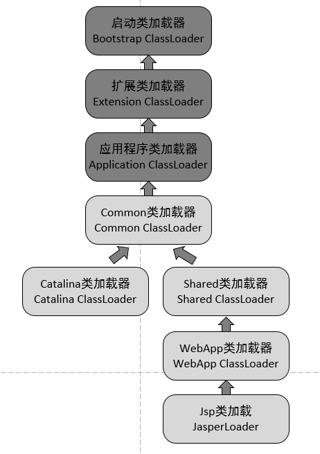

# 一、整体思路

考察时间投入的重点在哪
学校时间充裕，有人用来玩游戏，有人搞体育运动，有人用来参加社团／竞赛，有人呆实验室，有人去互联网公司实习。种瓜得瓜，种豆得豆，时间投在哪，实力收获在哪。搞清楚一个同学的时间轴，面试时有重点。
\* 在校期间，你的时间是100%，分配到最主要的三件事情是什么，占多大比例？
\* 在校期间，对你技术水平提高最大的人和事是什么？
\* 大学四年／研究生三年，每年你最满意的事是什么？
\* 毕业论文进展怎么样？导师交代的事情你完成的怎么样？你觉得导师对你的进度满意吗？他怎么给你反馈的？（考察对任务的理解、执行、上级对他的评价，相当于考察绩效）
考察是否在同龄人里相对出色
不同群体总有相对优秀的人，我们要招聘一个群体中的至少前50%的人。
\* 导师什么方向？一届带多少学生？你觉得在这一届中，你在什么位置？
\* 在你们年级／你的技术小圈子／ACM队／社团／项目等团体里，论综合技术实力，你觉得自己能排第几？评价一位在某方面技术比你强的同学，你们互相的差距在哪？
\* 利用社交关系找到TOP的同学：你觉得谁的综合技术实力最强，叫什么名字（往往也在美团的面试候选人中，或者可以邀请他来）
考察关键事件的思考决策过程
一个人的重大决策，决定他的命运，也往往体现了他的思维方式。考察历史上的决策过程，帮助我们推测入职后这个人的发展轨迹。
\* 在校期间做过最满意的／最遗憾的／对你影响最大的事情是？（找到关键事件）
\* 某个关键事件经历（高考经历／大一／大三／考研／实验／实习），辛苦吗？为什么选择A而不是B？（考察时间轴，关键决策的思考过程，判断力）
考察总结、归纳、复盘的能力
没有人一开始就能把事情做好，一个被反复证明的事实是，复盘总结往往带来更快的进化速度。
\* 某个关键事件经历后，你觉得自己有什么成长？之后你在下一次做了什么改变？（看看能否归纳出关键点，是否落实于行动）
\* 如果现在的你回到当时再走一遍，会有什么不同？为什么？（看看是否有反思的习惯，是否通过回顾能找到关键的改进点）
考察内驱因素、方向感、规划习惯
有长期潜力的同学，知道自己心里要什么，往往在校期间已经具备一定的着眼长期的视野和方向感。
\* 有没有什么短期目标？比如到年底前（可以是一年内某个截止日），打算做到什么样子？怎么落于平时的执行？
\* 三年后，自己成为什么样子会比较满意？有什么学习的榜样吗？为什么要做到这样？（考察驱动力、方向感选择的决策过程）
\* 举个例子：如果本科成绩年级TOP5%，说一下怎么保持好成绩的，你的秘诀是什么？为什么要这么做？
考察学习和获取新知识的能力
有长期潜力的同学，学习新知识有自己的方法，面对未知有底气迎难而上，往往在校期间已经能自如运用了。
\* 你学习xxx技术（简历中比较独特的某个技术点）的时候，怎么学的？有没有更好的学习方法？
\* 你对xxx了解吗，给你半天时间尽量深入的理解它，你会用哪集中方法学习？（找一个他不了解的技术点、概念、人物、公司等，例如：某种函数化编程语言、PAXOS、Tesla、NASDAQ ，看看面对未知知识的学习方法）
考察技术兴趣、动手能力
我们都喜欢动手能力强的同学，如果有点儿hacker范儿就更好了。这类同学在上学的时候，肯定没闲着，比如鼓捣自己的app、小工具、小项目。
\* 课余有没有自己发起的动手小项目，最满意哪个，为什么想做这个，相关的技术学习资料是怎么找到的？
\* 最喜欢的专业课是？为什么？所学内容里现在还在运用的是什么？（考察技术兴趣、掌握程度、理解深入度）
\* 对linux了解吗？有没有熟悉的开源软件？有没有阅读过代码？（考察技术兴趣，当然也可能钻研的是unix、windows，类似）
考察结构化思考、条理性、观点陈述
这在PM面试中可能更常见，但作为通用技能，是个加分项。
\* 最近技术领域有一件xxxxxx事情，你了解吗？你怎么看？（结合候选人背景，问一些新东西，考察新问题接受速度、视野、主见、逻辑条理和表达）
\* 如果有实习，画一下实习所在部门上至VP下至一线的组织结构图？询问组织及上级组织的目标？上下游的配合关系？（考察全局观、目标感）
\* 对比分析一下A和B的相同和不同点以及未来趋势（天猫 vs 京东、美团 vs 点评、安卓 vs iOS …… 没有标准答案，主要看逻辑是否通顺，条理是否清楚）

面试技巧


# **二、操作系统**

**1.什么是进程和线程，有何区别？**
 进程是具有一定独立功能的程序关于某个数据集合上的一次运行活动，进程是系统进行资源分配和调度的一个独立单位。线程是进城的一个实体，是CPU调度和分派的基本单位，他是比进程更小的能独立运行的基本单位。线程自己基本上不拥有系统资源，只拥有一点在运行中必不可少的资源（程序计数器，一组寄存器和栈），但是它可与同属一个进程的其他的线程共享进程所拥有的全部资源。一个线程可以创建和撤销另一个线程；同一个进程中的多个线程之间可以并发执行。
 进程与应用程序的区别在于应用程序作为一个静态文件存储在计算机系统的硬盘灯存储空间中，而进程则是处于动态条件下由操作系统维护的系统资源管理实体。

**2.什么是临界区，如何解决冲突？**
 每个进程中访问临界资源的那段程序称为临界区，每次只准许一个进程进入临界区，进入后不允许其他进程进入。
 1）如果有若干进程要求进入空闲的临界区，一次仅允许一个进程进入。
 2）任何时候，处于临界区内的进程不可多于一个。如已有进程进入自己的临界区，则其他所有试图进入临界区的进程必须等待。
 3）进入临界区的进程要在有限时间内退出，以便其他进程能及时进入自己的临界区。
 4）如果进程不能进入自己的临界区，则应让出CPU，避免进程出现忙等现象。

**3.进程通信有哪些方式？**
 管道通信，消息通信，内存共享

**4.进程同步的方法**
 内存屏障，互斥锁，信号量和锁，管程，消息，管道

**5.linux系统常用的命令**

**6.什么死锁，死锁的条件，怎样避免死锁？**
 死锁的概念：在两个或多个并发进程中，如果每个进程持有某种资源而又都等待别的进程释放它们现在保持着的资源，否则就不能向前推进。此时，每个进程都占用了一定的资源但是又不能向前推进，称这一组进程产生了死锁。通俗的讲，就是两个或多个进程无止境的等候着永远不会成立的条件的一种系统状态。
 死锁产生的主要原因是：1）系统资源不足；2）进行运行推进的顺序不合理；3）资源分配不当
 产生死锁的必要条件：1）互斥，一个资源每次只能被一个进程使用；2）占有且等待，一个进程因请求资源而阻塞时，对已获得的资源保持不放；3）不可抢占，进程已获得的资源，在未使用完之前，不能强行剥夺；4）环形等待，若干进程之间形成一种首尾相接的循环等待资源关系。这四个条件是死锁的必要条件，只要系统发生死锁，这些条件必然成立，而只要上述条件之一不满足，就不会发生死锁。
 死锁的解除与预防：理解了死锁的原因，尤其是产生死锁的四个必要条件，就可以最大可能地避免、预防和解除死锁。所以，在系统设计、进程调度等方面注意如何不让这四个必要条件成立，如何确定资源的合理分配算法，避免进程永久占据系统资源。此外，也要防止进程在处于等待状态的情况下占用资源。因此对资源的分配要给予合理的规划。

**7.Windows下的内存是如何管理的？**
Windows提供了3种方法来进行内存管理：虚拟内存，最适合用来管理大型对象或者结构数组；内存映射文件，最适合用来管理大型数据流（通常来自文件）以及在单个计算机上运行多个进程之间共享数据；内存堆栈，最适合用来管理大量的小对象。
Windows操纵内存可以分两个层面：物理内存和虚拟内存。
其中物理内存由系统管理，不允许应用程序直接访问，应用程序可见的只有一个2G地址空间，而内存分配是通过堆进行的。对于每个进程都有自己的默认堆，当一个堆创建后，就通过虚拟内存操作保留了相应大小的地址块（不占有实际的内存，系统消耗很小）。当在堆上分配一块内存时，系统在堆的地址表里找到一个空闲块（如果找不到，且堆创建属性是可扩充的，则扩充堆大小），为这个空闲块所包含的所有内存页提交物理对象（在物理内存上或硬盘的交换文件上），这时就可以访问这部分地址。提交时，系统将对所有进程的内存统一调配，如果物理内存不够，系统试图把一部分进程暂时不访问的页放入交换文件，以腾出部分物理内存。释放内存时，只在堆中将所在的页解除提交（相应的物理对象被解除），继续保留地址空间。
如果要知道某个地址是否被占用/可不可以访问，只要查询此地址的虚拟内存状态即可。如果是提交，则可以访问。如果仅仅保留，或没保留，则产生一个软件异常。此外，有些内存页可以设置各种属性。如果是只读，向内存写也会产生软件异常。

**8.说说分段和分页**
页是信息的物理单位，分页是为实现离散分配方式，以消减内存的外零头，提高内存的利用率；或者说，分页仅仅是由于系统管理的需要，而不是用户的需要。
段是信息的逻辑单位，它含有一组其意义相对完整的信息。分段的目的是为了能更好的满足用户的需要。
页的大小固定且由系统确定，把逻辑地址划分为页号和页内地址两部分，是由机器硬件实现的，因而一个系统只能有一种大小的页面。段的长度却不固定，决定于用户所编写的程序，通常由编辑程序在对源程序进行编辑时，根据信息的性质来划分。
分页的作业地址空间是一维的，即单一的线性空间，程序员只须利用一个记忆符，即可表示一地址。分段的作业地址空间是二维的，程序员在标识一个地址时，既需给出段名，又需给出段内地址。

**9.什么是中断？中断时CPU做什么工作？**
中断是指在计算机执行期间，系统内发生任何非寻常的或非预期的急需处理事件，使得CPU暂时中断当前正在执行的程序而转去执行相应的事件处理程序。待处理完毕后又返回原来被中断处继续执行或调度新的进程执行的过程。

**10.什么是缓冲区溢出？有什么危害？其原因是什么？**
缓冲区溢出是指当计算机向缓冲区填充数据时超出了缓冲区本身的容量，溢出的数据覆盖在合法数据上。
危害有以下两点：
程序崩溃，导致拒绝额服务
跳转并且执行一段恶意代码
造成缓冲区溢出的主要原因是程序中没有仔细检查用户输入。

**11.操作系统中进程调度策略有哪几种？**
（1）先来先服务（FCFS，First-Come-First-Served）: 此算法的原则是按照作业到达后备作业队列（或进程进入就绪队列）的先后次序来选择作业（或进程）。
（2）短作业优先（SJF,Shortest Process Next）：这种调度算法主要用于作业调度，它从作业后备队列中挑选所需运行时间（估计值）最短的作业进入主存运行。
（3）时间片轮转调度算法（RR，Round-Robin）：当某个进程执行的时间片用完时，调度程序便停止该进程的执行，并将它送就绪队列的末尾，等待分配下一时间片再执行。然后把处理机分配给就绪队列中新的队首进程，同时也让它执行一个时间片。这样就可以保证就绪队列中的所有进程，在一给定的时间内，均能获得一时间片处理机执行时间。
（4）高响应比优先（HRRN，Highest Response Ratio Next）: 按照高响应比（（已等待时间＋要求运行时间）/ 要求运行时间）优先的原则，在每次选择作业投入运行时，先计算此时后备作业队列中每个作业的响应比RP然后选择其值最大的作业投入运行。
（5）优先权(Priority)调度算法: 按照进程的优先权大小来调度，使高优先权进程得到优先处理的调度策略称为优先权调度算法。注意：优先数越多，优先权越小。
（6）多级队列调度算法：多队列调度是根据作业的性质和类型的不同，将就绪队列再分为若干个子队列，所有的作业（或进程）按其性质排入相应的队列中，而不同的就绪队列采用不同的调度算法。

**12.进程同步与互斥的区别**
互斥：是指某一资源同时只允许一个访问者对其进行访问，具有唯一性和排它性。但互斥无法限制访问者对资源的访问顺序，即访问是无序的。
同步：是指在互斥的基础上（大多数情况），通过其它机制实现访问者对资源的有序访问。在大多数情况下，同步已经实现了互斥，特别是所有写入资源的情况必定是互斥的。少数情况是指可以允许多个访问者同时访问资源。
简单地说：同步体现的是一种协作性，互斥体现的是一种排他性。
附注补充：　
　　进程同步的主要任务：是对多个相关进程在执行次序上进行协调，以使并发执行的诸进程之间能有效地共享资源和相互合作，从而使程序的执行具有可再现性。
　　同步机制遵循的原则：
　　（1）空闲让进；
　　（2）忙则等待（保证对临界区的互斥访问）；
　　（3）有限等待（有限代表有限的时间，避免死等）；
　　（4）让权等待（当进程不能进入自己的临界区时，应该释放处理机，以免陷入忙等状态）。
　　线程同步指多个线程同时访问某资源时，采用一系列的机制以保证同时最多只能一个线程访问该资源。线程同步是多线程中必须考虑和解决的问题，因为很可能发生多个线程同时访问（主要是写操作）同一资源，如果不进行线程同步，很可能会引起数据混乱，造成线程死锁等问题。
线程同步的方式：
临界区：通过对多线程的串行化来访问公共资源或者一段代码，速度快，适合控制数据访问
互斥量：采用互斥对象机制，只有拥有互斥对象的线程才有访问公共资源的权限，因为互斥对象只有一个，所以可以保证公共资源不会同时被多个线程访问
信号量：它允许多个线程同一时刻访问同一资源，但是需要限制同一时刻访问此资源的最大线程数目。信号量对象对线程的同步方式与前面几种方法不同，信号允许多个线程同时使用共享资源，这与操作系统中PV操作相似。
事件（信号）：通过通知操作的方式来保持多线程的同步，还可以方便的实现多线程的优先级比较的操作

# 三、计算机网络

**1.HTTP是网络七层协议中哪一层的协议?**
参考答案:应用层。
解题思路:基础知识
考察点:OSI七层协议的基础知识 分类:HTTP,基础知识,网络,{校招,社招都可以用} 难度分级:P4

**2.UDP,TCP是网络七层协议中哪一层的协议,区别是什么,分别适用于什么场景?**
参考答案:
传输层。 在TCP/IP模型中,传输层的功能是使源端主机和目标端主机上的对等实体可以进行会话。
在传输层定义了两种服务质量不同的协议。即:传输控制协议TCP(transmission control protocol)和用户数据报协议UDP(user datagram protocol)。
TCP协议是一个面向连接的、可靠的协议。它将一台主机发出的字节流无差错地发往互联网上的其他主机。 需要三次握手建立连接,才能进行数据传输。在发送端,它负责把上层传送下来的字节流分成报文段并传递给下层。 在接收端,它负责把收到的报文进行重组后递交给上层。TCP协议还要处理端到端的流量控制,以避免缓慢接收的接收方没有足够的缓冲区接收发 送方发送的大量数据。 UDP协议是一个不可靠的、无连接协议,不与对方建立连接,而是直接就把数据包发送过去。主要适用于不需要对报文进行排序和流量控制的 场合。 UDP适用于一次只传送少量数据、对可靠性要求不高的应用环境。比如,我们经常使用“ping”命令来测试两台主机之间TCP/IP通信是否正常, 其 实“ping”命令的原理就是向对方主机发送UDP数据包,然后对方主机确认收到数据包,如果数据包是否到达的消息及时反馈回来,那么网络就是 通的。
解题思路:基础知识,从面向连接、可靠性、应用场合上进行分析对比 考察点:七层协议中传输层的基础知识,着重从TCP vs UDP的区别上考察 分类:七层协议,基础知识,网络,{校招,社招都可以用} 难度分级:P4,P5

**3.TCP对应的协议和UDP对应的协议**
TCP对应的协议：
（1） FTP：定义了文件传输协议，使用21端口。常说某某计算机开了FTP服务便是启动了文件传输服务。下载文件，上传主页，都要用到FTP服务。
（2） Telnet：它是一种用于远程登陆的端口，用户可以以自己的身份远程连接到计算机上，通过这种端口可以提供一种基于DOS模式下的通信服务。如以前的BBS是-纯字符界面的，支持BBS的服务器将23端口打开，对外提供服务。
（3） SMTP：定义了简单邮件传送协议，现在很多邮件服务器都用的是这个协议，用于发送邮件。如常见的免费邮件服务中用的就是这个邮件服务端口，所以在电子邮件设置-中常看到有这么SMTP端口设置这个栏，服务器开放的是25号端口。
（4） POP3：它是和SMTP对应，POP3用于接收邮件。通常情况下，POP3协议所用的是110端口。也是说，只要你有相应的使用POP3协议的程序（例如Fo-xmail或Outlook），就可以不以Web方式登陆进邮箱界面，直接用邮件程序就可以收到邮件（如是163邮箱就没有必要先进入网易网站，再进入自己的邮-箱来收信）。
（5）HTTP协议：是从Web服务器传输超文本到本地浏览器的传送协议。
UDP对应的协议：
（1） DNS：用于域名解析服务，将域名地址转换为IP地址。DNS用的是53号端口。
（2） SNMP：简单网络管理协议，使用161号端口，是用来管理网络设备的。由于网络设备很多，无连接的服务就体现出其优势。
（3） TFTP(Trival File Transfer Protocal)，简单文件传输协议，该协议在熟知端口69上使用UDP服务。

**4.TCP三次握手？能不能改成两次？**
建立连接的过程是利用客户服务器模式，假设主机 A 为客户端，主机 B 为服务器端。
（ 1 ） TCP 的三次握手过程：主机 A 向 B 发送连接请求；主机 B 对收到的主机 A 的报文段进行确认；主机 A 再次对主机 B 的确认进行确认。
（ 2 ）采用三次握手是为了防止失效的连接请求报文段突然又传送到主机 B ，因而产生错误。失效的连接请求报文段是指：主机 A 发出的连接请求没有收到主机 B 的确认，于是经过一段时间后，主机 A 又重新向主机 B 发送连接请求，且建立成功，顺序完成数据传输。考虑这样一种特殊情况，主机 A 第一次发送的连接请求并没有丢失，而是因为网络节点导致延迟达到主机 B ，主机 B 以为是主机 A 又发起的新连接，于是主机 B 同意连接，并向主机 A 发回确认，但是此时主机 A 根本不会理会，主机 B 就一直在等待主机 A 发送数据，导致主机 B 的资源浪费。
（ 3 ）采用两次握手不行，原因就是上面说的实效的连接请求的特殊情况。

**5.TCP的可靠性如何保证？**
在TCP的连接中，数据流必须以正确的顺序送达对方。TCP的可靠性是通过顺序编号和确认（ACK）来实现的。TCP在开始传送一个段时，为准备重传而首先将该段插入到发送队列之中，同时启动时钟。其后，如果收到了接受端对该段的ACK信息，就将该段从队列中删去。如果在时钟规定的时间内，ACK未返回，那么就从发送队列中再次送出这个段。TCP在协议中就对数据可靠传输做了保障，握手与断开都需要通讯双方确认，数据传输也需要双方确认成功，在协议中还规定了：分包、重组、重传等规则；而UDP主要是面向不可靠连接的，不能保证数据正确到达目的地。

**6.ping命令使用的是什么协议**
 ICMP

**7.ARP协议的工作原理**
 首先，每台主机都会在自己的ARP缓冲区中建立一个 ARP列表，以表示IP地址和MAC地址的对应关系。当源主机需要将一个数据包要发送到目的主机时，会首先检查自己 ARP列表中是否存在该 IP地址对应的MAC地址，如果有，就直接将数据包发送到这个MAC地址；如果没有，就向本地网段发起一个ARP请求的广播包，查询此目的主机对应的MAC地址。此ARP请求数据包里包括源主机的IP地址、硬件地址、以及目的主机的IP地址。网络中所有的主机收到这个ARP请求后，会检查数据包中的目的IP是否和自己的IP地址一致。如果不相同就忽略此数据包；如果相同，该主机首先将发送端的MAC地址和IP地址添加到自己的ARP列表中，如果ARP表中已经存在该IP的信息，则将其覆盖，然后给源主机发送一个 ARP响应数据包，告诉对方自己是它需要查找的MAC地址；源主机收到这个ARP响应数据包后，将得到的目的主机的IP地址和MAC地址添加到自己的ARP列表中，并利用此信息开始数据的传输。如果源主机一直没有收到ARP响应数据包，表示ARP查询失败。

**8.在浏览器中输入网址后执行的全部过程**
1).查找域名对应的IP地址。这一步会依次查找浏览器缓存，系统缓存，路由器缓存，ISPNDS缓存，根域名服务器。
2).向IP对应的服务器发送请求。
3).服务器响应请求，发回网页内容。
4).浏览器解析网页内容。
由于网页可能有重定向，或者嵌入了图片，AJAX，其它子网页等等，这4个步骤可能反复进行多次才能将最终页面展示给用户。

**9.cookie 和session 的区别**
cookie数据存放在客户的浏览器上，session数据放在服务器上。
cookie不是很安全，别人可以分析存放在本地的COOKIE并进行COOKIE欺骗考虑到安全应当使用session。
session会在一定时间内保存在服务器上。当访问增多，会比较占用你服务器的性能
考虑到减轻服务器性能方面，应当使用COOKIE。
单个cookie保存的数据不能超过4K，很多浏览器都限制一个站点最多保存20个cookie。
个人建议：
将登陆信息等重要信息存放为SESSION
其他信息如果需要保留，可以放在COOKIE中

**10.TCP的流量控制和拥塞处理**
http://www.cnblogs.com/xxiaoye/p/3680849.html

# 四、算法相关

[面试算法题汇总](https://km.sankuai.com/page/191916046)

**1.二叉树先序遍历**
给一个二叉树的先序遍历和中序遍历，然后给出后序遍历。递进一步：前序、中序、后序三种遍历，任意给出两能求出第三个嘛

**2.汉诺塔问题**
解法：http://www.runoob.com/java/method-tower.html

```
public class MainClass {
    public static void main(String[] args) {
        int nDisks = 3;
        doTowers(nDisks, 'A', 'B', 'C');
    }
    public static void doTowers(int topN, char from, char inter, char to) {
        if (topN == 1){
            System.out.println("Disk 1 from " + from + " to " + to);
        }else {
            doTowers(topN - 1, from, to, inter);
            System.out.println("Disk " + topN + " from " + from + " to " + to);
            doTowers(topN - 1, inter, from, to);
        }
    }
}
```

**3.求二叉树中第k层节点的个数**

**4.求二叉树中任意两个节点的第一个公共父节点**

https://blog.csdn.net/xyzbaihaiping/article/details/52122885

**5.随意给定一个字符串，将其转换成数字**
 考察思维完整性，代码需要判断有没有 字母、正符号、小数点，数字过大当前类型存放不了。
 当面试者问你是否有字母、负号等的时候，只需声明题目就这一句话，让起自由发挥。考察应聘者是否只想简单化问题，怕麻烦。

**6.给一组数，只有两个数只出现了一次，其他所有数都是成对出现的。怎么找出这两个数。编写函数实现。**
对于一组数中只有一个数只出现一次，其他所有数都是成对出现的，我们采用了对全部数组元素进行异或，但是对于找出两个出现一次的数应该怎么解决呢？先对所有的元素进行异或，则结果为两个出现一次的数的异或结果，然后将结果转换为二进制，找出二进制数中的第一个1，然后根据这个1的判断条件进行分组，分为两组，分别对两个组的元素进行全部异或，则就找出两个不同的数。

题目分析：

上次介绍了，对于一组数中只有一个数只出现一次，其他所有数都是成对出现的，我们采用了对全部数组元素进行异或，但是对于找出两个出现一次的数应该怎么解决呢？先对所有的元素进行异或，则结果为两个出现一次的数的异或结果，然后将结果转换为二进制，找出二进制数中的第一个1，然后根据这个1的判断条件进行分组，分为两组，分别对两个组的元素进行全部异或，则就找出两个不同的数。

**7.使用两个栈实现一个队列，能用两个队列实现一个栈吗？**

https://www.cnblogs.com/tracyhan/p/5490775.html

**8. 求数字集合所有子集 （递归和循环时间复杂度分析）**

**9.判断出栈序列，输入两个整数序列。其中一个序列表示栈的push顺序，判断另一个序列有没有可能是对应的pop顺序。**

**10.给定一个数字数组d和数字a，其中数组d中数字顺序先下降后递增，找到数字a在数组d中的下标（如果没有则返回-1）。
主要考查是否掌握基本的二分查找方法，逻辑思维能力，以及运用现有知识解决新问题的能力。**

**11.寻找数组中相加为0的组合，给定一个int数组[1,-1,0,2,-1,4]，要求找出数组中，所有的三元组，符合相加为0的特性。比如[-1,-1,2]和[1,-1,0]**

12 . 二叉树搜索和哈希查找的区别？

13.给你两颗二叉搜索树，如何使用线性的时间复杂度，将它们合并成一颗二叉搜索树。

五、数据库

**1.事务四大特性、隔离级别及其影响**
 四大特性：
 1）原子性（Atomicity）
 原子性是指事务包含的所有操作要么全部成功，要么全部失败回滚，这和前面两篇博客介绍事务的功能是一样的概念，因此事务的操作如果成功就必须要完全应用到数据库，如果操作失败则不能对数据库有任何影响。
 2）一致性（Consistency）
　一致性是指事务必须使数据库从一个一致性状态变换到另一个一致性状态，也就是说一个事务执行之前和执行之后都必须处于一致性状态。
 拿转账来说，假设用户A和用户B两者的钱加起来一共是5000，那么不管A和B之间如何转账，转几次账，事务结束后两个用户的钱相加起来应该还得是5000，这就是事务的一致性。
 3）隔离性（Isolation）
　隔离性是当多个用户并发访问数据库时，比如操作同一张表时，数据库为每一个用户开启的事务，不能被其他事务的操作所干扰，多个并发事务之间要相互隔离。
　即要达到这么一种效果：对于任意两个并发的事务T1和T2，在事务T1看来，T2要么在T1开始之前就已经结束，要么在T1结束之后才开始，这样每个事务都感觉不到有其他事务在并发地执行。
　关于事务的隔离性数据库提供了多种隔离级别，稍后会介绍到。
 4）持久性（Durability）
　持久性是指一个事务一旦被提交了，那么对数据库中的数据的改变就是永久性的，即便是在数据库系统遇到故障的情况下也不会丢失提交事务的操作。
 事务隔离级别
 1）Serializable (串行化)：可避免脏读、不可重复读、幻读的发生。
 2）Repeatable read (可重复读)：可避免脏读、不可重复读的发生。
 3）Read committed (读已提交)：可避免脏读的发生。
 4）Read uncommitted (读未提交)：最低级别，任何情况都无法保证。
 影响：
 1）脏读
 脏读是指在一个事务处理过程里读取了另一个未提交的事务中的数据。
　当一个事务正在多次修改某个数据，而在这个事务中这多次的修改都还未提交，这时一个并发的事务来访问该数据，就会造成两个事务得到的数据不一致。例如：用户A向用户B转账100元，对应SQL命令如下
 update account set money=money+100 where name=’B’; (此时A通知B)
 update account set money=money - 100 where name=’A’;
　当只执行第一条SQL时，A通知B查看账户，B发现确实钱已到账（此时即发生了脏读），而之后无论第二条SQL是否执行，只要该事务不提交，则所有操作都将回滚，那么当B以后再次查看账户时就会发现钱其实并没有转。
 2）不可重复读
　不可重复读是指在对于数据库中的某个数据，一个事务范围内多次查询却返回了不同的数据值，这是由于在查询间隔，被另一个事务修改并提交了。
　例如事务T1在读取某一数据，而事务T2立马修改了这个数据并且提交事务给数据库，事务T1再次读取该数据就得到了不同的结果，发送了不可重复读。
　不可重复读和脏读的区别是，脏读是某一事务读取了另一个事务未提交的脏数据，而不可重复读则是读取了前一事务提交的数据。
　在某些情况下，不可重复读并不是问题，比如我们多次查询某个数据当然以最后查询得到的结果为主。但在另一些情况下就有可能发生问题，例如对于同一个数据A和B依次查询就可能不同，A和B就可能打起来了……
 3）虚读(幻读)
　幻读是事务非独立执行时发生的一种现象。例如事务T1对一个表中所有的行的某个数据项做了从“1”修改为“2”的操作，这时事务T2又对这个表中插入了一行数据项，而这个数据项的数值还是为“1”并且提交给数据库。而操作事务T1的用户如果再查看刚刚修改的数据，会发现还有一行没有修改，其实这行是从事务T2中添加的，就好像产生幻觉一样，这就是发生了幻读。
　幻读和不可重复读都是读取了另一条已经提交的事务（这点就脏读不同），所不同的是不可重复读查询的都是同一个数据项，而幻读针对的是一批数据整体（比如数据的个数）。

**2.为什么MySQL的索引要使用B+树而不是其它树形结构?为什么不用B树**
参考答案:
为什么不用B树?:因为B树的所有节点都是包含键和值的,这就导致了每个几点可以存储的内容就变少了,出度就少了,树的高度会增高,查询的 时候磁盘I/O会增多,影响性能。由于B+Tree内节点去掉了data域,因此可以拥有更大的出度,拥有更好的性能。
解题思路:Mysql 索引数据结构
考察点: Mysql索引数据结构,B+树 B-树 分类:Mysql、数据结构{校招,社招} 难度分级:P4,P5

**3.为什么InnoDB中表的主键最好要自增?**
InnoDB使用聚集索引,数据记录本身被存于主索引(一颗B+Tree)的叶子节点上。这就要求同一个叶子节点内(大小为一个内存页或磁盘页)的 各条数据记录按主键顺序存放,因此每当有一条新的记录插入时,MySQL会根据其主键将其插入适当的节点和位置,如果页面达到装载因子(Inno DB默认为15/16),则开辟一个新的页(节点)。如果表使用自增主键,那么每次插入新的记录,记录就会顺序添加到当前索引节点的后续位置, 当一页写满,就会自动开辟一个新的页。这样就会形成一个紧凑的索引结构,近似顺序填满。由于每次插入时也不需要移动已有数据,因此效率很 高,也不会增加很多开销在维护索引上。
如果使用非自增主键(如果身份证号或学号等),由于每次插入主键的值近似于随机,因此每次新纪录都要被插到现有索引页得中间某个位置,此 时MySQL不得不为了将新记录插到合适位置而移动数据,甚至目标页面可能已经被回写到磁盘上而从缓存中清掉,此时又要从磁盘上读回来,这增 加了很多开销,同时频繁的移动、分页操作造成了大量的碎片,得到了不够紧凑的索引结构,后续不得不通过OPTIMIZE TABLE来重建表并优化填充页面。
因此,只要可以,请尽量在InnoDB上采用自增字段做主键。 解题思路:InnoDB 主键选择
考察点:InnoDB 索引数据结构,Mysql应用技能 分类:Mysql{校招,社招}

**4.MySQL联合索引使用是有什么规则?如果对A,B,C做索引,那么SQL语句写成where C=X and B=X and A=X,是否还能用到该索引?如果SQL语句写成where A=X and B>X and C=X是否还能用到该索引?**
参考答案:
联合索引有最左前缀匹配原则。
where C=X and B=X and A=X能用到该索引,因为=和in可以乱序,比如a = 1 and b = 2 and c = 3 建立(a,b,c)索引可以任意顺序,mysql的查询优化器会帮你优化成索引可以识别的形式。
where A=X and B>X and C=X可以用到该索引,但C是用不到索引的,因为mysql会一直向右匹配直到遇到范围查询(>、<、between、like)就停止匹配。
解题思路:联合索引最左前缀匹配原则
考察点: 是否对联合索引的匹配原则,以及所以的数据结构有过了解
分类:Mysql索引基础知识{校招,社招}
难度分级:P4,P5

**5.Btree+和Hash索引有什么区别？**
参考答案：
Hash 索引结构的特殊性，其检索效率非常高，索引的检索可以一次定位，不像B-Tree 索引需要从根节点到枝节点，最后才能访问到页节点这样多次的IO访问，所以 Hash 索引的查询效率要远高于 B-Tree 索引。
可能很多人又有疑问了，既然 Hash 索引的效率要比 B-Tree 高很多，为什么大家不都用 Hash 索引而还要使用 B-Tree 索引呢？任何事物都是有两面性的，Hash 索引也一样，虽然 Hash 索引效率高，但是 Hash 索引本身由于其特殊性也带来了很多限制和弊端，主要有以下这些。
（1）Hash 索引仅仅能满足"=","IN"和"<=>"查询，不能使用范围查询。
由于 Hash 索引比较的是进行 Hash 运算之后的 Hash 值，所以它只能用于等值的过滤，不能用于基于范围的过滤，因为经过相应的 Hash 算法处理之后的 Hash 值的大小关系，并不能保证和Hash运算前完全一样。
（2）Hash 索引无法被用来避免数据的排序操_=9C。
由于 Hash 索引中存放的是经过 Hash 计算之后的 Hash 值，而且Hash值的大小关系并不一定和 Hash 运算前的键值完全一样，所以数据库无法利用索引的数据来避免任何排序运算；
（3）Hash 索引不能利用部分索引键查询。
对于组合索引，Hash 索引在计算 Hash 值的时候是组合索引键合并后再一起计算 Hash 值，而不是单独计算 Hash 值，所以通过组合索引的前面一个或几个索引键进行查询的时候，Hash 索引也无法被利用。
（4）Hash 索引在任何时候都不能避免表扫描。
前面已经知道，Hash 索引是将索引键通过 Hash 运算之后，将 Hash运算结果的 Hash 值和所对应的行指针信息存放于一个 Hash 表中，由于不同索引键存在相同 Hash 值，所以即使取满足某个 Hash 键值的数据的记录条数，也无法从 Hash 索引中直接完成查询，还是要通过访问表中的实际数据进行相应的比较，并得到相应的结果。
（5）Hash 索引遇到大量Hash值相等的情况后性能并不一定就会比B-Tree索引高。
对于选择性比较低的索引键，如果创建 Hash 索引，那么将会存在大量记录指针信息存于同一个 Hash 值相关联。这样要定位某一条记录时就会非常麻烦，会浪费多次表数据的访问，而造成整体性能低下。
hash相当于把key通过hash函数计算，得到key的hash值,再用这个hash值做指针，查找hash表中是否存在key，如果存在就返回 key所对应的value，选定一个好的hash函数很重要，好的hash函数可以使计算出的hash值分布均匀，降低冲突，只有冲突减小了，才会降低 hash表的查找时间。
b-tree完全基于key的比较，和二叉树相同的道理，相当于建个排序后的数据集，使用二分法查找算法，实际上也非常快，而且受数据量增长影响非常小。


# 六、系统设计，海量数据处理

**1.给40亿个不重复的unsigned int的整数，没排过序，然后再给一个数，如何快速判断这个数是否在那40亿个数中？**
 bitmap，用位图/Bitmap的方法，申请512M的内存，一个bit为代表一个unsigned int值。读入40亿个数，设置相应的bit位，读入要查询的书，查看相应bit位是否为1，为1表示存在，为0表示不存在。

# 七、Java基础

**1.jdk的类加载机制和类似tomcat类web容器的类加载机制的不同**
参考答案：http://blog.csdn.net/codolio/article/details/5027423
解题思路：基础知识
考察点：java类加载机制、web容器类加载机制
难度分级：P2-3

**2.浅克隆和深克隆？深克隆的方法？**
参考答案：
浅拷贝是按位拷贝对象，它会创建一个新对象，这个对象有着原始对象属性值的一份精确拷贝。如果属性是基本类型，拷贝的就是基本类型的值；如果属性是内存地址（引用类型），拷贝的就是内存地址 ，因此如果其中一个对象改变了这个地址，就会影响到另一个对象。 
深拷贝会拷贝所有的属性,并拷贝属性指向的动态分配的内存。当对象和它所引用的对象一起拷贝时即发生深拷贝。深拷贝相比于浅拷贝速度较慢并且花销较大。
深克隆的方法：Cloneable接口、序列化的方法
http://www.itzhai.com/java-based-notebook-the-object-of-deep-and-shallow-copy-copy-copy-implement-the-cloneable-interface-serializing-deep-deep-copy.html
解题思路：基础知识
考察点：java基础知识
难度分级：P2-3

**3.Java 泛型的实现原理是什么？**
参考答案： 
Java的泛型是伪泛型，Java中的泛型基本上都是在编译器这个层次来实现的，在生成的Java字节码中是不包含泛型中的类型信息的，使用泛型的时候加上的类型参数，会在编译器在编译的时候去掉；
范型 展开原码
 public void test(List<String> ls) {
 }
 public void test(List<Integer> li) {
 }
以上代码会编译报错，报错信息为：Erasure of method test(List<String>) is the same as another method in type; 
解题思路：范型类型擦除概念
考察点：java基础知识
难度分级：P4，P5

**4.泛型的使用场景**
参考答案：
JAVA中泛型的使用：java中集合使用了泛型，Future<T>，WeakReference<T>，Class<T>也都使用了泛型
一些使用场景：
不想写多个重载函数的场景。
约束对象类型的场景，可以定义边界（T extends ...），如JDK集合List，Set。
用户希望返回他自定义类型的返回值场景，如Json返回Java bean。
在用反射的应用中，也经常会用到泛型，如Class<T>。
对网页，对资源的分析，返回场景，一般都有泛型。
解题思路：基础知识
考察点：java基础知识
难度分级：P4， P5

**5.Integer缓存？Integer比较大小注意问题。==和equals的区别考察**
 参考答案：
 Integer是有缓冲池的，java.lang.Integer.valueOf(int)方法默认情况下如果参数在-128到127之间，则返回缓存中的对象，否则返回new Integer(int)。java使用该机制是为了达到最小化数据输入和输出的目的,这是一种优化措施,提高效率
 其他的包装器:
 Boolean： (全部缓存)
 Byte： (全部缓存)
 Character ( <=127 缓存)
 Short (-128~127 缓存)
 Long (-128~127 缓存)
 Float (没有缓存)
 Doulbe (没有缓存)
 可以设置系统属性 java.lang.Integer.IntegerCache.high 修改缓冲区上限，默认为127。参数内容应为大于127的十进制数形式的字符串，否则将被忽略。取值范围为127-Long.MAX_VALUE，但是用时将强转为int。当系统中大量使用Integer时，增大缓存上限可以节省小量内存。 
区别“==”和equals():“==”是比较两个对象是不是引用自同一个对象。 “equals（）”是比较两个对象的内容。
 解题思路：基础知识
 考察点：java基础知识
 难度分级：P4

**6.自动装箱机制，阅读以下代码，指出有问题的地方**
 展开原码
public static void testNotNullPointer() {
 Integer numNull;
 int numInt = 1;
 int numInt2 = 2;
 Integer numInteger = null;
 //if else
 if (numInt == 1) {
 numInt2 = numInteger; // numInteger为null赋值给int类型变量，自动解箱时报空指针异常
 } else {
 numNull = numInt2;
 }
 //三目运算符和if else的区别, numInteger为null参与三目运算时，自动解箱时报空指针异常
 numNull = numInt == 1 ? numInteger : numInt2;
参考答案：
http://developer.51cto.com/art/201203/325314.htm
解题思路：基础知识
考察点：java基础知识
难度分级：P4

**7.java的类加载器体系结构和双亲委托机制，应用场景举例**
参考答案：
http://blog.csdn.net/lovingprince/article/details/4317069
解题思路：java类加载机制
考察点：java类加载机制
难度分级：P4， P5

**8.红黑树有哪些特性，在Java源码中那部分有应用？**
参考答案：
红黑树是一种类平衡树，但不是一种严格的平衡二叉树， 红黑树并不追求“完全平衡”——它只要求部分地达到平衡要求，降低了对旋转的要求，从而提高了性能。对比AVL，红黑树查找的性能比AVL稍差，但插入删除稍好（平衡操作最多旋转3次）。
java源码中的应用：TreeMap和TreeSet是利用红黑树实现的 
关于红黑树可以参考：
http://blog.csdn.net/v_july_v/article/details/6105630
解题思路：基础知识
考察点：java基础知识，数据结构
难度分级：P4 ，P5

**9.简述一下java的异常体系，什么是受检异常，什么是运行时异常；封装一个API的时候什么情况下抛出异常。**
 参考答案:
java的异常体系： 
 在 Java 中，所有的异常都有一个共同的祖先 Throwable（可抛出）。Throwable 指定代码中可用异常传播机制通过 Java 应用程序传输的任何问题的共性。
Throwable 有两个重要的子类：Exception（异常）和 Error（错误），二者都是 Java 异常处理的重要子类，各自都包含大量子类。
Exception（异常）是应用程序中可能的可预测、可恢复问题。一般大多数异常表示中度到轻度的问题。异常一般是在特定环境下产生的，通常出现在代码的特定方法和操作中。在 EchoInput 类中，当试图调用 readLine 方法时，可能出现 IOException 异常。
Error（错误）表示运行应用程序中较严重问题。大多数错误与代码编写者执行的操作无关，而表示代码运行时 JVM（Java 虚拟机）出现的问题。例如，当 JVM 不再有继续执行操作所需的内存资源时，将出现 OutOfMemoryError。
Exception 类有一个重要的子类 RuntimeException。RuntimeException 类及其子类表示“JVM 常用操作”引发的错误。例如，若试图使用空值对象引用、除数为零或数组越界，则分别引发运行时异常（NullPointerException、ArithmeticException）和 ArrayIndexOutOfBoundException。

受检异常：
可检测异常经编译器验证，对于声明抛出异常的任何方法，编译器将强制执行处理或声明规则，例如：sqlExecption 这个异常就是一个检测异常。你连接 JDBC 时，不捕捉这个异常，编译器就通不过，不允许编译。
非检测异常：
非检测异常不遵循处理或声明规则。在产生此类异常时，不一定非要采取任何适当操作，编译器不会检查是否已解决了这样一个异常。例如：一个数组为 3 个长度，=E5__你使用下标为３时，就会产生数组下标越界异常。这个异常 JVM 不会进行检测，要靠程序员来判断。有两个主要类定义非检测异常：RuntimeException 和 Error。
Error 子类属于非检测异常，因为无法预知它们的产生时间。若 Java 应用程序内存不足，则随时可能出现 OutOfMemoryError；起因一般不是应用程序的特殊调用，而是 JVM 自身的问题。另外，Error 一般表示应用程序无法解决的严重问题。
RuntimeException 类也属于非检测异常，因为普通 JVM 操作引发的运行时异常随时可能发生，此类异常一般是由特定操作引发。但这些操作在 Java 应用程序中会频繁出现。因此，它们不受编译器检查与处理或声明规则的限制。
封装一个API的时候什么情况下抛出异常
如果调用方可以从异常中采取措施进行恢复的，就使用checked exception，如果客户什么也做不了，就用unchecked exception。这里的措施指的是，不仅仅是记录异常，还要采取措施来恢复。
解题思路：基础知识
考察点：java基础知识
难度分级：P4

**9、string常量池的考核**
参考答案： http://blog.sina.com.cn/s/blog_5203f6ce0100tiux.html
解题思路：基础知识
考察点：String
难度分级：P4，P5

**10、在项目中用到了哪些java面向对象的特性，跟面向过程有什么不同？**
 参考答案：
这个属于开放性试题，主要考察面试者是否对面向对象有清晰的认识，一般来说会围绕着“继承”、“封装”、“多态”面向对象三大特征来描述；比如做了相同流程下不同特征数据的异构；比如抽象的定时任务模板，缓存模板，监听者模板等等。
解题思路：基础知识
考察点：面向对象
分类：面向对象 {校招，社招}
难度分级：P4，P5

**11、是否发现过jdk的bug或者踩过jdk的一些坑 ？**
 参考答案：
一般很少有面试者能发现jdk的bug，但是踩坑的不是少数，主要看看面试者有没有总结，java的api用的多不多，理解的到不到位。这个没有参考答案，比如java中sublist的陷阱等等
解题思路：基础知识
考察点：面向对象
分类：面向对象 {校招，社招}
难度分级：P4，P5

**JAVA Util**

**12、Hash冲突，有哪几种常见的解决方法，Java中HashMap用的是哪一种？**
 参考答案:
（1）开放定址法；
（2）拉链法；http://www.cnblogs.com/jillzhang/archive/2006/11/03/548671.html
Java中HashMap使用的是拉链法。
解题思路：基础知识
考察点：Hash冲突，HashMap的底层数据结构实现
分类：数据结构，Java集合框架
难度分级：P4

**13、Java HashMap，已知整个生命周期内不会放入超过100个元素，那么占用内存大小最优且设置完初始值后无需自动扩容，该初始值应该设置为多少？**
参考答案：
如果默认使用H ashMap内置的负载因子loadFactor为0.75。鉴于HashMap初始化设置大小为2的n次方，则100/0.75=133. 大于133的最小2的n次方为256个。
解题思路：基础知识
考察点： 考察HashMap的负载因子以及构造函数的理解
分类：Java集合框架{校招，社招}
难度分级：P4

**14、Java HashMap在高并发情况下不当使用，可能会导致什么样极端情况，为什么？**
参考答案：
在并发的多线程使用场景中，在resize扩容的时候，使得HashMap形成环链，造成死循环，CPU飙升至100%。可以举例子说明。
参考链接：http://wiki.sankuai.com/x/oUl9BQ
解题思路：
考察点：HashMap的并发性
分类：{校招，社招}
难度分级：P4，P5

**15、HashMap/ConcurrentHashMap的数据结构实现，扩容机制，HashMap hash的冲突处理。**
参考答案：
答案参考前面。
补充：扩容机制考察扩容时机，扩容容量变化机制，扩容具体实现步骤－源码resize() 函数。
解题思路：
考察点：HashMap/ConcurrentHashMap的底层实现
分类：{校招，社招}
难度分级：P4，P5

**16、LinkedHashMap 数据结构实现**
参考答案：
首先搞清楚HashMap得实现；然后重点考察和HashMap的区别。
LinkedHashMap实现与HashMap的不同之处在于，后者维护着一个运行于所有条目的双重链接列表。此链接列表定义了迭代顺序，该迭代顺序可以是插入顺序或者是访问顺序。最好画个图解释下。Entry对象在HashMap的时候包含key，value，hash值，以及一个next；而在LinkedHashMap中新增了before和after。
解题思路：基础知识
考察点：HashMap和LinkedHashMap 的数据结构的区别
分类：{校招，社招}
难度分级：P4，P5

**17、ArrayList和LinkedList的区别，数据结构实现，扩容机制**
参考答案：
(1) ArrayList是实现了基于动态数组的数据结构，LinkedList基于双向循环链表的数据结构。
(2) 对于随机访问get和set，ArrayList觉得优于LinkedList，因为LinkedList要移动指针。
(3) 对于新增和删除操作add和remove，LinedList比较占优势，因为ArrayList要移动数据。
(4) 查找操作indexOf,lastIndexOf,contains等，两者差不多。
(5) 随机查找指定节点的操作get，ArrayList速度要快于LinkedList.
当操作是在一列数据的后面添加数据而不是在前面或中间,并且需要随机地访问其中的元素时,使用ArrayList会提供比较好的性能；当你的操作是在一列数据的前面或中间添加或删除数据,并且按照顺序访问其中的元素时,就应该使用LinkedList了。
扩容： 针对ArrayList，在新增的时候，容量不够就需要扩容，2倍。
解题思路：基础知识
考察点：ArrayList和LinkedList的区别，ArrayList的扩容
分类：{校招，社招}
难度分级：P4

**18、哈希函数的构造方法常见的有哪几种？**
参考答案:
（1）直接寻址法：取关键字或关键字的某个线性函数值为散列地址。即H(key)=key或H(key) = a·key + b为散列函数。若其中H(key）中已经有值了，就往下一个找，直到H(key）中没有值了，就放进去。
（2） 数字分析法：就是找出数字的规律，尽可能利用这些数据来构造冲突几率较低的散列地址。
（3）平方取中法：取关键字平方后的中间几位作为散列地址。
（4） 折叠法：将关键字分割成位数相同的几部分，最后一部分位数可以不同，然后取这几部分的叠加和（去除进位）作为散列地址。
（5）随机数法：选择一随机函数，取关键字的随机值作为散列地址，通常用于关键字长度不同的场合。
（6）除留余数法：取关键字被某个不大于散列表表长m的数p除后所得的余数为散列地址。即 H(key) = key MOD p,p<=m。不仅可以对关键字直接取模，也可在折叠、平方取中等运算之后取模。对p的选择很重要，一般取素数或m，若p选的不好，容易产生同义词。 

因为一般都是问哈希冲突解决方法，很多人会说开放地址法，链表法等等。至于 hash 方法，真的有点懵逼，凭下意识说了一个取模(取余数)，答到这肯定不够，于是我把 Java 几个基本类型的包装类 Integer, Boolean, String 的 `hashcode` 方法的实现说了一遍，一方面作为例子填充回答，另一方面，表示我研究过 JDK 源码


解题思路：基础知识
考察点：哈希函数的构造方法
分类：数据结构
难度分级：P4

**19、HashMap的实现原理（内部数据结构，null key，rehash）；为什么说hashMap不是线程安全的。**
参考答案：
（1）内部数据结构实现：数组＋链表 （最好画个图能解释清楚）
（2）key值不能重复，只能put一个key为null的键值对。可以更深层次考察对put（null,value）以及get（null）的 理解。
（3）HashMap在put时，经过了两次hash，一个是JDK自带的对对象key的hash，然后再对结果使用HashMap内部函数hash（int h）;hash(int h)方法根据key的hashCode重新计算一次散列。可以更深入考察对hash(int h)以及indexFor(int h, int length）两个函数的理解。
（4）在put时如果空间不够就需要扩容resize()，考察扩容过程－－重新计算复制。
（5）在并发的多线程使用场景中，使用HashMap形成环链，造成死循环，CPU飙升至100%。例子见链接。
http://wiki.sankuai.com/pages/viewpage.action?pageId=89609604
解题思路：基础知识
考察点： 考察HashMap的底层实现远离
分类：Java集合框架{校招，社招}
难度分级：P4

**20、List有哪些实现，实现原理，如何选择实现；是否比较过性能差异？contains方法是怎么比较对象的？**
参考答案：
（1）List的直接实现是两个抽象类，AbstactList和AbstractSequentialList.其中，AbstractList为随即访问（如数组）实现方案提供尽可能的封装，AbstractSequentialList为连续访问（如链表）实现方案提供了尽可能的封装。ArrayList,直接父类是AbstractList,数据结构是大小可变的数组，它不是同步的。LinkedList,直接父类是AbstractSquentialList，数据结构是双向链表，它不是同步的，它同时实现了Deque(双向队列)和Queue(队列)接口。同时它还提供了push和pop这两个堆栈操作的接口。Vector,直接父类是AbstractList,特性和ArrayList一样，只是它是线程同步的。Stack,直接父类是Vector，_=9E现堆栈这种数据结构。
（2）通过对象的equals方法。
解题思路：基础知识
考察点：考察对List的理解和运用以及equals的理解
分类：Java集合框架{校招，社招}
难度分级：P4

**21、如何拷贝数组，怎样效率最高？为什么？**
参考答案：
（1）使用循环结构 这种方法最灵活。唯一不足的地方可能就是代码较多
（2）使用Object类的clone（）方法， 这种方法最简单，得到原数组的一个副本。灵活形也最差。效率最差，尤其是在数组元素很大或者复制对象数组时。
（3） 使用Systems的arraycopy这种方法被告之速度最快，并且灵活性也较好，可以指定原数组名称、以及元素的开始位置、复
制的元素的个数，目标数组名称、目标数组的位置。
浅拷贝和深拷贝得理解：定义一个数组int[] a={3，1，4，2，5}； int[] b=a； 数组b只是对数组a的又一个引用，即浅拷贝。
如果改变数组b中元素的值，其实是改变了数组a的元素的值，要实现深度复制，可以用clone或者System.arrayCopy
clone和System.arrayCopy都是对一维数组的深度复制；因为java中没有二维数组的概念，只有数组的数组。所以二维数组a中存储的实际上是两个一维数组的引用。当调用clone函数时，是对这两个引用进行了复制。 
解题思路：基础知识
考察点：数组拷贝，浅拷贝和深拷贝的区别
分类：{校招，社招}
难度分级：P4，P5

# 八、其他

1.性格上的缺点
2.如何设计美国应该有多少个加油站

\3. 什么场景用什么券？

\4. 多项树剪枝？


# 九、面评

为方便各个面试官对齐面试结论和面试结论的依据，请大家按下面的要求写下面试评价。

结构化的面试评价需包含下面几个方面的信息：

1. 面试结论，选项有： Strong Hire， Hire， Weak Hire， No Hire （可以简写为SH，H，WH，NH）
2. 建议职级，如P3-2，M2-3 （如No Hire，可不写该项）
3. 优势（含判断依据）
4. 不足（含判断依据）

也可以加上其他信息，如总评，面试问题和答案，离职动机，其他公司offer，后面面试官需补充考察的地方。

 

面评参考例子：

----------------------------------------------------------------------- 例1 ------------------------------------------------------------------------

结论：Strong Hire， 建议级别：P2-3+

SH的理由：技术基础好，特踏实，质量意识很强。互联网经验缺乏，预期培养后会有快速的成长

 

优点：
\1. 在多线程&网络编程&数据库调优上有一定的深入度；技术基础很好，如CS原理&并发模型等方面有透彻的理解
\2. 质量意识好，做事细致（通过自测单测等多种方式保证自己的系统质量高）
\3. 非常踏实，责任感好（在以往工作单位工作时间久，在南方的一个公司业务紧的时候不离职，虽然不习惯那边的气候）
\4. 动手能力很好，一直coding，熟悉常用的问题JVM，Linux排查工具

\5. 业务理解能力良好，一直做保险领域，有系统的了解

 

不足：
\1. 无互联网行业经验，所做项目的技术复杂度不高
\2. 工作方法和工具使用的经验不多，对UML，ER图用的很少
\3. 架构知识和经验不多，没搞过压测/性能测试；对项目用到的Redis高可用部署方式没什么关注

 

---------------------------------------------------------------------例2--------------------------------------------------------------------------

结论：NH


优点：
 \+ 技术的广度还不错，技术的使用也不错
 \+ 沟通还不错，人也比较坦诚
 \+ 稍微有一些主动学习的意识，目前在学习Spring Boot，能说出Spring boot的优点


缺点：
 \- 目前的工作挑战较小，复杂度较低
 \- 工作年限和成长不匹配，目前还只是负责模块级别的开发维护，唯一的成长就是能够独立进行服务的安装和服务，只达到我们工作两年同学的水平
 \- 技术的深度不够，思考偏少（为什么使用ioc、aop，Bean的初始化过程，Spring的请求处理过程，SQL的处理过程，索引原理都不太清楚） 
 \- 算法、解决问题的能力一般（TOP N问题；实现一写多读和多写多度场景下的计算器；都回答的不好）
 \- 目前所处公司还是使用手动部署，git的开发流程也一堆问题，连基本的gikens都不了解，培养成本不低
 \- 工作中的主动性和推动能力偏弱
 \- 写码能力偏弱，边界考虑不清楚，代码漏洞比较多

 

------------------------------------------------------------------------例3-----------------------------------------------------------------------

结论：NH

优点：
 \+ 技术基础不错（JAVA、Spring、Mysql、设计模式），深度一般
 \+ 沟通还不错，人也比较坦诚
 \+ 主动学习意识，执行力都很不错
 \+ 工作态度比较好，能加班吃苦，认为加班能够让自己更快的成长

缺点：
 \- 目前的工作挑战较小，复杂度较低，开发习惯不好，成长不足，没有分析设计的能力
 \- 技术广度差，知识结构不完善，算法差（TOP N），技术知识的应用差（violatile不会用，automicInteger不知道，只知道synchronized）。
 \- 代码差，在一面代码题的基础上，让写个打印菱形，代码还是写不对
 \- 反应慢，聪明度一般，看起来还像个学生，成长方向不明确

 


# 十、面试题


### 汇总

[top-interview-quesitons-in-2018](https://leetcode-cn.com/explore/interview/card/top-interview-quesitons-in-2018/)

### **数组**

### [乘积最大子序列（中等）](https://link.zhihu.com/?target=https%3A//leetcode-cn.com/problems/maximum-product-subarray/)

[求众数（中等）](https://leetcode-cn.com/problems/majority-element/)

[旋转数组(简单)](https://link.zhihu.com/?target=https%3A//leetcode-cn.com/problems/rotate-array/)

[存在重复元素](https://link.zhihu.com/?target=https%3A//leetcode-cn.com/problems/contains-duplicate/)

[移动零](https://link.zhihu.com/?target=https%3A//leetcode-cn.com/problems/move-zeroes/)

[打乱数组](https://link.zhihu.com/?target=https%3A//leetcode-cn.com/problems/shuffle-an-array/)

[两个数组的交集](https://link.zhihu.com/?target=https%3A//leetcode-cn.com/problems/intersection-of-two-arrays-ii/)

[递增的三元子序列](https://link.zhihu.com/?target=https%3A//leetcode-cn.com/problems/increasing-triplet-subsequence/)

[搜索二维矩阵](https://link.zhihu.com/?target=https%3A//leetcode-cn.com/problems/search-a-2d-matrix-ii/)

[除自身以外数组的乘积](https://link.zhihu.com/?target=https%3A//leetcode-cn.com/problems/product-of-array-except-self/)

### **链表**

[复制带随机指针的链表](https://link.zhihu.com/?target=https%3A//leetcode-cn.com/problems/copy-list-with-random-pointer/)

[环形链表](https://link.zhihu.com/?target=https%3A//leetcode-cn.com/problems/linked-list-cycle/)

[排序链表](https://link.zhihu.com/?target=https%3A//leetcode-cn.com/problems/sort-list/)

[相交链表](https://link.zhihu.com/?target=https%3A//leetcode-cn.com/problems/intersection-of-two-linked-lists/)

[反转链表](https://link.zhihu.com/?target=https%3A//leetcode-cn.com/problems/reverse-linked-list/)
[回文链表](https://link.zhihu.com/?target=https%3A//leetcode-cn.com/problems/palindrome-linked-list/)

[删除链表中的节点](https://link.zhihu.com/?target=https%3A//leetcode-cn.com/problems/delete-node-in-a-linked-list/)

[奇偶链表](https://link.zhihu.com/?target=https%3A//leetcode-cn.com/problems/odd-even-linked-list/)

### **堆**

[最小栈](https://link.zhihu.com/?target=https%3A//leetcode-cn.com/problems/min-stack/)

[数组中的第K个最大元素](https://link.zhihu.com/?target=https%3A//leetcode-cn.com/problems/kth-largest-element-in-an-array/)

[数据流的中位数](https://link.zhihu.com/?target=https%3A//leetcode-cn.com/problems/find-median-from-data-stream/)

[有序矩阵中第K小的元素](https://link.zhihu.com/?target=https%3A//leetcode-cn.com/problems/kth-smallest-element-in-a-sorted-matrix/)

[前K个高频元素](https://link.zhihu.com/?target=https%3A//leetcode-cn.com/problems/top-k-frequent-elements/)

### **栈**


[逆波兰表达式求值](https://link.zhihu.com/?target=https%3A//leetcode-cn.com/problems/evaluate-reverse-polish-notation/)

[基本计算器](https://link.zhihu.com/?target=https%3A//leetcode-cn.com/problems/basic-calculator-ii/)

[扁平化嵌套列表迭代器](https://link.zhihu.com/?target=https%3A//leetcode-cn.com/problems/flatten-nested-list-iterator/)


### **哈希 / Map**

[Excel表列序号](https://link.zhihu.com/?target=https%3A//leetcode-cn.com/problems/excel-sheet-column-number/)

[四数相加](https://link.zhihu.com/?target=https%3A//leetcode-cn.com/problems/4sum-ii/)

[常数时间插入、删除和获取随机元素](https://link.zhihu.com/?target=https%3A//leetcode-cn.com/problems/insert-delete-getrandom-o1/)


### **队列**

[滑动窗口最大值](https://link.zhihu.com/?target=https%3A//leetcode-cn.com/problems/sliding-window-maximum/)


### **树**

[二叉搜索树中第K小的元素](https://link.zhihu.com/?target=https%3A//leetcode-cn.com/problems/kth-smallest-element-in-a-bst/)

[二叉树的最近公共祖先](https://link.zhihu.com/?target=https%3A//leetcode-cn.com/problems/lowest-common-ancestor-of-a-binary-tree/)

[二叉树的序列化与反序列化](https://link.zhihu.com/?target=https%3A//leetcode-cn.com/problems/serialize-and-deserialize-binary-tree/)

### **线段树**

[天际线问题](https://link.zhihu.com/?target=https%3A//leetcode-cn.com/problems/the-skyline-problem/)

### **排序**

[最大数](https://link.zhihu.com/?target=https%3A//leetcode-cn.com/problems/largest-number/)
[摆动排序](https://link.zhihu.com/?target=https%3A//leetcode-cn.com/problems/wiggle-sort-ii/)

### **二分检索**

[寻找峰值](https://link.zhihu.com/?target=https%3A//leetcode-cn.com/problems/find-peak-element/)

[寻找重复数](https://link.zhihu.com/?target=https%3A//leetcode-cn.com/problems/find-the-duplicate-number/)

[计算右侧小于当前元素的个数](https://link.zhihu.com/?target=https%3A//leetcode-cn.com/problems/count-of-smaller-numbers-after-self/)

**滑动窗口**

[至少有K个重复字符的最长子串](https://link.zhihu.com/?target=https%3A//leetcode-cn.com/problems/longest-substring-with-at-least-k-repeating-characters/)

**动态规划**

[二叉树中的最大路径和](https://link.zhihu.com/?target=https%3A//leetcode-cn.com/problems/binary-tree-maximum-path-sum/)

[最长连续序列](https://link.zhihu.com/?target=https%3A//leetcode-cn.com/problems/longest-consecutive-sequence/)

[打家劫舍](https://link.zhihu.com/?target=https%3A//leetcode-cn.com/problems/house-robber/)

[完全平方数](https://link.zhihu.com/?target=https%3A//leetcode-cn.com/problems/perfect-squares/)

[最长上升子序列](https://link.zhihu.com/?target=https%3A//leetcode-cn.com/problems/longest-increasing-subsequence/)

[零钱兑换](https://link.zhihu.com/?target=https%3A//leetcode-cn.com/problems/coin-change/)

[矩阵中的最长递增路径](https://link.zhihu.com/?target=https%3A//leetcode-cn.com/problems/longest-increasing-path-in-a-matrix/)

**图论**

[单词接龙](https://link.zhihu.com/?target=https%3A//leetcode-cn.com/problems/word-ladder/)

[岛屿的个数](https://link.zhihu.com/?target=https%3A//leetcode-cn.com/problems/number-of-islands/)

[课程表](https://link.zhihu.com/?target=https%3A//leetcode-cn.com/problems/course-schedule/)

[课程表 II](https://link.zhihu.com/?target=https%3A//leetcode-cn.com/problems/course-schedule-ii/)

**数学 & 位运算**

- [只出现一次的数字](https://link.zhihu.com/?target=https%3A//leetcode-cn.com/problems/single-number/)
- [直线上最多的点数](https://link.zhihu.com/?target=https%3A//leetcode-cn.com/problems/max-points-on-a-line/)
- [分数到小数](https://link.zhihu.com/?target=https%3A//leetcode-cn.com/problems/fraction-to-recurring-decimal/)
- [阶乘后的零](https://link.zhihu.com/?target=https%3A//leetcode-cn.com/problems/factorial-trailing-zeroes/)
- [颠倒二进制位](https://link.zhihu.com/?target=https%3A//leetcode-cn.com/problems/reverse-bits/)
- [位1的个数](https://link.zhihu.com/?target=https%3A//leetcode-cn.com/problems/number-of-1-bits/)
- [计数质数](https://link.zhihu.com/?target=https%3A//leetcode-cn.com/problems/count-primes/)
- [缺失数字](https://link.zhihu.com/?target=https%3A//leetcode-cn.com/problems/missing-number/)
- [3的幂](https://link.zhihu.com/?target=https%3A//leetcode-cn.com/problems/power-of-three/)

**字符串**

- [验证回文串](https://link.zhihu.com/?target=https%3A//leetcode-cn.com/problems/valid-palindrome/)
- [分割回文串](https://link.zhihu.com/?target=https%3A//leetcode-cn.com/problems/palindrome-partitioning/)
- [单词拆分](https://link.zhihu.com/?target=https%3A//leetcode-cn.com/problems/word-break/)
- [单词拆分 II](https://link.zhihu.com/?target=https%3A//leetcode-cn.com/problems/word-break-ii/)
- [实现 Trie (前缀树)](https://link.zhihu.com/?target=https%3A//leetcode-cn.com/problems/implement-trie-prefix-tree/)
- [单词搜索 II](https://link.zhihu.com/?target=https%3A//leetcode-cn.com/problems/word-search-ii/)
- [有效的字母异位词](https://link.zhihu.com/?target=https%3A//leetcode-cn.com/problems/valid-anagram/)
- [字符串中的第一个唯一字符](https://link.zhihu.com/?target=https%3A//leetcode-cn.com/problems/first-unique-character-in-a-string/)
- [反转字符串](https://link.zhihu.com/?target=https%3A//leetcode-cn.com/problems/reverse-string/)


| 题目                                                         | 难度 | 时间      | 标签                         | 来源   |
| ------------------------------------------------------------ | ---- | --------- | ---------------------------- | ------ |
| [如何计算数字开根号？](https://km.sankuai.com/page/47655453) | B    | 10~15分钟 | 校招，社招，数学，算法       | 梁士兴 |
| [已知c*c不会溢出，试计算表达式a ^ b % c的值](https://km.sankuai.com/page/47647616) | B    | 10~15分钟 | 校招，数学，算法             | 梁士兴 |
| [字符串转数字](https://km.sankuai.com/page/47647646)         | B    | 10~15分钟 | 校招，社招，编码             | 于振兴 |
| [单例](https://km.sankuai.com/page/47655439)                 | C    | 5分钟     | 校招，社招，编码、cs基础     | 于振兴 |
| [二叉树的遍历](https://km.sankuai.com/page/47655467)         | A    | 15-20分钟 | 校招，社招，数据结构，算法   | 于振兴 |
| [二叉树的转换](https://km.sankuai.com/page/47647661)         | C    | 5-10分钟  | 校招，社招，编码             | 于振兴 |
| [怎样解决北京交通拥堵](https://km.sankuai.com/page/47655488) | A    | 10分钟    | 校招，社招，逻辑             | 于振兴 |
| [C语言整数转千分位字符串](https://km.sankuai.com/page/47647680) | B    | 10~15分钟 | 校招，社招，编码、cs基础     | 张宇   |
| [打印菱形](https://km.sankuai.com/page/47655498)             | C    | 5~10分钟  | 校招，社招，编码             | 张宇   |
| [合并2个有序链表](https://km.sankuai.com/page/47655464)      | B    | 5~10分钟  | 校招，社招，数据结构，编码   | 张宇   |
| [实现简化版都itoa](https://km.sankuai.com/page/47655461)     | B    | 10分钟    | 校招，社招，编码             | 喻林   |
| [数组简单去重](https://km.sankuai.com/page/47655495)         | C    | 5分钟     | 校招，社招，编码             | 喻林   |
| [JSON过滤特定数据](https://km.sankuai.com/page/47647612)     | B    | 10~15分钟 | 社招，编码                   | 喻林   |
| [树的层次遍历](https://km.sankuai.com/page/47647644)         | B    | 5-10分钟  | 社招，校招，数据结构，算法   | 喻林   |
| [ASCII码字符串压缩](https://km.sankuai.com/page/47655493)    | B    | 10-15分钟 | 社招，编码，算法             | 张杰   |
| [找到第一个公共元素](https://km.sankuai.com/page/47647673)   | C    | 3分钟     | 社招，编码                   | 张杰   |
| [计算相同的前置后置和](https://km.sankuai.com/page/47655500) | B    | 10分钟    | 社招，编码，算法             | 张杰   |
| [统计一段话中各单词的数量](https://km.sankuai.com/page/47655490) | C    | 7分钟     | 社招，校招，编码，Java       | 丁志虎 |
| [整数转字符串](https://km.sankuai.com/page/47647671)         | C    | 8分钟     | 社招，校招，编码             | 丁志虎 |
| [数组实现一个栈](https://km.sankuai.com/page/47647649)       | B    | 10分钟    | 社招，校招，算法，编码，Java | 丁志虎 |
| [计算View树的层级](https://km.sankuai.com/page/47655448)     | B    | 10分钟    | 社招，算法，Android          | 丁志虎 |
| [十进制转二进制](https://km.sankuai.com/page/47647604)       | B    | 5~10分钟  | 社招，校招，CS基础，编码     |        |
| [判断给定单词首字母是否为大写字母](https://km.sankuai.com/page/47647620) | C    | 3分钟     | 社招，校招，编码             |        |
| [火柴棍改代码](https://km.sankuai.com/page/47647624)         | B    | 3~10分钟  | 社招，校招，思维             |        |
| [给定N个数求第K大的](https://km.sankuai.com/page/47647678)   | B    | 2~15分钟  | 社招，校招，编码，算法       | 杨国成 |
| [单链表找环](https://km.sankuai.com/page/47647607)           | B    | 5~15分钟  | 社招，校招，编码             | 杨国成 |
| [人民币面值组合问题](https://km.sankuai.com/page/47655494)   | A    | 10~20分钟 | 社招，校招，编码，算法       | 杨国成 |
| [地图导航](https://km.sankuai.com/page/47647682)             | A    | 10~15分钟 | 校招，算法                   | 杨国成 |
| [字符压缩](https://km.sankuai.com/page/47647602)             | B    | 15~25分钟 | 社招，校招，编码             | 杨国成 |
| [筷子问题](https://km.sankuai.com/page/47647656)             | A    | 10~20分钟 | 社招，校招，算法             | 杨国成 |
| [箱子问题](https://km.sankuai.com/page/47647669)             | B    | 10分钟    | 社招，校招，思维             | 杨国成 |


# 操作系统

**堆和栈的区别？**

栈区（stack）— 由编译器自动分配释放 ，存放函数的参数值，局部变量的值等。其操作方式类似于数据结构中的栈。
堆区（heap） — 一般由程序员分配释放， 若程序员不释放，程序结束时可能由OS回收 。


**进程的内存格局是怎样的？（堆、栈、全局/静态区，代码区，常量区）**


- 内核态内存空间 (Kernel space)： 供内核使用，其大小一般比较固定，但 32 位系统和64 位系统的值不一样。
- 栈(stack)：用于存储局部变量和函数参数,由编译器自动分配和释放。调用一个方法或函数会将一个新的栈桢（stack frame）压入栈中。栈桢在函数返回时被清理。另外，持续的重用栈空间有助于使活跃的栈内存保持在CPU缓存中，从而加速访问。进程中的每一个线程都有属于自己的栈。
- 内存映射段(Memory Mapping Segment)：内核将文件的内容直接映射到内存。内存映射是一种方便高效的文件I/O 方式，所以它被用于加载动态库。创建一个不对应于任何文件的匿名内存映射也是可能的，此方法用于存放程序的数据。在Linux中，如果你通过malloc请求一大块内存，C 运行库将会创建这样一个匿名映射而不是使用堆内存。‘大块’意味着比MMAP_THRESHOLD还大，缺省是 128KB，可以通过mallopt调整。

- 堆(heap)：用于运行时内存分配，一般由程序员分配和释放，若程序员不释放，程序结束时可能由操作系统释放。该区存放由new、malloc产生的动态数据。
- BSS 段(): 保存的是未被初始化的静态变量和全局变量，它们的值不是直接在程序的源代码中设定的。BSS内存区域是匿名的：它不映射到任何文件。如果你写static int cntActiveUsers，则cntActiveUsers的内容就会保存在BSS中。
- 数据段(Data segment): 存放已经初始化过的静态变量和全局变量，这个内存区域不是匿名的。它映射了一部分的程序二进制镜像，也就是源代码中指定了初始值的静态变量。所以，如果你写static int cntWorkerBees = 10，则cntWorkerBees的内容就保存在数据段中了，而且初始值为10。
- 代码段(Text segment): 用来存放可执行文件的操作指令，也就是说是它是可执行程序在内存种的镜像。代码段需要防止在运行时被非法修改，所以只准许读取操作，而不允许写入（修改）操作——它是不可写的。


**函数调用的过程和原理？**


**什么是进程和线程，有何区别？**

进程是具有一定独立功能的程序关于某个数据集合上的一次运行活动，进程是系统进行资源分配和调度的一个独立单位。

线程是进程的一个实体，是CPU调度和分派的基本单位，他是比进程更小的能独立运行的基本单位。线程自己基本上不拥有系统资源，只拥有一点在运行中必不可少的资源（程序计数器，一组寄存器和栈），但是它可与同属一个进程的其他的线程共享进程所拥有的全部资源。一个线程可以创建和撤销另一个线程；同一个进程中的多个线程之间可以并发执行。


**进程和应用程序的区别？**

进程与应用程序的区别在于应用程序作为一个静态文件存储在计算机系统的硬盘的存储空间中，

而进程则是处于动态条件下由操作系统维护的系统资源管理实体。


**什么是临界区，如何解决冲突？**

每个进程中访问临界资源的那段程序称为临界区，每次只准许一个进程进入临界区，进入后不允许其他进程进入。

1）如果有若干进程要求进入空闲的临界区，一次仅允许一个进程进入。

2）任何时候，处于临界区内的进程不可多于一个。如已有进程进入自己的临界区，则其他所有试图进入临界区的进程必须等待。

3）进入临界区的进程要在有限时间内退出，以便其他进程能及时进入自己的临界区。

4）如果进程不能进入自己的临界区，则应让出CPU，避免进程出现忙等现象。


**进程通信有哪些方式？**

管道通信，消息通信，内存共享


**进程同步的方法**

内存屏障，互斥锁，信号量和锁，管程，消息，管道


**什么死锁，死锁的条件，怎样避免死锁？**

死锁的概念：在两个或多个并发进程中，如果每个进程持有某种资源而又都等待别的进程释放它们现在保持着的资源，否则就不能向前推进。此时，每个进程都占用了一定的资源但是又不能向前推进，称这一组进程产生了死锁。通俗的讲，就是两个或多个进程无止境的等候着永远不会成立的条件的一种系统状态。

死锁产生的主要原因是：1）系统资源不足；2）进行运行推进的顺序不合理；3）资源分配不当

产生死锁的必要条件：1）互斥，一个资源每次只能被一个进程使用；2）占有且等待，一个进程因请求资源而阻塞时，对已获得的资源保持不放；3）不可抢占，进程已获得的资源，在未使用完之前，不能强行剥夺；4）环形等待，若干进程之间形成一种首尾相接的循环等待资源关系。这四个条件是死锁的必要条件，只要系统发生死锁，这些条件必然成立，而只要上述条件之一不满足，就不会发生死锁。

死锁的解除与预防：理解了死锁的原因，尤其是产生死锁的四个必要条件，就可以最大可能地避免、预防和解除死锁。所以，在系统设计、进程调度等方面注意如何不让这四个必要条件成立，如何确定资源的合理分配算法，避免进程永久占据系统资源。此外，也要防止进程在处于等待状态的情况下占用资源。因此对资源的分配要给予合理的规划。


**虚拟内存空间是什么，为什么要有虚拟内存空间？**

虚拟地址空间：是指应用程序自己认为，自己所处的地址空间。它区别于物理地址空间。后者是真实存在的，比如电脑有一根8G的内存条，物理地址空间就是0~8Gb。CPU的MMU(内存管理单元)负责把虚拟地址转换成物理地址。

引入虚拟地址的好处:

- 程序员不再关心真实的物理内存空间是什么样的，理论上来说(64位CPU的虚拟内存为2^64)，程序员有几乎无限大的虚拟内存空间可用，最后只要建立虚拟地址和物理地址的对应关系即可。
- 操作系统屏蔽了物理内存空间的细节，进程无法访问到操作系统禁止访问的物理地址，也不能访问到别的进程的地址空间，这大大增强了程序安全性。
- 由虚拟地址空间引申出来的分页(Paging)技术，大大提高了内存的使用效率。要想运行一个程序，不再需要把整个程序都放入内存中执行，我们只要保证将要执行的页在内存中即可，如果不存在则导致页错误。


**说说分段和分页？**

页是信息的物理单位，分页是为实现离散分配方式，以消减内存的外零头，提高内存的利用率；或者说，分页仅仅是由于系统管理的需要，而不是用户的需要。

段是信息的逻辑单位，它含有一组其意义相对完整的信息。分段的目的是为了能更好的满足用户的需要。

页的大小固定且由系统确定，把逻辑地址划分为页号和页内地址两部分，是由机器硬件实现的，因而一个系统只能有一种大小的页面。段的长度却不固定，决定于用户所编写的程序，通常由编辑程序在对源程序进行编辑时，根据信息的性质来划分。

分页的作业地址空间是一维的，即单一的线性空间，程序员只须利用一个记忆符，即可表示一地址。分段的作业地址空间是二维的，程序员在标识一个地址时，既需给出段名，又需给出段内地址。


**页错误是什么？** 页错误又叫页缺失，在引入分页机制的操作系统中，一个进程的代码和数据被放置在一个虚拟的地址空间中，地址空间按固定长度划分为好多页。同时，物理内存也按固定长度划分为好多帧，因为物理内存小而硬盘空间大，为了在内存里放置更多的进程，操作系统的设计者决定把页映射到内存帧或硬盘的虚拟内存文件中。
 进程的可视范围是它自己的地址空间，它并不知道某一页映射到内存里还是硬盘上，进程只管自己运行。当进程需要访问某一页时，操作系统通过查看分页表，得知被请求的页在内存里还是硬盘里。若在内存里，则进行地址翻译；若在硬盘里，则发生页缺失。操作系统立即阻塞该进程，将硬盘里对应的页换入内存，然后使该进程就绪（可以继续运行）。


**什么是中断？中断时CPU做什么工作？**

中断是指在计算机执行期间，系统内发生任何非寻常的或非预期的急需处理事件，使得CPU暂时中断当前正在执行的程序而转去执行相应的事件处理程序。待处理完毕后又返回原来被中断处继续执行或调度新的进程执行的过程。


**操作系统中进程调度策略有哪几种？**

1）先来先服务（FCFS，First-Come-First-Served）: 此算法的原则是按照作业到达后备作业队列（或进程进入就绪队列）的先后次序来选择作业（或进程）。

2）短作业优先（SJF,Shortest Process Next）：这种调度算法主要用于作业调度，它从作业后备队列中挑选所需运行时间（估计值）最短的作业进入主存运行。

3）时间片轮转调度算法（RR，Round-Robin）：当某个进程执行的时间片用完时，调度程序便停止该进程的执行，并将它送就绪队列的末尾，等待分配下一时间片再执行。然后把处理机分配给就绪队列中新的队首进程，同时也让它执行一个时间片。这样就可以保证就绪队列中的所有进程，在一给定的时间内，均能获得一时间片处理机执行时间。

4）高响应比优先（HRRN，Highest Response Ratio Next）: 按照高响应比（（已等待时间＋要求运行时间）/ 要求运行时间）优先的原则，在每次选择作业投入运行时，先计算此时后备作业队列中每个作业的响应比RP然后选择其值最大的作业投入运行。

5）优先权(Priority)调度算法: 按照进程的优先权大小来调度，使高优先权进程得到优先处理的调度策略称为优先权调度算法。注意：优先数越多，优先权越小。

6）多级队列调度算法：多队列调度是根据作业的性质和类型的不同，将就绪队列再分为若干个子队列，所有的作业（或进程）按其性质排入相应的队列中，而不同的就绪队列采用不同的调度算法。


# 计算机网络

**HTTP是网络七层协议中哪一层的协议?**

参考答案:应用层。
解题思路:基础知识
考察点:OSI七层协议的基础知识 分类:HTTP,基础知识,网络,{校招,社招都可以用} 难度分级:P4


**UDP,TCP是网络七层协议中哪一层的协议,区别是什么,分别适用于什么场景?**

参考答案:
传输层。 在TCP/IP模型中,传输层的功能是使源端主机和目标端主机上的对等实体可以进行会话。
在传输层定义了两种服务质量不同的协议。即:传输控制协议TCP(transmission control protocol)和用户数据报协议UDP(user datagram protocol)。
TCP协议是一个面向连接的、可靠的协议。它将一台主机发出的字节流无差错地发往互联网上的其他主机。 需要三次握手建立连接,才能进行数据传输。在发送端,它负责把上层传送下来的字节流分成报文段并传递给下层。 在接收端,它负责把收到的报文进行重组后递交给上层。TCP协议还要处理端到端的流量控制,以避免缓慢接收的接收方没有足够的缓冲区接收发 送方发送的大量数据。 UDP协议是一个不可靠的、无连接协议,不与对方建立连接,而是直接就把数据包发送过去。主要适用于不需要对报文进行排序和流量控制的 场合。 UDP适用于一次只传送少量数据、对可靠性要求不高的应用环境。比如,我们经常使用“ping”命令来测试两台主机之间TCP/IP通信是否正常, 其 实“ping”命令的原理就是向对方主机发送UDP数据包,然后对方主机确认收到数据包,如果数据包是否到达的消息及时反馈回来,那么网络就是 通的。
解题思路:基础知识,从面向连接、可靠性、应用场合上进行分析对比 考察点:七层协议中传输层的基础知识,着重从TCP vs UDP的区别上考察 分类:七层协议,基础知识,网络,{校招,社招都可以用} 难度分级:P4,P5


**TCP三次握手？能不能改成两次？**

建立连接的过程是利用客户服务器模式，假设主机 A 为客户端，主机 B 为服务器端。

1 ） TCP 的三次握手过程：主机 A 向 B 发送连接请求；主机 B 对收到的主机 A 的报文段进行确认；主机 A 再次对主机 B 的确认进行确认。

2 ）采用三次握手是为了防止失效的连接请求报文段突然又传送到主机 B ，因而产生错误。失效的连接请求报文段是指：主机 A 发出的连接请求没有收到主机 B 的确认，于是经过一段时间后，主机 A 又重新向主机 B 发送连接请求，且建立成功，顺序完成数据传输。考虑这样一种特殊情况，主机 A 第一次发送的连接请求并没有丢失，而是因为网络节点导致延迟达到主机 B ，主机 B 以为是主机 A 又发起的新连接，于是主机 B 同意连接，并向主机 A 发回确认，但是此时主机 A 根本不会理会，主机 B 就一直在等待主机 A 发送数据，导致主机 B 的资源浪费。

3 ）采用两次握手不行，原因就是上面说的实效的连接请求的特殊情况。


**ping命令使用的是什么协议？**

ICMP


**在浏览器中输入网址后执行的全部过程**

1).查找域名对应的IP地址。这一步会依次查找浏览器缓存，系统缓存，路由器缓存，ISPNDS缓存，根域名服务器。

2).向IP对应的服务器发送请求。

3).服务器响应请求，发回网页内容。

4).浏览器解析网页内容。
由于网页可能有重定向，或者嵌入了图片，AJAX，其它子网页等等，这4个步骤可能反复进行多次才能将最终页面展示给用户。


**cookie 和session 的区别**

cookie数据存放在客户的浏览器上，session数据放在服务器上。

cookie不是很安全，别人可以分析存放在本地的COOKIE并进行COOKIE欺骗考虑到安全应当使用session。

session会在一定时间内保存在服务器上。当访问增多，会比较占用你服务器的性能

考虑到减轻服务器性能方面，应当使用COOKIE。单个cookie保存的数据不能超过4K，很多浏览器都限制一个站点最多保存20个cookie。

个人建议：

将登陆信息等重要信息存放为SESSION

其他信息如果需要保留，可以放在COOKIE中


**常用的HTTP方法有哪些？**

GET： 用于请求访问已经被URI（统一资源标识符）识别的资源，可以通过URL传参给服务器

POST： 用于传输信息给服务器，主要功能与GET方法类似，但一般推荐使用POST方式。

PUT： 传输文件，报文主体中包含文件内容，保存到对应URI位置。

HEAD： 获得报文首部，与GET方法类似，只是不返回报文主体，一般用于验证URI是否有效。

DELETE：删除文件，与PUT方法相反，删除对应URI位置的文件。

OPTIONS：查询相应URI支持的HTTP方法。


**常见的HTTP相应状态码？**

200：请求被正常处理
204：请求被受理但没有资源可以返回
206：客户端只是请求资源的一部分，服务器只对请求的部分资源执行GET方法，相应报文中通过Content-Range指定范围的资源。
301：永久性重定向
302：临时重定向
303：与302状态码有相似功能，只是它希望客户端在请求一个URI的时候，能通过GET方法重定向到另一个URI上
304：发送附带条件的请求时，条件不满足时返回，与重定向无关
307：临时重定向，与302类似，只是强制要求使用POST方法
400：请求报文语法有误，服务器无法识别
401：请求需要认证
403：请求的对应资源禁止被访问
404：服务器无法找到对应资源
500：服务器内部错误
503：服务器正忙


# **数据结构**

**面向对象技术的基本概念是什么，三个基本特征是什么？**

基本概念：类、对象、继承； 

基本特征：封装、继承、多态。


# 设计模式

**MVC的理解**


# **编译原理**

**源代码是怎么变成可执行文件的，每一步的作用是什么？**

源代码变成可执行文件需要经历 4个大步骤:
预处理——>编译——>汇编——>链接

预处理：由“预编译器”负责将：

- 将所有的#define删除，并且展开所有的宏定义
- 处理所有的条件预编译指令，比如#if #ifdef #elif #else #endif等
- 处理#include 预编译指令，将被包含的文件插入到该预编译指令的位置。
- 删除所有注释“//”和”/* */”.
- 添加行号和文件标识，以便编译时产生调试用的行号及编译错误警告行号。
- 保留所有的#pragma编译器指令，因为编译器需要使用它们
- 最终.c文件经过预编译，变为.i文件。


编译：由编译器负责，主要又由词法分析、语法分析、语义分析、优化和生成汇编代码五个部分:

- 词法分析：识别源代码中的各种括号、数字、标点等。比如有(但没有)，这一步就能发现错误。
- 语法分析：这一步会生成语法树，比如2+4就是一颗根节点为+，左右叶子节点分别为2和4的语法树。如果你只是写2+，在这一步就会报错。
- 语义分析：这一步主要考虑类型声明、匹配和转换。比如你写2 * "3"在这一步就会报错
- 中间语言生成：这一步会生成平台无关的三地址码，比如2 + 3会写成t1 = 2 + 3，同时也会把这样在编译期就可以确定的表达式进行优化
- 目标代码生成：编译器根据三地址码生成依赖于目标机器的目标机器代码，也就是汇编语言
- 最后.i文件经过编译，得到汇编文件，后缀是.s


汇编：汇编器将汇编语言转换成机器可以执行的语言(完全由0和1组成).汇编文件经过汇编，变成目标文件，后缀为.o

链接：通过调用链接器ld来将多个目标文件以及所依赖的其它库文件链接起来，最后生成可执行文件。

考虑一个.c文件中，用到了另一个.c文件中的变量或函数。在编译这个文件时，我们无法在编译期确定这个变量或函数的地址。只有在把所有目标文件链接起来以后，才能确定。链接器主要负责地址重分配、符号名称绑定和重定位。


**静态链接和动态链接分别表示什么，大概是怎么实现的？**

静态链接：是指链接阶段将多个目标文件和相关的静态库组合在一起形成一个可执行文件。

静态链接包括两个大部分：一是空间和地址的分配；二是符号解析和重定位

动态链接：是指链接阶段仅仅只加入一些描述信息，而程序执行时再从系统中把相应动态库加载到内存中去。

动态链接基本分为三步：先是启动动态链接器本身，然后装载所有需要的共享对象，最后重定位和初始化

# 算法

**使用两个栈实现一个队列，能用两个队列实现一个栈吗？**


| 考察方向                                                | 知识点                                                       | 题目                                                         | 参考答案                                                     |      |
| ------------------------------------------------------- | ------------------------------------------------------------ | ------------------------------------------------------------ | ------------------------------------------------------------ | ---- |
| [计算机基础](https://zhuanlan.zhihu.com/p/93398256)考察 | 计算机网络                                                   | 简述 OSI 网路模型（7层/4层网络协议）引深：一台电脑如何把数据传给另一台[电脑](https://mp.weixin.qq.com/s/Y3-CM6EiIX9saXn4U9yu1w)ipv4 地址由32位二进制数两个iP是否属于同一个子网 网络部分+主机部分 and 子网掩码 |                         |      |
|                                                         |                                                              | BIO NIO                                                      |                                                              |      |
|                                                         |                                                              | TCP 和 UDP 区别简述 TCP 三次握手过程进阶：为什么建立连接需要 3 次握手，断开却需要 4 次挥手 |                                                              |      |
|                                                         | 简述常用的 HTTP 状态码                                       | 简述http: HTTP 是超文本传输协议，它定义了客户端和服务器之间交换报文的格式和方式，默认使用 80 端口。它使用 TCP 作为传 输层协议，保证了数据传输的可靠性。HTTP 是一个无状态的协议，HTTP 服务器不会保存关于客户的任何信息。100、200、300（301/302、304、307/308）、400（401、403、404）、500 200 - 请求成功301 - 资源（网页等）被永久转移到其它URL304 - 未修改。所请求的资源未修改，服务器返回此状态码时，不会返回任何资源。客户端通常会缓存访问过的资源，通过提供一个头信息指出客户端希望只返回在指定日期之后修改的资源。404 - 请求的资源（网页等）不存在500 - 内部服务器错误504 - 充当网关或代理的服务器，未及时从远端服务器获取请求 |                                                              |      |
|                                                         | 浏览器输入url到页面渲染，期间过程                            |                                                              |                                                              |      |
|                                                         | Http2 多路复用，队头阻塞与Http1区别                          | Http2 特性                                                   |                                                              |      |
| 操作系统                                                | 进程间通信方式引深：进程间拥有独立的空间，如何共享。实质是独立的虚拟内存空间，不是实际物理空间。 | 1、管道2、消息队列3、共享内存4、信号量5、Socket              |                                                              |      |
|                                                         | 介绍下进程和线程以及他们的区别？                             | 进程是具有一定功能的程序关于某个数据集合上的一次运行活动，进程是系统进行资源调度和分配的一个独立单位。线程是进程的实体，是CPU调度和分派的基本单位，它是比进程更小的能独立运行的基本单位。一个进程可以有多个线程，多个线程也可以并发执行 |                                                              |      |
|                                                         | 有哪些经典的进程调度算法？                                   | FCFS(先来先服务)  缺陷： 短进程的响应时间太长了，用户交互体验会变差。时间片轮转，优先级，多级反馈 |                                                              |      |
|                                                         | 线程安全：https://juejin.im/post/6844903702646489101final是线程安全的嘛？ cooncurent 对象是线程安全的嘛？原理 |                                                              |                                                              |      |
|                                                         | 线程锁区别？ 进入一个**同步、线程安全**的方法时，是需要先获得这个方法的锁的，退出这个方法时，则会释放锁。 | 获取不到锁就**马上**进入阻塞状态的锁，我们称之为**重量级锁。****自旋锁**就是，如果此时拿不到锁，它不马上进入阻塞状态，而是等待一段时间，看看这段时间有没其他人把这锁给释放了。怎么等呢？这个就类似于线程在那里做**空循环**，如果循环一定的次数还拿不到锁，那么它才会进入阻塞的状态。根据线程最近获得锁的状态来调整循环次数的自旋锁，我们称之为**自适应自旋锁**。轻量级锁。如果这个方法没人在执行，当我们进入这个方法的时候，采用**CAS**机制，把这个方法的状态标记为**已经有人在执行**，退出这个方法时，在把这个状态改为了**没有人在执行**了。 轻量级锁区别与上面三种锁进入方法就加锁，而是进入方法时做标记有人在用。123是悲观锁，4是轻量级锁。 |                                                              |      |
|                                                         |                                                              | 什么是死锁？死锁产生的条件？                                 | 两个或多个进程无限期的阻塞、相互等待的一种状态。死锁产生的四个条件（有一个条件不成立，则不会产生死锁）互斥条件：一个资源一次只能被一个进程使用请求与保持条件：一个进程因请求资源而阻塞时，对已获得资源保持不放不剥夺条件：进程获得的资源，在未完全使用完之前，不能强行剥夺循环等待条件：若干进程之间形成一种头尾相接的环形等待资源关系 |      |
|                                                         | 计算机原理                                                   | 负数在计算机中如何表示？-8如何表示？                         | 采用**2的补码**（Two's Complement）表示负数16 + (-8) = ?０００１００００ ＋ １１１１１０００  －－－－－－－－－  １００００１０００ |      |
|                                                         |                                                              | 2的补码本质？                                                | 第一步，每一个二进制位都取相反值，0变成1，1变成0。比如，00001000的相反值就是11110111。第二步，将上一步得到的值加1。11110111就变成11111000。所以，00001000的2的补码就是11111000。也就是说，-8在计算机（8位机）中就是用11111000表示。 |      |
|                                                         |                                                              | 为什么寄存器比内存快？                                       | 距离CPU的远近，寄存器更近硬件设计不同：内存的设计相对简单，每个位就是一个电容和一个晶体管，而寄存器的设计则完全不同，多出好几个电子元件工作方式不同：寄存器的工作方式很简单，只有两步：（1）找到相关的位（2）读取这些位 内存的工作方式就要复杂得多：（1）找到数据的指针。（指针可能存放在寄存器内，所以这一步就已经包括寄存器的全部工作了。）（2）将指针送往内存管理单元（MMU），由MMU将虚拟的内存地址翻译成实际的物理地址。（3）将物理地址送往内存控制器（memory controller），由内存控制器找出该地址在哪一根内存插槽（bank）上。（4）确定数据在哪一个内存块（chunk）上，从该块读取数据。（5）数据先送回内存控制器，再送回CPU，然后开始使用。 |      |
|                                                         | java                                                         | Java支持多继承么？                                           | Java中类不支持多继承，只支持单继承（即一个类只有一个父类）。 但是java中的接口支持多继承，，即一个子接口可以有多个父接口。（接口的作用是用来扩展对象的功能，一个子接口继承多个父接口，说明子接口扩展了多个功能，当类实现接口时，类就扩展了相应的功能）。 |      |
|                                                         |                                                              | java内存模型-jmm**Volatile作用**                             | Volatile 保证了线程间共享变量的及时可见性，但不能保证原子性.https://juejin.im/post/6859390417314512909#heading-21 |      |
|                                                         |                                                              | JVM 内存划分：                                               | 方法区（线程共享）：常量、静态变量、JIT(即时编译器) 编译后的代码也都在方法区；堆内存（线程共享）：垃圾回收的主要场所；程序计数器： 当前线程执行的字节码的位置指示器；虚拟机栈（栈内存）：保存局部变量、基本数据类型变量以及堆内存中某个对象的引用变量；本地方法栈 ：为 JVM 提供使用 native 方法的服务。 |      |
|                                                         |                                                              | 堆和栈的区别？                                               | ` String s1= "hello"  String s2 = new String("hello")   s1 == s2   s1.equals(s2) ` |      |
|                                                         |                                                              |                                                              | 当用final修饰一个类时，表明这个类不能被继承；禁止 该方法在子类中被覆盖的；对于一个final变量，如果是基本数据类型的变量，则其数值一旦在初始化之后便不能更改；如果是引用类型的变量，则在对其初始化之后便不能再让其指向另一个对象。 |      |
|                                                         |                                                              | wait/sleep区别，是否影响性能                                 | https://www.jianshu.com/p/ffc0c755fd8d                       |      |
| 语言                                                    | Android                                                      | activity生命周期方法介绍？                                   | 在Activity的生命周期涉及到七大方法，分别是：onCreate()表示Activity **正在创建**，常做**初始化**工作，如setContentView界面资源、初始化数据onStart()表示Activity **正在启动**，这时Activity **可见但不在前台**，无法和用户交互onResume()表示Activity **获得焦点**，此时Activity **可见且在前台**并开始活动onPause()表示Activity **正在停止**，可做 **数据存储、停止动画**等操作onStop()表示activity **即将停止**，可做**稍微重量级回收工作**，如取消网络连接、注销广播接收器等onDestroy()表示Activity **即将销毁**，常做**回收工作、资源释放**另外，当Activity由后台切换到前台，由不可见到可见时会调用onRestart()，表示Activity **重新启动** |      |
|                                                         |                                                              | onStart()和onResume()/onPause()和onStop()的区别？            | onStart()与onStop()是从Activity是否可见这个角度调用的，onResume()和onPause()是从Activity是否显示在前台这个角度来回调的，在实际使用没其他明显区别。 |      |
|                                                         |                                                              | Activity的四种启动模式？                                     | standard标准模式：每次启动一个Activity就会创建一个新的实例singleTop栈顶复用模式：如果新Activity已经位于任务栈的栈顶，就不会重新创建，并回调 **onNewIntent(intent)** 方法singleTask栈内复用模式：只要该Activity在一个任务栈中存在，都不会重新创建，并回调 **onNewIntent(intent)** 方法。如果不存在，系统会先寻找是否存在需要的栈，如果不存在该栈，就创建一个任务栈，并把该Activity放进去；如果存在，就会创建到已经存在的栈中singleInstance单实例模式：具有此模式的Activity只能单独位于一个任务栈中，且此任务栈中只有**唯一**一个实例 |      |
|                                                         |                                                              | Service的两种启动方式？区别在哪？用过哪些service?            |                                                              |      |
|                                                         |                                                              | res目录和assets目录的区别？                                  | res/raw中的文件会被映射到R.java文件中，访问时可直接使用资源ID，不可以有目录结构assets文件夹下的文件不会被映射到R.java中，访问时需要AssetManager类，可以创建子文件夹 |      |
|                                                         |                                                              | 如何自定义view？                                             | 一个继承自View 的类添加类的构造方法override父类的方法，如onDraw，（onMeasure）  自定义 view 的3个核心方法onMeasure 根据 view 的测量模式计算确定 view 的宽高onLayout ViewGroup 中对所有的子 view 排版，决定子 view 的位置onDraw 具体绘制 vie |      |
|                                                         |                                                              | View的绘制流程                                               | 1.判断是否需要重新计算视图大小(measure)2.是否重新需要安置视图的位置(layout)3.以及是否需要重绘 (draw)，其框架过程如下： |      |
|                                                         |                                                              | 内存泄漏是什么？为什么会发生？常见哪些内存泄漏的例子？都是怎么解决的？ | 内存泄漏(Memory Leak)是指程序在申请内存后，**无法释放**已申请的内存空间。简单地说，发生内存泄漏是由于长周期对象持有对短周期对象的引用，使得短周期对象不能被及时回收。常见的几个例子和解决办法：单例模式导致的内存泄漏：单例传入参数this来自Activity，使得持有对Activity的引用。解决办法：传参context.getApplicationContext()Handler导致的内存泄漏：Message持有对Handler的引用，而非静态内部类的Handler又隐式持有对外部类Activity的引用，使得引用关系会保持至消息得到处理，从而阻止了Activity的回收。解决办法：使用静态内部类+WeakReference弱引用；当外部类结束生命周期时清空消息队列。线程导致的内存泄漏：AsyncTask/Runnable以**匿名内部类**的方式存在，会隐式持有对所在Activity的引用。解决办法：将AsyncTask和Runnable设为静态内部类或独立出来；在线程内部采用弱引用保存Context引用资源未关闭导致的内存泄漏：未及时注销资源导致内存泄漏，如BraodcastReceiver、File、Cursor、Stream、Bitmap等。解决办法：在Activity销毁的时候要及时关闭或者注销。BraodcastReceiver：调用unregisterReceiver()注销；Cursor，Stream、File：调用close()关闭；动画：在Activity.onDestroy()中调用Animator.cancel()停止动画引申：谈谈项目中是如何注意内存泄漏的问题 |      |
|                                                         |                                                              | Android的Handler-Message机制？                               | 四要素：**Message（消息）**：需要被传递的消息，其中包含了消息ID，消息处理对象以及处理的数据等，由MessageQueue统一列队，最终由Handler处理。**MessageQueue（消息队列）**：用来存放Handler发送过来的消息，内部通过**单链表**的数据结构来维护消息列表，等待Looper的抽取。**Handler（处理者）**：负责Message的发送及处理。通过 Handler.sendMessage() 向消息池发送各种消息事件；通过 Handler.handleMessage() 处理相应的消息事件。**Looper（消息泵）**：通过Looper.loop()不断地从MessageQueue中抽取Message，按分发机制将消息分发给目标处理者。引申：不断检查是否有消息，消息为空，释放cpu资源，直到被唤醒。唤醒机制：native epoll机制 |      |
|                                                         |                                                              | activityThread是一个thread嘛                                 | https://www.jianshu.com/p/02962454adf7                       |      |
|                                                         | C++                                                          | 编程题中使用#include<bits/stdc++.h>，有何坏处                | 包含了C++的所有头文件，编译时间慢某些oj不支持用bits很占内存  |      |
|                                                         |                                                              | 描述内存分配方式以及它们的区别                               | 1） 从静态存储区域分配。内存在程序编译的时候就已经分配好，这块内存在程序的整个运行期间都存在。例如全局变量，static 变量。2） 在栈上创建。在执行函数时，函数内局部变量的存储单元都可以在栈上创建，函数执行结束时这些存储单元自动被释放。栈内存分配运算内置于处理器的指令集。3） 从堆上分配，亦称动态内存分配。程序在运行的时候用malloc 或new 申请任意多少的内存，程序员自己负责在何时用free 或delete 释放内存。动态内存的生存期由程序员决定，使用非常灵活，但问题也最多。 |      |
|                                                         |                                                              | 堆和栈的区别                                                 | **申请方式**栈: 由系统自动分配**，栈内存有限制，受编译器影响，通常是8M**。 例如，在函数中声明一个局部变量  int b;   系统自动在栈中为b开辟空间 。堆: 需要程序员自己申请，并指明大小。 例如: 在c中malloc函数，如p1 = (char*)malloc(10);在C++中用new运算符如p2 = new char[10];**存储内容**函数中的局部变量。注意静态变量是不入栈的堆的头部用一个字节存放堆的大小。堆中的具体内容由程序员安排 |      |
|                                                         |                                                              | 内存泄露原因及如何避免？                                     | 堆上的内存是由程序直接控制的，程序可以通过 malloc/free 或 new/delete 来分配和回收内存，如果程序中通过 malloc/new 分配了一块内存，但忘记使用 free/delete 来回收内存，就发生了内存泄露。尽量避免在堆上分配内存，尽可能的使用栈上的内存，由编译器进行分配和回收 |      |
|                                                         |                                                              | new和malloc区别                                              | 1、malloc与free是C++/C语言的标准库函数，new/delete是C++的运算符。它们都可用于申请动态内存和释放内存。2、对于非内部数据类型的对象而言，光用maloc/free无法满足动态对象的要求。对象在创建的同时要自动执行构造函数，对象在消亡之前要自动执行析构函数。3、由于malloc/free是库函数而不是运算符，不在编译器控制权限之内，不能够把执行构造函数和析构函数的任务强加于malloc/free。因此C++语言需要一个能完成动态内存分配和初始化工作的运算符new，以一个能完成清理与释放内存工作的运算符delete。注意new/delete不是库函数。4、C++程序经常要调用C函数，而C程序只能用malloc/free管理动态内存。5、new可以认为是malloc加构造函数的执行。new出来的指针是直接带类型信息的。而malloc返回的都是void指针。 |      |
|                                                         |                                                              | 类的static变量在什么时候初始化？函数的static变量在什么时候初始化？ | 类的静态成员变量在类实例化之前就已经存在了，并且分配了内存。函数的static变量在执行此函数时进行初始化。 |      |
|                                                         |                                                              | 深拷贝和浅拷贝的区别                                         | **浅拷贝只复制指向某个对象的指针，而不复制对象本身，新旧对象还是共享同一块内存。但深拷贝会另外创造一个一模一样的对象，新对象跟原对象不共享内存，修改新对象不会改到原对象。** |      |
|                                                         |                                                              | condition_variableC++如何实现多线程同步                      | 条件变量 condition_variable为什么需要mutex                   |      |
|                                                         |                                                              | STL中的vector的实现，是怎么扩容的（内存分配方式）？vector和array区别？ | vector就是一个动态增长的数组，里面有一个指针指向一片连续的空间，当空间装不下的时候，会申请一片更大的空间，将原来的数据拷贝过去，并释放原来的旧空间。**当删除的时候空间并不会被释放，只是清空了里面的数据**。对比array是静态空间一旦配置了就不能改变大小。vector的动态增加大小的时候，并不是在原有的空间上持续新的空间（无法保证原空间的后面还有可供配置的空间），而是以原大小的两倍另外配置一块较大的空间，然后将原内容拷贝过来，并释放原空间。在VS下是1.5倍扩容，在GCC下是2倍扩容。在原来空间不够存储新值时，每次调用push_back方法都会重新分配新的空间以满足新数据的添加操作。如果在程序中频繁进行这种操作，还是比较消耗性能的。 |      |
|                                                         |                                                              | 优先队列priority_queue实现原理？                             | 基于最小堆原理（完全二叉树）：根节点必定是最小节点、子女节点一定大于其父节点。 |      |
|                                                         |                                                              |                                                              |                                                              |      |
|                                                         | 编译原理                                                     | 词法分析器、语法分析语义分析                                 | 词法分析器：Lex语法分析器：yacc词法分析输入、输出            |      |
|                                                         | 机器学习                                                     | 分类算法/器有哪些？原理？                                    | SVM 支持向量机CNN朴素贝叶斯(Naive Bayes, NB)                 |      |
|                                                         |                                                              | 移动端机器学习是否关注？                                     | 谷歌 TensorFlow Lite                                         |      |
|                                                         | 算法                                                         | 判断两个单向链表是否有交叉？手写                             | https://blog.csdn.net/fengxinlinux/article/details/78885764  |      |
|                                                         |                                                              | *判断链表是否有环*                                           | ` bool IsLoop( Node *pHead ) { //[H->A->B->C->A] assert( NULL != pHead ); Node *pNext = pHead->mpNext; Node *pNextNext = pHead->mpNext; while( NULL != pNext && NULL != pNextNext->mpNext ) { pNext = pNext->mpNext;//[ B、C、A ] pNextNext = pNextNext->mpNext->mpNext;//[C、B、A] if( pNext == pNextNext ) { return true; } } return false; } ` |      |
|                                                         |                                                              | 3升和5升的桶如何量出4升的水？                                | 1+4， 3+2解法1： 5-1=4第一步，将5升的桶装满，然后倒到3升的桶，此时剩下2升水；   第二步，倒掉3升桶中的水，将第一步得到的2升的水倒到3升桶中，此时3升的桶还差1升装满；第三步，装满5升的桶，向3升的桶中倒水装满，此时5升桶中的剩余水正好是4升解法2：3+1=4第一步，将3升的桶装满，倒到5升里面，重复执行两次，此时3升桶里面剩余1升；第二步，将5升的桶中的谁倒掉，将第一步中的1升水倒入5升桶中；第三步，将3升的桶装满，向5升的桶中倒，则5升桶中有4升水了。 |      |
|                                                         |                                                              | 字符流中第一个不重复的字符                                   | 请实现一个函数用来找出字符流中第一个只出现一次的字符。例如，当从字符流中只读出前两个字符"go"时，第一个只出现一次的字符是"g"。当从该字符流中读出前六个字符“google"时，第一个只出现一次的字符是"l"。 |      |
|                                                         |                                                              | 一维数组去重， 排序                                          | [false, true, undefined, null, NaN, 0, 1, {}, {}, 'a', 'a', NaN] |      |
| 扩展                                                    |                                                              | 鸿蒙系统架构https://www.huawei.com/minisite/liteos/en/about.html |                       |      |


面试题目总结：

1.项目介绍

2.基础题：

3.String 和StringBuffer的区别

4.int和Integer有什么区别

5.ArrayList 与 LinkedList区别

6.ConcurrentHashMap 和 HashTable区别

7.页面间对象传递的方法（request，session，application，cookie等）

8.多线程安全（也可以是困难的）

9.volatile 与 synchronized 作用与区别


6.Spring IOC AOP

7.osi 七层模型

8.http协议：

9.Tcp上次握手 四次分手


7.SQL：数据库：

学生成绩表 id name ，class ,score ，

1，学生成绩表，查询每个科目的最高分

select class, max(score) from table group by class

2，学生成绩表，查询每个科目都大于80分的学生姓名

select distinct name from table where name not in (select distinct name from table where score <= 80)

3，学生成绩表，查询每个学生成绩最高的科目

 select a.student, a.class from table a, (select student, max(score) as max_score from table group by student) b where a.score = b.max_score and a.student = b.student;

 4，学生成绩表，查询平均分数 > 60 的学生

select student, avg(score) from table group by student having avg(score) > 60;

 5，学生成绩表，查询有多个科目同分的学生

select student, score, count(1) from table group by student, score having count(1) >= 2;

算法题：

1.写出一个程序，接受一个字符串，然后输出该字符串反转后的字符串。（字符串长度不超过1000）

2.查找数组的相对“平衡点” ：平衡点指左边的整数和等于右边的整数和

代码块

Java

```

import java.util.Scanner;
public class FindBalancePoint {
    public static boolean findBalancePoint(int[] arr) {
        int sum = 0;
        boolean hasPoint = false;//判断是否有平衡点

        if( arr.length <= 2 ){      
            System.out.println("输入不符合要求，无平衡点");
        }
        else{
```


1.tcp udp

2.poll epoll select

3.string stringbuffer

4.线程安全

5.数据库、事物

6.二叉树

7.贪心算法

6.平时是如何学习？


1.死锁的十个条件：

1、互斥条件：一个资源每次只能被一个进程使用；

2、请求与保持条件：一个进程因请求资源而阻塞时，对已获得的资源保持不放；

　  3、不剥夺条件:进程已获得的资源，在末使用完之前，不能强行剥夺；

　 4、循环等待条件:若干进程之间形成一种头尾相接的循环等待资源关系；

2.网络模型：

3.跨域问题的产生。

4.TCP如何保证数据传输稳定性


java：

封装继承多态

列表，队列，和栈 的实现


# Java基础知识

 1、jdk的类加载机制和类似tomcat类web容器的类加载机制的不同  

**参考答案：**
http://blog.csdn.net/codolio/article/details/5027423
**解题思路：**基础知识
**考察点：**java类加载机制、web容器类加载机制
**分类：**java、web
**难度分级：P2-3**

2、浅克隆和深克隆？深克隆的方法？

**参考答案：**
 浅拷贝是按位拷贝对象，它会创建一个新对象，这个对象有着原始对象属性值的一份精确拷贝。如果属性是基本类型，拷贝的就是基本类型的值；如果属性是内存地址（引用类型），拷贝的就是内存地址 ，因此如果其中一个对象改变了这个地址，就会影响到另一个对象。 
 深拷贝会拷贝所有的属性,并拷贝属性指向的动态分配的内存。当对象和它所引用的对象一起拷贝时即发生深拷贝。深拷贝相比于浅拷贝速度较慢并且花销较大。
 深克隆的方法：Cloneable接口、序列化的方法

 http://www.itzhai.com/java-based-notebook-the-object-of-deep-and-shallow-copy-copy-copy-implement-the-cloneable-interface-serializing-deep-deep-copy.html 
**解题思路：**基础知识
**考察点：java基础知识**
**分类：java**
**难度分级：P2-3**

3、Java 泛型的实现原理是什么？

**参考答案：** 
 Java的泛型是伪泛型，Java中的泛型基本上都是在编译器这个层次来实现的，在生成的Java字节码中是不包含泛型中的类型信息的，使用泛型的时候加上的类型参数，会在编译器在编译的时候去掉；

**范型**  展开原码

 public void test(List<String> ls){

 }

 public void test(List<Integer> li){

 }

以上代码会编译报错，报错信息为：Erasure of method test(List<String>) is the same as another method in type; 

**解题思路：**范型类型擦除概念
**考察点：**java基础知识
**分类：**core java
**难度分级：**P4，P5

4、泛型的使用场景 
**参考答案：**
 JAVA中泛型的使用：java中集合使用了泛型，Future<T>，WeakReference<T>，Class<T>也都使用了泛型
 一些使用场景：
 不想写多个重载函数的场景。
 约束对象类型的场景，可以定义边界（T extends ...），如JDK集合List，Set。
 用户希望返回他自定义类型的返回值场景，如Json返回Java bean。
 在用反射的应用中，也经常会用到泛型，如Class<T>。
 对网页，对资源的分析，返回场景，一般都有泛型。
**解题思路：**基础知识
**考察点：**java基础知识
**分类：**java
**难度分级：**P4， P5

5、Integer缓存？Integer比较大小注意问题。==和equals的区别考察 

 **参考答案：**

 Integer是有缓冲池的，java.lang.Integer.valueOf(int)方法默认情况下如果参数在-128到127之间，则返回缓存中的对象，否则返回new Integer(int)。java使用该机制是为了达到最小化数据输入和输出的目的,这是一种优化措施,提高效率

 其他的包装器:

 Boolean： (全部缓存)

 Byte：  (全部缓存)

 Character (  <=127 缓存)

 Short   (-128~127 缓存)

 Long   (-128~127 缓存)

 Float   (没有缓存)

 Doulbe  (没有缓存)

 可以设置系统属性 java.lang.Integer.IntegerCache.high 修改缓冲区上限，默认为127。参数内容应为大于127的十进制数形式的字符串，否则将被忽略。取值范围为127-Long.MAX_VALUE，但是用时将强转为int。当系统中大量使用Integer时，增大缓存上限可以节省小量内存。 

 区别“==”和equals():“==”是比较两个对象是不是引用自同一个对象。  “equals（）”是比较两个对象的内容。 

 **解题思路：**基础知识

 **考察点：**java基础知识

 **分类：**java

 **难度分级：**P4

**Integer使用代码**  展开原码

Integer i1 = 127;

 Integer i2 = 127;

 if (i1 == i2)

 System.out.println(true);

 else

 System.out.println(false);

 i1 = 128;

 i2 = 128;

 if (i1 == i2)

 System.out.println(true);

 else

 System.out.println(false);

 //以上代码默认情况下将输出：true false

6、自动装箱机制，阅读以下代码，指出有问题的地方 

 展开原码

public static void testNotNullPointer() {

 Integer numNull;

 int numInt = 1;

 int numInt2 = 2;

 Integer numInteger = null;

 //if else

 if (numInt == 1) {

 numInt2 = numInteger; // numInteger为null赋值给int类型变量，自动解箱时报空指针异常

 } else {

 numNull = numInt2;

 }

 //三目运算符和if else的区别, numInteger为null参与三目运算时，自动解箱时报空指针异常

 numNull = numInt == 1 ? numInteger : numInt2;

**参考答案：**

http://developer.51cto.com/art/201203/325314.htm

**解题思路：**基础知识

**考察点：**java基础知识

**分类：**java

**难度分级：**P4

7、java的类加载器体系结构和双亲委托机制，应用场景举例  

参考答案：

http://blog.csdn.net/lovingprince/article/details/4317069

**解题思路：**java类加载机制

**考察点：**java类加载机制

**分类：**java

**难度分级：**P4， P5 

8、红黑树有哪些特性，在Java源码中那部分有应用？

**参考答案：**

红黑树是一种类平衡树，但不是一种严格的平衡二叉树， 红黑树并不追求“完全平衡”——它只要求部分地达到平衡要求，降低了对旋转的要求，从而提高了性能。对比AVL，红黑树查找的性能比AVL稍差，但插入删除稍好（平衡操作最多旋转3次）。
 java源码中的应用：TreeMap和TreeSet是利用红黑树实现的 
 关于红黑树可以参考：
http://blog.csdn.net/v_july_v/article/details/6105630 
**解题思路：**基础知识
**考察点：**java基础知识，数据结构
**分类：**java，数据结构
**难度分级：**P4 ，P5 

9、简述一下java的异常体系，什么是受检异常，什么是运行时异常；封装一个API的时候什么情况下抛出异常。

 **参考答案:**

**java的异常体系：** 

 在 Java 中，所有的异常都有一个共同的祖先 Throwable（可抛出）。Throwable 指定代码中可用异常传播机制通过 Java 应用程序传输的任何问题的共性。
 Throwable 有两个重要的子类：Exception（异常）和 Error（错误），二者都是 Java 异常处理的重要子类，各自都包含大量子类。
 Exception（异常）是应用程序中可能的可预测、可恢复问题。一般大多数异常表示中度到轻度的问题。异常一般是在特定环境下产生的，通常出现在代码的特定方法和操作中。在 EchoInput 类中，当试图调用 readLine 方法时，可能出现 IOException 异常。
 Error（错误）表示运行应用程序中较严重问题。大多数错误与代码编写者执行的操作无关，而表示代码运行时 JVM（Java 虚拟机）出现的问题。例如，当 JVM 不再有继续执行操作所需的内存资源时，将出现 OutOfMemoryError。
 Exception 类有一个重要的子类 RuntimeException。RuntimeException 类及其子类表示“JVM 常用操作”引发的错误。例如，若试图使用空值对象引用、除数为零或数组越界，则分别引发运行时异常（NullPointerException、ArithmeticException）和 ArrayIndexOutOfBoundException。 

 

 

**受检异常：**
 可检测异常经编译器验证，对于声明抛出异常的任何方法，编译器将强制执行处理或声明规则，例如：sqlExecption 这个异常就是一个检测异常。你连接 JDBC 时，不捕捉这个异常，编译器就通不过，不允许编译。

**非检测异常：**

非检测异常不遵循处理或声明规则。在产生此类异常时，不一定非要采取任何适当操作，编译器不会检查是否已解决了这样一个异常。例如：一个数组为 3 个长度，=E5__你使用下标为３时，就会产生数组下标越界异常。这个异常 JVM 不会进行检测，要靠程序员来判断。有两个主要类定义非检测异常：RuntimeException 和 Error。

Error 子类属于非检测异常，因为无法预知它们的产生时间。若 Java 应用程序内存不足，则随时可能出现 OutOfMemoryError；起因一般不是应用程序的特殊调用，而是 JVM 自身的问题。另外，Error 一般表示应用程序无法解决的严重问题。

RuntimeException 类也属于非检测异常，因为普通 JVM 操作引发的运行时异常随时可能发生，此类异常一般是由特定操作引发。但这些操作在 Java 应用程序中会频繁出现。因此，它们不受编译器检查与处理或声明规则的限制。

封装一个API的时候什么情况下抛出异常

如果调用方可以从异常中采取措施进行恢复的，就使用checked exception，如果客户什么也做不了，就用unchecked exception。这里的措施指的是，不仅仅是记录异常，还要采取措施来恢复。

**解题思路：**基础知识
**考察点：**java基础知识
**分类：**java
**难度分级：**P4

9、string常量池的考核 

**参考答案：** 

http://blog.sina.com.cn/s/blog_5203f6ce0100tiux.html 

**解题思路：**基础知识
**考察点：**String
**分类：**String {校招，社招}
**难度分级：**P4，P5

10、在项目中用到了哪些java面向对象的特性，跟面向过程有什么不同？

 **参考答案：**
 这个属于开放性试题，主要考察面试者是否对面向对象有清晰的认识，一般来说会围绕着“继承”、“封装”、“多态”面向对象三大特征来描述；比如做了相同流程下不同特征数据的异构；比如抽象的定时任务模板，缓存模板，监听者模板等等。

**解题思路：**基础知识
**考察点：**面向对象
**分类：**面向对象 {校招，社招}
**难度分级：**P4，P5

11、是否发现过jdk的bug或者踩过jdk的一些坑 ？

 **参考答案：**

一般很少有面试者能发现jdk的bug，但是踩坑的不是少数，主要看看面试者有没有总结，java的api用的多不多，理解的到不到位。这个没有参考答案，比如[java中sublist的陷阱](https://wiki.sankuai.com/:pages:viewpage.action%3FpageId=32822710)等等

**解题思路：**基础知识
**考察点：**面向对象
**分类：**面向对象 {校招，社招}
**难度分级：**P4，P5

# Java Util

1、Hash冲突，有哪几种常见的解决方法，Java中HashMap用的是哪一种？
  参考**答案:**
 （1）开放定址法；
 （2）拉链法；http://www.cnblogs.com/jillzhang/archive/2006/11/03/548671.html
 Java中HashMap使用的是**拉链法。**
**解题思路：**基础知识
**考察点：**Hash冲突，HashMap的底层数据结构实现
**分类：**数据结构，Java集合框架
**难度分级：**P4

2、Java HashMap，已知整个生命周期内不会放入超过100个元素，那么占用内存大小最优且设置完初始值后无需自动扩容，该初始值应该设置为多少？

**参考答案：**

如果默认使用H ashMap内置的负载因子loadFactor为0.75。鉴于HashMap初始化设置大小为2的n次方，则100/0.75=133. 大于133的最小2的n次方为256个。
**解题思路：**基础知识
**考察点：** 考察HashMap的负载因子以及构造函数的理解
**分类：**Java集合框架{校招，社招}
**难度分级：**P4 

3、Java HashMap在高并发情况下不当使用，可能会导致什么样极端情况，为什么？

**参考答案：**

在并发的多线程使用场景中，在resize扩容的时候，使得HashMap形成环链，造成死循环，CPU飙升至100%。可以举例子说明。

参考链接：http://wiki.sankuai.com/x/oUl9BQ
**解题思路：**
**考察点：**HashMap的并发性
**分类：**{校招，社招}
**难度分级：**P4，P5

4、HashMap/ConcurrentHashMap的数据结构实现，扩容机制，HashMap hash的冲突处理。

**参考答案：**

答案参考前面。
 补充：扩容机制考察扩容时机，扩容容量变化机制，扩容具体实现步骤－源码resize() 函数。
**解题思路：**
**考察点：**HashMap/ConcurrentHashMap的底层实现
**分类：**{校招，社招}
**难度分级：**P4，P5 

5、LinkedHashMap 数据结构实现 

**参考答案：**

首先搞清楚HashMap得实现；然后重点考察和HashMap的区别。
 LinkedHashMap实现与HashMap的不同之处在于，后者维护着一个运行于所有条目的双重链接列表。此链接列表定义了迭代顺序，该迭代顺序可以是插入顺序或者是访问顺序。最好画个图解释下。Entry对象在HashMap的时候包含key，value，hash值，以及一个next；而在LinkedHashMap中新增了before和after。
**解题思路：**基础知识
**考察点：**HashMap和LinkedHashMap 的数据结构的区别
**分类：**{校招，社招}
**难度分级：**P4，P5

 6、ArrayList和LinkedList的区别，数据结构实现，扩容机制 

**参考答案：**
 (1) ArrayList是实现了基于动态数组的数据结构，LinkedList基于双向循环链表的数据结构。
 (2) 对于随机访问get和set，ArrayList觉得优于LinkedList，因为LinkedList要移动指针。
 (3) 对于新增和删除操作add和remove，LinedList比较占优势，因为ArrayList要移动数据。
 (4) 查找操作indexOf,lastIndexOf,contains等，两者差不多。
 (5) 随机查找指定节点的操作get，ArrayList速度要快于LinkedList.
 当操作是在一列数据的后面添加数据而不是在前面或中间,并且需要随机地访问其中的元素时,使用ArrayList会提供比较好的性能；当你的操作是在一列数据的前面或中间添加或删除数据,并且按照顺序访问其中的元素时,就应该使用LinkedList了。
 扩容： 针对ArrayList，在新增的时候，容量不够就需要扩容，2倍。
**解题思路：**基础知识
**考察点：**ArrayList和LinkedList的区别，ArrayList的扩容
**分类：**{校招，社招}
**难度分级：**P4

7、哈希函数的构造方法常见的有哪几种？

**参考答案:**
 （1）直接寻址法：取关键字或关键字的某个线性函数值为散列地址。即H(key)=key或H(key) = a·key + b为散列函数。若其中H(key）中已经有值了，就往下一个找，直到H(key）中没有值了，就放进去。
 （2） 数字分析法：就是找出数字的规律，尽可能利用这些数据来构造冲突几率较低的散列地址。
 （3）平方取中法：取关键字平方后的中间几位作为散列地址。
 （4） 折叠法：将关键字分割成位数相同的几部分，最后一部分位数可以不同，然后取这几部分的叠加和（去除进位）作为散列地址。
 （5）随机数法：选择一随机函数，取关键字的随机值作为散列地址，通常用于关键字长度不同的场合。
 （6）除留余数法：取关键字被某个不大于散列表表长m的数p除后所得的余数为散列地址。即 H(key) = key MOD p,p<=m。不仅可以对关键字直接取模，也可在折叠、平方取中等运算之后取模。对p的选择很重要，一般取素数或m，若p选的不好，容易产生同义词。   
**解题思路：**基础知识
**考察点：**哈希函数的构造方法
**分类：**数据结构
**难度分级：**P4

8、HashMap的实现原理（内部数据结构，null key，rehash）；为什么说hashMap不是线程安全的。

**参考答案：**
 （1）内部数据结构实现：数组＋链表 （最好画个图能解释清楚）
 （2）key值不能重复，只能put一个key为null的键值对。可以更深层次考察对put（null,value）以及get（null）的 理解。
 （3）HashMap在put时，经过了两次hash，一个是JDK自带的对对象key的hash，然后再对结果使用HashMap内部函数hash（int h）;hash(int h)方法根据key的hashCode重新计算一次散列。可以更深入考察对hash(int h)以及indexFor(int h, int length）两个函数的理解。
 （4）在put时如果空间不够就需要扩容resize()，考察扩容过程－－重新计算复制。
 （5）在并发的多线程使用场景中，使用HashMap形成环链，造成死循环，CPU飙升至100%。例子见链接。
[http://wiki.sankuai.com/pages/viewpage.action?pageId=89609604](https://km.sankuai.com/page/19297679)
**解题思路：**基础知识
**考察点：** 考察HashMap的底层实现远离
**分类：**Java集合框架{校招，社招}
**难度分级：**P4 

9、List有哪些实现，实现原理，如何选择实现；是否比较过性能差异？contains方法是怎么比较对象的？  

**参考答案：**

（1）List的直接实现是两个抽象类，AbstactList和AbstractSequentialList.其中，AbstractList为随即访问（如数组）实现方案提供尽可能的封装，AbstractSequentialList为连续访问（如链表）实现方案提供了尽可能的封装。ArrayList,直接父类是AbstractList,数据结构是大小可变的数组，它不是同步的。LinkedList,直接父类是AbstractSquentialList，数据结构是双向链表，它不是同步的，它同时实现了Deque(双向队列)和Queue(队列)接口。同时它还提供了push和pop这两个堆栈操作的接口。Vector,直接父类是AbstractList,特性和ArrayList一样，只是它是线程同步的。Stack,直接父类是Vector，_=9E现堆栈这种数据结构。
 （2）通过对象的equals方法。
**解题思路：**基础知识
**考察点：**考察对List的理解和运用以及equals的理解
**分类：**Java集合框架{校招，社招}
**难度分级：**P4

10、如何拷贝数组，怎样效率最高？为什么？

**参考答案：**
 （1）使用循环结构 这种方法最灵活。唯一不足的地方可能就是代码较多
 （2）使用Object类的clone（）方法， 这种方法最简单，得到原数组的一个副本。灵活形也最差。效率最差，尤其是在数组元素很大或者复制对象数组时。
 （3） 使用Systems的arraycopy这种方法被告之速度最快，并且灵活性也较好，可以指定原数组名称、以及元素的开始位置、复
 制的元素的个数，目标数组名称、目标数组的位置。
 浅拷贝和深拷贝得理解：定义一个数组int[] a={3，1，4，2，5}； int[] b=a； 数组b只是对数组a的又一个引用，即浅拷贝。
 如果改变数组b中元素的值，其实是改变了数组a的元素的值，要实现深度复制，可以用clone或者System.arrayCopy
 clone和System.arrayCopy都是对一维数组的深度复制；因为java中没有二维数组的概念，只有数组的数组。所以二维数组a中存储的实际上是两个一维数组的引用。当调用clone函数时，是对这两个引用进行了复制。 
**解题思路：**基础知识
**考察点：**数组拷贝，浅拷贝和深拷贝的区别
**分类：**{校招，社招}
**难度分级：**P4，P5

# JVM&GC

1、 Jvm堆内存区，有两个S区有什么作用？

**参考答案**

S区即Survivor区，位于年轻代。年轻代分三个区。一个Eden 区，两个Survivor 区。大部分对象在Eden 区中生成。当Eden 区满时，还存活的对象将被复制到Survivor 区（两个中的一个），当这个Survivor 区满时，此区的存活对象将被复制到另外一个Survivor 区，当这个Survivor 去也满了的时候，从第一个Survivor 区复制过来的并且此时还存活的对象，将被复制年老区(Tenured)。需要注意，Survivor 的两个区是对称的，没先后关系，所以同一个区中可能同时存在从Eden 复制过来对象，和从前一个Survivor 复制过来的对象，而复制到年老区的只有从第一个Survivor 去过来的对象。而且，Survivor 区总有一个是空的。
**解题思路：**基础知识
**考察点：**JVM 内存结构
**分类：**JVM GC {校招，社招}
**难度分级：**P4

2、有遇到过OOM么，什么情况，怎么发现的，怎么查原因的？

**参考答案：**

http://outofmemory.cn/c/java-outOfMemoryError(OOM分类)

http://www.51testing.com/html/92/77492-203728.html(jstat使用)

http://my.oschina.net/shaorongjie/blog/161385(MAT使用)

**解题思路：**基础知识
**考察点：**jstat mat工具 jvm 
**分类：**JVM GC {校招，社招}
**难度分级：**P4，P5

3、内存分配策略 

**参考答案：**

1)对象优先在Eden分配;2)大对象直接进入老年代;3)长期存活的对象将进入老年代;4)动态对象年龄判定

**参考文献：**http://www.cnblogs.com/liangzh/archive/2012/07/03/2575252.html

**解题思路：**基础知识
**考察点：** jvm 
**分类：**JVM GC {校招，社招}
**难度分级：**P4，P5

4、线程内存和主内存是如何交互的? 

**参考答案：**

假设某条线程执行一个synchronized代码段，其间对某变量进行操作，JVM会依次执行如下动作：
 (1) 获取同步对象monitor (lock)
 (2) 从主存复制变量到当前工作内存 (read and load)
 (3) 执行代码，改变共享变量值 (use and assign)
 (4) 用工作内存数据刷新主存相关内容 (store and write)
 (5) 释放同步对象锁 (unlock)

**解题思路：**基础知识
**考察点：** jvm 
**分类：**JVM GC {校招，社招}
**难度分级：**P4，P5 

5、线上环境JVM参数Xms Xmx是如何设置的， 如果大小是一至，为什么这样设置？

**参考答案：**

Xmx设置JVM 的最大可用内存，Xms 设置JVM实际使用内存，一般Xmx和Xms相同，这是因为当Xmx内存空间不够用时，将进行扩容导致Full GC。将Xmx和Xms设置成相同的值，避免因Xms偏小导致频繁重新分配内存，影响应用使用。

**解题思路：**基础知识
**考察点：** jvm 
**分类：**JVM GC {校招，社招}
**难度分级：**P4，P5 

6、如何定位一个CPU Load过高的Java线程？

**参考答案：**    

1、jps -v列出所有的java进程 , top找出cpu占用过高的对应的java 进程pid 

2、使用top -H -p PID 命令查看对应进程里的哪个线程占用CPU过高,取该线程pid 

3、将线程的pid 转成16进制

4、jstack [进程pid]|grep -A 100 [线程pid的16进制]  dump出jvm该线程的后100行,或者整个输出到文件

jstack -l pid > xxxfile

参考文献:[Crm线上机器发布时load过高案例分析阶段总结以及监控工具介绍](http://wiki.sankuai.com/pages/viewpage.action?pageId=85053261) 

**解题思路：**基础知识
**考察点：** jvm 
**分类：**JVM GC {社招}
**难度分级：**P5  

 7、JmapDump的文件大小和MAT分析工具里显示的大小不一致一般是什么原因导致的？

**参考答案：**

 JmapDump的文件一般比MAT工具大。创建索引期间，MAT会删除部分垃圾收集算法遗留下的不可达的object，因为回收这些较小的object代价较大，一般这些object占比不超过4%。另外不能正确的写JmapDump的文件。尤其在较老的jvm（1.4，1.5）并且使用jmap命令获取JmapDump的文件的时候。

**解题思路：**基础知识
**考察点：** jvm 
**分类：**JVM GC {社招}
**难度分级：**P5 

 8、如何在Jmap未响应的情况下Dump出内存？

**参考答案：**

加-F参数

**解题思路：**基础知识
**考察点：** jvm 
**分类：**JVM GC {社招}
**难度分级：**P5 

9、说出5个JVM的参数以及含义，怎么样配置这样参数？

**参考答案：**

[JVM参数设置](http://wiki.sankuai.com/pages/viewpage.action?pageId=98612034)

**解题思路：**基础知识
**考察点：** jvm 
**分类：**JVM GC {校招,社招}
**难度分级：**P4,P5 

 10、JVM的一些健康指标和经验值，如何配置最优？

参考答案：
 这个是比较开发性试题，偏社招，考察面试者对系统的掌控力，一般都会从垃圾回收的角度来解释，比如用jstat或者gc日志来看ygc的单次时间和频繁程度，full gc的单次时间和频繁程度；ygc的经验时间100ms以下，3秒一次；full gc 1秒以下 1小时一次，每次回收的比率70%等等，也会用jstack和jmap看系统是否有太多的线程和不必要的内存等等。关于如何才能让配置最优，有一些理论支撑，比如高吞吐和延迟低的垃圾收集器选择，比如高并发对象存活时间不长，可以适当加大yong区；但是有经验的面试者会调整一些参数测试来印证自己的想法。

**解题思路：**基础知识
**考察点：** jvm 
**分类：**JVM GC {校招,社招}
**难度分级：**P4,P5

11、对象存活算法，常见的有哪几种，JAVA采用的是哪种？

**参考答案：**

(1)引用计数算法

原理**：**给对象添加一个引用计数器，每当有一个地方引用它时，计数器加1；引用失效时，计数器减1；计数器为0说明可被回收。
 缺点：很难解决对象相互循环引用的问题（对象相互循环引用，但其实他们都已经没有用了。

(2)可达性分析算法

 原理：通过一些列称为“GC Roots”的对象作为起始点，从这些节点开始向下搜索，搜索所走过的路径称为引用链，当一个对象到GC Roots没有任何引用链相连时，则证明此对象是不可用的。在java语言中，可作为GC Roots的对象包括下面几种:虚拟机栈（栈帧中的本地变量表）中引用的对象、方法区类静态属性引用的对象、方法区中常量引用的对象、本地方法栈中JNI引用的对象、

参考文献:http://blog.csdn.net/chaofanwei/article/details/19541421

**解题思路：**基础知识
**考察点：**JVM GC 
**分类：**JVM GC {校招，社招}
**难度分级：**P4，P5 

12、JVM新生代ParNew用的是什么垃圾收集算法？
**参考答案：**复制
**解题思路：**基础知识
 **考察点：**JVM GC 
 **分类：**JVM GC {校招，社招}
 **难度分级：**P4，P5

13、JVM垃圾收集复制算法中，Eden:Form:To，为什么是8:1:1，而不是1:1:1？
**参考答案：**
 一般情况下，新生代中的对象大多生命周期很短，也就是说当进行垃圾收集时，大部分对象都是垃圾，只有一小部分对象会存活下来，所以只要保留一小部分内存保存存活下来的对象就行了。在新生代中一般将内存划分为三个部分：一个较大的Eden空间和两个较小的Survivor空间（一样大小），每次使用Eden和一个Survivor的内存，进行垃圾收集时将Eden和使用的Survivor中的存活的对象复制到另一个Survivor空间中，然后清除这两个空间的内存，下次使用Eden和另一个Survivor，HotSpot中默认将这三个空间的比例划分为8:1:1，这样被浪费掉的空间就只有总内存的1/10了。
 参考文献:http://www.cnblogs.com/angeldevil/p/3803969.html
**解题思路：**基础知识
**考察点：**JVM GC 
**分类：**JVM GC {校招，社招}
**难度分级：**P4，P5

14、JVM老年代CMS用的是什么垃圾收集算法？
**参考答案：**

CMS以获取最短回收停顿时间为目标的收集器，使用“标记-清除”算法，分为以下6个步骤

1.STW initial mark：第一次暂停，初始化标记，从root标记old space存活对象（the set of objects reachable from roots (application code)）

2.Concurrent marking：运行时标记，从上一步得到的集合出发，遍历old space，标记存活对象 (all live objects that are transitively reachable from previous set)

3.Concurrent precleaning：并发的标记前一阶段被修改的对象（card table）

4.STW remark：第二次暂停，检查，标记，检查脏页的对象，标记前一阶段被修改的对象 (revisiting any objects that were modified during the concurrent marking phase)

5.Concurrent sweeping：运行过程中清理，扫描old space，释放不可到达对象占用的空间 

6.Concurrent reset：此次CMS结束后，重设CMS状态等待下次CMS的触发
 或者4个大步骤：

1，initial mark 2，concurrent mark 3，remark 4，concurrent sweep

 **解题思路：**基础知识

**考察点：**JVM GC 

 **分类：**JVM GC {校招，社招}

 **难度分级：**P4，P5

15、young gc和full gc触发条件 
**参考答案：**
 young gc :eden空间不足
 full gc :显示调用System.GC、旧生代空间不足、Permanet Generation空间满、CMS GC时出现promotion failed和concurrent mode failure、
 RMI等的定时触发、YGC时的悲观策略、dump live的内存信息时
 参考文献：http://blog.csdn.net/vernonzheng/article/details/8460128
http://blog.sina.com.cn/s/blog_7581a4c301019hsc.html
**解题思路：**基础知识
**考察点：**JVM GC 
**分类：**JVM GC {校招，社招}
**难度分级：**P4，P5

16、垃圾回收器种类，垃圾回收扫描算法（root扫描），回收算法（复制，标记清除，标记整理）
**参考答案：**
 垃圾回收器种类：
 Serial、ParNew、Parallel Scavenge、Serial Old、Parallel Old、CMS(ConCurrent Mark Sweep)、G1(Garbage First)

垃圾回收扫描算法：

垃圾检测通过建立一个根对象的集合（局部变量、栈桢中的操作数，在本地方法中引用的对象，常量池等）并检查从这些根对象开始的可触及性来实现。根对象总是可访问的，如果存在根对象到一个对象的引用路径，那么称这个对象是可触及的或活动对象，否则是不可触及的，不可触及的对象就是垃圾对象。 

 回收算法: 

 标记清除 

 分为标记=E5__清除两个阶段，在标记阶段，垃圾收集器跟踪从根对象的引用，在追踪的过程中对遇到的对象打一个标记，最终未被标记的对象就是垃圾对象，在清除阶段，回收垃圾对象占用的内存。可以在对象本身添加跟踪标记，也可以用一个独立的位图来设置标记。标记清除法是基础的收集      算法，其他算法大多时针对这个算法缺点的改进。存在效率和碎片问题。 

 复制算法

 将内存划分为大小相等的两个区域，每次只使用其中的一个区域，当这个区域的内存用完了，就将可触及的对象直接复制到新的区域并连续存放以消除内存碎片，当可触及对象复制完后，清除旧内存区域，修改引用的值。这种算法明显缺点是浪费内存，故实际使用中常将新生代划分成8:1:1三     个区。

 标记整理

 标记整理算法中标记的过程同标记清理一样，但整理部分不是直接清除掉垃圾对象，而是将活动对象统一移动一内存的一端，然后清除边界外的内存区域，这样就避免了内存碎片。也不会浪费内存，不需要其他内存进行担保

 分代收集 

 大多数程序中创建的大部分对象生命周期都很短，而且会有一小部分生命周期长的对象，为了克服复制收集器中每次垃圾收集都要拷贝所有的活动对象   的缺点，将内存划分为不同的区域，更多地收集短生命周期所在的内存区域，当对象经历一定次数的垃圾收集存活时，提升它的存在的区域。一般是划   分为新生代和老年代。新生代又划分为Eden区，From Survior区和To Survior区 

 自适应收集器

 监听堆中的情形，并且对应地调用合适的垃圾收集技术。 

 参考文献:http://www.cnblogs.com/angeldevil/p/3803969.html

 **解题思路：**基础知识
 **考察点：**JVM GC 
 **分类：**JVM GC {校招，社招}
 **难度分级：**P4，P5

17、 cms回收器的标记过程，内存碎片问题 

 **参考答案：**

 cms回收器的标记过程：     

 1.STW initial mark：第一次暂停，初始化标记，从root标记old space存活对象（the set of objects reachable from roots (application code)） 

 2.Concurrent marking：运行时标记，从上一步得到的集合出发，遍历old space，标记存活对象 (all live objects that are transitively reachable from previous set)

 3.Concurrent precleaning：并发的标记前一阶段被修改的对象（card table）

 4.STW remark：第二次暂停，检查，标记，检查脏页的对象，标记前一阶段被修改的对象 (revisiting any objects that were modified during the concurrent marking phase)

 内存碎片问题：

 CMS基于“标记-清除”算法，进行垃圾回收后会存在内存碎片，当申请大的连续内存时可能内存不足，此时需要进行一次Full GC，可以通过参数指定进行Full GC后或进行多少次Full GC后进行一次内存压缩来整理内存碎片。

**解题思路：**基础知识

**考察点：**JVM GC 

**分类：**JVM GC {校招，社招}

**难度分级：**P4，P5

18、GC Log分析，给面试者一段具体GC Log 
 参考 [jvm gc介绍和日志说明](https://wiki.sankuai.com/:pages:viewpage.action%3FpageId=90843240) 

19、画一下JVM内存结构图，各块分别有什么的作用？
**参考答案：**

 各模块作用：
 程序技术器：是一块很小的内存区域，主要作用是记录当前线程所执行的字节码的行号。
 虚拟机栈：是线程私有的，存放当前线程中局部基本类型的变量、部分的返回结果以及Stack Frame，非基本类型的对象的引用。Sun JDK的实现中JVM栈的空间是在物理内存上分配的，而不是从堆上分配。
 堆：存储对象实例和数组区域
 方法区域：是全局共_=AB的，存放了所加载的类的信息（名称、修饰符等）、类中的静态变量、类中定义为final类型的常量、类中的Field信息、类中的方法信息。
 本地方法堆栈：支持native方法的执行，存储每个native方法调用的状态。
**解题思路：**基础知识
**考察点：**JVM 
**分类：**JVM {校招，社招}
**难度分级：**P4，P5

 20、JVM垃圾收集在ParNew+CMS条件下，哪些情况下会让JVM认为产生了一次FULL GC？

 **参考答案：**

JVM认为在老年代或者永久区发生的gc行为就是Full GC，在ParNew+CMS条件下，发生Full GC的原因通常为：
 a) 永久区达到一定比例。
 b) 老年代达到一定比例。
 c) 悲观策略。
 d) System.gc(), jmap -[dump:live](http://dumplive/), jmap -[histo:live](http://histolive/) 等主动触发的。
**解题思路：**
**考察点：**GC收集器 Full GC 
**分类：**JVM GC {校招，社招}
**难度分级：**P4，P5 

21、如何查看StringPool大小？ 

**参考答案：**

通过java -XX:+PrintStringTableStatistics命令查看，Number of buckets显示的就是StringPool的默认大小，在jdk7 u40版本以前，它的默认大小是1009，之后便调整为60013。

**解题思路：**JVM基础知识
**考察点：**StringPool 
**分类：**JVM GC {校招，社招}
**难度分级：**P4，P5 

22、JmapDump的文件中是否包括StringPool？

 **参考答案：**

StringPool在jdk6中是在永久区，dump heap时，无法输出。在jdk7中，stringpool移到heap中，可以输出。

**解题思路：**JVM基础知识
**考察点：**StringPool 
**分类：**JVM GC {校招，社招}
**难度分级：**P4，P5      

 

# 多线程

1、Java线程有哪些状态？并画出状态转换图 

参考答案：

 

**解题思路：**基础知识
**考察点：**java 线程 
**分类：**java 线程 {校招，社招}
**难度分级：**P4，P5

2、举例Java线程安全的实现方法，原理、区别？

**参考答案：**

互斥同步：synchronized关键字 ， Lock  ReentrantLock，volatile
 非阻塞同步：原子变量 atomicLong  原理：sun.misc.Unsafe类，CAS指令

**解题思路：**基础知识
**考察点：**java 线程 
**分类：**java 线程 {校招，社招}
**难度分级：**P4，P5

3、多次调用线程的start方法会怎么样？

 **参考答案：**
 线程的start()只能被调用一次，否则会报java.lang.IllegalThreadStateException

**Thread类的start()方法**  展开原码

public synchronized void start() {

 if (threadStatus != 0)

 throw new IllegalThreadStateException();

 ......

 }

**解题思路：**基础知识
**考察点：**java 线程 
**分类：**java 线程 {校招，社招}
**难度分级：**P4，P5

4、线程sleep()和yield()的区别是什么？

 **参考答案：** 

sleep()使当前线程进入停滞状态，所以执行sleep()的线程在指定的时间内肯定不会执行；yield()只是使当前线程重新回到可执行状态，所以执行yield()的线程有可能在进入到可执行状态后马上又被执行_=82
 sleep()可使优先级低的线程得到执行的机会，当然也可以让同优先级和高优先级的线程有执行的机会；yield()只能使同优先级的线程有执行的机会。

**解题思路：**基础知识
**考察点：**java 线程 
**分类：**java 线程 {校招，社招}
**难度分级：**P4，P5 

5、线程同步问题 

 **参考答案：**
 1） 在需要同步的方法的方法签名中加入synchronized关键字。
 2）使用synchronized块对需要进行同步的代码段进行同步。
 3）使用JDK 5中提供的java.util.concurrent.lock包中的Lock对象。
 4）锁的粒度：类级别和对象级别
 5）读写锁,CountDownLatch等的使用
 6) Lock与synchronized 的区别
http://houlinyan.iteye.com/blog/1112535

**解题思路：**基础知识
**考察点：**java 线程 
**分类：**java 线程 {校招，社招}
**难度分级：**P4，P5 

6、wait()和notify()，wait和sleep的区别  
**参考答案：**
 wait()和notify()的区别： 
http://blog.csdn.net/oracle_microsoft/article/details/6863662
 wait和sleep的区别：
 （1）sleep是Thread类的方法，是线程用来 控制自身流程的，比如有一个要报时的线程，每一秒中打印出一个时间，那么我就需要在print方法前面加上一个sleep让自己每隔一秒执行一次。就像个闹钟一样。
 wait是Object类的方法，用来线程间的通信，这个方法会使当前拥有该对象锁的进程等待知道其他线程调用notify方法时再醒来，不过你也可以给他指定一个时间，自动醒来。这个方法主要是用走不同线程之间的调度的。
 （2）关于锁的释放 ，在这里假设大家已经知道了锁的概念及其意义。调用sleep方法不会释放锁（自己的感觉是sleep方法本来就是和锁没有关系的，因为他是一个线程用于管理自己的方法，不涉及线程通信）
 （3）使用区域
 由于wait函数的特殊意义，所以他是应该放在同步语句块中的，这样才有意义 。
 注意：两个方法都需要抛出异常
**解题思路：**基础知识
**考察点：**
**分类：**{校招，社招}
**难度分级：**P4

7、IO密集型和CPU密集型与线程池大小的关系 
**参考答案：**

任务性质不同的任务可以用不同规模的线程池分开处理。CPU密集型任务配置尽可能小的线程，如配置Ncpu+1个线程的线程池。IO密集型任务则由于线程并不是一直在执行任务，则配置尽可能多的线程，如2*Ncpu。混合型的任务，如果可以拆分，则将其拆分成一个CPU密集型任务和一个IO密集型任务，只要这两个任务执行的时间相差不是太大，那么分解后执行的吞吐率要高于串行执行的吞吐率，如果这两个任务执行时间相差太大，则没必要进行分解。我们可以通过Runtime.getRuntime().availableProcessors()方法获得当前设备的CPU个数。
 参考资料**：**http://www.infoq.com/cn/articles/java-threadPool

**解题思路：**基础知识
**考察点：**
**分类：**{校招，社招}
**难度分级：**P4，P5 

8、ThreadLocal 作用和实现机制 

 参考**答案：**

http://wowlinda80.iteye.com/blog/228600 

**解题思路：**基础知识
**考察点：**
**分类：**{校招，社招}
**难度分级：**P4，P5 

9、java线程池corePoolSize，maxPoolSize，queueCapacity这些参数的意义，如何考虑这些参数的设置
**参考答案：**
 corePoolSize（线程池的基本大小）：核心线程数，核心线程会一直存活，即使没有任务需要处理。当线程数小于核心线程数时，即使现有的线程空闲，线程池也会优先创建新线程来处理任务，而不是直接交给现有的线程处理。
 maximumPoolSize（线程池最大大小）：当线程数大于或等于核心线程，且任务队列已满时，线程池会创建新的线程，直到线程_=95_量达到maxPoolSize。如果线程数已等于maxPoolSize，且任务队列已满，则已超出线程池的处理能力，线程池会拒绝处理任务而抛出异常。
 queueCapacity(任务队列容量)：从maxPoolSize的描述上可以看出，任务队列的容量会影响到线程的变化，因此任务队列的长度也需要恰当的设置。

参数的设置参考http://blog.csdn.net/zhouhl_cn/article/details/7392607 
**解题思路：最好搞清楚线程池的主要处理流程。**
**考察点：线程池的理解与使用**
**分类：**{校招，社招}
**难度分级：**P4，P5 

10、ThreadLocal是什么，有什么典型的应用场景？

 **参考答案：**
http://wowlinda80.iteye.com/blog/228600

**解题思路：**最好搞清楚线程池的主要处理流程**。**
**考察点：**线程池的理解与使用
**分类：**{校招，社招}
**难度分级：**P4，P5  

11、考虑设计一个计数器程序，场景一，一个线程写，多个线程读；场景二，多个线程写，多个线程读。分别应对这2种场景设计一个计数器程序，要保证线程安全 
**参考答案：**
 一写多读的情况主要需要考虑读到最新的数据，所以加volatile关键字即可
 多写多读的情况就需要考虑原子操作，可以利用CAS原理
**解题思路：**基础知识
**考察点：**多线程，异步
**分类：**{校招，社招}
**难度分级：**P4，P5

12、多线程的使用场景，为了解决什么样的问题。不适用于什么场景 
**参考答案：**
 这几点阐述的不完全正确
 多线程优势
 1.发挥多核处理器的强大能力，如果没有多核处理器，用多线程也只是形式而已，提升处理速度，常见的是一个任务用多线程跑比单线程跑快
 2.建模简单，可以把一系列的复杂交互，变成简单的同步编程模型；比如我们在写controller时不用在考虑线程创建、销毁、调度优先级等；如果用单线程模型会变得非常复杂。
 3.异步事件的简化处理，参见NIO的实现
 多线程的风险
 1.线程安全性
 2.活跃性（死锁）问题
 3.性能问题，频繁切换上下文，调度**
**想要同时处理多件事：单线程处理不了的，必须使用多线程。（类似于分身术）
 多个线程分解大任务：用单线程可以做，但是使用多线程可以更快。（类似于左右开弓）
 可以引申到异步和多线程的区别上。
**解题思路：**基础知识
**考察点：**多线程，异步
**分类：**{校招，社招都可以用}
**难度分级：**P4，P5

 13、线程池的实现原理
**参考答案：**

 线程池的作用是有效的降低频繁创建销毁线程所带来的额外开销。一般来说，线程池都是采用预创建的技术，在应用启动之初便预先创建一定数目的线程。应用在运行的过程中，需要时可以从这些线程所组成的线程池里申请分配一个空闲的线程，来执行一定的任务，任务完成后，并不是将线程销毁，而是将它返还给线程池，由线程池自行管理。如果线程池中预先分配的线程已经全部分配完毕，但此时又有新的任务请求，则线程池会动态的创建新的线程去适应这个请求。当然，有可能，某些时段应用并不需要执行很多的任务，导致了线程池中的线程大多处于空闲的状态，为了节省系统资源，线程池就需要动态的销毁其中的一部分空闲线程。因此，线程池都需要一个管理者，按照一定的要求去动态的维护其中线程的数目。线程池将频繁创建和销毁线程所带来的开销分摊到了每个具体执行的任务上，执行的次数越多，则分摊到每个任务上的开销就越小。当然，如果线程创建销毁所带来的开销与线程执行任务的开销相比微不足道，可以忽略不计，则线程池并没有使用的必要。

 这个例子不错：
  多线程就是通过线程调用线程实现的；打个比方来说就像“摆渡”，河的一岸有很多的人，他们想过河，过河的过程做什么就是他们自己的逻辑，只要他符合我的要求我就送你过河（线程池的要求就是实现Runnable或继承Thread类），然后我开了几条船去送人，只要河的这一岸有满足的人，我就送你过河。这个例子中河一岸的人就是我们要执行的任务，是一个集合，船就是线程池中的线程，由我们自己控制，过河这个动作就是要执行的逻辑，我们只负责把船调给你，怎么划桨怎么过河就是程序自己的逻辑了。 
**解题思路：**基础知识
**考察点：**线程池
**分类：**{校招，社招都可以用}
**难度分级：**P4，P5

 14、常见的线程工具（同步器、线程安全集合类、原子类），什么场景下使用 
 参考答案：

 [【java】【分享】java多线程](http://wiki.sankuai.com/pages/viewpage.action?pageId=79944720)
**解题思路：**基础知识
**考察点：**Java线程状态
**分类：**{校招，社招}
**难度分级：**P4

15、常见的线程状态，以及相互转换图；WAITING和BLOCK的区别 
**参考答案：**
 线程状态以及相互转换图已有答案。
 blocked是内部对象锁阻塞，另外blocked激活需要线程调度器允许其持有对象，waiting是等待其他线程通知线程调度器一个条件；
 BLOCK产生的原因：I/O等待阻塞，suspend挂起等
 WAITING产生原因：Thread.sleep，Object.wait等
**解题思路：**基础知识
**考察点：**Java线程状态
**分类：**{校招，社招}
**难度分级：**P4

16、常见的同步方式 synchronized 和 lock 如何选择 
**参考答案：**
 参考：http://houlinyan.iteye.com/blog/1112535
**解题思路：**基础知识
**考察点：**线程同步方式
**分类：**{校招，社招}
**难度分级：**P4

17、死锁的几种场景，如何避免死锁  
**参考答案：**
**参考**http://www.cnblogs.com/cxd4321/archive/2012/05/28/2521542.html
**解题思路：**基础知识
**考察点：**死锁
**分类：**{校招，社招}
**难度分级：**P4

18、利用缓存机制优化一个复杂计算程序 

 展开原码

public class Memoizer<A, V> implements Computable<A, V> {

 private final ConcurrentMap<A, Future<V>> cache

 = new ConcurrentHashMap<A, Future<V>>();

 private final Computable<A, V> c;

 public Memoizer(Computable<A, V> c) { this.c = c; }

 public V compute(final A arg) throws InterruptedException {

 while (true) {

 Future<V> f = cache.get(arg);

 if (f == null) {

 Callable<V> eval = new Callable<V>() {

 public V call() throws InterruptedException {

 return c.compute(arg);

 }

 };

 FutureTask<V> ft = new FutureTask<V>(eval);

 f = cache.putIfAbsent(arg, ft);

 if (f == null) { f = ft; ft.run(); }

 }

 try {

 return f.get();

 } catch (CancellationException e) {

 cache.remove(arg, f);

 } catch (ExecutionException e) {

 throw launderThrowable(e.getCause());

 }

 }

 } }

#  

19、Java方法体中用到了多线程，使用了ThreadPool，但是方法体内程序员没有显式调用ShutDown关闭线程池，那么该方法执行结束后，JVM是否能自动的关闭线程池，销毁线程？

标准答案：
 答案是JVM不能自动关闭线程池，销毁线程。
 可以参考海丰的[CRM每天第一次发布导致cpu load过高报警的问题](https://wiki.sankuai.com/:pages:viewpage.action%3FpageId=86358574) 
 解题思路：基础知识
 考察点：线程池
 分类：{校招，社招都可以用}
 难度分级：P4，P5 

 20、ThreadPool中线程是如何做到重用的？

参考答案：
 线程池在执行execute方法的时候，会根据初始化参数的大小以及线程池已有的线程数，来创建核心线程或者把task塞入任务队列；其中创建的核心线程创建后会启动，run方法内会执行一个runWork函数，此函数会不断地从任务队列中获取task执行。
 解题思路：线程池的工作原理和工作流程。
 考察点：线程池
 分类：{校招，社招都可以用}
 难度分级：P4，P5 

# 网络

1、 HTTP是网络七层协议中哪一层的协议？

**参考答案：**应用层。

**解题思路：**基础知识

**考察点：**OSI七层协议的基础知识

**分类：**HTTP，基础知识，网络，{校招，社招都可以用}

**难度分级：**P4

2、Get和Post区别？

**参考答案：** 

HTTP定义了与服务器交互的不同方法，最基本的方法有4种，分别是GET，POST，PUT，DELETE。这里主要讨论前2种GET和POST。 

GET - 从指定的资源请求数据。

POST - 向指定的资源提交要被处理的数据。 

在开始对比前，需要理解1个概念，幂等(idempotent) 

在HTTP/1.1规范中幂等性的定义是：

Methods can also have the property of "idempotence" in that (aside from error or expiration issues) the side-effects of N > 0 identical requests is the same as for a single request.

幂等的意味着对同一URL的多个请求应该返回同样的结果。根据HTTP规范，GET用于信息获取，而且应该是安全的和幂等的。

所谓安全的意味着该操作用于获取信息而非修改信息。换句话说，GET 请求一般不应产生副作用。

就是说，它仅仅是获取资源信息，就像数据库查询一样，不会修改，增加数据，不会影响资源的状态 

|                  | **GET**                                                      | **POST**                                                     |
| ---------------- | ------------------------------------------------------------ | ------------------------------------------------------------ |
| 后退按钮/刷新    | 无害                                                         | 数据会被重新提交（浏览器应该告知用户数据会被重新提交）。     |
| 书签             | 可收藏为书签                                                 | 不可收藏为书签                                               |
| 缓存             | 能被缓存                                                     | 不能缓存                                                     |
| 编码类型         | application/x-www-form-urlencoded                            | application/x-www-form-urlencoded 或 multipart/form-data。为二进制数据使用多重编码。 |
| 历史             | 参数保留在浏览器历史中。                                     | 参数不会保存在浏览器历史中。                                 |
| 对数据长度的限制 | 是的。当发送数据时，GET 方法向 URL 添加数据；URL 的长度是受限制的（URL 的最大长度是 2048 个字符）。 | 无限制。                                                     |
| 对数据类型的限制 | 只允许 ASCII 字符。                                          | 没有限制。也允许二进制数据。                                 |
| 安全性           | 与 POST 相比，GET 的安全性较差，因为所发送的数据是 URL 的一部分。在发送密码或其他敏感信息时绝不要使用 GET ！ | POST 比 GET 更安全，因为参数不会被保存在浏览器历史或 web 服务器日志中。 |
| 可见性           | 数据在 URL 中对所有人都是可见的。                            | 数据不会显示在 URL 中。                                      |

**解题思路：**HTTP基础知识，从面向数据提交方式、安全性等方面进行对比，如果能阐述幂等性更好

**考察点：**幂等性，GET和POST信息的提交方式

**分类：**网络应用层，HTTP基础知识{校招，社招都可以用}

**难度分级：**P4，P5

 3、描述一下一次HTTP请求从请求到返回的过程，越详细越深入越好。 (或者，访问一个url 都经历过了哪些事情，越详细越好。) 

**参考答案：**

1）把URL分割成几个部分：协议、网络地址、资源路径。

其中网络地址指示该连接网络上哪一台计算机，可以是域名或者IP地址，可以包括端口号；

协议是从该计算机获取资源的方式，常见的是HTTP、FTP，不同协议有不同的通讯内容格式；资源路径指示从服务器上获取哪一项资源。

例如：http://www.guokr.com/question/554991/

协议部分：http

网络地址：[www.guokr.com](http://www.guokr.com/)

资源路径：/question/554991/

2）如果地址不是一个IP地址，通过DNS（域名系统）将该地址解析成IP地址。

IP地址对应着网络上一台计算机，DNS服务器本身也有IP，你的网络设置包含DNS服务器的IP。

例如：[www.guokr.com](http://www.guokr.com/) 不是一个IP，向DNS询问请求[www.guokr.com](http://www.guokr.com/) 对应的IP，获得IP： 111.13.57.142。

这个过程里，你的电脑直接询问的DNS服务器可能没有[www.guokr.com](http://www.guokr.com/) 对应的IP，就会向它的上级服务器询问_=8C

上级服务器同样可能没有，就依此一层层向上找，最高可达根节点，找到或者全部找不到为止。

(DNS缓存和解析过程是一个考察点，有些面试者能叙述出完整的过程，有些只能给出笼统的结果，以下是DNS缓存策略)

**浏览器缓存** – 浏览器会缓存DNS记录一段时间。 有趣的是，操作系统没有告诉浏览器储存DNS记录的时间，这样不同浏览器会储存个自固定的一个时间（2分钟到30分钟不等）。
**系统缓存** – 如果在浏览器缓存里没有找到需要的记录，浏览器会做一个系统调用（windows里是gethostbyname）。这样便可获得系统缓存中的记录。
**路由器缓存** – 接着，前面的查询请求发向路由器，它一般会有自己的DNS缓存。
**ISP DNS 缓存** – 接下来要check的就是ISP缓存DNS的服务器。在这一般都能找到相应的缓存记录。
**递归搜索** – 你的ISP的DNS服务器从跟域名服务器开始进行递归搜索，从.com顶级域名服务器到Facebook的域名服务器。一般DNS服务器的缓存中会有.com域名服务器中的域名，所以到顶级服务器的匹配过程不是那么必要了。

3）如果地址不包含端口号，根据协议的默认端口号确定一个。

端口号之于计算机就像窗口号之于银行，一家银行有多个窗口，每个窗口都有个号码，不同窗口可以负责不同的服务。

端口只是一个逻辑概念，和计算机硬件没有关系。

例如：[www.guokr.com](http://www.guokr.com/) 不包含端口号，http协议默认端口号是80。

如果你输入的url是http://www.guokr.com:8080/ ，那表示不使用默认的端口号，而使用指定的端口号8080。

4）向2和3确定的IP和端口号发起网络连接。
 例如：向111.13.57.142的80端口发起连接

5）根据http协议要求，组织一个请求的数据包，里面包含大量请求信息，包括请求的资源路径、你的身份
 例如：用自然语言来表达这个数据包，大概就是：请求 /question/554991/ ，我的身份是xxxxxxx。

6）服务器响应请求，将数据返回给浏览器。数据可能是根据HTML协议组织的网页，里面包含页面的布局、文字。数据也可能是图片、脚本程序等。现在你可以用浏览器的“查看源代码”功能，感受一下服务器返回的是什么东东。如果资源路径指示的资源不存在，服务器就会返回著名的404错误。

7）如果（6）返回的是一个页面，根据页面里一些外链的URL，例如图片的地址，按照（1）－（6）再次获取。

8）开始根据资源的类型，将资源组织成屏幕上显示的图像，这个过程叫渲染，网页渲染是浏览器最复杂、最核心的功能。

9）将渲染好的页面图像显示出来，并开始响应用户的操作。

以上只是最基本的步骤，实际不可能就这么简单，一些可选的步骤例如网页缓存、连接池、加载策略、加密解密、代理中转等等都没有提及。

即使基本步骤本身也有很复杂的子步骤，TCP/IP、DNS、HTTP、HTML：每一个都可以展开成庞大的课题，而浏览器的基础——操作系统、编译器、硬件等更是一个比一个复杂。

这道题说难不难，说容易不容易，不同层次不同水平的面试者可能会有不同的表现和见解，上面仅是答题要点，面试人员的表现和他的理解层次需要面试官酌情判定。

**解题思路：**从一个请求的时间上顺序进行阐述，涉及多个过程，最好能做深入

**考察点：**网络综合知识

**分类：**基础知识，网络{校招，社招都可以用}

**难度分级：**P4，P5，P6

4、举出6个http的状态码，502 和 504有什么区别。

**参考答案：**

大类区分见下表  

| **状态码范围** | **作用**                                                     |
| -------------- | ------------------------------------------------------------ |
| 100-199        | 用于指定客户端应相应的某些动作。                             |
| 200-299        | 用于表示请求成功。                                           |
| 300-399        | 用于已经移动的文件并且常被包含在定位头信息中指定新的地址信息。 |
| 400-499        | 用于指出客户端的错误。                                       |
| 500-599        | 用于支持服务器错误。                                         |

具体每个码的含义见右边的链接->[HTTP状态码大全](https://wiki.sankuai.com/:pages:viewpage.action%3FpageId=94639661)

502 Bad Gateway：作为网关或者代理工作的服务器尝试执行请求时，从上游服务器接收到无效的响应。

504 Gateway Time-out：作为网关或者代理工作的服务器尝试执行请求时，未能及时从上游服务器（URI标识出的服务器，例如HTTP、FTP、LDAP）或者辅助服务器（例如DNS）收到响应。

502 Bad Gateway：Tomcat没有启动起来 

504 Gateway Time-out: Nginx报出来的错误，一般是Nginx做为反向代理服务器的时候，所连接的应用服务器譬如Tomcat无相应导致的 

**解题思路：**基础知识

**考察点：**HTTP的基础知识，要求能记住工作中常见的几个错误码

**分类：**网络应用层，HTTP，基础知识{社招}

**难度分级：**P5

5、UDP，TCP是网络七层协议中哪一层的协议，区别是什么，分别适用于什么场景？

**参考答案：**

传输层。
    在TCP/IP模型中，传输层的功能是使源端主机和目标端主机上的对等实体可以进行会话。
 在传输层定义了两种服务质量不同的协议。即：传输控制协议TCP（transmission control protocol）和用户数据报协议UDP（user datagram protocol）。　　

　　TCP协议是一个面向连接的、可靠的协议。它将一台主机发出的字节流无差错地发往互联网上的其他主机。
 需要三次握手建立连接，才能进行数据传输。在发送端，它负责把上层传送下来的字节流分成报文段并传递给下层。
 在接收端，它负责把收到的报文进行重组后递交给上层。TCP协议还要处理端到端的流量控制，以避免缓慢接收的接收方没有足够的缓冲区接收发送方发送的大量数据。　　
 　　UDP协议是一个不可靠的、无连接协议，不与对方建立连接，而是直接就把数据包发送过去。主要适用于不需要对报文进行排序和流量控制的场合。
 UDP适用于一次只传送少量数据、对可靠性要求不高的应用环境。比如，我们经常使用“ping”命令来测试两台主机之间TCP/IP通信是否正常，
 其 实“ping”命令的原理就是向对方主机发送UDP数据包，然后对方主机确认收到数据包，如果数据包是否到达的消息及时反馈回来，那么网络就是通的。 

|            | **TCP**      | **UDP**    |
| ---------- | ------------ | ---------- |
| 是否连接   | 面向连接     | 面向非连接 |
| 传输可靠性 | 可靠         | 不可靠     |
| 应用场合   | 传输大量数据 | 少量数据   |
| 速度       | 慢           | 快         |

**解题思路：**基础知识，从面向连接、可靠性、应用场合上进行分析对比

**考察点：**七层协议中传输层的基础知识，着重从TCP vs UDP的区别上考察

**分类：**七层协议，基础知识，网络，{校招，社招都可以用}

**难度分级：**P4，P5

6、互联网服务的默认端口是多少？

**参考答案：**

​     HTTP  80  
​      SMTP  25
​      POP3  110
​      FTP  21   20
​      TELNET  23 

**解题思路：**

**考察点：**网络协议，端口

**分类：**网络应用层，基础知识{校招，社招都可以用}

**难度分级：**P5

7、tcp的三次握手，如何用java实现tcp的广播，如果发现网段内的所有集群节点？（未解答）

# **操作系统**

1、有界队列和无界队列，无锁队列 
**参考答案：** ArrayBlockingQueue/LinkedBlockingQueue/Disruptor
http://blog.csdn.net/mn11201117/article/details/8671497
http://blog.163.com/zongyuan1987@126/blog/static/131623156201271021955717/

**解题思路：**

**考察点：**

**分类：**基础知识{校招}

**难度分级：**P4

2、如何更改文件夹权限。755是什么意思 

**参考答案：** 

文件权限的改变使用的是chmod这个指令，但是，权限的设定方法有两种， 分别可以使用数字或者是符号来进行权限的变更。

1、 数字类型改变文件权限

Linux文件的基本权限就有=E4__个，分别是owner/group/others三种身份各有自己的read/write/execute权限。

文件的权限字符为：『-rwxrwxrwx』， 这九个权限是三个三个一组的！其中，我们可以使用数字来代表各个权限，各权限的分数对照表如下：
 r:4
 w:2
 x:1
 每种身份(owner/group/others)各自的三个权限(r/w/x)分数是需要累加的，例如当权限为： [-rwxrwx---] 分数则是：
 owner = rwx = 4+2+1 = 7
 group = rwx = 4+2+1 = 7
 others= --- = 0+0+0 = 0

**数字方式改变文件权限**  展开原码

chmod [-R] xyz 文件或目录

2、符号类型改变文件权限

还有一个改变权限的方法呦！从之前的介绍中我们可以发现，基本上就九个权限分别是(1)user (2)group (3)others三种身份啦！

那么我们就可以藉由u, g, o来代表三种身份的权限！此外， a 则代表 all 亦即全部的身份！那么读写的权限就可以写成r, w, x！也就是可以使用底下的方式来看：

 

**解题思路：**chmod的2种使用方式

**考察点：** 文件权限，chmod

**分类：**Linux文件权限基本概念和主要操作{校招，社招}

**难度分级：**P4

3、1024个1btye文件，大约占用磁盘空间多大？

**参考答案：**

不考虑i-node的占用，假定4KB一个block。

文件大小的计算公式：实际大小 = ceil(字节数/1个block的大小) * 1个block的大小，其中，ceil表示对实数进行上取整。

所以1024个1byte文件要占用1024*4KB=4MB的大小。

**解题思路：**先给出占用空间的公式，再根据这个公式进行计算

**考察点：**文件系统，磁盘空间占用的计算

**分类：**Linux文件系统{校招，社招都可以用}

**难度分级：**P4，P5

4、Linux文件系统中Inode，Block分别是什么？

**参考答案：**

文件储存在硬盘上，硬盘的最小存储单位叫做"扇区"（Sector）。每个扇区储存512字节（相当于0.5KB）。

操作系统读取硬盘的时候，不会一个个扇区地读取，这样效率太低，而是一次性连续读取多个扇区，即一次性读取一个"块"（block）。

这种由多个扇区组成的"块"，是文件存取的最小单位。"块"的大小，最常见的是4KB，即连续八个 sector组成一个 block。

文件数据都储存在"块"中，那么很显然，我们还必须找到一个地方储存文件的元信息，比如文件的创建者、文件的创建日期、文件的大小等等。

这种储存文件元信息的区域就叫做inode，中文译名为"索引节点"。每一个文件都有对应的inode，里面包含了与该文件有关的一些信息。

**解题思路：**分析阐述什么是inode和block

**考察点：**磁盘的结构，及在文件系统上的逻辑组织

**分类：**IO，文件系统知识{校招，社招都可以用}

**难度分级：**P4，P5

5、LRU如何实现，是否只跟时间有关？

**参考答案：**

首先，来看看LRU的定义： Least recently used. 可以理解为， 最少使用的被淘汰。
 今天主要来讨论基于双链表的LRU算法的实现， 在讨论之前，我们需要了解一下，传统LRU算法的实现，与其的弊端。
 传统意义的LRU算法是为每一个Cache对象设置一个计数器，每次Cache命中则给计数器+1；
 而Cache用完，需要淘汰旧内容，放置新内容时，就查看所有的计数器，并将最少使用的内容替换掉。
 它的弊端很明显，如果Cache的数量少，问题不会很大；但是如果Cache的空间过大，达到10W或者100W以上，一旦需要淘汰，则需要遍历所有计算器，其性能与资源消耗是巨大的。效率也就非常的慢了。
 基于这样的情况，所有就有新的LRU算法的实现----基于双链表 的LRU实现。
 它的原理： 将Cache的所有位置都用双连表连接起来，当一个位置被命中之后，就将通过调整链表的指向，将该位置调整到链表头的位置，新加入的Cache直接加到链表头中。
 这样，在多次进行Cache操作后，最近被命中的，就会被向链表头方向移动，而没有命中的，就向链表后面移动，链表尾则表示最近最少使用的Cache。
 当需要替换内容时候，链表的最后位置就是最少被命中_=9A_位置，我们只需要淘汰链表最后的部分即可。

直接决定一个元素是否被淘汰的因素，是这个元素多久没被访问了，而与该元素在一段时间内被访问的频率无关。举例说明，1个10个元素的缓存，如果一段时间内A元素被连续访问了100次，但是最后9次分别访问B，C，...，I，J，则会出现在队尾。这时，尽管A的访问频率是100次，B，C，...，J只有1次，但是如果有新内容要进缓存，A还是会被替换。因此，缓存内容被替换，只与时间有关，与频率无关。

**解题思路：**对比LRU的传统实现和双向链表实现，LRU的英文是Latest Recently Used，有些面试者会认为缓存替换与频率有关，其实真正决定因素是元素最后被访问的时间

**考察点：**对LRU的理解，双向循环链表，重点在于对频率和时间的区分

**分类：**算法与数据结构，缓存{社招}

**难度分级：**P5，P6

6、Disk seek的时间量级是什么？

**参考答案：**

多数磁盘工作在7200RPM状态下，即一分钟转7200转，因此，一转占用1/120秒，大概8.3ms。 平均地，可以认为磁盘转到一半的时候发现我们要寻找的信息，但这又被移动磁盘磁头的时间抵消。因此，我们得到访问时间为8.3ms。（这是非常宽松的估计，9～11ms的时间更为普通）。

**解题思路：**分析阐述什么是disk seek time，再给出目前硬件技术水平下的disk seek time量级。

**考察点：**硬件的技术指标，磁盘寻道时间

**分类：**服务器硬件{校招，社招都可以用}

**难度分级：**P4，P5

7、构造一个或画一个会出现死锁的场景？如何避免它？如何解决可能出现的死锁？

**参考答案：**

死锁的四个必要条件

1. **互斥（Mutual exclusion）**
2. **占有并等待（Hold and wait）**
3. **不可剥夺（No preemption）**
4. **环形等待（Circular wait）**

**避免死锁（死锁预防）:**

1.  **破坏“互斥”条件： 就是在系统里取消互斥。若资源不被一个进程独占使用，那么死锁是肯定不会发生的。但一般来说在所列的四个条件中，“互斥”条件是无法破坏的。因此，在死锁预防里主要是破坏其他几个必要条件，而不去涉及破坏“互斥”条件。**
2. **破坏“占有并等待”条件：就是在系统中不允许进程在已获得某种资源的情况下，申请其他资源。即要想出一个办法，阻止进程在持有资源的同时申请其他资源。**
    **方法一：创建进程时，要求它申请所需的全部资源，系统或满足其所有要求，或么什么也不给它。这是所谓的 “ 一次性分配”方案。**
    **方法二：要求每个进程提出新的资源申请前，释放它所占有的资源。这样，一个进程在需要资源S时，须先把它先前占有的资源R释放掉，然后才能提出对S的申请，即使它可能很快又要用到资源R**
3.  **破坏“不可抢占”条件：就是允许对资源实行抢夺。**
   **方法一：如果占有某些资源的一个进程进行进一步资源请求被拒绝，则该进程必须释放它最初占有的资源，如果有必要，可再次请求这些资源和另外的资源。**
   **方法二：如果一个进程请求当前被另一个进程占有的一个资源，则操作系统可以抢占另一个进程，要求它释放资源。只有在任意两个进程的优先级都不相同的条件下，方法二才能预防死锁。**
4. **破坏“循环等待”条件：破坏“循环等待”条件的一种方法，是将系统中的所有资源统一编号，进程可在任何时刻提出资源申请，但所有申请必须按照资源的编号顺序（升序）提出。这样做就能保证系统不出现死锁。**
5. **还有经典的银行家算法，是避免死锁最具代表性的算法。它允许进程动态地申请资源，但系统在进行资源分配之前，应先计算此次分配资源的安全性，若分配不会导致系统进入不安全状态，则分配，否则等待。**

**解决死锁？**

**如果死锁已经发生，那么如何解决死锁呢？**

**基本思路是撤销或者挂起一些进程（线程），回收一些资源，满足其他进程（线程）的需求。**

1. **撤消陷于死锁的全部进程；**
2. **逐个撤消陷于死锁的进程，直到死锁不存在；**
3. **从陷于死锁的进程中逐个强迫放弃所占用的资源，直至死锁消失。**
4. **从另外一些进程那里强行剥夺足够数量的资源分配给死锁进程，以解除死锁状态。**

**考察点：**死锁的四个必要条件，如何避免死锁和如何解决死锁

**分类：**操作系统，=E6__锁{校招、社招均可}

**难度分级：**P4，P5

8、 IO密集型，线程是多好还是少好？CPU密集型呢？

**参考答案：**

IO密集型应用应用利用并发提高效率的原理 

常需要阻塞等待的程序，比如说因为网络环境阻塞等待，因为IO读取阻塞等待。

当一个任务阻塞在IO操作上时，我们可以立即切换执行其他任务或启动其他IO操作请求，这样并发就可以帮助我们有效地提升程序执行效率。

CPU密集型应用利用并发提高效率的原理：

并发计算，将问题拆分为子任务、并发执行各子任务并最终将子任务的结果汇总合并。

利用并发提高应用的效率，要根据CPU的核心数估计合适的线程数。 

应用程序最小线程数应该等于可用的处理器核数。如果所有的任务都是计算密集型的，则创建处理器可用核心数这么多个线程就可以了，这样已经充分利用了处理器，也就是让它以最大火力不停进行计算。创建更多的线程对于程序性能反而是不利的，因为多个线程间频繁进行上下文切换对于程序性能损耗较大。 

但如果任务都是IO密集型的，那我们就需要创建比处理器核心数大几倍数量的线程。为何？当一个任务执行IO操作时，线程将被阻塞，于是处理器可以立即进行上下文切换以便处理其他就绪线程。如果我们只有处理器核心数那么多个线程的话，即使有待执行的任务也无法调度处理了。

因此，线程数与我们每个任务处于阻塞状态的时间比例相关。假如任务有50%时间处于阻塞状态，那程序所需线程数是处理器核心数的两倍。我们可以计算出程序所需的线程数，公式如下：

线程数=CPU可用核心数/（1 - 阻塞系数），其中阻塞系数在在0到1范围内。 

计算密集型程序的阻塞系数为0，IO密集型程序的阻塞系数接近1。
 确定阻塞系数，我们可以先试着猜测，或者采用一些性能分析工具或java.lang.management API 来确定线程花在系统IO上的时间与CPU密集任务所耗的时间比值。

**解题思路：**先分析并发如何提高程序效率， 

**考察点：**并发提高程序效率的原理、应用程序线程数的估算 

**分类：**线程，实践{社招} 

**难度分级：**P6

9、缓存失效算法常见的有哪几种？

**参考答案：**
 LRU
 FIFO
 LFU

 

**解题思路：
考察点：**

 

 **分类：编码能力**

 

**难度分级：**P4 P5

 

# Linux

## shell

1、Linux Top有哪些重要参数值得关注，这些参数有什么具体含义？

**参考答案：**

 Linux的top命令详解见http://www.2cto.com/os/201209/157960.html

**解题思路：**不同水平的面试人员有不同层次的理解，面试官应视其回答情况酌情给分

**考察点：**Linux运行情况的查看、top命令的使用熟练程度

**分类：**Linux基本操作{校招，社招都可以用}

**难度分级：**P4

2、Linux上用什么命令看在线日志？

**参考答案：**

 Linux 日志都以明文形式存储，所以用户不需要特殊的工具就可以搜索和阅读它们。

还可以编写脚本，来扫描这些日志，并基于它们的内容去自动执行某些功能。

Linux 日志存储在 /var/log 目录中。这里有几个由系统维护的日志文件，但其他服务和程序也可能会把它们的日志放在这里。

大多数日志只有root账户才可以读，不过修改文件的访问权限就可以让其他人可读。

可以用cat、head、tail等查看，用grep搜索过滤，用cut取字段（列数据），更高级的可以用awk和sed重排日志。

**解题思路：**日志文件的格式多是文本文件，从文本文件的处理方式的考虑

**考察点：**日志的存储，Linux查看、搜索文本文件的方式，坑在直接用VI看，如果稍有经验的人这么做，那么基本可以送走了

**分类：**Linux基本操作{校招，社招都可以用}

**难度分级：**P4

3、如何输出时间到time.txt文件？

**参考答案：**

date >> time.txt

**解题思路：**重定向的应用

**考察点：** Linux命令输出重定向、简单的Linux命令

**分类：**Linux基本操作{校招，社招都可以用}

**难度分级：**P4

 

4、有一个文本文件source.txt，每行有个字符串，请使用shell命令查找包含“beijing”的行，并将结果保存到文件result.txt中 

**参考答案：** 

grep -i beijing source.txt > result.txt

**解题思路：**用grep来对文本文件搜索，注意-i选项用来忽略大小写

**考察点：** Linux命令输出重定向、grep简单应用

**分类：**Linux基本操作{校招，社招都可以用}

**难度分级：**P4

5、查看当前TCP/IP连接的状态和对应的个数？

**参考答案：**

netstat -n | awk '/^tcp/ {++S[$NF]} END {for(a in S) print a, S[a]}'

**解题思路：**用netstat来查看连接和端口，用awk进行统计

**考察点：** netstat和awk的应用

**分类：**Linux组合操作{校招，社招都可以用}

**难度分级：**P5

7、分析apache访问日志，找出访问页面的次数排名前100的ip？

**参考答案：**

awk '{print $1}' localhost_access_log.txt | sort | uniq -c | sort -n -k 1 -r | head -n 100

**解题思路：**用awk或者cut来取文本中的第一列，再用sort排序，uniq去重，数字排序，最后输出前100名

**考察点：** awk、sort、head等文本处理工具组合的应用

**分类：**Linux组合操作{社招}

**难度分级：**P5

8、符号链接(symbolic link)和硬链接的区别？

**参考答案：** 

硬链接(hard links): 为文件创建了额外的条目。使用时，与文件没有区别；删除时，只会删除链接，不会删除文件；
 硬链接的局限性: 1. 不能引用自身文件系统以外的文件，即不能引用其他分区的文件；2. 无法引用目录；
 操作: ln file link, 只能link文件；

符号链接(symbolic links): 克服硬链接的局限性，类似于快捷方式，使用与硬链接相同. 
 如果先删除文件，则会成为坏链接(broken)，ls会以不同颜色(Ubuntu, 红色)显示;
 操作: ln -s item link，可以link文件和目录； 

**解题思路：**hard link和soft link的区别，结合i-node的知识

**考察点：** i-node，文件链接

**分类：**Linux文件系统基本概念{校招，社招}

**难度分级：**P4

# 数据库

 1、InnoDB 默认什么隔离级别，为什么选用这种级别。选其他的可以么？

**参考答案：**

http://www.cnblogs.com/vinchen/archive/2012/11/19/2777919.html

**解题思路：**数据库事务

**考察点：**数据库事务 

**分类：**数据库事务{校招，社招}

**难度分级：**P4

2、RR级别下，都有哪些锁？有遇到过死锁么，什么情况下发生的死锁？
**参考答案：**

http://hedengcheng.com/?p=771 

**解题思路：**数据库事务

**考察点：**数据库事务 

**分类：**数据库事务{校招，社招} 

**难度分级：**P4

3、数据服务端的一些命令（show processlist等等）

**参考答案：** 

a. **show** tables或**show** tables from database_name; -- 显示当前数据库中所有表的名称
 b. **show** databases; -- 显示**mysql**中所有数据库的名称
 c. **show** columns from table_name from database_name; 或**show** columns from database_name.table_name; -- 显示表中列名称
 d. show grants for user_name; -- 显示一个用户的权限，显示结果类似于grant 命令
 e. **show** index from table_name; -- 显示表的索引
 f. **show** status; -- 显示一些系统特定资源的信息，例如，正在运行的线程数量
 g. **show** variables; -- 显示系统变量的名称和值
 h. **show** processlist; -- 显示系统中正在运行的所有进程，也就是当前正在执行的查询。大多数用户可以查看他们自己的进程，但是如果他们拥有process权限，就可以查看所有人的进程，包括密码。
 i. **show** table status; -- 显示当前使用或者指定的database中的每个表的信息。信息包括表类型和表的最新更新时间
 j. **show** privileges; -- 显示服务器所支持的不同权限
 k. **show** create database database_name; -- 显示create database 语句是否能够创建指定的数据库
 l. **show** create table table_name; -- 显示create database 语句是否能够创建指定的数据库
 m. **show** engies; -- 显示安装以后可用的存储引擎和默认引擎。
 n. **show** innodb status; -- 显示innoDB存储引擎的状态
 o. **show** logs; -- 显示BDB存储引擎的日志 
 p. **show** warnings; -- 显示最后一个执行的语句所产生的错误、警告和通知
 q. **show** errors; -- 只显示最后一个执行语句所产生的错误 
 r. **show** [storage] engines; --显示安装后的可用存储引擎和默认引擎
 s. **show** procedure status --显示数据库中所有存储的存储过程基本信息，包括所属数据库，存储过 程名称，创建时间等                        
 t. **show** create procedure sp_name --显示某一个存储过程的详细信息

**解题思路：**

**考察点：** mysql 

**分类：**数据库，硬技能{校招，社招}

**难度分级：**P4、P5

 4、为什么MySQL的索引要使用B+树而不是其它树形结构？为什么不用B树 

**参考答案：** 

为什么不用B树？：因为B树的所有节点都是包含键和值的，这就导致了每个几点可以存储的内容就变少了，出度就少了，树的高度会增高，查询的时候磁盘I/O会增多，影响性能。由于B+Tree内节点去掉了data域，因此可以拥有更大的出度，拥有更好的性能。

**解题思路：**Mysql 索引数据结构

**考察点：** Mysql索引数据结构，B+树 B-树

**分类：**Mysql、数据结构{校招，社招}

**难度分级：**P4，P5

5、为什么InnoDB中表的主键最好要自增？

**参考答案：** 

自增主键，

InnoDB使用聚集索引，数据记录本身被存于主索引（一颗B+Tree）的叶子节点上。这就要求同一个叶子节点内（大小为一个内存页或磁盘页）的各条数据记录按主键顺序存放，因此每当有一条新的记录插入时，MySQL会根据其主键将其插入适当的节点和位置，如果页面达到装载因子（InnoDB默认为15/16），则开辟一个新的页（节点）。如果表使用自增主键，那么每次插入新的记录，记录就会顺序添加到当前索引节点的后续位置，当一页写满，就会自动开辟一个新的页。这样就会形成一个紧凑的索引结构，近似顺序填满。由于每次插入时也不需要移动已有数据，因此效率很高，也不会增加很多开销在维护索引上。

如果使用非自增主键（如果身份证号或学号等），由于每次插入主键的值近似于随机，因此每次新纪录都要被插到现有索引页得中间某个位置，此时MySQL不得不为了将新记录插到合适位置而移动数据，甚至目标页面可能已经被回写到磁盘上而从缓存中清掉，此时又要从磁盘上读回来，这增加了很多开销，同时频繁的移动、分页操作造成了大量的碎片，得到了不够紧凑的索引结构，后续不得不通过OPTIMIZE TABLE来重建表并优化填充页面。

因此，只要可以，请尽量在InnoDB上采用自增字段做主键。

**解题思路：**InnoDB 主键选择

**考察点：**InnoDB 索引数据结构，Mysql应用技能

**分类：**Mysql{校招，社招}

**难度分级：**P4，P5

 6、数据库为什么要使用MVCC，使用MVCC有什么缺点？

**参考答案：** 

Multi-Version Concurrency Control 多版本并发控制，因为锁机制是一种预防性的，读会阻塞写，写也会阻塞读，当锁定粒度较大，时间较长时并发性能就不会太好；而MVCC是一种后验性的，读不阻塞写，写也不阻塞读，等到提交的时候才检验是否有冲突，由于没有锁，所以读写不会相互阻塞，从而大大提升了并发性能。

缺点：通过MVCC机制，虽然让数据变得可重复读，但我们读到的数据可能是历史数据，是不及时的数据，不是数据库当前的数据！这在一=E4__对于数据的时效特别敏感的业务中，就很可能出问题。

**解题思路：**MVCC 

**考察点：** mysql 锁机制与MVCC 

**分类：**Mysql、锁机制、MVCC{校招，社招}

**难度分级：**P5

 7、如何分析慢查询，慢查询的分析步骤？ 

**参考答案：** 

 慢查询优化基本步骤

0.先运行看看是否真的很慢，注意设置SQL_NO_CACHE
 1.where条件单表查，锁定最小返回记录表。这句话的意思是把查询语句的where都应用到表中返回的记录数最小的表开始查起，单表每个字段分别查询，看哪个字段的区分度最高
 2.explain查看执行计划，是否与1预期一致（从锁定记录较少的表开始查询）
 3.order by limit 形式的sql语句让排序的表优先查
 4.了解业务方使用场景
 5.加索引时参照建索引的几大原则
 6.观察结果，不符合预期继续从0分析

参考：http://tech.meituan.com/mysql-index.html 

**解题思路：** 

**考察点：**mySql查询优化 

**分类：**数据库，硬技能{校招，社招}

**难度分级：**P5

8、MySQL索引默认实现是用的什么数据结构，为什么采用这种？ 

**参考答案：** 

B+树。

索引也是磁盘上的，磁盘的I/O存取的消耗是比内存高出几个数量级的，索引的结构组织要尽量减少查找过程中磁盘I/O的存取次数，所以要尽量降低树的高度。要降低树的高度，因此用多分支的树，并且要树的每层的节点尽量的多，B+树将一个节点的大小设为等于一个页，这样每个节点只需要一次I/O就可以完全载入，由于B+Tree内节点去掉了data域，因此可以拥有更大的出度，拥有更好的性能。 

参考：[http://www.marksaas.com/2014/04/mysql%E7%B4%A2%E5%BC%95%E5%AE%9E%E7%8E%B0%E5%8E%9F%E7%90%86.html](http://www.marksaas.com/2014/04/mysql索引实现原理.html)

**解题思路：**Mysql 索引数据结构

**考察点：** Mysql索引数据结构，B+树 B-树

**分类：**Mysql、数据结构{校招，社招}

**难度分级：**P4，P5

9、MySQL联合索引使用是有什么规则？如果对A，B，C做索引，那么SQL语句写成where C=X and B=X and A=X，是否还能用到该索引？如果SQL语句写成where A=X and B>X and C=X是否还能用到该索引？

**参考答案：** 

联合索引有最左前缀匹配原则。

where C=X and B=X and A=X能用到该索引，因为=和in可以乱序，比如a = 1 and b = 2 and c = 3 建立(a,b,c)索引可以任意顺序，mysql的查询优化器会帮你优化成索引可以识别的形式。

where A=X and B>X and C=X可以用到该索引，但C是用不到索引的，因为mysql会一直向右匹配直到遇到范围查询(>、<、between、like)就停止匹配。

**解题思路：**联合索引最左前缀匹配原则

**考察点：** 是否对联合索引的匹配原则，以及所以的数据结构有过了解

**分类：**Mysql索引基础知识{校招，社招}

**难度分级：**P4，P5

10、MySQL引擎MyISAM，InnoDB有什么区别，各有什么特点？

**参考答案：** 

MySQL有多种存储引擎，MyISAM和InnoDB是其中常用的两种。这里介绍关于这两种引擎的一些基本概念（非深入介绍）。

MyISAM是MySQL的默认存储引擎，基于传统的ISAM类型，支持全文搜索，但不是事务安全的，而且不支持外键。每张MyISAM表存放在三个文件中：frm 文件存放表格定义；数据文件是MYD (MYData)；索引文件是MYI (MYIndex)。

InnoDB是事务型引擎，支持回滚、崩溃恢复能力、多版本并发控制、ACID事务，支持行级锁定（InnoDB表的行锁不是绝对的，如果在执行一个SQL语句时MySQL不能确定要扫描的范围，InnoDB表同样会锁全表，如like操作时的SQL语句），以及提供与Oracle类型一致的不加锁读取方式。InnoDB存储它的表和索引在一个表空间中，表空间可以包含数个文件。 

主要区别：

MyISAM是非事务安全型的，而InnoDB是事务安全型的。

MyISAM锁的粒度是表级，而InnoDB支持行级锁定。

MyISAM支持全文类型索引，而InnoDB不支持全文索引。

MyISAM相对简单，所以在效率上要优于InnoDB，小型应用可以考虑使用MyISAM。

MyISAM表是保存成文件的形式，在跨平台的数据转移中使用MyISAM存储会省去不少的麻烦。

InnoDB表比MyISAM表更安全，可以在保证数据不会丢失的情况下，切换非事务表到事务表（alter table tablename type=innodb）。

应用场景： 

MyISAM管理非事务表。它提供高速存储和检索，以及全文搜索能力。如果应用中需要执行大量的SELECT查询，那么MyISAM是更好的选择。

InnoDB用于事务处理应用程序，具有众多特性，包括ACID事务支持。如果应用中需要执行大量的INSERT或UPDATE操作，则应该使用InnoDB，这样可以提高多用户并发操作的性能。

**解题思路：**MyISAM和InnoDB引擎区别 

**考察点：** MyISAM和InnoDB引擎的了解

**分类：**Mysql 

**难度分级：**P5

11、从性能上考虑，MySQL InnoDB 表主键如何选择，为什么？

**参考答案：** 

自增主键

InnoDB使用聚集索引，数据记录本身被存于主索引（一颗B+Tree）的叶子节点上。这就要求同一个叶子节点内（大小为一个内存页或磁盘页）的各条数据记录按主键顺序存放，因此每当有一条新的记录插入时，MySQL会根据其主键将其插入适当的节点和位置，如果页面达到装载因子（InnoDB默认为15/16），则开辟一个新的页（节点）。如果表使用自增主键，那么每次插入新的记录，记录就会顺序添加到当前索引节点的后续位置，当一页写满，就会自动开辟一个新的页。这样就会形成一个紧凑的索引结构，近似顺序填满。由于每次插入时也不需要移动已有数据，因此效率很高，也不会增加很多开销在维护索引上。

如果使用非自增主键（如果身份证号或学号等），由于每次插入主键的值近似于随机，因此每次新纪录都要被插到现有索引页得中间某个位置，此时MySQL不得不为了将新记录插到合适位置而移动数据，甚至目标页面可能已经被回写到磁盘上而从缓存中清掉，此时又要从磁盘上读回来，这增加了很多开销，同时频繁的移动、分页操作造成了大量的碎片，得到了不够紧凑的索引结构，后续不得不通过OPTIMIZE TABLE来重建表并优化填充页面。 

因此，只要可以，请尽量在InnoDB上采用自增字段做主键。

**解题思路：**InnoDB 主键选择

**考察点：**InnoDB 索引数据结构，Mysql应用技能

**分类：**Mysql

**难度分级：**P4，P5

12、MySQL InnoDB默认的事务隔离级别是什么？

**参考答案：** 

Repeatable Read（可重复读）

**解题思路：**Repeatable Read（可重复读）

**考察点：** 数据库事务了解

**分类：**Mysql、事务

**难度分级：**P4，P5

13、应用中怎么做到对数据库的读写分离，如何避免主从延迟造成的影响？

**参考答案：** 

 

**解题思路：** 

**考察点：** 

**分类：**

**难度分级：**P5

14、如何处理组织机构树的联合查询问题？

**参考答案：** 

 树形结构来表征组织机构的关联关系，具体实现参考

 http://blog.csdn.net/monkey_d_meng/article/details/6647488

http://blog.csdn.net/biplusplus/article/details/7433625

**解题思路：**

**考察点：** 

**分类：**

**难度分级：**P5 

15、MySQL Explain分析，给面试者一段具体的SQL Explain 

**参考答案：** 

http://wiki.sankuai.com/x/-JMRBQ

**解题思路：**

**考察点：** 

 **分类：**

**难度分级：**P5

16、如何删除一个表的重复数据 

 **参考答案：** 

 展开原码

CREATE TABLE `poi_menu_test` (

 `id` bigint(30) NOT NULL AUTO_INCREMENT COMMENT '自增ID',

 `poi_id` bigint(20) NOT NULL DEFAULT '0' COMMENT '门店id',

 `name` varchar(64) NOT NULL DEFAULT '' COMMENT '菜名',

 PRIMARY KEY (`id`)

 ) ENGINE=InnoDB AUTO_INCREMENT=17621402 DEFAULT CHARSET=utf8 COMMENT='poi菜品';

 delete pmt from poi_menu_test pmt inner join (

 select id,poi_id,name from poi_menu_test group by poi_id,name having count(*) > 1

 )tmp on tmp.poi_id = pmt.poi_id and tmp.name = pmt.name and tmp.id <> pmt.id;

**解题思路：**

**考察点：** 

**分类：**社招

**难度分级：**P5

17、数据库事物隔离级别，每种的特点；SPRING事物传播与隔离级别的关系，如果配置的。

**参考答案：** 

**数据事务的四种隔离级别**

在数据库操作中，为了有效保证并发读取数据的正确性，提出的事务隔离级别。我们的数据库锁，也是为了构建这些隔离级别存在的。

| **隔离级别**                 | **脏读（Dirty Read）** | **不可重复读（NonRepeatable Read）** | **幻读（Phantom Read）** |
| ---------------------------- | ---------------------- | ------------------------------------ | ------------------------ |
| 未提交读（Read uncommitted） | 可能                   | 可能                                 | 可能                     |
| 已提交读（Read committed）   | 不可能                 | 可能                                 | 可能                     |
| 可重复读（Repeatable read）  | 不可能                 | 不可能                               | 可能                     |
| 可串行化（Serializable ）    | 不可能                 | 不可能                               | 不可能                   |

未提交读(Read Uncommitted)：允许脏读，也就是可能读取到其他会话中未提交事务修改的数据

提交读(Read Committed)：只能读取到已经提交的数据。Oracle等多数数据库默认都是该级别 (不重复读)

可重复读(Repeated Read)：可重复读。在同一个事务内的查询都是事务开始时刻一致的，InnoDB默认级别。在SQL标准中，该隔离级别消除了不可重复读，但是还存在幻象读

串行读(Serializable)：完全串行化的读，每次读都需要获得表级共享锁，读写相互都会阻塞

**spring的事务隔离级别** 
 ISOLATION_DEFAULT：使用数据库默认的隔离级别。 
 ISOLATION_READ_UNCOMMITTED：允许读取改变了的还未提交的数据，可能导致脏读、不可重复读和幻读。
 ISOLATION_READ COMMITTED：允许并发事务提交之后读取，可以避免脏读，可能导致重复读和幻读。 
 ISOLATION_REPEATABLE_READ：对相同字段的多次读取结果一致，可导致幻读。 
 ISOLATION_SERIALIZABLE：完全服从ACID的原则，确保不发生脏读、不可重复读和幻读。 
 可以根据自己的系统对数据的要求采取适应的隔离级别，因为隔离牵涉到锁定数据库中的记录，对数据正性要求越严格，并发的性能也越差。 
**spring的事务传播行为** 
 spring事务的传播行为说的是当一个方法调用另一个方法时，事务该如何操作。 
 PROPAGATION_MANDATORY：该方法必须运行在一个事务中。如果当前事务不存在则抛出异常。 
 PROPAGATION_NESTED：如果当前存在一个事务，则该方法运行在一个嵌套的事务中。被嵌套的事务可以从当前事务中单独的提交和回滚。如果当前不存在事务，则开始一个新的事务。各厂商对这种传播行为的支持参差不齐，使用时需注意。 
 PROPAGATION_NEVER：当前方法不应该运行在一个事务中。如果当前存在一个事务，则抛出异常。 
 PROPAGATION_NOT_SUPPORTED：当前方法不应该运行在一个事务中。如果一个事务正在运行，它将在该方法的运行期间挂起。 
 PROPAGATION_REQUIRED：该方法必须运行在一个事务中。如果一个事务正在运行，该方法将运行在这个事务中。否则，就开始一个新的事务。 
 PROPAGATION_REQUIRES_NEW：该方法必须运行在自己的事务中。它将启动一个新的事务。如果一个现有的事务正在运行，将在这个方法的运行期间挂起。 
 PROPAGATION_SUPPORTS：当前方法不需要事务处理环境，但如果一个事务已经在运行的话，这个方法也可以在这个事务里运行。 

配置方法：

<property name="transactionAttributes"> <props> <prop key="save*">PROPAGATION_REQUIRED</prop> <prop key="update*">PROPAGATION_REQUIRED</prop> <prop key="delete*">PROPAGATION_REQUIRED</prop> <prop key="get*">PROPAGATION_REQUIRED,readOnly</prop> <prop key="find*">PROPAGATION_REQUIRED,ISOLATION_READ_UNCOMMITTED</prop> </props>

**解题思路：**

**考察点：** 

**分类：** 数据库，spring

**难度分级：**P5

18、如何优化查询语句，explain每个字段的含义，如果优化OR语句，IN 会用到索引吗？创建索引的顺序 
**参考答案：**
**explain每个字段含义：**[Mysql explain学习总结](https://wiki.sankuai.com/:pages:viewpage.action%3FpageId=85038076)
 or语句：where语句里如果带有or条件，是可以用到索引，前提是有针对or条件所有字段的单独索引
 in会用到索引
 优化or语句：or条件建立单独索引，用union替代

**解题思路：**

**考察点：** mysql 索引，优化 

**分类：**mysql

**难度分级：**P5

19、每个表的数据大小是否有限制，数据过大会对性能造成影响吗？常见的一些分库分表策略  
**参考答案：**
**mysql单表大小限制可以参考这篇文章：**[**http://database.51cto.com/art/201011/234308.htm**](http://database.51cto.com/art/201011/234308.htm)

这里引用一个问题为什么要分库分表呢?MySQL处理不了大的表吗?
 其实是可以处理的大表的.我所经历的项目中单表物理上文件大小在80G多,单表记录数在5亿以上,而且这个表
 属于一个非常核用的表:朋友关系表.

但这种方式可以说不是一个最佳方式. 因为面临文件系统如Ext3文件系统对大于大文件处理上也有许多问题.
 这个层面可以用xfs文件系统进行替换.但MySQL单表太大后有一个问题是不好解决: 表结构调整相关的操作基
 本不在可能.所以大项在使用中都会面监着分库分表的应用.

从Innodb本身来讲数据文件的Btree上只有两个锁, 叶子节点锁和子节点锁,可以想而知道,当发生页拆分或是添加
 新叶时都会造成表里不能写入数据.

关于分表分库策略：
http://my.oschina.net/cmcm/blog/175104

**解题思路：**

**考察点：** mysql 

**分类：**mysql 

**难度分级：**P5 P6

20、如何实现主从分离，如何解决主从不一致带来的问题？

**参考答案：**
**参考：**[数据库读写分离相关调研](https://wiki.sankuai.com/:pages:viewpage.action%3FpageId=73028924)

**解题思路：**

**考察点：** MySQL

**分类：**MySQL

**难度分级：**P5 P6
 21、数据库锁，如何防止覆盖更新，如何用数据库模拟队列？

**参考答案：**
 覆盖更新可以用for update和 where 要更新的字段=更新之前的状态，判断影响记录数来实现。模拟队列需要考虑类型，优先级字段，同时用锁来避免重复同一条记录

**解题思路：**

**考察点：** MySQL，数据库

**分类：**数据库

**难度分级：**P5 P6

22、什么是乐观锁与悲观锁,如何实现乐观锁? 

**参考答案：** 

- 悲观锁

正如其名，它指的是对数据被外界（包括本系统当前的其他事务，以及来自外部系统的事务处理）修改持保守态度，因此，在整个数据处理过程中，将数据处于锁定状态。悲观锁的实现，往往依靠数据库提供的锁机制（也只有数据库层提供的锁机制才能真正保证数据访问的排他性，否则，即使在本系统中实现了加锁机制，也无法保证外部系统不会修改数据）。

- 乐观锁

 相对悲观锁而言，乐观锁机制采取了更加宽松的加锁机制。悲观锁大多数情况下依靠数据库的锁机制实现，以保证操作最大程度的独占性。但随之而来的就是数据库性能的大量开销，特别是对长事务而言，这样的开销往往无法承受。

而乐观锁机制在一定程度上解决了这个问题。乐观锁，大多是基于数据版本（ Version ）记录机制实现。何谓数据版本？即为数据增加一个版本标识，在基于数据库表的版本解决方案中，一般是通过为数据库表增加一个 “version” 字段来实现。读取出数据时，将此版本号一同读出，之后更新时，对此版本号加一。此时，将提交数据的版本数据与数据库表对应记录的当前版本信息进行比对，如果提交的数据版本号大于数据库表当前版本号，则予以更新，否则认为是过期数据。

--补充, 当主键采用数据库表生成时(GenerationType.TABLE),采用乐观锁好还是采用悲观锁好?

这个要考虑决具体的策略? 

一般来讲,我们会根据数据生长速度(考察点,需要考虑)来申请一定数量的主键ID,比如100个,这样可以最大限度的增加主键生成的效率,减少不必要的数据库交互

这样即使在集群环境下,表访问的竞争压力并不大,因此采用=E6__观锁就可以;而且乐观锁并不一定能够防止数据的"脏写",会导致主键重复的情况发生。

要说明的是，MVCC的实现没有固定的规范，每个数据库都会有不同的实现方式，这里讨论的是InnoDB的MVCC。

参考： [Innodb中的事务隔离级别和锁的关系](https://wiki.sankuai.com/:pages:viewpage.action%3FpageId=87576710)

**解题思路：**

**考察点：** 悲观锁 乐观锁

**分类：** 数据库

 **难度分级：**P5

23、数据库连接池有哪些重要配置参数，分别起到什么作用？

**标准答案：** 

C3P0 拥有比 DBCP 更丰富的配置属性，通过这些属性，可以对数据源进行各种有效的控制： 
 acquireIncrement ：当连接池中的连接用完时， C3P0 一次性创建新连接的数目； 
 acquireRetryAttempts ：定义在从数据库获取新连接失败后重复尝试获取的次数，默认为 30 ； 
 acquireRetryDelay ：两次连接中间隔时间，单位毫秒，默认为 1000 ； 
 autoCommitOnClose ：连接关闭时默认将所有未提交的操作回滚。默认为 false ； 
 automaticTestTable ： C3P0 将建一张名为 Test 的空表，并使用其自带的查询语句进行测试。如果定义了这个参数，那么属性 preferredTestQuery 将被忽略。你 不能在这张 Test 表上进行任何操作，它将中为 C3P0 测试所用，默认为 null ； 
 breakAfterAcquireFailure ：获取连接失败将会引起所有等待获取连接的线程抛出异常。但是数据源仍有效保留，并在下次调 用 getConnection() 的时候继续尝试获取连接。如果设为 true ，那么在尝试获取连接失败后该数据源将申明已断开并永久关闭。默认为 false ； 
 checkoutTimeout ：当连接池用完时客户端调用 getConnection() 后等待获取新连接的时间，超时后将抛出 SQLException ，如设为 0 则无限期等待。单位毫秒，默认为 0 ； 
 connectionTesterClassName ： 通过实现 ConnectionTester 或 QueryConnectionTester 的类来测试连接，类名需设置为全限定名。默认为 com.mchange.v2.C3P0.impl.DefaultConnectionTester ； 
 idleConnectionTestPeriod ：隔多少秒检查所有连接池中的空闲连接，默认为 0 表示不检查； 
 initialPoolSize ：初始化时创建的连接数，应在 minPoolSize 与 maxPoolSize 之间取值。默认为 3 ； 
 maxIdleTime ：最大空闲时间，超过空闲时间的连接将被丢弃。为 0 或负数则永不丢弃。默认为 0 ； 
 maxPoolSize ：连接池中保留的最大连接数。默认为 15 ； 
 maxStatements ： JDBC 的标准参数，用以控制数据源内加载的 PreparedStatement 数量。但由于预缓存的 Statement 属 于单个 Connection 而不是整个连接池。所以设置这个参数需要考虑到多方面的因素，如果 maxStatements 与 maxStatementsPerConnection 均为 0 ，则缓存被关闭。默认为 0 ； 
 maxStatementsPerConnection ：连接池内单个连接所拥有的最大缓存 Statement 数。默认为 0 ； 
 numHelperThreads ： C3P0 是异步操作的，缓慢的 JDBC 操作通过帮助进程完成。扩展这些操作可以有效的提升性能，通过多线程实现多个操作同时被执行。默认为 3 ； 
 preferredTestQuery ：定义所有连接测试都执行的测试语句。在使用连接测试的情况下这个参数能显著提高测试速度。测试的表必须在初始数据源的时候就存在。默认为 null ； 
 propertyCycle ： 用户修改系统配置参数执行前最多等待的秒数。默认为 300 ； 
 testConnectionOnCheckout ：因性能消耗大请只在需要的时候使用它。如果设为 true 那么在每个 connection 提交的时候都 将校验其有效性。建议使用 idleConnectionTestPeriod 或 automaticTestTable 
 等方法来提升连接测试的性能。默认为 false ； 
 testConnectionOnCheckin ：如果设为 true 那么在取得连接的同时将校验连接的有效性。默认为 false 。

 

**解题思路：**同答案

**考察点：** 数据库连接池

**分类：**Spring，Mysql {社招}

**难度分级：**P5,P6 

# Web

1、如何解决重复提交？

**参考答案：** 

（1）最简单：页面提交后转到另一个页面而不是本页面

   缺点: 框架内页面无法跳转. ajax无法实现.

（2）提交表单后提交按钮变灰/隐藏提交按钮

   缺点:js出错失效. 

（3）在js里设置全局变量，提交后修改该变量的值，依据变量的值判断是否重复提交

 

var flag=false;function checkForm(){  if (flag==true){    return false;  }  flag=true;  document.form1.submit();}

 

  缺点: 代码冗杂, 不易维护. 代码不优雅.

（4）在登录用户的Session中，放置一个随机数作为同步标记，并在初始化新增或编辑页面时就返回到前台页面中，用隐藏域赋值，当form被提交时，form中的同步标记就和Session中的同步标记作对比。在form首次提交的时候，这两个标记应该是一样的。如果标记不一样，那么该form就会禁止提交，一个错误就会返回给用户。在用户提交一个form时，如果按下浏览器中的后退按钮并尝试重新提交同一个form时，标记就会出现不匹配的现象。
     另一方面，如果两个标记值匹配，那么我们就可以确信整个流程是正确的。在这种情况下，Session中的标记值就会被修改为一个新的值，同时允许提交该form。

  缺点: 不支持分布式. 耦合strtus框架. 

（5）为了解决(4)中不支持分布式的问题，将服务端生成的随机数存储在memcached里。

**解题思路：**

前端防重复提交与前后端结合防重复提交

**考察点：** session、分布式、web

**分类：**web

**难度分级：**P4、P5

2、如何解决跨域的SSO？

**参考答案：**

参考：[跨域sso的实现](https://wiki.sankuai.com/:pages:viewpage.action%3FpageId=23828480)

**解题思路：**

**考察点：** SSO

**分类：**web

**难度分级：**P5

3、Java Servlet，Spring Control，Struts2 Action是否是单例的，为什么使用单例？

**参考答案：**

Java Servlet和Spring Controller 默认是单例的：性能好、不需要多例

Struts2 Action默认是原型的：struts 2的Action中包含数据，例如你在页面填写的数据就会包含在Action的成员变量里面。如果Action是单实例的话，这些数据在多线程的环境下就会相互影响，例如造成别人填写的数据被你看到了。

单例可以避免创建和销毁的开销，另外还节省空间。 

**解题思路：** 

**考察点：**web、单例模式 

**分类：** Spring MVC，web，设计模式 

**难度分级：**P4**、**P5

4、JDK Proxy和Cglib Proxy有什么区别？

**参考答案：**

jdk动态代理是由java内部的反射机制来实现的，cglib动态代理底层则是借助asm来实现的。

CGLib全称为Code Generation Library，是一个强大的高性能，高质量的代码生成类库，可以在运行期扩展Java类与实现Java接口，CGLib封装了asm，可以再运行期动态生成新的class。CGLib采用非常底层的字节码技术，可以为一个类创建子类，并在子类中采用方法拦截的技术拦截所有父类方法的调用，并顺势织入横切逻辑。

对比：

CGLib所创建的动态代理对象的性能比JDK所创建的代理对象性能高不少，大概10倍，但CGLib在创建代理对象时所花费的时间却比JDK动态代理多大概8倍，所以对于singleton的代理对象或者具有实例池的代理，因为无需频繁的创建新的实例，所以比较适合CGLib动态代理技术，反之则适用于JDK动态代理技术。另外，由于CGLib采用动态创建子类的方式生成代理对象，所以不能对目标类中的final，private等方法进行处理。

**解题思路：**

**考察点：** jdk动态代理、cglib动态代理 

**分类：**java，spring

**难度分级：**P4**、**P5

5、Spring AOP使用中是否有坑？同一个类中的方法嵌套调用，是否能用到AOP，为什么？

**参考答案：**

**不能用到AOP，原因分析可以参考**[**http://huqilong.blog.51cto.com/53638/732088**](http://huqilong.blog.51cto.com/53638/732088)

**解题思路：**

**考察点：**Spring AOP 

**分类：** java，spring

**难度分级：**P4**、**P5

6、Servlet单例  

**参考答案：**

Servlet容器如何采用单实例多线程的方式来处理请求。

**解题思路：**

**考察点：** servlet容器

**分类：**java，web

**难度分级：P4、**P5

7、Spring IOC/AOP机制及其实现原理 

 **参考答案：**

IOC：反射

AOP：JDK 动态代理、cglib动态代理

**解题思路：**

**考察点：**

Spring IOC AOP

**分类：**Java，Spring

**难度分级：**P4**、**P5

8、Spring 事务的传播属性和隔离级别

**参考答案：** 

Spring在TransactionDefinition接口中定义这些属性

在TransactionDefinition接口中定义了五个不同的事务隔离级别

ISOLATION_DEFAULT 这是一个PlatfromTransactionManager默认的隔离级别，使用数据库默认的事务隔离级别.另外四个与JDBC的隔离级别相对应 
 ISOLATION_READ_UNCOMMITTED 这是事务最低的隔离级别，它充许别外一个事务可以看到这个事务未提交的数据。这种隔离级别会产生脏读，不可重复读和幻像读

ISOLATION_READ_COMMITTED 保证一个事务修改的数据提交后才能被另外一个事务读取。另外一个事务不能读取该事务未提交的数据。这种事务隔离级别可以避免脏读出现，但是可能会出现不可重复读和幻像读。

ISOLATION_REPEATABLE_READ 这种事务隔离级别可以防止脏读，不可重复读。但是可能出现幻像读。它除了保证一个事务不能读取另一个事务未提交的数据外，还保证了避免下面的情况产生(不可重复读)。

ISOLATION_SERIALIZABLE 这是花费最高代价但是最可靠的事务隔离级别。事务被处理为顺序执行。除了防止脏读，不可重复读外，还避免了幻像读。 

在TransactionDefinition接口中定义了七个事务传播行为。

PROPAGATION_REQUIRED 如果存在一个事务，则支持当前事务。如果没有事务则开启一个新的事务。

PROPAGATION_SUPPORTS 如果存在一个事务，支持当前事务。如果没有事务，则非事务的执行。但是对于事务同步的事务管理器，PROPAGATION_SUPPORTS与不使用事务有少许不同。

PROPAGATION_MANDATORY 如果已经存在一个事务，支持当前事务。如果没有一个活动的事务，则抛出异常。

PROPAGATION_REQUIRES_NEW 总是开启一个新的事务。如果一个事务已经存在，则将这个存在的事务挂起。

PROPAGATION_NOT_SUPPORTED 总是非事务地执行，并挂起任何存在的事务。

PROPAGATION_NEVER 总是非事务地执行，如果存在一个活动事务，则抛出异常

PROPAGATION_NESTED如果一个活动的事务存在，则运行在一个嵌套的事务中. 如果没有活动事务, 则按TransactionDefinition.PROPAGATION_REQUIRED 属性执行 

**解题思路：**

**考察点：** Spring事务

**分类：**Java，Spring，事务

**难度分级：**P4**、**P5

# 安全

1、用户在登录的时候如何防止黑客拦截网络获取用户的密码 
**参考答案：**
http://coolshell.cn/articles/5353.html

2、SSO原理,如何解决跨域([a.meituan.com/b.meituan.com](http://a.meituan.com/b.meituan.com))的问题,如何解决cookie安全的问题 
**参考答案：**

 

 原理如上图，另外可以考察一下其在应用层如何实现验证（filter）
 一般情况下,ticket都是存放在cookie中,cookie是有domain概念的,即可以设置cookie域
 cookie的安全问题主要是xss攻击可以盗取用户的cooike,这个可以考虑在ticket中加入一些客户端信息来解决(比如用户IP、浏览器内核信息)

 

3、什么是SQL注入，如何解决？

 

**参考答案：**

 

所谓SQL注入，就是通过把SQL命令插入到Web表单提交或输入域名或页面请求的查询字符串，最终达到欺骗服务器执行恶意的SQL命令的目的。

 

要防御SQL注入，用户的输入就绝对不能直接被嵌入到SQL语句中。恰恰相反，用户的输入必须进行过滤，或者使用参数化的语句。

 

参数化的语句使用参数而不是将用户输入嵌入到语句中。在多数情况中，SQL语句就得以修正。

 

**解题思路：**从SQL注入的概念出发，阐述如何解决

 

**考察点：** SQL注入

 

**分类：**Web安全基础{校招，社招都可以用}

 

**难度分级：**P4、P5

 

4、权限模型中RBAC是什么,RBAC0-3分别指什么？

 

在RBAC中，权限与角色相关联，用户通过成为适当角色的成员而得到这些角色的权限。这就极大地简化了权限的管理。在一个组织中，角色是为了完成各种工作而创造，用户则依据它的责任和资格来被指派相应的角色，用户可以很容易地从一个角色被指派到另一个角色。角色可依新的需求和系统的合并而赋予新的权限，而权限也可根据需要而从某角色中回收。角色与角色的关系可以建立起来以囊括更广泛的客观情况。

 

RBAC0定义了能构成一个RBAC控制系统的最小的元素集合。在RBAC之中,包含用户users(USERS)、角色roles(ROLES)、目标objects(OBS)、操作operations(OPS)、许可权permissions(PRMS)五个基本数据元素，权限被赋予角色,而不是用户，当一个角色被指定给一个用户时，此用户就拥有了该角色所包含的权限。会话sessions是用户与激活的角色集合之间的映射。RBAC0与传统访问控制的差别在于增加一层间接性带来了灵活性，RBAC1、RBAC2、RBAC3都是先后在RBAC0上的扩展。 

 

 RBAC1引入角色间的继承关系，角色间的继承关系可分为一般继承关系和受限继承关系。一般继承关系仅要求角色继承关系是一个绝对偏序关系，允许角色间的多继承。而受限继承关系则进一步要求角色继承关系是一个树结构。 

 

RBAC2模型中添加了责任分离关系。RBAC2的约束规定了权限被赋予角色时,或角色被赋予用户时,以及当用户在某一时刻激活一个角色时所应遵循的强制性规则。责任分离包括静态责任分离和动态责任分离。约束与用户-角色-权限关系一起决定了RBAC2模型中用户的访问许可。 

 

RBAC3包含了RBAC1和RBAC2，既提供了角色间的继承关系，又提供了责任分离关系。

5、什么Session固定攻击？
 Session fixation attack(会话固定攻击)是利用服务器的session不变机制，借他人之手获得认证和授权，然后冒充他人。
 1.Mallory先打开一个网站[http://unsafe，然后服务器会回复他一个session](http://xn--unsafe%2Csession-c76vmuk5g78ag26btwgixnhqcmztq15f2ctc/) id。比如SID=mjg4qid0wioq。Mallory把这个id记下了。 
 2.Mallory给Alice发送一个电子邮件，他假装是银行在宣传自己的新业务，例如，我行推出了一项新服务，率先体验请点击：http://unsafe/?SID=mjg4qid0wioq，SID后面是Mallory自己的session id。 
 3.Alice被吸引了，点击了 http://unsafe/?SID=mjg4qid0wioq，像往常一样，输入了自己的帐号和口令从而登录到银行网站。 
 4.因为服务器的session id不改变，现在Mallory点击 http://unsafe/?SID=mjg4qid0wioq 后，他就拥有了Alice的身份。可以为所欲为了。

6、什么是XSS攻击，如何预防和解决？

XSS(Cross Site Script),跨域(站)脚本.通过嵌入恶意构造的javascript/vbscript代码到页面中,当用户浏览时,嵌入的恶意代码会执行.

常见的XSS攻击类型有两种：

一种是反射型，攻击者诱使用户点击一个嵌入恶意脚本的链接，达到攻击的目的。如用户A可在发评论时嵌入一个带恶意js脚本的URL，当其他用户

看到评论后点击该URL，点击后就会执行一段恶意js，该js可以获取当前用户的cookie，密码等重要数据，进而伪造交易，盗窃用户财产，情报等。

另一种XSS攻击是持久型XSS攻击，黑客提交含有恶意脚本的请求，保存在被攻击站点的数据库中，用户浏览网页时，恶意脚本被包含在正常页面中，达到攻击的目的。

如在评论框中输入<script>while(true){alert(11111111);}</script>,如果未做过滤就保存到数据库中，当展示评论是，页面就会执行该段脚本，后果可想而知。

防范XSS攻击的手段主要是通过消毒和设置httponly来解决，主要有下面几种情况（相应的case请google）：

对任何用户输入的内容需要进行安全过滤

对于需要进行富文本展示的,需要进行富文本过滤（情况很复杂，一方面要过滤部分标签，一方面要不影响展示）

对于不需要富文本来展示的,需要进行纯文本过滤，利用apache 的StringEscapeUtils中的方法可实现。

返回的JSON串中含有HttpRequest参数的,要对参数进行纯文本过滤

禁止将用户提交的内容不经过任何过滤就放入到页面或者直接返回(放置在javascript中)

关闭服务器的TRACE功能

禁止在页面javascript中使用未经处理的Location.hash需要对Location.hash进行encodeURI()

注意flash xss攻击

# 数据结构和算法

 

1、 LruCache或FastLruCache的实现  

[**参考答案：**http://www.chepoo.com/lru-cache-vs-fast-lru-cache.html](http://www.chepoo.com/lru-cache-vs-fast-lru-cache.html)

2、 优先级队列的实现  

 **参考答案：**http://blog.csdn.net/hudashi/article/details/6942789

3、死锁的实现 

**死锁的实现**  展开原码

public class DeadLockTest implements Runnable {

 public boolean flag = true;

 static Object res1 = new Object();

 static Object res2 = new Object();

 public void run() {

 if(flag) {

 /* 锁定资源res1 */

 synchronized(res1) {

 System.out.println("Resource 1 is locked. Waiting for Resource 2.");

 try {

 Thread.sleep(1000);

 }

 catch (InterruptedException e) {}

 /* 锁定资源res2 */

 synchronized(res2) {

 System.out.println("Complete.");

 }

 }

 }

 else {

 /* 锁定资源res2 */

 synchronized(res2) {

 System.out.println("Resource 2 is locked. Waiting for Resource 1.");

 try {

 Thread.sleep(1000);

 }

 catch (InterruptedException e) {}

 /* 锁定资源res1 */

 synchronized(res1) {

 System.out.println("Complete.");

 }

 }

 }

 }

 public static void main(String[] args) {

 DeadLockTest r1 = new DeadLockTest();

 DeadLockTest r2 = new DeadLockTest();

 r2.flag = false;

 Thread t1 = new Thread(r1);

 Thread t2 = new Thread(r2);

 t1.start();

 t2.start();

 }

 }

 运行结果：

 Resource 1 is locked.

 Waiting for Resource 2.

 Resource 2 is locked.

 Waiting for Resource 1.

 。。。（死锁）

 

 26 实现一个线程池 

 

**参考答案：代码略长，参考
**[**http://blog.sina.com.cn/s/blog_825085b60101bem3.html**](http://blog.sina.com.cn/s/blog_825085b60101bem3.html)**
解题思路：
创建好一个池子（就是线程数组），然后启动每个线程（每个线程先询问任务队列（一个链表），查看队列里是否有任务，如果没有，则wait()，醒来的时候在判断任务队列，这里用wait是因为睡着后它能够十分节省资源），刚开始的时候都因为没有任务而进入阻塞状态，如果有任务加入，用Notify来唤醒线程，线程执行结束后，又进入循环等待任务，这个过程就是一个线程池的思想。
    因为每个线程处理时间不长，如果我们是按照来一个请求才创建一个线程，（1）那么服务器大部分的都是用来创建和销毁线程以及线程管理，这使得服务器使用效率低，（2）而且有多少服务就产生多少线程，这对于服务器来说是十分可怕的，虽然现在内存都大的足够了
考察点：线程池技术。**

 

 

Btree+和Hash索引有什么区别？

 

**参考答案：**

 

Hash 索引结构的特殊性，其检索效率非常高，索引的检索可以一次定位，不像B-Tree 索引需要从根节点到枝节点，最后才能访问到页节点这样多次的IO访问，所以 Hash 索引的查询效率要远高于 B-Tree 索引。

 可能很多人又有疑问了，既然 Hash 索引的效率要比 B-Tree 高很多，为什么大家不都用 Hash 索引而还要使用 B-Tree 索引呢？任何事物都是有两面性的，Hash 索引也一样，虽然 Hash 索引效率高，但是 Hash 索引本身由于其特殊性也带来了很多限制和弊端，主要有以下这些。

 （1）Hash 索引仅仅能满足"=","IN"和"<=>"查询，不能使用范围查询。

 由于 Hash 索引比较的是进行 Hash 运算之后的 Hash 值，所以它只能用于等值的过滤，不能用于基于范围的过滤，因为经过相应的 Hash 算法处理之后的 Hash 值的大小关系，并不能保证和Hash运算前完全一样。

 （2）Hash 索引无法被用来避免数据的排序操_=9C。

 由于 Hash 索引中存放的是经过 Hash 计算之后的 Hash 值，而且Hash值的大小关系并不一定和 Hash 运算前的键值完全一样，所以数据库无法利用索引的数据来避免任何排序运算；

 （3）Hash 索引不能利用部分索引键查询。

 对于组合索引，Hash 索引在计算 Hash 值的时候是组合索引键合并后再一起计算 Hash 值，而不是单独计算 Hash 值，所以通过组合索引的前面一个或几个索引键进行查询的时候，Hash 索引也无法被利用。

 （4）Hash 索引在任何时候都不能避免表扫描。

 前面已经知道，Hash 索引是将索引键通过 Hash 运算之后，将 Hash运算结果的 Hash 值和所对应的行指针信息存放于一个 Hash 表中，由于不同索引键存在相同 Hash 值，所以即使取满足某个 Hash 键值的数据的记录条数，也无法从 Hash 索引中直接完成查询，还是要通过访问表中的实际数据进行相应的比较，并得到相应的结果。

 （5）Hash 索引遇到大量Hash值相等的情况后性能并不一定就会比B-Tree索引高。

 对于选择性比较低的索引键，如果创建 Hash 索引，那么将会存在大量记录指针信息存于同一个 Hash 值相关联。这样要定位某一条记录时就会非常麻烦，会浪费多次表数据的访问，而造成整体性能低下。

 hash相当于把key通过hash函数计算，得到key的hash值,再用这个hash值做指针，查找hash表中是否存在key，如果存在就返回 key所对应的value，选定一个好的hash函数很重要，好的hash函数可以使计算出的hash值分布均匀，降低冲突，只有冲突减小了，才会降低 hash表的查找时间。

 b-tree完全基于key的比较，和二叉树相同的道理，相当于建个排序后的数据集，使用二分法查找算法，实际上也非常快，而且受数据量增长影响非常小。

 

**解题思路：**

 

同参考答案

 

 

 

**考察点：** 

 

hash索引、B+树索引

 

 

 

**分类：**

 

mysql，数据结构

 

**难度分级：P4、**P5

 

 

 

TOP N问题，如果从最大的M个数字取最大的N个数字？ 

**最大的N个数**  展开原码

\#include <stdio.h>

 \#include <stdlib.h>

 \#define MAXLEN 123456

 \#define K 100

 //

 void HeapAdjust(int array[], int i, int Length)

 {

 int child,temp;

 for(temp=array[i];2*i+1<Length;i=child)

 {

 child = 2*i+1;

 if(child<Length-1 && array[child+1]<array[child])

 child++;

 if (temp>array[child])

 array[i]=array[child];

 else

 break;

 array[child]=temp;

 }

 }

 void Swap(int* a,int* b)

 {

 *a=*a^*b;

 *b=*a^*b;

 *a=*a^*b;

 }

 int GetMin(int array[], int Length,int k)

 {

 int min=array[0];

 Swap(&array[0],&array[Length-1]);

 int child,temp;

 int i=0,j=k-1;

 for (temp=array[0]; j>0 && 2*i+1<Length; --j,i=child)

 {

 child = 2*i+1;

 if(child<Length-1 && array[child+1]<array[child])

 child++;

 if (temp>array[child])

 array[i]=array[child];

 else

 break;

 array[child]=temp;

 }

 return min;

 }

 void Kmin(int array[] , int Length , int k)

 {

 for(int i=Length/2-1;i>=0;--i)

 //初始建堆，时间复杂度为O(n)

 HeapAdjust(array,i,Length);

 int j=Length;

 for(i=k;i>0;--i,--j)

 //k次循环，每次循环的复杂度最多为k次交换，复杂度为o(k^2)

 {

 int min=GetMin(array,j,i);

 printf("%d,", min);

 }

 }

 int main()

 {

 int array[MAXLEN];

 for(int i=MAXLEN;i>0;--i)

 array[MAXLEN-i] = i;

 Kmin(array,MAXLEN,K);

 return 0;

 }

 

 打印字符串的全排列 --by 岳小均

 

**打印字符串的全排列**  展开原码

 \#include<iostream>

 using namespace std;

 \#include<assert.h>

 void Permutation(char* pStr, char* pBegin)

 {

 assert(pStr && pBegin);

 if(*pBegin == '\0')

 printf("%s\n",pStr);

 else

 {

 for(char* pCh = pBegin; *pCh != '\0'; pCh++)

 {

 swap(*pBegin,*pCh);

 Permutation(pStr, pBegin+1);

 swap(*pBegin,*pCh);

 }

 }

 }

 //k表示当前选取到第几个数，m表示共有多少个数

 void Permutation(char* pStr,int k,int m)

 {

 assert(pStr);

 if(k == m)

 {

 static int num = 1; //局部静态变量，用来统计全排列的个数

 printf("第%d个排列\t%s\n",num++,pStr);

 }

 else

 {

 for(int i = k; i <= m; i++)

 {

 swap(*(pStr+k),*(pStr+i));

 Permutation(pStr, k + 1 , m);

 swap(*(pStr+k),*(pStr+i));

 }

 }

 }

分析访问日志中排名前一百的IP或url的次数排名，使用脚本实现 --by 岳小均

**输入样例**  展开原码

10.64.22.234 - - [05/Aug/2014:16:06:28 +0800] "GET /api/monitor/alive HTTP/1.0" 200 0

 10.64.15.17 - - [05/Aug/2014:16:06:28 +0800] "GET /requestAudit/list?claim=1&allocate=1&dealStatus=1&cityId=0&begin=2014-07-31&end=2014-08-05 HTTP/1.0" 200 0

 10.64.15.9 - - [05/Aug/2014:16:06:28 +0800] "GET /predeal/schedule/list?cityid=9999 HTTP/1.0" 200 0

 10.64.15.17 - - [05/Aug/2014:16:06:28 +0800] "GET /planTask/create?contractId=1bcb5bad-1b9d-11e4-bd47-561e9284ddc9&productId=d6ec15af-1ba8-11e4-bd47-561e9284ddc9 HTTP/1.0" 200 0

 10.64.15.9 - - [05/Aug/2014:16:06:28 +0800] "GET /bankInfo/bankBranch/list?cityId=52&bankId=6&q= HTTP/1.0" 200 0

 10.64.15.9 - - [05/Aug/2014:16:06:28 +0800] "POST /requestAudit/list/data HTTP/1.0" 200 0

 10.64.15.9 - - [05/Aug/2014:16:06:29 +0800] "GET /product/show?contractId=2ce88139-a3a8-11e3-8fb0-a254baaa25bb HTTP/1.0" 200 0

 10.64.15.9 - - [05/Aug/2014:16:06:29 +0800] "POST /apply/list2 HTTP/1.0" 200 0

 10.64.15.17 - - [05/Aug/2014:16:06:29 +0800] "POST /plan/schedule/workbench/queue/check HTTP/1.0" 200 0

 10.64.15.17 - - [05/Aug/2014:16:06:29 +0800] "GET /change/show?contractId=010be30e-6081-11e2-b10d-782bcb477890 HTTP/1.0" 200 0

**标注答案：**

awk '{print $1}' source.txt|uniq -c|sort -rn|head -100

**解题思路：**

**考察点：shell 命令**

**分类：shell**

**难度分级：**P5

打印目录树 

参考：[打印文件树形结构目录_张赛勇](https://wiki.sankuai.com/:pages:viewpage.action%3FpageId=72287000)

将十进制转为N进制 

参考：http://blog.csdn.net/cslience/article/details/16842643

# 工程实践 

1、如果简单用HashMap实现一个本地缓存，集群环境下同memcache相比存在哪些问题？

**参考答案：** 

1、本地内存缓存随着应用服务器的重启将会失效；

2、不同机器缓存不一致；

3、如果内存容量不够，可能溢出，缺乏淘汰机制；

4，并发问题；

**解题思路：**

**考察点：** Ehcache Memcached

**分类：**开发经验{社招}

**难度分级：**P5

2、什么是一致性Hash，是在Sever端还是Client端实现？

**标准答案：**

一致性Hash采用某种Hash算法，将整个Hash值空间组成一个虚拟的圆环，整个空间按照顺时针方向组织，然后以服务器的ip或者主机名为关键字进行Hash,确定服务器在圆环的位置。存储数据时采用Hash函数计算数据在圆环的位置。查找数据时根据hash获取数据位于哪台服务器，并按照顺时针方向查找。在动态变化的Cache环境环境中，一致性Hash满足平衡性、单调性、分散性和负载。

一致性Hash在客户端实现。

**解题思路：**

**考察点：** Memcached

**分类：**开发经验{社招}

**难度分级：**P5

# Solr

1、什么是GeoHash？

**参考答案：**

GeoHash是一种基于Base32的编码方式，根据一定规则将二纬经纬度坐标转变成一维字符串，将基于地理位置相关的搜索由对坐标的匹配转变成计算坐标对应的字符串的相似度。以坐标(116.3906,39.9232)为例，采用二分法将经度编码，每次二分时如果目标经度116.3906在低区间则编码为0否则编码为1，假设划分15次则得到的经度116.3906的0、1编码为**1 1 0 1 0 0 1 0 1 1 0 0 0 1 0，**划分过程如图。同理得到39.9232的编码为**1 0 1 1 1 0 0 0 1 1 0 0 0 1 1**，以奇数位纬度编码，偶数位经度编码得到二进制字符码，然后采用基于Base32的编码方式得到该坐标对应的字符串。在GeoHash编码中字符串越长精度越高，字符串相似度越高，两坐标点距离越近，利用字符串的这个性质可是进行基于地理位置的搜索。 

 

**解题思路：**

**考察点：**  solr空间搜索 GeoHash 

**分类：**_=BC_发经验{社招}

**难度分级：**P5

# Lucene

1、Lucene索引过程 

a)将待索引文档传给分词组件  (Tokenizer)。
 分词组件(Tokenizer)会做以下几件事情(此过程称为 Tokenize)：
 \1.  将文档分成一个一个单独的单词。
 \2.  去除标点符号。
 \3.  去除停词(Stop word)

b)将 得 到 的 词 元 (Token) 传给语言处理组件(Linguistic Processor)。
 语言处理组件(linguistic processor)主要是对得到的词元(Token)做一些同语言相关的处理。
 对于英语，语言处理组件(Linguistic Processor)一般做以下几点：
 \1.  变为小写(Lowercase)。
 \2.  将单词缩减为词根形式，如“cars”到“car”等。这种操作称为：stemming。
 \3.  将单词转变为词根形式，如“drove”到“drive”等。这种操作称为：lemmatization。

c)将得到的词传(Term)给索引组件 (Indexer)

1.利用得到的词 (Term)创建一个字典

2.对字典按字母顺序进行排序

3.合并相同的词(Term)成为文档倒排(Posting List)链表

2、Lucene搜索过程 --by 曾绿麟

   搜索的过程总的来说就是将词典及倒排表信息从索引中读出来，根据用户输入的查询语句合并倒排表，得到结果文档集并对文档进行打分的过程。

1. IndexReader打开索引文件，读取并打开指向索引文件的流。
2. 用户输入查询语句
3. 将查询语句转换为查询对象Query对象树
4. 构造Weight对象树，用于计算词的权重Term Weight，也即计算打分公式中与仅与搜索语句相关与文档无关的部分(红色部分)。
5. 构造Scorer对象树，用于计算打分(TermScorer.score())。
6. 在构造Scorer对象树的过程中，其叶子节点的TermScorer会将词典和倒排表从索引中读出来。
7. 构造SumScorer对象树，其是为了方便合并倒排表对Scorer对象树的从新组织，它的叶子节点仍为TermScorer，包含词典和倒排表。此步将倒排表合并后得到结果文档集，并对结果文档计算打分公式中的蓝色部分。打分公式中的求和符合，并非简单的相加，而是根据子查询倒排表的合并方式(与或非)来对子查询的打分求和，计算出父查询的打分。
8. 将收集的结果集合及打分返回给用户。

3、Lucene 实时搜索设计（2 ram 1disk，zoie） 

**参考答案：**

 http://sling2007.blog.163.com/blog/static/84732713201352011445771/ 

http://www.cnblogs.com/forfuture1978/archive/2010/11/29/1891476.html

4、Lucene tf/idf公式理解 

 

**参考答案：**

Lucene在进行关键词查询的时候，默认用TF-IDF算法来计算关键词和文档的相关性，用这个数据排序

TF:词频,IDF：逆向文档频率，TF-IDF是一种统计方法，或者被称为 **向量空间模型**,名字听起来很复杂，但是它其实只包含了两个简单规则

1. 某个词或短语在一篇文章中出现的次数越多，越相关
2. 整个文档集合中包含某个词的文档数量越少，这个词越重要

所以一个term的TF-IDF相关性等于 TF * IDF

这两个规则非常简单，这就是TF-IDF的核心规则，第二个的规则其实有缺陷的，他单纯地认为文本频率小的单词就越重要，文本频率大的单词就越无用，显然这并不是完全正确的。并不能有效地反映单词的重要程度和特征词的分布情况，比如说搜索web文档的时候，处于HTML不同结构的特征词中对文章内容的反映程度不同，应该有不同的权重

TF-IDF的优点是算法简单，运算速度很快

Lucene为了提高可编程行，在上述规则做了一些扩充，就是加入一些编程接口，对不同的查询做了权重归一化处理，但是核心公式还是TF * IDF

Lucene算法公式如下

score(q,d) = coord(q,d) · queryNorm(q) · ∑ ( tf(t in d) · idf(t)2 · t.getBoost() · norm(t,d) )

- **tf(t in d )**, = frequency½
- **idf(t)** = 1 +log(文档总数/(包含t的文档数+1))
- **coord(q,d)** 评分因子,。越多的查询项在一个文档中，说明些文档的匹配程序越高，比如说，查询"A B C",那么同时包含A/B/C3个词的文档 是3分，只包含A/B的文档是2分，coord可以在query中关掉的
- queryNorm(q)查询的标准查询，使不同查询之间可以比较
- t.getBoost() 和 norm(t,d) 都是提供的可编程接口，可以调整 field/文档/query项 的权重

各种编程插口显得很麻烦，可以不使用，所以我们可以把Lucence的算分公式进行简化

score(q,d) = coord(q,d) · ∑ ( tf(t in d) · idf(t)2 )

总之

TF-IDF 算法是以 term为基础的，term就是最小的分词单元，这说明分词算法对基于统计的ranking无比重要，如果你对中文用单字切分，那么就会损失所有的语义相关性，这个时候 搜索只是当做一种高效的全文匹配方法

按照规则1 某个_=8D或短语在一篇文章中出现的次数越多，越相关 一定要去除掉stop word，因为这些词出现的频率太高了，也就是TF的值很大，会严重干扰算分结果

TF在生成索引的时候，就会计算出来并保存，而IDF是在query的时候获取，包含t的文档数= length（term的posting list)

5、Lucene 自定义排序 

**参考答案：** http://zhxmyself.iteye.com/blog/478638 

6、 FieldComparatorSource，similarity，collector 

**参考答案：**

 

通过继承[FieldComparatorSource](http://lucene.apache.org/core/4_0_0/core/org/apache/lucene/search/FieldComparatorSource.html#FieldComparatorSource())实现其newComparator方法，可以根据自己的业务规则实现自定义排序

similarity:Lucene的搜索结果打分控制模块.参考文献：http://my.oschina.net/BreathL/blog/51498

Lucene Collector用于收集搜索之后的文档，可以方便做filter等，主要接口有setScorer,collect,setNextReader,acceptsDocsOutOfOrder

7、Lucene采用了什么样的数据结构提高查询的性能？--by 刘柳

跳跃表 倒排索引

# 设计模式

1、写一个Double Check的单例模式 

**参考答案：**

**双重检查单例模式代码**  展开原码

public class Singleton(){

 private volatile static Singleton singleton;

 private Singleton(){};

 public static Singleton getInstance(){

 if(singleton == null){

 synchronized (Singleton.class);

 if(singleton == null){

 singleton = new Singleton();

 }

 }

 return singleton;

 }

 }

**解题思路：**Double Check地方 volatile关键字使用 私有构造方法

**考察点：** 单例模式 

**分类：**设计模式{校招，社招} 

**难度分级：**P4，P5

2、单例模式中，Java关键字Volatile的作用是什么？

**参考答案：**

Java中new一个对象并不是原子操作，其中由于Java编译器允许处理器乱序执行（out-of-order），以及JDK1.5之前JMM（Java Memory Medel）中Cache、寄存器到主内存回写顺序的规定，初始化构造器和将对象指向分配的内存空间执行顺序不确定，如果第一个线程创建实例的顺序是先分配空间，再初始化构造器。这是如果在这两个步骤之间切换线程，则另外一个线程判断实例不为空，将直接取走实例，这是实例被没有被初始化。JDK1.5之后引入Volatile解决这个问题。

**解题思路：**理解java new构造方法并不是原子操作，举出出问题场景

**考察点：** 单例模式多线程问题 java new构造方法操作 

**分类：**设计模式{社招}

**难度分级：**P5

3、在JAVA源码里，哪里用到了单例模式？

**参考答案：**

RunTime类(Calendar不是设计模式) 

**解题思路：** 

**考察点：** java开发经验 自学能力 

**分类：**设计模式 自学能力{社招}

**难度分级：**P5

4、Tomcat源码中使用了哪些重要的设计模式，分别用在做什么？

**参考答案：**

外观模式 观察模式 责任链模式 命令模式 模板模式 

应用参考：http://imtiger.net/blog/2013/11/08/tomcat-design-pattern/

**解题思路：** 

**考察点：** java开发经验 自学能力 设计模式 Tomcat 

**分类：**设计模式 自学能力 Tomcat{社招}

**难度分级：**P5 

5、单例模式与静态方法类的区别，单例模式的两种写法，在哪种场景下选择哪种写法，多线程下的问题；spring采取的是那种单例模式，为什么？ 

**参考答案：** 

单例模式与静态=E6__法区别：1、静态类比单例具有更好的性能。2、静态类方法不能覆盖，单例类可以通过继成方式覆盖。3、静态类很难模拟，难于单例测试。4、静态类适合维护状态信息。5、单例类可以懒加载。6、许多依赖注入的框架对单例都有良好的管理，使用它们非常容易。

此处只列举单例模式两种简单的写法：

**单例模式写法**  展开原码

饿汉式单例模式

 public class SingletonKerrigan {

 private static SingletonKerrigan instance = new SingletonKerrigan();

 public static SingletonKerrigan getInstance() {

 return instance;

 }

 }

 懒汉式单例模式

 public class SingletonKerrigan {

 private static SingletonKerrigan instance = null;

 public static SingletonKerrigan getInstance() {

 if (instance == null) {

 instance = new SingletonKerrigan();

 }

 return instance;

 }

 }

 

多线程下问题：Java中new一个对象并不是原子操作，其中由于Java编译器允许处理器乱序执行（out-of-order），以及JDK1.5之前JMM（Java Memory Medel）中Cache、寄存器到主内存回写顺序的规定，初始化构造器和将对象指向分配的内存空间执行顺序不确定，如果第一个线程创建实例的顺序是先分配空间，再初始化构造器。这是如果在这两个步骤之间切换线程，则另外一个线程判断实例不为空，将直接取走实例，这时实例被没有被初始化。JDK1.5之后引入Volatile解决这个问题。可以采用Double Check的单例模式解决多线程问题

 

**Double Check单例模式**  展开原码

public class Singleton(){

 private volatile static Singleton singleton;

 private Singleton(){};

 public static Singleton getInstance(){

 if(singleton == null){

 synchronized (Singleton.class);

 if(singleton == null){

 singleton = new Singleton();

 }

 }

 return singleton;

 }

 }

 

Spring 采用注册表的方式实现单例模式。Spring默认是提前实例化Bean，即采用饿汉式方式实现。可以通过配置default-lazy-init="true"实现延迟加载，即懒汉式单例模式。一般工程采用延迟加载模式，避免系统启动初期创建大量的Bean占用资源，影响性能。

**解题思路：** 

**考察点：** java开发经验 自学能力 设计模式 Spring

**分类：**设计模式 自学能力 Spring{社招}

**难度分级：**P5 

6、代理模式和装饰模式的区别的是什么，实现代理模式有几种方式，优缺点，spring是怎么实现的，为什么？ 

**参考答案：**

代理模式和装饰模式的区别：1)代理模式主要是控制对象的访问行为，装饰器模式主要是为对象添加行为。2)静态代理和装饰器模式实现非常相似，而动态代理则基于反射机制实现。3)代理模式并不关心被代理的对象，装饰器模式必须明确知道被装饰的对象。

代理模式实现：代理模式分为静态代理和动态代理。静态代理由程序员创建或特定工具自动生成源代码，再对其编译，使用时已经存在。动态代理主要基于Java反射机制实现。动态代理实现分为JDK动态代理和Cglib动态代理。

代理模式实现方式优缺点：静态代理每一个代理类只能为一个接口服务，这样一来程序开发中必然会产生过多的代理和重复代码，所以工程实践中常用动态代理。JDK动态代理依赖于接口实现，如果被代理类并、没有实现接口，则不能使用JDK代理。cglib代理采用继承方式实现，故不能对final修饰的类进行代理。

**解题思路：** 

**考察点：** java开发经验 自学能力 设计模式 Spring

**分类：**设计模式 自学能力 Spring{社招}

**难度分级：**P5

7、当前有一个缓存模块需要重构，你能想到几种设计模式？

**参考答案：**

工厂模式 单例模式 享元模式，监听者模式，模板方法模式

**解题思路：** 

**考察点：** java开发经验 自学能力 设计模式 缓存

**分类：**设计模式 自学能力{社招}

**难度分级：**P5

8、面向对象设计中is-a和has-a的关系？

**参考答案：** 

is-a表示的是属于关系，_=9F_于类继承或接口实现，比如兔子属于一种动物（继承关系）。

has-a表示组合，包含关系，是基于用法（即引用）而不是继承，比如兔子包含有腿，头等组件，不能说兔子腿是属于一种兔子。

**解题思路：**基本概念

**考察点：** 面向对象基本概念

**分类：设计模式**{校招，社招都可以用}

**难度分级：**P4

9、简单工厂模式和工厂模式的区别？ 

**参考答案：**

实现角度：简单工厂具有工厂类、抽象产品、具体产品三个角色，其中工厂类统一负责生成所有的类实例。工厂模式具有抽象工厂、具体工厂、抽象产品、具体产品四个角色。根据类的属性定义不对的具体工厂。

使用角度：简单工厂适用于类关系不复杂的情况、工厂模式适用于类关系复杂，对扩展要求高的情况。

**解题思路：**从简单工厂和工厂类实现方面思考，不是简单背诵

**考察点：** 设计模式工厂模式

**分类：设计模式**{校招}

**难度分级：**P4

# 系统设计

1、日志报警系统设计 

**参考答案：**

开放性设计题，无标准答案。收集，存储，分类，处理，报警

**解题思路：**

**考察点：日志系统，报警系统**

**分类：{社招}**

**难度分级：P5** 

**2、Memcached 缓存系统设计** 

**参考答案：**

 **开放性设计题，无标准答案。一致性hash，内存分配，扩容处理，cache穿透导致的雪崩效应的处理**

**解题思路：**

**考察点：缓存系统**

**分类：{社招}**

**难度分级：P5**

**3、SOA，服务化的好处** 

**参考答案：**

**soa 通讯协议，序列化协议，服务注册，服务降级，水平扩展等**

**减少数据库连接，压榨服务器性能等**

**解题思路：**

**考察点：SOA，服务化**

**分类：{社招}** 

**难度分级：P5**

**4、lvs/F5，ngnix，tomcat/jetty**

**四层负载均衡和7层负载均衡，负载均衡策略算法（rr，ip hash，weight rr）**

**反向代理**

**5、对于高可用和一致性的理解** 

**参考答案：**

**CAP定理**

**解题思路：**

**考察点： 可用性，一致性**

**分类：{社招}**

**难度分级：P5**

**6、性能指标** 

**参考答案：**

**95%，90%，50%响应时间，qps等**

**解题思路：**

**考察点：**

**分类：{社招}** 

**难度分级：P5**

**7、系统可扩展性设计** 

**参考答案：akf cube**

 

 

**解题思路：**

**考察点：**

**分类：{社招}** 

**难度分级：P6**

**8、垃圾邮件分类**   

**参考答案：**

**朴素贝叶斯分类器，复合概率公式**

**解题思路：**

**考察点：**

**分类：{社招}** 

**难度分级：P5**

**9、是否用过缓存，如何保持数据库与缓存的一致性？**

**参考答案：**

**主动失效、被动失效、定期更新、事务保证。**

**解题思路：**

**考察点：**

**分类：{社招}** 

**难度分级：P5**

**10、动态表单的设计思路** 

**参考答案：**

**业务表单表、业务元素表、业务元素与表单对应表、基础元素表；**

**解题思路：**

**考察点：**

**分类：{社招}** 

**难度分级：P5**


https://km.sankuai.com/page/187337173


一.考量维度：

解决问题能力

专业能力

沟通能力

学习能力


## 二.面试题：

### 2.1 常规算法题

-二叉树翻转，二叉树遍历（BFS,DFS）

-判断两个链表是否相交，并找到第一个相交节点（如果相交）

-链表-奇数位升序偶数位降序-让链表变成升序

-二维数组翻转90度

-找出有序数组中和为S的一对组合（两个值），找出一组就行


### 2.2 网络基础

-OSI模型，TCP协议在哪一层？IP协议在那一层？HTTP在哪一层？

-TCP和UDP区别，阐述TCP3次握手、四次挥手过程

-HTTP的常见状态码


### 2.3 JAVA

-HashMap和HashTable的区别及其实现原理，jdk1.8以后是红黑树，问红黑树

[HashMap和HashTable的区别](https://www.cnblogs.com/williamjie/p/9099141.html)

 ConcurrentHashMap实现原理

-LinkedList、ArrayList、Vector(synchronized)的区别及其实现原理

-线程生命周期，如何实现和启动一个线程

-synchronized，线程池（拒绝策略）

-jvm 类加载机制

-jvm 内存结构。回收算法和回收器，CMS采用哪种回收算法，怎么解决内存碎片问题

-如何判断一个对象可以被回收，哪些对象可以作为gc root


### 2.4 操作系统+工具

-linux  查看网络端口状态，查看内存、磁盘使用情况

-git 使用

-maven使用

-团队协作工具


### 2.5 框架+中间件

-mybatis 配置了xml后如何完成的数据库操作

-spring mvc 一个请求如何映射到对应controller

-spring ioc原理？自己实现ioc要怎么做？

-spring aop 原理，如何理解AOP中的连接点（Joinpoint）、切点（Pointcut）、增强（Advice）、引介（Introduction）、织入（Weaving）、切面（Aspect）这些概念？

-有没有用过redis，redis有哪些数据结构，redis数据过期淘汰策略

-用过哪些设计模式？


### 2.6 场景+问题

-sql慢查询如何优化

-cpu 高如何定位问题。有没遇到过oom，如何定位解决。

-如何保证缓存和数据库之间的强一致性

-分布式锁如何实现

***-要不要出待业务场景的题？***


# 一、操作系统

## **1.什么是进程和线程，有何区别？**

进程是具有一定独立功能的程序关于某个数据集合上的一次运行活动，进程是系统进行资源分配和调度的一个独立单位。线程是进城的一个实体，是CPU调度和分派的基本单位，他是比进程更小的能独立运行的基本单位。线程自己基本上不拥有系统资源，只拥有一点在运行中必不可少的资源（程序计数器，一组寄存器和栈），但是它可与同属一个进程的其他的线程共享进程所拥有的全部资源。一个线程可以创建和撤销另一个线程；同一个进程中的多个线程之间可以并发执行。
 进程与应用程序的区别在于应用程序作为一个静态文件存储在计算机系统的硬盘灯存储空间中，而进程则是处于动态条件下由操作系统维护的系统资源管理实体。

## **2.什么是临界区，如何解决冲突？**

每个进程中访问临界资源的那段程序称为临界区，每次只准许一个进程进入临界区，进入后不允许其他进程进入。
 1）如果有若干进程要求进入空闲的临界区，一次仅允许一个进程进入。
 2）任何时候，处于临界区内的进程不可多于一个。如已有进程进入自己的临界区，则其他所有试图进入临界区的进程必须等待。
 3）进入临界区的进程要在有限时间内退出，以便其他进程能及时进入自己的临界区。
 4）如果进程不能进入自己的临界区，则应让出CPU，避免进程出现忙等现象。

## **3.进程通信有哪些方式？**

管道通信，消息通信，内存共享

## **4.进程同步的方法**

内存屏障，互斥锁，信号量和锁，管程，消息，管道

## **5.linux系统常用的命令**

## **6.什么死锁，死锁的条件，怎样避免死锁？**

死锁的概念：在两个或多个并发进程中，如果每个进程持有某种资源而又都等待别的进程释放它们现在保持着的资源，否则就不能向前推进。此时，每个进程都占用了一定的资源但是又不能向前推进，称这一组进程产生了死锁。通俗的讲，就是两个或多个进程无止境的等候着永远不会成立的条件的一种系统状态。
 死锁产生的主要原因是：1）系统资源不足；2）进行运行推进的顺序不合理；3）资源分配不当
 产生死锁的必要条件：1）互斥，一个资源每次只能被一个进程使用；2）占有且等待，一个进程因请求资源而阻塞时，对已获得的资源保持不放；3）不可抢占，进程已获得的资源，在未使用完之前，不能强行剥夺；4）环形等待，若干进程之间形成一种首尾相接的循环等待资源关系。这四个条件是死锁的必要条件，只要系统发生死锁，这些条件必然成立，而只要上述条件之一不满足，就不会发生死锁。
 死锁的解除与预防：理解了死锁的原因，尤其是产生死锁的四个必要条件，就可以最大可能地避免、预防和解除死锁。所以，在系统设计、进程调度等方面注意如何不让这四个必要条件成立，如何确定资源的合理分配算法，避免进程永久占据系统资源。此外，也要防止进程在处于等待状态的情况下占用资源。因此对资源的分配要给予合理的规划。

## **7.Windows下的内存是如何管理的？**

Windows提供了3种方法来进行内存管理：虚拟内存，最适合用来管理大型对象或者结构数组；内存映射文件，最适合用来管理大型数据流（通常来自文件）以及在单个计算机上运行多个进程之间共享数据；内存堆栈，最适合用来管理大量的小对象。
Windows操纵内存可以分两个层面：物理内存和虚拟内存。
其中物理内存由系统管理，不允许应用程序直接访问，应用程序可见的只有一个2G地址空间，而内存分配是通过堆进行的。对于每个进程都有自己的默认堆，当一个堆创建后，就通过虚拟内存操作保留了相应大小的地址块（不占有实际的内存，系统消耗很小）。当在堆上分配一块内存时，系统在堆的地址表里找到一个空闲块（如果找不到，且堆创建属性是可扩充的，则扩充堆大小），为这个空闲块所包含的所有内存页提交物理对象（在物理内存上或硬盘的交换文件上），这时就可以访问这部分地址。提交时，系统将对所有进程的内存统一调配，如果物理内存不够，系统试图把一部分进程暂时不访问的页放入交换文件，以腾出部分物理内存。释放内存时，只在堆中将所在的页解除提交（相应的物理对象被解除），继续保留地址空间。
如果要知道某个地址是否被占用/可不可以访问，只要查询此地址的虚拟内存状态即可。如果是提交，则可以访问。如果仅仅保留，或没保留，则产生一个软件异常。此外，有些内存页可以设置各种属性。如果是只读，向内存写也会产生软件异常。

## **8.说说分段和分页**

页是信息的物理单位，分页是为实现离散分配方式，以消减内存的外零头，提高内存的利用率；或者说，分页仅仅是由于系统管理的需要，而不是用户的需要。
段是信息的逻辑单位，它含有一组其意义相对完整的信息。分段的目的是为了能更好的满足用户的需要。
页的大小固定且由系统确定，把逻辑地址划分为页号和页内地址两部分，是由机器硬件实现的，因而一个系统只能有一种大小的页面。段的长度却不固定，决定于用户所编写的程序，通常由编辑程序在对源程序进行编辑时，根据信息的性质来划分。
分页的作业地址空间是一维的，即单一的线性空间，程序员只须利用一个记忆符，即可表示一地址。分段的作业地址空间是二维的，程序员在标识一个地址时，既需给出段名，又需给出段内地址。

## **9.什么是中断？中断时CPU做什么工作？**

中断是指在计算机执行期间，系统内发生任何非寻常的或非预期的急需处理事件，使得CPU暂时中断当前正在执行的程序而转去执行相应的事件处理程序。待处理完毕后又返回原来被中断处继续执行或调度新的进程执行的过程。

## **10.什么是缓冲区溢出？有什么危害？其原因是什么？**

缓冲区溢出是指当计算机向缓冲区填充数据时超出了缓冲区本身的容量，溢出的数据覆盖在合法数据上。
危害有以下两点：
程序崩溃，导致拒绝额服务
跳转并且执行一段恶意代码
造成缓冲区溢出的主要原因是程序中没有仔细检查用户输入。

## **11.操作系统中进程调度策略有哪几种？**

（1）先来先服务（FCFS，First-Come-First-Served）: 此算法的原则是按照作业到达后备作业队列（或进程进入就绪队列）的先后次序来选择作业（或进程）。
（2）短作业优先（SJF,Shortest Process Next）：这种调度算法主要用于作业调度，它从作业后备队列中挑选所需运行时间（估计值）最短的作业进入主存运行。
（3）时间片轮转调度算法（RR，Round-Robin）：当某个进程执行的时间片用完时，调度程序便停止该进程的执行，并将它送就绪队列的末尾，等待分配下一时间片再执行。然后把处理机分配给就绪队列中新的队首进程，同时也让它执行一个时间片。这样就可以保证就绪队列中的所有进程，在一给定的时间内，均能获得一时间片处理机执行时间。
（4）高响应比优先（HRRN，Highest Response Ratio Next）: 按照高响应比（（已等待时间＋要求运行时间）/ 要求运行时间）优先的原则，在每次选择作业投入运行时，先计算此时后备作业队列中每个作业的响应比RP然后选择其值最大的作业投入运行。
（5）优先权(Priority)调度算法: 按照进程的优先权大小来调度，使高优先权进程得到优先处理的调度策略称为优先权调度算法。注意：优先数越多，优先权越小。
（6）多级队列调度算法：多队列调度是根据作业的性质和类型的不同，将就绪队列再分为若干个子队列，所有的作业（或进程）按其性质排入相应的队列中，而不同的就绪队列采用不同的调度算法。

## **12.进程同步与互斥的区别**

互斥：是指某一资源同时只允许一个访问者对其进行访问，具有唯一性和排它性。但互斥无法限制访问者对资源的访问顺序，即访问是无序的。
同步：是指在互斥的基础上（大多数情况），通过其它机制实现访问者对资源的有序访问。在大多数情况下，同步已经实现了互斥，特别是所有写入资源的情况必定是互斥的。少数情况是指可以允许多个访问者同时访问资源。
简单地说：同步体现的是一种协作性，互斥体现的是一种排他性。
附注补充：　
　　进程同步的主要任务：是对多个相关进程在执行次序上进行协调，以使并发执行的诸进程之间能有效地共享资源和相互合作，从而使程序的执行具有可再现性。
　　同步机制遵循的原则：
　　（1）空闲让进；
　　（2）忙则等待（保证对临界区的互斥访问）；
　　（3）有限等待（有限代表有限的时间，避免死等）；
　　（4）让权等待（当进程不能进入自己的临界区时，应该释放处理机，以免陷入忙等状态）。
　　线程同步指多个线程同时访问某资源时，采用一系列的机制以保证同时最多只能一个线程访问该资源。线程同步是多线程中必须考虑和解决的问题，因为很可能发生多个线程同时访问（主要是写操作）同一资源，如果不进行线程同步，很可能会引起数据混乱，造成线程死锁等问题。
线程同步的方式：
临界区：通过对多线程的串行化来访问公共资源或者一段代码，速度快，适合控制数据访问
互斥量：采用互斥对象机制，只有拥有互斥对象的线程才有访问公共资源的权限，因为互斥对象只有一个，所以可以保证公共资源不会同时被多个线程访问
信号量：它允许多个线程同一时刻访问同一资源，但是需要限制同一时刻访问此资源的最大线程数目。信号量对象对线程的同步方式与前面几种方法不同，信号允许多个线程同时使用共享资源，这与操作系统中PV操作相似。
事件（信号）：通过通知操作的方式来保持多线程的同步，还可以方便的实现多线程的优先级比较的操作

# 二、计算机网络

## **1.HTTP是网络七层协议中哪一层的协议?**

参考答案:应用层。
解题思路:基础知识
考察点:OSI七层协议的基础知识 分类:HTTP,基础知识,网络,{校招,社招都可以用} 难度分级:P4

## **2.UDP,TCP是网络七层协议中哪一层的协议,区别是什么,分别适用于什么场景?**

参考答案:
传输层。 在TCP/IP模型中,传输层的功能是使源端主机和目标端主机上的对等实体可以进行会话。
在传输层定义了两种服务质量不同的协议。即:传输控制协议TCP(transmission control protocol)和用户数据报协议UDP(user datagram protocol)。
TCP协议是一个面向连接的、可靠的协议。它将一台主机发出的字节流无差错地发往互联网上的其他主机。 需要三次握手建立连接,才能进行数据传输。在发送端,它负责把上层传送下来的字节流分成报文段并传递给下层。 在接收端,它负责把收到的报文进行重组后递交给上层。TCP协议还要处理端到端的流量控制,以避免缓慢接收的接收方没有足够的缓冲区接收发 送方发送的大量数据。 UDP协议是一个不可靠的、无连接协议,不与对方建立连接,而是直接就把数据包发送过去。主要适用于不需要对报文进行排序和流量控制的 场合。 UDP适用于一次只传送少量数据、对可靠性要求不高的应用环境。比如,我们经常使用“ping”命令来测试两台主机之间TCP/IP通信是否正常, 其 实“ping”命令的原理就是向对方主机发送UDP数据包,然后对方主机确认收到数据包,如果数据包是否到达的消息及时反馈回来,那么网络就是 通的。
解题思路:基础知识,从面向连接、可靠性、应用场合上进行分析对比 考察点:七层协议中传输层的基础知识,着重从TCP vs UDP的区别上考察 分类:七层协议,基础知识,网络,{校招,社招都可以用} 难度分级:P4,P5

## **3.TCP对应的协议和UDP对应的协议**

TCP对应的协议：
（1） FTP：定义了文件传输协议，使用21端口。常说某某计算机开了FTP服务便是启动了文件传输服务。下载文件，上传主页，都要用到FTP服务。
（2） Telnet：它是一种用于远程登陆的端口，用户可以以自己的身份远程连接到计算机上，通过这种端口可以提供一种基于DOS模式下的通信服务。如以前的BBS是-纯字符界面的，支持BBS的服务器将23端口打开，对外提供服务。
（3） SMTP：定义了简单邮件传送协议，现在很多邮件服务器都用的是这个协议，用于发送邮件。如常见的免费邮件服务中用的就是这个邮件服务端口，所以在电子邮件设置-中常看到有这么SMTP端口设置这个栏，服务器开放的是25号端口。
（4） POP3：它是和SMTP对应，POP3用于接收邮件。通常情况下，POP3协议所用的是110端口。也是说，只要你有相应的使用POP3协议的程序（例如Fo-xmail或Outlook），就可以不以Web方式登陆进邮箱界面，直接用邮件程序就可以收到邮件（如是163邮箱就没有必要先进入网易网站，再进入自己的邮-箱来收信）。
（5）HTTP协议：是从Web服务器传输超文本到本地浏览器的传送协议。
UDP对应的协议：
（1） DNS：用于域名解析服务，将域名地址转换为IP地址。DNS用的是53号端口。
（2） SNMP：简单网络管理协议，使用161号端口，是用来管理网络设备的。由于网络设备很多，无连接的服务就体现出其优势。
（3） TFTP(Trival File Transfer Protocal)，简单文件传输协议，该协议在熟知端口69上使用UDP服务。

## **4.TCP三次握手？能不能改成两次？**

建立连接的过程是利用客户服务器模式，假设主机 A 为客户端，主机 B 为服务器端。
（ 1 ） TCP 的三次握手过程：主机 A 向 B 发送连接请求；主机 B 对收到的主机 A 的报文段进行确认；主机 A 再次对主机 B 的确认进行确认。
（ 2 ）采用三次握手是为了防止失效的连接请求报文段突然又传送到主机 B ，因而产生错误。失效的连接请求报文段是指：主机 A 发出的连接请求没有收到主机 B 的确认，于是经过一段时间后，主机 A 又重新向主机 B 发送连接请求，且建立成功，顺序完成数据传输。考虑这样一种特殊情况，主机 A 第一次发送的连接请求并没有丢失，而是因为网络节点导致延迟达到主机 B ，主机 B 以为是主机 A 又发起的新连接，于是主机 B 同意连接，并向主机 A 发回确认，但是此时主机 A 根本不会理会，主机 B 就一直在等待主机 A 发送数据，导致主机 B 的资源浪费。
（ 3 ）采用两次握手不行，原因就是上面说的实效的连接请求的特殊情况。

## **5.TCP的可靠性如何保证？**

在TCP的连接中，数据流必须以正确的顺序送达对方。TCP的可靠性是通过顺序编号和确认（ACK）来实现的。TCP在开始传送一个段时，为准备重传而首先将该段插入到发送队列之中，同时启动时钟。其后，如果收到了接受端对该段的ACK信息，就将该段从队列中删去。如果在时钟规定的时间内，ACK未返回，那么就从发送队列中再次送出这个段。TCP在协议中就对数据可靠传输做了保障，握手与断开都需要通讯双方确认，数据传输也需要双方确认成功，在协议中还规定了：分包、重组、重传等规则；而UDP主要是面向不可靠连接的，不能保证数据正确到达目的地。

## **6.ping命令使用的是什么协议**

ICMP

## **7.ARP协议的工作原理**

首先，每台主机都会在自己的ARP缓冲区中建立一个 ARP列表，以表示IP地址和MAC地址的对应关系。当源主机需要将一个数据包要发送到目的主机时，会首先检查自己 ARP列表中是否存在该 IP地址对应的MAC地址，如果有，就直接将数据包发送到这个MAC地址；如果没有，就向本地网段发起一个ARP请求的广播包，查询此目的主机对应的MAC地址。此ARP请求数据包里包括源主机的IP地址、硬件地址、以及目的主机的IP地址。网络中所有的主机收到这个ARP请求后，会检查数据包中的目的IP是否和自己的IP地址一致。如果不相同就忽略此数据包；如果相同，该主机首先将发送端的MAC地址和IP地址添加到自己的ARP列表中，如果ARP表中已经存在该IP的信息，则将其覆盖，然后给源主机发送一个 ARP响应数据包，告诉对方自己是它需要查找的MAC地址；源主机收到这个ARP响应数据包后，将得到的目的主机的IP地址和MAC地址添加到自己的ARP列表中，并利用此信息开始数据的传输。如果源主机一直没有收到ARP响应数据包，表示ARP查询失败。

## **8.在浏览器中输入网址后执行的全部过程**

1).查找域名对应的IP地址。这一步会依次查找浏览器缓存，系统缓存，路由器缓存，ISPNDS缓存，根域名服务器。
2).向IP对应的服务器发送请求。
3).服务器响应请求，发回网页内容。
4).浏览器解析网页内容。
由于网页可能有重定向，或者嵌入了图片，AJAX，其它子网页等等，这4个步骤可能反复进行多次才能将最终页面展示给用户。

## **9.cookie 和session 的区别**

cookie数据存放在客户的浏览器上，session数据放在服务器上。
cookie不是很安全，别人可以分析存放在本地的COOKIE并进行COOKIE欺骗考虑到安全应当使用session。
session会在一定时间内保存在服务器上。当访问增多，会比较占用你服务器的性能
考虑到减轻服务器性能方面，应当使用COOKIE。
单个cookie保存的数据不能超过4K，很多浏览器都限制一个站点最多保存20个cookie。
个人建议：
将登陆信息等重要信息存放为SESSION
其他信息如果需要保留，可以放在COOKIE中

## **10.TCP的流量控制和拥塞处理**

http://www.cnblogs.com/xxiaoye/p/3680849.html

# 三、算法相关

## **1.二叉树先序遍历**

给一个二叉树的先序遍历和中序遍历，然后给出后序遍历。递进一步：前序、中序、后序三种遍历，任意给出两能求出第三个嘛

## **2.汉诺塔问题**

解法：http://www.runoob.com/java/method-tower.html

```
public class MainClass {
    public static void main(String[] args) {
        int nDisks = 3;
        doTowers(nDisks, 'A', 'B', 'C');
    }
    public static void doTowers(int topN, char from, char inter, char to) {
        if (topN == 1){
            System.out.println("Disk 1 from " + from + " to " + to);
        }else {
            doTowers(topN - 1, from, to, inter);
            System.out.println("Disk " + topN + " from " + from + " to " + to);
            doTowers(topN - 1, inter, from, to);
        }
    }
}
```

## **3.求二叉树中第k层节点的个数**

## **4.求二叉树中任意两个节点的第一个公共父节点**

## **5.随意给定一个字符串，将其转换成数字**

考察思维完整性，代码需要判断有没有 字母、正符号、小数点，数字过大当前类型存放不了。
 当面试者问你是否有字母、负号等的时候，只需声明题目就这一句话，让起自由发挥。考察应聘者是否只想简单化问题，怕麻烦。

## **6.给一组数，只有两个数只出现了一次，其他所有数都是成对出现的。怎么找出这两个数。编写函数实现。**

对于一组数中只有一个数只出现一次，其他所有数都是成对出现的，我们采用了对全部数组元素进行异或，但是对于找出两个出现一次的数应该怎么解决呢？先对所有的元素进行异或，则结果为两个出现一次的数的异或结果，然后将结果转换为二进制，找出二进制数中的第一个1，然后根据这个1的判断条件进行分组，分为两组，分别对两个组的元素进行全部异或，则就找出两个不同的数。

题目分析：

上次介绍了，对于一组数中只有一个数只出现一次，其他所有数都是成对出现的，我们采用了对全部数组元素进行异或，但是对于找出两个出现一次的数应该怎么解决呢？先对所有的元素进行异或，则结果为两个出现一次的数的异或结果，然后将结果转换为二进制，找出二进制数中的第一个1，然后根据这个1的判断条件进行分组，分为两组，分别对两个组的元素进行全部异或，则就找出两个不同的数。

## **7.使用两个栈实现一个队列，能用两个队列实现一个栈吗？**

## **8. 求数字集合所有子集 （递归和循环时间复杂度分析）**

## **9.判断出栈序列，输入两个整数序列。其中一个序列表示栈的push顺序，判断另一个序列有没有可能是对应的pop顺序。**

## **10.给定一个数字数组d和数字a，其中数组d中数字顺序先下降后递增，找到数字a在数组d中的下标（如果没有则返回-1）。**

**主要考查是否掌握基本的二分查找方法，逻辑思维能力，以及运用现有知识解决新问题的能力。**

## **11.寻找数组中相加为0的组合，给定一个int数组[1,-1,0,2,-1,4]，要求找出数组中，所有的三元组，符合相加为0的特性。比如[-1,-1,2]和[1,-1,0]**

# 四、数据库

## **1.事务四大特性、隔离级别及其影响**

四大特性：
 1）原子性（Atomicity）
 原子性是指事务包含的所有操作要么全部成功，要么全部失败回滚，这和前面两篇博客介绍事务的功能是一样的概念，因此事务的操作如果成功就必须要完全应用到数据库，如果操作失败则不能对数据库有任何影响。
 2）一致性（Consistency）
　一致性是指事务必须使数据库从一个一致性状态变换到另一个一致性状态，也就是说一个事务执行之前和执行之后都必须处于一致性状态。
 拿转账来说，假设用户A和用户B两者的钱加起来一共是5000，那么不管A和B之间如何转账，转几次账，事务结束后两个用户的钱相加起来应该还得是5000，这就是事务的一致性。
 3）隔离性（Isolation）
　隔离性是当多个用户并发访问数据库时，比如操作同一张表时，数据库为每一个用户开启的事务，不能被其他事务的操作所干扰，多个并发事务之间要相互隔离。
　即要达到这么一种效果：对于任意两个并发的事务T1和T2，在事务T1看来，T2要么在T1开始之前就已经结束，要么在T1结束之后才开始，这样每个事务都感觉不到有其他事务在并发地执行。
　关于事务的隔离性数据库提供了多种隔离级别，稍后会介绍到。
 4）持久性（Durability）
　持久性是指一个事务一旦被提交了，那么对数据库中的数据的改变就是永久性的，即便是在数据库系统遇到故障的情况下也不会丢失提交事务的操作。
 事务隔离级别
 1）Serializable (串行化)：可避免脏读、不可重复读、幻读的发生。
 2）Repeatable read (可重复读)：可避免脏读、不可重复读的发生。
 3）Read committed (读已提交)：可避免脏读的发生。
 4）Read uncommitted (读未提交)：最低级别，任何情况都无法保证。
 影响：
 1）脏读
 脏读是指在一个事务处理过程里读取了另一个未提交的事务中的数据。
　当一个事务正在多次修改某个数据，而在这个事务中这多次的修改都还未提交，这时一个并发的事务来访问该数据，就会造成两个事务得到的数据不一致。例如：用户A向用户B转账100元，对应SQL命令如下
 update account set money=money+100 where name=’B’; (此时A通知B)
 update account set money=money - 100 where name=’A’;
　当只执行第一条SQL时，A通知B查看账户，B发现确实钱已到账（此时即发生了脏读），而之后无论第二条SQL是否执行，只要该事务不提交，则所有操作都将回滚，那么当B以后再次查看账户时就会发现钱其实并没有转。
 2）不可重复读
　不可重复读是指在对于数据库中的某个数据，一个事务范围内多次查询却返回了不同的数据值，这是由于在查询间隔，被另一个事务修改并提交了。
　例如事务T1在读取某一数据，而事务T2立马修改了这个数据并且提交事务给数据库，事务T1再次读取该数据就得到了不同的结果，发送了不可重复读。
　不可重复读和脏读的区别是，脏读是某一事务读取了另一个事务未提交的脏数据，而不可重复读则是读取了前一事务提交的数据。
　在某些情况下，不可重复读并不是问题，比如我们多次查询某个数据当然以最后查询得到的结果为主。但在另一些情况下就有可能发生问题，例如对于同一个数据A和B依次查询就可能不同，A和B就可能打起来了……
 3）虚读(幻读)
　幻读是事务非独立执行时发生的一种现象。例如事务T1对一个表中所有的行的某个数据项做了从“1”修改为“2”的操作，这时事务T2又对这个表中插入了一行数据项，而这个数据项的数值还是为“1”并且提交给数据库。而操作事务T1的用户如果再查看刚刚修改的数据，会发现还有一行没有修改，其实这行是从事务T2中添加的，就好像产生幻觉一样，这就是发生了幻读。
　幻读和不可重复读都是读取了另一条已经提交的事务（这点就脏读不同），所不同的是不可重复读查询的都是同一个数据项，而幻读针对的是一批数据整体（比如数据的个数）。

## **2.为什么MySQL的索引要使用B+树而不是其它树形结构?为什么不用B树**

参考答案:
为什么不用B树?:因为B树的所有节点都是包含键和值的,这就导致了每个几点可以存储的内容就变少了,出度就少了,树的高度会增高,查询的 时候磁盘I/O会增多,影响性能。由于B+Tree内节点去掉了data域,因此可以拥有更大的出度,拥有更好的性能。
解题思路:Mysql 索引数据结构
考察点: Mysql索引数据结构,B+树 B-树 分类:Mysql、数据结构{校招,社招} 难度分级:P4,P5

## **3.为什么InnoDB中表的主键最好要自增?**

InnoDB使用聚集索引,数据记录本身被存于主索引(一颗B+Tree)的叶子节点上。这就要求同一个叶子节点内(大小为一个内存页或磁盘页)的 各条数据记录按主键顺序存放,因此每当有一条新的记录插入时,MySQL会根据其主键将其插入适当的节点和位置,如果页面达到装载因子(Inno DB默认为15/16),则开辟一个新的页(节点)。如果表使用自增主键,那么每次插入新的记录,记录就会顺序添加到当前索引节点的后续位置, 当一页写满,就会自动开辟一个新的页。这样就会形成一个紧凑的索引结构,近似顺序填满。由于每次插入时也不需要移动已有数据,因此效率很 高,也不会增加很多开销在维护索引上。
如果使用非自增主键(如果身份证号或学号等),由于每次插入主键的值近似于随机,因此每次新纪录都要被插到现有索引页得中间某个位置,此 时MySQL不得不为了将新记录插到合适位置而移动数据,甚至目标页面可能已经被回写到磁盘上而从缓存中清掉,此时又要从磁盘上读回来,这增 加了很多开销,同时频繁的移动、分页操作造成了大量的碎片,得到了不够紧凑的索引结构,后续不得不通过OPTIMIZE TABLE来重建表并优化填充页面。
因此,只要可以,请尽量在InnoDB上采用自增字段做主键。 解题思路:InnoDB 主键选择
考察点:InnoDB 索引数据结构,Mysql应用技能 分类:Mysql{校招,社招}

## **4.MySQL联合索引使用是有什么规则?如果对A,B,C做索引,那么SQL语句写成where C=X and B=X and A=X,是否还能用到该索引?如果SQL语句写成where A=X and B>X and C=X是否还能用到该索引?**

参考答案:
联合索引有最左前缀匹配原则。
where C=X and B=X and A=X能用到该索引,因为=和in可以乱序,比如a = 1 and b = 2 and c = 3 建立(a,b,c)索引可以任意顺序,mysql的查询优化器会帮你优化成索引可以识别的形式。
where A=X and B>X and C=X可以用到该索引,但C是用不到索引的,因为mysql会一直向右匹配直到遇到范围查询(>、<、between、like)就停止匹配。
解题思路:联合索引最左前缀匹配原则
考察点: 是否对联合索引的匹配原则,以及所以的数据结构有过了解
分类:Mysql索引基础知识{校招,社招}
难度分级:P4,P5

## **5.Btree+和Hash索引有什么区别？**

参考答案：
Hash 索引结构的特殊性，其检索效率非常高，索引的检索可以一次定位，不像B-Tree 索引需要从根节点到枝节点，最后才能访问到页节点这样多次的IO访问，所以 Hash 索引的查询效率要远高于 B-Tree 索引。
可能很多人又有疑问了，既然 Hash 索引的效率要比 B-Tree 高很多，为什么大家不都用 Hash 索引而还要使用 B-Tree 索引呢？任何事物都是有两面性的，Hash 索引也一样，虽然 Hash 索引效率高，但是 Hash 索引本身由于其特殊性也带来了很多限制和弊端，主要有以下这些。
（1）Hash 索引仅仅能满足"=","IN"和"<=>"查询，不能使用范围查询。
由于 Hash 索引比较的是进行 Hash 运算之后的 Hash 值，所以它只能用于等值的过滤，不能用于基于范围的过滤，因为经过相应的 Hash 算法处理之后的 Hash 值的大小关系，并不能保证和Hash运算前完全一样。
（2）Hash 索引无法被用来避免数据的排序操_=9C。
由于 Hash 索引中存放的是经过 Hash 计算之后的 Hash 值，而且Hash值的大小关系并不一定和 Hash 运算前的键值完全一样，所以数据库无法利用索引的数据来避免任何排序运算；
（3）Hash 索引不能利用部分索引键查询。
对于组合索引，Hash 索引在计算 Hash 值的时候是组合索引键合并后再一起计算 Hash 值，而不是单独计算 Hash 值，所以通过组合索引的前面一个或几个索引键进行查询的时候，Hash 索引也无法被利用。
（4）Hash 索引在任何时候都不能避免表扫描。
前面已经知道，Hash 索引是将索引键通过 Hash 运算之后，将 Hash运算结果的 Hash 值和所对应的行指针信息存放于一个 Hash 表中，由于不同索引键存在相同 Hash 值，所以即使取满足某个 Hash 键值的数据的记录条数，也无法从 Hash 索引中直接完成查询，还是要通过访问表中的实际数据进行相应的比较，并得到相应的结果。
（5）Hash 索引遇到大量Hash值相等的情况后性能并不一定就会比B-Tree索引高。
对于选择性比较低的索引键，如果创建 Hash 索引，那么将会存在大量记录指针信息存于同一个 Hash 值相关联。这样要定位某一条记录时就会非常麻烦，会浪费多次表数据的访问，而造成整体性能低下。
hash相当于把key通过hash函数计算，得到key的hash值,再用这个hash值做指针，查找hash表中是否存在key，如果存在就返回 key所对应的value，选定一个好的hash函数很重要，好的hash函数可以使计算出的hash值分布均匀，降低冲突，只有冲突减小了，才会降低 hash表的查找时间。
b-tree完全基于key的比较，和二叉树相同的道理，相当于建个排序后的数据集，使用二分法查找算法，实际上也非常快，而且受数据量增长影响非常小。

# 五、系统设计，海量数据处理

**1.给40亿个不重复的unsigned int的整数，没排过序，然后再给一个数，如何快速判断这个数是否在那40亿个数中？**
 bitmap，用位图/Bitmap的方法，申请512M的内存，一个bit为代表一个unsigned int值。读入40亿个数，设置相应的bit位，读入要查询的书，查看相应bit位是否为1，为1表示存在，为0表示不存在。

# 六、Java基础

## **1.jdk的类加载机制和类似tomcat类web容器的类加载机制的不同**

参考答案：http://blog.csdn.net/codolio/article/details/5027423
解题思路：基础知识
考察点：java类加载机制、web容器类加载机制
难度分级：P2-3

## **2.浅克隆和深克隆？深克隆的方法？**

参考答案：
浅拷贝是按位拷贝对象，它会创建一个新对象，这个对象有着原始对象属性值的一份精确拷贝。如果属性是基本类型，拷贝的就是基本类型的值；如果属性是内存地址（引用类型），拷贝的就是内存地址 ，因此如果其中一个对象改变了这个地址，就会影响到另一个对象。 
深拷贝会拷贝所有的属性,并拷贝属性指向的动态分配的内存。当对象和它所引用的对象一起拷贝时即发生深拷贝。深拷贝相比于浅拷贝速度较慢并且花销较大。
深克隆的方法：Cloneable接口、序列化的方法
http://www.itzhai.com/java-based-notebook-the-object-of-deep-and-shallow-copy-copy-copy-implement-the-cloneable-interface-serializing-deep-deep-copy.html
解题思路：基础知识
考察点：java基础知识
难度分级：P2-3

## **3.Java 泛型的实现原理是什么？**

参考答案： 
Java的泛型是伪泛型，Java中的泛型基本上都是在编译器这个层次来实现的，在生成的Java字节码中是不包含泛型中的类型信息的，使用泛型的时候加上的类型参数，会在编译器在编译的时候去掉；
范型 展开原码
 public void test(List<String> ls) {
 }
 public void test(List<Integer> li) {
 }
以上代码会编译报错，报错信息为：Erasure of method test(List<String>) is the same as another method in type; 
解题思路：范型类型擦除概念
考察点：java基础知识
难度分级：P4，P5

## **4.泛型的使用场景**

参考答案：
JAVA中泛型的使用：java中集合使用了泛型，Future<T>，WeakReference<T>，Class<T>也都使用了泛型
一些使用场景：
不想写多个重载函数的场景。
约束对象类型的场景，可以定义边界（T extends ...），如JDK集合List，Set。
用户希望返回他自定义类型的返回值场景，如Json返回Java bean。
在用反射的应用中，也经常会用到泛型，如Class<T>。
对网页，对资源的分析，返回场景，一般都有泛型。
解题思路：基础知识
考察点：java基础知识
难度分级：P4， P5

## **5.Integer缓存？Integer比较大小注意问题。==和equals的区别考察**

 参考答案：
 Integer是有缓冲池的，java.lang.Integer.valueOf(int)方法默认情况下如果参数在-128到127之间，则返回缓存中的对象，否则返回new Integer(int)。java使用该机制是为了达到最小化数据输入和输出的目的,这是一种优化措施,提高效率
 其他的包装器:
 Boolean： (全部缓存)
 Byte： (全部缓存)
 Character ( <=127 缓存)
 Short (-128~127 缓存)
 Long (-128~127 缓存)
 Float (没有缓存)
 Doulbe (没有缓存)
 可以设置系统属性 java.lang.Integer.IntegerCache.high 修改缓冲区上限，默认为127。参数内容应为大于127的十进制数形式的字符串，否则将被忽略。取值范围为127-Long.MAX_VALUE，但是用时将强转为int。当系统中大量使用Integer时，增大缓存上限可以节省小量内存。 
区别“==”和equals():“==”是比较两个对象是不是引用自同一个对象。 “equals（）”是比较两个对象的内容。
 解题思路：基础知识
 考察点：java基础知识
 难度分级：P4

## **6.自动装箱机制，阅读以下代码，指出有问题的地方**

展开原码
public static void testNotNullPointer() {
 Integer numNull;
 int numInt = 1;
 int numInt2 = 2;
 Integer numInteger = null;
 //if else
 if (numInt == 1) {
 numInt2 = numInteger; // numInteger为null赋值给int类型变量，自动解箱时报空指针异常
 } else {
 numNull = numInt2;
 }
 //三目运算符和if else的区别, numInteger为null参与三目运算时，自动解箱时报空指针异常
 numNull = numInt == 1 ? numInteger : numInt2;
参考答案：
http://developer.51cto.com/art/201203/325314.htm
解题思路：基础知识
考察点：java基础知识
难度分级：P4

## **7.java的类加载器体系结构和双亲委托机制，应用场景举例**

参考答案：
http://blog.csdn.net/lovingprince/article/details/4317069
解题思路：java类加载机制
考察点：java类加载机制
难度分级：P4， P5

## **8.红黑树有哪些特性，在Java源码中那部分有应用？**

参考答案：
红黑树是一种类平衡树，但不是一种严格的平衡二叉树， 红黑树并不追求“完全平衡”——它只要求部分地达到平衡要求，降低了对旋转的要求，从而提高了性能。对比AVL，红黑树查找的性能比AVL稍差，但插入删除稍好（平衡操作最多旋转3次）。
java源码中的应用：TreeMap和TreeSet是利用红黑树实现的 
关于红黑树可以参考：
http://blog.csdn.net/v_july_v/article/details/6105630
解题思路：基础知识
考察点：java基础知识，数据结构
难度分级：P4 ，P5

## **9.简述一下java的异常体系，什么是受检异常，什么是运行时异常；封装一个API的时候什么情况下抛出异常。**

参考答案:
java的异常体系： 
 在 Java 中，所有的异常都有一个共同的祖先 Throwable（可抛出）。Throwable 指定代码中可用异常传播机制通过 Java 应用程序传输的任何问题的共性。
Throwable 有两个重要的子类：Exception（异常）和 Error（错误），二者都是 Java 异常处理的重要子类，各自都包含大量子类。
Exception（异常）是应用程序中可能的可预测、可恢复问题。一般大多数异常表示中度到轻度的问题。异常一般是在特定环境下产生的，通常出现在代码的特定方法和操作中。在 EchoInput 类中，当试图调用 readLine 方法时，可能出现 IOException 异常。
Error（错误）表示运行应用程序中较严重问题。大多数错误与代码编写者执行的操作无关，而表示代码运行时 JVM（Java 虚拟机）出现的问题。例如，当 JVM 不再有继续执行操作所需的内存资源时，将出现 OutOfMemoryError。
Exception 类有一个重要的子类 RuntimeException。RuntimeException 类及其子类表示“JVM 常用操作”引发的错误。例如，若试图使用空值对象引用、除数为零或数组越界，则分别引发运行时异常（NullPointerException、ArithmeticException）和 ArrayIndexOutOfBoundException。

受检异常：
可检测异常经编译器验证，对于声明抛出异常的任何方法，编译器将强制执行处理或声明规则，例如：sqlExecption 这个异常就是一个检测异常。你连接 JDBC 时，不捕捉这个异常，编译器就通不过，不允许编译。
非检测异常：
非检测异常不遵循处理或声明规则。在产生此类异常时，不一定非要采取任何适当操作，编译器不会检查是否已解决了这样一个异常。例如：一个数组为 3 个长度，=E5__你使用下标为３时，就会产生数组下标越界异常。这个异常 JVM 不会进行检测，要靠程序员来判断。有两个主要类定义非检测异常：RuntimeException 和 Error。
Error 子类属于非检测异常，因为无法预知它们的产生时间。若 Java 应用程序内存不足，则随时可能出现 OutOfMemoryError；起因一般不是应用程序的特殊调用，而是 JVM 自身的问题。另外，Error 一般表示应用程序无法解决的严重问题。
RuntimeException 类也属于非检测异常，因为普通 JVM 操作引发的运行时异常随时可能发生，此类异常一般是由特定操作引发。但这些操作在 Java 应用程序中会频繁出现。因此，它们不受编译器检查与处理或声明规则的限制。
封装一个API的时候什么情况下抛出异常
如果调用方可以从异常中采取措施进行恢复的，就使用checked exception，如果客户什么也做不了，就用unchecked exception。这里的措施指的是，不仅仅是记录异常，还要采取措施来恢复。
解题思路：基础知识
考察点：java基础知识
难度分级：P4

## **9、string常量池的考核**

参考答案： http://blog.sina.com.cn/s/blog_5203f6ce0100tiux.html
解题思路：基础知识
考察点：String
难度分级：P4，P5

## **10、在项目中用到了哪些java面向对象的特性，跟面向过程有什么不同？**

参考答案：
这个属于开放性试题，主要考察面试者是否对面向对象有清晰的认识，一般来说会围绕着“继承”、“封装”、“多态”面向对象三大特征来描述；比如做了相同流程下不同特征数据的异构；比如抽象的定时任务模板，缓存模板，监听者模板等等。
解题思路：基础知识
考察点：面向对象
分类：面向对象 {校招，社招}
难度分级：P4，P5

## **11、是否发现过jdk的bug或者踩过jdk的一些坑 ？**

参考答案：
一般很少有面试者能发现jdk的bug，但是踩坑的不是少数，主要看看面试者有没有总结，java的api用的多不多，理解的到不到位。这个没有参考答案，比如java中sublist的陷阱等等
解题思路：基础知识
考察点：面向对象
分类：面向对象 {校招，社招}
难度分级：P4，P5

**JAVA Util**

## **12、Hash冲突，有哪几种常见的解决方法，Java中HashMap用的是哪一种？**

参考答案:
（1）开放定址法；
（2）拉链法；http://www.cnblogs.com/jillzhang/archive/2006/11/03/548671.html
Java中HashMap使用的是拉链法。
解题思路：基础知识
考察点：Hash冲突，HashMap的底层数据结构实现
分类：数据结构，Java集合框架
难度分级：P4

## **13、Java HashMap，已知整个生命周期内不会放入超过100个元素，那么占用内存大小最优且设置完初始值后无需自动扩容，该初始值应该设置为多少？**

参考答案：
如果默认使用H ashMap内置的负载因子loadFactor为0.75。鉴于HashMap初始化设置大小为2的n次方，则100/0.75=133. 大于133的最小2的n次方为256个。
解题思路：基础知识
考察点： 考察HashMap的负载因子以及构造函数的理解
分类：Java集合框架{校招，社招}
难度分级：P4

## **14、Java HashMap在高并发情况下不当使用，可能会导致什么样极端情况，为什么？**

参考答案：
在并发的多线程使用场景中，在resize扩容的时候，使得HashMap形成环链，造成死循环，CPU飙升至100%。可以举例子说明。
参考链接：http://wiki.sankuai.com/x/oUl9BQ
解题思路：
考察点：HashMap的并发性
分类：{校招，社招}
难度分级：P4，P5

## **15、HashMap/ConcurrentHashMap的数据结构实现，扩容机制，HashMap hash的冲突处理。**

参考答案：
答案参考前面。
补充：扩容机制考察扩容时机，扩容容量变化机制，扩容具体实现步骤－源码resize() 函数。
解题思路：
考察点：HashMap/ConcurrentHashMap的底层实现
分类：{校招，社招}
难度分级：P4，P5

## **16、LinkedHashMap 数据结构实现**

参考答案：
首先搞清楚HashMap得实现；然后重点考察和HashMap的区别。
LinkedHashMap实现与HashMap的不同之处在于，后者维护着一个运行于所有条目的双重链接列表。此链接列表定义了迭代顺序，该迭代顺序可以是插入顺序或者是访问顺序。最好画个图解释下。Entry对象在HashMap的时候包含key，value，hash值，以及一个next；而在LinkedHashMap中新增了before和after。
解题思路：基础知识
考察点：HashMap和LinkedHashMap 的数据结构的区别
分类：{校招，社招}
难度分级：P4，P5

## **17、ArrayList和LinkedList的区别，数据结构实现，扩容机制**

参考答案：
(1) ArrayList是实现了基于动态数组的数据结构，LinkedList基于双向循环链表的数据结构。
(2) 对于随机访问get和set，ArrayList觉得优于LinkedList，因为LinkedList要移动指针。
(3) 对于新增和删除操作add和remove，LinedList比较占优势，因为ArrayList要移动数据。
(4) 查找操作indexOf,lastIndexOf,contains等，两者差不多。
(5) 随机查找指定节点的操作get，ArrayList速度要快于LinkedList.
当操作是在一列数据的后面添加数据而不是在前面或中间,并且需要随机地访问其中的元素时,使用ArrayList会提供比较好的性能；当你的操作是在一列数据的前面或中间添加或删除数据,并且按照顺序访问其中的元素时,就应该使用LinkedList了。
扩容： 针对ArrayList，在新增的时候，容量不够就需要扩容，2倍。
解题思路：基础知识
考察点：ArrayList和LinkedList的区别，ArrayList的扩容
分类：{校招，社招}
难度分级：P4

## **18、哈希函数的构造方法常见的有哪几种？**

参考答案:
（1）直接寻址法：取关键字或关键字的某个线性函数值为散列地址。即H(key)=key或H(key) = a·key + b为散列函数。若其中H(key）中已经有值了，就往下一个找，直到H(key）中没有值了，就放进去。
（2） 数字分析法：就是找出数字的规律，尽可能利用这些数据来构造冲突几率较低的散列地址。
（3）平方取中法：取关键字平方后的中间几位作为散列地址。
（4） 折叠法：将关键字分割成位数相同的几部分，最后一部分位数可以不同，然后取这几部分的叠加和（去除进位）作为散列地址。
（5）随机数法：选择一随机函数，取关键字的随机值作为散列地址，通常用于关键字长度不同的场合。
（6）除留余数法：取关键字被某个不大于散列表表长m的数p除后所得的余数为散列地址。即 H(key) = key MOD p,p<=m。不仅可以对关键字直接取模，也可在折叠、平方取中等运算之后取模。对p的选择很重要，一般取素数或m，若p选的不好，容易产生同义词。 
解题思路：基础知识
考察点：哈希函数的构造方法
分类：数据结构
难度分级：P4

## **19、HashMap的实现原理（内部数据结构，null key，rehash）；为什么说hashMap不是线程安全的。**

参考答案：
（1）内部数据结构实现：数组＋链表 （最好画个图能解释清楚）
（2）key值不能重复，只能put一个key为null的键值对。可以更深层次考察对put（null,value）以及get（null）的 理解。
（3）HashMap在put时，经过了两次hash，一个是JDK自带的对对象key的hash，然后再对结果使用HashMap内部函数hash（int h）;hash(int h)方法根据key的hashCode重新计算一次散列。可以更深入考察对hash(int h)以及indexFor(int h, int length）两个函数的理解。
（4）在put时如果空间不够就需要扩容resize()，考察扩容过程－－重新计算复制。
（5）在并发的多线程使用场景中，使用HashMap形成环链，造成死循环，CPU飙升至100%。例子见链接。
http://wiki.sankuai.com/pages/viewpage.action?pageId=89609604
解题思路：基础知识
考察点： 考察HashMap的底层实现远离
分类：Java集合框架{校招，社招}
难度分级：P4

## **20、List有哪些实现，实现原理，如何选择实现；是否比较过性能差异？contains方法是怎么比较对象的？**

参考答案：
（1）List的直接实现是两个抽象类，AbstactList和AbstractSequentialList.其中，AbstractList为随即访问（如数组）实现方案提供尽可能的封装，AbstractSequentialList为连续访问（如链表）实现方案提供了尽可能的封装。ArrayList,直接父类是AbstractList,数据结构是大小可变的数组，它不是同步的。LinkedList,直接父类是AbstractSquentialList，数据结构是双向链表，它不是同步的，它同时实现了Deque(双向队列)和Queue(队列)接口。同时它还提供了push和pop这两个堆栈操作的接口。Vector,直接父类是AbstractList,特性和ArrayList一样，只是它是线程同步的。Stack,直接父类是Vector，_=9E现堆栈这种数据结构。
（2）通过对象的equals方法。
解题思路：基础知识
考察点：考察对List的理解和运用以及equals的理解
分类：Java集合框架{校招，社招}
难度分级：P4

## **21、如何拷贝数组，怎样效率最高？为什么？**

参考答案：
（1）使用循环结构 这种方法最灵活。唯一不足的地方可能就是代码较多
（2）使用Object类的clone（）方法， 这种方法最简单，得到原数组的一个副本。灵活形也最差。效率最差，尤其是在数组元素很大或者复制对象数组时。
（3） 使用Systems的arraycopy这种方法被告之速度最快，并且灵活性也较好，可以指定原数组名称、以及元素的开始位置、复
制的元素的个数，目标数组名称、目标数组的位置。
浅拷贝和深拷贝得理解：定义一个数组int[] a={3，1，4，2，5}； int[] b=a； 数组b只是对数组a的又一个引用，即浅拷贝。
如果改变数组b中元素的值，其实是改变了数组a的元素的值，要实现深度复制，可以用clone或者System.arrayCopy
clone和System.arrayCopy都是对一维数组的深度复制；因为java中没有二维数组的概念，只有数组的数组。所以二维数组a中存储的实际上是两个一维数组的引用。当调用clone函数时，是对这两个引用进行了复制。 
解题思路：基础知识
考察点：数组拷贝，浅拷贝和深拷贝的区别
分类：{校招，社招}
难度分级：P4，P5

# 七、其他

1.性格上的缺点
2.如何设计美国应该有多少个加油站


# 3、技术问题

## java基础

### 1、浅克隆和深克隆？深克隆的方法？

**参考答案：**
浅拷贝是按位拷贝对象，它会创建一个新对象，这个对象有着原始对象属性值的一份精确拷贝。如果属性是基本类型，拷贝的就是基本类型的值；如果属性是内存地址（引用类型），拷贝的就是内存地址 ，因此如果其中一个对象改变了这个地址，就会影响到另一个对象。 
深拷贝会拷贝所有的属性,并拷贝属性指向的动态分配的内存。当对象和它所引用的对象一起拷贝时即发生深拷贝。深拷贝相比于浅拷贝速度较慢并且花销较大。
深克隆的方法：Cloneable接口、序列化的方法

 http://www.itzhai.com/java-based-notebook-the-object-of-deep-and-shallow-copy-copy-copy-implement-the-cloneable-interface-serializing-deep-deep-copy.html 

### 2、java泛型的作用和实现原理

**作用：**

可以消除代码中的强制类型转换，同时获得一个附加的类型检查层，该检查层可以防止有人将错误类型的键或值保存在集合中。这就是泛型所做的工作。

**1，类型安全。** 泛型的主要目标是提高 Java 程序的类型安全。通过知道使用泛型定义的变量的类型限制，编译器可以在一个高得多的程度上验证类型假设。没有泛型，这些假设就只存在于程序员的头脑中（或者如果幸运的话，还存在于代码注释中）。

**2，消除强制类型转换。** 泛型的一个附带好处是，消除源代码中的许多强制类型转换。这使得代码更加可读，并且减少了出错机会。

**3，潜在的性能收益。** 泛型为较大的优化带来可能。在泛型的初始实现中，编译器将强制类型转换（没有泛型的话，程序员会指定这些强制类型转换）插入生成的字节码中。但是更多类型信息可用于编译器这一事实，为未来版本的 JVM 的优化带来可能。由于泛型的实现方式，支持泛型（几乎）不需要 JVM 或类文件更改。所有工作都在编译器中完成，编译器生成类似于没有泛型（和强制类型转换）时所写的代码，只是更能确保类型安全而已。

**实现原理：**

Java的泛型是伪泛型。在编译期间，所有的泛型信息都会被擦除掉。正确理解泛型概念的首要前提是理解类型擦除（type erasure）。

Java中的泛型基本上都是在编译器这个层次来实现的。在生成的Java字节码中是不包含泛型中的类型信息的。使用泛型的时候加上的类型参数，会在编译器在编译的时候去掉。这个过程就称为类型擦除。如在代码中定义的List<object>和List<String>等类型，在编译后都会编程List。JVM看到的只是List，而由泛型附加的类型信息对JVM来说是不可见的。

参考

http://blog.csdn.net/shinecjj/article/details/52075499

### 3、java的自动装箱拆箱要注意空指针。Integer等包装类的缓存

Integer是有缓冲池的，java.lang.Integer.valueOf(int)方法默认情况下如果参数在-128到127之间，则返回缓存中的对象，否则返回new Integer(int)。java使用该机制是为了达到最小化数据输入和输出的目的,这是一种优化措施,提高效率

 其他的包装器:

 Boolean： (全部缓存)

 Byte：  (全部缓存)

 Character (  <=127 缓存)

 Short   (-128~127 缓存)

 Long   (-128~127 缓存)

 Float   (没有缓存)

 Doulbe  (没有缓存)

 可以设置系统属性 java.lang.Integer.IntegerCache.high 修改缓冲区上限，默认为127。参数内容应为大于127的十进制数形式的字符串，否则将被忽略。取值范围为127-Long.MAX_VALUE，但是用时将强转为int。当系统中大量使用Integer时，增大缓存上限可以节省小量内存。 

 区别“==”和equals():“==”是比较两个对象是不是引用自同一个对象。  “equals（）”是比较两个对象的内容。 

```
public class BoxDemo{  
   public static void main(String[] args){  
    Integer data1 = 500;  
    Integer data2 = 500;  
    System.out.println(data1==data2);  
   }  
} 


结果是false。
自动装箱时，对于值从-128-127之间的数，被装箱后，会被放在内存中进行重用
如果超出了这个值的范围就不会被重用的，所以每次new出来的都是一个新的对象，结果自然会是false。
```

http://developer.51cto.com/art/201203/325314.htm

### 4、java的类加载器体系结构和双亲委托机制，应用场景举例 

**java类加载机制：**

JVM的ClassLoader通过Parent属性定义父子关系，可以形成树状结构。其中引导类、扩展类、系统类三个加载器是JVM内置的。

它们的作用分别是：

1）引导类加载器：使用native代码实现，在rt.jar等包中搜索运行JVM所需的类，例如java.lang等包下的类。

2）扩展类加载器：负责载入标准扩展目录中的类，例如Sun的JVM的扩展目录是/jdk/jre/lib/ext。

3）系统类加载器：默认的类加载器，搜索环境变量CLASSPATH中指明的路径。


**class加载的步骤**


**双亲委派模型**

如果父类加载器不为空，则委派给父类加载器加载；如果父类加载器为空，则委派给启动类加载器加载


**双亲委派模型的优点**


**tomcat的类加载顺序**



tomcat类加载器设计原因：http://blog.csdn.net/fuzhongmin05/article/details/57404890/

所以在Tomcat 6中默认情况下，不是完全按照先Tomcat的lib再Web应用的lib这种顺序去加载类。

Jar包的加载顺序是：

1）JRE中的Java基础包

2）Web应用WEB-INF\lib下的包

3）Tomcat\lib下的包

参考答案：

http://blog.csdn.net/lovingprince/article/details/4317069

 

### 5、java 异常体系

简述一下java的异常体系，什么是受检异常，什么是运行时异常；封装一个API的时候什么情况下抛出异常。

 **参考答案:**

**java的异常体系：** 

 在 Java 中，所有的异常都有一个共同的祖先 Throwable（可抛出）。Throwable 指定代码中可用异常传播机制通过 Java 应用程序传输的任何问题的共性。
Throwable 有两个重要的子类：Exception（异常）和 Error（错误），二者都是 Java 异常处理的重要子类，各自都包含大量子类。
Exception（异常）是应用程序中可能的可预测、可恢复问题。一般大多数异常表示中度到轻度的问题。异常一般是在特定环境下产生的，通常出现在代码的特定方法和操作中。在 EchoInput 类中，当试图调用 readLine 方法时，可能出现 IOException 异常。
Error（错误）表示运行应用程序中较严重问题。大多数错误与代码编写者执行的操作无关，而表示代码运行时 JVM（Java 虚拟机）出现的问题。例如，当 JVM 不再有继续执行操作所需的内存资源时，将出现 OutOfMemoryError。
Exception 类有一个重要的子类 RuntimeException。RuntimeException 类及其子类表示“JVM 常用操作”引发的错误。例如，若试图使用空值对象引用、除数为零或数组越界，则分别引发运行时异常（NullPointerException、ArithmeticException）和 ArrayIndexOutOfBoundException。 

 

 

**受检异常：**
可检测异常经编译器验证，对于声明抛出异常的任何方法，编译器将强制执行处理或声明规则，例如：sqlExecption 这个异常就是一个检测异常。你连接 JDBC 时，不捕捉这个异常，编译器就通不过，不允许编译。

**非检测异常：**

非检测异常不遵循处理或声明规则。在产生此类异常时，不一定非要采取任何适当操作，编译器不会检查是否已解决了这样一个异常。例如：一个数组为 3 个长度，=E5__你使用下标为３时，就会产生数组下标越界异常。这个异常 JVM 不会进行检测，要靠程序员来判断。有两个主要类定义非检测异常：RuntimeException 和 Error。

Error 子类属于非检测异常，因为无法预知它们的产生时间。若 Java 应用程序内存不足，则随时可能出现 OutOfMemoryError；起因一般不是应用程序的特殊调用，而是 JVM 自身的问题。另外，Error 一般表示应用程序无法解决的严重问题。

RuntimeException 类也属于非检测异常，因为普通 JVM 操作引发的运行时异常随时可能发生，此类异常一般是由特定操作引发。但这些操作在 Java 应用程序中会频繁出现。因此，它们不受编译器检查与处理或声明规则的限制。

封装一个API的时候什么情况下抛出异常

如果调用方可以从异常中采取措施进行恢复的，就使用checked exception，如果客户什么也做不了，就用unchecked exception。这里的措施指的是，不仅仅是记录异常，还要采取措施来恢复。

 

### 6、hashmap相关

hashmap底层实现结构

（1）内部数据结构实现：数组＋链表 （最好画个图能解释清楚）
（2）key值不能重复，只能put一个key为null的键值对。可以更深层次考察对put（null,value）以及get（null）的 理解。
（3）HashMap在put时，经过了两次hash，一个是JDK自带的对对象key的hash，然后再对结果使用HashMap内部函数hash（int h）;hash(int h)方法根据key的hashCode重新计算一次散列。可以更深入考察对hash(int h)以及indexFor(int h, int length）两个函数的理解。
（4）在put时如果空间不够就需要扩容resize()，考察扩容过程－－重新计算复制。
（5）在并发的多线程使用场景中，使用HashMap形成环链，造成死循环，CPU飙升至100%。例子见链接。
http://wiki.sankuai.com/pages/viewpage.action?pageId=89609604

hashmap是否线程安全，在高并发下会出现什么问题

答案：在并发的多线程使用场景中，在resize扩容的时候，使得HashMap形成环链，造成死循环，CPU飙升至100%

https://coolshell.cn/articles/9606.html

ConcurrentHashMap的数据结构

 

### 7、ArrayList和LinkedList的区别，数据结构实现，扩容机制 

**参考答案：**
(1) ArrayList是实现了基于动态数组的数据结构，LinkedList基于双向循环链表的数据结构。
(2) 对于随机访问get和set，ArrayList觉得优于LinkedList，因为LinkedList要移动指针。
(3) 对于新增和删除操作add和remove，LinedList比较占优势，因为ArrayList要移动数据。
(4) 查找操作indexOf,lastIndexOf,contains等，两者差不多。
(5) 随机查找指定节点的操作get，ArrayList速度要快于LinkedList.
当操作是在一列数据的后面添加数据而不是在前面或中间,并且需要随机地访问其中的元素时,使用ArrayList会提供比较好的性能；当你的操作是在一列数据的前面或中间添加或删除数据,并且按照顺序访问其中的元素时,就应该使用LinkedList了。
扩容： 针对ArrayList，在新增的时候，容量不够就需要扩容，2倍。

 

### 8、如何拷贝数组，怎样效率最高？为什么？

**参考答案：**
（1）使用循环结构 这种方法最灵活。唯一不足的地方可能就是代码较多
（2）使用Object类的clone（）方法， 这种方法最简单，得到原数组的一个副本。灵活形也最差。效率最差，尤其是在数组元素很大或者复制对象数组时。
（3） 使用Systems的arraycopy这种方法被告之速度最快，并且灵活性也较好，可以指定原数组名称、以及元素的开始位置、复
制的元素的个数，目标数组名称、目标数组的位置。
浅拷贝和深拷贝得理解：定义一个数组int[] a={3，1，4，2，5}； int[] b=a； 数组b只是对数组a的又一个引用，即浅拷贝。
如果改变数组b中元素的值，其实是改变了数组a的元素的值，要实现深度复制，可以用clone或者System.arrayCopy
clone和System.arrayCopy都是对一维数组的深度复制；因为java中没有二维数组的概念，只有数组的数组。所以二维数组a中存储的实际上是两个一维数组的引用。当调用clone函数时，是对这两个引用进行了复制。 

 

## JVM&GC

### 1、java内存模型

新生代、老年代和静态区

### 2、Jvm堆内存区，有两个S区有什么作用？

**参考答案**

S区即Survivor区，位于年轻代。年轻代分三个区。一个Eden 区，两个Survivor 区。大部分对象在Eden 区中生成。当Eden 区满时，还存活的对象将被复制到Survivor 区（两个中的一个），当这个Survivor 区满时，此区的存活对象将被复制到另外一个Survivor 区，当这个Survivor 去也满了的时候，从第一个Survivor 区复制过来的并且此时还存活的对象，将被复制年老区(Tenured)。需要注意，Survivor 的两个区是对称的，没先后关系，所以同一个区中可能同时存在从Eden 复制过来对象，和从前一个Survivor 复制过来的对象，而复制到年老区的只有从第一个Survivor 去过来的对象。而且，Survivor 区总有一个是空的。

### 3、有遇到过OOM么，什么情况，怎么发现的，怎么查原因的？

**参考答案：**

http://outofmemory.cn/c/java-outOfMemoryError(OOM分类)

http://www.51testing.com/html/92/77492-203728.html(jstat使用)

http://my.oschina.net/shaorongjie/blog/161385(MAT使用)

 

### 4、内存分配策略 

**参考答案：**

1)对象优先在Eden分配;2)大对象直接进入老年代;3)长期存活的对象将进入老年代;4)动态对象年龄判定

**参考文献：**http://www.cnblogs.com/liangzh/archive/2012/07/03/2575252.html

 

### 5、线程内存和主内存是如何交互的? 

**参考答案：**

假设某条线程执行一个synchronized代码段，其间对某变量进行操作，JVM会依次执行如下动作：
(1) 获取同步对象monitor (lock)
(2) 从主存复制变量到当前工作内存 (read and load)
(3) 执行代码，改变共享变量值 (use and assign)
(4) 用工作内存数据刷新主存相关内容 (store and write)
(5) 释放同步对象锁 (unlock)

 

### 6、线上环境JVM参数Xms Xmx是如何设置的， 如果大小是一至，为什么这样设置？

**参考答案：**

Xmx设置JVM 的最大可用内存，Xms 设置JVM实际使用内存，一般Xmx和Xms相同，这是因为当Xmx内存空间不够用时，将进行扩容导致Full GC。将Xmx和Xms设置成相同的值，避免因Xms偏小导致频繁重新分配内存，影响应用使用。

[JVM参数设置](http://wiki.sankuai.com/pages/viewpage.action?pageId=98612034)

 

### 7、如何定位一个CPU Load过高的Java线程？

**参考答案：**    

1、jps -v列出所有的java进程 , top找出cpu占用过高的对应的java 进程pid 

2、使用top -H -p PID 命令查看对应进程里的哪个线程占用CPU过高,取该线程pid 

3、将线程的pid 转成16进制

4、jstack [进程pid]|grep -A 100 [线程pid的16进制]  dump出jvm该线程的后100行,或者整个输出到文件

jstack -l pid > xxxfile

参考文献:[Crm线上机器发布时load过高案例分析阶段总结以及监控工具介绍](http://wiki.sankuai.com/pages/viewpage.action?pageId=85053261) 

### 8、对象存活算法，常见的有哪几种，JAVA采用的是哪种？

**参考答案：**

(1)引用计数算法

原理**：**给对象添加一个引用计数器，每当有一个地方引用它时，计数器加1；引用失效时，计数器减1；计数器为0说明可被回收。
缺点：很难解决对象相互循环引用的问题（对象相互循环引用，但其实他们都已经没有用了。

(2)可达性分析算法

 原理：通过一些列称为“GC Roots”的对象作为起始点，从这些节点开始向下搜索，搜索所走过的路径称为引用链，当一个对象到GC Roots没有任何引用链相连时，则证明此对象是不可用的。在java语言中，可作为GC Roots的对象包括下面几种:虚拟机栈（栈帧中的本地变量表）中引用的对象、方法区类静态属性引用的对象、方法区中常量引用的对象、本地方法栈中JNI引用的对象、

参考文献:http://blog.csdn.net/chaofanwei/article/details/19541421

 

### 9、young gc和full gc触发条件 

**参考答案：**
young gc :eden空间不足
full gc :显示调用System.GC、旧生代空间不足、Permanet Generation空间满、CMS GC时出现promotion failed和concurrent mode failure、
RMI等的定时触发、YGC时的悲观策略、dump live的内存信息时
参考文献：http://blog.csdn.net/vernonzheng/article/details/8460128
http://blog.sina.com.cn/s/blog_7581a4c301019hsc.html

 

### 10、垃圾回收器种类，垃圾回收扫描算法（root扫描），回收算法（复制，标记清除，标记整理）

**参考答案：**
垃圾回收器种类：
Serial、ParNew、Parallel Scavenge、Serial Old、Parallel Old、CMS(ConCurrent Mark Sweep)、G1(Garbage First)

垃圾回收扫描算法：

垃圾检测通过建立一个根对象的集合（局部变量、栈桢中的操作数，在本地方法中引用的对象，常量池等）并检查从这些根对象开始的可触及性来实现。根对象总是可访问的，如果存在根对象到一个对象的引用路径，那么称这个对象是可触及的或活动对象，否则是不可触及的，不可触及的对象就是垃圾对象。 

 回收算法: 

 标记清除 

 分为标记=E5__清除两个阶段，在标记阶段，垃圾收集器跟踪从根对象的引用，在追踪的过程中对遇到的对象打一个标记，最终未被标记的对象就是垃圾对象，在清除阶段，回收垃圾对象占用的内存。可以在对象本身添加跟踪标记，也可以用一个独立的位图来设置标记。标记清除法是基础的收集      算法，其他算法大多时针对这个算法缺点的改进。存在效率和碎片问题。 

 复制算法

 将内存划分为大小相等的两个区域，每次只使用其中的一个区域，当这个区域的内存用完了，就将可触及的对象直接复制到新的区域并连续存放以消除内存碎片，当可触及对象复制完后，清除旧内存区域，修改引用的值。这种算法明显缺点是浪费内存，故实际使用中常将新生代划分成8:1:1三     个区。

 标记整理

 标记整理算法中标记的过程同标记清理一样，但整理部分不是直接清除掉垃圾对象，而是将活动对象统一移动一内存的一端，然后清除边界外的内存区域，这样就避免了内存碎片。也不会浪费内存，不需要其他内存进行担保

 分代收集 

 大多数程序中创建的大部分对象生命周期都很短，而且会有一小部分生命周期长的对象，为了克服复制收集器中每次垃圾收集都要拷贝所有的活动对象   的缺点，将内存划分为不同的区域，更多地收集短生命周期所在的内存区域，当对象经历一定次数的垃圾收集存活时，提升它的存在的区域。一般是划   分为新生代和老年代。新生代又划分为Eden区，From Survior区和To Survior区 

 自适应收集器

 监听堆中的情形，并且对应地调用合适的垃圾收集技术。 

 参考文献:http://www.cnblogs.com/angeldevil/p/3803969.html

 

## 多线程

### 1、举例Java线程安全的实现方法，原理、区别？

**参考答案：**

互斥同步：synchronized关键字 ， Lock  ReentrantLock，volatile
非阻塞同步：原子变量 atomicLong  原理：sun.misc.Unsafe类，CAS指令

 

线程同步问题 

 **参考答案：**
1） 在需要同步的方法的方法签名中加入synchronized关键字。
2）使用synchronized块对需要进行同步的代码段进行同步。
3）使用JDK 5中提供的java.util.concurrent.lock包中的Lock对象。
4）锁的粒度：类级别和对象级别
5）读写锁,CountDownLatch等的使用
6) Lock与synchronized 的区别
http://houlinyan.iteye.com/blog/1112535

### 2、多次调用线程的start方法会怎么样？

 **参考答案：**
线程的start()只能被调用一次，否则会报java.lang.IllegalThreadStateException

**Thread类的start()方法** 展开原码

public synchronized void start() {

 if (threadStatus != 0)

 throw new IllegalThreadStateException();

 ......

 }

### 3、线程sleep()和yield()的区别是什么？

 **参考答案：** 

sleep()使当前线程进入停滞状态，所以执行sleep()的线程在指定的时间内肯定不会执行；yield()只是使当前线程重新回到可执行状态，所以执行yield()的线程有可能在进入到可执行状态后马上又被执行_=82
sleep()可使优先级低的线程得到执行的机会，当然也可以让同优先级和高优先级的线程有执行的机会；yield()只能使同优先级的线程有执行的机会。

 

### 4、wait()和notify()，wait和sleep的区别  

**参考答案：**
wait()和notify()的区别： 
http://blog.csdn.net/oracle_microsoft/article/details/6863662
wait和sleep的区别：
（1）sleep是Thread类的方法，是线程用来 控制自身流程的，比如有一个要报时的线程，每一秒中打印出一个时间，那么我就需要在print方法前面加上一个sleep让自己每隔一秒执行一次。就像个闹钟一样。
wait是Object类的方法，用来线程间的通信，这个方法会使当前拥有该对象锁的进程等待知道其他线程调用notify方法时再醒来，不过你也可以给他指定一个时间，自动醒来。这个方法主要是用走不同线程之间的调度的。
（2）关于锁的释放 ，在这里假设大家已经知道了锁的概念及其意义。调用sleep方法不会释放锁（自己的感觉是sleep方法本来就是和锁没有关系的，因为他是一个线程用于管理自己的方法，不涉及线程通信）
（3）使用区域
由于wait函数的特殊意义，所以他是应该放在同步语句块中的，这样才有意义 。
注意：两个方法都需要抛出异常

 

### 5、java线程池corePoolSize，maxPoolSize，queueCapacity这些参数的意义，如何考虑这些参数的设置

**参考答案：**
corePoolSize（线程池的基本大小）：核心线程数，核心线程会一直存活，即使没有任务需要处理。当线程数小于核心线程数时，即使现有的线程空闲，线程池也会优先创建新线程来处理任务，而不是直接交给现有的线程处理。
maximumPoolSize（线程池最大大小）：当线程数大于或等于核心线程，且任务队列已满时，线程池会创建新的线程，直到线程_=95_量达到maxPoolSize。如果线程数已等于maxPoolSize，且任务队列已满，则已超出线程池的处理能力，线程池会拒绝处理任务而抛出异常。
queueCapacity(任务队列容量)：从maxPoolSize的描述上可以看出，任务队列的容量会影响到线程的变化，因此任务队列的长度也需要恰当的设置。

参数的设置参考http://blog.csdn.net/zhouhl_cn/article/details/7392607 

### 6、IO密集型和CPU密集型与线程池大小的关系 

**参考答案：**

任务性质不同的任务可以用不同规模的线程池分开处理。CPU密集型任务配置尽可能小的线程，如配置Ncpu+1个线程的线程池。IO密集型任务则由于线程并不是一直在执行任务，则配置尽可能多的线程，如2*Ncpu。混合型的任务，如果可以拆分，则将其拆分成一个CPU密集型任务和一个IO密集型任务，只要这两个任务执行的时间相差不是太大，那么分解后执行的吞吐率要高于串行执行的吞吐率，如果这两个任务执行时间相差太大，则没必要进行分解。我们可以通过Runtime.getRuntime().availableProcessors()方法获得当前设备的CPU个数。
参考资料**：**http://www.infoq.com/cn/articles/java-threadPool

 

### 7、常见的同步方式 synchronized 和 lock 如何选择 

**参考答案：**
参考：http://houlinyan.iteye.com/blog/1112535

 

### 8、死锁的几种场景，如何避免死锁

**参考答案：**
**参考**http://www.cnblogs.com/cxd4321/archive/2012/05/28/2521542.html

 

### 9、ThreadPool中线程是如何做到重用的？

参考答案：
线程池在执行execute方法的时候，会根据初始化参数的大小以及线程池已有的线程数，来创建核心线程或者把task塞入任务队列；其中创建的核心线程创建后会启动，run方法内会执行一个runWork函数，此函数会不断地从任务队列中获取task执行。

 

## 数据库

### 1、InnoDB 默认什么隔离级别，为什么选用这种级别。选其他的可以么？

**参考答案：**

**Repeatable Read（可重复读）**

**数据事务的四种隔离级别**

在数据库操作中，为了有效保证并发读取数据的正确性，提出的事务隔离级别。我们的数据库锁，也是为了构建这些隔离级别存在的。

| **隔离级别**                 | **脏读（Dirty Read）** | **不可重复读（NonRepeatable Read）** | **幻读（Phantom Read）** |
| ---------------------------- | ---------------------- | ------------------------------------ | ------------------------ |
| 未提交读（Read uncommitted） | 可能                   | 可能                                 | 可能                     |
| 已提交读（Read committed）   | 不可能                 | 可能                                 | 可能                     |
| 可重复读（Repeatable read）  | 不可能                 | 不可能                               | 可能                     |
| 可串行化（Serializable ）    | 不可能                 | 不可能                               | 不可能                   |

未提交读(Read Uncommitted)：允许脏读，也就是可能读取到其他会话中未提交事务修改的数据

提交读(Read Committed)：只能读取到已经提交的数据。Oracle等多数数据库默认都是该级别 (不重复读)

可重复读(Repeated Read)：可重复读。在同一个事务内的查询都是事务开始时刻一致的，InnoDB默认级别。在SQL标准中，该隔离级别消除了不可重复读，但是还存在幻象读

串行读(Serializable)：完全串行化的读，每次读都需要获得表级共享锁，读写相互都会阻塞

**
**

http://www.cnblogs.com/vinchen/archive/2012/11/19/2777919.html

 

### 2、为什么MySQL的索引要使用B+树而不是其它树形结构？为什么不用B树 

**参考答案：** 

为什么不用B树？：因为B树的所有节点都是包含键和值的，这就导致了每个几点可以存储的内容就变少了，出度就少了，树的高度会增高，查询的时候磁盘I/O会增多，影响性能。由于B+Tree内节点去掉了data域，因此可以拥有更大的出度，拥有更好的性能。

MySQL索引默认实现是用的什么数据结构，为什么采用这种？ 

**参考答案：** 

B+树。

索引也是磁盘上的，磁盘的I/O存取的消耗是比内存高出几个数量级的，索引的结构组织要尽量减少查找过程中磁盘I/O的存取次数，所以要尽量降低树的高度。要降低树的高度，因此用多分支的树，并且要树的每层的节点尽量的多，B+树将一个节点的大小设为等于一个页，这样每个节点只需要一次I/O就可以完全载入，由于B+Tree内节点去掉了data域，因此可以拥有更大的出度，拥有更好的性能。 

参考：[http://www.marksaas.com/2014/04/mysql%E7%B4%A2%E5%BC%95%E5%AE%9E%E7%8E%B0%E5%8E%9F%E7%90%86.html](http://www.marksaas.com/2014/04/mysql索引实现原理.html)

 

### 3、为什么InnoDB中表的主键最好要自增？

**参考答案：** 

自增主键，

InnoDB使用聚集索引，数据记录本身被存于主索引（一颗B+Tree）的叶子节点上。这就要求同一个叶子节点内（大小为一个内存页或磁盘页）的各条数据记录按主键顺序存放，因此每当有一条新的记录插入时，MySQL会根据其主键将其插入适当的节点和位置，如果页面达到装载因子（InnoDB默认为15/16），则开辟一个新的页（节点）。如果表使用自增主键，那么每次插入新的记录，记录就会顺序添加到当前索引节点的后续位置，当一页写满，就会自动开辟一个新的页。这样就会形成一个紧凑的索引结构，近似顺序填满。由于每次插入时也不需要移动已有数据，因此效率很高，也不会增加很多开销在维护索引上。

如果使用非自增主键（如果身份证号或学号等），由于每次插入主键的值近似于随机，因此每次新纪录都要被插到现有索引页得中间某个位置，此时MySQL不得不为了将新记录插到合适位置而移动数据，甚至目标页面可能已经被回写到磁盘上而从缓存中清掉，此时又要从磁盘上读回来，这增加了很多开销，同时频繁的移动、分页操作造成了大量的碎片，得到了不够紧凑的索引结构，后续不得不通过OPTIMIZE TABLE来重建表并优化填充页面。

因此，只要可以，请尽量在InnoDB上采用自增字段做主键。

 

### 4、MySQL联合索引使用是有什么规则？

如果对A，B，C做索引，那么SQL语句写成where C=X and B=X and A=X，是否还能用到该索引？如果SQL语句写成where A=X and B>X and C=X是否还能用到该索引？

**参考答案：** 

联合索引有最左前缀匹配原则。

where C=X and B=X and A=X能用到该索引，因为=和in可以乱序，比如a = 1 and b = 2 and c = 3 建立(a,b,c)索引可以任意顺序，mysql的查询优化器会帮你优化成索引可以识别的形式。

where A=X and B>X and C=X可以用到该索引，但C是用不到索引的，因为mysql会一直向右匹配直到遇到范围查询(>、<、between、like)就停止匹配。

 

### 5、如何分析慢查询，慢查询的分析步骤？ 

**参考答案：** 

 慢查询优化基本步骤

0.先运行看看是否真的很慢，注意设置SQL_NO_CACHE
1.where条件单表查，锁定最小返回记录表。这句话的意思是把查询语句的where都应用到表中返回的记录数最小的表开始查起，单表每个字段分别查询，看哪个字段的区分度最高
2.explain查看执行计划，是否与1预期一致（从锁定记录较少的表开始查询）
3.order by limit 形式的sql语句让排序的表优先查
4.了解业务方使用场景
5.加索引时参照建索引的几大原则
6.观察结果，不符合预期继续从0分析

参考：http://tech.meituan.com/mysql-index.html 

 

### 6、如何优化查询语句，explain每个字段的含义，如果优化OR语句，IN 会用到索引吗？创建索引的顺序 

**参考答案：**
**explain每个字段含义：**[Mysql explain学习总结](https://wiki.sankuai.com/:pages:viewpage.action%3FpageId=85038076)
or语句：where语句里如果带有or条件，是可以用到索引，前提是有针对or条件所有字段的单独索引
in会用到索引
优化or语句：or条件建立单独索引，用union替代

 

### 7、什么是乐观锁与悲观锁,如何实现乐观锁? 

**参考答案：** 

- 悲观锁

正如其名，它指的是对数据被外界（包括本系统当前的其他事务，以及来自外部系统的事务处理）修改持保守态度，因此，在整个数据处理过程中，将数据处于锁定状态。悲观锁的实现，往往依靠数据库提供的锁机制（也只有数据库层提供的锁机制才能真正保证数据访问的排他性，否则，即使在本系统中实现了加锁机制，也无法保证外部系统不会修改数据）。

- 乐观锁

 相对悲观锁而言，乐观锁机制采取了更加宽松的加锁机制。悲观锁大多数情况下依靠数据库的锁机制实现，以保证操作最大程度的独占性。但随之而来的就是数据库性能的大量开销，特别是对长事务而言，这样的开销往往无法承受。

而乐观锁机制在一定程度上解决了这个问题。乐观锁，大多是基于数据版本（ Version ）记录机制实现。何谓数据版本？即为数据增加一个版本标识，在基于数据库表的版本解决方案中，一般是通过为数据库表增加一个 “version” 字段来实现。读取出数据时，将此版本号一同读出，之后更新时，对此版本号加一。此时，将提交数据的版本数据与数据库表对应记录的当前版本信息进行比对，如果提交的数据版本号大于数据库表当前版本号，则予以更新，否则认为是过期数据。

--补充, 当主键采用数据库表生成时(GenerationType.TABLE),采用乐观锁好还是采用悲观锁好?

这个要考虑决具体的策略? 

一般来讲,我们会根据数据生长速度(考察点,需要考虑)来申请一定数量的主键ID,比如100个,这样可以最大限度的增加主键生成的效率,减少不必要的数据库交互

这样即使在集群环境下,表访问的竞争压力并不大,因此采用=E6__观锁就可以;而且乐观锁并不一定能够防止数据的"脏写",会导致主键重复的情况发生。

要说明的是，MVCC的实现没有固定的规范，每个数据库都会有不同的实现方式，这里讨论的是InnoDB的MVCC。

参考： [Innodb中的事务隔离级别和锁的关系](https://wiki.sankuai.com/:pages:viewpage.action%3FpageId=87576710)

 

## java web

### 1、Java Servlet，Spring Control，Struts2 Action是否是单例的，为什么使用单例？

**参考答案：**

Java Servlet和Spring Controller 默认是单例的：性能好、不需要多例

Struts2 Action默认是原型的：struts 2的Action中包含数据，例如你在页面填写的数据就会包含在Action的成员变量里面。如果Action是单实例的话，这些数据在多线程的环境下就会相互影响，例如造成别人填写的数据被你看到了。

单例可以避免创建和销毁的开销，另外还节省空间。 

 

### 2、Spring IOC/AOP机制及其实现原理 

 **参考答案：**

IOC：反射

AOP：JDK 动态代理、cglib动态代理

 

### 3、Spring 事务的传播属性和隔离级别

**参考答案：** 

Spring在TransactionDefinition接口中定义这些属性

在TransactionDefinition接口中定义了五个不同的事务隔离级别

ISOLATION_DEFAULT 这是一个PlatfromTransactionManager默认的隔离级别，使用数据库默认的事务隔离级别.另外四个与JDBC的隔离级别相对应 
ISOLATION_READ_UNCOMMITTED 这是事务最低的隔离级别，它充许别外一个事务可以看到这个事务未提交的数据。这种隔离级别会产生脏读，不可重复读和幻像读

ISOLATION_READ_COMMITTED 保证一个事务修改的数据提交后才能被另外一个事务读取。另外一个事务不能读取该事务未提交的数据。这种事务隔离级别可以避免脏读出现，但是可能会出现不可重复读和幻像读。

ISOLATION_REPEATABLE_READ 这种事务隔离级别可以防止脏读，不可重复读。但是可能出现幻像读。它除了保证一个事务不能读取另一个事务未提交的数据外，还保证了避免下面的情况产生(不可重复读)。

ISOLATION_SERIALIZABLE 这是花费最高代价但是最可靠的事务隔离级别。事务被处理为顺序执行。除了防止脏读，不可重复读外，还避免了幻像读。 

在TransactionDefinition接口中定义了七个事务传播行为。

PROPAGATION_REQUIRED 如果存在一个事务，则支持当前事务。如果没有事务则开启一个新的事务。

PROPAGATION_SUPPORTS 如果存在一个事务，支持当前事务。如果没有事务，则非事务的执行。但是对于事务同步的事务管理器，PROPAGATION_SUPPORTS与不使用事务有少许不同。

PROPAGATION_MANDATORY 如果已经存在一个事务，支持当前事务。如果没有一个活动的事务，则抛出异常。

PROPAGATION_REQUIRES_NEW 总是开启一个新的事务。如果一个事务已经存在，则将这个存在的事务挂起。

PROPAGATION_NOT_SUPPORTED 总是非事务地执行，并挂起任何存在的事务。

PROPAGATION_NEVER 总是非事务地执行，如果存在一个活动事务，则抛出异常

PROPAGATION_NESTED如果一个活动的事务存在，则运行在一个嵌套的事务中. 如果没有活动事务, 则按TransactionDefinition.PROPAGATION_REQUIRED 属性执行 

 

 

 

 