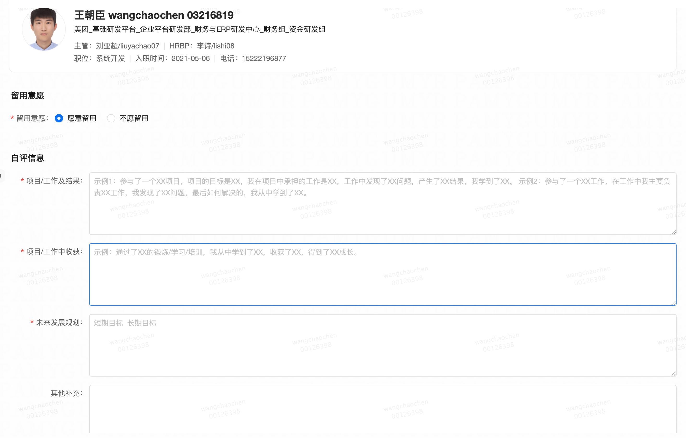

### 项目/工作及结果：

在过去两个月的时间里，我首先针对开发的基础知识以及公司的组件进行专项的学习训练，书写了近40篇学城文档，夯实了基础，为后续的开发做好了准备工作；
接着参加了债权融资项目的开发工作，项目的目标是实现业务审批流程的线上化，我在项目中承担的工作主要有两项，分别是从MQ中消费账户信息并按需存入数据库、开发接口提供账号信息数据（包含总、分、支行的数据信息）。通过本次项目的开发工作，我更加熟悉了整个开发流程，同时对公司的组件如Code、Crane、Lion、Mafka等通过项目的实际操作有了进一步的认识。

目前也正在参与理财项目的开发工作，通过理财项目，我完整参与了项目从需求到落地的产研流程，包括项目最初的PRD、到技术设计、再到实际开发等等，不仅是技术还有业务都得到了充分的学习。

并且，我在工作之余积极参与互联网+大学以及技术夜校等技术培训，学习理论知识的同时，还学习了很多技术大佬们对于实际操作中的优化经验；同时我还积极参与了资金组内资金运营公众号的日常治理工作，协助组里小伙伴完成运营工作。

### 项目/工作中收获：

- 首先是熟悉了财务与ERP研发中心、资金组的相关业务；对公司自研的开发组件及框架进行了熟悉；熟悉了公司的产研流程。

- 其次是学习养成了一些好的习惯：养成了坚持总结、勤做笔记的习惯，每日总结工作并做好次日规划；养成了主动积极的习惯，不断在工作之余拓展自己；同时会进行同实践结合的技术总结，文档总结逐渐书面化。

- 还有一些能力的提升：沟通能力的提升，同mentor、leader及同事间的交流，在开发中遇到问题可以较快的解决并进行处理；代码能力有了较大提升。

### 未来发展规划：

短期目标：

- 积极参与理财项目的开发工作，尽自己最大努力做出尽可能多的贡献，同时针对开发中遇到的问题进行专项补齐；
- 在进行需求开发的过程中，从实际落地的角度全方面思考可能出现的问题及异常，锻炼全面思考问题的能力；
- 在实际代码书写中锻炼自己的代码能力，不断进行代码review，优化代码结构，养成良好的代码风格；

长期目标：

- 继续熟悉业务，思考如何去设计开发系统，培养系统业务架构的规划设计能力；
- 阅读经典书籍，不断积累，从思想上提升自己；
- 持续理解和应用美团价值观，成为真正意义上的”美团人“

### 其他补充：

一些亮点：

- 有较强的自驱力，会自我驱动进行各方面知识的学习；
- 在学习上积极主动，会积极同mentor沟通自我培养，遇到问题会向同事主动请教；
- 性格比较外向，能较快融入团队，并较快参与到业务开发工作中；
- 能够坚持做到今日事今日毕，工作不拖沓，并能每日做好工作总结及明日计划；
- 有记录文档的习惯，同时工作之余会进行自我拓展，提升各方面能力。

一些不足：

- 对需求和业务的思考还不够，只知其然不知其所以然，不仅要知道how,what还要思考why ；
- 对业务的熟悉程度以及对技术理解的深度还不够；
- 记录文档以及表述能力有待加强；
- 编程能力、规范和思想还有很大的提升空间；
- 需要提升自己发现问题的能力，要学会提问。